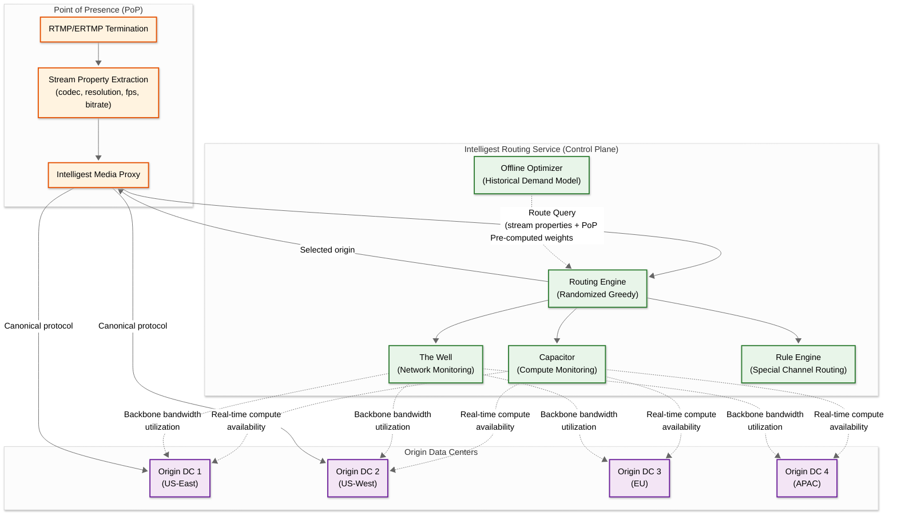
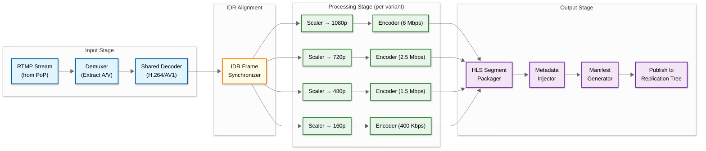
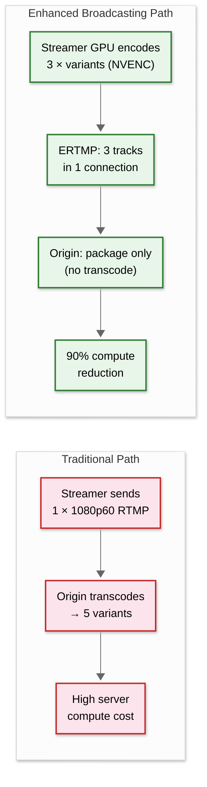
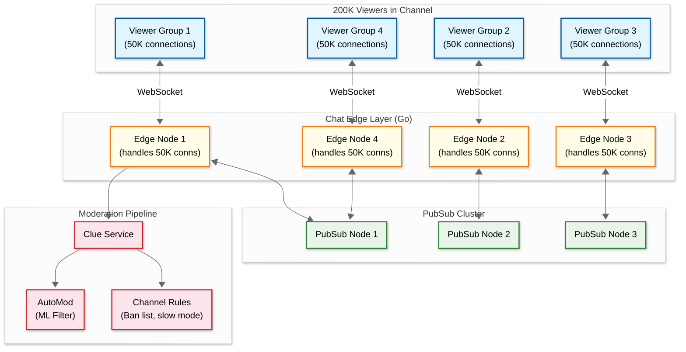

# Deep Dive & Bottlenecks

## 1. Critical Component #1: Intelligest — Live Video Ingest Routing

### Why Is This Critical?

The ingest layer is the **single point of entry** for all live video on the platform. If routing fails, streams either can't start or get assigned to overloaded origins, causing transcoding failures and viewer-facing quality degradation. Twitch retired HAProxy precisely because static routing couldn't handle the dynamic, bursty nature of live streaming traffic.

### How It Works Internally



**Key Design Decisions:**

1. **Randomized Greedy (not pure greedy)** — Pure greedy routing causes "herding": all PoPs simultaneously pick the same best origin, overloading it. Adding randomization among top-K candidates distributes load more evenly.

2. **Two-pronged capacity monitoring:**
   - **Capacitor** — Continuously polls origin DCs for available CPU/GPU compute slots. Detects capacity fluctuations (hardware failures, maintenance windows).
   - **The Well** — Monitors backbone network links between every PoP-Origin pair. Detects congestion, link failures, and bandwidth exhaustion.

3. **Offline + Online hybrid** — An offline optimization solver pre-computes baseline routing weights using historical demand patterns. The online randomized greedy algorithm adjusts these weights in real-time based on current capacity.

4. **Rule-based overrides** — Special channels (esports tournaments, Amazon-partnered events) can be pinned to specific origins with guaranteed capacity reservations.

5. **L3 DiffServ marking** — Live video traffic receives differentiated services markings for priority treatment over the private backbone.

### Failure Modes & Handling

| Failure Mode | Impact | Mitigation |
|-------------|--------|------------|
| IRS unavailable | PoPs can't get routing decisions | **Fallback**: PoPs use cached last-known-good routes + round-robin across origins |
| Origin DC capacity exhaustion | New streams can't be transcoded | Capacitor detects and removes DC from candidate pool; IRS re-routes to other origins |
| Backbone link failure | Streams on affected path drop | Well detects within seconds; IRS re-routes affected streams to alternate origins via different paths |
| PoP failure | Regional streamers can't connect | DNS-based failover redirects streamers to next-nearest PoP (anycast or GeoDNS) |
| Streamer sends unexpected codec | Transcoder can't process | Media proxy validates stream properties before forwarding; rejects unsupported codecs with error |

---

## 2. Critical Component #2: Real-Time Transcoding Pipeline

### Why Is This Critical?

Transcoding is the **most compute-intensive operation** in the entire platform. Every incoming stream must be decoded and re-encoded into 3-5 quality variants in real-time. Any processing delay directly increases glass-to-glass latency for all viewers. At 100K concurrent streams, this requires hundreds of thousands of CPU cores or specialized hardware.

### How It Works Internally



**Why Twitch Built a Custom Transcoder (Not FFmpeg):**

1. **IDR Frame Alignment** — FFmpeg encoders operate independently, causing misaligned IDR (keyframe) positions across variants. HLS requires aligned IDR frames for seamless ABR switching. Misalignment caused playback issues on devices like Chromecast (constant pausing). Twitch's custom transcoder uses a centralized IDR synchronizer.

2. **Shared Decoder** — FFmpeg's 1-in-1-out model runs N independent decoders for N variants. Twitch's design shares a single decoder across all variants, saving ~30% CPU.

3. **Intelligent Frame Rate Conversion** — Converting 60fps to 30fps by dropping every other frame is naive and produces visual artifacts. Twitch's transcoder uses motion-aware frame selection.

4. **Custom Metadata Injection** — Proprietary metadata structures embedded in HLS segments, parsed by the Twitch player for features like low-latency mode indicators, ad insertion markers, and clip timestamp alignment.

5. **ASIC-Based Transcoding (2023+)** — Twitch prototyped ASIC-based encoding hardware achieving **10x the scale** with improved quality per watt. This is the same trajectory as Google (YouTube) and Apple (silicon encoders).

### Enhanced Broadcasting: Client-Side Transcoding



### Failure Modes & Handling

| Failure Mode | Impact | Mitigation |
|-------------|--------|------------|
| Transcoder crash | Stream goes offline for viewers | Watchdog restarts transcoder within 2-3s; IRS can re-route stream to backup origin |
| CPU saturation | Increased latency, dropped frames | Autoscaling triggers; quality ladder reduction (drop highest variant first) |
| Corrupted input frames | Decoder errors, visual artifacts | Error concealment (repeat last good frame); stream health metrics alert streamer |
| ASIC hardware failure | Capacity reduction | Graceful fallback to CPU-based transcoding on same origin |
| ERTMP stream with missing tracks | Incomplete quality ladder | Fill missing variants with server-side transcode from highest available track |

---

## 3. Critical Component #3: Chat Fanout System (Edge + PubSub)

### Why Is This Critical?

Chat is Twitch's **core engagement mechanism** — it differentiates live streaming from video-on-demand. A popular channel with 200K concurrent viewers requires delivering every chat message to 200K WebSocket connections with sub-300ms latency. The system handles hundreds of billions of messages per day.

### How It Works Internally



**Hierarchical Fanout Design:**

The key insight is **two-level fanout** instead of single-level:

1. **PubSub Level** — When a message arrives, the Edge node publishes it to the PubSub cluster. PubSub knows which Edge nodes have subscribers for that channel and fans out to only those Edge nodes (not all edges). For a channel with 200K viewers across 4 Edge nodes, PubSub sends 4 copies.

2. **Edge Level** — Each Edge node then locally delivers the message to all connected viewers for that channel. An Edge node handling 50K connections for this channel sends 50K copies.

**Total messages generated:** 4 (PubSub) + 200K (Edge delivery) = ~200K
**Without hierarchy:** 200K messages directly from a single point = impossible at scale

**Go's Role in Chat:**

Twitch's migration from Python (Tornado) to Go for chat was driven by:
- **Goroutines** — One goroutine per WebSocket connection. 50K goroutines on a single Edge node is trivial for Go's scheduler.
- **Performance** — Go doubled throughput-per-thread versus the Python implementation.
- **Memory efficiency** — Each goroutine uses ~4KB stack (vs Python's heavier threads), enabling 100K+ connections per node.

**Chat Moderation Pipeline (Clue):**

```
Message arrives → Clue evaluates:
  1. Is sender banned in this channel? → Reject
  2. Is channel in slow mode? → Rate limit check
  3. Is channel in subscribers-only mode? → Check sub status
  4. Is channel in emote-only mode? → Validate content
  5. AutoMod ML filter → Toxicity / harassment score
  6. Custom word filter (channel-specific) → Regex match
  7. Link detection → Allow/deny based on channel settings
→ Result: ALLOW | DENY | HOLD_FOR_REVIEW
```

### Failure Modes & Handling

| Failure Mode | Impact | Mitigation |
|-------------|--------|------------|
| Edge node crash | Viewers on that node lose chat | Viewers auto-reconnect to different Edge node; connection state restored from Room service |
| PubSub node failure | Messages not delivered to some edges | PubSub cluster has replicas; remaining nodes take over channel subscriptions |
| Chat flood (raid/bot attack) | Legitimate messages delayed | Per-channel and per-user rate limiting; AutoMod escalation; follower-only/sub-only mode |
| Clue service slow/down | Messages delayed or unmoderated | **Circuit breaker**: If Clue is slow, allow messages with async moderation (delete retroactively) |
| Message ordering issues | Out-of-order messages in chat | Best-effort ordering via timestamps; exact ordering is not guaranteed (eventual consistency) |

---

## 4. Concurrency & Race Conditions

### 4.1 Subscription State During Stream

**Problem:** Viewer subscribes during a stream. Their entitlements (emotes, badge, ad-free) must be reflected in chat immediately, but the subscription is processed asynchronously through 40+ commerce microservices.

**Solution:**
```
1. Payment Service processes charge (strong consistency)
2. Subscription Service writes to database (ACID)
3. Event published: "subscription.created"
4. Chat entitlement cache updated (Redis) — async but fast (<500ms)
5. Chat Edge checks Redis for subscriber status on next message

Race window: ~500ms where user might not have subscriber badge.
Acceptable because it's transient and non-critical.
```

### 4.2 Viewer Count Accuracy

**Problem:** 2.5M concurrent viewers across thousands of Edge nodes. Maintaining an exact count requires global coordination (too expensive).

**Solution:** **Approximate counting with periodic reconciliation**
```
- Each Edge node maintains a local count per channel
- Every 15 seconds, Edge nodes report deltas to a centralized counter service
- Counter service aggregates and publishes updated counts
- Displayed counts may be off by ±5% at any moment
- Exact counts computed post-hoc for analytics
```

### 4.3 Clip Creation Race

**Problem:** Multiple viewers create clips from the same stream moment simultaneously.

**Solution:**
```
- Rate limit: 1 clip per user per channel per 60 seconds
- No deduplication of similar clips (different viewers, different perspectives)
- Clip references VOD timestamp — actual video data is shared
- Clip creation is idempotent per (user_id, channel_id, timestamp_range)
```

### 4.4 Concurrent Bit Cheers

**Problem:** During hype moments, thousands of viewers cheer Bits simultaneously. Each cheer must debit the viewer's balance and credit the streamer atomically.

**Solution:**
```
- Viewer's Bits balance stored in transactional database
- Each cheer: BEGIN → debit viewer → credit streamer → COMMIT
- Optimistic locking on viewer balance (CAS: Compare-And-Swap)
- If balance insufficient, transaction fails (no partial charges)
- Cheer animation rendered client-side immediately (optimistic UI)
- Background reconciliation catches any discrepancies
```

---

## 5. Slowest part of the process Analysis

### Slowest part of the process #1: Transcoding Compute at Peak

**Problem:** During major events (new game launches, esports finals), concurrent streams can spike 3-5x. Each stream requires ~5 vCPUs for 5-variant transcoding. At 100K concurrent streams → 500K vCPUs. At 300K concurrent (event spike) → 1.5M vCPUs.

**Mitigation Strategies:**
1. **Enhanced Broadcasting** — Offload transcoding to streamer's GPU. For streamers with capable hardware, origin only needs to package HLS segments (10x reduction in compute per stream).
2. **ASIC-based transcoding** — Custom hardware achieving 10x density vs CPU encoding. Already prototyped as of 2023.
3. **Quality ladder reduction** — Under pressure, reduce from 5 variants to 3 for non-partner channels. Partners always get full quality ladder.
4. **Capacity reservation** — For announced events, pre-reserve origin capacity and pre-warm ASIC pools.
5. **Overflow to cloud compute** — Burst to cloud-based GPU/CPU instances for unexpected spikes.

### Slowest part of the process #2: Chat Fanout for Mega-Channels

**Problem:** A channel with 500K+ concurrent viewers means every chat message must be delivered to 500K WebSocket connections. At 100 messages/second in chat, that's 50M message deliveries per second for one channel.

**Mitigation Strategies:**
1. **Message sampling for ultra-popular channels** — Above a threshold (e.g., 100K viewers), not every message is delivered to every viewer. A representative sample is shown, with subscriber/moderator/highlighted messages always included.
2. **Slow mode** — Reduce message rate in large channels (e.g., 1 message per 3 seconds per user).
3. **Edge-level batching** — Batch multiple chat messages into a single WebSocket frame (e.g., batch 10 messages every 100ms instead of sending individually).
4. **Geographic sharding of Edge nodes** — Viewers in EU connect to EU Edge nodes; fanout is localized first, then cross-region.
5. **Subscriber-only mode** — Dramatically reduces message volume while preserving community engagement.

### Slowest part of the process #3: Replication Tree Propagation Delay

**Problem:** HLS segments must propagate from origin through mid-tier to edge cache nodes before viewers can request them. Each hop adds latency. For viewers far from origins, propagation through 2-3 tiers can add 1-2 seconds to glass-to-glass latency.

**Mitigation Strategies:**
1. **Demand-based replication** — Only replicate to edge nodes that have active viewers for that stream. A stream with 10 viewers doesn't need global replication.
2. **Push-based propagation** — Don't wait for edge nodes to pull; origin proactively pushes segments to known high-demand edges.
3. **Edge-local caching** — Hot streams' segments cached in RAM at edge (not disk). RAM access is ~100x faster than disk.
4. **Segment pre-loading** — Begin transmitting next segment before the current one finishes playing (pipelining).
5. **Low-Latency HLS** — Twitch's 2021 migration cut latency from ~6s to ~2s by using partial segments (CMAF) and blocking playlist requests.

### Slowest part of the process #4: Database Write Amplification During Events

**Problem:** Major events trigger cascading write storms: stream go-live events, viewer count updates, chat message persistence, subscription/Bits transactions, follow surges — all hitting PostgreSQL simultaneously. The largest cluster at 300K+ TPS is already near capacity.

**Mitigation Strategies:**
1. **Write buffering** — Batch non-critical writes (viewer counts, analytics events) into 5-second windows; flush in bulk.
2. **Event bus decoupling** — Route writes through event bus (Kafka-like); database consumers process at their own rate.
3. **Sharded write paths** — Chat and Bits transactions write to time-partitioned tables; each partition handles a fraction of total writes.
4. **Read replica routing** — All read queries during events route to replicas; primary handles writes only.
5. **Materialized counters** — Maintain pre-computed counters (viewer count, follower count) in Redis; persist to DB asynchronously.

### Slowest part of the process #5: Go-Live Thundering Herd

**Problem:** When a popular streamer (500K+ followers) goes live, notification delivery triggers a simultaneous flood of viewers all requesting the same stream. The first HLS segments aren't cached yet, so all requests hit the origin.

**Mitigation Strategies:**
1. **Request coalescing** — When multiple edge nodes request the same segment simultaneously, origin processes only one request and multicasts the response.
2. **Predictive pre-warming** — For streamers with schedules, pre-warm edge caches 5 minutes before scheduled start time.
3. **Staggered notification delivery** — Spread notifications over 30-60 seconds instead of all at once.
4. **Cache stampede protection** — Use probabilistic early expiration; random subset of edges request refresh slightly before TTL.
5. **Fallback thumbnail** — Show "stream starting..." placeholder while first segments propagate, rather than returning errors.

---

## 6. Case Study: Breaking the Monolith at Twitch

### Background

Twitch started as a Ruby on Rails monolith. By 2022, the monolith had grown to a point where:
- Build times exceeded 30 minutes
- A single bug could take down the entire platform
- Teams couldn't deploy independently
- Database schemas were tightly coupled

### Migration Strategy

| Phase | Approach | Services Extracted | Duration |
|-------|---------|-------------------|----------|
| **Phase 1: Strangler Fig** | Intercept API calls at gateway; route to new Go services | Auth, User Profile, Follows | 2019-2020 |
| **Phase 2: Domain extraction** | Identify bounded contexts; extract with event bus | Commerce (40+ services), Chat, VOD | 2020-2022 |
| **Phase 3: Data migration** | Split shared database into per-service databases | Subscription DB, Chat DB, Analytics DB | 2021-2023 |
| **Phase 4: Event-driven** | Replace synchronous calls with event bus | Notification, Discovery, Analytics | 2022-2024 |

### Key Decisions and Outcomes

| Decision | Rationale | Outcome |
|----------|-----------|---------|
| Go as primary language | Concurrency model (goroutines), performance, simple deployment | Chat Edge handles 50K connections per node |
| PostgreSQL (keep) | Already scaled to 300K TPS; deep operational expertise | 125 hosts; sharded where needed |
| Event bus (not REST) for inter-service | Decoupling; at-least-once delivery; replay capability | 3M events/s flowing through Spade |
| IRC protocol (keep) for chat | Backward compatibility with 25K+ third-party apps | Smooth migration; no client changes |

### Lessons Learned

1. **Extract the highest-risk component first** — Commerce (payment processing) was extracted early because a monolith bug affecting subscriptions meant revenue loss
2. **Shared database is the real monolith** — Service extraction is incomplete until the database is split; shared schemas create hidden coupling
3. **Event bus is the backbone** — The event bus became the central nervous system; invest heavily in its reliability
4. **Don't rewrite, strangle** — Gradual migration avoids big-bang risk; old and new systems coexist during transition

---

## 7. Performance Optimization Techniques

### Client-Side Optimizations

| Technique | Component | Impact |
|-----------|-----------|--------|
| **Segment pre-fetching** | Player | Fetch next 2-3 segments while current plays; eliminates fetch latency |
| **ABR bandwidth estimation** | Player | Exponentially weighted moving average of download speeds; smooth quality transitions |
| **WebSocket message batching** | Chat client | Buffer outgoing messages for 50ms; send as batch to reduce frame overhead |
| **Canvas-based chat rendering** | Chat UI | Render chat messages on HTML canvas instead of DOM; 60fps at 1K+ messages/s |
| **Lazy emote loading** | Chat UI | Load emote images on first use, not page load; reduces initial page weight by 40% |
| **Service worker caching** | Web client | Cache static assets (UI, emotes, badges) in service worker; faster page loads |

### Server-Side Optimizations

| Technique | Component | Impact |
|-----------|-----------|--------|
| **Zero-copy segment delivery** | Edge | Use sendfile() to deliver HLS segments directly from kernel buffer to socket |
| **Connection pooling** | All services | Reuse gRPC connections between services; avoid TLS handshake per request |
| **Hot-stream RAM cache** | Edge | Top 1% of streams cached entirely in RAM; 100x faster than disk |
| **Batch writes** | Analytics (Spade) | Batch 1000 events per write to data lake; reduces IOPS by 1000x |
| **Connection draining** | Chat Edge | On planned shutdown, gracefully migrate connections over 30s; no message loss |
| **Goroutine pooling** | Chat Edge | Pre-allocated goroutine pool per channel; avoids GC pressure from spawn/destroy |

### Encoding Optimizations

| Technique | Encoding Stage | Impact |
|-----------|---------------|--------|
| **Content-adaptive encoding** | Transcoder | Analyze scene complexity; allocate more bits to complex scenes, fewer to static |
| **Tile-based encoding** | AV1 transcoder | Encode frame in parallel tiles; reduces encode latency |
| **Rate control tuning** | All codecs | VBR with constrained bitrate ceiling; better quality per bit than CBR |
| **Look-ahead** | H.264/HEVC | 2-frame look-ahead for better motion estimation; adds 66ms latency |
| **Perceptual optimization** | All codecs | Allocate bits to regions humans focus on (faces, text); reduce bits in background |

---

## 8. Ad Insertion Architecture

### Server-Side Ad Insertion (SSAI)

```
ALGORITHM InsertAdBreak(stream_id, ad_duration_seconds, ad_creative_url)
  // SSAI: ads are stitched into HLS manifest, not client-side

  // Step 1: Signal ad break in stream
  ad_break_id ← GENERATE_UUID()
  ad_start_segment ← current_segment_number(stream_id)

  // Step 2: For each viewer, select personalized ad
  FOR EACH viewer IN active_viewers(stream_id):
    ad_creative ← ad_decision_service.select(
      viewer_id: viewer.id,
      channel_category: stream.category,
      geo: viewer.geo,
      device: viewer.device_type,
      ad_duration: ad_duration_seconds
    )

    // Step 3: Modify viewer's HLS manifest to splice ad segments
    viewer_manifest ← get_manifest(stream_id, viewer.id)
    ad_segments ← transcode_ad(ad_creative, stream.quality_variants)
    viewer_manifest.splice(ad_start_segment, ad_segments)

    // Step 4: Resume live content after ad
    // Viewer catches up to live or continues from where they left off
    viewer_manifest.resume_live_at(ad_start_segment + ad_segment_count)

  // Step 5: Track impressions
  FOR EACH impression IN ad_impressions(ad_break_id):
    event_bus.publish("ad.impression", {
      ad_break_id, viewer_id, creative_id, duration_viewed,
      quartile_reached  // 25%, 50%, 75%, 100%
    })
```

### Ad Break Timing

| Trigger | Source | Typical Duration | Frequency |
|---------|--------|-----------------|-----------|
| **Pre-roll** | Automatic (new viewer joins) | 15-30s | Once per viewer session |
| **Mid-roll (manual)** | Streamer presses button | 30-180s | At streamer's discretion |
| **Mid-roll (automatic)** | Platform schedule | 60-90s | Every 30-60 min (configurable) |
| **Companion ad** | Alongside stream | Persistent | Banner/overlay during stream |
