# Observability

## 1. Metrics (USE/RED Framework)

### 1.1 Video Pipeline Metrics

| Metric | Type | Description | Alert Threshold |
|--------|------|-------------|-----------------|
| `ingest.streams.active` | Gauge | Currently active live streams | N/A (informational) |
| `ingest.connection.success_rate` | Rate | % of RTMP connections successfully established | < 99% → P2 |
| `ingest.routing.latency_ms` | Histogram | Time for IRS to return routing decision | p99 > 100ms → P3 |
| `transcode.queue.depth` | Gauge | Streams waiting for transcoding slots | > 50 → P2 |
| `transcode.latency.segment_ms` | Histogram | Time to transcode one 2s segment | p99 > 1800ms → P1 (real-time breach) |
| `transcode.error_rate` | Rate | % of segments failing transcoding | > 0.1% → P2 |
| `cdn.segment.request_rate` | Rate | HLS segment requests per second | N/A (capacity planning) |
| `cdn.cache.hit_rate` | Gauge | Edge cache hit ratio | < 85% → P3 |
| `cdn.segment.latency_ms` | Histogram | Time to serve HLS segment to viewer | p99 > 200ms → P3 |
| `player.rebuffer.rate` | Rate | % of viewers experiencing rebuffering | > 1% → P2 |
| `player.glass_to_glass.latency_s` | Histogram | End-to-end latency (encoder → viewer) | p99 > 5s → P2 |
| `player.bitrate.avg_kbps` | Gauge | Average delivered bitrate | < 1500 kbps → P3 |

### 1.2 Chat Metrics

| Metric | Type | Description | Alert Threshold |
|--------|------|-------------|-----------------|
| `chat.messages.rate` | Rate | Messages per second (global) | N/A (informational) |
| `chat.edge.connections` | Gauge | Active WebSocket connections per Edge node | > 45K → auto-scale |
| `chat.edge.connection_errors` | Rate | Failed connection attempts | > 1% → P3 |
| `chat.delivery.latency_ms` | Histogram | Send-to-deliver latency | p99 > 500ms → P2 |
| `chat.pubsub.fanout.latency_ms` | Histogram | PubSub distribution latency | p99 > 100ms → P3 |
| `chat.moderation.latency_ms` | Histogram | Clue evaluation latency | p99 > 200ms → P3 |
| `chat.moderation.blocked_rate` | Rate | % of messages blocked by AutoMod | Spike > 3x baseline → investigate |
| `chat.messages.dropped` | Counter | Messages dropped (queue overflow) | > 0 sustained → P2 |

### 1.3 Commerce Metrics

| Metric | Type | Description | Alert Threshold |
|--------|------|-------------|-----------------|
| `commerce.subscriptions.active` | Gauge | Total active subscriptions | N/A (business metric) |
| `commerce.subscription.purchase_latency_ms` | Histogram | Time from click to confirmation | p99 > 3s → P2 |
| `commerce.bits.purchase_rate` | Rate | Bits purchases per second | Drop > 50% → P1 |
| `commerce.payment.success_rate` | Gauge | Payment processing success rate | < 98% → P1 |
| `commerce.payment.error_rate` | Rate | Payment failures (by error type) | > 2% → P2 |
| `commerce.revenue.per_minute` | Gauge | Revenue rate (subscriptions + bits + ads) | Drop > 30% → P1 |

### 1.4 Infrastructure Metrics (USE)

| Component | Utilization | Saturation | Errors |
|-----------|-------------|------------|--------|
| **Transcoding servers** | CPU %, GPU % | Queue depth, pending encodes | Encoding failures, segment drops |
| **Chat Edge nodes** | CPU %, memory %, connection count | Connection queue depth | Connection errors, message drops |
| **PostgreSQL** | CPU %, disk I/O, connections used | Replication lag (seconds) | Transaction errors, deadlocks |
| **Redis** | Memory %, CPU % | Evictions/sec, key miss rate | Connection errors, OOM events |
| **Event Bus** | Broker CPU, disk I/O | Consumer lag (messages behind) | Produce/consume errors |
| **Object Storage** | N/A (managed) | Request throttling events | 5xx errors, timeout rate |

### 1.5 Key Dashboards

| Dashboard | Audience | Key Widgets |
|-----------|----------|-------------|
| **Live Platform Health** | On-call, leadership | Concurrent viewers, active streams, global latency map, error rate |
| **Video Pipeline** | Video engineering | Ingest success rate, transcoding queue, CDN cache hit rate, rebuffer rate |
| **Chat Health** | Chat/community team | Messages/second, connection count, moderation queue depth, delivery latency |
| **Commerce** | Commerce team, finance | Revenue rate, subscription count, Bits volume, payment failure rate |
| **Origin Capacity** | Infrastructure team | Per-DC compute utilization, network utilization, IRS routing distribution |

---

## 2. Logging

### 2.1 What to Log

| Service | Log Events | Volume |
|---------|-----------|--------|
| **Ingest Proxy** | Stream connect/disconnect, auth success/failure, routing decision, codec negotiation | ~200K events/min |
| **Transcoder** | Segment start/complete, encoding errors, quality changes, IDR alignment | ~500K events/min |
| **Chat Edge** | Connection open/close, message sent (sampled), moderation actions | ~1M events/min |
| **API Gateway** | Request/response (status, latency, user, endpoint, method) | ~3M events/min |
| **Commerce** | Purchase attempt, payment success/failure, subscription lifecycle | ~50K events/min |
| **Auth** | Login success/failure, token issuance/revocation, stream key validation | ~100K events/min |

### 2.2 Log Levels Strategy

| Level | Usage | Examples | Retention |
|-------|-------|---------|-----------|
| **ERROR** | Unexpected failures requiring attention | Transcoding crash, payment double-charge, database connection failure | 90 days |
| **WARN** | Degraded but functional | High replication lag, cache eviction spike, slow moderation response | 30 days |
| **INFO** | Normal significant events | Stream started, subscription created, user banned | 14 days |
| **DEBUG** | Detailed diagnostic (sampled) | ABR decision, routing score calculation, message enrichment | 3 days (sampled 1%) |

### 2.3 Structured Logging Format

```
{
  "timestamp": "2026-03-08T14:30:00.123Z",
  "level": "INFO",
  "service": "chat-edge",
  "instance_id": "edge-us-east-042",
  "trace_id": "abc123def456",
  "span_id": "span789",
  "event": "message.delivered",
  "channel_id": "12345",
  "message_id": "uuid-xxx",
  "user_id": "67890",       // Pseudonymized after 24h
  "latency_ms": 45,
  "edge_node": "us-east-1a",
  "fanout_count": 15234,
  "moderation_result": "ALLOW",
  "tags": {
    "is_subscriber": true,
    "has_bits": false,
    "channel_size": "large"  // Categorical, not exact count
  }
}
```

### 2.4 Log Pipeline

```
┌──────────────┐     ┌──────────────┐     ┌──────────────┐
│   Services   │────▶│  Log Agent   │────▶│  Event Bus   │
│  (stdout)    │     │  (Sidecar)   │     │  (Buffered)  │
└──────────────┘     └──────────────┘     └──────┬───────┘
                                                  │
                          ┌───────────────────────┼────────────────┐
                          ▼                       ▼                ▼
                   ┌──────────────┐     ┌──────────────┐   ┌──────────────┐
                   │  Real-Time   │     │  Search &    │   │  Long-Term   │
                   │  Alerting    │     │  Analysis    │   │  Archive     │
                   │  Engine      │     │  (OpenSearch)│   │  (S3/Glacier)│
                   └──────────────┘     └──────────────┘   └──────────────┘
```

---

## 3. Distributed Tracing

### 3.1 Trace Propagation Strategy

```
Viewer request → API Gateway → Service → Database
                     │
                     └─ trace_id: generated at entry point
                        propagated via:
                          HTTP header: X-Trace-Id
                          gRPC metadata: trace_id
                          Event Bus header: trace_id
                          Chat message metadata: trace_id (sampled)

Sampling Strategy:
  - 100% for errors (always trace failures)
  - 100% for commerce transactions (always trace payments)
  - 10% for API requests (sample normal traffic)
  - 1% for chat messages (high volume, sample aggressively)
  - 100% for video ingest routing decisions (critical path)
```

### 3.2 Key Spans to Instrument

```mermaid
%%{init: {'theme': 'neutral', 'look': 'neo'}}%%
flowchart LR
    subgraph VideoTrace["Video Delivery Trace"]
        VT1["RTMP Connect<br/>(PoP)"]
        VT2["IRS Route<br/>Decision"]
        VT3["Transcode<br/>Segment"]
        VT4["CDN<br/>Propagation"]
        VT5["Viewer<br/>Segment Fetch"]
    end

    subgraph ChatTrace["Chat Message Trace"]
        CT1["WebSocket<br/>Receive"]
        CT2["Clue<br/>Evaluate"]
        CT3["PubSub<br/>Publish"]
        CT4["Edge<br/>Fanout"]
        CT5["WebSocket<br/>Deliver"]
    end

    subgraph CommerceTrace["Subscription Purchase Trace"]
        ST1["API<br/>Request"]
        ST2["Auth<br/>Validate"]
        ST3["Payment<br/>Process"]
        ST4["Entitlement<br/>Grant"]
        ST5["Notification<br/>Send"]
    end

    VT1 --> VT2 --> VT3 --> VT4 --> VT5
    CT1 --> CT2 --> CT3 --> CT4 --> CT5
    ST1 --> ST2 --> ST3 --> ST4 --> ST5

    classDef video fill:#e8f5e9,stroke:#2e7d32,stroke-width:2px
    classDef chat fill:#fffde7,stroke:#f57f17,stroke-width:2px
    classDef commerce fill:#fce4ec,stroke:#c62828,stroke-width:2px

    class VT1,VT2,VT3,VT4,VT5 video
    class CT1,CT2,CT3,CT4,CT5 chat
    class ST1,ST2,ST3,ST4,ST5 commerce
```



### 3.3 Critical Trace Scenarios

| Scenario | Spans | Purpose |
|----------|-------|---------|
| **Stream startup** | PoP connect → IRS route → Origin assign → First segment generated | Diagnose slow stream starts |
| **Viewer rebuffer** | Segment request → Edge lookup → Origin fetch → Response | Root-cause rebuffering events |
| **Chat delay** | Message receive → Clue evaluate → PubSub publish → Edge deliver | Diagnose chat latency spikes |
| **Subscription flow** | Purchase click → Auth → Payment → Entitlement → Chat badge | Trace failed subscription purchases |
| **Clip creation** | API request → VOD segment extraction → Transcode → Storage → URL return | Diagnose slow clip generation |

---

## 4. Alerting

### 4.1 Critical Alerts (Page-Worthy)

| Alert | Condition | Severity | Escalation |
|-------|-----------|----------|------------|
| **Ingest failure spike** | Stream connection failure rate > 5% for 2 min | P1 | On-call → Video team lead (10 min) |
| **Transcoding backlog** | Queue depth > 100 for 5 min | P1 | On-call → Infrastructure lead (10 min) |
| **CDN segment errors** | 5xx rate > 1% for 3 min | P1 | On-call → Edge team lead (10 min) |
| **Chat service down** | Chat connections dropping > 10%/min | P1 | On-call → Chat team lead (5 min) |
| **Payment failures** | Payment success rate < 95% for 5 min | P1 | On-call → Commerce team lead (5 min) |
| **Revenue anomaly** | Revenue drops > 40% vs same-hour-last-week | P1 | On-call → Business ops (15 min) |
| **Database primary down** | Primary heartbeat missed for 30s | P1 | On-call → DBA (immediate) |

### 4.2 Warning Alerts

| Alert | Condition | Severity | Action |
|-------|-----------|----------|--------|
| **High latency** | Glass-to-glass p99 > 4s for 10 min | P2 | Investigate CDN propagation |
| **Chat delivery slow** | Chat delivery p99 > 500ms for 5 min | P2 | Check PubSub cluster health |
| **Cache hit rate drop** | CDN cache hit rate < 80% for 15 min | P3 | Check for cache invalidation storm |
| **Replication lag** | DB replica lag > 5s for 5 min | P3 | Check write volume / replica health |
| **API error rate** | API 5xx > 0.5% for 10 min | P3 | Check service health, recent deployments |
| **Disk space** | Any host > 85% disk usage | P3 | Investigate, clean logs, extend volume |

### 4.3 Runbook References

| Alert | Runbook | Key Steps |
|-------|---------|-----------|
| Ingest failure spike | `runbook/video/ingest-failures` | 1. Check IRS health 2. Check PoP connectivity 3. Check origin capacity |
| Transcoding backlog | `runbook/video/transcode-backlog` | 1. Check CPU saturation 2. Scale origin fleet 3. Enable quality ladder reduction |
| Chat service down | `runbook/chat/service-down` | 1. Check Edge node health 2. Check PubSub cluster 3. Verify DNS resolution |
| Payment failures | `runbook/commerce/payment-failures` | 1. Check payment processor status 2. Check API gateway 3. Switch to backup processor |
| Database failover | `runbook/data/postgres-failover` | 1. Verify standby is caught up 2. Promote standby 3. Update connection strings 4. Verify replication |

### 4.4 Alert Noise Reduction

```
Strategies:
  1. Alert grouping: Group alerts by service + region
  2. Alert suppression: Suppress downstream alerts when root cause detected
     (e.g., if IRS is down, suppress individual PoP routing alerts)
  3. Dynamic thresholds: Use statistical anomaly detection instead of
     static thresholds (e.g., viewer count varies by time of day)
  4. Maintenance windows: Suppress alerts during planned maintenance
  5. Alert fatigue monitoring: Track alert-to-action ratio;
     tune alerts with < 30% action rate
```

---

## 5. Data Pipeline Observability (Spade)

Twitch's data ingestion system (Spade) processes **3 million events per second** into the data lake. Observability for this pipeline is critical:

| Metric | Description | Alert |
|--------|-------------|-------|
| `spade.events.ingested_rate` | Events per second entering Spade | Drop > 30% → P2 |
| `spade.events.dropped_rate` | Events lost due to processing errors | > 0.01% → P3 |
| `spade.lag.seconds` | Consumer lag (how far behind real-time) | > 60s → P2 |
| `spade.schema.violations` | Events failing schema validation | Spike → investigate upstream service |
| `spade.storage.write_latency_ms` | Time to persist to data lake | p99 > 5s → P3 |

---

## 6. SLI/SLO Framework

### Service Level Indicators

| SLI | Definition | Measurement |
|-----|-----------|-------------|
| **Ingest availability** | % of time PoPs successfully accept RTMP connections | Synthetic probes from each region every 30s |
| **Glass-to-glass latency** | Time from streamer's camera to viewer's screen | End-to-end probes using reference stream |
| **Segment delivery success** | % of HLS segment requests returning 200 within 500ms | Edge-side request logging |
| **Chat delivery latency** | p99 time from message send to delivery at recipient | Client-instrumented round-trip measurement |
| **Transcoding start time** | Time from RTMP connect to first HLS segment available | Server-side instrumented timing |
| **VOD availability** | % of VOD requests served successfully within 2s | Request success rate at CDN edge |

### SLO Definitions

| SLO | Target | Error Budget (30-day) | Burn Rate Alert |
|-----|--------|----------------------|--------------------|
| Ingest availability | 99.99% | 4.3 min downtime | 10x burn → page in 6 min |
| Glass-to-glass p99 <4s | 99.5% | 3.6 hours equivalent | 3x burn → page in 4 hours |
| Segment delivery success | 99.9% | 43 min of degradation | 5x burn → page in 2 hours |
| Chat delivery p99 <500ms | 99.5% | 3.6 hours equivalent | 3x burn → page in 4 hours |
| Transcoding start <10s | 99.9% | 43 min | 5x burn → page in 2 hours |

### Error Budget Policy

```
ALGORITHM ErrorBudgetPolicy(slo, current_budget_remaining)
  IF current_budget_remaining < 10%:
    // Budget nearly exhausted
    FREEZE non-critical deployments
    REQUIRE senior approval for any changes to affected service
    PAGE SLO owner for review

  IF current_budget_remaining < 0%:
    // Budget exhausted — reliability mode
    ALL engineering effort on affected service goes to reliability
    NO feature work until budget recovers to 25%
    Post-incident review required for each SLO violation

  IF current_budget_remaining > 50%:
    // Healthy budget — normal operations
    Feature velocity is primary goal
    Consider investing budget on risky but valuable changes
```

---

## 7. Video Quality Monitoring

### Player-Side Quality Metrics

| Metric | Description | Good | Degraded | Critical |
|--------|-------------|------|----------|----------|
| **Rebuffer rate** | % of playback time spent buffering | <0.5% | 0.5-2% | >2% |
| **Rebuffer frequency** | Rebuffers per hour of viewing | <1 | 1-3 | >3 |
| **Time to first frame** | Time from click-to-play to first video frame | <2s | 2-5s | >5s |
| **Bitrate delivered** | Average bitrate viewer receives | >80% of selected | 50-80% | <50% |
| **ABR switches** | Quality level changes per minute | <2 | 2-5 | >5 |
| **Video start failures** | % of play attempts that fail to start | <0.5% | 0.5-1% | >1% |

### Quality of Experience Dashboard

```
┌──────────────────────────────────────────────────────────────┐
│ Video Quality of Experience - Global (Last 1h)                │
├──────────────────────────────────────────────────────────────┤
│ Active Viewers: 2.8M    │  Active Streams: 95K               │
│ Avg Bitrate: 4.2 Mbps   │  Rebuffer Rate: 0.3% ● Healthy    │
├──────────────────────────────────────────────────────────────┤
│ Time to First Frame:                                          │
│   p50: 0.8s  p95: 2.1s  p99: 4.5s ● OK                     │
│                                                               │
│ Rebuffer by Region:                                           │
│   NA:   0.2% ●    EU: 0.3% ●    APAC: 0.8% ⚠              │
│   LATAM: 1.2% ⚠   Africa: 2.5% ⚠⚠                         │
│                                                               │
│ ABR Distribution:                                             │
│   Source (1080p60): ██████████████████████████  25%           │
│   High (720p60):    ████████████████████████████████████  35% │
│   Medium (480p30):  ████████████████████  20%                │
│   Low (360p30):     ██████████  12%                          │
│   Mobile (160p30):  ██████  8%                               │
│                                                               │
│ Playback Errors (last 1h): 1,240 (0.04%) ● OK               │
│   - Segment 404: 520                                         │
│   - Decode error: 340                                        │
│   - Network timeout: 280                                     │
│   - DRM error: 100                                           │
└──────────────────────────────────────────────────────────────┘
```

---

## 8. Chat Health Monitoring

### Per-Channel Chat Metrics

| Metric | Small Channel | Large Channel | Mega Channel |
|--------|--------------|--------------|-------------|
| **Messages/sec** | <5 | 5-100 | 100-5K+ |
| **Edge nodes serving** | 1 | 1-4 | 8+ |
| **Moderation actions/min** | <1 | 1-50 | 50-500 |
| **Message drop rate** | 0% | 0% | 0-5% (sampling) |
| **Delivery latency p99** | <50ms | <200ms | <500ms |

### Chat System Health Indicators

| Indicator | Healthy | Warning | Critical |
|-----------|---------|---------|----------|
| **Edge node connection count** | <40K per node | 40-50K | >50K |
| **PubSub fanout latency** | <10ms | 10-50ms | >50ms |
| **Moderation queue depth** | <100 | 100-1000 | >1000 |
| **IRC parse errors** | 0 | <10/min | >10/min |
| **WebSocket frame errors** | 0 | <100/min | >100/min |

---

## 9. End-to-End Latency Tracing

### Glass-to-Glass Latency Breakdown

```
Full latency budget for live stream (target: <4s glass-to-glass):

  Streamer Side:
    Camera capture → encoder input              ~33 ms (1 frame at 30fps)
    Encode (H.264/NVENC)                        ~50-100 ms (2-3 frames)
    RTMP send to PoP                            ~10-30 ms (network)
    ─────────────────────────────────────────── ~100-160 ms

  Ingest:
    PoP receive + Media Proxy                   ~5-10 ms
    IRS routing decision                        ~1-2 ms
    PoP → Origin relay                          ~20-50 ms (network)
    ─────────────────────────────────────────── ~30-60 ms

  Processing:
    Decode + Transcode (shared decoder)         ~100-200 ms
    HLS segment packaging                       ~50-100 ms
    Segment available at origin                 wait for segment boundary (0-2000 ms!)
    ─────────────────────────────────────────── ~150-2300 ms

  Delivery:
    Origin → Edge push                          ~20-80 ms (geography dependent)
    Edge cache write                            ~1-5 ms (RAM for hot streams)
    ─────────────────────────────────────────── ~25-85 ms

  Viewer Side:
    Player requests segment                     ~10-50 ms
    Network delivery                            ~10-50 ms
    Decode + render                             ~33-66 ms (1-2 frames)
    ─────────────────────────────────────────── ~55-170 ms

  Total glass-to-glass:                        ~0.4-2.8s (typical ~2s with LL-HLS)
  Biggest variable: segment boundary wait (0-2s)
  LL-HLS with partial CMAF reduces this to 0-0.33s
```

### Trace Sampling Strategy

| Condition | Sample Rate | Reason |
|-----------|-------------|--------|
| Stream startup (go-live) | 100% | Critical user journey; always trace |
| Viewer rebuffer event | 100% | Quality issue; always diagnose |
| Commerce transactions | 100% | Revenue-impacting; always trace |
| Chat moderation actions | 10% | High volume but important for accuracy |
| Normal segment delivery | 0.1% | Very high volume |
| Normal chat messages | 0.01% | Extremely high volume |
| Error responses (any service) | 100% | Always trace errors |
