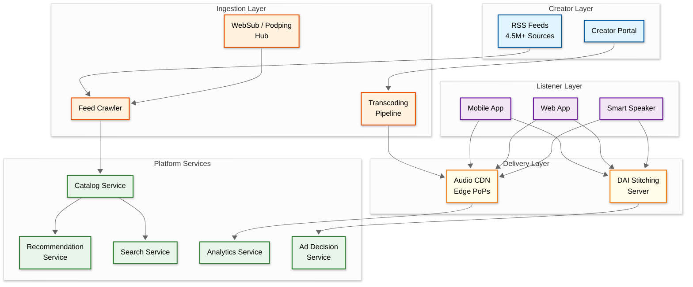

# 5.8 Podcast Platform - System Design

## Overview

A podcast platform enables creators to publish, distribute, and monetize audio content while providing listeners with personalized discovery, seamless streaming, and offline playback. Unlike walled-garden media platforms, podcasting is built on the open RSS standard—creating unique architectural challenges around feed ingestion, content synchronization, and cross-platform interoperability. The platform must ingest millions of RSS feeds, transcode and cache audio globally, measure consumption per IAB standards, and serve dynamically inserted ads—all while keeping the open, federated nature of podcasting intact.

## Key Characteristics

| Characteristic | Description |
|----------------|-------------|
| **Read/Write Ratio** | ~100:1 (heavy read—millions stream, thousands publish) |
| **Workload Type** | Read-heavy, large-file sequential streaming |
| **Latency Sensitivity** | Medium (playback start < 2s, feed freshness < 15 min) |
| **Data Volume** | Petabytes of audio, billions of playback events/day |
| **Federation** | RSS-based open protocol; must interoperate with the ecosystem |
| **Measurement** | IAB 2.2 compliant analytics; download ≠ listen |
| **Monetization** | Dynamic Ad Insertion (DAI) with server-side stitching |
| **AI Features** | Transcription, auto-chapters, semantic search, recommendations |

## Complexity Rating

**High** — Combines large-scale media delivery (audio CDN), open protocol federation (RSS crawling at scale), real-time ad decisioning (DAI), ML-driven discovery, and strict measurement compliance (IAB 2.2).

## Quick Navigation

| Document | Description |
|----------|-------------|
| [01 - Requirements & Estimations](./01-requirements-and-estimations.md) | Functional/non-functional requirements, capacity planning, SLOs |
| [02 - High-Level Design](./02-high-level-design.md) | Architecture diagrams, data flow, key decisions |
| [03 - Low-Level Design](./03-low-level-design.md) | Data model, API design, algorithms (Step-by-step plan in plain English) |
| [04 - Deep Dive & Bottlenecks](./04-deep-dive-and-bottlenecks.md) | RSS ingestion engine, DAI pipeline, recommendation system |
| [05 - Scalability & Reliability](./05-scalability-and-reliability.md) | Scaling strategies, fault tolerance, disaster recovery |
| [06 - Security & Compliance](./06-security-and-compliance.md) | Auth, content protection, IAB compliance, GDPR |
| [07 - Observability](./07-observability.md) | Metrics, logging, tracing, alerting |
| [08 - Interview Guide](./08-interview-guide.md) | Pacing, trap questions, trade-offs, anti-patterns |

## Why This Problem Is Architecturally Unique

| Dimension | What Makes It Different |
|-----------|------------------------|
| **Open Protocol Federation** | RSS-based — must ingest from 4.5M+ independent sources you don't control |
| **Measurement ≠ Consumption** | "Downloaded" ≠ "listened" — IAB 2.2 standard defines unique counting rules |
| **Ad Insertion in Playback Path** | SSAI sits on the critical path with a sub-200ms latency budget |
| **Long-Tail Distribution** | Top 1% drives ~50% of plays, but the other 99% must still be discoverable and deliverable |
| **Multi-Modal Evolution** | Video podcasting (YouTube #1 at 39% share) is transforming audio-first into audio+video |
| **AI Content Creation** | Text-to-podcast (NotebookLM-style) blurring the line between authored and generated content |
| **Privacy-First Measurement** | Post-cookie world demands cohort-based analytics without individual tracking |

## Key Technical Challenges

1. **RSS Feed Ingestion at Scale** — Polling 4.5M+ feeds with adaptive scheduling, WebSub/Podping for real-time updates
2. **Audio CDN & Transcoding** — Multi-format transcoding pipeline, global edge delivery, progressive download optimization
3. **IAB 2.2 Compliant Analytics** — Distinguishing downloads from listens, bot filtering, byte-range deduplication
4. **Dynamic Ad Insertion** — Server-side ad stitching with sub-second decisioning, frequency capping, attribution
5. **Episode Discovery & Search** — AI-powered transcription, semantic search, graph-based recommendations
6. **Offline Sync & Playback** — Episode download management, playback position sync across devices
7. **Video Podcast Delivery** — Dual-track audio+video pipeline, adaptive bitrate streaming, bandwidth-aware playback
8. **AI Content Moderation** — Deepfake audio detection, copyright fingerprinting, hate speech classification at scale

## Industry Context & Evolution (2024-2026)

| Metric | Value |
|--------|-------|
| Global Podcast Listeners | ~584M (2025), ~619M projected (2026) |
| Total Podcasts Worldwide | 4.58M+ (Jan 2026) |
| Global Ad Revenue | ~$4.5B (2025) |
| Top Platform Share | YouTube 39%, Spotify 21%, Apple Podcasts 15% |
| DAI Adoption | 80%+ of top-tier podcasts support DAI |
| AI Transcription | Whisper-based models dominating, 99 languages supported |

### Key Industry Shifts (2025-2026)

| Trend | Impact on Architecture |
|-------|----------------------|
| **YouTube = #1 Podcast Platform** | Must support video podcasting; dual audio+video pipeline |
| **AI-Generated Podcasts** | Text-to-podcast (NotebookLM-style) creates new content stream; deepfake detection needed |
| **Podcast 2.0 Namespace** | Enhanced RSS tags for transcripts, chapters, value4value payments, live items |
| **Privacy-First Measurement** | Cohort-based analytics replacing individual tracking; differential privacy |
| **Creator Monetization Diversification** | Subscriptions, value4value (Lightning Network), tiered DAI — beyond ad-only models |
| **Spotify Open Ecosystem Pivot** | Spotify moving from exclusive content to open platform; RSS feeds returning |
| **Apple Subscription Podcasts** | Per-show paid subscriptions via RSS `<podcast:value>` |

## Architecture at a Glance

---

## Related Patterns & Cross-References

| Related System | Key Shared Pattern | What's Different Here |
|---------------|-------------------|----------------------|
| [5.7 Twitch](../5.7-twitch/) | Live streaming, CDN delivery | Podcast is on-demand, not live; DAI replaces pre-roll |
| [5.1 YouTube](../5.1-youtube/) | Video transcoding, recommendation | Video podcasting converges these; RSS federation is unique |
| [15.1 Metrics Monitoring](../15.1-metrics-monitoring-system/) | Time-series ingestion, alerting | IAB 2.2 analytics pipeline mirrors metrics ingestion patterns |
| [7.4 Food Delivery](../7.4-food-delivery-system/) | Adaptive polling, async processing | Feed crawler scheduling mirrors order status polling |
| [6.8 Real-Time Collab Editor](../6.8-real-time-collaborative-editor/) | Conflict resolution, sync | Playback position sync is a simplified CRDT problem |
| [12.10 Polling/Voting](../12.10-polling-voting-system/) | Bot detection, rate limiting | Download inflation detection mirrors vote manipulation |

---

*This design is informed by engineering practices from Spotify, Apple Podcasts, Pocket Casts (open-source), and podcast infrastructure standards including IAB 2.2 and the Podcast Index.*
