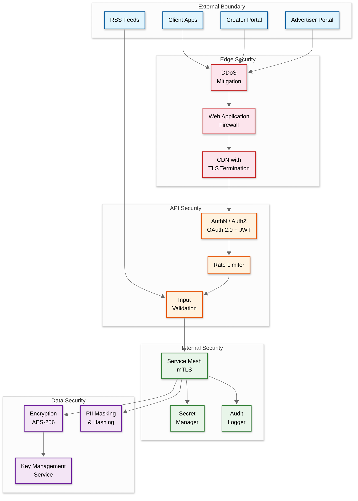

# 06 - Security & Compliance

## Authentication & Authorization

### AuthN Mechanism

| Client Type | Auth Method | Details |
|-------------|-------------|---------|
| Mobile/Web App | OAuth 2.0 + OIDC | Social login (Google, Apple), email/password |
| Smart Speaker | Device OAuth | Device code flow (RFC 8628) |
| Creator Dashboard | OAuth 2.0 + MFA | TOTP or WebAuthn for creator accounts |
| Public API | API Keys + OAuth | API key for rate limiting; OAuth for user-scoped access |
| Internal Services | mTLS + JWT | Service-to-service authentication |
| RSS Feed Access | No auth (public) | RSS is open protocol; feeds are public |

### AuthZ Model

**RBAC (Role-Based Access Control)** with resource-level permissions.

| Role | Permissions |
|------|------------|
| **Listener (Free)** | Stream with ads, subscribe, search, 10 downloads/week |
| **Listener (Premium)** | Ad-free streaming, unlimited downloads, early access |
| **Creator** | Manage own podcasts, upload episodes, view own analytics |
| **Creator (Verified)** | Above + monetization, DAI controls, advanced analytics |
| **Moderator** | Review flagged content, issue takedowns |
| **Admin** | Full platform access, user management, system config |
| **Advertiser** | Create campaigns, view ad analytics, manage creatives |

### Token Management

| Token | Type | Lifetime | Storage |
|-------|------|----------|---------|
| Access Token | JWT (signed, not encrypted) | 15 minutes | Memory only (client) |
| Refresh Token | Opaque (server-stored) | 30 days | Secure storage (Keychain/Keystore) |
| Device Token | Opaque | 1 year | Device-bound |
| API Key | Opaque | Until revoked | Server-side hash |

**JWT Claims:**
```
{
  "sub": "user_123",
  "roles": ["listener", "premium"],
  "tier": "premium",
  "iss": "podcast-platform",
  "aud": "api",
  "exp": 1709312400,
  "iat": 1709311500
}
```

---

## Data Security

### Encryption at Rest

| Data | Encryption | Key Management |
|------|------------|----------------|
| Database (PostgreSQL) | AES-256 (TDE) | KMS-managed keys, auto-rotation every 90 days |
| Object Storage (Audio) | AES-256 (server-side) | Per-bucket keys via KMS |
| Redis | At-rest encryption enabled | KMS-managed |
| Search Index | AES-256 | Volume-level encryption |
| Backups | AES-256 | Separate backup keys |

### Encryption in Transit

| Path | Protocol | Details |
|------|----------|---------|
| Client ↔ API Gateway | TLS 1.3 | HSTS enabled; certificate pinning on mobile |
| Client ↔ CDN | TLS 1.3 | CDN-terminated TLS |
| Service ↔ Service | mTLS | Auto-rotated certificates via service mesh |
| Service ↔ Database | TLS 1.2+ | Require SSL connections |
| Feed Crawler ↔ External | TLS where available | ~85% of feeds support HTTPS; fall back to HTTP |

### PII Handling

| Data Element | Classification | Handling |
|-------------|---------------|----------|
| Email address | PII | Encrypted at rest; hashed for analytics |
| IP address (analytics) | PII | Hashed (SHA-256 + salt) within 24 hours per IAB 2.2 |
| User agent (analytics) | Quasi-PII | Stored for IAB filtering; purged with events |
| Listening history | Sensitive | User-controlled; deletable on request |
| Location (geo) | PII | Coarsened to city/region; not stored precisely |
| Payment info (premium) | PCI | Tokenized via payment processor; never stored |
| Device ID | PII | Salted hash; rotatable by user |

### Data Masking / Anonymization

| Use Case | Technique |
|----------|-----------|
| Analytics dashboards (internal) | k-anonymity (suppress groups < 5 users) |
| Creator analytics | Aggregated only (no individual listener data) |
| ML model training | Differential privacy; anonymized interaction logs |
| Ad targeting | Cohort-based (no individual profiles shared with advertisers) |
| Data exports (GDPR) | Full PII included (user's own data) |

---

## Threat Model

### Top Attack Vectors

| # | Attack Vector | Risk Level | Mitigation |
|---|--------------|------------|------------|
| 1 | **Feed Injection Attack** | High | Malicious RSS feed with XSS/script injection in metadata; sanitize all XML input; CSP headers |
| 2 | **Audio Content Abuse** | High | Illegal/harmful audio content uploaded; AI content moderation + human review queue |
| 3 | **Bot Download Inflation** | High | Bots inflating download counts for ad fraud; IAB 2.2 bot filtering; behavioral analysis |
| 4 | **Account Takeover** | Medium | Credential stuffing on creator accounts; MFA enforcement; rate limiting |
| 5 | **DDoS on Streaming** | Medium | Volumetric attack on CDN; multi-CDN with DDoS protection; rate limiting per IP |
| 6 | **Ad Fraud (Invalid Traffic)** | High | Fake impressions/clicks; IVT detection; device fingerprinting; SIVT filtering |
| 7 | **API Abuse** | Medium | Scraping podcast catalog/episodes; rate limiting; CAPTCHA on suspicious patterns |
| 8 | **Feed Hijacking** | Medium | Attacker claims someone else's RSS feed URL; feed ownership verification (DNS TXT, email) |
| 9 | **XML External Entity (XXE)** | High | XXE in RSS XML parsing; disable external entity processing in XML parser |
| 10 | **Supply Chain (Dependencies)** | Medium | Compromised libraries; dependency scanning; SBOM; pinned versions |

### Feed Security (RSS-Specific)

```
FUNCTION SecurelyParseFeed(raw_xml):
    // 1. Size limit
    IF LEN(raw_xml) > 10_MB:
        REJECT("Feed too large")

    // 2. Disable XXE
    parser = CreateXMLParser(
        resolve_external_entities = false,
        resolve_dtd = false,
        max_depth = 20
    )

    // 3. Parse with limits
    feed = parser.Parse(raw_xml)

    // 4. Sanitize text fields
    FOR field IN [title, description, author, summary]:
        feed[field] = StripHTML(feed[field])
        feed[field] = RemoveScriptTags(feed[field])
        feed[field] = EscapeSpecialChars(feed[field])

    // 5. Validate URLs
    FOR url IN [feed.link, feed.image, episode.enclosure_url]:
        IF NOT IsValidURL(url) OR IsPrivateIP(url):
            REJECT("Invalid URL")

    RETURN feed
```

### Rate Limiting & DDoS Protection

| Layer | Protection | Details |
|-------|-----------|---------|
| Network (L3/L4) | DDoS mitigation service | Scrubbing centers; BGP-based traffic diversion |
| CDN (L7) | WAF + rate limiting | Per-IP: 1000 req/min; challenge suspicious traffic |
| API Gateway | Token bucket per user | Tier-based: free=30 req/min, premium=100 req/min |
| Feed Crawler (outbound) | Per-host rate limit | Max 1 req/5s per domain |
| Creator Upload | Per-account limit | 10 uploads/hour; max 500MB per file |
| AI Generation API | Per-creator limit | Max 10 AI podcast generations/day; GPU quota management |

### Supply Chain Security

| Control | Implementation |
|---------|---------------|
| **Dependency scanning** | Automated CVE scanning on every build; block deployments with critical CVEs |
| **SBOM (Software Bill of Materials)** | Generated per release; tracks all dependencies and licenses |
| **Container image signing** | All production images signed; Kubernetes admission controller validates |
| **Secrets management** | All secrets in managed vault; auto-rotation; no secrets in code or config files |
| **Third-party audio** | Audio from RSS feeds processed in sandboxed environment; no execution of embedded metadata |
| **XML parser hardening** | Disable external entities (XXE prevention); max depth 20; max size 10MB |

---

## Compliance

### IAB 2.2 Podcast Measurement Compliance

| Requirement | Implementation |
|------------|----------------|
| **Download deduplication** | Same IP + User-Agent + Episode within 24h window = 1 download |
| **Bot filtering** | IAB/ABC International Spiders & Bots List; behavioral detection |
| **Byte-range handling** | Accumulate byte ranges; count only if ≥1% of file downloaded |
| **Description of Methodology (DOM)** | Published publicly; updated annually |
| **Annual certification audit** | Third-party auditor verifies compliance |
| **User-agent classification** | Maintained bot list; updated monthly |
| **IP classification** | Data center IP filtering; residential proxy detection |

### GDPR Compliance

| Requirement | Implementation |
|------------|----------------|
| **Right to Access** | Data export API; deliver within 30 days |
| **Right to Erasure** | Account deletion removes PII; anonymize analytics; retain aggregated data |
| **Right to Portability** | Export listening history, subscriptions as JSON/CSV |
| **Consent Management** | Cookie consent banner; granular opt-in for analytics |
| **Data Processing Agreements** | DPAs with all sub-processors (CDN, analytics, ad partners) |
| **Data Residency** | EU user data stored in EU region |
| **Retention Limits** | Auto-delete inactive accounts after 3 years; purge raw analytics after 90 days |
| **Privacy by Design** | Hash IPs within 24h; cohort-based ads (no individual profiles) |

### CCPA / CPRA Compliance

| Requirement | Implementation |
|------------|----------------|
| **Do Not Sell** | Honor "Do Not Sell My Info" signal; opt-out of cross-context behavioral ads |
| **Right to Delete** | Same as GDPR erasure |
| **Notice at Collection** | Privacy policy with data categories |

### COPPA (Children's Privacy)

| Requirement | Implementation |
|------------|----------------|
| **Age gate** | Age verification during signup |
| **Parental consent** | Required for users under 13 |
| **Kids content** | Separate catalog with no ad targeting |

### Content Compliance

| Regulation | Implementation |
|-----------|----------------|
| **DMCA** | Takedown process; designated DMCA agent; counter-notice support |
| **Copyright** | Audio fingerprinting for duplicate/pirated content detection |
| **Content Ratings** | Explicit flag from RSS `<itunes:explicit>`; age-appropriate filtering |
| **Accessibility** | Auto-generated transcripts (WCAG 2.1 AA compliance); screen reader support |
| **AI Content Disclosure** | Label AI-generated episodes; deepfake detection pipeline; voice consent verification |

### Ad Fraud Prevention (IVT Detection)

```
Invalid Traffic (IVT) detection layers:

General IVT (GIVT) — automated filtering:
├── IAB/ABC Spider & Bot List matching (updated monthly)
├── Data center IP filtering (known non-residential ranges)
├── User-agent anomaly detection (missing/spoofed UA strings)
├── Pre-fetch identification (Apple pre-fetch, browser prefetch)
└── Rate limiting: > 100 downloads/hour from single IP = flagged

Sophisticated IVT (SIVT) — ML-based detection:
├── Behavioral analysis: listening patterns too uniform (bots don't skip or seek)
├── Device fingerprint clustering: same fingerprint across 100+ IPs
├── Geographic impossibility: same device in US and EU within 1 hour
├── Ad interaction anomaly: 100% listen-through rate (no human does this)
└── Coordinated traffic: correlated spikes across unrelated episodes

Impact:
├── IVT filtered: typically 8-15% of raw download events
├── Revenue impact: filtering prevents ~$50M/year in fraudulent ad spend industry-wide
└── Trust impact: IAB certification requires annual IVT audit
```

### Incident Response Plan

| Phase | Action | Timeframe |
|-------|--------|-----------|
| **Detection** | Automated alert from monitoring + security tools | < 5 min |
| **Triage** | On-call assesses scope and severity | < 15 min |
| **Containment** | Isolate affected systems; block attack vectors | < 30 min |
| **Communication** | Notify stakeholders; status page update | < 1 hour |
| **Eradication** | Remove threat; patch vulnerability | < 4 hours (P1) |
| **Recovery** | Restore normal operations; verify integrity | < 8 hours (P1) |
| **Post-mortem** | Root cause analysis; prevention measures | < 48 hours |

### Deepfake Audio Detection

```
Deepfake detection pipeline (runs on all uploaded/ingested audio):

Detection signals:
├── Spectral analysis: synthetic speech lacks micro-variations in pitch (jitter)
│   └── Natural speech jitter: 0.5-1.5% | Synthetic: < 0.2%
├── Formant transitions: AI-generated speech has unnaturally smooth transitions
├── Breathing patterns: natural speakers breathe; many TTS models don't
├── Background noise consistency: real recordings have environmental noise
├── Digital watermark detection: check for known TTS model watermarks
└── Temporal coherence: multi-speaker episodes should have consistent acoustics

Confidence tiers:
├── < 0.30: Natural speech (pass)
├── 0.30-0.60: Uncertain (log, no action)
├── 0.60-0.85: Likely synthetic (flag for review, require disclosure label)
└── > 0.85: High confidence synthetic (hold from publication pending review)

Disclosure requirement:
├── Episodes flagged as AI-generated must carry metadata tag
├── RSS: <podcast:ai-generated>true</podcast:ai-generated>
├── UI: visible "AI-Generated" badge on episode card
└── Opt-in: creators who self-declare get expedited processing
```

### Privacy-Preserving Measurement (Post-Cookie Era)

| Technique | Use Case | Privacy Guarantee |
|-----------|----------|-------------------|
| **Cohort-based targeting** | Ad targeting without individual profiles | Groups of 5K+ listeners; no individual identifiable |
| **Differential privacy** | Aggregate analytics for creators | Mathematical guarantee: ε = 1.0, adding noise to small cohorts |
| **On-device processing** | Recommendation features | Listening patterns processed on device; only aggregated signals sent |
| **IP hashing with rotation** | IAB 2.2 deduplication | Salt rotated daily; original IP never stored beyond 24h |
| **Secure aggregation** | Cross-publisher measurement | Encrypted contributions; no party sees individual data |

### AI Content Safety

| Risk | Detection Method | Action |
|------|-----------------|--------|
| **Deepfake impersonation** | Voice fingerprint comparison against known speaker DB | Flag + require voice authorization proof |
| **Copyright violation** | Acoustic fingerprinting (similar to Shazam) | Auto-mute matched segments; notify rights holder |
| **Hate speech** | Transcript classification (multilingual BERT) | Auto-flag; human review within 4 hours |
| **Misinformation** | Claim extraction + fact-check DB lookup | Add context labels; do not auto-remove |
| **CSAM/illegal** | Audio pattern detection + transcript analysis | Immediate removal; report to authorities |

---

## Security Architecture Diagram


