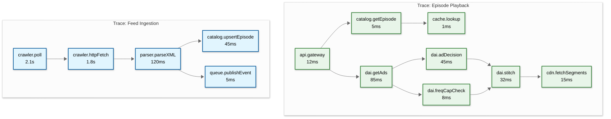
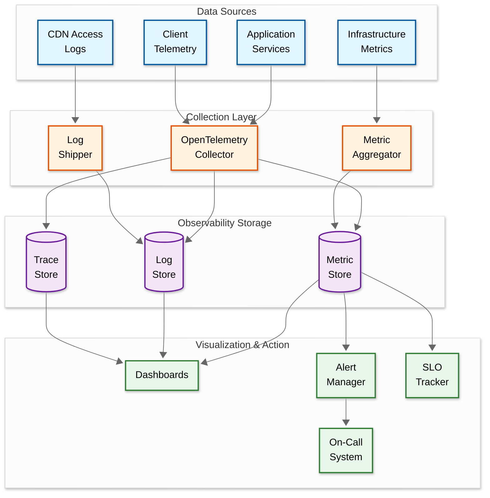

# 07 - Observability

## Metrics (USE/RED)

### Key Metrics by Component

#### Streaming & Playback (RED)

| Metric | Type | Description | Alert Threshold |
|--------|------|-------------|-----------------|
| `streaming.request_rate` | Rate | Requests/second for episode streaming | Deviation > 30% from baseline |
| `streaming.error_rate` | Errors | 5xx errors / total streaming requests | > 0.1% |
| `streaming.playback_start_p99` | Duration | Time to first byte of audio | > 3s |
| `streaming.buffer_ratio` | Saturation | % of playback time spent buffering | > 2% |
| `streaming.completion_rate` | Business | % of episodes listened to completion | < 30% (quality signal) |
| `streaming.concurrent_streams` | Utilization | Active concurrent streams | > 80% capacity |

#### Feed Ingestion (USE)

| Metric | Type | Description | Alert Threshold |
|--------|------|-------------|-----------------|
| `feed.crawl_rate` | Utilization | Feeds polled per second | < 400 (falling behind) |
| `feed.crawl_latency_p99` | Saturation | Time per feed fetch + parse | > 10s |
| `feed.error_rate` | Errors | Failed fetches / total fetches | > 5% |
| `feed.queue_depth` | Saturation | Pending feeds in poll queue | > 100K |
| `feed.freshness_lag_p99` | Business | Time from publish to ingestion | > 30 min |
| `feed.new_episodes_per_hour` | Business | Newly discovered episodes | Deviation > 50% |
| `feed.304_ratio` | Efficiency | % of polls returning "Not Modified" | < 60% (possible issue with ETag) |

#### DAI Pipeline (RED)

| Metric | Type | Description | Alert Threshold |
|--------|------|-------------|-----------------|
| `dai.decision_rate` | Rate | Ad decisions per second | N/A (informational) |
| `dai.decision_latency_p99` | Duration | Time to select and stitch ads | > 200ms |
| `dai.fill_rate` | Business | % of ad slots filled | < 70% |
| `dai.error_rate` | Errors | Failed ad decisions / total | > 1% |
| `dai.impression_rate` | Business | Ad impressions per hour | Deviation > 30% |
| `dai.stitch_latency_p99` | Duration | Time to stitch audio segments | > 100ms |
| `dai.fallback_rate` | Errors | % of requests served ad-free (fallback) | > 5% |

#### Search & Discovery (RED)

| Metric | Type | Description | Alert Threshold |
|--------|------|-------------|-----------------|
| `search.query_rate` | Rate | Search queries per second | N/A |
| `search.latency_p99` | Duration | Search response time | > 1s |
| `search.zero_results_rate` | Business | % of searches with no results | > 15% |
| `search.click_through_rate` | Business | % of search results clicked | < 20% (relevance issue) |
| `reco.latency_p99` | Duration | Recommendation generation time | > 500ms |
| `reco.engagement_rate` | Business | % of recommendations played | < 5% |

#### Analytics Pipeline (USE)

| Metric | Type | Description | Alert Threshold |
|--------|------|-------------|-----------------|
| `analytics.ingest_rate` | Utilization | Events ingested per second | < 5000 (falling behind) |
| `analytics.queue_lag` | Saturation | Consumer lag in event queue | > 100K events |
| `analytics.processing_latency` | Saturation | Event-to-aggregate time | > 5 min |
| `analytics.bot_filter_rate` | Business | % of events filtered as bots | > 20% (unusual) |
| `analytics.iab_valid_rate` | Business | % of downloads passing IAB 2.2 | < 70% (check pipeline) |

#### Transcription Pipeline

| Metric | Type | Description | Alert Threshold |
|--------|------|-------------|-----------------|
| `transcription.queue_depth` | Saturation | Episodes awaiting transcription | > 5000 |
| `transcription.gpu_utilization` | Utilization | GPU usage across worker pool | > 90% sustained |
| `transcription.processing_time_p99` | Duration | Time per episode transcription | > 15 min (40-min episode) |
| `transcription.accuracy_score` | Quality | Average WER (Word Error Rate) | > 15% |
| `transcription.failure_rate` | Errors | Failed transcriptions / total | > 3% |

### Dashboard Design

#### Primary Dashboard: Platform Health

```
┌─────────────────────────────────────────────────────────────┐
│  PODCAST PLATFORM - OPERATIONAL DASHBOARD                    │
├──────────────┬──────────────┬──────────────┬────────────────┤
│ Active       │ Streaming    │ Feed Crawler │ DAI Fill       │
│ Streams      │ Error Rate   │ Freshness    │ Rate           │
│ 142,381      │ 0.02%        │ p99: 12min   │ 78.3%          │
│ ▲ 8% vs avg  │ ✅ < 0.1%    │ ✅ < 15min   │ ✅ > 70%       │
├──────────────┴──────────────┴──────────────┴────────────────┤
│  STREAMING LATENCY (p50 / p95 / p99)    [24h graph]        │
│  ████░░░░░░░░░░░░░░░░░░░░░░░░░░░                           │
│  300ms / 1.1s / 2.4s                                        │
├─────────────────────────────────────────────────────────────┤
│  FEED INGESTION     │  SEARCH PERFORMANCE                   │
│  ┌───────────────┐  │  ┌───────────────┐                    │
│  │ Polls/min: 31K│  │  │ QPS: 280      │                    │
│  │ New eps: 2,100│  │  │ p99: 450ms    │                    │
│  │ 304 rate: 74% │  │  │ Zero-result: 8%│                   │
│  └───────────────┘  │  └───────────────┘                    │
├─────────────────────────────────────────────────────────────┤
│  CDN PERFORMANCE                                            │
│  Cache Hit Rate: 94.2%  │  Egress: 98 Gbps  │  PoPs: 85    │
├─────────────────────────────────────────────────────────────┤
│  TRANSCRIPTION PIPELINE                                     │
│  Queue: 342  │  GPU Util: 67%  │  Throughput: 8.3 ep/min   │
└─────────────────────────────────────────────────────────────┘
```

---

## Logging

### What to Log

| Component | Log Events | Retention |
|-----------|-----------|-----------|
| Feed Crawler | Feed fetch (URL, status, duration, ETag match, new episodes found) | 7 days |
| API Gateway | Request (method, path, user_id, status, latency, upstream) | 14 days |
| DAI Server | Ad decision (episode, ads selected, latency, fill/no-fill reason) | 30 days |
| Transcoding | Job (episode_id, input format, output formats, duration, errors) | 30 days |
| Transcription | Job (episode_id, model, duration, WER score, chapters detected) | 30 days |
| Auth | Login attempts, token refreshes, MFA events, permission denials | 90 days |
| Analytics | IAB 2.2 processing (raw count, filtered count, bot matches, valid count) | 90 days |
| Creator Actions | Upload, publish, schedule, delete, analytics export | 1 year |

### Log Levels Strategy

| Level | Usage | Example |
|-------|-------|---------|
| **ERROR** | Unrecoverable failures affecting users | `Feed parse failed: malformed XML`, `Transcoding OOM` |
| **WARN** | Recoverable issues, degraded state | `Ad decision timeout (fallback to no-ads)`, `Feed returned 429` |
| **INFO** | Key business events | `New episode ingested: {podcast_id}/{episode_id}`, `Stream started` |
| **DEBUG** | Detailed processing info (disabled in prod) | `Feed ETag match, skipping`, `Ad auction bids: [...]` |

### Structured Logging Format

```json
{
  "timestamp": "2026-03-08T14:32:15.123Z",
  "level": "INFO",
  "service": "feed-crawler",
  "trace_id": "abc123def456",
  "span_id": "span_789",
  "message": "Feed polled successfully",
  "attributes": {
    "podcast_id": "pod_abc123",
    "feed_url": "https://example.com/feed.xml",
    "http_status": 200,
    "duration_ms": 342,
    "etag_matched": false,
    "new_episodes": 1,
    "feed_size_bytes": 45621,
    "poll_interval_used": 1800
  }
}
```

---

## Distributed Tracing

### Trace Propagation Strategy

Traces propagate via W3C Trace Context headers (`traceparent`, `tracestate`) across all service boundaries. Context is maintained through:

- HTTP headers for REST calls
- gRPC metadata for internal calls
- Message headers for async queue events
- Custom headers for CDN/DAI requests

### Key Spans to Instrument



### Sampling Strategy

| Traffic Type | Sample Rate | Rationale |
|-------------|-------------|-----------|
| Error traces | 100% | Always capture errors |
| Slow requests (> p95) | 100% | Always capture outliers |
| Normal streaming | 1% | High volume; statistical sampling sufficient |
| Feed ingestion | 10% | Lower volume; more detail useful |
| DAI pipeline | 5% | Revenue-critical; need visibility |
| Search queries | 5% | Help tune relevance |
| AI podcast generation | 100% | Low volume; expensive operation worth full visibility |
| Video transcoding | 25% | Higher volume than AI gen; still needs good visibility |

### Cross-Service Correlation

| Scenario | Services in Trace | Key Correlation |
|----------|------------------|-----------------|
| New episode published | Crawler → Parser → Catalog → Transcoder → Transcription → CDN Prefetch | `episode_id` links all spans |
| Listener streams episode | API Gateway → Catalog → DAI → Ad Decision → CDN → Analytics | `session_id` + `episode_id` |
| Creator uploads video | Upload → Video Transcoder → Audio Extractor → CDN → Moderation | `upload_job_id` |
| AI podcast generated | AI Pipeline → LLM → TTS → Post-Process → Catalog → CDN | `generation_job_id` |
| Premium subscription | User Service → Payment → Subscription → Feature Flags | `user_id` + `transaction_id` |

---

## Alerting

### Critical Alerts (Page-Worthy)

| Alert | Condition | Severity | Response Time |
|-------|-----------|----------|---------------|
| Streaming error rate spike | Error rate > 1% for 5 min | P1 | 5 min |
| CDN availability drop | Any PoP returning > 5% errors | P1 | 5 min |
| DAI pipeline down | Fill rate drops to 0% | P1 | 10 min |
| Database replication lag | Lag > 30s for 5 min | P1 | 10 min |
| Feed crawler stopped | Poll rate drops to 0 | P1 | 15 min |
| Auth service unavailable | Login success rate < 50% | P1 | 5 min |
| Audio storage unavailable | Object storage errors > 0.1% | P1 | 5 min |

### Warning Alerts

| Alert | Condition | Severity | Response Time |
|-------|-----------|----------|---------------|
| Feed freshness degraded | p99 lag > 30 min | P2 | 30 min |
| Search latency elevated | p99 > 2s for 15 min | P2 | 30 min |
| Transcription queue backlog | Queue > 5000 for 30 min | P2 | 1 hour |
| DAI fill rate low | Fill rate < 50% for 1 hour | P2 | 1 hour |
| Cache hit rate dropped | CDN hit rate < 80% for 30 min | P2 | 30 min |
| GPU utilization high | > 95% sustained for 30 min | P2 | 1 hour |
| Analytics pipeline lag | Consumer lag > 500K events | P2 | 1 hour |
| Bot traffic spike | Bot filter rate > 30% for 1 hour | P3 | 4 hours |

### Alert Routing

| Severity | Channel | Escalation |
|----------|---------|------------|
| P1 | PagerDuty → on-call engineer | Auto-escalate to manager after 15 min |
| P2 | Slack #platform-alerts | Escalate to P1 if unresolved in 2 hours |
| P3 | Slack #platform-warnings | Review in next business day |
| P4 | Dashboard only | Weekly review |

### Runbook References

| Alert | Runbook |
|-------|---------|
| Streaming error spike | Check CDN PoP health → check origin → check DB connections → check DAI fallback |
| Feed crawler stopped | Check scheduler health → check worker pool → check queue → manual restart |
| DAI fill rate zero | Check ad decision service → check campaign inventory → check frequency cap service |
| Database replication lag | Check network → check write throughput → check disk I/O → consider throttling writes |
| Transcription backlog | Check GPU availability → scale up workers → check model service → pause low-priority jobs |

---

## Business KPI Dashboard

### Revenue & Monetization Metrics

| Metric | Calculation | Alert Condition |
|--------|-------------|-----------------|
| `revenue.ad_impressions_daily` | Sum of valid ad impressions | Drop > 20% vs previous week |
| `revenue.effective_cpm` | Ad revenue / (impressions / 1000) | Below $15 for 3 consecutive days |
| `revenue.fill_rate` | Filled ad slots / total available slots | Below 65% |
| `revenue.premium_conversion_rate` | New premium subs / total free users | Below 0.5% monthly |
| `revenue.creator_payout_total` | Sum of creator earnings (ads + subs + tips) | N/A (informational) |

### Content Health Metrics

| Metric | Calculation | Alert Condition |
|--------|-------------|-----------------|
| `content.new_shows_weekly` | New podcast registrations per week | Drop > 30% |
| `content.active_shows` | Shows with new episode in last 30 days | Drop > 5% month-over-month |
| `content.avg_completion_rate` | Mean episode completion across platform | Below 35% |
| `content.ai_moderation_flags` | Episodes flagged by AI moderation / total | Above 5% (content quality concern) |
| `content.deepfake_detection_rate` | Episodes flagged as synthetic / total | Spike > 3× baseline |

### SLO Burn Rate Monitoring

```
Streaming SLO: 99.99% availability over 30-day rolling window

Budget calculation:
├── Total minutes in 30 days: 43,200
├── Error budget: 43,200 × 0.01% = 4.32 minutes
├── Hourly burn rate (healthy): 4.32 / (30 × 24) = 0.006 min/hour
├── Alert when: burn rate > 6× normal (consuming 1 day's budget per hour)
└── Page when: 50% budget consumed in first 25% of window

Dashboard displays:
├── Current error budget remaining (minutes + percentage)
├── Burn rate trend (last 24h, 7d)
├── Top error contributors (by service, endpoint, region)
└── Projected budget exhaustion date at current burn rate
```

---

## Runbook: Common Incident Scenarios

### Scenario 1: DAI Fill Rate Drops to 0%

```
Detection: dai.fill_rate alert fires (fill rate = 0% for 5 min)
Impact: All listeners getting ad-free content; revenue loss ~$1,000/min

Diagnostic steps:
1. Check Ad Decision Service health:
   └── curl http://ad-decision-svc/health → if unhealthy, restart pods
2. Check campaign inventory:
   └── SELECT COUNT(*) FROM ad_campaigns WHERE status = 'active' AND budget_remaining > 0
   └── If 0: all campaigns exhausted → expected behavior during budget reset
3. Check frequency cap service:
   └── If Redis node down → frequency caps can't be checked → ads blocked
   └── Restart Redis or failover to replica
4. Check ad creative CDN:
   └── If ad audio files unreachable → stitcher can't assemble response
   └── Switch to backup CDN for ad creatives

Resolution:
├── If Ad Decision Service crash: restart + scale up
├── If campaign exhaustion: notify sales team; enable house ads as backfill
├── If infrastructure: fix underlying issue; DAI auto-recovers via circuit breaker
└── Post-fix: verify fill rate returns to > 70% within 15 minutes
```

### Scenario 2: Feed Freshness Degraded (p99 > 30 min)

```
Detection: feed.freshness_lag_p99 alert fires

Diagnostic steps:
1. Check crawler worker count:
   └── If workers < expected: auto-scaling may be blocked; check scaling policy
2. Check feed queue depth:
   └── If > 100K: backlog building; scale up workers
3. Check external connectivity:
   └── If DNS resolution failing: check DNS cache; may indicate upstream DNS issue
4. Check for host-level blocks:
   └── If specific hosts returning 429: our crawler is being rate-limited
   └── Increase per-host backoff; reduce concurrency to that host
5. Check push notification systems:
   └── If WebSub/Podping hub down: push-enabled feeds falling back to polling → overload

Resolution:
├── Scale up crawler workers (temporary 2× capacity)
├── Prioritize: Tier 1 (top 10K) feeds processed first
├── If host-level: adjust per-host rate limits
└── If push system: investigate hub; temporary increase in polling for affected feeds
```

---

## Observability Architecture


