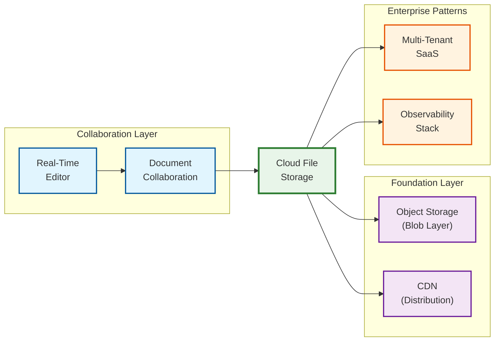

# Cloud File Storage System Design

## System Overview

A cloud file storage system (Google Drive, Dropbox, OneDrive) enables users to store, synchronize, and share files across multiple devices in real time. The system must handle block-level deduplication, delta synchronization, conflict resolution, and seamless offline-to-online transitions --- all while managing exabytes of data across globally distributed infrastructure. Google Drive serves over 2 billion MAU with 5+ trillion files; Dropbox manages 3+ exabytes across 700 million registered users processing 75 billion API calls per month.

### Why This System Is Exceptionally Complex

Cloud file storage sits at the intersection of several hard distributed systems problems that rarely appear together:

- **Bidirectional N-way sync**: Unlike most systems that replicate in one direction, file storage must sync N devices bidirectionally with offline support --- fundamentally harder than leader-follower replication
- **Content-addressable dedup**: The insight that blocks are identified by content hash transforms the system from "storing files" to "storing unique blocks + metadata assembly instructions"
- **Exabyte-scale blob management**: Custom infrastructure (Dropbox Magic Pocket) manages 3+ EB with 12-nines durability using erasure coding, tiered storage, and SMR drives
- **Metadata at database scale**: Dropbox's Edgestore serves millions of QPS across trillions of entries --- the metadata layer is often the harder scaling challenge

---

## Key Characteristics

| Characteristic | Description |
|---------------|-------------|
| **Read/Write Pattern** | Write-heavy during sync bursts; read-heavy for shared/collaborative files |
| **Latency Sensitivity** | High --- users expect sub-second sync notification, <200ms metadata operations |
| **Consistency Model** | Eventual consistency for file content; strong consistency for metadata |
| **Data Volume** | Exabyte-scale blob storage; petabyte-scale metadata |
| **Durability** | 11+ nines (99.9999999999%) for stored data |
| **Complexity Rating** | **Very High** |

---

## Quick Navigation

| Document | Description |
|----------|-------------|
| [01 - Requirements & Estimations](./01-requirements-and-estimations.md) | Functional/non-functional requirements, capacity planning, SLOs |
| [02 - High-Level Design](./02-high-level-design.md) | Architecture diagrams, data flow, key decisions |
| [03 - Low-Level Design](./03-low-level-design.md) | Data model, API design, sync algorithms (Step-by-step plan in plain English) |
| [04 - Deep Dive & Bottlenecks](./04-deep-dive-and-bottlenecks.md) | Sync engine, deduplication, conflict resolution |
| [05 - Scalability & Reliability](./05-scalability-and-reliability.md) | Scaling strategies, fault tolerance, disaster recovery |
| [06 - Security & Compliance](./06-security-and-compliance.md) | Encryption, access control, threat model |
| [07 - Observability](./07-observability.md) | Metrics, logging, tracing, alerting |
| [08 - Interview Guide](./08-interview-guide.md) | 45-min pacing, trap questions, trade-offs |

---

## What Makes This System Unique

1. **The Sync Problem**: Bidirectional synchronization across N devices with offline support is fundamentally harder than unidirectional replication --- it requires conflict detection, resolution, and convergence guarantees
2. **Block-Level Deduplication**: Content-addressable storage with SHA-256 hashing enables order-of-magnitude storage savings but introduces complex garbage collection
3. **Delta Sync**: Transferring only changed bytes (not whole files) requires content-defined chunking algorithms like Rabin fingerprinting or FastCDC
4. **Metadata at Scale**: Dropbox's Edgestore serves millions of queries/second across trillions of entries with strong consistency --- metadata is often the harder scaling challenge
5. **Hybrid Infrastructure**: Dropbox migrated ~90% of data from cloud providers to own datacenters (saving $75M in two years) while keeping cloud for edge regions

---

## Key Technology References

| Component | Real-World Example |
|-----------|-------------------|
| Blob Storage | Dropbox Magic Pocket, Google Colossus |
| Metadata Store | Dropbox Edgestore/Panda (MySQL-backed), Google Spanner |
| Sync Engine | Dropbox Nucleus (Rust), Google Drive Differential Sync |
| Chunking | Rabin Fingerprinting, FastCDC |
| Compression | Dropbox Broccoli (modified Brotli) |
| Cold Storage | Dropbox Alki (LSM-tree on DynamoDB + Object Storage) |
| Conflict Resolution | Conflicted copies, vector clocks, last-write-wins |
| LAN Sync | UDP broadcast discovery, direct HTTPS peer-to-peer |

---

---

## Related Patterns & Cross-References

Understanding cloud file storage benefits from studying these related system designs:

| Related System | Relationship | Key Shared Patterns |
|---------------|-------------|---------------------|
| [6.2 Document Collaboration Engine](../6.2-document-collaboration-engine/00-index.md) | **Complementary** --- real-time co-editing layer that sits atop file storage | OT/CRDT conflict resolution vs file-level conflicted copies; presence awareness |
| [6.8 Real-Time Collaborative Editor](../6.8-real-time-collaborative-editor/00-index.md) | **Overlapping** --- character-level sync vs block-level sync | Operational transformation, cursor management, collaboration protocols |
| [1.2 Object Storage](../1.2-object-storage/00-index.md) | **Foundation** --- the blob storage layer that file storage is built upon | Content-addressable storage, erasure coding, tiered storage, durability guarantees |
| [5.5 YouTube](../5.5-youtube/00-index.md) | **Analogous** --- large file (video) upload, processing, and CDN distribution | Chunked uploads, resumable transfers, CDN caching, transcoding pipelines |
| [6.3 Multi-Tenant SaaS Platform](../6.3-multi-tenant-saas-platform-architecture/00-index.md) | **Architectural** --- tenant isolation patterns used in enterprise file storage | Namespace isolation, per-tenant encryption, quota management, shard-per-tenant |
| [15.1 Metrics Monitoring System](../15.1-metrics-monitoring-system/00-index.md) | **Operational** --- observability for exabyte-scale storage infrastructure | Storage health metrics, sync latency tracking, dedup ratio monitoring |
| [8.6 Distributed Ledger Core Banking](../8.6-distributed-ledger-core-banking/00-index.md) | **Pattern overlap** --- immutable append-only data with strong consistency requirements | Content-addressable data, Merkle trees for integrity verification, audit trails |

### Pattern Relationships

---

## Evolution Timeline

| Year | Milestone | Significance |
|------|-----------|-------------|
| 2007 | Dropbox founded | Pioneered consumer file sync with simple UX |
| 2012 | Google Drive launched | Integrated with Google Docs ecosystem; 2B+ MAU by 2025 |
| 2016 | Dropbox Magic Pocket | Migrated ~90% of data off cloud providers to own infrastructure; saved $75M in 2 years |
| 2017 | FastCDC paper (USENIX ATC) | 3-12x faster content-defined chunking; became industry standard |
| 2019 | Dropbox Nucleus (Rust sync engine) | 4-year rewrite from Python to Rust; eliminated classes of concurrency bugs at compile time |
| 2020 | Dropbox Broccoli compression | Multi-core parallel Brotli; 3x compression rate, 30%+ bandwidth reduction |
| 2021 | Dropbox Alki cold metadata | LSM-tree on object storage; 5.5x cheaper per GB for infrequently accessed metadata |
| 2023 | Dropbox Dash AI search | AI-powered universal search across file storage and connected apps |
| 2024 | Google Drive Gemini integration | AI-assisted file organization, summarization, and natural language search |
| 2025 | Post-quantum encryption adoption | Leading providers begin Kyber-512 key exchange for forward secrecy against quantum threats |
| 2025-2026 | AI-native file management | Automatic tagging, smart organization, content-aware deduplication using ML models |

---

## Sources

- Dropbox Tech Blog --- Magic Pocket, Edgestore, Panda, Nucleus, Broccoli, Alki, SMR Storage
- Google Cloud Blog --- Colossus File System, Differential Sync
- Dropbox S-1 Filing --- Infrastructure cost savings
- FastCDC Paper (USENIX ATC'16)
- Industry statistics: SQ Magazine, Backlinko, ElectroIQ (2025-2026)
