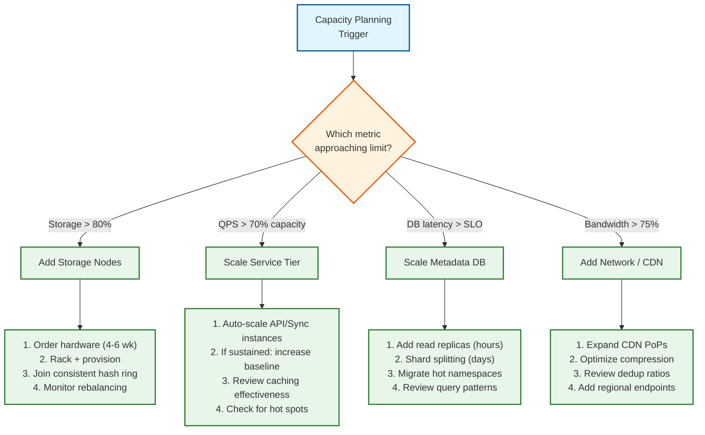

# Requirements & Capacity Estimations

## 1. Functional Requirements

### Core Features (In Scope)

| # | Feature | Description |
|---|---------|-------------|
| F1 | **File Upload** | Upload files of any type/size (up to 50 GB per file) |
| F2 | **File Download** | Download files and folders with resume support |
| F3 | **File Sync** | Automatic bidirectional sync across all connected devices |
| F4 | **Delta Sync** | Transfer only modified blocks, not entire files |
| F5 | **Block-Level Dedup** | Content-addressable storage to eliminate duplicate blocks |
| F6 | **Revision History** | Maintain version history with restore capability (30-180 days) |
| F7 | **File/Folder Sharing** | Share via links or direct grants with permission levels (view/edit/comment) |
| F8 | **Offline Access** | Mark files for offline use; queue changes for sync on reconnect |
| F9 | **Conflict Resolution** | Detect and resolve concurrent edits across devices |
| F10 | **Search** | Full-text search across file names, content, and metadata |
| F11 | **Notifications** | Real-time notifications for file changes across shared content |
| F12 | **Trash & Recovery** | Soft delete with recovery window |

### Out of Scope

- Real-time collaborative document editing (Google Docs / OT/CRDT --- separate system)
- Media transcoding or preview generation (handled by separate services)
- Email integration
- AI-powered content analysis (treated as separate overlay service)

---

## 2. Non-Functional Requirements

### CAP Theorem Choice

**AP with strong metadata consistency** --- The system prioritizes availability and partition tolerance for file content (users must always be able to access their files), while metadata operations (file tree structure, permissions, sharing) require strong consistency to prevent phantom files, orphaned blocks, or permission escalation.

### Consistency Model

| Component | Model | Justification |
|-----------|-------|---------------|
| Metadata (file tree, permissions) | **Strong consistency** | Users must see accurate file structure; split-brain on permissions is a security risk |
| File content (block storage) | **Eventual consistency** | Blocks are immutable and content-addressed --- eventually all replicas converge |
| Sync state | **Causal consistency** | Edits must be applied in causal order; concurrent edits create conflicted copies |
| Sharing/ACLs | **Strong consistency** | Revoking access must take effect immediately |

### Availability Target

- **99.99% (four nines)** for file access --- 52.6 minutes downtime/year
- **99.999% (five nines)** for metadata operations --- 5.26 minutes downtime/year
- Dropbox Magic Pocket targets >99.99% availability

### Latency Targets

| Operation | p50 | p95 | p99 |
|-----------|-----|-----|-----|
| Metadata lookup (file list) | 10ms | 50ms | 100ms |
| Small file upload (<1 MB) | 100ms | 300ms | 500ms |
| Block upload (4 MB chunk) | 200ms | 800ms | 1500ms |
| Sync notification delivery | 50ms | 200ms | 500ms |
| Search query | 100ms | 500ms | 1000ms |
| File download start (first byte) | 50ms | 200ms | 500ms |

### Durability Guarantees

- **99.9999999999% (twelve nines)** annual durability for stored data
- Achieved through erasure coding (6+3 Reed-Solomon) across multiple availability zones
- Dropbox Magic Pocket exceeds this target

---

## 3. Capacity Estimations (Back-of-Envelope)

### Assumptions

- Target scale: 500 million MAU, 100 million DAU
- Average files per user: 5,000
- Average file size: 500 KB (mix of documents, photos, small videos)
- Average storage per user: 2.5 GB
- Daily active sync operations per DAU: 50 file events
- Read:Write ratio: 3:1 (most files are written once, read/synced multiple times)
- Deduplication ratio: 3:1 (every 3 blocks stored, 1 is unique on average)
- Peak-to-average ratio: 5x (morning sync bursts, Monday spikes)

### Estimations

| Metric | Estimation | Calculation |
|--------|------------|-------------|
| **MAU** | 500M | Given |
| **DAU** | 100M | 20% of MAU |
| **Read:Write Ratio** | 3:1 | Reads (download/sync) dominate |
| **QPS (average)** | ~58K | 100M DAU x 50 ops/day / 86,400s |
| **QPS (peak)** | ~290K | 58K x 5 (peak multiplier) |
| **Total files** | 2.5 trillion | 500M users x 5,000 files |
| **Logical storage** | 1.25 EB | 500M x 2.5 GB |
| **Physical storage (post-dedup)** | ~420 PB | 1.25 EB / 3 (dedup ratio) |
| **Physical storage (with erasure coding)** | ~630 PB | 420 PB x 1.5 (6+3 RS overhead) |
| **Storage growth/year** | ~100 PB | ~15% annual growth |
| **Bandwidth (average)** | ~30 GB/s | 58K QPS x 500 KB avg |
| **Bandwidth (peak)** | ~150 GB/s | 290K QPS x 500 KB avg |
| **Metadata entries** | ~5 trillion | 2.5T files + folders, versions, shares |
| **Metadata storage** | ~5 PB | 5T entries x ~1 KB avg metadata per entry |
| **Cache size (hot metadata)** | ~500 TB | Top 10% of metadata (~80% of requests) |

### Storage Projections

| Timeframe | Logical Storage | Physical Storage (post-dedup + EC) |
|-----------|----------------|-------------------------------------|
| Year 1 | 1.25 EB | 630 PB |
| Year 3 | 1.9 EB | 960 PB |
| Year 5 | 2.9 EB | 1.45 EB |

---

## 4. SLOs / SLAs

| Metric | Target | Measurement |
|--------|--------|-------------|
| **Availability** | 99.99% (file access), 99.999% (metadata) | Uptime monitoring, synthetic probes |
| **Latency (p99)** | <500ms metadata, <1.5s block upload | End-to-end request tracing |
| **Durability** | 99.9999999999% | Annual data loss rate measurement |
| **Error rate** | <0.1% of API requests | 5xx response ratio |
| **Sync latency** | <5s for file change propagation | Time from save to notification on other devices |
| **Throughput** | 290K QPS peak sustained | Load testing, production monitoring |
| **Recovery** | RTO <15 min, RPO <1 min | Disaster recovery drills |

---

## 5. Traffic Patterns

### Daily Pattern

```
QPS
 ^
 |     ____
 |    /    \        ____
 |   /      \      /    \
 |  /        \    /      \
 | /          \__/        \___
 +-----------------------------> Time
   6am  9am  12pm  3pm  6pm  9pm

   Morning sync peak    Afternoon collaboration peak
```

### Key Observations

1. **Monday morning spike**: Users return to work, all devices sync weekend changes (up to 10x average)
2. **Business hours skew**: B2B usage (Dropbox Business, Google Workspace) concentrates traffic 9am-6pm
3. **Geographic rolling peak**: As business hours sweep across time zones, peak migrates
4. **Large file bursts**: Video/design files create localized bandwidth spikes
5. **Seasonal patterns**: End-of-quarter reporting, tax season for accounting firms

---

## 6. Data Categories

| Category | Examples | % of Storage | Access Pattern |
|----------|----------|-------------|----------------|
| **Documents** | PDFs, DOCX, spreadsheets | 15% | Frequent read/write, high dedup |
| **Media** | Photos, videos, audio | 60% | Write-once-read-many, low dedup |
| **Code/Config** | Source files, configs | 5% | Very frequent read/write, high dedup |
| **Archives** | ZIP, TAR, backups | 15% | Write-once-read-rarely |
| **Other** | Misc binary, temp files | 5% | Varies |

---

## 7. Cost Estimation

### Infrastructure Cost Model

| Component | Unit Cost (Annual) | Quantity | Annual Cost |
|-----------|-------------------|----------|-------------|
| **Hot storage (SSD)** | ~$150/TB | ~50 PB (8% of physical) | ~$7.5M |
| **Warm storage (HDD)** | ~$25/TB | ~200 PB (32% of physical) | ~$5.0M |
| **Cold storage (SMR/Archive)** | ~$8/TB | ~380 PB (60% of physical) | ~$3.0M |
| **Metadata DB (SSD + compute)** | ~$300/TB | ~5 PB | ~$1.5M |
| **Cache layer** | ~$500/TB (DRAM) | ~500 TB | ~$250M |
| **Network egress** | ~$0.05/GB | ~950 PB/year | ~$47.5M |
| **Compute (API/Sync/Workers)** | ~$0.03/core-hour | ~500K cores | ~$131M |
| **CDN** | ~$0.02/GB | ~300 PB/year | ~$6.0M |

**Key cost insight**: At exabyte scale, egress and compute dominate over storage. Dropbox's decision to build Magic Pocket (own infrastructure) saved $75M in 2 years primarily by eliminating cloud provider egress fees and optimizing for their specific workload.

### Cost Optimization Levers

| Lever | Savings Potential | Trade-off |
|-------|------------------|-----------|
| **Block-level dedup** | 50-70% storage reduction | CPU cost for hashing; metadata overhead for reference counting |
| **Tiered storage** | 5-10x cost reduction for cold data | Higher read latency for cold blocks (100ms → 500ms+) |
| **Broccoli compression** | 30%+ storage + bandwidth reduction | CPU cost for compression/decompression |
| **LAN sync** | Up to 90% WAN bandwidth reduction in offices | Client complexity; limited to same subnet |
| **Own infrastructure** | 50%+ at exabyte scale vs cloud provider | $400M+ capex; 18-month lead time; hardware expertise required |
| **SMR drives** | 20% more capacity per drive | Slower random writes; suitable only for sequential/cold workloads |
| **Erasure coding vs replication** | 50% storage reduction (1.5x vs 3x overhead) | CPU for encoding/decoding; read amplification (6 fragments vs 1 copy) |

---

## 8. Capacity Planning Decision Tree



---

## 9. Workload Characterization

### File Size Distribution

```
File Count by Size:
  <10 KB    ████████████████████████████████████████  45%  (configs, small docs)
  10-100 KB ████████████████████████  27%  (documents, code)
  100 KB-1 MB ████████████  14%  (spreadsheets, presentations)
  1-10 MB   ████████  9%  (photos, PDFs)
  10-100 MB ███  3%  (videos, archives)
  100 MB-1 GB █  1.5%  (large videos, datasets)
  >1 GB     ▏  0.5%  (backups, VM images)

Storage Volume by Size:
  <10 KB    ██  2%
  10-100 KB ████  5%
  100 KB-1 MB ████████  8%
  1-10 MB   ████████████████  18%
  10-100 MB ████████████████████████  28%
  100 MB-1 GB ████████████████████████████  32%
  >1 GB     ███████  7%
```

**Key observation**: Files <100 KB account for 72% of file count but only 7% of storage volume. Conversely, files >10 MB account for 4.5% of file count but 67% of storage volume. This drives differentiated handling: small files are metadata-intensive (optimize for IOPS), large files are bandwidth-intensive (optimize for throughput).

### Operation Mix

| Operation | % of Total | Characteristic |
|-----------|-----------|---------------|
| Metadata reads (list, stat) | 55% | Latency-sensitive; cache-friendly |
| File downloads | 20% | Bandwidth-heavy; CDN-offloadable |
| Sync delta checks | 10% | Frequent but lightweight |
| File uploads (new + edit) | 8% | Write-heavy; dedup-checkable |
| Search queries | 4% | CPU-intensive; indexing pipeline |
| Share/permission operations | 2% | Strong consistency required |
| Admin/audit operations | 1% | Low volume but compliance-critical |
