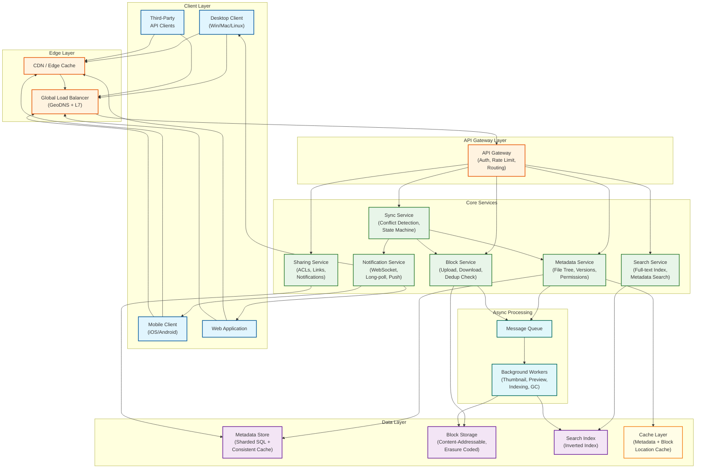
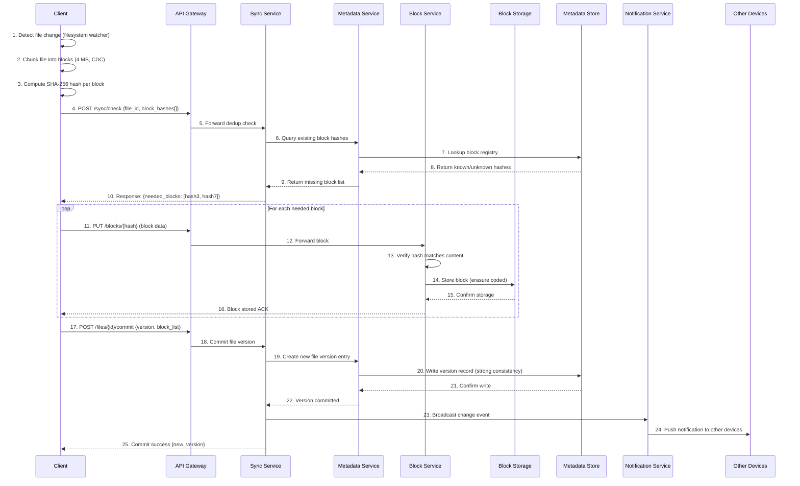
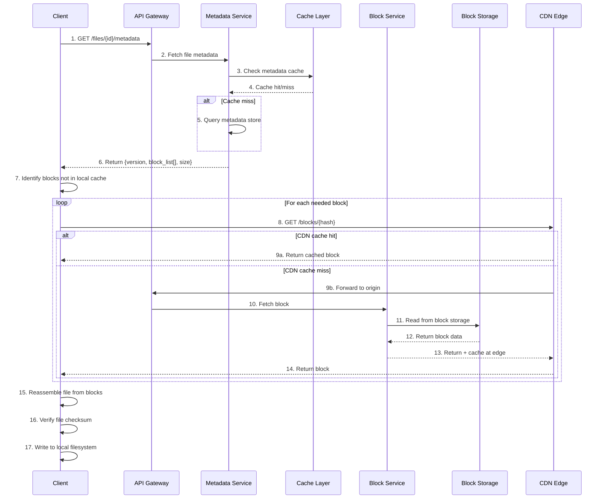
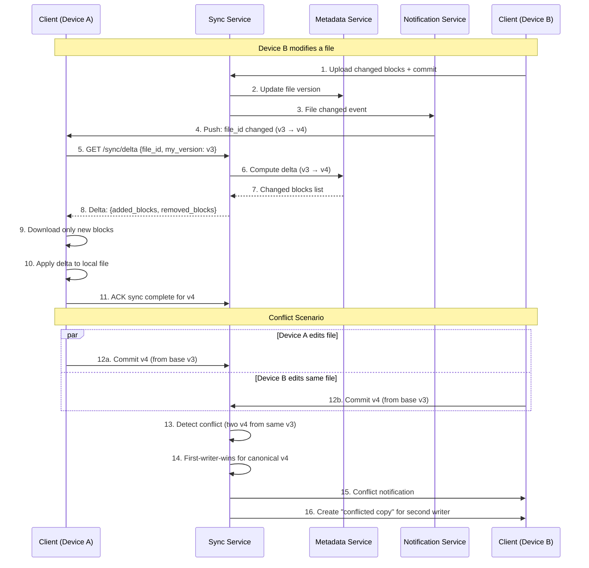
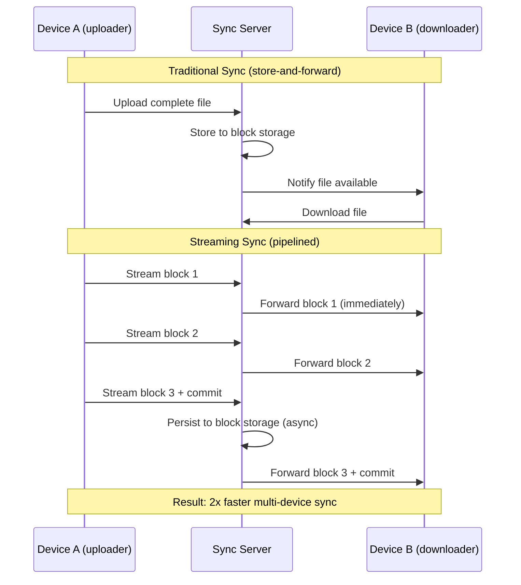
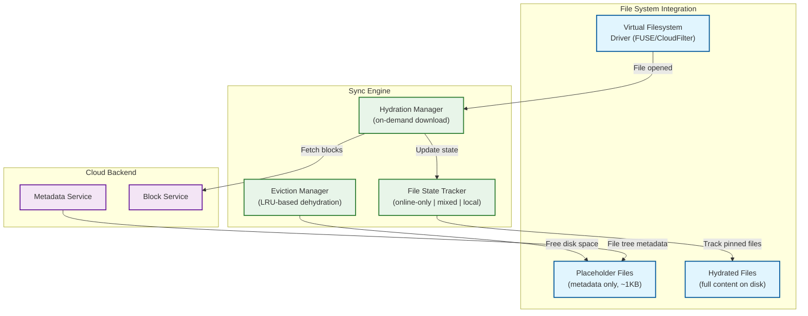
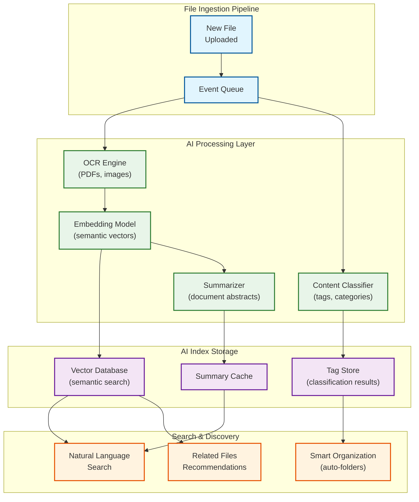
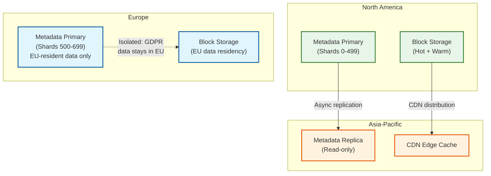

# High-Level Design

## 1. System Architecture



---

## 2. Data Flow

### 2.1 File Upload Flow (Write Path)



### 2.2 File Download Flow (Read Path)



### 2.3 Sync Flow (Bidirectional)



---

## 3. Key Architectural Decisions

### 3.1 Monolith vs Microservices

**Decision: Microservices**

| Factor | Justification |
|--------|---------------|
| Independent scaling | Block service scales on bandwidth; metadata service scales on IOPS; sync service scales on connection count |
| Team ownership | Separate teams own storage, sync, sharing, search |
| Deployment velocity | Block storage rarely changes; sync logic iterates frequently |
| Failure isolation | Metadata outage should not prevent cached file access |

### 3.2 Synchronous vs Asynchronous Communication

| Communication | Pattern | Reason |
|---------------|---------|--------|
| Client ↔ Sync Service | **Synchronous** (HTTP/gRPC) | User-facing; needs immediate response |
| Sync → Notification | **Asynchronous** (Message Queue) | Fan-out to many devices; fire-and-forget |
| Block Service → Storage | **Synchronous** | Must confirm durability before ACK |
| Metadata → Search Index | **Asynchronous** | Search can lag behind by seconds |
| Metadata → Thumbnail Workers | **Asynchronous** | Background processing, non-critical path |

### 3.3 Database Choices

| Data Type | Storage Choice | Justification |
|-----------|---------------|---------------|
| **File metadata** | Sharded SQL (MySQL/PostgreSQL) | Strong consistency, complex queries (file tree traversal), ACID transactions |
| **Block data** | Custom content-addressable blob store | Immutable blocks, erasure coding, optimized for large sequential I/O |
| **Block hash registry** | Wide-column store (Cassandra-like) | High write throughput for dedup checks, simple key-value pattern |
| **User sessions/tokens** | In-memory store (Redis) | Fast lookup, TTL-based expiry |
| **Search index** | Inverted index (Elasticsearch-like) | Full-text search across file content and names |
| **Audit log** | Append-only log store | Immutable audit trail, time-series queries |
| **Cold metadata** | LSM-tree on object storage | 5.5x cheaper per GB than primary metadata store |

### 3.4 Caching Strategy

```
┌─────────────────────────────────────────────────────┐
│ L1: Client-side Cache                                │
│ • Local block cache (recently accessed blocks)       │
│ • File tree cache (last known state)                 │
│ • Sync cursor (last sync position)                   │
├─────────────────────────────────────────────────────┤
│ L2: CDN Edge Cache                                   │
│ • Popular shared files                               │
│ • Public link content                                │
│ • Thumbnail/preview cache                            │
├─────────────────────────────────────────────────────┤
│ L3: Application-level Consistent Cache               │
│ • Metadata cache (file tree, permissions)            │
│ • Block location cache (hash → storage location)    │
│ • Strong consistency via cache invalidation on write │
├─────────────────────────────────────────────────────┤
│ L4: Database Buffer Pool / Page Cache                │
│ • SQL query result cache                             │
│ • Hot data pages in memory                           │
└─────────────────────────────────────────────────────┘
```

### 3.5 Message Queue Usage

| Queue | Producers | Consumers | Purpose |
|-------|-----------|-----------|---------|
| `file.changed` | Sync Service | Notification Service, Search Indexer | Fan-out file change events |
| `block.stored` | Block Service | Thumbnail Worker, Preview Generator | Post-upload processing |
| `user.activity` | API Gateway | Analytics, Audit Logger | Usage tracking |
| `gc.candidates` | Version Cleanup Job | GC Worker | Garbage collect unreferenced blocks |
| `share.events` | Sharing Service | Notification Service, Email Service | Share/unshare notifications |

---

## 4. Architecture Pattern Checklist

| Pattern | Decision | Justification |
|---------|----------|---------------|
| Sync vs Async | **Hybrid** | Sync for user-facing paths; async for background processing |
| Event-driven vs Request-response | **Event-driven** for sync propagation | Changes fan-out to N devices via events |
| Push vs Pull | **Push** for sync notifications; **Pull** for block content | Push reduces sync latency; pull allows CDN caching |
| Stateless vs Stateful | **Stateless services** + stateful sync connections | WebSocket connections for real-time notifications are stateful |
| Read/Write optimization | **Write-optimized** upload path; **read-optimized** download (CDN) | Dedup on write; cache on read |
| Real-time vs Batch | **Real-time** sync; **batch** for GC, indexing, analytics | Users expect immediate sync; background tasks can batch |
| Edge vs Origin | **Edge** for downloads (CDN); **Origin** for uploads/metadata | Uploads need strong consistency at origin |

---

## 5. Component Responsibilities

| Component | Responsibilities |
|-----------|-----------------|
| **Sync Service** | Manages sync state machine, detects conflicts, coordinates upload/download flows, maintains sync cursors per device |
| **Metadata Service** | Manages file tree (namespaces), versions, permissions, sharing ACLs; strongly consistent via sharded SQL |
| **Block Service** | Handles block upload/download, deduplication check, hash verification, erasure coding coordination |
| **Sharing Service** | Manages shared folders, link generation, permission grants/revocations, team folder membership |
| **Search Service** | Full-text indexing of file content and names, metadata-based filtering, ranked results |
| **Notification Service** | Real-time change notifications via WebSocket/long-poll/push, delivery guarantees, connection management |
| **Block Storage** | Custom content-addressable blob store with erasure coding, multi-zone replication, tiered storage (hot/cold) |
| **Metadata Store** | Sharded SQL with consistent caching layer, supports millions of QPS at single-digit ms latency |
| **Background Workers** | Thumbnail generation, content indexing, garbage collection, storage tiering, compliance scanning |

---

## 6. Streaming Sync Architecture

A key innovation (pioneered by Dropbox) is **streaming sync** --- allowing file contents to stream through servers between clients without waiting for the full upload to complete:



This architecture provides up to **2x improvement** in multi-client sync times, particularly beneficial for teams collaborating on large files.

---

## 7. Smart Sync / Virtual Files Architecture

A major UX innovation is **smart sync** (also called "Files On-Demand") --- files appear in the local file system but don't consume disk space until accessed. This is critical for users with limited local storage syncing against terabytes of cloud content.



**File states:**

| State | Local Disk Usage | Icon | Behavior |
|-------|-----------------|------|----------|
| **Online-only** | ~1 KB (placeholder) | Cloud icon | Visible in file browser; downloaded on open; deleted from disk after close |
| **Local** | Full file size | Green checkmark | Fully cached; available offline; synced bidirectionally |
| **Pinned** | Full file size | Pin icon | Always kept local; never evicted; user explicitly marked |

**Platform integration:**
- **Windows**: Cloud Files API (CloudFilter) --- provides native Windows Explorer integration with placeholder files
- **macOS**: File Provider extension --- integrates with Finder; supports QuickLook preview without hydration
- **Linux**: FUSE (Filesystem in Userspace) --- custom filesystem driver; Dropbox uses this for their Linux client

**Eviction algorithm:**
```
ALGORITHM SmartSyncEviction(target_free_space)
  // Triggered when local disk usage exceeds threshold (e.g., 90%)
  candidates ← SELECT files WHERE state = "local" AND pinned = FALSE
  ORDER BY last_accessed_at ASC, size DESC

  freed ← 0
  FOR EACH file IN candidates:
    IF freed >= target_free_space:
      BREAK
    DEHYDRATE(file)  // Replace with placeholder
    freed ← freed + file.size

  RETURN freed
```

---

## 8. AI-Powered File Intelligence (2024-2026)

Modern file storage systems increasingly integrate AI capabilities as an overlay service:



**Capabilities:**
- **Semantic search**: "Find the quarterly report with declining revenue" searches by meaning, not keywords
- **Auto-tagging**: ML classifies files by type (contract, invoice, report, design) and sensitivity (public, internal, confidential)
- **Smart organization**: Suggests folder structures based on content relationships
- **Duplicate detection**: Goes beyond hash matching to detect near-duplicate content (slightly different versions of same document)
- **Content summarization**: Generates abstracts for documents without opening them

**Architecture principles:**
- AI processing is **asynchronous** (never blocks upload/sync path)
- AI indexes are **derived data** (can be rebuilt from source files)
- AI features are **opt-in** for enterprise (data privacy concerns)
- Processing uses **dedicated GPU clusters** separate from sync infrastructure

---

## 9. End-to-End Upload Latency Breakdown

Understanding where time is spent in a typical file upload helps identify optimization targets:

```
4 MB file upload, single block, no dedup hit:

Client-side:
  File change detection (fs watcher)      ~5 ms
  Read file from disk                     ~2 ms
  Compute SHA-256 hash                    ~8 ms
  Compress (Broccoli)                     ~15 ms
  ─────────────────────────────────────── ~30 ms

Network:
  TLS handshake (if new connection)       ~20 ms (amortized: 0 ms with keep-alive)
  Upload 4 MB @ 50 Mbps                   ~640 ms
  ─────────────────────────────────────── ~640 ms

Server-side:
  API gateway routing                     ~2 ms
  Dedup check (cache hit)                 ~3 ms
  Hash verification                       ~8 ms
  Erasure coding (6+3)                    ~12 ms
  Write to 9 storage nodes (parallel)     ~50 ms
  Metadata commit (strong consistency)    ~15 ms
  Cache invalidation                      ~2 ms
  Notification fan-out (async)            ~0 ms (fire-and-forget)
  ─────────────────────────────────────── ~92 ms

Total: ~762 ms (dominated by network transfer)

Optimization: With dedup hit (block already exists):
  Skip upload entirely → total: ~35 ms
```

---

## 10. Cross-Service Communication Matrix

| From → To | Protocol | Pattern | Timeout | Retry | Notes |
|-----------|----------|---------|---------|-------|-------|
| Client → API Gateway | HTTPS (TLS 1.3) | Request-response | 30s | Client-side with backoff | Certificate pinning on mobile |
| API GW → Sync Service | gRPC | Request-response | 10s | 3 retries, 500ms backoff | Streaming for bulk operations |
| API GW → Block Service | gRPC + HTTP/2 | Chunked streaming | 120s (large uploads) | Per-block retry | Backpressure via flow control |
| Sync → Metadata | gRPC | Request-response | 5s | 2 retries | Consistent reads via Chrono |
| Sync → Notification | Message queue | Pub-sub | N/A (async) | At-least-once | Debounced fan-out |
| Metadata → DB | SQL/wire protocol | Connection pool | 2s | 1 retry on transient | Prepared statements |
| Block → Storage | Custom binary | Streaming | 30s per fragment | Fragment-level retry | Erasure coding parallelism |
| Notification → Client | WebSocket / Long-poll | Push / Pull | 90s (long-poll timeout) | Auto-reconnect | Graceful degradation to polling |

---

## 11. Data Locality and Access Patterns

### Geographic Data Placement



**Data residency rules:**
- EU enterprise accounts: metadata AND blocks stored exclusively in EU regions (GDPR Article 44)
- Default: metadata in closest region with primary shards; blocks distributed via CDN
- Cross-region replication for disaster recovery respects data residency constraints
