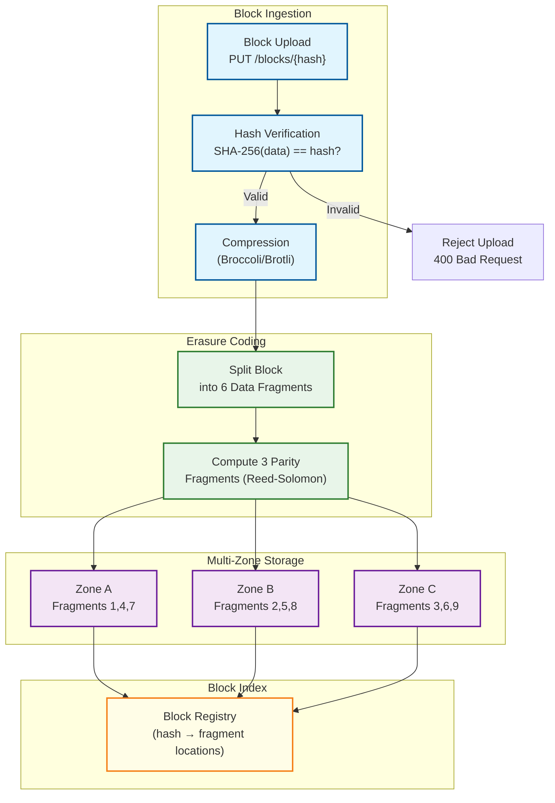
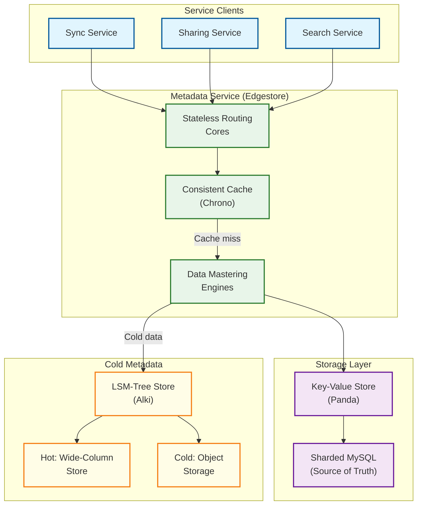

# Deep Dive & Bottlenecks

## 1. Critical Component: Sync Engine

### Why This Is Critical

The sync engine is the **heart** of a cloud file storage system. It must maintain consistency across N devices, handle offline edits, detect conflicts, and minimize bandwidth --- all while feeling instantaneous to users. Dropbox rewrote their entire sync engine from Python to Rust over 4 years (project "Nucleus") because the original couldn't handle the complexity at scale.

### How It Works Internally

The sync engine maintains a **three-tree model** (pioneered by Dropbox Nucleus):

```
┌─────────────────┐  ┌─────────────────┐  ┌─────────────────┐
│   Remote Tree   │  │    Sync Tree    │  │   Local Tree    │
│  (Server state) │  │ (Last synced    │  │ (Filesystem     │
│                 │  │  agreed state)  │  │  current state) │
└────────┬────────┘  └────────┬────────┘  └────────┬────────┘
         │                    │                    │
         │   Diff(Remote,     │   Diff(Local,      │
         │   Sync) = remote   │   Sync) = local    │
         │   changes          │   changes          │
         └────────┬───────────┘────────┬───────────┘
                  │                    │
                  ▼                    ▼
         ┌─────────────────────────────────┐
         │       Merge Algorithm           │
         │  Detect conflicts, compute ops  │
         └─────────────┬───────────────────┘
                       │
              ┌────────┴────────┐
              ▼                 ▼
      Upload to server    Apply to filesystem
      (remote changes)    (local changes)
```

**Three-Tree Merge Algorithm:**

```
ALGORITHM ThreeTreeMerge(remote_tree, sync_tree, local_tree)
  remote_changes ← DIFF(remote_tree, sync_tree)
  local_changes ← DIFF(local_tree, sync_tree)

  FOR EACH path IN UNION(remote_changes.keys, local_changes.keys):
    remote_op ← remote_changes.get(path)
    local_op ← local_changes.get(path)

    IF remote_op AND NOT local_op:
      // Server-only change: apply locally
      APPLY_LOCAL(remote_op)
      UPDATE sync_tree(path, remote_tree[path])

    ELSE IF local_op AND NOT remote_op:
      // Local-only change: upload to server
      UPLOAD(local_op)
      UPDATE sync_tree(path, local_tree[path])

    ELSE IF remote_op AND local_op:
      // Both changed: conflict resolution
      IF remote_op.type == "modify" AND local_op.type == "modify":
        IF remote_op.content_hash == local_op.content_hash:
          // Same edit on both sides: no conflict
          UPDATE sync_tree(path, local_tree[path])
        ELSE:
          // True conflict: create conflicted copy
          CREATE_CONFLICTED_COPY(path, local_op)
          APPLY_LOCAL(remote_op)  // server version wins for canonical path
          UPDATE sync_tree(path, remote_tree[path])

      ELSE IF remote_op.type == "delete" AND local_op.type == "modify":
        // Server deleted, local modified: resurrect with local version
        UPLOAD(local_op)
        UPDATE sync_tree(path, local_tree[path])

      ELSE IF remote_op.type == "modify" AND local_op.type == "delete":
        // Server modified, local deleted: server wins, re-download
        APPLY_LOCAL(remote_op)
        UPDATE sync_tree(path, remote_tree[path])
```

### Failure Modes

| Failure | Impact | Mitigation |
|---------|--------|------------|
| **Sync engine crash mid-operation** | Partial sync state, inconsistent trees | WAL (write-ahead log) for all tree mutations; replay on restart |
| **Network partition during upload** | Blocks uploaded but version not committed | Retry commit with same idempotency key; orphaned blocks cleaned by GC |
| **Filesystem event flood** (many files changed) | CPU/memory spike, sync queue backlog | Debounce filesystem events (200ms window); prioritize small files |
| **Clock skew between devices** | Incorrect conflict resolution with timestamp-based ordering | Use server-assigned sequence numbers, not client timestamps |
| **Rename detection failure** | Same file uploaded twice under different names | Content hash comparison detects moves vs copy+delete |

### How Failures Are Handled

1. **WAL-based recovery**: Every state transition is logged before execution. On crash, replay the WAL to reach consistent state.
2. **Deterministic testing**: Dropbox's "Trinity" framework uses an adversarial scheduler to deterministically verify invariants across complex execution interleavings.
3. **Rust type system**: Nucleus uses Rust's ownership and type system to "design away invalid system states" --- many concurrency bugs become compile-time errors.

---

## 2. Critical Component: Content-Addressable Block Storage

### Why This Is Critical

Block storage is the **largest infrastructure cost** and the system's durability guarantee. Dropbox's Magic Pocket manages 3+ exabytes across multiple datacenters. A single bit flip or lost block means permanent data loss for users.

### How It Works Internally



**Erasure Coding (6+3 Reed-Solomon):**

- Block split into 6 data fragments + 3 parity fragments = 9 total
- Can tolerate loss of **any 3 fragments** and still reconstruct the block
- Storage overhead: 1.5x (vs 3x for triple replication)
- Fragments distributed across 3+ availability zones

**Tiered Storage:**

| Tier | Access Pattern | Storage Medium | Redundancy | Cost |
|------|---------------|----------------|------------|------|
| **Hot** | Accessed within last 7 days | SSD / fast HDD | N-way replication | $$$ |
| **Warm** | Accessed 7-30 days ago | High-capacity HDD | Erasure coding (6+3) | $$ |
| **Cold** | Not accessed for 30+ days | SMR HDD / Archival | Cross-region erasure coding | $ |

Dropbox's SMR (Shingled Magnetic Recording) drives achieve 20% more capacity than traditional drives and operate at ~0.30 W/TB idle.

### Failure Modes

| Failure | Impact | Mitigation |
|---------|--------|------------|
| **Single disk failure** | Fragment loss | Erasure coding tolerates up to 3 fragment losses; auto-repair rebuilds fragment on healthy disk |
| **Zone failure** | Multiple fragment losses | Fragments spread across 3+ zones; 6+3 scheme survives complete zone loss |
| **Silent data corruption (bit rot)** | Undetected data corruption | Periodic background scrubbing: re-hash stored blocks, compare to registry |
| **Hash collision (SHA-256)** | Two different blocks share same hash | Probability: 2^-128 for collision; server-side verification on upload; defense-in-depth with content comparison for critical operations |
| **Storage node overload** | Increased latency, timeouts | Consistent hashing with virtual nodes for even distribution; backpressure mechanisms |

### Compression: Broccoli

Dropbox's custom compression format (modified Brotli):

- Enables **multi-core compression**: chunks compressed in parallel, then concatenated
- Standard Brotli cannot concatenate compressed streams --- Broccoli solves this
- **3x compression rate improvement** over standard Brotli
- Reduces median latency and data transfer by **>30%**
- Applied before erasure coding to minimize stored bytes

---

## 3. Critical Component: Metadata Service (Edgestore)

### Why This Is Critical

Every file operation --- listing directories, checking permissions, resolving paths, computing sync deltas --- hits the metadata layer. Dropbox's Edgestore serves **millions of queries per second** across **trillions of entries** with 5-nines availability. Metadata is often the harder scaling challenge compared to blob storage.

### How It Works Internally



**Architecture layers (Dropbox Edgestore):**

1. **Stateless Cores**: Handle routing, schema validation, request transformation
2. **Chrono (Consistent Cache)**: Provides linearizable reads by invalidating cache on writes; reduces load on backend by 10-100x
3. **Engines**: Data mastering layer --- owns consistency guarantees, handles cross-shard operations
4. **Panda (KV Store)**: Abstracts sharded MySQL; supports ACID transactions at petabyte scale, serves tens of millions of QPS at single-digit ms latency
5. **Alki (Cold Metadata)**: LSM-tree based store for infrequently accessed metadata; 5.5x cheaper per GB than Edgestore

### Failure Modes

| Failure | Impact | Mitigation |
|---------|--------|------------|
| **MySQL shard failure** | Partition of metadata unavailable | Primary-replica with automatic failover; RPO < 1 second |
| **Cache inconsistency** | Stale metadata served (phantom files, wrong permissions) | Write-through invalidation; Chrono ensures linearizable reads |
| **Cross-shard transaction failure** | Partial move/rename across namespaces | Saga pattern with compensating transactions; Panda provides cross-shard ACID |
| **Hot shard** | Single namespace overwhelms one shard | Shard splitting; rate limiting per namespace; caching absorbs read amplification |
| **Schema migration** | Downtime during schema changes | Online DDL (pt-online-schema-change); backwards-compatible migrations |

---

## 4. Concurrency & Race Conditions

### 4.1 Concurrent File Commit Race

**Scenario**: Two devices edit the same file simultaneously.

```
Timeline:
  Device A reads file v3
  Device B reads file v3
  Device A uploads new blocks, commits v4 from base v3 → SUCCESS
  Device B uploads new blocks, commits v4 from base v3 → CONFLICT (409)
```

**Solution**: Optimistic concurrency control with version-based `If-Match` header.

```
COMMIT(node_id, base_version=3, new_blocks)
  BEGIN TRANSACTION
    current ← SELECT version FROM file_nodes WHERE node_id = ? FOR UPDATE
    IF current.version != 3:
      ROLLBACK
      RETURN 409 Conflict
    UPDATE file_nodes SET version = 4 WHERE node_id = ?
    INSERT file_versions(node_id, version=4, ...)
  COMMIT
```

### 4.2 Block Reference Count Race

**Scenario**: One process increments ref_count (new file uses block), another decrements (old version deleted) simultaneously.

```
Process A: ref_count = 5 → reads 5, adds 1 → writes 6
Process B: ref_count = 5 → reads 5, subtracts 1 → writes 4
Result: ref_count = 4 or 6 (lost update!)
```

**Solution**: Atomic increment/decrement operations.

```
-- Atomic increment (no read-then-write)
UPDATE blocks SET reference_count = reference_count + 1 WHERE block_hash = ?

-- Atomic decrement with floor
UPDATE blocks SET reference_count = GREATEST(reference_count - 1, 0) WHERE block_hash = ?
```

### 4.3 Move + Edit Race

**Scenario**: Device A moves file from `/docs/report.md` to `/archive/report.md`. Device B simultaneously edits `/docs/report.md`.

**Solution**: Operations use `node_id` (immutable), not paths. Move changes the parent pointer; edit changes the content. Both succeed without conflict because they modify orthogonal fields.

### 4.4 Share Revocation Race

**Scenario**: Admin revokes user's access while user is mid-download.

**Solution**:
- Metadata check at commit/download start (coarse-grained)
- Block download uses short-lived signed URLs (expire in 15 min)
- Access revocation takes effect on next metadata check, not mid-transfer

---

## 5. Slowest part of the process Analysis

### Slowest part of the process #1: Metadata Hot Spots

**Problem**: Popular shared folders (e.g., company-wide team folder) create hot shards --- one namespace receives disproportionate traffic.

**Metrics**:
- Normal shard: ~10K QPS
- Hot shard: 500K+ QPS (50x normal)

**Mitigation**:

| Strategy | Trade-off |
|----------|-----------|
| **Read replicas** | Increases read capacity but adds replication lag |
| **Aggressive caching (Chrono)** | Absorbs 90%+ of reads; invalidation must be correct |
| **Shard splitting** | Splits hot namespace across multiple shards; adds cross-shard query complexity |
| **Rate limiting per namespace** | Protects infrastructure but degrades user experience |
| **Request coalescing** | Multiple identical concurrent requests share one backend call |

### Slowest part of the process #2: Large File Upload Throughput

**Problem**: Users uploading multi-GB files (videos, backups) saturate network links and block storage write capacity.

**Metrics**:
- Single 10 GB file = 2,500 blocks at 4 MB each
- With 1 Gbps upload: ~80 seconds for content, plus overhead

**Mitigation**:

| Strategy | Effect |
|----------|--------|
| **Parallel block upload** (8-16 concurrent) | 8-16x throughput improvement |
| **Client-side dedup check** | Skip blocks already on server (50-70% savings) |
| **Compression (Broccoli)** | 30%+ reduction in bytes transferred |
| **Resumable uploads** | Don't restart on network interruption |
| **Regional upload endpoints** | Reduce latency to nearest datacenter |
| **Streaming sync** | Other devices start downloading before upload completes |

### Slowest part of the process #3: Notification Fan-out for Shared Content

**Problem**: A file in a shared folder with 10,000 members generates 10,000 notification deliveries on every save.

**Metrics**:
- Active team folder with 10K members
- 100 file changes/hour
- = 1M notifications/hour from one folder

**Mitigation**:

| Strategy | Effect |
|----------|--------|
| **Batch/debounce notifications** | Aggregate changes within 5s window; send one notification |
| **Hierarchical fan-out** | Notify team leaders → team leaders notify members |
| **Online-only delivery** | Only notify currently connected devices; others poll on next connect |
| **Priority tiers** | Direct shares: immediate; team folders: batched; public links: no notification |
| **Change feed with cursors** | Devices pull changes at their own pace vs being pushed |

### Slowest part of the process #4: Garbage Collection at Scale

**Problem**: With trillions of file versions being created and deleted, the GC system must safely reclaim unreferenced blocks without accidentally deleting blocks that are still in use (e.g., during an in-flight upload).

**Metrics**:
- Blocks becoming unreferenced: ~50M/day
- GC processing capacity needed: ~2M blocks/hour
- Grace period: 7 days (to protect in-flight uploads)

**Mitigation**:

| Strategy | Effect |
|----------|--------|
| **Two-phase GC** | Phase 1: mark candidates (ref_count=0); Phase 2: verify + delete after grace period |
| **Bloom filter pre-check** | Skip blocks that definitely have references without querying block_ref table |
| **Batch processing** | Process GC candidates in batches of 10K; reduce database round-trips |
| **Rate-limited deletion** | Delete at most N blocks/minute per storage node to avoid I/O storms |
| **Cross-reference verification** | Before deleting, scan all file versions created in the last 7 days for references |

### Slowest part of the process #5: Cross-Region Sync Latency

**Problem**: Users collaborating across regions (e.g., US and EU offices editing the same folder) experience elevated sync latency due to cross-region metadata replication.

**Metrics**:
- Intra-region sync: <2 seconds
- Cross-region sync: 5-15 seconds (depending on replication lag)
- Worst case (with conflict): 15-30 seconds

**Mitigation**:

| Strategy | Effect |
|----------|--------|
| **Regional metadata read replicas** | Read operations served locally; writes forwarded to primary region |
| **Conflict-free metadata updates** | Some metadata operations (e.g., access log, view count) use CRDTs to avoid cross-region coordination |
| **Streaming sync across regions** | Block content streams directly between regions without waiting for metadata commit |
| **Proximity-based shard placement** | Place metadata shards for single-region teams in that region |
| **Async notification with regional relay** | Each region has a notification relay that subscribes to the global change feed |

---

## 6. Case Study: Dropbox Nucleus --- The 4-Year Rust Rewrite

### Background

Dropbox's original sync engine was written in Python. By 2016, it had become unmaintainable:
- **Concurrency bugs** were the #1 source of user-facing issues
- **Performance** was limited by Python's GIL and dynamic typing overhead
- **State space explosion**: the sync engine had to handle every combination of local/remote changes across N devices with offline support --- the number of valid states was too large for manual reasoning

### Key Technical Decisions

| Decision | Rationale |
|----------|-----------|
| **Rust over Go/Java** | Ownership system makes invalid concurrency states unrepresentable; zero-cost abstractions for performance-critical code |
| **Formal state machine** | Sync logic encoded as explicit state machine with typed transitions; invalid transitions are compile errors |
| **Trinity test framework** | Adversarial deterministic scheduler; explores all execution interleavings to find bugs |
| **Three-tree model** | Replaced ad-hoc diff logic with principled three-way merge (Remote, Local, Sync trees) |
| **WAL for crash recovery** | Every state transition logged before execution; exact replay on restart |

### Results

- **Correctness**: Entire class of concurrency bugs eliminated at compile time
- **Performance**: 2x faster sync for common operations
- **Reliability**: Sync-related support tickets dropped significantly after Nucleus rollout
- **Developer velocity**: New sync features could be added safely; type system catches regressions

### Architectural Lessons

1. **"Make impossible states impossible"**: Rust's type system + explicit state machines = sync bugs become compile errors
2. **Deterministic testing > fuzzing for stateful systems**: Trinity's adversarial scheduler provides better coverage than random fuzzing for state-machine-driven logic
3. **Rewrite justified by core product promise**: Sync correctness IS the product; a 4-year investment in correctness infrastructure was justified by the business criticality
4. **Three-tree model is universal**: This pattern applies to any bidirectional replication system (Git uses the same principle with merge-base)

---

## 7. Performance Optimization Techniques

### Client-Side Optimization Stack

| Technique | Benefit | Implementation |
|-----------|---------|---------------|
| **Filesystem event debouncing** | Prevent sync storms from rapid saves | Coalesce events within 200ms window; process only final state |
| **Parallel block upload** | 8-16x upload throughput | Upload 8-16 blocks concurrently; limit by available bandwidth |
| **Local block cache** | Skip re-downloading unchanged blocks | LRU cache keyed by block_hash; configurable size limit |
| **Predictive pre-fetch** | Faster sync for frequently accessed shared content | Pre-download blocks for files opened recently by collaborators |
| **Background compression** | Reduce upload bytes by 30%+ | Broccoli compression on a background thread; don't block the UI |
| **Batch metadata queries** | Reduce round-trips | Aggregate multiple file stat calls into single batch API request |
| **Connection pooling** | Eliminate TLS handshake overhead | Keep-alive connections to API gateway; reuse across operations |

### Server-Side Optimization Stack

| Technique | Benefit | Implementation |
|-----------|---------|---------------|
| **Request coalescing** | Reduce DB load for popular shared folders | Multiple concurrent reads for same resource share one DB query |
| **Bloom filter for dedup** | O(1) dedup check before DB lookup | Client-side Bloom filter of recently uploaded hashes; false positives acceptable |
| **Block placement affinity** | Faster reads by co-locating related blocks | Place blocks of same file on same storage node when possible |
| **Adaptive chunk size** | Balance dedup ratio vs metadata overhead | Smaller chunks for frequently edited files; larger for archival content |
| **Zero-copy block forwarding** | Reduce memory/CPU for streaming sync | Forward blocks between clients via kernel-level splice/sendfile |
| **Write coalescing** | Reduce storage IOPS | Buffer multiple small block writes; flush to disk in batches |
