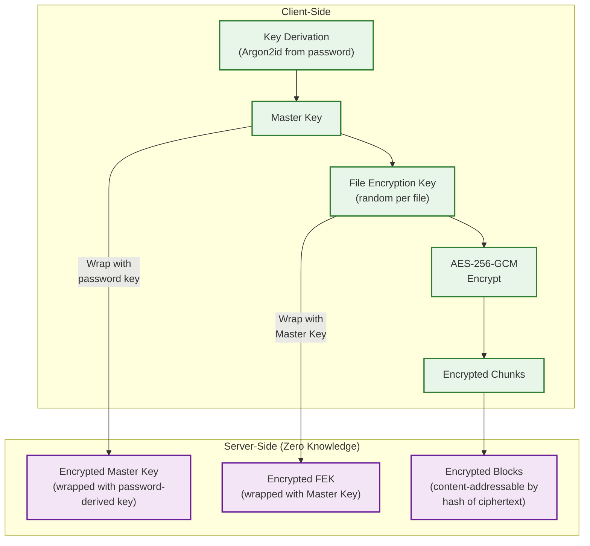
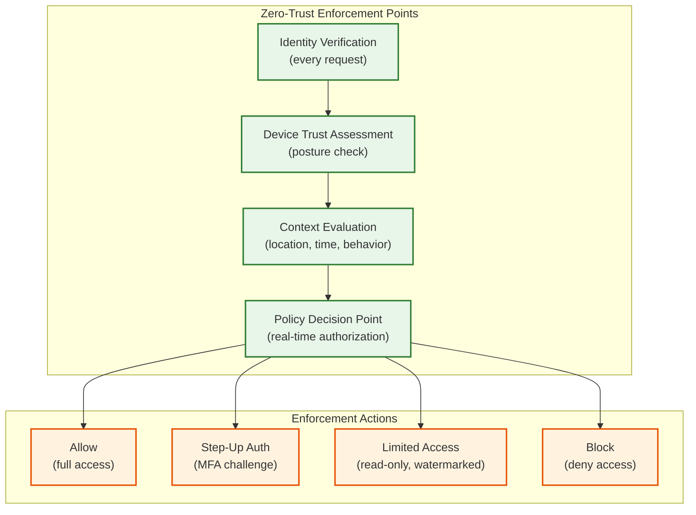

# Security & Compliance

## 1. Authentication & Authorization

### 1.1 Authentication Mechanism

| Method | Use Case | Details |
|--------|----------|---------|
| **OAuth 2.0 + OIDC** | Web and mobile clients, third-party integrations | Authorization code flow with PKCE; refresh tokens for long-lived sessions |
| **API Keys** | Server-to-server integrations | Scoped keys with per-key rate limits; rotatable |
| **SSO (SAML 2.0 / OIDC)** | Enterprise customers | Federated identity; IdP-initiated and SP-initiated flows |
| **Device Authentication** | Desktop/mobile sync clients | Device certificate + user token; device registered on first sync |
| **MFA** | All accounts (enforced for enterprise) | TOTP, WebAuthn/FIDO2, SMS fallback |

### 1.2 Authorization Model

**Hybrid RBAC + Relationship-Based Access Control (ReBAC)**

```
┌─────────────────────────────────────────────────┐
│ Authorization Decision Flow                      │
│                                                  │
│ Request(user, action, resource)                  │
│   │                                              │
│   ├─→ 1. Check direct grants (GRANT table)      │
│   │     user has "edit" on /docs/report.md?      │
│   │                                              │
│   ├─→ 2. Check inherited permissions (ancestry)  │
│   │     user has "edit" on /docs/ (parent)?      │
│   │     Walk up folder tree to root              │
│   │                                              │
│   ├─→ 3. Check team/group membership             │
│   │     user in "engineering" team that has       │
│   │     "edit" on /docs/?                        │
│   │                                              │
│   ├─→ 4. Check share links                       │
│   │     request has valid share link token?       │
│   │                                              │
│   └─→ 5. Check namespace ownership               │
│         user owns the namespace?                 │
│                                                  │
│ Result: ALLOW | DENY                             │
└─────────────────────────────────────────────────┘
```

**Permission hierarchy:**

| Permission | Can View | Can Download | Can Comment | Can Edit | Can Share | Can Delete |
|------------|----------|-------------|-------------|----------|-----------|------------|
| **Viewer** | Yes | Yes | No | No | No | No |
| **Commenter** | Yes | Yes | Yes | No | No | No |
| **Editor** | Yes | Yes | Yes | Yes | Limited | No |
| **Owner** | Yes | Yes | Yes | Yes | Yes | Yes |

### 1.3 Token Management

| Token Type | Lifetime | Storage | Refresh Strategy |
|------------|----------|---------|-----------------|
| Access token (JWT) | 1 hour | Client memory (never disk) | Refresh token exchange |
| Refresh token | 30 days (sliding) | Encrypted client keychain | Auto-refresh; revoked on logout |
| Device token | Until revoked | OS credential store | Re-authenticated on device re-link |
| Share link token | Until expiry or revocation | URL parameter | Not refreshable; new link = new token |
| Block download URL | 15 minutes | Signed URL | Generated per-request |

---

## 2. Data Security

### 2.1 Encryption at Rest

| Layer | Algorithm | Key Management |
|-------|-----------|----------------|
| **Block storage** | AES-256-GCM per block | Per-tenant data encryption key (DEK) wrapped by master key (KEK) |
| **Metadata database** | AES-256 (transparent data encryption) | Database-level encryption; keys in HSM |
| **Search index** | AES-256 | Index-level encryption |
| **Backups** | AES-256-GCM | Separate backup encryption keys |
| **Client-side (optional E2EE)** | AES-256-GCM with client-held keys | Keys derived from user password; server has zero knowledge |

**Key hierarchy:**

```
┌─────────────────────────┐
│ Root Key (HSM-protected) │  ← Never leaves HSM
└────────────┬────────────┘
             │
    ┌────────┴────────┐
    ▼                 ▼
┌──────────┐   ┌──────────┐
│ KEK-1    │   │ KEK-2    │  ← Key Encryption Keys (per region)
│ (Region A│   │ (Region B│
└────┬─────┘   └────┬─────┘
     │               │
  ┌──┴──┐         ┌──┴──┐
  ▼     ▼         ▼     ▼
┌────┐┌────┐   ┌────┐┌────┐
│DEK1││DEK2│   │DEK3││DEK4│  ← Data Encryption Keys (per tenant)
└────┘└────┘   └────┘└────┘
```

### 2.2 Encryption in Transit

| Channel | Protocol | Details |
|---------|----------|---------|
| Client ↔ API Gateway | TLS 1.3 | Certificate pinning on mobile clients |
| Service ↔ Service | mTLS | Mutual authentication with service certificates |
| LAN Sync (peer-to-peer) | HTTPS | Device certificates validate peer identity |
| Replication (cross-region) | TLS 1.3 | Dedicated replication channels with certificate rotation |

### 2.3 PII Handling

| Data Type | Classification | Handling |
|-----------|---------------|----------|
| User email/name | PII | Encrypted at rest; access-logged |
| File names/paths | Potentially PII | Encrypted; excluded from analytics unless anonymized |
| File content | User data (may contain PII) | Encrypted; never accessed by staff without legal process |
| IP addresses | PII (under GDPR) | Retained 90 days for security; then anonymized |
| Device identifiers | Pseudonymous | Hashed before analytics; revocable on device unlink |
| Sharing activity | Behavioral data | Anonymized after 1 year; aggregated for analytics |

### 2.4 Data Masking / Anonymization

- **Admin tools**: File content never visible to support staff; only metadata (names, sizes, timestamps)
- **Analytics pipeline**: User IDs replaced with anonymized tokens before export
- **Audit logs**: Contain operation type and resource ID; content hashes but not content
- **Search index**: Built per-tenant; cross-tenant search impossible by design

---

## 3. Threat Model

### 3.1 Top Attack Vectors

| # | Attack Vector | Risk Level | Mitigation |
|---|--------------|------------|------------|
| 1 | **Account takeover** (credential stuffing, phishing) | **Critical** | MFA enforcement; breached password detection; anomalous login alerts; device trust scoring |
| 2 | **Malicious file upload** (malware distribution via shared links) | **High** | Async malware scanning on upload; quarantine flagged files; block known malicious hashes |
| 3 | **Insider threat** (employee accessing user data) | **High** | Zero-trust access to production; all access logged + audited; no plaintext content access; break-glass procedures |
| 4 | **API abuse** (data exfiltration via API) | **High** | Rate limiting per user/IP; anomalous download pattern detection; API key scoping |
| 5 | **Block hash manipulation** (claiming ownership of blocks via known hash) | **Medium** | Server-side hash verification; namespace-scoped dedup (not global for free tier); access checks before block serve |

### 3.2 Rate Limiting & DDoS Protection

| Layer | Protection | Details |
|-------|-----------|---------|
| **Edge/CDN** | DDoS mitigation | Anycast absorption; challenge-based filtering (proof-of-work, CAPTCHA) |
| **API Gateway** | Per-user rate limiting | Token bucket: 1000 req/min metadata, 100 req/min uploads |
| **Per-IP** | Connection rate limiting | Max 100 new connections/minute per IP |
| **Per-device** | Sync rate limiting | Max 1 long-poll connection per device; upload bandwidth cap |
| **Per-namespace** | Operation rate limiting | Protect against runaway scripts hitting shared folders |
| **Block service** | Upload size validation | Max 8 MB per block; max 50 GB per file; reject oversized payloads early |

### 3.3 Deduplication Security Concern

**Cross-user dedup attack**: An attacker could probe whether a specific file exists in the system by uploading its hash and checking if dedup reports it as "existing."

**Mitigation:**
- **Namespace-scoped dedup** for free/personal accounts (dedup only within same user)
- **Team-scoped dedup** for business accounts (dedup within same organization)
- **Server-side hash verification** on all uploads (prevents hash-only claims)
- **Convergent encryption** (optional): encrypt block with key derived from content hash, making dedup work on ciphertext

---

## 4. Compliance

### 4.1 GDPR (EU)

| Requirement | Implementation |
|-------------|---------------|
| **Right to access** | Export API provides all user data in machine-readable format |
| **Right to erasure** | Account deletion triggers hard delete of all metadata + block GC (ref_count decrement) |
| **Data portability** | Standard export formats (ZIP of files + metadata JSON) |
| **Data minimization** | Only collect necessary metadata; content never analyzed without consent |
| **Breach notification** | Automated detection → 72-hour notification pipeline |
| **Data residency** | EU data stored in EU regions; configurable per enterprise account |
| **DPO** | Designated Data Protection Officer; privacy impact assessments |

### 4.2 SOC 2 Type II

| Trust Principle | Controls |
|----------------|----------|
| **Security** | Encryption at rest/transit, MFA, vulnerability scanning, penetration testing |
| **Availability** | 99.99% SLA, multi-zone redundancy, disaster recovery tested quarterly |
| **Confidentiality** | Access controls, audit logging, data classification, employee background checks |
| **Processing Integrity** | Hash verification on upload/download, checksums on block storage |
| **Privacy** | Privacy policy, consent management, data subject request handling |

### 4.3 HIPAA (Healthcare)

| Requirement | Implementation |
|-------------|---------------|
| **BAA** | Business Associate Agreement available for enterprise accounts |
| **PHI protection** | E2EE option for healthcare data; access logging for PHI-containing folders |
| **Audit trail** | Immutable audit logs retained 7 years; tamper-evident storage |
| **Access controls** | RBAC with minimum necessary access; time-limited access grants |
| **Breach notification** | Automated detection with 60-day notification compliance |

### 4.4 Additional Standards

| Standard | Relevance |
|----------|-----------|
| **ISO 27001** | Information security management system certification |
| **FedRAMP** | US government cloud authorization (if serving government customers) |
| **PCI-DSS** | If storing payment card data in files (discouraged but possible) |
| **CCPA** | California privacy law compliance (similar to GDPR) |
| **ITAR/EAR** | Export control for defense/government files (geo-restriction required) |

---

## 5. End-to-End Encryption (E2EE) Architecture

For users requiring zero-knowledge encryption (server cannot read file content):



**Trade-offs of E2EE:**

| Benefit | Cost |
|---------|------|
| Server cannot read data | Server-side search impossible |
| Protection against insider threats | Key loss = permanent data loss |
| Regulatory compliance for sensitive data | Sharing requires key exchange protocol |
| User trust and privacy | Deduplication less effective (encrypted blocks differ per user) |

**Post-quantum consideration**: Leading providers are beginning to adopt post-quantum cryptography (e.g., Kyber 512) for key exchange to protect against future quantum attacks on current encrypted data.

---

## 6. Zero-Trust Architecture for File Storage

### Principles

Traditional perimeter-based security assumes internal network traffic is trusted. Zero-trust assumes **no implicit trust** --- every request is authenticated and authorized regardless of origin.



### Device Trust Scoring

| Signal | Weight | Description |
|--------|--------|-------------|
| **OS patch level** | 25% | Unpatched devices get lower trust scores |
| **Disk encryption** | 20% | Full-disk encryption required for corporate devices |
| **Client version** | 15% | Outdated sync clients may have known vulnerabilities |
| **Device management** | 15% | MDM-enrolled devices get higher trust |
| **Location** | 10% | Accessing from unexpected geography lowers score |
| **Behavior anomaly** | 15% | Unusual download volume, time-of-day, or access patterns |

**Trust score → access decision:**
- Score 80-100: Full access
- Score 60-79: Standard access with audit logging
- Score 40-59: Read-only access; step-up MFA for writes
- Score <40: Access blocked; admin notification

---

## 7. Data Loss Prevention (DLP)

### Content Scanning Pipeline

| Stage | Detection | Action |
|-------|-----------|--------|
| **Upload scan** | Pattern matching (SSN, credit card, API keys) | Block upload or quarantine + alert admin |
| **Share scan** | Check content sensitivity before external sharing | Warn user; block if policy prohibits |
| **OCR scan** | Extract text from images/PDFs for pattern matching | Detect sensitive data in non-text files |
| **Behavioral DLP** | Detect mass download (>1000 files in 1 hour) | Rate limit; alert security team |
| **AI classification** | ML model classifies documents by sensitivity | Auto-apply labels (Public, Internal, Confidential, Restricted) |

### Watermarking for Sensitive Files

For enterprises requiring content tracing:
- **Visible watermarks**: User email + timestamp overlaid on document previews
- **Invisible watermarks**: Steganographic markers embedded in downloaded files; enables tracing leaked documents back to the downloading user
- **Dynamic watermarks**: Applied at download time (not stored); different per user/device

---

## 8. Post-Quantum Cryptography Transition

### Migration Strategy

| Phase | Timeline | Action |
|-------|----------|--------|
| **Phase 1: Hybrid key exchange** | 2025 | Use ML-KEM (Kyber-768) + X25519 hybrid for TLS key exchange; backward compatible |
| **Phase 2: Hybrid signatures** | 2025-2026 | ML-DSA (Dilithium) + Ed25519 for service certificates |
| **Phase 3: Data re-encryption** | 2026-2027 | Re-wrap DEKs with post-quantum KEKs; blocks remain encrypted (new key wrapping only) |
| **Phase 4: Full PQC** | 2027+ | Phase out classical-only algorithms |

**Why hybrid**: Hybrid schemes maintain security even if either the classical or post-quantum algorithm is broken. This provides a safety net during the transition period.

**"Harvest now, decrypt later" threat**: Adversaries may be recording encrypted traffic today, planning to decrypt it with future quantum computers. This is especially relevant for file storage where data may remain valuable for decades. Post-quantum key exchange protects against this threat.

---

## 9. Incident Response for File Storage

### Severity Classification

| Severity | Definition | Response Time | Example |
|----------|-----------|---------------|---------|
| **SEV-1** | Data loss or unauthorized data exposure | 15 min | Block storage corruption; credential leak exposing user files |
| **SEV-2** | Service unavailability affecting >1% of users | 30 min | Regional metadata DB outage; sync pipeline stalled |
| **SEV-3** | Degraded performance affecting user experience | 2 hours | Elevated sync latency; search unavailability |
| **SEV-4** | Minor issue with workaround available | 24 hours | Single shard degraded; preview generation delays |

### Data Breach Response Timeline

```
Hour 0:     Detection (automated monitoring or user report)
Hour 0-1:   Triage — confirm breach scope, affected users, data types
Hour 1-4:   Containment — revoke compromised credentials, isolate affected systems
Hour 4-24:  Investigation — root cause analysis, full impact assessment
Hour 24-48: Notification preparation — legal review, communication drafting
Hour 48-72: User notification (GDPR 72-hour requirement)
Day 3-14:   Remediation — fix root cause, harden defenses
Day 14-30:  Post-incident review — publish internal post-mortem, update playbooks
```
