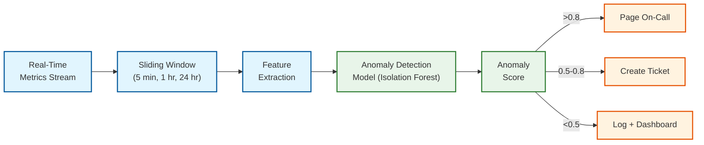

# Observability

## 1. Metrics (USE/RED)

### 1.1 Key Metrics

#### Service-Level Metrics (RED)

| Service | Rate | Errors | Duration (p50/p95/p99) |
|---------|------|--------|------------------------|
| **Sync Service** | Sync operations/sec | Failed syncs/sec | Sync completion time |
| **Metadata Service** | Metadata queries/sec | 5xx responses/sec | Query latency |
| **Block Service** | Block uploads/sec, Block downloads/sec | Upload failures/sec | Upload/download latency |
| **Notification Service** | Notifications delivered/sec | Delivery failures/sec | End-to-end notification latency |
| **Search Service** | Search queries/sec | Timeout/error rate | Search latency |

#### Infrastructure Metrics (USE)

| Resource | Utilization | Saturation | Errors |
|----------|------------|------------|--------|
| **Storage nodes** | Disk usage %, IOPS utilization | Write queue depth | I/O errors, disk failures |
| **Metadata DB** | CPU %, memory %, connection pool | Replication lag, lock wait time | Deadlocks, connection refused |
| **Network** | NIC bandwidth % | TCP retransmit rate | Packet drops, timeout rate |
| **Cache (Chrono)** | Memory usage, hit rate | Eviction rate | Invalidation failures |
| **Message Queue** | Broker disk %, partition count | Consumer lag (messages behind) | Producer rejections |

#### Business Metrics

| Metric | Description | Alert Threshold |
|--------|-------------|-----------------|
| **Sync success rate** | % of sync operations completing without error | <99.5% |
| **Dedup ratio** | % of blocks skipped due to deduplication | Track trend; sudden drop indicates issue |
| **Upload throughput** | GB/s uploaded across all users | Track trend; correlate with user growth |
| **Active sync connections** | Number of devices actively syncing | Sudden drop = connectivity issue |
| **Conflict rate** | % of commits resulting in conflicts | >5% indicates UX issue |
| **Storage efficiency** | Logical storage / Physical storage ratio | Track dedup + compression effectiveness |
| **Time to first byte (TTFB)** | Download latency from request to first byte | >500ms p99 triggers investigation |

### 1.2 Dashboard Design

#### Executive Dashboard

```
┌─────────────────────────────────────────────────────────┐
│ Cloud File Storage - Executive Overview                  │
├──────────────┬──────────────┬──────────────┬────────────┤
│ DAU          │ Sync Success │ Availability │ Storage    │
│ 102.3M       │ 99.97%       │ 99.995%      │ 637 PB    │
│ ▲ 2.1% WoW  │ ● Healthy    │ ● Healthy    │ ▲ 1.2%    │
├──────────────┴──────────────┴──────────────┴────────────┤
│ [Sync Latency p99 - 24h]  [Upload Throughput - 24h]     │
│ [Error Rate - 24h]         [Active Connections - 24h]   │
└─────────────────────────────────────────────────────────┘
```

#### Operations Dashboard

```
┌─────────────────────────────────────────────────────────┐
│ Operations - Real-Time                                   │
├─────────────────────────────────────────────────────────┤
│ QPS by Service:                                          │
│   Metadata: ████████████████████ 245K                   │
│   Block Up: ████████ 89K                                │
│   Block Dn: ██████████████ 156K                         │
│   Search:   ███ 23K                                     │
│   Sync:     ██████ 67K                                  │
├─────────────────────────────────────────────────────────┤
│ Latency Heatmap (p50 / p95 / p99):                      │
│   Metadata:  8ms  /  35ms  /  78ms   ● OK              │
│   Upload:    180ms / 650ms  / 1.2s   ● OK              │
│   Download:  45ms  / 180ms  / 420ms  ● OK              │
│   Sync:      120ms / 890ms  / 2.1s   ⚠ Watch           │
├─────────────────────────────────────────────────────────┤
│ Storage Health:                                          │
│   Healthy nodes: 4,891 / 4,900 (99.8%)                  │
│   Fragment repairs (last 24h): 127                       │
│   GC blocks reclaimed (last 24h): 2.3M                  │
│   Dedup ratio (last 24h): 67.3%                         │
├─────────────────────────────────────────────────────────┤
│ DB Health:                                               │
│   Replication lag (max): 0.3s                            │
│   Active connections: 12,450 / 15,000 (83%)             │
│   Cache hit rate: 94.2%                                  │
│   Hot shards (>100K QPS): 3                              │
└─────────────────────────────────────────────────────────┘
```

### 1.3 Alerting Thresholds

| Severity | Metric | Threshold | Action |
|----------|--------|-----------|--------|
| **P1 (Page)** | Sync success rate | <99% for 5 min | Page on-call; potential data loss risk |
| **P1 (Page)** | Block storage: fragments below quorum | Any block with <6 healthy fragments | Immediate fragment repair |
| **P1 (Page)** | Metadata DB replication lag | >10s for 3 min | Failover risk; investigate replication |
| **P2 (Page)** | API error rate (5xx) | >1% for 5 min | Page on-call |
| **P2 (Page)** | Upload p99 latency | >3s for 10 min | Investigate block service or storage |
| **P3 (Ticket)** | Cache hit rate | <85% for 30 min | Cache capacity or invalidation issue |
| **P3 (Ticket)** | GC queue depth | >1M pending for 1 hour | Scale GC workers |
| **P3 (Ticket)** | Storage utilization | >85% per node | Plan capacity addition |
| **P4 (Info)** | Dedup ratio change | >10% change WoW | Investigate data pattern shift |
| **P4 (Info)** | Conflict rate | >5% of commits | Review sync algorithm or UX |

---

## 2. Logging

### 2.1 What to Log

| Category | Events | Log Level |
|----------|--------|-----------|
| **Authentication** | Login, logout, MFA challenge, failed auth, token refresh | INFO / WARN |
| **File operations** | Create, update, delete, move, rename (metadata only, never content) | INFO |
| **Sync events** | Sync start, sync complete, conflict detected, conflict resolved | INFO / WARN |
| **Block operations** | Block upload, block download, dedup hit, dedup miss | DEBUG (sampled 1%) |
| **Sharing** | Grant, revoke, link create, link access | INFO |
| **Errors** | 4xx/5xx responses, timeout, circuit breaker state changes | WARN / ERROR |
| **Security events** | Suspicious login, Brute Force (Checking every single possibility) attempt, permission violation | WARN / ERROR |
| **Admin operations** | Configuration change, deployment, shard migration | INFO |

### 2.2 Log Levels Strategy

| Level | Usage | Volume | Retention |
|-------|-------|--------|-----------|
| **ERROR** | Unrecoverable failures, data integrity issues | Low | 90 days |
| **WARN** | Recoverable failures, degraded performance, security events | Medium | 60 days |
| **INFO** | Normal operations, business events, audit trail | High | 30 days |
| **DEBUG** | Detailed sync state, block operations | Very High (sampled) | 7 days |
| **TRACE** | Per-block hashing, per-chunk operations | Extreme (sampled 0.1%) | 24 hours |

### 2.3 Structured Logging Format

```json
{
  "timestamp": "2026-03-08T10:30:00.123Z",
  "level": "INFO",
  "service": "sync-service",
  "instance_id": "sync-west-042",
  "trace_id": "abc123def456",
  "span_id": "span789",
  "user_id": "u_hashed_12345",
  "device_id": "d_67890",
  "event": "sync.commit.success",
  "file_id": "f_abc123",
  "namespace_id": "ns_456",
  "version": 7,
  "blocks_uploaded": 3,
  "blocks_deduped": 12,
  "duration_ms": 1250,
  "bytes_transferred": 12582912,
  "dedup_ratio": 0.8
}
```

**Privacy considerations:**
- User IDs are hashed/pseudonymized in logs
- File names and paths are **never** logged (potential PII)
- File content is **never** logged
- IP addresses retained for 90 days, then anonymized

---

## 3. Distributed Tracing

### 3.1 Trace Propagation Strategy

**W3C Trace Context** standard (`traceparent` header) propagated across all services:

```
Client → API Gateway → Sync Service → Metadata Service → Database
  │                        │                │
  │         trace_id: abc123               │
  │         span: api_request              │
  │                        │               │
  │                  span: sync_commit     │
  │                        │               │
  │                        │         span: metadata_write
  │                        │               │
  │                  span: notify_devices  │
  │                        │               │
  └── Total duration: 1.2s ───────────────┘
```

### 3.2 Key Spans to Instrument

| Span Name | Service | What It Captures |
|-----------|---------|------------------|
| `file.upload` | API Gateway | End-to-end upload (chunking → dedup → store → commit) |
| `sync.check_blocks` | Sync Service | Dedup check for list of block hashes |
| `block.store` | Block Service | Single block storage (verify → compress → erasure code → write) |
| `metadata.write` | Metadata Service | File version creation (acquire lock → write → invalidate cache) |
| `metadata.read` | Metadata Service | File tree query (cache check → DB fallback) |
| `notification.fanout` | Notification Service | Deliver change notification to all devices |
| `search.index` | Search Service | Index a file's content and metadata |
| `conflict.resolve` | Sync Service | Detect and resolve file conflict |
| `gc.collect` | GC Worker | Block garbage collection cycle |

### 3.3 Trace Sampling Strategy

| Condition | Sample Rate | Reason |
|-----------|-------------|--------|
| Error responses (4xx, 5xx) | 100% | Always trace errors |
| Slow requests (>p95) | 100% | Always trace slow paths |
| Conflict events | 100% | Always trace conflicts |
| Normal file operations | 1% | Volume control |
| Block transfers | 0.1% | Extremely high volume |
| Health checks | 0% | No value in tracing |

---

## 4. Alerting

### 4.1 Critical Alerts (Page-Worthy)

| Alert | Condition | Response |
|-------|-----------|----------|
| **Data durability risk** | Any block with <6 healthy fragments (out of 9) | Immediate: trigger emergency fragment repair; escalate if <4 |
| **Sync pipeline stalled** | Zero successful syncs for 2+ minutes in any region | Investigate sync service health; check metadata DB connectivity |
| **Metadata DB failover** | Primary unavailable, replica promoted | Verify data consistency; check RPO; update monitoring |
| **Storage node cluster loss** | >5 storage nodes unreachable in same zone | Trigger rebalancing; verify erasure coding coverage |
| **Authentication service down** | Login success rate <90% for 3 min | All new connections affected; existing sessions still work |

### 4.2 Warning Alerts

| Alert | Condition | Response |
|-------|-----------|----------|
| **Elevated error rate** | 5xx rate >0.5% for 10 min | Investigate; may auto-resolve |
| **Replication lag** | Metadata DB lag >5s for 5 min | Monitor; prepare for failover if worsening |
| **Cache degradation** | Hit rate <85% for 15 min | Check for cache eviction storm; scale cache |
| **Upload queue building** | >5K pending uploads for 10 min | Scale block service; check storage throughput |
| **Disk space warning** | Storage node >80% capacity | Plan expansion; check GC backlog |
| **Consumer lag** | Message queue consumer >60s behind | Scale consumers; check downstream health |

### 4.3 Runbook References

| Alert | Runbook | Key Steps |
|-------|---------|-----------|
| Fragment repair | `runbook/storage/fragment-repair.md` | 1. Identify affected blocks, 2. Verify quorum, 3. Reconstruct from healthy fragments, 4. Store on new node |
| Metadata DB failover | `runbook/database/metadata-failover.md` | 1. Confirm primary down, 2. Select replica with lowest lag, 3. Promote, 4. Repoint routing, 5. Verify |
| Sync pipeline stall | `runbook/sync/pipeline-stall.md` | 1. Check service health, 2. Check DB connectivity, 3. Check message queue, 4. Check for hot shards |
| Storage capacity | `runbook/storage/capacity-expansion.md` | 1. Order hardware, 2. Rack and provision, 3. Add to consistent hashing ring, 4. Monitor rebalancing |

---

## 5. Operational Dashboards Summary

```
┌────────────────────────────────────────────────────────┐
│                 Dashboard Hierarchy                     │
├────────────────────────────────────────────────────────┤
│                                                         │
│  Level 1: Executive                                     │
│  ├── Availability SLO status                            │
│  ├── User-facing error rate                             │
│  ├── DAU/MAU trends                                     │
│  └── Storage growth                                     │
│                                                         │
│  Level 2: Service                                       │
│  ├── Per-service RED metrics                            │
│  ├── Sync success/failure breakdown                     │
│  ├── Dedup effectiveness                                │
│  └── Cross-service dependency health                    │
│                                                         │
│  Level 3: Infrastructure                                │
│  ├── Storage node health matrix                         │
│  ├── Database shard heat map                            │
│  ├── Network bandwidth by region                        │
│  └── Cache performance                                  │
│                                                         │
│  Level 4: Debug                                         │
│  ├── Individual request traces                          │
│  ├── Slow query analysis                                │
│  ├── Block operation details                            │
│  └── Sync state machine transitions                     │
│                                                         │
└────────────────────────────────────────────────────────┘
```

---

## 6. SLI/SLO Framework

### Service Level Indicators (SLIs)

| SLI | Definition | Measurement Method |
|-----|-----------|-------------------|
| **Sync availability** | % of sync operations completing within 10s | Server-side latency histogram |
| **Upload success rate** | % of block uploads that succeed on first attempt | 2xx / total upload responses |
| **Download TTFB** | Time to first byte for file downloads | Client-instrumented timing |
| **Metadata latency** | p99 latency for metadata read operations | Server-side span duration |
| **Data durability** | % of blocks with ≥6 healthy fragments (out of 9) | Background scrubbing results |
| **Notification latency** | Time from file save to notification on other devices | Cross-device end-to-end measurement |

### SLO Definitions

| SLO | Target | Error Budget (30-day) | Burn Rate Alert |
|-----|--------|----------------------|-----------------|
| Sync availability | 99.95% | 21.6 minutes of sync failures | 10x burn rate → page in 6 min |
| Upload success rate | 99.9% | 43.2 minutes equivalent | 5x burn rate → page in 1 hour |
| Download TTFB <500ms | 99.5% | 3.6 hours equivalent | 3x burn rate → page in 4 hours |
| Metadata p99 <100ms | 99.9% | 43.2 minutes | 10x burn rate → page in 6 min |
| Data durability >99.9999999999% | 12 nines | ~0 budget | Any fragment below quorum → immediate page |

### Error Budget Policy

```
ALGORITHM ErrorBudgetPolicy(slo_name, burn_rate, remaining_budget_pct)
  IF remaining_budget_pct < 10%:
    FREEZE_DEPLOYMENTS(slo_name)
    REDIRECT_ENGINEERING("reliability improvements only")

  ELSE IF remaining_budget_pct < 25%:
    REQUIRE_EXTRA_REVIEW("all changes to {slo_name} path")
    INCREASE_CANARY_DURATION(2x)

  ELSE IF burn_rate > 5x:
    PAGE_ONCALL(slo_name, burn_rate)
    AUTO_ROLLBACK_RECENT_DEPLOY(if_deployed_in_last_1h)

  ELSE:
    NORMAL_OPERATIONS()
```

---

## 7. Storage Health Monitoring

### Block Integrity Verification

The background scrubbing system continuously verifies block integrity:

```
ALGORITHM BlockIntegrityScrub(node)
  // Runs continuously on each storage node
  // Full scan completes every 14 days

  FOR EACH block_hash IN node.stored_fragments:
    stored_data ← READ_FRAGMENT(block_hash)
    computed_hash ← SHA256(stored_data)

    IF computed_hash != block_hash:
      // Silent data corruption detected (bit rot)
      ALERT("Corrupt fragment", block_hash, node.id)
      QUARANTINE_FRAGMENT(block_hash, node.id)
      TRIGGER_REPAIR(block_hash)  // Reconstruct from healthy fragments
      INCREMENT_METRIC("storage.bit_rot_detected")

    ELSE:
      UPDATE_LAST_VERIFIED(block_hash, NOW())

  // Metrics
  REPORT(
    fragments_scanned = total,
    corrupt_found = corrupt_count,
    scan_rate_MB_per_sec = throughput,
    estimated_completion = remaining / throughput
  )
```

### Storage Capacity Forecasting

```
┌─────────────────────────────────────────────────────────┐
│ Storage Capacity Forecast Dashboard                      │
├─────────────────────────────────────────────────────────┤
│                                                          │
│ Current Usage: 637 PB / 850 PB (75%)                     │
│                                                          │
│ Growth Rate: 1.8 PB/day (trailing 30-day average)        │
│                                                          │
│ Projection:                                              │
│   30 days:  691 PB (81%) ● OK                            │
│   60 days:  745 PB (88%) ⚠ Order hardware                │
│   90 days:  799 PB (94%) ⚠ Critical                      │
│   120 days: 853 PB (100%) ✗ CAPACITY EXCEEDED            │
│                                                          │
│ Lead Time: Hardware procurement → rack → provision        │
│   Standard: 6-8 weeks                                    │
│   Expedited: 3-4 weeks                                   │
│                                                          │
│ Recommendation: ORDER NOW (60-day runway remaining)       │
│                                                          │
└─────────────────────────────────────────────────────────┘
```

---

## 8. Anomaly Detection

### Behavioral Anomaly Patterns

| Pattern | Normal Baseline | Anomaly Threshold | Likely Cause |
|---------|----------------|-------------------|-------------|
| **Mass download** | <50 files/hour per user | >500 files/hour | Data exfiltration; compromised account |
| **Upload spike** | <100 files/hour per user | >5000 files/hour | Ransomware encryption; backup tool misconfiguration |
| **Sync loop** | <5 sync cycles/hour per file | >50 cycles/hour | Client bug; filesystem watcher malfunction |
| **Auth failures** | <3/day per user | >20/hour per IP | Credential stuffing; Brute Force (Checking every single possibility) attack |
| **GC surge** | ~2M blocks/day | >10M blocks/day | Mass deletion; version retention policy change |
| **Dedup ratio drop** | ~65% average | <40% sustained | New user cohort uploading unique media; encrypted files |

### ML-Based Anomaly Detection Pipeline



---

## 9. Sync Health Dashboard

### Per-Device Sync State Monitoring

```
┌──────────────────────────────────────────────────────────┐
│ Sync Health - Top Issues (Last 24h)                       │
├──────────────────────────────────────────────────────────┤
│                                                           │
│ Stuck syncs (>5 min with no progress):                    │
│   Total: 1,247 devices (0.001% of DAU)                    │
│   Top causes:                                             │
│     Permission denied on commit: 412                      │
│     Network timeout on block upload: 398                  │
│     Filesystem locked by another process: 287             │
│     Conflict loop (detect → resolve → detect): 150        │
│                                                           │
│ Sync latency distribution (file change → all devices):    │
│   <1s:    ████████████████████████████████████████  62%   │
│   1-5s:   ████████████████████  31%                       │
│   5-10s:  ████  5%                                        │
│   10-30s: █  1.5%                                         │
│   >30s:   ▏  0.5%  ← Investigate these                   │
│                                                           │
│ Conflict rate (last 7 days):                              │
│   Mon: 2.1% ████████████                                  │
│   Tue: 1.8% ██████████                                    │
│   Wed: 1.9% ███████████                                   │
│   Thu: 2.3% ██████████████ ← Team folder bulk edit        │
│   Fri: 1.5% ████████                                      │
│   Sat: 0.3% █                                             │
│   Sun: 0.2% █                                             │
│                                                           │
└──────────────────────────────────────────────────────────┘
```

### Dedup Effectiveness Tracking

| Metric | Target | Current | Trend |
|--------|--------|---------|-------|
| **Global dedup ratio** | >60% | 67.3% | Stable |
| **Cross-user dedup (enterprise)** | >40% | 45.1% | +2% MoM |
| **Storage savings (logical - physical)** | >500 PB | 620 PB | Growing |
| **Compression ratio** | >1.3x | 1.38x | Stable |
| **Combined savings** | >4x | 4.2x | Improving |

### Operational Playbook Triggers

| Metric Pattern | Playbook | Auto-Action |
|---------------|----------|-------------|
| Sync success rate <99% for 5 min | Sync pipeline stall | Page on-call; check metadata DB, message queue |
| Dedup ratio drops >10% WoW | Data pattern shift | Create investigation ticket; check for encrypted file upload spike |
| GC queue >5M pending for 2h | GC backlog | Scale GC workers 3x; check for mass deletion event |
| Storage node scrub finds >10 corrupt fragments/day | Bit rot acceleration | Investigate drive batch; prepare replacement hardware |
| Cache hit rate <80% for 30 min | Cache capacity or invalidation issue | Scale cache cluster; check for invalidation storm |
