# High-Level Design

## System Architecture

```mermaid
flowchart TB
    subgraph Clients["Client Layer"]
        CW[Customer Web Widget]
        CM[Customer Mobile App]
        AW[Agent Web Dashboard]
        AM[Agent Mobile App]
        API_EXT[External API Clients]
    end

    subgraph Gateway["API Gateway Layer"]
        AG[API Gateway]
        WS[WebSocket Gateway]
        WH[Webhook Ingress]
    end

    subgraph Core["Core Services"]
        TS[Ticket Service]
        CS[Chat Service]
        KB[Knowledge Base Service]
        AI[AI/ML Service]
        SLA[SLA Engine]
        NS[Notification Service]
        AS[Automation Service]
        RS[Routing Service]
        US[User & Tenant Service]
    end

    subgraph Workers["Background Workers"]
        AW2[Automation Worker]
        SW[SLA Timer Worker]
        IW[Indexing Worker]
        WW[Webhook Worker]
        MW[ML Pipeline Worker]
    end

    subgraph DataLayer["Data Layer"]
        PDB[(Primary DB<br/>Tickets, Users, Tenants)]
        CDB[(Chat DB<br/>Messages, Sessions)]
        KBDB[(Knowledge Base DB<br/>Articles, Categories)]
        SEARCH[(Search Engine<br/>Full-text + Semantic)]
        CACHE[(Distributed Cache<br/>Sessions, SLA State)]
        MQ[Message Queue<br/>Events, Notifications]
        OBJ[(Object Storage<br/>Attachments, Images)]
        TS_DB[(Time-Series DB<br/>Metrics, Analytics)]
    end

    CW & CM --> AG
    CW & CM --> WS
    AW & AM --> AG
    AW & AM --> WS
    API_EXT --> AG
    WH --> AG

    AG --> TS & CS & KB & AI & US
    WS --> CS
    AG --> RS

    TS --> SLA
    TS --> RS
    RS --> AI
    TS --> NS
    TS --> AS

    AS --> AW2
    SLA --> SW
    TS --> IW
    KB --> IW
    NS --> WW

    TS --> PDB
    CS --> CDB
    KB --> KBDB
    AI --> MW

    TS & CS & KB --> SEARCH
    TS & CS & SLA --> CACHE
    TS & CS & NS --> MQ
    CS & KB --> OBJ
    TS & CS --> TS_DB

    classDef client fill:#e1f5fe,stroke:#01579b,stroke-width:2px
    classDef gateway fill:#fff3e0,stroke:#e65100,stroke-width:2px
    classDef service fill:#e8f5e9,stroke:#2e7d32,stroke-width:2px
    classDef worker fill:#fce4ec,stroke:#c62828,stroke-width:2px
    classDef data fill:#f3e5f5,stroke:#6a1b9a,stroke-width:2px
    classDef cache fill:#fffde7,stroke:#f57f17,stroke-width:2px
    classDef queue fill:#e0f7fa,stroke:#00695c,stroke-width:2px

    class CW,CM,AW,AM,API_EXT client
    class AG,WS,WH gateway
    class TS,CS,KB,AI,SLA,NS,AS,RS,US service
    class AW2,SW,IW,WW,MW worker
    class PDB,CDB,KBDB,TS_DB data
    class CACHE cache
    class MQ queue
    class SEARCH,OBJ data
```



---

## Core Services Overview

| Service | Responsibility | Communication Pattern |
|---------|---------------|----------------------|
| **Ticket Service** | Ticket CRUD, state transitions, event emission | Sync (REST) + Async (events) |
| **Chat Service** | Real-time messaging, session management, presence | WebSocket + Async (events) |
| **Knowledge Base Service** | Article CRUD, versioning, category management | Sync (REST) |
| **AI/ML Service** | Intent classification, priority prediction, agent matching | Sync (gRPC for low latency) |
| **SLA Engine** | Timer computation, breach detection, escalation | Event-driven + timer worker |
| **Notification Service** | Email, push, in-app notifications, webhook delivery | Async (queue-driven) |
| **Automation Service** | Trigger evaluation, action execution | Event-driven |
| **Routing Service** | Agent assignment, queue management, load balancing | Sync (REST) + Async (events) |
| **User & Tenant Service** | Authentication, authorization, tenant config, agent management | Sync (REST) |

---

## Data Flow: Ticket Creation

```
1. Customer submits ticket via web widget
   → API Gateway authenticates request (API key + customer token)
   → Tenant context extracted from subdomain/API key

2. API Gateway → Ticket Service
   → Validates input, creates ticket record in Primary DB
   → Emits TicketCreated event to message queue

3. TicketCreated event consumed by:
   a. AI/ML Service → classifies intent, predicts priority
      → Emits TicketClassified event with {intent, priority, confidence}
   b. Knowledge Base Service → searches for relevant articles
      → Returns suggested articles (deflection attempt)
   c. Automation Worker → evaluates trigger rules for the tenant
      → May auto-tag, auto-assign, or modify priority

4. TicketClassified event → Routing Service
   → Queries agent skills, availability, current workload
   → Selects best agent using weighted scoring
   → Assigns ticket, emits TicketAssigned event

5. TicketAssigned event → SLA Engine
   → Loads tenant SLA policy for the ticket's priority
   → Creates SLA timers (first_response, resolution)
   → Schedules timer checks in SLA Timer Worker

6. TicketAssigned event → Notification Service
   → Sends push notification to assigned agent
   → Sends email confirmation to customer
   → Delivers webhooks to tenant's configured endpoints
```

---

## Data Flow: Live Chat Session

```
1. Customer opens chat widget on tenant's website
   → Widget establishes WebSocket connection to WebSocket Gateway
   → Gateway authenticates via session token, resolves tenant context

2. Customer sends first message
   → WebSocket Gateway → Chat Service
   → Chat Service creates conversation record in Chat DB
   → Emits ConversationStarted event

3. ConversationStarted event → Routing Service
   → Finds available agent with matching skills
   → Assigns agent to conversation
   → Agent's WebSocket receives ConversationAssigned event

4. Agent accepts conversation
   → Agent's messages flow: Agent WebSocket → Chat Service → Customer WebSocket
   → Each message persisted to Chat DB asynchronously
   → SLA timer started for first response

5. During conversation:
   → AI Service suggests relevant KB articles in agent sidebar
   → Typing indicators sent via WebSocket (not persisted)
   → Agent can add internal notes (visible only to agents)
   → Agent can transfer to another agent/group

6. Conversation ends
   → Agent marks as solved → CSAT survey triggered
   → Conversation optionally converted to ticket for follow-up
   → SLA timers stopped and compliance recorded
```

---

## Data Flow: AI Routing Decision

```
1. New ticket arrives → AI/ML Service receives TicketCreated event

2. Intent Classification (< 50ms):
   → Tokenize ticket subject + body
   → Run through pre-trained intent classifier
   → Output: {intent: "billing_dispute", confidence: 0.87}

3. Priority Prediction (< 30ms):
   → Features: intent, customer tier, sentiment score, keyword signals
   → Run through priority model
   → Output: {priority: "high", confidence: 0.72}

4. If confidence < threshold (e.g., 0.6):
   → Route to manual triage queue instead of auto-assigning
   → Flag for human review

5. Agent Matching (< 100ms):
   → Query agents with matching skills for predicted intent
   → Filter by: online status, shift schedule, current load
   → Score each candidate: skill_match * 0.4 + availability * 0.3 + load_balance * 0.3
   → Select top-scoring agent

6. Routing decision emitted as TicketRouted event
   → Includes: assigned_agent_id, routing_reason, confidence_scores
   → Full audit trail for routing transparency
```

---

## Data Flow: SLA Breach Detection

```
1. SLA Engine creates timer when ticket is assigned:
   → timer = {ticket_id, timer_type, target_time, business_calendar_id, status: "active"}
   → target_time computed using tenant's business hours + SLA policy

2. SLA Timer Worker runs on a schedule (every 10 seconds):
   → Queries active timers where next_check_at <= now()
   → For each timer:
      a. Compute elapsed business time since last check
      b. Update remaining_time = target_time - elapsed_business_time
      c. If remaining_time <= 0 → BREACH
      d. If remaining_time <= warning_threshold → NEAR_BREACH

3. On BREACH:
   → Emit SLABreached event
   → Notification Service sends escalation alerts (email to supervisor, Slack message)
   → Ticket priority may be auto-elevated
   → Escalation chain activated (reassign to senior agent or team lead)

4. On ticket status change (e.g., Pending → Open):
   → SLA Engine recalculates timers
   → Paused timers resume; active timers update next_check_at

5. Timer state persisted in distributed cache for speed,
   backed by durable storage for recovery
```

---

## Key Architectural Decisions

### 1. Event-Driven Core with Synchronous API Layer

**Decision**: Ticket state changes are synchronous (strong consistency), but all side effects---routing, SLA, notifications, automations, webhooks---are asynchronous via event bus.

**Trade-off**:
- **Pro**: Ticket writes are fast (<200ms) because they only hit the primary database. Side effects do not block the API response.
- **Pro**: Services are decoupled---adding a new integration (e.g., a new notification channel) requires no changes to the Ticket Service.
- **Con**: Side effects are eventually consistent. An agent may see a ticket before the SLA timer is created (1-2 second lag).
- **Mitigation**: SLA timers are created within 5 seconds of ticket creation. The agent dashboard shows "SLA: Computing..." during this window.

### 2. WebSocket Gateway Separate from API Gateway

**Decision**: Chat (WebSocket) and ticket API (REST) traffic are handled by separate gateway services.

**Trade-off**:
- **Pro**: WebSocket connections are long-lived and stateful; REST requests are short-lived and stateless. Separating them allows independent scaling.
- **Pro**: WebSocket Gateway can be scaled based on connection count; API Gateway scales based on request rate.
- **Con**: Two gateway services to operate and monitor.
- **Mitigation**: Both gateways share the same authentication and tenant resolution logic via a shared library.

### 3. Multi-Model Database Strategy

**Decision**: Different data stores optimized for different access patterns.

| Data | Store Type | Reason |
|------|-----------|--------|
| Tickets, users, tenants | Relational DB (sharded by tenant) | ACID transactions, complex queries, JOIN support |
| Chat messages | Wide-column store or document DB | High write throughput, time-ordered retrieval, flexible schema |
| Knowledge base articles | Relational DB + search engine | Structured content with full-text search |
| SLA timer state | Distributed cache + durable backup | Low-latency reads, frequent updates |
| Analytics/metrics | Time-series DB | Time-based aggregation, downsampling |
| Attachments | Object storage | Cost-effective for large files |

### 4. Per-Tenant Logical Isolation on Shared Infrastructure

**Decision**: All tenants share the same database clusters, but every table includes a `tenant_id` column with row-level security. Tenant context is propagated through every request via middleware.

**Trade-off**:
- **Pro**: Cost-effective---provisioning dedicated infrastructure per tenant is not viable at 150K tenants.
- **Pro**: Operational simplicity---one cluster to manage, not 150K.
- **Con**: Noisy neighbor risk---a large tenant's query can affect others.
- **Mitigation**: Per-tenant rate limiting, query cost budgets, and dedicated resources for largest (enterprise) tenants.

### 5. AI Routing with Rule-Based Fallback

**Decision**: AI models handle initial classification and routing, but tenants can define explicit rule-based overrides that take precedence.

**Trade-off**:
- **Pro**: AI handles the common case (80%+ of tickets) with high accuracy, while rules handle exceptions and business logic that AI cannot learn from data alone.
- **Pro**: Tenants maintain control---they can override AI decisions without waiting for model retraining.
- **Con**: Rule evaluation adds latency to the routing pipeline (~50ms for rule matching).
- **Mitigation**: Rules are cached per tenant and evaluated in-memory. Rule changes invalidate cache within 5 seconds.

### 6. LLM-Powered Autonomous Resolution Layer

**Decision**: Add an autonomous resolution layer between ticket creation and agent assignment. Eligible tickets are handled by an LLM with RAG (retrieval-augmented generation) grounded in the tenant's knowledge base. Human agents handle complex, sensitive, or low-confidence queries.

**Trade-off**:
- **Pro**: Resolves 30-40% of tickets without human involvement, dramatically reducing response times and operational costs.
- **Pro**: Available 24/7 regardless of agent staffing, improving off-hours customer experience.
- **Con**: LLM responses require rigorous grounding to prevent hallucination; incorrect autonomous resolutions damage customer trust.
- **Con**: Adds inference latency (~500ms-2s for RAG pipeline) to the ticket creation path.
- **Mitigation**: Strict confidence thresholds; high-risk topics (billing, refunds, account closure) always route to humans. Customer can request human agent at any point. False-resolution detection via reopen-within-24h tracking.

### 7. Channel-Agnostic Event Model for Omnichannel

**Decision**: All customer interactions---regardless of channel (email, chat, phone, social, API)---are stored as typed events on a single ticket timeline rather than in channel-specific data stores.

**Trade-off**:
- **Pro**: Agent workspace shows a unified view without cross-store joins. SLA timers react to "customer replied" events regardless of channel.
- **Pro**: Analytics and reporting are channel-agnostic by default---no need for separate ETL per channel.
- **Con**: Channel-specific metadata (email headers, chat session IDs, call recordings) must be stored in event metadata, leading to schema heterogeneity.
- **Mitigation**: Events have a typed `metadata` field with channel-specific sub-schemas. Validation ensures metadata matches the declared channel type.

---

## Data Flow: Omnichannel Conversation Merge

```
1. Customer starts a chat conversation about order #1234
   → Chat conversation created: conv_abc (channel: live_chat)
   → Ticket created: tkt_789 (linked to conv_abc)

2. Chat ends unresolved; customer follows up via email
   → Email ingestion service receives email
   → Subject line parsing + customer email lookup
   → Match found: customer has open ticket tkt_789
   → Email content appended as ticket event (not a new ticket)
   → Ticket channel history updated: [live_chat, email]

3. Customer calls support line about same issue
   → Telephony integration creates inbound call record
   → Agent answers; IVR passes customer identity
   → Agent workspace shows: ticket tkt_789 with full context
     - Original chat transcript
     - Email follow-up content
     - Customer history, account info
   → Call notes appended to ticket tkt_789 as internal note
   → Ticket channel history: [live_chat, email, phone]

4. Conversation merge rules:
   a. Same customer + same subject (fuzzy match): auto-merge
   b. Same customer + open ticket + within 72 hours: suggest merge
   c. Customer references ticket number: auto-link
   d. Different customers, same issue: link (not merge)
```

---

## Data Flow: Automation Rule Evaluation

```
1. Ticket event occurs (e.g., TicketCreated, TicketUpdated)
   → Event published to automation-events topic

2. Automation Worker receives event:
   a. Load tenant's active automation rules (cached, ~5ms)
   b. Rules sorted by priority_order (lower = evaluated first)
   c. Filter rules by trigger_type matching event type

3. For each matching rule (short-circuit on first match per action type):
   → Evaluate conditions against ticket state:
      - Status conditions: ticket.status == "new"
      - Tag conditions: "billing" IN ticket.tags
      - Time conditions: hours_since_created > 24
      - Channel conditions: ticket.channel == "email"
      - Custom field conditions: ticket.custom_fields.product == "pro"

4. If conditions match, execute actions:
   → auto_assign: Set assignee based on rule target
   → auto_tag: Add specified tags to ticket
   → auto_priority: Override priority
   → auto_notify: Send notification to specified recipients
   → auto_close: Set status to "solved" + schedule close

5. Each action emits its own event (e.g., TicketUpdated)
   → Prevent infinite loops: action events carry "triggered_by_automation" flag
   → Rules with "triggered_by_automation" == true in event are skipped

6. Audit trail: log rule_id, conditions matched, actions taken, ticket state before/after
```

---

## Data Flow: LLM-Assisted Agent Response

```
1. Agent opens ticket in workspace
   → Ticket context loaded: subject, description, all events, customer history
   → Knowledge base searched for relevant articles (async)

2. Agent clicks "Suggest Response" button
   → Request sent to AI/ML Service with:
      - Full conversation history
      - Customer tone/sentiment
      - Relevant KB articles
      - Agent's canned response library
      - Tenant's brand voice guidelines

3. AI/ML Service generates response draft:
   → LLM produces candidate response using RAG (retrieval-augmented generation)
   → Response grounded in KB articles (citations included)
   → Tone matched to customer sentiment (empathetic for frustrated customers)
   → Response length optimized for channel (shorter for chat, detailed for email)

4. Agent reviews and edits draft:
   → Suggested response shown in editor with diff highlighting
   → Agent can accept, modify, or discard
   → Agent approval required before any AI-generated content reaches customer

5. Feedback loop:
   → Agent acceptance rate tracked per response type
   → Edits analyzed to improve future suggestions
   → CSAT correlation: do AI-assisted responses improve satisfaction?
```

---

## Architecture Pattern Checklist

- [x] **Sync vs Async**: Sync for ticket/article CRUD; async for routing, SLA, notifications, webhooks
- [x] **Event-driven vs Request-response**: Event-driven for cross-service coordination; request-response for client-facing APIs
- [x] **Push vs Pull**: Push for chat messages and agent notifications; pull for ticket lists and search
- [x] **Stateless vs Stateful**: API Gateway is stateless; WebSocket Gateway is stateful (connection affinity); SLA Engine is stateful (timer state)
- [x] **Write-heavy optimization**: Chat messages use append-only storage with async indexing; ticket events use event sourcing
- [x] **Real-time vs Batch**: Real-time for chat and SLA; batch for analytics, ML retraining, and report generation
- [x] **Multi-tenant isolation**: Tenant context propagated via request headers; enforced at data layer via row-level filtering
- [x] **LLM integration**: AI-generated responses require human approval; RAG grounds responses in KB articles; feedback loops improve suggestions over time
- [x] **Omnichannel merge**: Channel-agnostic event model with Practical rule of thumb merge detection; reversible merge suggestions over aggressive auto-merge
- [x] **Automation loop prevention**: Compiled decision trees with recursion depth limits and cycle detection for rule chains
- [x] **CQRS read model**: Pre-computed agent workspace documents with real-time WebSocket overlay for freshness
