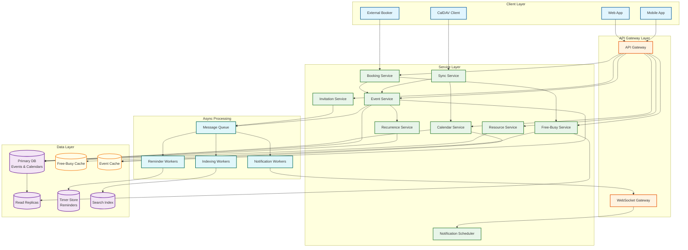
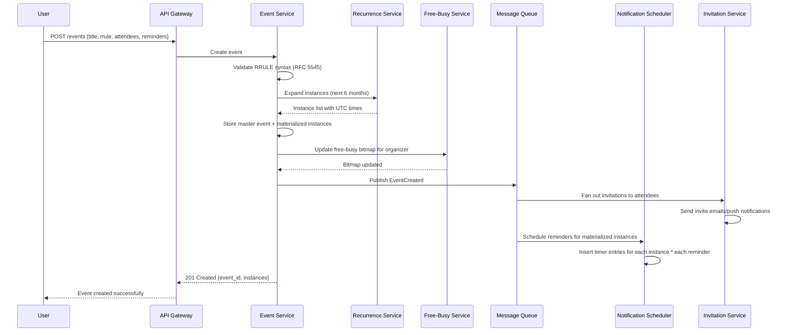
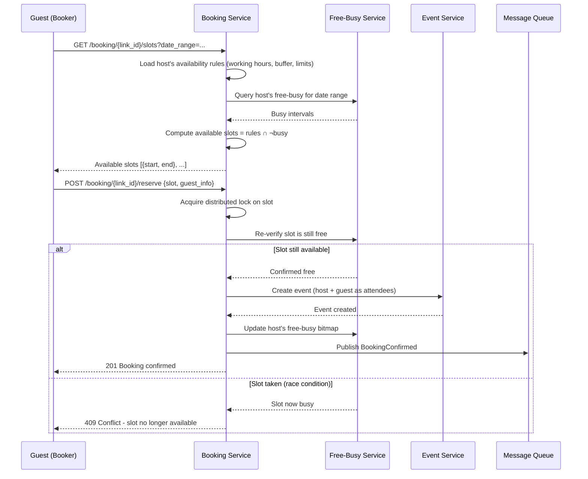
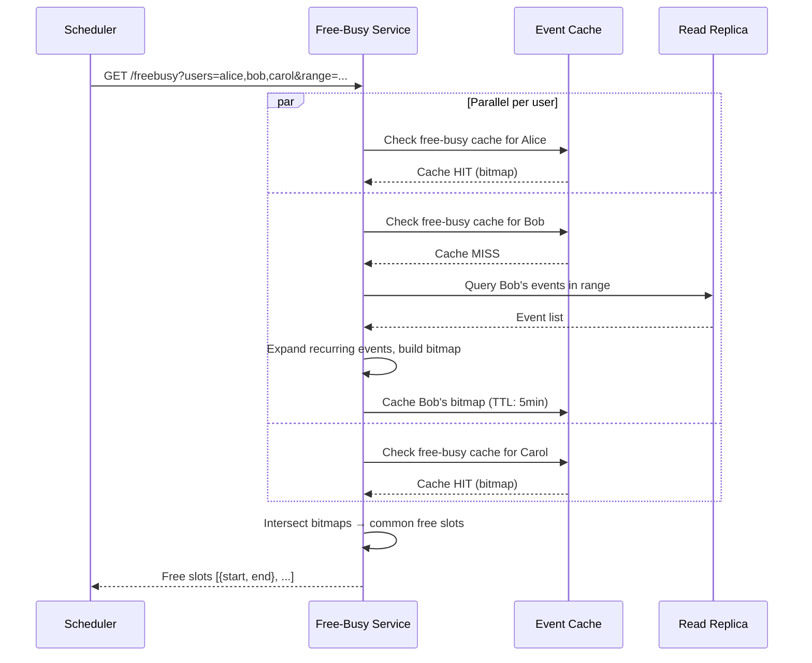
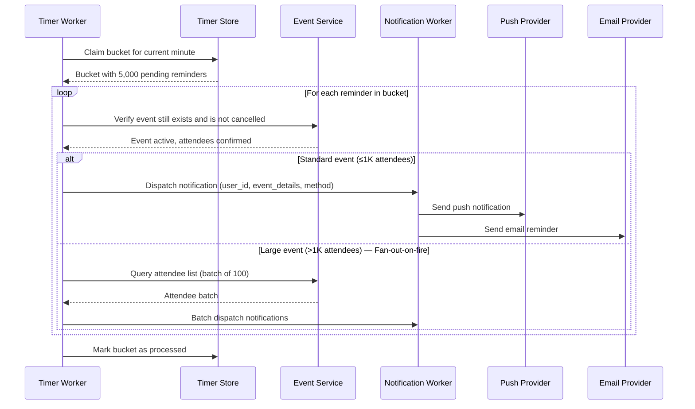
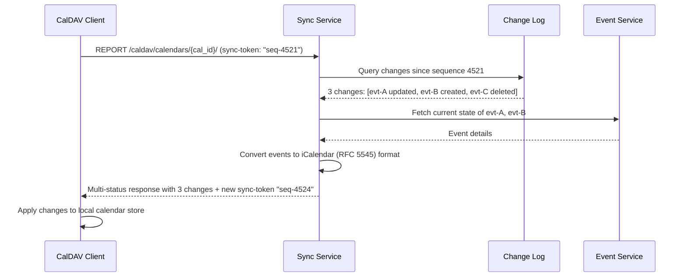
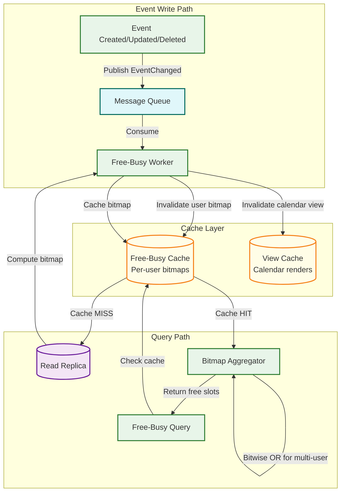
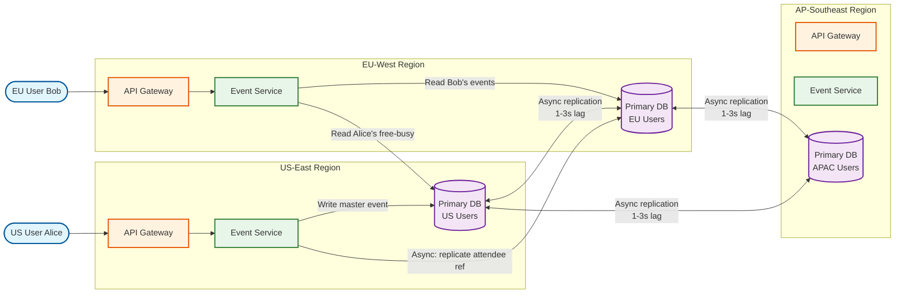

# High-Level Design

## System Architecture



---

## Core Service Responsibilities

| Service | Responsibility | Key Data |
|---------|---------------|----------|
| **Calendar Service** | Calendar CRUD, sharing, permissions | Calendar metadata, ACLs |
| **Event Service** | Event CRUD, attendee management | Events, attendees, recurrence rules |
| **Recurrence Service** | RRULE expansion, instance generation, exception handling | Recurrence rules, EXDATE/RDATE |
| **Free-Busy Service** | Availability aggregation across calendars | Pre-computed free-busy bitmaps |
| **Notification Scheduler** | Reminder scheduling, delivery orchestration | Timer queue entries |
| **Booking Service** | External booking pages, slot computation, reservation | Booking links, availability rules |
| **Sync Service** | CalDAV/iCal/Exchange sync | Sync tokens, change logs |
| **Resource Service** | Room/equipment management, conflict detection | Resource metadata, capacity |
| **Invitation Service** | Invite dispatch, RSVP tracking, email notifications | Invitation state machine |

---

## Data Flow Walkthrough

### Flow 1: Creating a Recurring Event



### Flow 2: Calendly-Style Booking



### Flow 3: Free-Busy Query (Multi-User)



---

## Key Architectural Decisions

### 1. Event Storage: Hybrid Rule + Materialized Instances

| Option | Pros | Cons | Verdict |
|--------|------|------|---------|
| **Store RRULE only, expand on read** | Minimal storage, instant series updates | Expensive reads, no direct instance querying | Rejected for reads at scale |
| **Materialize all instances** | Fast reads, simple queries | Infinite series require bounds, expensive updates | Rejected for infinite series |
| **Hybrid: RRULE + rolling window** | Fast reads in common window, manageable storage | Window maintenance complexity | **Chosen** |

**Rationale**: Most calendar views show 1 day to 1 month. Materializing instances within a 6-month rolling window serves 99% of reads from pre-computed data. Queries beyond 6 months trigger on-demand expansion. Series modifications update the RRULE and trigger re-expansion of the materialized window.

### 2. Timezone Strategy: UTC + Original Timezone

| Option | Pros | Cons | Verdict |
|--------|------|------|---------|
| **Store UTC only** | Simple storage, easy comparison | Loses "9 AM" intent; DST changes break recurring events | Rejected |
| **Store local time only** | Preserves intent | Cannot compare across timezones; ambiguous during DST transitions | Rejected |
| **UTC + original timezone** | Preserves intent AND enables comparison | Requires timezone-aware expansion | **Chosen** |

**Rationale**: An event created as "9 AM America/New_York" must always appear at 9 AM Eastern, whether that is UTC-5 (EST) or UTC-4 (EDT). Storing both the UTC timestamp (for range queries and sorting) and the original timezone (for recurrence expansion) is the only correct approach.

### 3. Free-Busy Architecture: Separate Service with Pre-Computed Bitmaps

| Option | Pros | Cons | Verdict |
|--------|------|------|---------|
| **Compute from events on demand** | Always fresh, no sync issues | O(n) per query, slow at scale | Rejected for high QPS |
| **Materialized view in event DB** | Transactionally consistent | Adds write amplification, DB load | Rejected for read-heavy pattern |
| **Separate service with cached bitmaps** | Sub-10ms queries, independent scaling | Cache invalidation complexity | **Chosen** |

**Rationale**: Free-busy queries dominate traffic (2B/day) and must be fast (<100ms). A dedicated service with pre-computed bitmaps in distributed cache handles this load. Event writes publish change events that invalidate the relevant user's bitmap asynchronously (5-10 second lag is acceptable).

### 4. Reminder Delivery: Distributed Timer Queue

| Option | Pros | Cons | Verdict |
|--------|------|------|---------|
| **Cron job scanning DB** | Simple implementation | Polling is wasteful; hard to scale; precision limited to poll interval | Rejected |
| **Delay queue (per-message TTL)** | Precise timing, no polling | Max TTL limits (24h in most queues); must re-enqueue for far-future reminders | Partial solution |
| **Distributed timer store (partitioned by fire_time)** | Precise, scalable, supports far-future timers | Operational complexity; must handle clock skew | **Chosen** |

**Rationale**: With 1.5B reminders/day firing at precise wall-clock times, a distributed timer store partitioned by fire_time (minute-level buckets) provides both precision and scalability. Workers claim buckets as their fire time arrives, process all timers in the bucket, and dispatch notifications.

### 5. Sync Protocol: CalDAV + Webhooks

| Option | Pros | Cons | Verdict |
|--------|------|------|---------|
| **CalDAV only (polling)** | Standard protocol, wide client support | Polling is wasteful; sync latency = poll interval | Partial |
| **Webhooks only (push)** | Real-time updates | Not all clients support webhooks; delivery reliability | Partial |
| **CalDAV + Webhooks hybrid** | Standards compliance + real-time for capable clients | Dual implementation cost | **Chosen** |

**Rationale**: CalDAV provides interoperability with Apple Calendar, Thunderbird, and other standards-compliant clients. Webhooks (or WebSocket subscriptions) provide real-time sync for web and mobile clients. The sync service maintains a change log per calendar and issues sync tokens for efficient delta sync.

---

## Data Flow Walkthrough (continued)

### Flow 4: Reminder Firing Pipeline



### Flow 5: CalDAV Sync (Delta Sync)



---

## Availability Computation Architecture

### Free-Busy Bitmap Data Flow



### Bitmap Representation

```
User Alice's 2-week free-busy bitmap:
  14 days × 96 slots/day = 1,344 bits = 168 bytes

  Day 1 (Monday):
  00:00 ████████ 02:00 ████████ 04:00 ████████ 06:00 ████████
  08:00 ░░░░░░░░ 10:00 ░░██░░██ 12:00 ████░░░░ 14:00 ░░░░██░░
  16:00 ░░░░░░░░ 18:00 ████████ 20:00 ████████ 22:00 ████████

  █ = free (0), ░ = busy (1)

  Slot resolution: 15 minutes
  Operations: O(1) per slot check, O(n/64) for range scan (SIMD-friendly)
  Multi-user intersection: bitwise OR → O(n/64) for n slots
```

---

## Cross-Region Event Routing



**Routing rules**: The organizer's home region is the source of truth for the event. Attendees in other regions receive replicated references. Free-busy queries for cross-region users are served from local read replicas with <3s staleness.

---

## Domain Event Model

### Event-Driven Architecture

All calendar mutations publish domain events that drive downstream processing:

```
DOMAIN EVENTS:

EventCreated:
  event_id, calendar_id, organizer_id, start_time, end_time,
  timezone, is_recurring, rrule, attendee_ids[], reminder_config[]

EventUpdated:
  event_id, changed_fields[], scope (all|this|following),
  old_values{}, new_values{}, sequence_number

EventDeleted:
  event_id, scope (all|this|following), deleted_by

RSVPChanged:
  event_id, attendee_id, old_status, new_status, timestamp

CalendarShared:
  calendar_id, grantee_id, grantee_type, role

BookingConfirmed:
  booking_link_id, event_id, host_id, guest_email, slot_start

BookingCancelled:
  booking_id, event_id, cancelled_by (host|guest), reason

ReminderFired:
  reminder_id, event_id, user_id, method, fire_time, actual_time
```

### Event Consumer Matrix

| Domain Event | Free-Busy Service | Notification Service | Search Index | Sync Service | Analytics |
|-------------|-------------------|---------------------|-------------|-------------|-----------|
| EventCreated | Invalidate bitmap | Schedule reminders | Index event | Update sync token | Track creation |
| EventUpdated | Invalidate bitmap | Reschedule reminders | Re-index event | Update sync token | Track modification |
| EventDeleted | Invalidate bitmap | Cancel reminders | Remove from index | Update sync token | Track deletion |
| RSVPChanged | Invalidate bitmap | Notify organizer | Update attendee list | Update sync token | Track engagement |
| BookingConfirmed | Invalidate bitmap | Send confirmations | Index booking | Update sync token | Track conversion |

---

## Architecture Pattern Checklist

- [x] **Sync vs Async**: Event creation is synchronous; notification fan-out, search indexing, and free-busy cache updates are asynchronous
- [x] **Event-driven**: Event mutations publish domain events (EventCreated, EventUpdated, RSVPChanged) to message queue
- [x] **Push vs Pull**: Push for real-time clients (WebSocket); pull for CalDAV clients (sync tokens)
- [x] **Stateless services**: All services are stateless; state lives in databases and caches
- [x] **Read-heavy optimization**: Free-busy bitmaps, event caches, read replicas for calendar views
- [x] **Real-time + Batch**: Real-time for event operations; batch for reminder scheduling beyond the rolling window
- [x] **Edge caching**: Calendar view responses cached at CDN edge for public/shared calendars
- [x] **CQRS**: Write path (primary DB, strong consistency) separated from read path (replicas, caches, eventual consistency)
- [x] **Saga orchestration**: Multi-step booking flow with compensating actions (release lock, cancel partial event)
- [x] **Domain event sourcing**: All state changes captured as immutable events for audit, replay, and downstream processing
