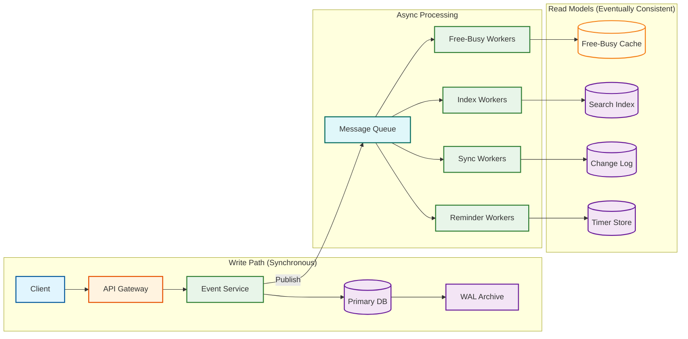

# Scalability & Reliability

## Scalability Strategy

### Read-Heavy Optimization

With a 20:1+ read-to-write ratio, the architecture is fundamentally optimized for reads:

| Layer | Strategy | Impact |
|-------|----------|--------|
| **CDN** | Cache public calendar feeds (iCal subscriptions) and shared calendar views at edge | 30% of read traffic served from edge |
| **Application Cache** | Event cache (per-calendar, 5-min TTL) and free-busy bitmap cache (per-user, 10-min TTL) | 85% cache hit rate for calendar views |
| **Read Replicas** | 5-10 read replicas per primary, used for calendar view queries and free-busy computation | Offload 90% of DB read traffic |
| **Pre-computation** | Materialize recurring event instances; pre-compute free-busy bitmaps for active users | Sub-10ms free-busy queries |

### Sharding Strategy

#### User-Based Sharding for Calendar Data

```
Step-by-step plan in plain English: Shard Assignment

FUNCTION get_shard(user_id):
    // Consistent hashing with virtual nodes
    shard_id = consistent_hash(user_id, num_shards)
    RETURN shard_id

// All of a user's data co-located:
//   - Calendars owned by user
//   - Events in those calendars
//   - Attendee records (for events user organizes)
//   - ACL entries for those calendars
//   - Booking links for that user
//   - Free-busy cache entries
```

**Why user-based**: Calendar views always query a single user's data. Free-busy queries per-user are the most common operation. User-based sharding ensures these queries hit a single shard.

**Cross-shard challenge**: When Alice invites Bob to an event, Alice's shard stores the master event and Bob's shard stores a reference (attendee record pointing to Alice's event). The invitation service handles this cross-shard coordination asynchronously.

#### Time-Based Partitioning for Reminders

```
Reminder timer store partitioned by fire_time:
  - Partition: 1-hour buckets (e.g., "2026-03-10T08")
  - Each partition contains all reminders firing in that hour
  - Workers claim partitions as their hour arrives
  - Hot partitions (8:00 AM, 9:00 AM) get more workers

Partition sizing:
  - Average: 1.5B reminders/day ÷ 24 hours = 62.5M reminders/hour
  - Peak (9 AM): 62.5M * 3 = ~190M reminders in a single hour
  - At 100 bytes per reminder: ~19 GB per peak hour partition
```

### Notification Scheduler Scaling

| Component | Scaling Strategy | Target |
|-----------|-----------------|--------|
| **Timer store** | Horizontally partitioned by fire_time hour | 190M reminders/hour at peak |
| **Notification workers** | Auto-scale by queue depth; target: 100K notifications/second | 175K deliveries/second at peak |
| **Push notification gateway** | Connection pooling to provider APIs; batch send | 50K pushes/second per worker |
| **Email sender** | Rate-limited per domain to avoid spam classification | 10K emails/second aggregate |

### Auto-Scaling Triggers

| Metric | Scale-Up Threshold | Scale-Down Threshold | Cooldown |
|--------|-------------------|---------------------|----------|
| API request rate | >80% of current capacity | <30% of capacity for 10 min | 5 min |
| Free-busy cache miss rate | >20% miss rate | <5% miss rate for 15 min | 10 min |
| Timer bucket depth | >10K pending reminders in current bucket | <1K pending for 5 min | 3 min |
| Notification queue depth | >50K undelivered | <5K for 10 min | 5 min |
| Read replica lag | >5 seconds | <1 second for 10 min | 5 min |

---

## Multi-Region Architecture

### Active-Active Deployment

```
Region topology:
  US-East (primary for Americas)
    ├── API Gateway cluster
    ├── Service fleet (all services)
    ├── Primary DB (write leader for US users)
    ├── Read replicas (5x)
    ├── Cache cluster
    └── Timer workers

  EU-West (primary for Europe/Africa)
    ├── API Gateway cluster
    ├── Service fleet (all services)
    ├── Primary DB (write leader for EU users)
    ├── Read replicas (5x)
    ├── Cache cluster
    └── Timer workers

  AP-Southeast (primary for Asia/Pacific)
    ├── API Gateway cluster
    ├── Service fleet (all services)
    ├── Primary DB (write leader for APAC users)
    ├── Read replicas (5x)
    ├── Cache cluster
    └── Timer workers
```

**User-to-region affinity**: Each user is assigned to a home region based on their primary timezone. Their calendar data is mastered in that region. Cross-region reads (e.g., a US user querying an EU user's free-busy) are served from local read replicas with async replication lag of 1-3 seconds.

**Cross-region event creation**: When a US user invites an EU user, the event is created in the US region (organizer's home), and the attendee record is replicated to the EU region asynchronously. The EU user's free-busy cache is invalidated via a cross-region message.

### CalDAV and Exchange Sync Interoperability

```
Sync architecture:
  - Sync Service maintains per-calendar change logs
  - Each change gets a monotonically increasing sequence number
  - CalDAV clients provide a sync-token (last seen sequence number)
  - Sync Service returns all changes since that sequence number

Cross-protocol translation:
  CalDAV (RFC 4791)  ←→  Internal event model  ←→  Exchange ActiveSync
                                    ↕
                            iCalendar (RFC 5545) export/import
```

---

## Reliability & Fault Tolerance

### Failure Mode Analysis

| Failure | Impact | Detection | Mitigation |
|---------|--------|-----------|------------|
| **Primary DB failure** | Write path unavailable | Health check + replication lag monitoring | Promote read replica to primary (30s failover); writes queue in memory |
| **Cache cluster failure** | Free-busy queries degrade to DB | Cache hit rate drops below threshold | Fall back to read replicas; bitmap computation on demand |
| **Timer worker failure** | Reminders delayed | Unclaimed bucket monitoring | Other workers claim abandoned buckets (claim TTL expiry) |
| **Notification provider outage** | Push/email delivery fails | Delivery failure rate > 5% | Retry with exponential backoff; fail over to alternate provider; queue for later delivery |
| **Timezone database corruption** | Events display at wrong times | Checksum validation on tzdata load | Roll back to previous tzdata version; alert ops |
| **Cross-region replication lag** | Stale free-busy for cross-region queries | Replication lag monitoring > 5s | Display "approximate availability" warning; allow user to force fresh query |

### Redundancy Strategy

| Component | Redundancy | RPO | RTO |
|-----------|-----------|-----|-----|
| Primary DB | Synchronous replica in same region + async replicas cross-region | 0 (sync replica) | 30 seconds (auto-failover) |
| Cache cluster | No persistence; rebuilt from DB on failure | N/A (ephemeral) | 2-5 minutes (cache warm-up) |
| Timer store | Replicated 3x within region | 0 | 10 seconds |
| Event data | 3 copies within region + 1 async cross-region | 0 within region; <3s cross-region | 30 seconds |
| Booking links | Same as event data | 0 | 30 seconds |

### Graceful Degradation

| Scenario | Degraded Behavior |
|----------|-------------------|
| Free-busy cache unavailable | Serve from read replica (slower but accurate) |
| Recurrence expansion service overloaded | Serve cached/materialized instances; defer on-demand expansion |
| Notification delivery backlog | Prioritize imminent reminders (next 5 min); defer others |
| Search index lagging | Show "results may not include recent changes" warning |
| Cross-region replication lag >10s | Route cross-region free-busy queries to source region |

### Circuit Breaker Configuration

| Service | Failure Threshold | Open Duration | Half-Open Probes |
|---------|------------------|---------------|------------------|
| Notification provider (push) | 5 failures in 10s | 30s | 1 probe every 10s |
| Notification provider (email) | 10 failures in 60s | 60s | 1 probe every 20s |
| External calendar sync | 3 failures in 30s | 120s | 1 probe every 30s |
| Search index | 5 failures in 10s | 30s | 1 probe every 10s |

---

## Disaster Recovery

### Backup Strategy

| Data | Backup Method | Frequency | Retention |
|------|--------------|-----------|-----------|
| Event data | Continuous WAL archival + daily full snapshots | Continuous + daily | 90 days incremental, 1 year full |
| Calendar metadata | Daily full backup | Daily | 1 year |
| Booking links/rules | Daily full backup | Daily | 1 year |
| Audit logs | Continuous to immutable storage | Continuous | 7 years (compliance) |
| Timer store | Replicated; no separate backup (ephemeral by nature) | N/A | N/A |

### Recovery Scenarios

| Scenario | RTO | RPO | Procedure |
|----------|-----|-----|-----------|
| Single AZ failure | 30 seconds | 0 | Auto-failover to replica in another AZ |
| Single region failure | 5 minutes | <3 seconds | DNS failover to nearest region; promote async replicas |
| Data corruption (logical) | 30 minutes | Point-in-time | Restore from WAL to pre-corruption timestamp |
| Complete data loss | 4 hours | Last daily backup | Restore from daily snapshot + WAL replay |

---

## Performance Optimization Techniques

### Calendar View Rendering

```
Optimization pipeline for "show me this week":

1. Check view cache: key = "calview:{user_id}:{week_start}:{etag}"
   → Cache HIT: return immediately (<5ms)

2. Cache MISS: query materialized instances
   → Single indexed query: calendar_id + start_time range
   → Uses read replica (not primary)

3. Merge with recurring event expansions (if any non-materialized masters)
   → Rare path: only for events created in last few minutes

4. Apply attendee overlays (RSVP status for shared calendar events)
   → Batch lookup from attendee table

5. Cache the rendered view with short TTL (60s)

Total: <100ms even on cache miss
```

### Event Write Pipeline

```
Synchronous path (user-blocking):
  1. Validate event data (10ms)
  2. Write to primary DB (50ms)
  3. Return success to user (total: <100ms)

Asynchronous path (background):
  4. Expand RRULE and materialize instances (200-500ms)
  5. Schedule reminders for materialized instances (100ms)
  6. Invalidate free-busy caches for organizer + attendees (10ms)
  7. Update search index (500ms)
  8. Send invitation notifications to attendees (1-5s)
  9. Update CalDAV sync tokens (50ms)
```

### Connection Pooling and Resource Management

| Resource | Pool Size | Timeout | Strategy |
|----------|-----------|---------|----------|
| DB connections (per service instance) | 20 | 5s | Fixed pool; overflow rejected |
| Cache connections | 50 | 1s | Fixed pool with keepalive |
| HTTP connections (notification providers) | 100 | 10s | Pooled with reuse |
| WebSocket connections (real-time updates) | 10K per gateway | 30min idle | Heartbeat-based keepalive |

---

## CQRS Architecture for Calendar Reads vs. Writes

### Write Path (Strong Consistency)



**Write path latency budget** (synchronous, user-blocking):
| Step | Time | Notes |
|------|------|-------|
| API Gateway routing | 5ms | Load balancer + authentication |
| Event validation | 10ms | Schema, RRULE syntax, timezone validation |
| Primary DB write | 50ms | Single-row insert with sync replication |
| Response to client | 5ms | Serialization + network |
| **Total** | **~70ms** | Well within 200ms SLO |

### Read Path (Optimized for Latency)

```
Read path for "show this week's calendar":

Layer 1: Edge cache (CDN)
  → Cache HIT for public/shared calendars: <5ms response
  → Cache MISS: forward to origin

Layer 2: Application view cache
  → Key: "calview:{user_id}:{week}:{etag}"
  → Cache HIT: <10ms response
  → Cache MISS: proceed to Layer 3

Layer 3: Materialized instances query
  → Index scan on (calendar_id, start_time, end_time)
  → Read replica (not primary)
  → Result: 20-50 events for a typical week
  → Time: 30-50ms

Layer 4: Merge unmaterialized recurring events (rare)
  → Only for events created in last few minutes (not yet materialized)
  → On-demand RRULE expansion for 1-3 master events
  → Time: 10-30ms when triggered

Layer 5: Permission filtering and response assembly
  → Filter by ACL, apply visibility rules
  → Serialize response
  → Cache the result (TTL: 60s)
  → Time: 10ms

Total (cache miss): <100ms
Total (cache hit): <10ms
```

---

## Offline Sync Architecture

### Conflict Resolution Strategy

```
Step-by-step plan in plain English: Offline Sync Conflict Resolution

FUNCTION sync_offline_changes(client_changes, server_changes):
    resolved = []

    FOR client_change IN client_changes:
        server_version = find_server_change(server_changes, client_change.event_id)

        IF server_version IS NULL:
            // No server change — apply client change
            resolved.append(client_change)
            CONTINUE

        // Both client and server modified the same event
        IF client_change.fields_changed INTERSECTION server_version.fields_changed == EMPTY:
            // Non-overlapping field changes — merge both
            merged = merge_fields(client_change, server_version)
            resolved.append(merged)

        ELSE IF client_change.timestamp > server_version.timestamp:
            // Overlapping fields — last writer wins for simple fields
            resolved.append(client_change)

        ELSE:
            // Server wins — notify client of conflict
            resolved.append(server_version)
            notify_client_conflict(client_change, server_version)

    RETURN resolved


// Special cases requiring user resolution:
//   - Both sides changed event time → present both options
//   - Client deleted, server updated → ask user
//   - RSVP conflict → use most recent response
```

### Mobile Cache Strategy

| Data | Cache Strategy | Size per User | Refresh |
|------|---------------|---------------|---------|
| Events (current ± 2 weeks) | Full event objects | ~500 KB | Delta sync every 5 min |
| Free-busy (self) | Bitmap | 168 bytes | On event change |
| Calendar metadata | Full objects | ~5 KB | On calendar change |
| Attendee photos | Thumbnail cache | ~2 MB | Lazy load |
| Recurring masters | RRULE + exceptions | ~50 KB | On series change |

---

## Timezone Database Update Resilience

### IANA tzdata Update Pipeline

```
tzdata release published (5-10 times per year)
    │
    ├─ Stage 1: Validation (automated, 15 min)
    │   └─ Run expansion tests against known events
    │   └─ Compare instance times: old tzdata vs new tzdata
    │   └─ Generate diff report: which events change UTC times
    │
    ├─ Stage 2: Impact assessment (automated, 30 min)
    │   └─ Query: count recurring events per affected timezone
    │   └─ Estimate re-expansion workload
    │   └─ Alert ops if >1M events affected
    │
    ├─ Stage 3: Rolling deployment (2-4 hours)
    │   └─ Deploy new tzdata to recurrence expansion workers
    │   └─ Re-expand affected recurring events in batches
    │   └─ Update materialized instances with new UTC times
    │   └─ Re-schedule affected reminders
    │   └─ Invalidate free-busy caches for affected users
    │
    └─ Stage 4: Verification (1 hour)
        └─ Sample-check expanded instances against expected values
        └─ Monitor reminder delivery accuracy
        └─ Verify no double-fires or missed reminders
```

---

## Capacity Planning Model

### Growth Projections and Infrastructure Scaling

| Metric | Year 1 | Year 3 | Year 5 | Scaling Action |
|--------|--------|--------|--------|----------------|
| DAU | 150M | 250M | 400M | Add read replica regions |
| Events/day | 200M | 400M | 750M | Add write shards |
| Free-busy QPS (peak) | 115K | 230K | 450K | Scale cache cluster |
| Reminder QPS (peak) | 175K | 350K | 650K | Add timer partitions |
| Storage (total) | 210 TB | 550 TB | 1.1 PB | Tiered storage (hot/warm/cold) |
| DB shards | 64 | 128 | 256 | Consistent hashing allows doubling |
| Read replicas (per region) | 5 | 8 | 12 | Auto-scale by replica lag |
| Cache nodes (per region) | 20 | 40 | 80 | Scale by hit rate |

### Cost-Optimization Strategies

| Strategy | Savings | Trade-off |
|----------|---------|-----------|
| **Cold storage for old events** | 60% storage cost | Slower retrieval for events >1 year old |
| **Reminder deduplication** | 30% timer entries | Slightly more work at fire time |
| **Free-busy bitmap compression** | 40% cache memory | Decompress on read (~1μs) |
| **Event body lazy loading** | 25% cache memory | Extra DB read for full details |
| **iCal feed CDN caching** | 30% read traffic | Up to 5-min staleness for subscribers |
