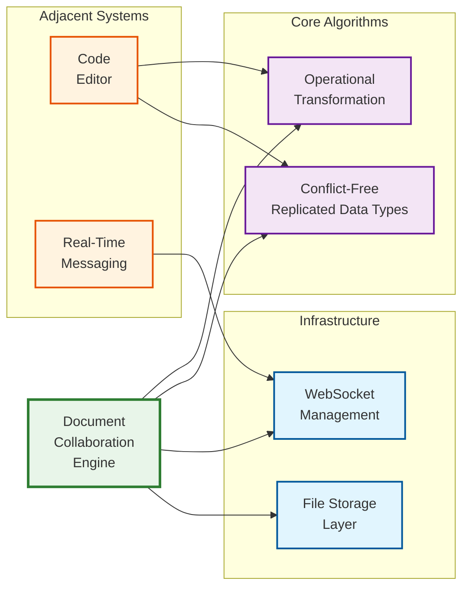

# Document Collaboration Engine System Design

## System Overview

A document collaboration engine (Google Docs, Notion, Microsoft Word Online) enables multiple users to simultaneously edit the same document in real time, with every keystroke visible to all participants within milliseconds. The system must guarantee convergence --- all users eventually see the identical document --- despite network latency, concurrent edits, and offline operation. Google Docs serves 1 billion monthly active users with WebSocket-driven updates in 50-200ms; Notion has reached 100 million registered users with its block-based CRDT architecture.

---

## Key Characteristics

| Characteristic | Description |
|---------------|-------------|
| **Read/Write Pattern** | Write-heavy during active editing sessions; read-heavy for viewing/reviewing |
| **Latency Sensitivity** | Very High --- every keystroke must feel local (<50ms perceived latency via optimistic updates) |
| **Consistency Model** | Strong eventual consistency (convergence guaranteed); intention preservation required |
| **Concurrency Level** | 10-1000+ simultaneous editors per document |
| **Data Volume** | Moderate storage per document; massive metadata (operation logs, version history) |
| **Complexity Rating** | **Very High** |

---

## Quick Navigation

| Document | Description |
|----------|-------------|
| [01 - Requirements & Estimations](./01-requirements-and-estimations.md) | Functional/non-functional requirements, capacity planning, SLOs |
| [02 - High-Level Design](./02-high-level-design.md) | Architecture diagrams, data flow, key decisions |
| [03 - Low-Level Design](./03-low-level-design.md) | Data model, API design, OT/CRDT algorithms (Step-by-step plan in plain English) |
| [04 - Deep Dive & Bottlenecks](./04-deep-dive-and-bottlenecks.md) | OT engine, presence system, conflict resolution |
| [05 - Scalability & Reliability](./05-scalability-and-reliability.md) | Scaling strategies, fault tolerance, disaster recovery |
| [06 - Security & Compliance](./06-security-and-compliance.md) | Encryption, access control, threat model |
| [07 - Observability](./07-observability.md) | Metrics, logging, tracing, alerting |
| [08 - Interview Guide](./08-interview-guide.md) | 45-min pacing, trap questions, trade-offs |

---

## What Makes This System Unique

1. **Convergence Under Concurrency**: Two users typing at the same position must produce a deterministic, intention-preserving result --- not interleaved garbage. This requires either Operational Transformation (OT) or Conflict-free Replicated Data Types (CRDTs).
2. **Optimistic Local Application**: Every keystroke is applied instantly on the local client (zero perceived latency), then reconciled with concurrent edits from other users asynchronously --- a fundamentally different model from request-response APIs.
3. **Rich Text Complexity**: Text operations (insert, delete) are hard; formatting operations (bold, italic, links) on top of text are exponentially harder. For N operation types, OT requires N² transform functions.
4. **Collaborative Undo**: Each user needs their own undo stack that undoes only their operations, even when interleaved with others' edits --- an unsolved problem for 20+ years.
5. **Block-Based vs Linear Models**: Notion's block model (everything is a UUID-identified block) vs Google Docs' linear text model creates fundamentally different architectural trade-offs.

---

## OT vs CRDT: The Core Decision

| Aspect | Operational Transformation (OT) | CRDTs |
|--------|--------------------------------|-------|
| **Architecture** | Requires central server to order operations | Works peer-to-peer; no central authority needed |
| **Offline support** | Limited (needs server for transform ordering) | Excellent (merge on reconnect) |
| **Memory overhead** | Low (no per-character metadata) | 1-32 bytes/character metadata |
| **Implementation** | N² transform functions; proven but error-prone | Complex data structures; mathematically guaranteed |
| **Branch merging** | Extremely slow for divergent histories | Fast (160,000x faster with eg-walker) |
| **Production users** | Google Docs, CKEditor 5, Microsoft Word Online | Figma, Zed, Notion (offline), AFFiNE, Yjs-based apps |
| **Maturity** | 30+ years (Jupiter protocol, 1995) | Growing rapidly (Yjs, Automerge, Loro) |

---

## Key Technology References

| Component | Real-World Example |
|-----------|-------------------|
| OT Engine | Google Docs (Jupiter protocol), CKEditor 5 |
| CRDT Engine | Figma (last-writer-wins maps), Yjs (YATA), Automerge, Loro |
| Rich Text CRDT | Peritext (Ink & Switch), Loro rich text |
| Non-interleaving | Fugue algorithm (Weidner & Kleppmann, 2023) |
| Hybrid OT/CRDT | Eg-walker (Gentle & Kleppmann, EuroSys 2025) |
| Block Model | Notion (block-based), AFFiNE (BlockSuite) |
| Presence System | Liveblocks, Yjs awareness protocol |
| Collaboration Framework | Liveblocks, Hocuspocus, ShareDB |

---

---

## Related Patterns & Cross-References

| Related System | Relationship | Key Shared Patterns |
|---------------|-------------|---------------------|
| [6.1 Cloud File Storage](../6.1-cloud-file-storage/00-index.md) | **Foundation** --- file storage underlies document persistence | Block storage, versioning, sharing permissions, conflict resolution (file-level vs character-level) |
| [6.8 Real-Time Collaborative Editor](../6.8-real-time-collaborative-editor/00-index.md) | **Sibling** --- focused on code editing with different constraints | OT/CRDT for structured text, language-aware transforms, syntax tree operations |
| [11.2 Slack](../11.2-slack/00-index.md) | **Analogous** --- real-time messaging with presence and typing indicators | WebSocket architecture, presence broadcasting, ephemeral state management |
| [6.3 Multi-Tenant SaaS Platform](../6.3-multi-tenant-saas-platform-architecture/00-index.md) | **Architectural** --- tenant isolation for enterprise document platforms | Per-tenant data isolation, permission models, compliance boundaries |
| [4.1 Twitter](../4.1-twitter/00-index.md) | **Pattern overlap** --- real-time fan-out of updates to connected users | WebSocket fan-out, operation broadcasting, connection management at scale |
| [6.15 Calendar Scheduling](../6.15-calendar-scheduling-system/00-index.md) | **Complementary** --- collaborative scheduling alongside document editing | Concurrent access patterns, conflict resolution, real-time updates |

### Pattern Relationships

---

## Evolution Timeline

| Year | Milestone | Significance |
|------|-----------|-------------|
| 1989 | Operational Transformation invented (Ellis & Gibbs) | First algorithm for real-time collaborative text editing |
| 1995 | Jupiter protocol (Nichols et al.) | Simplified OT for client-server architecture; basis for Google Docs |
| 2006 | Google Docs launches | First mass-market real-time collaborative editor using Jupiter OT |
| 2011 | Google Wave open-sourced | Exposed real-world OT complexity; "implementing OT sucks" |
| 2016 | Yjs CRDT framework | Open-source CRDT for web-based collaboration; YATA algorithm |
| 2019 | Figma multiplayer | LWW CRDTs for design collaboration; 95% of edits saved in <600ms |
| 2022 | Peritext (CSCW paper) | First principled approach to rich text CRDTs with formatting marks |
| 2023 | Fugue algorithm (Weidner & Kleppmann) | Solved the non-interleaving problem for concurrent insertions |
| 2023-2024 | Notion offline with CRDTs | Dynamic migration of pages to CRDT model; one of largest production CRDT deployments |
| 2025 | Eg-walker (EuroSys) | Hybrid OT/CRDT: 160,000x faster branch merging than pure OT |
| 2025-2026 | AI co-editing integration | AI writing assistants as first-class document editors via standard OT/CRDT pipelines |

---

## Sources

- Jupiter Protocol Paper (Nichols et al., 1995)
- Google Wave OT Whitepaper (Apache)
- Figma Engineering Blog --- Multiplayer Technology, Reliability Improvements (2024)
- Notion Engineering Blog --- Data Model, Offline Architecture
- CKEditor 5 --- Lessons from building OT for rich text
- Peritext Paper (CSCW 2022) --- Rich text CRDTs
- Fugue Paper (Weidner & Kleppmann, 2023) --- Non-interleaving
- Eg-walker Paper (EuroSys 2025) --- Hybrid OT/CRDT
- Yjs/YATA Documentation and Benchmarks
- Automerge 2.0/3.0 Architecture
- Industry statistics: ElectroIQ, SQ Magazine, Business of Apps (2025-2026)
