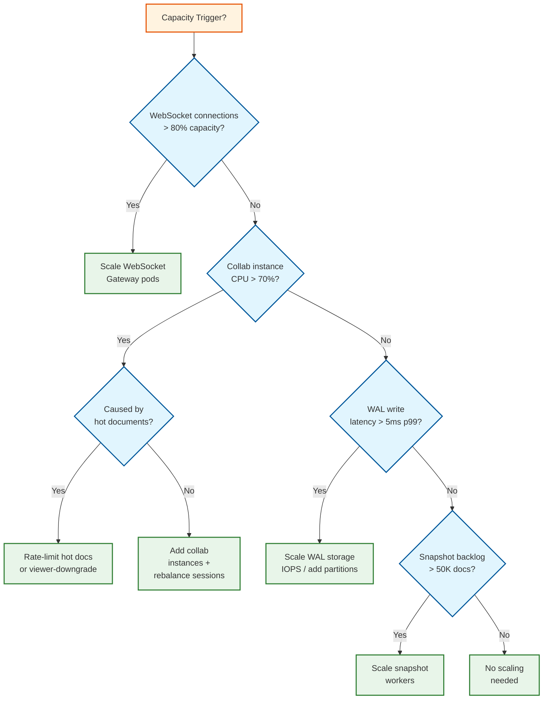

# Requirements & Capacity Estimations

## 1. Functional Requirements

### Core Features (In Scope)

| # | Feature | Description |
|---|---------|-------------|
| F1 | **Real-Time Collaborative Editing** | Multiple users edit the same document simultaneously; every keystroke visible within 200ms |
| F2 | **Convergence** | All users see the identical document when all operations are applied (strong eventual consistency) |
| F3 | **Intention Preservation** | Concurrent edits maintain the intent of each user's operation |
| F4 | **Rich Text Formatting** | Bold, italic, underline, headings, links, font changes, colors --- all synchronized |
| F5 | **Cursor/Selection Presence** | Show other users' cursor positions, selections, and names in real time |
| F6 | **Comments & Suggestions** | Threaded comments anchored to text spans; suggesting mode (tracked changes) |
| F7 | **Version History** | Full edit history with restore capability; named versions |
| F8 | **Offline Editing** | Edit without connectivity; reconcile changes on reconnect |
| F9 | **Permissions** | Owner, Editor, Commenter, Viewer roles with real-time enforcement |
| F10 | **Undo/Redo** | Per-user undo stack (undo only own operations in collaborative context) |
| F11 | **Document Search** | Full-text search within and across documents |
| F12 | **Sharing** | Share via link or email with permission levels |

### Out of Scope

- Spreadsheet/presentation collaboration (different data models)
- File storage and sync (covered in 6.1)
- Video/voice chat during collaboration
- AI-powered writing assistance (treated as separate overlay service)
- Drawing/whiteboard collaboration (different rendering model)

---

## 2. Non-Functional Requirements

### CAP Theorem Choice

**AP with strong eventual consistency** --- The system prioritizes availability (users must always be able to edit) and partition tolerance (editing must work offline). Consistency is achieved through convergence: all replicas that have received the same set of operations will be in the same state, regardless of the order operations were received.

### Consistency Model

| Component | Model | Justification |
|-----------|-------|---------------|
| Document content | **Strong eventual consistency** | OT/CRDT guarantees convergence; all replicas with same ops = same state |
| Operation ordering | **Causal consistency** | Operations must respect happened-before relationships |
| Presence (cursors) | **Best-effort, last-value** | Stale cursor positions are annoying but not harmful; no durability needed |
| Permissions/ACLs | **Strong consistency** | Permission revocation must take effect immediately |
| Comments | **Causal consistency** | Replies must appear after their parent; concurrent comments both visible |
| Version history | **Strong consistency** | Named versions are reference points; must not conflict |

### Availability Target

- **99.99% (four nines)** for document editing --- 52.6 minutes downtime/year
- **99.9% (three nines)** for version history/search --- 8.76 hours downtime/year

### Latency Targets

| Operation | p50 | p95 | p99 |
|-----------|-----|-----|-----|
| Local keystroke rendering | 0ms | 0ms | 0ms | (optimistic, instant)
| Operation broadcast to other users | 50ms | 150ms | 300ms |
| Cursor position broadcast | 30ms | 100ms | 200ms |
| Document open (load latest state) | 200ms | 500ms | 1000ms |
| Version history load | 300ms | 800ms | 1500ms |
| Search query | 100ms | 500ms | 1000ms |
| Comment creation | 50ms | 200ms | 500ms |

### Durability Guarantees

- **Zero operation loss**: Every acknowledged operation must survive infrastructure failures
- Operations are durably stored within 500ms of receipt (write-ahead log)
- Version snapshots replicated across availability zones

---

## 3. Capacity Estimations (Back-of-Envelope)

### Assumptions

- Target scale: 200 million MAU, 50 million DAU
- Active editing sessions per DAU: 3 documents/day average
- Average concurrent editors per document: 3 (median), 50 (p99), 1000 (max)
- Average editing session duration: 20 minutes
- Operations per second per active user: 2 ops/s (typing, formatting, cursor moves)
- Average document size: 50 KB (text + formatting metadata)
- Operations per document lifetime: ~10,000 (median), ~1M (large collaborative docs)
- Read:Write ratio during editing: 1:5 (write-heavy; every keystroke = write, reads only on join)
- Read:Write ratio overall: 10:1 (most opens are view-only)

### Estimations

| Metric | Estimation | Calculation |
|--------|------------|-------------|
| **MAU** | 200M | Given |
| **DAU** | 50M | 25% of MAU |
| **Peak concurrent editing sessions** | ~5M | 50M DAU × 3 docs × 20 min / (8h active window × 60 min) |
| **Peak concurrent WebSocket connections** | ~5M | One connection per editing session |
| **Operations per second (average)** | ~3.5M ops/s | 5M sessions × 0.7 active ratio × 2 ops/s × (1 + fan-out overhead) |
| **Operations per second (peak)** | ~10M ops/s | 3x peak multiplier |
| **Total documents** | ~10 billion | 200M users × 50 docs average |
| **Document storage** | ~500 TB | 10B docs × 50 KB average |
| **Operation log storage (Year 1)** | ~2 PB | 3.5M ops/s × 86400s × 365d × 50 bytes/op |
| **Operation log storage (Year 5)** | ~15 PB | With growth + history retention |
| **Bandwidth (WebSocket)** | ~175 MB/s avg | 3.5M ops/s × 50 bytes/op |
| **Bandwidth (peak)** | ~500 MB/s | Peak ops × 50 bytes |
| **Presence messages/sec** | ~10M msg/s | 5M sessions × 2 msg/s (cursor + selection) |
| **Cache size (hot documents)** | ~50 TB | Top 1% of documents (100M docs × 50KB + operation buffers) |

### Operation Size Breakdown

| Operation Type | Average Size | % of Operations |
|---------------|-------------|-----------------|
| Insert character(s) | 30 bytes | 45% |
| Delete character(s) | 25 bytes | 20% |
| Format change | 60 bytes | 10% |
| Cursor move | 20 bytes | 20% |
| Comment/suggestion | 200 bytes | 5% |

---

## 4. SLOs / SLAs

| Metric | Target | Measurement |
|--------|--------|-------------|
| **Availability** | 99.99% for editing, 99.9% for search/history | Uptime monitoring, synthetic probes |
| **Operation latency (p99)** | <300ms broadcast to other users | End-to-end from send to render on peer |
| **Convergence time** | <2s after all operations received | Automated convergence testing |
| **Document load (p99)** | <1s for documents under 1 MB | Time to interactive from open request |
| **Error rate** | <0.01% of operations lost | Operation acknowledgment tracking |
| **Throughput** | 10M ops/s peak sustained | Load testing, production monitoring |
| **Recovery** | RTO <5 min, RPO = 0 (no operation loss) | Disaster recovery drills |

---

## 5. Traffic Patterns

### Session-Based Pattern

```
Active Editing Sessions
 ^
 |           ________
 |          /        \
 |    _____/          \____
 |   /                     \
 |  /                       \___
 | /                            \
 +──────────────────────────────────> Time
   6am  9am  12pm  3pm  6pm  9pm

   Business hours peak (knowledge workers)
   Secondary peak: evening (students, personal use)
```

### Key Observations

1. **Bursty per-document**: A single document goes from 0 to 50 editors in seconds (meeting starts, class begins)
2. **Session-oriented**: Long-lived WebSocket connections (20+ minutes average)
3. **Business hours skew**: 70% of traffic concentrated in 8am-6pm local time
4. **Monday peak**: Highest traffic as teams plan the week
5. **Presence is chatty**: Cursor position updates every 50-100ms during active editing = high message rate

---

## 6. Document Size Distribution

| Category | Size Range | % of Documents | Access Pattern |
|----------|-----------|----------------|----------------|
| **Small** (notes, emails) | <10 KB | 60% | Frequent create/edit, short sessions |
| **Medium** (reports, articles) | 10-100 KB | 30% | Moderate editing, version history important |
| **Large** (books, specs) | 100 KB - 1 MB | 8% | Long sessions, many collaborators |
| **Very Large** (manuals, wikis) | 1-10 MB | 1.5% | Paginated loading, performance-sensitive |
| **Extreme** (auto-generated) | >10 MB | 0.5% | Rate-limited, require special handling |

---

## 7. Cost Estimation

### Infrastructure Cost Model

| Component | Unit Cost (Annual) | Quantity | Annual Cost |
|-----------|-------------------|----------|-------------|
| **Collaboration servers** (CPU-intensive) | ~$0.05/core-hour | ~100K cores | ~$44M |
| **WebSocket gateways** (connection-heavy) | ~$0.03/core-hour | ~50K cores | ~$13M |
| **Operation log storage (SSD)** | ~$150/TB | ~2 PB | ~$300M |
| **Snapshot storage** | ~$25/TB | ~500 TB | ~$12.5M |
| **In-memory cache (DRAM)** | ~$500/TB | ~50 TB | ~$25M |
| **Network (inter-service)** | ~$0.01/GB | ~50 PB/year | ~$500K |
| **Search index** | ~$150/TB | ~100 TB | ~$15M |

**Key cost insight**: The operation log is the dominant storage cost because it records every keystroke. Compaction (archiving raw ops after snapshot) and TTL-based cleanup are essential for cost control. Reducing operation log retention from 1 year to 90 days can cut storage costs by 75%.

### Operation Log Storage Projections

| Timeframe | Raw Op Log | After Compaction | Snapshots |
|-----------|-----------|-----------------|-----------|
| Year 1 | 2 PB | 200 TB | 500 TB |
| Year 3 | 8 PB | 800 TB | 1.5 PB |
| Year 5 | 20 PB | 2 PB | 3 PB |

---

## 8. Workload Characterization

### Editing Session Profiles

| Profile | % of Sessions | Avg Duration | Collaborators | Ops/Session |
|---------|--------------|-------------|--------------|------------|
| **Solo editing** | 60% | 15 min | 1 | 500 |
| **Pair editing** | 20% | 25 min | 2 | 800 |
| **Small team** | 12% | 30 min | 3-10 | 2,000 |
| **Meeting notes** | 5% | 45 min | 10-50 | 5,000 |
| **Classroom/event** | 2% | 60 min | 50-500 | 20,000 |
| **Viral/public** | 1% | Variable | 100-1000+ | 50,000+ |

### Operation Distribution During Active Editing

```
Operation Type Distribution:
  Insert char     ████████████████████████████████████  42%
  Delete char     ██████████████████  20%
  Cursor move     ████████████████  18%
  Format change   ████████  9%
  Selection       ████  5%
  Block split     ██  2%
  Block merge     █  1.5%
  Paste (bulk)    █  1.5%
  Other           █  1%
```

### Concurrent Editing Heat Map

```
Concurrent Editors per Document (active sessions):

  1 editor:    ████████████████████████████████████████████████████  65%
  2 editors:   ██████████████████  18%
  3-5 editors: ████████  8%
  6-10:        ████  5%
  11-50:       ██  2.5%
  51-100:      █  1%
  100-500:     ▏  0.4%
  500+:        ▏  0.1%

Key: 65% of editing sessions are solo → most server load is simple append, no transforms needed
```

---

## 9. Capacity Planning Decision Tree



---

## 10. Failure Mode Analysis

| Failure Mode | Probability | Impact | Detection Time | Recovery Time | Mitigation |
|-------------|------------|--------|----------------|---------------|------------|
| **Single collab instance crash** | Medium | Sessions on that instance interrupted (~40K docs) | <5s (health check) | 10-30s (WAL replay) | Automatic: snapshot + WAL replay on new instance; clients reconnect |
| **WAL partition failure** | Low | Operations in flight may be lost; new ops blocked | <2s (write timeout) | 1-5 min (replica promotion) | Synchronous replication to 2 replicas; promote replica on primary failure |
| **WebSocket gateway outage** | Medium | Clients disconnected; editing paused | <5s (connection drop) | 10-20s (clients reconnect to other gateway) | Multiple gateways behind load balancer; clients auto-reconnect |
| **Snapshot store unavailable** | Low | New document loads fail; snapshot creation paused | <30s (load failure) | 5-15 min (restore from backup) | Documents with recent snapshots still loadable from cache; queue new snapshots |
| **Network partition (cross-region)** | Low | Cross-region collaborators see stale state | <10s (replication lag alert) | Varies (network dependent) | Regional operation log replicas; clients continue with local region |
| **Convergence bug in transform** | Very Low | Silent document divergence between users | <60s (convergence check) | <5s (force-resync clients) | Periodic hash comparison; force-resync on mismatch; P1 investigation |
| **Memory exhaustion on collab instance** | Low | Instance crash; sessions lost | <10s (OOM kill) | 10-30s (restart + recovery) | Memory limits per session; proactive session migration at 80% memory |
| **Operation log corruption** | Very Low | Document history damaged | Hours (integrity check) | Minutes to hours (restore from replica) | Checksums on all log entries; dual-write to independent replicas |
