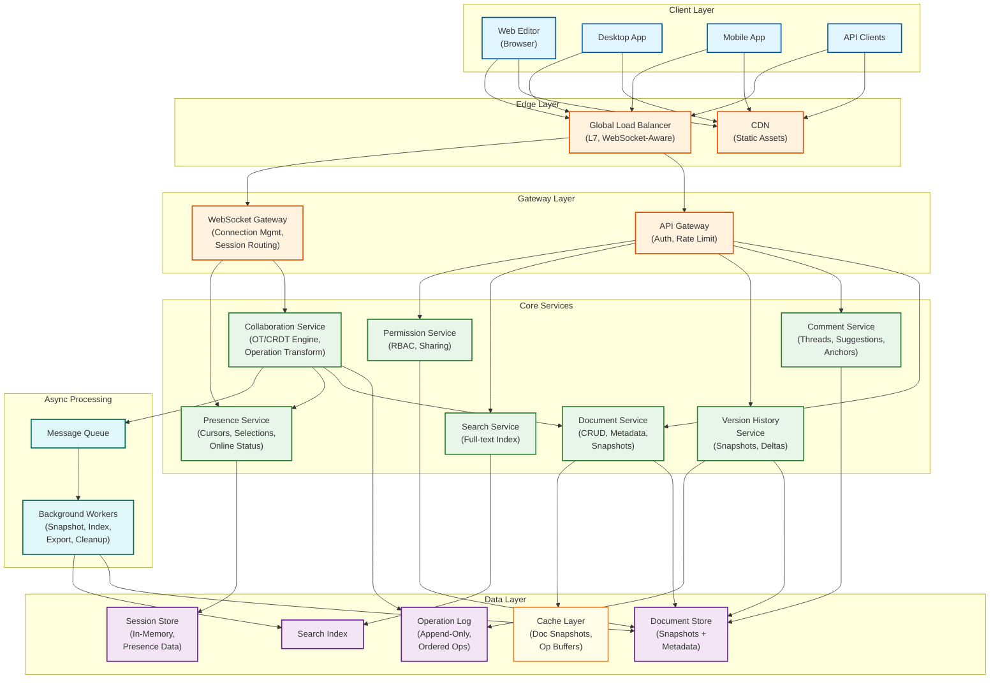
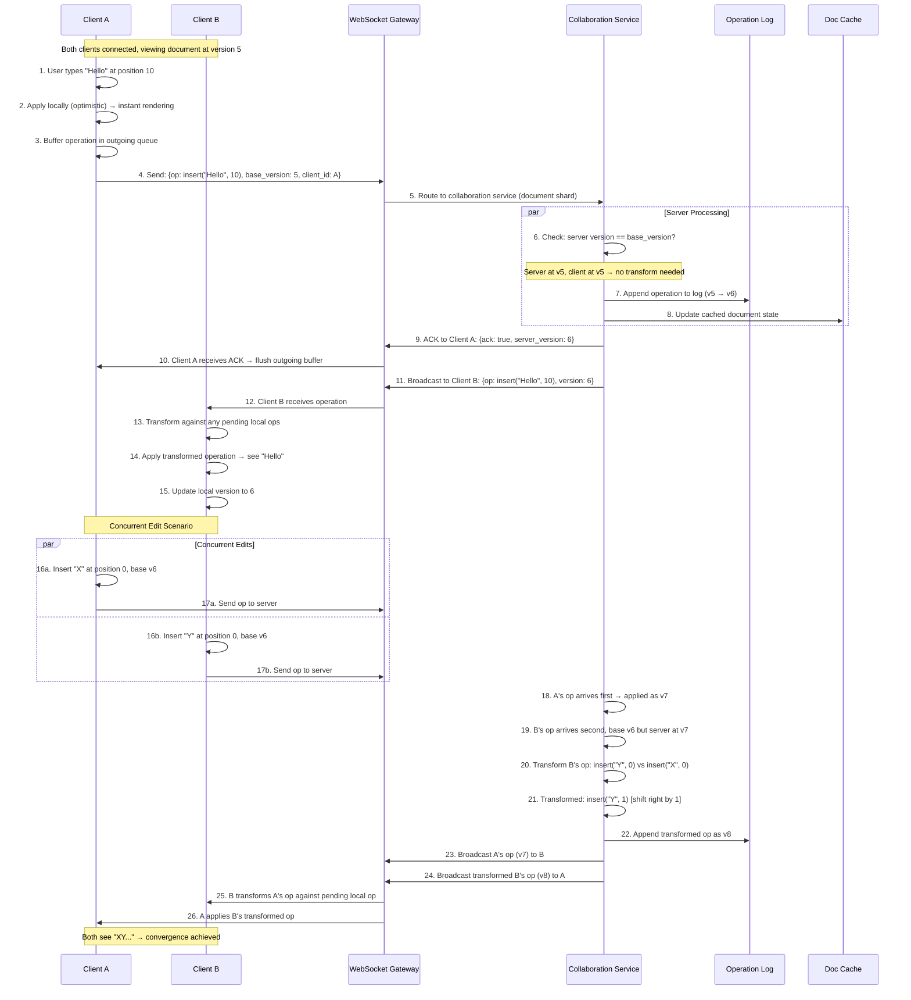
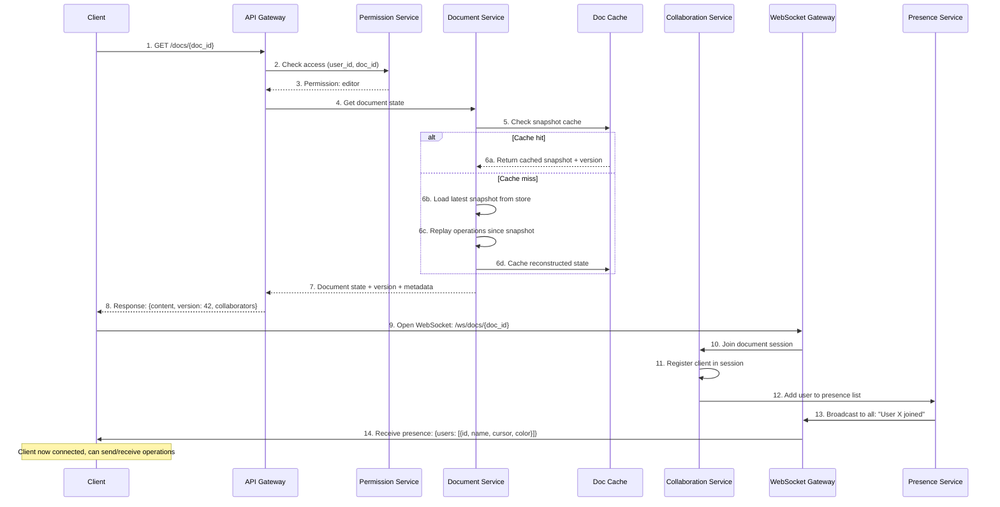
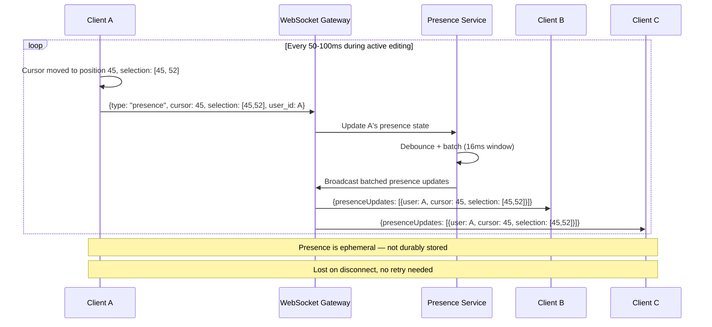
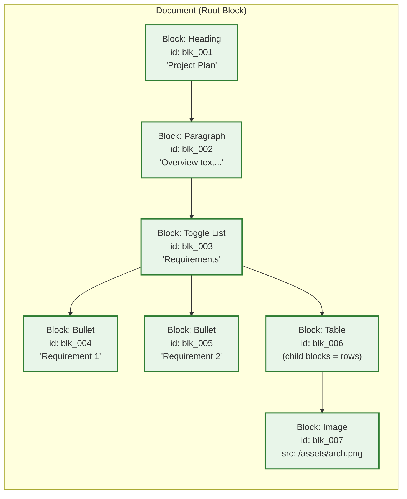
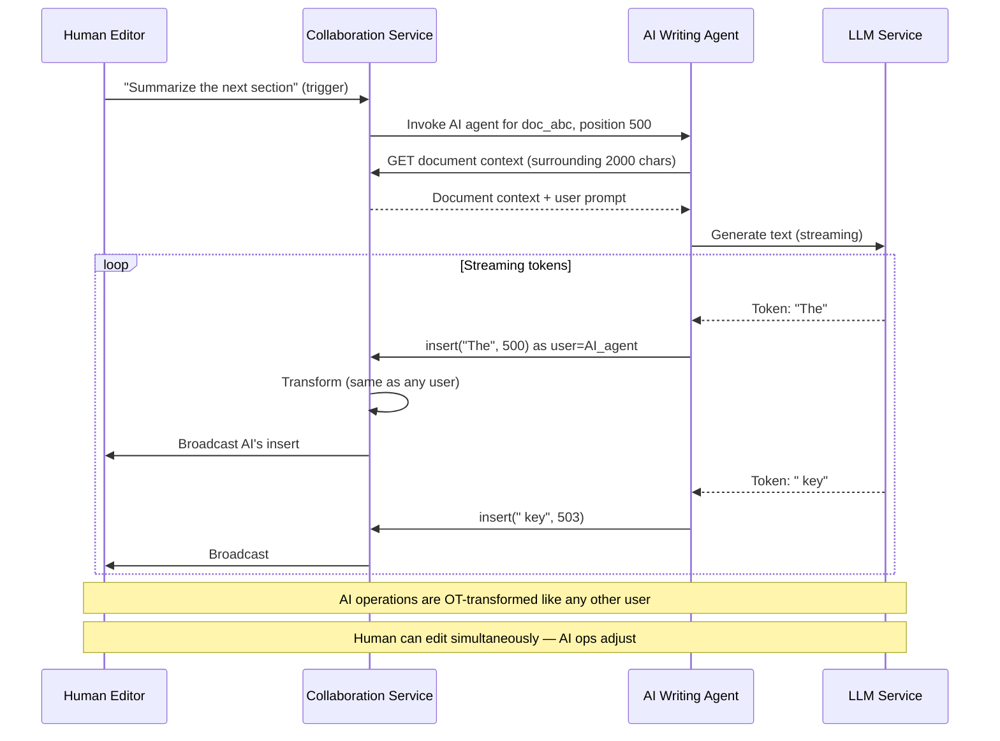
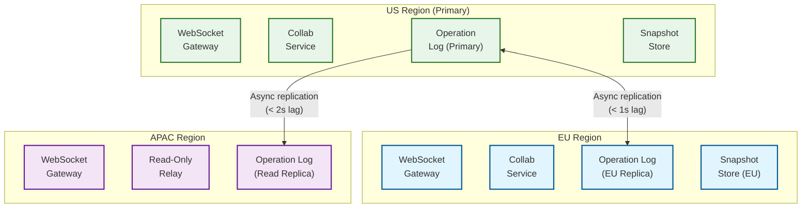

# High-Level Design

## 1. System Architecture



---

## 2. Data Flow

### 2.1 Real-Time Editing Flow (OT-Based, Google Docs Model)



### 2.2 Document Open Flow



### 2.3 Presence Update Flow



---

## 3. Key Architectural Decisions

### 3.1 OT vs CRDT

**Decision: OT for centralized real-time editing; CRDT for offline reconciliation**

This hybrid approach (used by Notion) leverages the strengths of each:

| Factor | OT (Real-Time Path) | CRDT (Offline Path) |
|--------|---------------------|---------------------|
| When used | Online, connected to server | Offline or disconnected editing |
| Authority | Central server orders operations | Each replica converges autonomously |
| Latency | <200ms with optimistic local apply | Merge on reconnect (seconds to minutes) |
| Memory | Low (no per-character metadata) | Higher (tombstones, metadata per character) |
| Convergence | Server-defined total order | Mathematical guarantees |

### 3.2 Monolith vs Microservices

**Decision: Microservices with a stateful Collaboration Service**

| Component | Scaling Rationale |
|-----------|-------------------|
| Collaboration Service | **Stateful** --- holds in-memory document sessions; scaled by document partitioning |
| Document Service | Stateless CRUD; scales horizontally |
| Presence Service | Ephemeral state in memory; scales per connection count |
| Permission Service | Stateless lookups; scales horizontally with caching |
| Search Service | Independent index sharding |

### 3.3 Communication Patterns

| Communication | Pattern | Reason |
|---------------|---------|--------|
| Client ↔ Collaboration Service | **WebSocket** (bidirectional) | Real-time operation streaming; low-overhead persistent connection |
| Client ↔ Document Service | **HTTP/REST** | Request-response for CRUD operations (open, list, delete) |
| Collaboration → Presence | **In-process or shared memory** | Ultra-low latency for cursor updates |
| Collaboration → Operation Log | **Synchronous append** | Operations must be durably stored before ACK |
| Collaboration → Snapshot Workers | **Asynchronous** (Message Queue) | Periodic snapshots are non-critical-path |
| Collaboration → Notification | **Asynchronous** | Comment mentions, share notifications |

### 3.4 Database Choices

| Data Type | Storage Choice | Justification |
|-----------|---------------|---------------|
| **Operation log** | Append-only log store (partitioned by doc_id) | High write throughput; sequential reads for replay; immutable |
| **Document snapshots** | Document store (e.g., MongoDB-style) | Flexible schema for rich document structures |
| **Document metadata** | Relational DB (SQL) | ACID for permissions, sharing, ownership |
| **Presence state** | In-memory store (Redis-like) | Ephemeral; TTL-based expiry; pub/sub for broadcast |
| **Comment threads** | Document store or SQL | Threaded comments with anchoring metadata |
| **Search index** | Inverted index | Full-text search across document content |
| **Session state** | In-memory (per-service instance) | Document collaboration state is per-session |

### 3.5 Operation Log Design

The operation log is the **source of truth** for document state:

```
┌─────────────────────────────────────────────────────────┐
│ Operation Log (per document, append-only)                │
├─────────────────────────────────────────────────────────┤
│ Seq │ Version │ User │ Operation           │ Timestamp  │
│   1 │      1  │ Alice│ insert("H", 0)      │ T1         │
│   2 │      2  │ Alice│ insert("e", 1)      │ T2         │
│   3 │      3  │ Bob  │ insert("X", 0)      │ T3         │
│   4 │      4  │ Alice│ insert("l", 2)      │ T4         │
│   5 │      5  │ Bob  │ delete(1)           │ T5         │
│   …  │      …  │  …   │  …                  │  …         │
│ 100 │    100  │      │ [SNAPSHOT MARKER]   │ T100       │
│ 101 │    101  │ Carol│ format(bold, 5, 10) │ T101       │
│ …   │     …   │  …   │  …                  │  …         │
└─────────────────────────────────────────────────────────┘

Document state = Snapshot(v100) + replay(ops 101..latest)
```

### 3.6 Snapshot Strategy

| Strategy | Pros | Cons | Use Case |
|----------|------|------|----------|
| **Every N operations** (e.g., 100) | Bounded replay cost; predictable | May snapshot in middle of logical edit | Default strategy |
| **Time-based** (every 5 min) | Regular cadence; simple | May be too frequent or too rare | Supplement to operation-based |
| **On session close** | Captures natural edit boundaries | No snapshot if session is long-lived | Additional trigger |
| **On demand** (named version) | User-controlled save points | Sparse; can't rely on for recovery | User-facing "version history" |

**Hybrid approach**: Snapshot every 100 operations OR every 5 minutes (whichever comes first), plus on-demand named versions.

---

## 4. Architecture Pattern Checklist

| Pattern | Decision | Justification |
|---------|----------|---------------|
| Sync vs Async | **Sync** for operations (must ACK); **Async** for snapshots, indexing | Operations need durability guarantee before ACK |
| Event-driven vs Request-response | **Event-driven** for operation propagation | Every edit is an event broadcast to all participants |
| Push vs Pull | **Push** via WebSocket for real-time; **Pull** for document open | Push eliminates polling latency |
| Stateless vs Stateful | **Stateful** collaboration service; stateless everything else | Document session state must be in memory for sub-ms transforms |
| Read/Write optimization | **Write-optimized** operation log; **read-optimized** snapshots | Log handles write burst; snapshots serve document loads |
| Real-time vs Batch | **Real-time** for editing; **batch** for snapshots, indexing, cleanup | Editing is inherently real-time |
| Edge vs Origin | **Origin** for all editing operations | Central server required for OT ordering |

---

## 5. Component Responsibilities

| Component | Responsibilities |
|-----------|-----------------|
| **WebSocket Gateway** | Manages persistent connections; routes operations to correct collaboration service instance; handles connection lifecycle (connect, disconnect, reconnect) |
| **Collaboration Service** | Core OT/CRDT engine; transforms operations, maintains in-memory document state, appends to operation log, broadcasts transformed operations |
| **Document Service** | CRUD for documents and metadata; loads snapshots; manages document lifecycle (create, archive, delete) |
| **Presence Service** | Tracks connected users per document; broadcasts cursor/selection positions; manages join/leave events; assigns user colors |
| **Comment Service** | Manages threaded comments and suggestions; anchors comments to text ranges; handles suggest/accept/reject workflow |
| **Version History Service** | Creates and retrieves snapshots; computes diffs between versions; supports named versions and restore |
| **Permission Service** | RBAC for document access; manages share links; enforces real-time permission changes |
| **Search Service** | Indexes document content for full-text search; updates index asynchronously on document changes |
| **Background Workers** | Periodic snapshot creation; search index updates; operation log compaction; export generation |

---

## 6. Block-Based Document Model (Notion Architecture)

An alternative to the linear text model (Google Docs) is the **block-based model** pioneered by Notion:



**Block-based vs Linear:**

| Aspect | Linear (Google Docs) | Block-Based (Notion) |
|--------|---------------------|---------------------|
| **Unit of editing** | Character positions in a flat text stream | UUID-identified blocks in a tree |
| **OT complexity** | Transform positions across entire document | Transform within blocks; block-level reordering separate |
| **Content types** | Text + inline formatting | Any content type (text, images, tables, embeds, databases) |
| **Concurrent editing** | Fine-grained character conflicts | Block-level isolation reduces conflicts |
| **Offline support** | Requires full document CRDT | Each block can be an independent CRDT |
| **Performance** | Large documents are one unit | Lazy loading by block; only render visible blocks |

---

## 7. AI Co-Editing Architecture (2024-2026)

AI writing assistants operate as first-class editors through the same OT/CRDT pipeline:



**Key principles:**
- AI is a **peer**, not a privileged entity — its operations go through the same OT pipeline
- Human edits during AI generation cause AI operations to be transformed (same as any concurrent edit)
- AI operations are attributed to an AI user (visible as "AI Assistant" cursor)
- Rate limiting applied per AI session (prevent token storms from overwhelming the collaboration service)
- Cancellation: user can stop AI generation; pending AI operations in flight are completed, no partial tokens

---

## 8. End-to-End Operation Latency Breakdown

```
Single operation (character insert, 3 concurrent editors):

Client-side:
  Keystroke capture                       ~1 ms
  Apply locally (optimistic)              ~0.1 ms
  Encode operation + metadata             ~0.1 ms
  ─────────────────────────────────────── ~1.2 ms

Network (client → server):
  WebSocket send (TCP/TLS overhead)       ~0.5 ms (persistent connection)
  Network latency (same region)           ~10 ms
  ─────────────────────────────────────── ~10.5 ms

Server-side:
  WebSocket gateway routing               ~0.5 ms
  Collaboration service: validate         ~0.1 ms
  Transform against 0-2 concurrent ops    ~0.2 ms
  Apply to in-memory state                ~0.1 ms
  WAL write (synchronous)                 ~1.5 ms
  Update comment anchors                  ~0.1 ms
  ─────────────────────────────────────── ~2.5 ms

Broadcast:
  Serialize + send to 2 other clients     ~0.5 ms
  Network latency (server → clients)      ~10 ms
  ─────────────────────────────────────── ~10.5 ms

Receiving client:
  Deserialize operation                   ~0.1 ms
  Transform against local pending ops     ~0.2 ms
  Apply to local document state           ~0.1 ms
  Re-render affected text                 ~2 ms
  ─────────────────────────────────────── ~2.4 ms

Total (sender → other clients see it):   ~27 ms
User's own keystroke → visible:           ~1.2 ms (optimistic!)
```

---

## 9. Cross-Service Communication Matrix

| Source → Destination | Protocol | Payload | Frequency | Failure Handling |
|---------------------|----------|---------|-----------|-----------------|
| **Client → WebSocket Gateway** | WebSocket (wss://) | Operations, presence updates | Continuous (per keystroke) | Client buffers ops locally; auto-reconnect |
| **WebSocket Gateway → Collab Service** | gRPC (internal) | Operations with trace context | Per operation | Gateway queues briefly; returns error after timeout |
| **Collab Service → Operation Log** | Direct write (synchronous) | Serialized operation | Per operation | Blocks ACK until write succeeds; failover to replica |
| **Collab Service → WebSocket Gateway** | gRPC streaming | Broadcast operations | Per operation | Best-effort; client detects missed ops via version gap |
| **Collab Service → Snapshot Worker** | Message queue | Snapshot trigger event | Every 100 ops or 5 min | Queue persists message; worker picks up on recovery |
| **Collab Service → Presence Service** | UDP multicast (internal) | Batch presence updates | Every 16ms | Lossy by design; stale presence auto-expires |
| **Document Service → Snapshot Store** | Object storage API | Full document snapshot blob | On document load/save | Retry with exponential backoff; serve from cache |
| **Search Indexer → Operation Log** | Change stream / CDC | New operations for indexing | Near real-time (1-5s lag) | Consumer tracks offset; replays on restart |

---

## 10. Data Locality and Access Patterns

### Regional Architecture



**Document ownership model:**
- Each document has a **home region** (determined by creator's location or org policy)
- Operations for a document are always processed in the home region
- Cross-region collaborators connect to local gateway → routed to home region collab service
- Added latency for cross-region: 80-150ms (acceptable for non-real-time feeling with optimistic local apply)
- EU-regulated documents MUST have EU as home region (GDPR data residency)
