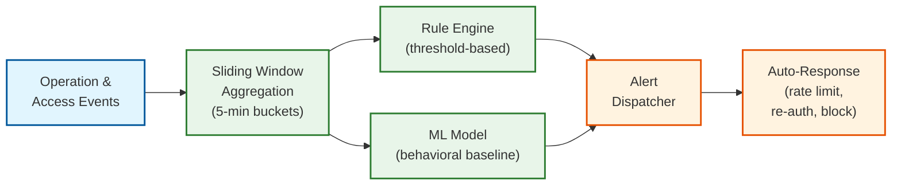

# Observability

## 1. Metrics (USE/RED)

### 1.1 Key Metrics

#### Service-Level Metrics (RED)

| Service | Rate | Errors | Duration |
|---------|------|--------|----------|
| **Collaboration Service** | Operations processed/sec | Transform errors, convergence failures | Operation processing latency (transform + persist + broadcast) |
| **WebSocket Gateway** | Connections/sec, Messages/sec | Connection failures, dropped messages | Message delivery latency |
| **Document Service** | Document loads/sec | Load failures, snapshot errors | Document load time |
| **Presence Service** | Presence updates/sec | Update drops | Presence broadcast latency |
| **Version History** | Snapshot creates/sec | Snapshot failures | Snapshot creation time |
| **Search Service** | Queries/sec | Search errors | Query latency |

#### Infrastructure Metrics (USE)

| Resource | Utilization | Saturation | Errors |
|----------|------------|------------|--------|
| **Collab instance** | CPU %, memory %, active sessions | Transform queue depth | OOM kills, crash restarts |
| **Operation log** | Write throughput, disk usage | Write queue depth, replication lag | Write failures, partition errors |
| **WebSocket gateway** | Connection count, NIC bandwidth | Connection queue depth | Handshake failures |
| **Session store** | Memory usage, key count | Eviction rate | Connection errors |
| **Search index** | Index size, query rate | Index lag behind operations | Index corruption |

#### Business Metrics

| Metric | Description | Alert Threshold |
|--------|-------------|-----------------|
| **Active collaborating sessions** | Documents with 2+ simultaneous editors | Track trend |
| **Operation throughput** | Total ops/s across all documents | Track trend; sudden drop = issue |
| **Convergence success rate** | % of documents where all clients agree | <99.99% triggers investigation |
| **Average collaborators per session** | Mean number of simultaneous editors | Track for capacity planning |
| **Comment creation rate** | Comments + suggestions per hour | Track for engagement analysis |
| **Offline reconciliation success** | % of offline → online transitions without conflict | <95% indicates UX issue |
| **Document load p99** | Time to interactive for document open | >1s triggers investigation |
| **WebSocket reconnection rate** | Reconnects per minute (indicates instability) | >5% of connections triggers investigation |

### 1.2 Dashboard Design

#### Operations Dashboard

```
┌─────────────────────────────────────────────────────────┐
│ Document Collaboration - Real-Time                       │
├─────────────────────────────────────────────────────────┤
│ Active Sessions: 4.8M  │  Ops/s: 3.2M  │  Error: 0.002%│
│ WebSocket Conn: 5.1M   │  Presence: 9.8M msg/s          │
├─────────────────────────────────────────────────────────┤
│ Operation Processing Latency:                            │
│   Transform:  0.2ms (p50)  0.8ms (p95)  2.1ms (p99)    │
│   WAL Write:  1.5ms (p50)  4.2ms (p95)  8.7ms (p99)    │
│   Broadcast:  3.1ms (p50)  12ms  (p95)  45ms  (p99)    │
│   Total:      5.2ms (p50)  18ms  (p95)  52ms  (p99)    │
├─────────────────────────────────────────────────────────┤
│ Collaboration Health:                                    │
│   Convergence checks passed: 100.0%      ● Healthy     │
│   Documents with >100 editors: 23        ⚠ Monitored   │
│   Documents with >500 editors: 2         ⚠ Rate-limited│
│   Ops since last snapshot (p99): 87      ● OK          │
├─────────────────────────────────────────────────────────┤
│ Instance Distribution:                                   │
│   Collab instances: 120 (avg 40K sessions each)         │
│   Hottest instance: 52K sessions (instance-047)         │
│   Coldest instance: 28K sessions (instance-103)         │
│   Session migrations (last hour): 340                    │
└─────────────────────────────────────────────────────────┘
```

### 1.3 Alerting Thresholds

| Severity | Metric | Threshold | Action |
|----------|--------|-----------|--------|
| **P1 (Page)** | Convergence failure detected | Any document divergence | Immediate: force-sync affected clients; investigate root cause |
| **P1 (Page)** | Operation log write failures | >0.1% for 2 min | Operations in danger of loss; investigate log store health |
| **P1 (Page)** | All collab instances in zone unreachable | Health checks fail across zone | Zone failure; trigger cross-zone failover |
| **P2 (Page)** | Operation processing p99 | >100ms for 5 min | Performance degradation; investigate hot documents or instance |
| **P2 (Page)** | WebSocket error rate | >1% for 5 min | Clients disconnecting; check gateway health |
| **P3 (Ticket)** | Snapshot backlog | >5K documents with >200 ops since snapshot | Scale snapshot workers |
| **P3 (Ticket)** | Collab instance memory | >80% on any instance | Plan session migration or scaling |
| **P4 (Info)** | Offline reconciliation failure rate | >5% | Review merge algorithm; may indicate UX issue |

---

## 2. Logging

### 2.1 What to Log

| Category | Events | Log Level |
|----------|--------|-----------|
| **Authentication** | WebSocket auth success/failure, token refresh, permission change | INFO / WARN |
| **Session lifecycle** | Document open, close, reconnect, session migration | INFO |
| **Operations** | Operation received, transformed, applied (metadata only, never content) | DEBUG (sampled 1%) |
| **Convergence** | Convergence check pass/fail, forced resync | INFO / ERROR |
| **Presence** | User join/leave document | INFO |
| **Comments** | Comment create, reply, resolve (metadata only) | INFO |
| **Errors** | Transform errors, WAL failures, connection drops | ERROR |
| **Performance** | Slow operations (>50ms), slow document loads (>1s) | WARN |
| **Security** | Permission denied, rate limit triggered, suspicious patterns | WARN |

### 2.2 Log Levels Strategy

| Level | Usage | Volume | Retention |
|-------|-------|--------|-----------|
| **ERROR** | Convergence failures, data integrity issues, WAL failures | Low | 90 days |
| **WARN** | Slow operations, rate limits hit, permission denied, reconnect storms | Medium | 60 days |
| **INFO** | Session lifecycle, authentication, comments | High | 30 days |
| **DEBUG** | Individual operation metadata (sampled) | Very High | 7 days |

### 2.3 Structured Logging Format

```json
{
  "timestamp": "2026-03-08T10:30:00.123Z",
  "level": "INFO",
  "service": "collaboration-service",
  "instance_id": "collab-west-047",
  "trace_id": "abc123def456",
  "span_id": "span789",
  "doc_id": "doc_abc123",
  "user_id": "u_hashed_12345",
  "event": "operation.processed",
  "op_type": "insert",
  "base_version": 4285,
  "server_version": 4287,
  "transforms_applied": 2,
  "transform_time_us": 180,
  "wal_write_time_us": 1500,
  "broadcast_time_us": 3100,
  "total_time_us": 5200,
  "connected_clients": 7,
  "ops_since_snapshot": 45
}
```

**Privacy**: Operation content (what the user typed) is **never logged**. Only operation metadata (type, position, length, version) appears in logs.

---

## 3. Distributed Tracing

### 3.1 Trace Propagation

Operations flow through the system with trace context:

```
Client → WebSocket Gateway → Collaboration Service → Operation Log → Broadcast
                                     │
                                     ├── Presence Service
                                     └── Snapshot Worker (async)
```

Trace ID is assigned when the client sends an operation and propagated through all downstream services.

### 3.2 Key Spans to Instrument

| Span Name | Service | What It Captures |
|-----------|---------|------------------|
| `operation.process` | Collaboration Service | Full operation lifecycle: receive → transform → apply → persist → broadcast |
| `operation.transform` | Collaboration Service | Time spent transforming against concurrent operations |
| `operation.wal_write` | Collaboration Service | Time to durably persist operation to WAL |
| `operation.broadcast` | WebSocket Gateway | Time to deliver operation to all connected clients |
| `document.load` | Document Service | Full load: find snapshot → replay ops → serve |
| `snapshot.create` | Version History | Serialize document state → persist → update metadata |
| `presence.broadcast` | Presence Service | Batch presence updates and deliver |
| `comment.anchor_update` | Collaboration Service | Update comment anchors after operation |
| `session.migrate` | Collaboration Service | Session migration between instances |

### 3.3 Trace Sampling Strategy

| Condition | Sample Rate | Reason |
|-----------|-------------|--------|
| Error responses | 100% | Always trace errors |
| Slow operations (>p95) | 100% | Diagnose latency issues |
| Convergence failures | 100% | Critical correctness issue |
| Normal operations | 0.1% | Very high volume |
| Presence updates | 0% | Too chatty; low diagnostic value |
| Document loads | 10% | Moderate volume; useful for load optimization |
| Snapshot creation | 100% | Infrequent; always worth tracing |

---

## 4. Alerting

### 4.1 Critical Alerts (Page-Worthy)

| Alert | Condition | Response |
|-------|-----------|----------|
| **Document divergence** | Convergence check hash mismatch between server and any client | Force-resync all clients; capture operation log for debugging; may indicate transform bug |
| **Operation log unavailable** | WAL writes failing for >30s | All editing at risk; consider read-only mode; escalate immediately |
| **Collaboration instance crash** | Instance health check fails; sessions lost | Automatic session recovery via WAL replay; verify all sessions recovered |
| **WebSocket mass disconnect** | >10% of connections drop within 1 minute | Network issue or gateway failure; check load balancer and gateway health |

### 4.2 Warning Alerts

| Alert | Condition | Response |
|-------|-----------|----------|
| **Hot document** | Single document with >200 ops/s for 5 min | Monitor; consider rate limiting; check for bot/script activity |
| **Snapshot backlog** | >100 documents with >500 ops since last snapshot | Scale snapshot workers; these documents will be slow to load |
| **Instance imbalance** | Hottest instance has 2x sessions of coldest | Trigger session rebalancing |
| **Reconnection storm** | >1000 reconnects/min from same region | Network instability; investigate regional infrastructure |
| **Operation log replication lag** | >5s lag on any replica | Prepare for potential failover; investigate replica health |

### 4.3 Runbook References

| Alert | Runbook | Key Steps |
|-------|---------|-----------|
| Document divergence | `runbook/collab/divergence.md` | 1. Identify affected doc, 2. Capture op log, 3. Force client resync, 4. Root cause analysis |
| Instance crash recovery | `runbook/collab/instance-recovery.md` | 1. Verify WAL intact, 2. Spin up replacement, 3. Replay sessions, 4. Redirect clients |
| Mass WebSocket disconnect | `runbook/gateway/mass-disconnect.md` | 1. Check LB health, 2. Check gateway instances, 3. Check network, 4. Verify client reconnect |
| Hot document | `runbook/collab/hot-document.md` | 1. Identify doc and editors, 2. Check for bot activity, 3. Apply rate limit, 4. Consider viewer downgrade |

---

## 5. Convergence Monitoring

Convergence is the **most critical correctness property**. A dedicated monitoring system verifies it:

```
ALGORITHM ConvergenceCheck(doc_id)
  // Run every 60 seconds for active documents

  server_hash ← HASH(collaboration_service.get_state(doc_id))

  FOR EACH client IN connected_clients(doc_id):
    client_hash ← REQUEST_HASH(client)
    client_version ← REQUEST_VERSION(client)

    IF client_version == server_state.version AND client_hash != server_hash:
      // DIVERGENCE DETECTED
      ALERT_P1("Convergence failure", doc_id, client.user_id)
      LOG_ERROR("divergence", {
        doc_id, server_hash, client_hash,
        server_version: server_state.version,
        client_version: client_version
      })
      // Force resync
      SEND(client, {type: "force_resync", state: server_state})

    ELSE IF client_version < server_state.version:
      // Client is behind — likely still processing ops; OK
      IF server_state.version - client_version > 100:
        ALERT_P3("Client significantly behind", doc_id, client.user_id)

  METRIC("convergence_check.passed", 1)
```

---

## 6. SLI/SLO Framework

### Service Level Indicators

| SLI | Definition | Measurement |
|-----|-----------|-------------|
| **Edit availability** | % of operations successfully processed within 300ms | Server-side operation processing latency |
| **Convergence correctness** | % of convergence checks that pass | Periodic hash comparison (server vs clients) |
| **Document load time** | p99 time to interactive for document open | Client-side instrumented timing |
| **Operation durability** | % of ACKed operations that survive infrastructure failures | WAL replication verification |
| **Presence freshness** | % of cursor updates delivered within 200ms | End-to-end presence measurement |

### SLO Definitions

| SLO | Target | Error Budget (30-day) | Burn Rate Alert |
|-----|--------|----------------------|-----------------|
| Edit availability | 99.99% | 4.3 minutes of degraded editing | 10x burn → page in 6 min |
| Convergence correctness | 100% | Zero budget (any failure = P1) | Any failure → immediate page |
| Document load p99 <1s | 99.5% | 3.6 hours equivalent | 3x burn → page in 4 hours |
| Operation durability | 99.9999% | ~2.6 seconds of lost ops | Any loss → immediate page |

---

## 7. Session Health Monitoring

### Per-Document Session Dashboard

```
┌──────────────────────────────────────────────────────────┐
│ Document Session Health - Top Issues (Last 1h)            │
├──────────────────────────────────────────────────────────┤
│                                                           │
│ Stalled sessions (no ops for >5 min with clients):  12    │
│ Sessions with >500 ops since snapshot:               8    │
│ Sessions with >100 concurrent editors:               2    │
│ Sessions with convergence check pending:             0 ●  │
│                                                           │
│ Operation Processing Latency Histogram:                   │
│   <1ms:    ████████████████████████████████████████  72%  │
│   1-5ms:   ████████████  18%                             │
│   5-10ms:  ████  6%                                      │
│   10-50ms: ██  3%                                        │
│   >50ms:   ▏  1% ← Hot documents                        │
│                                                           │
│ Transform Efficiency:                                     │
│   Ops with 0 transforms needed:  65% (solo editing)      │
│   Ops with 1 transform:          20%                     │
│   Ops with 2-5 transforms:       12%                     │
│   Ops with 5+ transforms:        3% (hot documents)      │
│                                                           │
│ WAL Write Health:                                         │
│   Success rate: 99.998%                                  │
│   p99 latency: 4.2ms ● OK                               │
│   Replication lag: 0.1s ● OK                             │
│                                                           │
└──────────────────────────────────────────────────────────┘
```

### Operation Log Growth Monitoring

| Metric | Current | Threshold | Alert |
|--------|---------|-----------|-------|
| **Total op log size** | 1.8 PB | >2.5 PB | Plan capacity expansion |
| **Growth rate** | 5 TB/day | >8 TB/day | Investigate (viral doc? bot?) |
| **Compaction backlog** | 12K docs | >50K docs | Scale compaction workers |
| **Oldest uncompacted ops** | 3 days | >7 days | P3 ticket |
| **Snapshot worker throughput** | 500 snapshots/min | <200/min | Scale workers |

---

## 8. Anomaly Detection

### Behavioral Anomaly Patterns

| Pattern | Detection Method | Alert Action |
|---------|-----------------|--------------|
| **Bot-like editing** | Operations at consistent 50ms intervals (human typing is irregular) | Flag document; check for API abuse |
| **Bulk document access** | Same user opens >50 documents in 5 minutes | Potential data exfiltration; rate limit and notify security |
| **Unusual sharing pattern** | Document shared with 100+ external emails in 1 hour | Potential data leak; pause sharing, alert admin |
| **Off-hours mass editing** | >1000 operations from single user during 2-5 AM local time | Possible compromised account; require re-authentication |
| **Geographic anomaly** | Same user active from 2+ regions simultaneously | Session hijacking; invalidate older session |
| **Permission escalation probing** | Repeated permission-denied errors from same user | Possible attacker probing access; temporary lockout after threshold |

### Anomaly Detection Pipeline



---

## 9. Client-Side Telemetry

### What to Measure on the Client

| Metric | Description | Collection Strategy |
|--------|-------------|---------------------|
| **Keystroke-to-render latency** | Time from keypress to character appearing on screen | Performance.now() delta; sampled 10% of sessions |
| **Remote operation render latency** | Time from WebSocket message receipt to rendered on screen | Client-side instrumented; sampled 10% |
| **WebSocket reconnection count** | Number of reconnects per session | Always collected; indicates network instability |
| **Time to interactive (document open)** | From navigation start to document fully editable | Always collected; primary UX metric |
| **Offline buffer size** | Number of operations buffered during offline period | Collected during offline-to-online transition |
| **Transform conflict rate** | % of local operations that required transformation against remote ops | Sampled 10%; indicates collaboration intensity |
| **Client memory usage** | JavaScript heap size during editing session | Sampled every 60s; 5% of sessions |
| **Rendering frame drops** | Frames below 60fps during editing | Performance observer; sampled 5% |

### Client Telemetry Architecture

```
Client Telemetry Pipeline:

  Browser (editing session)
    │
    ├── Performance events (keystroke latency, render time)
    ├── Error events (transform failures, WebSocket errors)
    ├── Session events (open, close, reconnect, offline)
    └── Resource events (memory, CPU, frame rate)
    │
    ▼
  Telemetry Buffer (client-side)
    │ Batch every 30s or 50 events (whichever first)
    │ Drop if buffer exceeds 500 events (backpressure)
    ▼
  Telemetry API (REST, fire-and-forget)
    │
    ▼
  Streaming ingestion (Kafka topic: client-telemetry)
    │
    ├──► Real-time dashboards (p50/p95/p99 by region)
    ├──► Anomaly detection (sudden latency spikes)
    └──► Long-term analytics (trend analysis, regression detection)
```

### Client-Side Error Tracking

| Error Type | Severity | Auto-Recovery | Reporting |
|-----------|----------|---------------|-----------|
| **Transform exception** | High | Force resync from server | 100% reported with operation context |
| **WebSocket disconnect** | Medium | Auto-reconnect with exponential backoff | Reported if >3 reconnects in 5 min |
| **Rendering corruption** | High | Re-render from document model | 100% reported with DOM snapshot |
| **Memory limit exceeded** | Medium | Evict undo history, reduce presence tracking | Reported with heap snapshot |
| **Operation timeout** | Medium | Retry with backoff; show "saving..." indicator | Reported if >2 consecutive timeouts |
