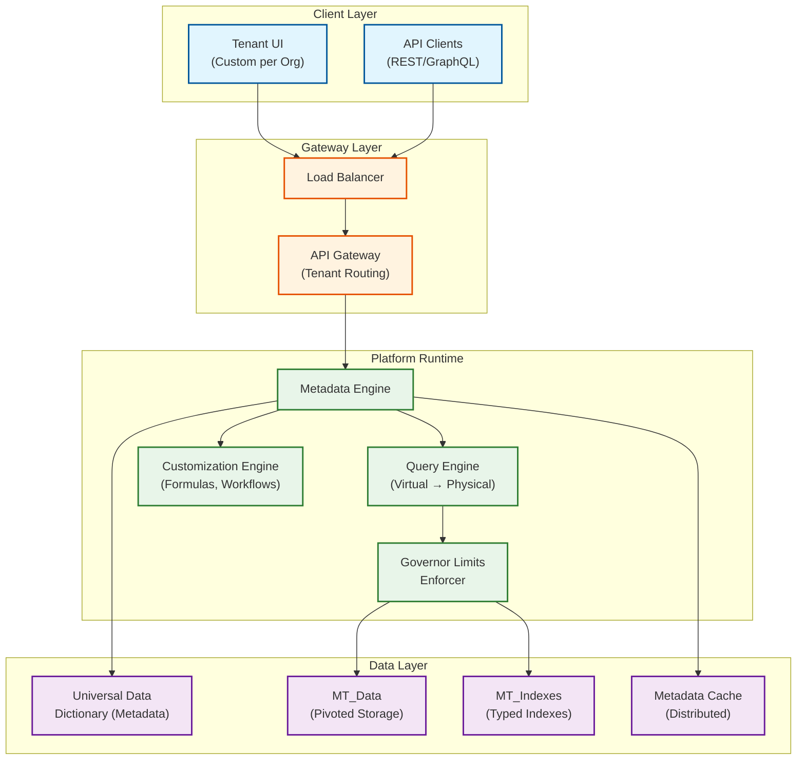

# 6.3 Multi-Tenant SaaS Platform Architecture

## System Overview

A multi-tenant SaaS platform enables a single shared infrastructure to serve thousands of independent customer organizations ("tenants") while guaranteeing data isolation, per-tenant customization, and fair resource sharing. This design covers the Salesforce-style metadata-driven approach where custom objects, fields, workflows, and security rules are all virtual constructs described by metadata -- enabling each tenant to have a fully customized application experience without any physical schema changes. The architecture must balance three competing forces: **tenant isolation** (security and performance guarantees), **resource efficiency** (shared infrastructure economics), and **customization depth** (each tenant feels like they have their own application).

## Key Characteristics

| Characteristic | Classification |
|---------------|---------------|
| Read/Write Profile | Read-heavy (10:1 ratio), with write-heavy bursts during imports/migrations |
| Latency Sensitivity | High -- p99 < 200ms for CRUD, < 500ms for complex queries |
| Consistency Model | Strong consistency within a tenant, eventual for cross-tenant analytics |
| Availability Target | 99.99% (< 52 minutes downtime/year) |
| Data Volume | Petabyte-scale across all tenants, gigabyte to terabyte per large tenant |
| Customization | Metadata-driven -- custom objects, fields, formulas, workflows, validation rules |
| Isolation Guarantee | Org-level: no data leaks, no noisy-neighbor performance degradation |

## Complexity Rating: `Very High`

Multi-tenant SaaS is among the most architecturally complex system designs because it must simultaneously solve: metadata-driven schema virtualization, per-tenant resource isolation, customization engines (formulas, workflows, validation), governor limits enforcement, tenant-aware security at every layer, and horizontal scaling across thousands of heterogeneous workloads.

## Core Design Pillars

| Pillar | Implementation | Key Trade-off |
|--------|---------------|---------------|
| **Schema Virtualization** | Pivoted EAV model with Universal Data Dictionary | Flexibility vs. query performance (JOIN overhead) |
| **Tenant Isolation** | OrgID injection + governor limits + cell architecture | Sharing efficiency vs. isolation strength |
| **Customization Depth** | Metadata-driven objects, fields, formulas, workflows | Customization power vs. per-operation overhead |
| **Fair Resource Sharing** | Governor limits (per-transaction) + rate limiting (per-org) | Individual tenant freedom vs. collective fairness |
| **Blast Radius Containment** | Cell-based deployment (1-2K orgs per cell) | Operational simplicity vs. failure isolation |
| **Zero-Downtime Operations** | Canary deployments per cell + live tenant migration | Deployment speed vs. safety |

## Quick Navigation

| Document | Description |
|----------|-------------|
| [01 - Requirements & Estimations](./01-requirements-and-estimations.md) | Functional/non-functional requirements, capacity planning, SLOs |
| [02 - High-Level Design](./02-high-level-design.md) | Architecture diagrams, data flow, key decisions |
| [03 - Low-Level Design](./03-low-level-design.md) | Data model (UDD), API design, algorithms |
| [04 - Deep Dive & Bottlenecks](./04-deep-dive-and-bottlenecks.md) | Metadata engine, governor limits, noisy neighbor |
| [05 - Scalability & Reliability](./05-scalability-and-reliability.md) | Cell architecture, sharding, fault tolerance |
| [06 - Security & Compliance](./06-security-and-compliance.md) | Tenant isolation, encryption, BYOK, sharing model |
| [07 - Observability](./07-observability.md) | Tenant-aware metrics, tracing, alerting |
| [08 - Interview Guide](./08-interview-guide.md) | 45-min pacing, trap questions, trade-offs |

## Architecture at a Glance

## Real-World References

| Company | Approach | Scale | Key Innovation |
|---------|----------|-------|----------------|
| **Salesforce** | Metadata-driven shared schema (UDD), pivoted data model, governor limits | 150K+ orgs, 13B+ daily interactions, 100+ instances | Polymorphic IDs, formula engine, 11-step execution order |
| **ServiceNow** | Database-per-tenant on bare metal | 85K databases, 25B queries/hour, 50K instances | Physical isolation at scale, per-DB patching |
| **Workday** | True multi-tenant with tenant-tagged object model | Single codebase, all tenants on same version | No version fragmentation, simultaneous upgrades |
| **Slack** | Cell-based architecture (AZ-aligned cells) | 99.99% availability target, 5-min failover | Cell-based blast radius, vitess for MySQL sharding |
| **Shopify** | Pod-based architecture (10K+ stores per pod) | 1M+ stores, peak 1.3M requests/sec (BFCM) | Horizontal pod scaling, per-store resource isolation |
| **Atlassian** | Tenant-sharded microservices on shared compute | 250K+ organizations, cross-product integration | Shard-per-tenant at the service layer, shared infrastructure |

### Industry Benchmarks (2025)

| Metric | Top Quartile | Median | Context |
|--------|-------------|--------|---------|
| Tenant density (shared DB) | 8,000+ orgs/instance | 2,000 orgs/instance | Salesforce-class density |
| Provisioning time | < 1 second | < 30 seconds | From signup to first API call |
| Noisy neighbor impact | < 5% latency increase | < 15% | Under 2x normal load from hot tenant |
| Metadata cache hit rate | > 99% | > 95% | Critical for EAV performance |
| Cross-tenant incident rate | 0 per year | < 1 per year | Data isolation violations |

## Related Patterns & Cross-References

| Pattern / Design | Relationship | Link |
|-----------------|-------------|------|
| **Metadata-Driven Super Framework** | Core engine powering schema virtualization; this topic focuses on multi-tenancy infrastructure around that engine | [3.3 Metadata-Driven Super Framework](../3.3-ai-native-metadata-driven-super-framework/00-index.md) |
| **IAM System** | Provides cross-cutting identity/access patterns; this topic covers org-level isolation and tenant-specific security layers | [2.5 IAM System](../2.5-identity-access-management/00-index.md) |
| **Distributed Key-Value Store** | The pivoted data model (UDD) is fundamentally a key-value approach with metadata overlay for typed access | [1.3 KV Store](../1.3-distributed-key-value-store/00-index.md) |
| **Rate Limiter** | Governor limits and per-org throttling are specialized rate limiting applied at transaction and API levels | [2.3 Rate Limiter](../2.3-rate-limiter/00-index.md) |
| **Metrics Monitoring System** | Tenant-aware observability requires per-org metric cardinality management and composite health scoring | [15.1 Metrics Monitoring](../15.1-metrics-monitoring-system/00-index.md) |
| **Log Aggregation System** | Multi-tenant log isolation, org-scoped retention policies, and support agent access controls | [15.3 Log Aggregation](../15.3-log-aggregation-system/00-index.md) |
| **HubSpot (Marketing Automation)** | CRM-style SaaS built on similar multi-tenant primitives; contrasts workflow engine designs | [6.4 HubSpot](../6.4-hubspot/00-index.md) |
| **Real-Time Collaborative Editor** | Shared-state concurrency patterns analogous to multi-tenant metadata contention | [6.8 Collaborative Editor](../6.8-real-time-collaborative-editor/00-index.md) |

## Key Differentiators from Related Designs

| vs. Design | Key Difference |
|-----------|----------------|
| vs. [3.3 Metadata-Driven Super Framework](../3.3-ai-native-metadata-driven-super-framework/00-index.md) | This focuses on **multi-tenancy infrastructure** (isolation, governor limits, resource sharing); 3.3 focuses on the **metadata engine itself** (custom objects, formula engine, workflow engine) |
| vs. [2.5 IAM System](../2.5-identity-access-management/00-index.md) | This covers **org-level isolation and tenant security model**; 2.5 covers cross-cutting identity and access patterns |
| vs. [1.3 KV Store](../1.3-distributed-key-value-store/00-index.md) | The pivoted data model (UDD) is fundamentally a key-value approach with metadata overlay |

## Evolution of Multi-Tenant Architecture (2020-2026)

| Era | Architecture | Tenant Density | Key Innovation |
|-----|-------------|---------------|----------------|
| **2010-2015** | Schema-per-tenant on shared DB | ~500 orgs/instance | Row-level security, connection pooling |
| **2015-2020** | Shared schema + metadata (UDD) | ~8,000 orgs/instance | Pivoted data model, governor limits, cell architecture |
| **2020-2023** | Cell-based + hybrid isolation | ~2,000 orgs/cell | Independent cells, dedicated cells for enterprise, multi-region |
| **2023-2026** | AI-native multi-tenancy | Varies by workload | Per-tenant AI model isolation, GPU sharing, confidential computing, eBPF-based isolation |

Modern multi-tenant platforms must now manage not just data and compute isolation but also **AI inference isolation** (per-tenant model routing, GPU time-slicing, prompt/context separation) and **compliance-as-code** (automated EU Data Act portability, AI Act transparency requirements embedded in the tenant lifecycle).

## When to Use This Architecture

| Scenario | Recommended? | Why |
|----------|-------------|-----|
| 10,000+ tenants with deep customization | **Yes (primary use case)** | Metadata-driven schema is the only approach that scales |
| < 100 tenants, each needing physical DB isolation | **No** — use database-per-tenant | Operational simplicity wins at small scale |
| B2C app with millions of "tenants" (individual users) | **No** — use traditional sharding | Per-user governor limits are overkill; user_id partitioning suffices |
| Regulated industry requiring provable data isolation | **Hybrid** — shared for most, dedicated cells for regulated tenants | Compliance-driven isolation for the few, efficiency for the many |
| AI/ML platform with per-tenant model serving | **Extend** — add GPU-aware cell architecture | Standard cell model + GPU pools with tenant-aware scheduling |
| Multi-product SaaS suite (CRM + ERP + HR) | **Yes** — shared metadata engine across products | Product-specific metadata templates on shared UDD infrastructure |
| White-label SaaS (tenants resell to their customers) | **Extend** — add sub-tenant hierarchy | Org tree with parent-child isolation boundaries |
