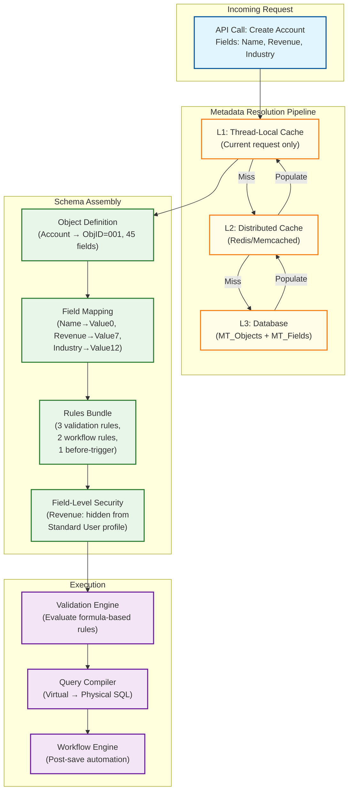
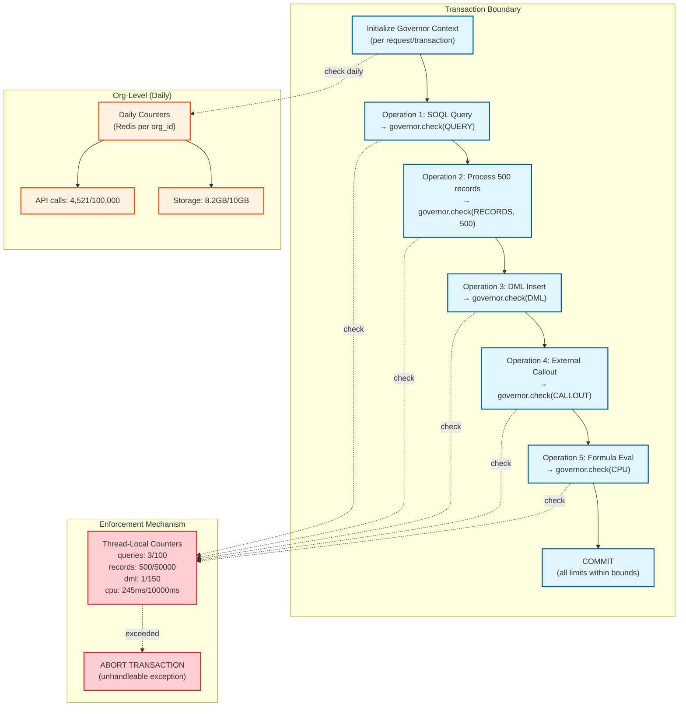
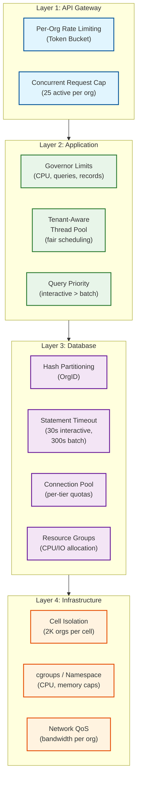
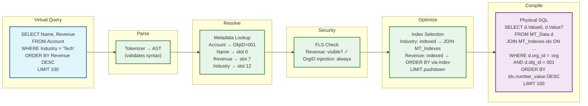

# Deep Dive & Bottlenecks

## Critical Component 1: Metadata Engine & Customization Runtime

### Why This Is Critical

The metadata engine is the **brain** of the multi-tenant platform. Every single operation -- reads, writes, queries, validations, workflows -- begins with a metadata lookup to understand the tenant's virtual schema. A slow or incorrect metadata engine makes the entire platform unusable.

### How It Works Internally



**Key internal mechanics:**

1. **Metadata Compilation:** On first access, the engine compiles an org's metadata into an optimized in-memory representation (field maps, rule execution plans, relationship graphs). This compiled form is cached.

2. **Formula Field Evaluation:** Formula fields (e.g., `Discount__c = IF(Revenue > 1M, 0.15, 0.05)`) are parsed into expression trees at metadata load time and evaluated at query time using a stack-based interpreter.

3. **Order of Execution:** On record save, the engine orchestrates a strict 11-step execution order: system validation → before triggers → custom validation → duplicate rules → record save → after triggers → assignment rules → workflow rules → re-trigger (if field updates) → escalation rules → commit.

### Failure Modes

| Failure | Impact | Mitigation |
|---------|--------|------------|
| **Cache miss storm** (cold start after restart) | All requests hit database for metadata | Warm-up protocol: pre-load metadata for top 1,000 active orgs on startup |
| **Stale cache** (metadata change not propagated) | Tenant sees old schema; possible data corruption | Pub/sub invalidation with version vectors; clients include `metadata_version` in requests |
| **Circular formula reference** | Infinite loop in formula evaluation | Dependency graph analysis at save time; max evaluation depth = 10 |
| **Metadata table corruption** | Entire org's schema is broken | Point-in-time recovery per org; metadata backup on every change |
| **Cache stampede** (many requests for same evicted key) | Thundering herd on DB | Singleflight pattern: only one goroutine/thread fetches; others wait |

---

## Critical Component 2: Governor Limits Enforcement Engine

### Why This Is Critical

Without governor limits, a single tenant running a poorly written report could consume all database connections, starving 7,999 other orgs on the same instance. Governor limits are the **immune system** of multi-tenancy.

### How It Works Internally



**Two tiers of enforcement:**

1. **Per-Transaction (synchronous):** Thread-local counters reset at the start of each request. O(1) overhead per check. Limits are hard -- exceeding them aborts the entire transaction with no partial commit.

2. **Per-Org (daily rolling):** Distributed counters (Redis) track org-level consumption. API call limits, async operation limits, storage limits. Checked at request entry (API Gateway layer), not per-operation.

### Failure Modes

| Failure | Impact | Mitigation |
|---------|--------|------------|
| **Governor counter drift** (thread recycling without reset) | Limits carry over from previous request; false positives | Always initialize governor context in request interceptor middleware; never reuse |
| **Redis daily counter unavailable** | Can't enforce org-level limits | Fail-open with local rate estimates; alert on Redis health; degrade to conservative local limits |
| **Limit too restrictive for legitimate use** | Enterprise customers hit limits on valid operations | Tier-based limits (Enterprise gets 2x); provide async alternatives for heavy operations |
| **Bypass via internal API** | Admin APIs skip governor checks | Separate governor profiles for internal vs external; audit all bypass paths |
| **Time-of-check/time-of-use (TOCTOU)** | Concurrent requests check limits simultaneously, both pass, total exceeds | Acceptable for per-transaction limits (independent transactions); per-org daily limits use atomic Redis INCR |

---

## Critical Component 3: Noisy Neighbor Isolation

### Why This Is Critical

In a shared infrastructure, one tenant's heavy workload (bulk import, complex report, runaway query) can degrade performance for all co-located tenants. This is the **existential risk** of multi-tenancy.

### How Isolation Works Across Layers



**Multi-layer defense:**

| Layer | Mechanism | What It Prevents |
|-------|-----------|-----------------|
| **API Gateway** | Per-org rate limiting (token bucket), concurrent request cap | API flooding, DDoS from a single tenant |
| **Application** | Governor limits, tenant-aware thread pool (fair-share scheduling) | CPU monopolization, memory exhaustion |
| **Database** | Statement timeout, per-tier connection quotas, resource groups | Long-running query blocking, connection pool exhaustion |
| **Infrastructure** | Cell-based isolation, cgroups, network QoS | Hardware-level resource starvation |

**Tenant-Aware Fair Scheduling:**

```
FUNCTION assign_request_to_thread(request, org_id):
    // Each org gets a weighted fair-share of the thread pool
    org_tier = get_org_tier(org_id)  // BASIC, PROFESSIONAL, ENTERPRISE
    weight = TIER_WEIGHTS[org_tier]  // 1, 3, 10

    // Track in-flight requests per org
    in_flight = active_requests_counter.get(org_id)
    max_concurrent = MAX_CONCURRENT[org_tier]  // 10, 25, 100

    IF in_flight >= max_concurrent:
        // Shed load for this org (others still served)
        RETURN 429 "Too many concurrent requests for this organization"

    // Weighted fair queuing: orgs with fewer in-flight requests get priority
    priority = weight / (in_flight + 1)  // Higher = gets thread sooner
    thread_pool.submit(request, priority)
    active_requests_counter.increment(org_id)
```

### Failure Modes

| Failure | Impact | Mitigation |
|---------|--------|------------|
| **Database hotspot** (one org's partition dominates I/O) | Other partitions on same disk slow down | Dedicated tablespace for "whale" tenants; SSD with high IOPS |
| **Memory pressure from large queries** | OS starts swapping, all tenants affected | Statement-level memory limit; kill queries exceeding threshold |
| **Bulk import overwhelming write buffer** | Write throughput degrades for all | Throttle bulk API: max 10K records/batch, 2-second inter-batch delay |
| **Search index contention** (one org's re-index blocks others) | Search latency spike | Per-org search index segments; background re-index with resource caps |

---

## Concurrency & Race Conditions

### Race Condition 1: Duplicate Record Creation

**Scenario:** Two concurrent requests create a record with the same unique field value for the same org.

**Solution:** MT_Unique_Indexes table with a composite unique constraint `(org_id, obj_id, field_num, unique_value)`. The database enforces uniqueness at the constraint level. The second INSERT fails with a duplicate key error, which the application translates into a user-friendly error.

### Race Condition 2: Concurrent Metadata Modification

**Scenario:** Admin A adds field "Revenue__c" while Admin B simultaneously adds field "Revenue__c" on the same object.

**Solution:** Pessimistic locking on metadata operations. `SELECT FOR UPDATE` on the MT_Objects row before any field addition. This serializes concurrent metadata changes for the same object within the same org.

### Race Condition 3: Read-Your-Own-Writes After Cache Invalidation

**Scenario:** User adds a custom field, then immediately creates a record using that field. If the metadata cache hasn't been invalidated on the app server handling the second request, the field appears nonexistent.

**Solution:** Session affinity (sticky sessions) for metadata-modifying requests. After a metadata change, the client includes the new `metadata_version` in subsequent requests. If the app server's cached version is older, it forces a synchronous cache refresh before proceeding.

### Race Condition 4: Workflow Re-entry

**Scenario:** A workflow rule updates a field, which triggers another workflow rule, which updates the same field, creating an infinite loop.

**Solution:**
- **Recursion depth limit:** Maximum 5 levels of workflow re-entry per transaction
- **Change detection:** Skip workflow if the field value didn't actually change (old_value == new_value)
- **Already-processed set:** Track which rules have fired in this transaction; don't re-fire the same rule on the same record

### Locking Strategies

| Scenario | Strategy | Implementation |
|----------|----------|---------------|
| Record update | **Optimistic** (version/ETag) | `UPDATE ... WHERE guid = :id AND version = :expected_version` |
| Metadata change | **Pessimistic** (row lock) | `SELECT FOR UPDATE` on MT_Objects row |
| Unique field enforcement | **Database constraint** | Unique index on `(org_id, obj_id, field_num, unique_value)` |
| Governor counter (per-transaction) | **Thread-local** (no locking needed) | Each thread has its own counter; no contention |
| Governor counter (per-org daily) | **Atomic increment** | `INCR org:{org_id}:api_count` in Redis |
| Bulk API job state | **Optimistic with CAS** | Compare-and-swap on job status field |

---

## Slowest part of the process Analysis

### Slowest part of the process 1: Metadata Cache Miss Rate Under High Customization

**Problem:** Orgs with 500+ custom objects and 15,000+ custom fields generate large metadata footprints (5-50 MB per org). When metadata caches are cold (after deploys, restarts, or failovers), all metadata must be re-fetched from the database.

**Impact:** p99 latency spikes from 200ms to 2-5 seconds during cache warming.

**Mitigation:**
1. **Warm-up protocol:** On server startup, pre-load metadata for the top 500 most active orgs (based on recent QPS)
2. **Tiered caching:** L1 (in-process, per-request) → L2 (distributed Redis, 15-min TTL) → L3 (database). L2 survives individual server restarts
3. **Compressed metadata:** Serialize metadata as Protocol Buffers (not JSON) -- 3-5x smaller, faster to deserialize
4. **Singleflight pattern:** On cache miss, only one thread fetches from DB; all concurrent requesters wait for the same result
5. **Rolling restarts:** Never restart all app servers simultaneously; stagger to maintain warm caches

### Slowest part of the process 2: Pivoted Data Model Query Performance

**Problem:** The EAV model stores all values as VARCHAR in flex columns. Queries that need numeric comparisons (`WHERE Revenue > 1000000`) or date ranges (`WHERE CreatedDate > '2025-01-01'`) cannot use native typed indexes on MT_Data -- they must go through MT_Indexes.

**Impact:** Every filtered query requires a JOIN to MT_Indexes, adding overhead versus a native typed column.

**Mitigation:**
1. **Typed index tables (MT_Indexes):** Pre-copy field values into natively typed columns (`number_value DECIMAL`, `date_value TIMESTAMP`) -- this is how Salesforce handles it
2. **Skinny tables:** For extremely hot objects (e.g., Account, Opportunity), materialize a "skinny table" with real typed columns for the most queried fields. Updated synchronously on write.
3. **Covering indexes:** Index `(org_id, obj_id, field_num, typed_value)` so the database can answer filter queries entirely from the index without touching MT_Data
4. **Query plan caching:** Cache compiled physical SQL plans per org+query pattern. Avoids re-compilation on repeated queries

### Slowest part of the process 3: Connection Pool Exhaustion Under Tenant Skew

**Problem:** If 80% of traffic comes from 1% of tenants (enterprise customers), a shared connection pool can be monopolized by a few orgs, starving smaller tenants.

**Impact:** Small tenants experience connection timeouts (503 errors) while enterprise tenants consume all available connections.

**Mitigation:**
1. **Tiered connection quotas:** Enterprise: 50 connections max, Professional: 20, Basic: 5. Even the largest tenant cannot consume more than 50 connections
2. **Connection queuing with priority:** Fair-share scheduling in the connection pool -- requests from orgs with fewer active connections get priority
3. **Read replicas for heavy read orgs:** Route read-only queries from high-traffic orgs to dedicated read replicas, freeing primary pool for writes
4. **Connection proxy (PgBouncer / ProxySQL):** Transaction-mode pooling multiplexes many application connections onto fewer database connections (10:1 ratio)
5. **Offload to async:** Long-running queries automatically moved to async processing, releasing their connection immediately

### Slowest part of the process 4: Write Amplification in the Pivoted Model

**Problem:** Every record write requires multiple database operations: one INSERT/UPDATE to MT_Data, one or more INSERTs to MT_Indexes (one per indexed field), optional INSERTs to MT_Unique_Indexes, MT_History, and MT_Name_Denorm. A single record save with 10 indexed fields generates 12+ database operations.

**Impact:** Write throughput is 3-5x lower than a native-schema database for the same hardware, and write-heavy tenants (bulk imports) create disproportionate I/O load.

**Mitigation:**
1. **Batch index updates:** Group multiple MT_Indexes inserts into a single multi-row INSERT statement (reduces round trips from N to 1)
2. **Async index population:** For non-unique indexes, write MT_Data synchronously and update MT_Indexes asynchronously via CDC (< 500ms lag). Unique indexes must remain synchronous
3. **Index selection governance:** Limit indexed fields per object (max 20 custom indexed fields). Each additional index costs write performance
4. **Write-optimized partitions:** Use append-optimized storage for MT_Indexes (LSM-tree based) rather than B-tree, trading read performance for write throughput
5. **Bulk import bypass:** During bulk API imports, defer index updates to a post-import batch job. Query against bulk-imported data uses MT_Data direct scan until indexes catch up

### Slowest part of the process 5: Search Index Consistency Under High Write Volume

**Problem:** The search index is updated asynchronously from the primary database. During high-write periods (bulk imports, migration), the search index can lag by seconds or even minutes, causing users to search for records they just created and find nothing.

**Impact:** User confusion and support tickets ("I just created a record but search can't find it").

**Mitigation:**
1. **Write-through cache for recent records:** Recent writes (last 30 seconds) are stored in a short-lived cache. Search queries merge results from both the search index and the recent-write cache
2. **Per-org indexing priority:** Tenants currently performing search operations get their index updates prioritized over idle tenants
3. **Hybrid search path:** If the user is searching within an object they just wrote to, route the search through MT_Indexes (consistent) rather than the search index (eventually consistent)
4. **Visibility watermark:** Track the latest indexed timestamp per org. Search UI displays "results as of [timestamp]" when the watermark is more than 5 seconds behind

---

## Performance Tuning Strategies

### Query Performance Tiers

| Query Type | Target Latency | Optimization Strategy |
|-----------|---------------|----------------------|
| **Point lookup** (by record ID) | < 5ms | Direct MT_Data lookup by GUID; partition-pruned by org_id |
| **Indexed filter** (WHERE on indexed field) | < 50ms | MT_Indexes JOIN; covering index avoids MT_Data access |
| **Multi-field filter** (AND on 2-3 indexed fields) | < 100ms | Bitmap intersection of MT_Indexes results |
| **Unindexed filter** | < 500ms | Full partition scan within org+object; governor limit on records retrieved |
| **Cross-object query** (relationship traversal) | < 300ms | MT_Relationships JOIN; max 2-3 levels |
| **Formula-heavy query** | < 500ms | Formula bytecode evaluation; cached compiled expressions |
| **Aggregate query** (COUNT, SUM, AVG) | < 1s | Pre-computed rollups for common aggregates; real-time for ad-hoc |

### Skinny Table Materialization Strategy

```
FUNCTION maintain_skinny_table(org_id, object_name, hot_fields):
    // Called synchronously on every write to a "skinny table eligible" object

    // Step 1: Check if this object has a skinny table configured
    skinny_config = metadata_cache.get_skinny_config(org_id, object_name)
    IF skinny_config IS NULL:
        RETURN  // No skinny table for this object

    // Step 2: Extract only the hot fields from the write payload
    skinny_row = {}
    FOR EACH field IN skinny_config.fields:
        field_meta = resolve_field(org_id, object_name, field)
        skinny_row[field] = typed_cast(record["Value" + field_meta.field_num], field_meta.data_type)

    // Step 3: Upsert into skinny table (real typed columns)
    UPSERT INTO skinny_{org_id}_{object_name} (guid, org_id, field1, field2, ..., field_N)
        VALUES (:guid, :org_id, :val1, :val2, ..., :val_N)
        ON CONFLICT (guid) DO UPDATE SET ...

    // Skinny tables have native typed columns → no JOIN to MT_Indexes needed
    // Query compiler detects skinny table availability and routes queries there

// Auto-qualification: objects with > 1M records AND > 100 QPS
// qualify for skinny table creation (admin approval required)
```

### Database Connection Lifecycle

Understanding the connection lifecycle is critical for diagnosing connection pool exhaustion:

```
Connection Request Flow:
1. App server receives HTTP request
2. Extract org_id from JWT → determine org tier → select connection pool tier
3. Request connection from tier pool (Enterprise: max 50, Professional: max 20, Basic: max 5)
4. IF pool exhausted:
   a. Wait in fair-share queue (priority = tier_weight / in_flight)
   b. Timeout after 5s → return 503 to client
5. Execute query within governor limits (statement timeout: 30s interactive, 300s batch)
6. Return connection to pool (reset session state: timezone, search_path)
7. Pool maintenance: kill idle connections > 5 min; validate connection health every 30s
```

---

## Critical Component 4: Virtual-to-Physical Query Compilation Pipeline

### Why This Is Critical

Every query in the multi-tenant platform passes through the query compiler -- it's the Slowest part of the process between what tenants express (virtual queries using custom object/field names) and what the database executes (physical SQL against pivoted tables). A slow or incorrect compiler degrades the entire platform.

### Compilation Pipeline



### Query Plan Caching

```
FUNCTION get_or_compile_query(org_id, virtual_query):
    // Step 1: Compute cache key (org_id + query template hash)
    // Parameterize literal values: WHERE Industry = 'Tech' → WHERE Industry = :p1
    template = extract_template(virtual_query)
    cache_key = hash(org_id + ":" + template)

    // Step 2: Check plan cache
    plan = query_plan_cache.get(cache_key)
    IF plan IS NOT NULL AND plan.metadata_version == current_metadata_version(org_id):
        RETURN plan.bind(extract_params(virtual_query))

    // Step 3: Compile fresh plan
    plan = compile_query(virtual_query, org_id)  // Full compilation pipeline
    query_plan_cache.set(cache_key, plan, ttl=300s)

    RETURN plan.bind(extract_params(virtual_query))

// Cache hit rate: > 80% for production workloads
// Cache invalidation: on metadata change for the referenced objects
// Memory budget: 1,000 plans per org (LRU eviction)
```

### Failure Modes

| Failure | Impact | Mitigation |
|---------|--------|------------|
| **Ambiguous field name** (same name in multiple objects) | Incorrect query compilation | Require fully qualified field names in cross-object queries |
| **Stale query plan** (compiled against old metadata) | Wrong columns returned or query fails | Version-check plan against metadata version; recompile on mismatch |
| **Query too complex** (10+ JOINs in pivoted model) | Query timeout, DB resource exhaustion | Governor limit on complexity (max 5 object traversals); suggest async report |
| **Full table scan on large partition** | Slow query, high I/O | Detect missing index → suggest indexing to admin; apply statement timeout |
