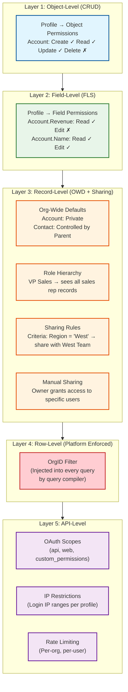
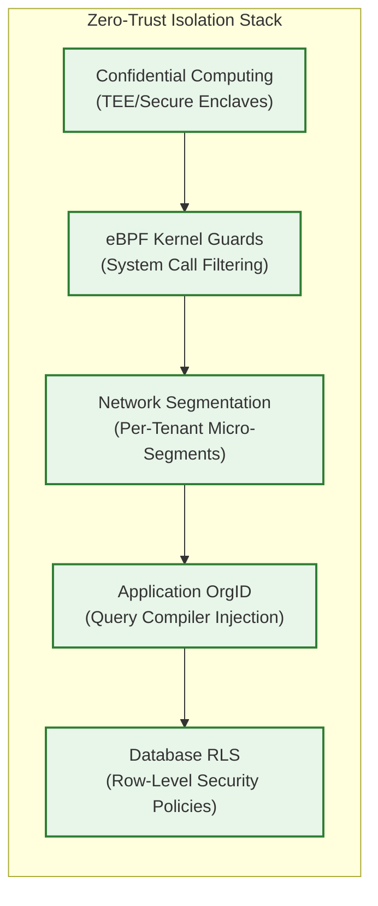
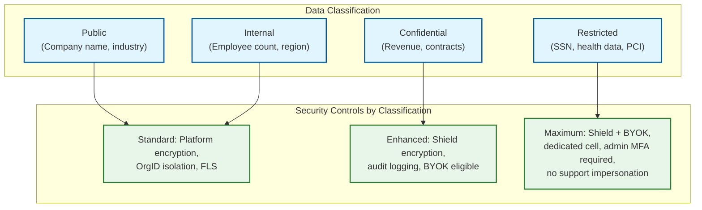

# Security & Compliance

## Authentication & Authorization

### Authentication (AuthN)

**Primary mechanism:** OAuth 2.0 with OpenID Connect (OIDC)

| Flow | Use Case | Token Type |
|------|----------|-----------|
| Authorization Code + PKCE | Web application login | ID Token + Access Token |
| Client Credentials | Server-to-server API integration | Access Token |
| Refresh Token | Session extension without re-login | Refresh Token → new Access Token |
| SAML 2.0 | Enterprise SSO federation | SAML Assertion → platform session |
| Device Flow | CLI tools, IoT integrations | Access Token |

**Token structure (JWT):**

```
{
  "sub": "005xx00000ABC123",          // User ID (18-char polymorphic)
  "org_id": "00Dxx0000001234",        // Tenant organization ID
  "instance_url": "https://na42.platform.example.com",
  "profile_id": "00exx0000001111",    // User profile (determines permissions)
  "roles": ["Sales Manager"],          // Role hierarchy position
  "scopes": ["api", "web", "refresh_token"],
  "iss": "https://login.platform.example.com",
  "exp": 1735689600,                   // 2-hour expiry
  "iat": 1735682400
}
```

**Critical:** The `org_id` claim is the **primary tenant isolation mechanism** at the application layer. Every database query, cache lookup, and resource access is filtered by this claim. It is set at authentication time and cannot be modified by the client.

### Multi-Factor Authentication (MFA)

| Method | Support Level |
|--------|-------------|
| TOTP (Authenticator app) | Required for admin profiles |
| Hardware security key (FIDO2/WebAuthn) | Supported for all users |
| SMS/Email OTP | Supported (not recommended for admins due to SIM-swap risk) |
| Push notification | Supported via mobile app |

**Enforcement:** Org admins can mandate MFA for all users, specific profiles, or specific IP ranges. Platform enforces MFA for all admin operations by default.

### Authorization (AuthZ)

The authorization model has **five layers** that work together:



**Authorization evaluation order:**

1. **OrgID check** -- Is this request for a valid, active org? (platform-level, cannot be bypassed)
2. **Object CRUD** -- Does this user's profile have Create/Read/Update/Delete on this object?
3. **Field-Level Security** -- For each field in the request, does the profile have read/edit access?
4. **Record-Level** -- Org-wide defaults + role hierarchy + sharing rules determine which specific records the user can access
5. **API Scope** -- Does the OAuth token include the required scope for this operation?

### Token Management

| Token Type | Lifetime | Storage | Revocation |
|-----------|----------|---------|------------|
| Access Token (JWT) | 2 hours | Client-side (memory/secure storage) | Short-lived; no explicit revocation needed |
| Refresh Token | 30 days (sliding) | Server-side (encrypted DB) | Explicit revocation via API; invalidated on password change |
| Session Token | 12 hours (configurable per org) | Server-side session store | Logout, admin kill, inactivity timeout |
| API Key | No expiry (manual rotation) | Hashed in DB | Admin revocation; auto-expire if unused for 90 days |

---

## Data Security

### Encryption at Rest

**Two-tier encryption architecture:**

| Tier | What | Method | Key Management |
|------|------|--------|---------------|
| **Platform encryption** | All database storage, backups, logs | AES-256 (volume-level) | Platform-managed keys; rotated quarterly |
| **Shield encryption** (tenant opt-in) | Specific fields (PII, financial data) | AES-256 (field-level) | Per-tenant keys; derived from tenant secret + master secret + random salt |

**Shield encryption key derivation:**

```
Tenant Data Encryption Key (DEK) = KDF(
    master_secret,          // Platform master key (HSM-protected)
    tenant_secret,          // Per-org secret (stored encrypted)
    random_128bit_salt      // Unique per key generation
)
```

**Key hierarchy:**
- **Master Key (KEK):** Stored in Hardware Security Module (HSM); never exported
- **Tenant Key (DEK):** Derived per org; encrypted by KEK; stored in key management service
- **Field encryption:** DEK encrypts/decrypts individual field values at the application layer

### Encryption in Transit

| Path | Protocol | Certificate |
|------|----------|-------------|
| Client → Load Balancer | TLS 1.3 | Public CA certificate; HSTS enforced |
| Load Balancer → App Server | TLS 1.2+ | Internal CA (mTLS in service mesh) |
| App Server → Database | TLS 1.2+ | Internal CA |
| App Server → Cache | TLS 1.2+ (Redis TLS) | Internal CA |
| Cross-cell communication | mTLS | Service mesh certificates (auto-rotated) |
| Backup transfer | TLS 1.3 + client-side encryption | Backup encryption key |

### PII Handling

| Data Category | Storage | Access Control | Retention |
|--------------|---------|---------------|-----------|
| User credentials (passwords) | bcrypt/Argon2 hash; never plaintext | No read access; verify-only | Until account deletion |
| Personal information (name, email) | Shield-encrypted fields (if enabled) | FLS per profile | Per org retention policy |
| Financial data (revenue, payments) | Shield-encrypted; audit-logged | FLS + record-level sharing | Compliance-driven (7-10 years) |
| IP addresses, login history | Platform-encrypted | Admin-only access | 90 days (login history), 30 days (IP) |
| API keys, OAuth tokens | Hashed (keys) or encrypted (tokens) | System-only | Expiry-based |

### Data Masking/Anonymization

| Scenario | Technique |
|----------|-----------|
| Non-admin viewing sensitive field | Field-level security hides the field entirely (not masked) |
| Sandbox/test environment | Automated anonymization: names → random, emails → hash@test.com, numbers → random |
| Analytics export | Aggregation only (no individual records); k-anonymity for demographic data |
| Support access to customer org | Time-limited login link with audit trail; no data export capability |

### Bring Your Own Key (BYOK)

Enterprise tenants can supply their own encryption keys:

1. **Key import:** Tenant generates AES-256 key in their KMS; exports wrapped key to platform
2. **Key usage:** Platform uses tenant's key as the KEK to wrap/unwrap DEKs
3. **Key rotation:** Tenant initiates rotation; platform re-encrypts all DEKs with new KEK (background job)
4. **Key revocation:** Tenant destroys their KEK; platform can no longer decrypt their data (crypto-shredding)
5. **Audit:** All key operations logged to tenant's audit trail

---

## Threat Model

### Top Attack Vectors

| # | Attack Vector | Severity | Description |
|---|--------------|----------|-------------|
| 1 | **Cross-tenant data leak** | Critical | Bug in query compiler or cache allows one org to read another org's data |
| 2 | **Tenant admin privilege escalation** | High | Tenant admin exploits metadata API to gain platform-level access |
| 3 | **API injection via custom fields** | High | Malicious formula/validation rule executes unintended operations |
| 4 | **Authentication bypass** | Critical | Stolen/forged JWT allows access without valid credentials |
| 5 | **Noisy neighbor as DoS** | Medium | Malicious tenant intentionally overwhelms shared resources |

### Mitigations

| Attack | Mitigation |
|--------|------------|
| **Cross-tenant data leak** | OrgID injected by query compiler (not by application code); parameterized queries prevent SQL injection; automated cross-tenant access tests run continuously in production shadow mode; any query without OrgID filter is rejected at the compiler level |
| **Privilege escalation** | Metadata API operations bounded by org scope; no metadata operation can reference or affect another org; platform-level operations require separate admin authentication with hardware MFA |
| **API injection** | Formula engine runs in a sandboxed interpreter with no file system, network, or OS access; validation rules are formula-only (no arbitrary code execution); custom code runs in isolated containers with resource limits |
| **Authentication bypass** | Short-lived JWTs (2 hours); signature verification on every request; token binding to IP range (configurable); refresh token rotation (one-time use); anomaly detection on login patterns |
| **Noisy neighbor DoS** | Governor limits (per-transaction), rate limiting (per-org), connection pool quotas, and cell-level isolation ensure no single tenant can affect others beyond their allocated resources |

### Rate Limiting & DDoS Protection

| Layer | Mechanism | Limits |
|-------|-----------|--------|
| **Edge (CDN/WAF)** | IP-based rate limiting; geographic filtering; bot detection | 10K req/s per IP; block known-bad IPs |
| **API Gateway** | Per-org rate limiting (token bucket) | Varies by tier (100-1000 req/s per org) |
| **Per-user** | Sliding window per user within an org | 20 req/s per user |
| **Per-endpoint** | Endpoint-specific limits | Login: 5/s; Query: 25/s; Bulk: 15K batches/day |
| **Application** | Governor limits | CPU time, query count, DML count per transaction |

---

## Compliance

### Framework Coverage

| Framework | Applicability | Key Requirements | Platform Response |
|-----------|--------------|------------------|-------------------|
| **SOC 2 Type II** | All tenants | Access controls, availability, confidentiality | Annual audit; continuous monitoring; automated evidence collection |
| **GDPR** | EU tenant data | Data residency, right to erasure, consent, DPA | EU-region cells; crypto-shredding on deletion; data export API |
| **HIPAA** | Healthcare tenants | PHI protection, BAA, audit controls | Shield encryption for PHI fields; BAA with platform; access logging |
| **PCI DSS** | Payment data tenants | Cardholder data protection, network segmentation | Dedicated PCI-compliant cell; tokenization; quarterly ASV scans |
| **ISO 27001** | Enterprise tenants | ISMS, risk management | Certified platform; annual re-certification |
| **FedRAMP** | US Government tenants | Government cloud requirements | Dedicated GovCloud cell; authorized personnel only |

### Data Residency

- Each tenant is assigned to a **region** at provisioning time
- Data never leaves the assigned region (enforced by cell architecture)
- Cross-region analytics use aggregated, anonymized data only
- Tenant admin can request region migration (full data transfer with dual-write period)

### Right to Erasure (GDPR Art. 17)

1. **Tenant-level deletion:** Deactivate org → 30-day grace period → hard delete all data from MT_Data, MT_Indexes, MT_History, file storage, search index, cache, backups
2. **User-level deletion:** Remove user record + all PII fields; anonymize audit trail entries (keep action log, remove user identity)
3. **Crypto-shredding:** For Shield-encrypted data, destroying the tenant's encryption key renders all encrypted fields unrecoverable without touching the database

### Audit Trail

| Event | Logged Fields | Retention |
|-------|--------------|-----------|
| Login/Logout | User, IP, timestamp, location, MFA method | 1 year |
| Record CRUD | User, object, record ID, changed fields, old/new values | 2 years (configurable) |
| Metadata change | Admin user, change type, before/after definition | 10 years |
| Permission change | Admin user, profile/role affected, before/after | 10 years |
| API access | User, endpoint, request/response summary, org | 90 days |
| Admin impersonation | Support agent, target user, duration, actions | 10 years |
| Data export | User, query/report, row count, destination | 2 years |

### Tenant Isolation Verification

**Continuous validation (not just at deploy time):**

1. **Automated cross-tenant tests:** Canary requests attempt to access Org-B's data while authenticated as Org-A; any success triggers P0 alert
2. **Query compiler fuzzing:** Random queries with malformed OrgID injections; verify all are rejected
3. **Cache isolation tests:** Verify cache keys are namespaced by OrgID; attempt cross-org cache reads
4. **Penetration testing:** Quarterly external pen-test focused on tenant isolation boundaries
5. **Bug bounty:** Public program with bonus multiplier for cross-tenant vulnerabilities
6. **eBPF-based runtime monitoring:** Kernel-level tracing of all data access paths to detect OrgID bypass attempts in real-time
7. **Chaos injection for isolation:** Deliberately inject cross-tenant requests during testing to verify every layer rejects them

---

## Zero-Trust Multi-Tenancy

Traditional multi-tenancy relies on application-level OrgID filtering. Zero-trust multi-tenancy adds defense layers that operate independently of the application:

### Defense Layers



| Layer | Technology | What It Protects Against |
|-------|-----------|------------------------|
| **Confidential computing** | Trusted Execution Environments (TEEs), secure enclaves | Memory-level data isolation; prevents even platform operators from accessing tenant data in memory |
| **eBPF kernel guards** | Kernel-level system call filtering | Blocks unauthorized file system, network, and memory access at the OS level |
| **Network micro-segmentation** | Service mesh with per-tenant network policies | Prevents lateral movement between tenant workloads at the network layer |
| **Application OrgID** | Query compiler injection (existing) | Ensures every database query is scoped to the authenticated tenant |
| **Database RLS** | Row-level security policies | Database-enforced OrgID filtering as a second line of defense |

### Crypto-Shredding for Tenant Offboarding

When a tenant leaves, crypto-shredding provides mathematically guaranteed data destruction:

```
FUNCTION crypto_shred_tenant(org_id):
    // Step 1: Revoke all active sessions and API keys
    revoke_all_tokens(org_id)

    // Step 2: Destroy the tenant's Data Encryption Key (DEK)
    key_management_service.destroy_key(org_id)
    // All Shield-encrypted fields are now unrecoverable

    // Step 3: Overwrite non-encrypted data
    SCHEDULE background_job:
        DELETE FROM MT_Data WHERE org_id = :org_id    // Batch delete
        DELETE FROM MT_Indexes WHERE org_id = :org_id
        DELETE FROM MT_Objects WHERE org_id = :org_id
        DELETE FROM MT_Fields WHERE org_id = :org_id
        DELETE FROM MT_History WHERE org_id = :org_id
        blob_storage.delete_prefix(org_id + "/")
        search_index.delete_by_org(org_id)

    // Step 4: Purge from backups (rolling, over backup retention window)
    SCHEDULE backup_purge_job(org_id, retention_days=30)

    // Step 5: Issue deletion certificate
    GENERATE compliance_certificate(org_id, deletion_timestamp, method="crypto_shred")
```

**Time to full erasure:** Shield-encrypted data is instantly unrecoverable (key destroyed). Non-encrypted data is purged within 24 hours from live systems. Backup purge completes within the backup retention window (30 days).

---

## Security Operations

### Incident Response for Cross-Tenant Breach

| Phase | Actions | SLA |
|-------|---------|-----|
| **Detection** | Canary test alerts, anomaly detection, log correlation | < 5 minutes |
| **Containment** | Isolate affected cell, block affected org's API access, preserve forensic data | < 15 minutes |
| **Assessment** | Determine scope (which orgs, which records, which time window) | < 1 hour |
| **Notification** | Notify affected tenants per contractual and regulatory requirements | < 24 hours (GDPR: 72h) |
| **Remediation** | Patch vulnerability, deploy fix, run full isolation verification suite | < 48 hours |
| **Post-mortem** | Root cause analysis, prevention measures, public transparency report | < 7 days |

### Session Security Controls

| Control | Implementation | Purpose |
|---------|---------------|---------|
| **Session fixation prevention** | Regenerate session ID after authentication | Prevent session hijacking |
| **Concurrent session limiting** | Max 5 active sessions per user (configurable per org) | Reduce attack surface |
| **Session binding** | Bind session to IP range + user agent fingerprint | Detect stolen sessions |
| **Admin session isolation** | Separate session store for admin operations, shorter TTL (30 min) | Protect high-privilege operations |
| **Impersonation audit** | Support agents get time-limited, read-only access with full audit trail | Protect customer data during support |

---

## Compliance Automation

### Compliance-as-Code Framework

| Compliance Requirement | Automated Enforcement | Verification |
|-----------------------|----------------------|-------------|
| **GDPR Right to Erasure** | Crypto-shredding + automated data purge pipeline | Deletion certificate generated with cryptographic proof |
| **GDPR Data Portability** | Export API generates portable JSON/CSV with full metadata | Automated monthly test: export tenant, import to fresh org, verify parity |
| **SOC 2 Access Controls** | RBAC enforced at 5 layers; changes auto-logged | Continuous compliance: daily automated evidence collection |
| **HIPAA Audit Trail** | All PHI field access logged with immutable append-only storage | Quarterly audit report auto-generated from log store |
| **PCI DSS Network Segmentation** | PCI tenants on dedicated cells with firewall rules | Automated network scan: verify no cross-cell traffic paths |
| **EU Data Act (2025)** | Data portability API + switching assistance tooling | Annual portability test: verify export completeness |
| **AI Act (2026)** | Per-tenant AI model provenance tracking; inference audit logs | Automated bias testing on per-tenant model outputs |

### Data Classification and Handling



### Supply Chain Security for Tenant Extensions

| Risk | Control |
|------|---------|
| Malicious custom code (tenant-authored triggers) | Sandboxed execution: no filesystem, no network, limited CPU/memory via governor limits |
| Third-party package vulnerabilities | No third-party packages in tenant code; platform provides curated SDK only |
| Data exfiltration via external callouts | Callout allowlist per org; rate-limited; logged; admin-approved destinations only |
| Privilege escalation via metadata API | Metadata API scoped to org; cannot reference other orgs; platform APIs require separate auth |
