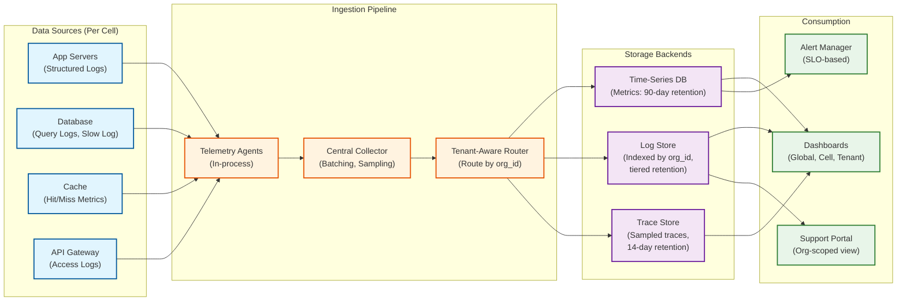

# Observability

The observability strategy for a multi-tenant platform requires **tenant-aware instrumentation** at every layer. Every metric, log, and trace must carry the `org_id` dimension so operators can diagnose issues for a specific tenant without sifting through data from thousands of orgs.

---

## Metrics (USE/RED)

### Key Metrics

| Category | Metric | Dimensions | Alert Threshold |
|----------|--------|-----------|-----------------|
| **Request Rate** | `api.requests.total` | org_id, endpoint, method, status | N/A (informational) |
| **Error Rate** | `api.errors.total` | org_id, endpoint, error_code | > 1% per org for 5 min |
| **Latency** | `api.latency.p99` | org_id, endpoint | > 200ms (CRUD), > 500ms (query) |
| **Governor Hits** | `governor.limit.exceeded` | org_id, limit_type | > 50 per org per hour |
| **Query Performance** | `query.compilation.time` | org_id, object_type | > 50ms p99 |
| **Metadata Cache** | `metadata.cache.hit_rate` | cell_id | < 90% |
| **Metadata Cache** | `metadata.cache.miss_storm` | org_id | > 100 misses in 10s |
| **DB Connections** | `db.connections.active` | cell_id, org_tier | > 80% of pool capacity |
| **DB Connections** | `db.connections.waiting` | cell_id | > 0 for 30s |
| **Replication Lag** | `db.replication.lag_ms` | cell_id, replica_id | > 1000ms |
| **Tenant Storage** | `tenant.storage.used_bytes` | org_id | > 90% of quota |
| **Bulk API** | `bulk.job.queue_depth` | cell_id | > 1000 pending jobs |
| **Cell Health** | `cell.health.score` | cell_id | < 0.8 (composite score) |

### USE Metrics (Per Cell)

| Resource | Utilization | Saturation | Errors |
|----------|-------------|------------|--------|
| **CPU** | `cpu.utilization` (%) | `cpu.throttle.count` | N/A |
| **Memory** | `memory.used` / `memory.total` | `memory.swap.used` | OOM kills |
| **Disk I/O** | `disk.io.utilization` | `disk.io.queue_depth` | Disk errors |
| **Network** | `network.bandwidth.used` | `network.connections.dropped` | TCP errors |
| **DB Connections** | `db.pool.active` / `db.pool.max` | `db.pool.wait_queue` | Connection timeouts |

### RED Metrics (Per Tenant)

| Signal | Metric | Per-Org Tracking |
|--------|--------|-----------------|
| **Rate** | Requests per second | Yes (per org, per endpoint) |
| **Error** | Error percentage | Yes (5xx per org) |
| **Duration** | p50, p95, p99 latency | Yes (per org, per endpoint) |

### Dashboard Design

**Global Dashboard (Platform Operations):**
- Total QPS across all cells (real-time)
- Error rate heatmap by cell
- Top 10 orgs by QPS (identify hot tenants)
- Governor limit violations by type (bar chart, last 24h)
- Cell health scores (traffic light per cell)
- Database replication lag (per cell)

**Per-Cell Dashboard:**
- QPS breakdown by org tier (Enterprise/Professional/Basic)
- p99 latency trend (1-hour, 24-hour, 7-day)
- Connection pool utilization (gauge)
- Cache hit rate (line chart)
- Active bulk API jobs (count)
- Top 5 slowest queries (table with org, query, time)

**Per-Tenant Dashboard (for tenant admins):**
- API usage vs. daily limit (gauge)
- Governor limit consumption (last 24h)
- Storage usage vs. quota
- Active users (last 7 days)
- Error rate (last 24h)

### Alerting Thresholds

| Alert | Condition | Severity | Action |
|-------|-----------|----------|--------|
| **Cell p99 > SLO** | p99 latency > 200ms for 15 min | P2 | Investigate hot tenant; consider scaling |
| **Per-Org error spike** | > 5% errors for an org for 5 min | P3 | Check org-specific issues (governor, data) |
| **DB replication lag** | > 5s for 2 min | P1 | Investigate primary load; failover readiness |
| **Connection pool exhausted** | 0 available connections for 30s | P1 | Kill idle connections; scale; identify hog |
| **Cross-tenant access detected** | Any cross-org data access in canary test | P0 | Immediate investigation; potential incident |
| **Metadata cache miss storm** | > 1000 cache misses in 1 min for a cell | P2 | Warm cache; check for metadata thrashing |
| **Governor abuse pattern** | Org hitting governor limits > 500 times/day | P3 | Contact org admin; review their automation |
| **Cell capacity** | Org count > 1800 or QPS > 80% capacity | P3 | Plan cell split or tenant migration |
| **Storage quota approaching** | Org at > 90% storage | P4 | Notify org admin; auto-archive if enabled |

---

## Logging

### What to Log

| Event Category | Log Level | Fields | Volume |
|---------------|-----------|--------|--------|
| **API request/response** | INFO | request_id, org_id, user_id, endpoint, method, status, latency_ms | Every request |
| **Query execution** | DEBUG | org_id, virtual_query, physical_sql, rows_returned, execution_ms | Sampled (10% or on slow query) |
| **Governor limit check** | WARN (on approach) | org_id, limit_type, current_value, limit_value | When > 80% of limit |
| **Governor limit exceeded** | ERROR | org_id, user_id, limit_type, transaction_id | Every violation |
| **Authentication** | INFO | user_id, org_id, auth_method, ip, success/failure, mfa_used | Every attempt |
| **Metadata change** | INFO | admin_user_id, org_id, change_type, object, field, before/after | Every change |
| **Cache invalidation** | DEBUG | org_id, cache_key, invalidation_source, version | Every invalidation |
| **Database failover** | CRITICAL | cell_id, old_primary, new_primary, failover_duration_ms | Every failover |
| **Tenant lifecycle** | INFO | org_id, event (provision, suspend, activate, delete) | Every lifecycle event |
| **Bulk API job** | INFO | org_id, job_id, operation, records_total, records_processed, errors | Start, progress, completion |

### Log Levels Strategy

| Level | Usage | Retention |
|-------|-------|-----------|
| **CRITICAL** | Platform-wide failures (DB down, cell failure, cross-tenant leak) | 1 year |
| **ERROR** | Request failures, governor violations, data integrity issues | 90 days |
| **WARN** | Approaching limits, slow queries, deprecation usage | 30 days |
| **INFO** | Normal operations, API calls, lifecycle events | 14 days |
| **DEBUG** | Query details, cache operations, metadata resolution | 3 days (sampled) |

### Structured Logging Format

```
{
  "timestamp": "2026-03-08T14:30:00.123Z",
  "level": "WARN",
  "service": "query-engine",
  "cell_id": "cell-us-east-1a",
  "instance_id": "app-server-042",

  "org_id": "00Dxx0000001234",
  "user_id": "005xx00000ABC123",
  "request_id": "req-7f3a8b2c",
  "trace_id": "trace-4d5e6f7g",
  "span_id": "span-8h9i0j1k",

  "event": "governor.limit.approaching",
  "details": {
    "limit_type": "SOQL_QUERIES",
    "current": 85,
    "limit": 100,
    "transaction_id": "txn-2l3m4n5o"
  },

  "context": {
    "endpoint": "/api/v1/query",
    "method": "GET",
    "object": "Account",
    "latency_ms": 145
  }
}
```

**Critical rule:** `org_id` and `request_id` appear in **every** log entry. This enables:
- Filtering all logs for a specific tenant (support investigation)
- Correlating all logs for a single request (distributed tracing)
- Ensuring log access controls (support agents only see logs for orgs they're authorized to access)

---

## Distributed Tracing

### Trace Propagation Strategy

**Context propagation:** W3C Trace Context (`traceparent` / `tracestate` headers) propagated through all layers:

```
Client → API Gateway → Tenant Router → Metadata Engine → Query Compiler → Database
         ↘ Rate Limiter                ↘ Validation Engine
                                       ↘ Workflow Engine → Message Queue → Async Worker
```

**Trace context enrichment:** At each hop, the trace is enriched with:
- `org_id` (set at API Gateway after auth)
- `cell_id` (set at Tenant Router)
- `operation_type` (CRUD, query, bulk, metadata)
- `governor_usage` (snapshot of governor counters at this point)

### Key Spans to Instrument

| Span Name | Parent | Duration Significance |
|-----------|--------|----------------------|
| `api.request` | Root | Total request time (SLO measurement) |
| `auth.validate_token` | api.request | JWT validation + permission resolution |
| `tenant.route` | api.request | Tenant registry lookup + cell routing |
| `metadata.resolve` | api.request | Metadata cache lookup or DB fetch |
| `metadata.cache_fetch` | metadata.resolve | L2 cache (Redis) lookup time |
| `metadata.db_fetch` | metadata.resolve | L3 database fetch (on cache miss) |
| `query.compile` | api.request | Virtual → physical SQL translation |
| `query.execute` | api.request | Physical SQL execution on database |
| `index.lookup` | query.execute | MT_Indexes scan for filtered queries |
| `governor.check` | query.execute | Governor limit enforcement |
| `validation.evaluate` | api.request | Validation rule formula evaluation |
| `workflow.execute` | api.request | Post-save workflow rule execution |
| `formula.evaluate` | query.compile | Formula field computation |
| `cache.invalidate` | metadata.resolve | Pub/sub cache invalidation propagation |

### Sampling Strategy

| Traffic Type | Sampling Rate | Justification |
|-------------|---------------|---------------|
| Normal requests | 1% | Volume is too high for 100%; statistical significance at 1% |
| Slow requests (> p95) | 100% | Every slow request is interesting for optimization |
| Error responses (4xx, 5xx) | 100% | Every error needs root-cause traceability |
| Governor limit violations | 100% | Critical for understanding tenant behavior |
| Metadata changes | 100% | Low volume, high impact |
| Cross-tenant canary tests | 100% | Security-critical; always trace |

---

## Alerting

### Critical Alerts (Page-Worthy, P0/P1)

| Alert | Condition | Notification | Runbook |
|-------|-----------|-------------|---------|
| **Cross-tenant data access** | Canary test detects cross-org read | Immediate page + incident channel | Isolate affected cell; investigate query compiler; check cache isolation |
| **Cell down** | All health checks for a cell fail for 60s | Page on-call; auto-failover triggered | Verify failover cell is serving; investigate root cause; plan recovery |
| **Database primary failure** | Primary unreachable for 15s | Page DBA on-call; auto-failover | Verify replica promotion; check data integrity; plan replacement |
| **Connection pool exhausted** | 0 available connections for cell for 30s | Page on-call | Kill idle connections; identify consuming org; scale if needed |

### Warning Alerts (P2/P3)

| Alert | Condition | Notification | Action |
|-------|-----------|-------------|--------|
| **p99 latency degradation** | p99 > 200ms for 15 min (cell-level) | Slack channel + ticket | Identify slow queries; check cache hit rate; scale if needed |
| **Governor limit abuse** | Org exceeds governor > 500 times/day | Ticket + org admin notification | Review org's automation; suggest optimization; consider tier upgrade |
| **Replication lag** | > 5s for 2 min | Slack channel | Check primary write load; investigate network; prepare for failover |
| **Cache hit rate drop** | < 90% for 10 min | Slack channel | Check for metadata thrashing; warm cache; investigate eviction |
| **Storage approaching quota** | Org at > 90% storage quota | Email to org admin | Suggest data archival; offer storage upgrade |

### Runbook References

| Scenario | Runbook |
|----------|---------|
| Cell failover | `runbooks/cell-failover.md` -- Steps: verify health, update tenant registry, monitor failover cell, plan recovery |
| Database failover | `runbooks/db-failover.md` -- Steps: verify replica promotion, check replication lag at failover, validate data integrity |
| Hot tenant mitigation | `runbooks/hot-tenant.md` -- Steps: identify org, check governor usage, apply temporary throttle, contact org admin |
| Metadata cache storm | `runbooks/cache-storm.md` -- Steps: identify affected orgs, warm cache manually, check for metadata thrashing pattern |
| Cross-tenant incident | `runbooks/cross-tenant-incident.md` -- Steps: ISOLATE cell immediately, engage security team, preserve evidence, notify affected orgs |

---

## Tenant-Specific Observability

### Tenant Health Score

A composite metric that summarizes each tenant's operational health:

```
tenant_health_score = weighted_average(
    api_error_rate_score     * 0.3,    // 0 = 10%+ errors, 1 = < 0.1%
    latency_score            * 0.25,   // 0 = p99 > 1s, 1 = p99 < 100ms
    governor_compliance      * 0.2,    // 0 = hitting limits constantly, 1 = never
    storage_utilization      * 0.15,   // 0 = > 95%, 1 = < 50%
    api_quota_utilization    * 0.1     // 0 = > 95% daily, 1 = < 50%
)
```

**Usage:**
- Score < 0.5: Proactively contact org admin; potential issues
- Score 0.5-0.8: Monitor closely; suggest optimizations
- Score > 0.8: Healthy tenant; no action needed

### Support Agent View

When a support agent investigates a tenant issue, they see:
1. **Last 24h health score trend** (line chart)
2. **Recent errors** (top 5 error codes with count)
3. **Governor limit violations** (timeline)
4. **Active users** (count, last login times)
5. **Recent metadata changes** (could explain behavior changes)
6. **Inflight async jobs** (bulk API, reports)

All filtered by `org_id` with access controls ensuring the agent is authorized for that tenant.

---

## SLO Tracking & Error Budgets

### Per-Tenant SLO Framework

Each tenant's SLA tier determines their SLO targets:

| SLO | Enterprise Target | Professional Target | Basic Target |
|-----|------------------|--------------------|--------------|
| Availability | 99.99% | 99.95% | 99.9% |
| CRUD p99 latency | < 150ms | < 200ms | < 300ms |
| Query p99 latency | < 400ms | < 500ms | < 800ms |
| Error rate (5xx) | < 0.05% | < 0.1% | < 0.5% |
| Metadata sync | < 50ms | < 100ms | < 200ms |

### Error Budget Calculation

```
FUNCTION calculate_error_budget(org_id, slo_target, window_days):
    // Example: 99.99% availability over 30 days
    total_minutes = window_days * 24 * 60                // 43,200 min
    allowed_downtime = total_minutes * (1 - slo_target)  // 4.32 min

    actual_downtime = query_metrics(
        "sum(duration) WHERE org_id = :org_id AND status = 'unavailable'",
        window=window_days
    )

    budget_remaining = allowed_downtime - actual_downtime
    budget_percentage = budget_remaining / allowed_downtime * 100

    IF budget_percentage < 20%:
        ALERT("Error budget critically low for org " + org_id)
        FREEZE_DEPLOYMENTS(cell_of(org_id))  // No deploys until budget recovers

    RETURN {
        budget_total: allowed_downtime,
        budget_consumed: actual_downtime,
        budget_remaining: budget_remaining,
        budget_pct: budget_percentage
    }
```

### SLO Burn Rate Alerting

| Burn Rate | Window | Meaning | Action |
|-----------|--------|---------|--------|
| 14.4x | 1 hour | Consuming 2% of monthly budget in 1 hour | Page immediately |
| 6x | 6 hours | Consuming 6% of monthly budget in 6 hours | Page during business hours |
| 3x | 1 day | On track to exhaust budget in 10 days | Create ticket, investigate |
| 1x | 3 days | Consuming budget at expected rate | Monitor, no action |

---

## Observability Pipeline Architecture



### Cardinality Management

Multi-tenant observability faces a unique cardinality explosion: every metric multiplied by 10K+ org_ids. Strategies:

| Strategy | Implementation | Cardinality Reduction |
|----------|---------------|----------------------|
| **Top-K aggregation** | Only track per-org metrics for top 100 active orgs; aggregate rest as "other" | 99% reduction |
| **Tiered resolution** | Enterprise orgs: 10s granularity. Basic orgs: 60s granularity | 6x reduction |
| **On-demand materialization** | Store raw events; materialize per-org dashboards only when accessed | Pay-per-view model |
| **Label allowlisting** | Only allow org_id dimension on critical metrics (latency, errors); aggregate the rest | 10x reduction |
| **Histogram bucketing** | Use fixed histogram buckets for latency instead of per-org quantile tracking | Bounded cardinality |

### Anomaly Detection for Tenant Behavior

```
FUNCTION detect_tenant_anomalies(org_id, window_minutes=60):
    current_metrics = {
        qps: avg_qps(org_id, window_minutes),
        error_rate: error_rate(org_id, window_minutes),
        avg_latency: p50_latency(org_id, window_minutes),
        governor_hits: governor_violations(org_id, window_minutes)
    }

    // Compare against tenant's own baseline (last 7 days, same hour)
    baseline = get_baseline(org_id, day_of_week=TODAY, hour=NOW.hour)

    anomalies = []
    FOR EACH metric, value IN current_metrics:
        z_score = (value - baseline[metric].mean) / baseline[metric].stddev
        IF abs(z_score) > 3.0:  // 3-sigma deviation
            anomalies.APPEND({metric, value, z_score, baseline: baseline[metric]})

    IF anomalies.length > 0:
        classify_anomaly(org_id, anomalies)
        // Possible causes: traffic spike, code deployment, data import, attack

    RETURN anomalies
```

---

## Cost Observability (FinOps Integration)

### Per-Tenant Cost Metrics

| Metric | Source | Granularity | Dashboard |
|--------|--------|------------|-----------|
| `tenant.compute.cpu_seconds` | Governor context CPU tracking | Per-request, aggregated hourly | Platform operations |
| `tenant.storage.data_bytes` | Periodic org-level `SELECT SUM(pg_total_relation_size)` | Daily snapshot | Capacity planning |
| `tenant.storage.file_bytes` | Blob storage prefix listing | Daily | Capacity planning |
| `tenant.network.egress_bytes` | API gateway byte counters | Per-request | Cost attribution |
| `tenant.queries.total` | Query engine counter | Per-request | Performance + cost |
| `tenant.search.queries` | Search proxy counter | Per-request | Search cost attribution |
| `tenant.cost.estimated_monthly` | Computed from above metrics + unit costs | Daily rollup | Business intelligence |

### Capacity Forecasting

```
FUNCTION forecast_cell_capacity(cell_id, horizon_days=90):
    // Collect historical metrics (last 180 days)
    history = query_tsdb("cell.resource.utilization", cell_id, days=180)

    // Fit linear regression per resource
    forecasts = {}
    FOR EACH resource IN [cpu, memory, storage, connections, iops]:
        trend = linear_regression(history[resource])
        forecast = trend.predict(days_ahead=horizon_days)
        forecasts[resource] = {
            current: history[resource].latest,
            predicted: forecast.value,
            days_to_threshold: (threshold[resource] - history[resource].latest) / trend.slope,
            confidence: forecast.confidence_interval_95
        }

    // Find the binding constraint
    binding_resource = MIN(forecasts, key=lambda f: f.days_to_threshold)

    IF binding_resource.days_to_threshold < 30:
        ALERT("Cell " + cell_id + " will exhaust " + binding_resource.name
              + " in " + binding_resource.days_to_threshold + " days")
        RECOMMEND("Plan cell split or tenant migration")

    RETURN forecasts
```

### Observability Cost Management

Multi-tenant observability generates enormous data volumes. Cost controls:

| Strategy | Implementation | Cost Savings |
|----------|---------------|-------------|
| **Log sampling** | Sample DEBUG logs at 10%; retain all ERROR+ | ~70% log storage reduction |
| **Metric aggregation** | Pre-aggregate per-org metrics to 60s resolution after 7 days | ~85% TSDB storage reduction |
| **Trace sampling** | 1% normal, 100% errors/slow | ~90% trace storage reduction |
| **Tiered retention** | Hot (7d) → Warm (30d) → Cold (90d) → Archive (1yr) | ~60% overall cost reduction |
| **Per-org log budgets** | Basic tier: 1GB/day logs. Enterprise: 10GB/day | Prevents log flooding from misconfigured orgs |
