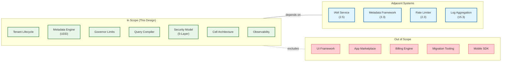

# Interview Guide

## Interview Pacing (45-min Format)

| Time | Phase | Focus | What to Cover |
|------|-------|-------|---------------|
| 0-5 min | **Clarify** | Scope the problem | How many tenants? Customization depth? SaaS or PaaS? Isolation requirements? |
| 5-10 min | **Requirements** | Nail down constraints | Read:write ratio, latency targets, consistency model, multi-region? |
| 10-20 min | **High-Level** | Architecture + data model | Cell-based architecture, metadata-driven schema, pivoted data model, tenant routing |
| 20-32 min | **Deep Dive** | 2 critical areas | Pick: (1) metadata engine + query compilation, (2) governor limits + noisy neighbor |
| 32-40 min | **Scale & Trade-offs** | Bottlenecks, failures | EAV performance trade-offs, cell splitting, cross-tenant isolation guarantees |
| 40-45 min | **Wrap Up** | Summary + follow-ups | Security model (5-layer auth), operational concerns, what you'd add with more time |

---

## Meta-Commentary

### What Makes This System Unique/Challenging

1. **The Schema Virtualization Problem:** Unlike most systems where the schema is known at compile time, a multi-tenant SaaS must handle schemas that are defined at runtime by each tenant. The pivoted data model (EAV) solves this but introduces query performance challenges that require typed index tables.

2. **The Isolation Paradox:** You must share everything (for cost efficiency) while guaranteeing nothing leaks (for security). This requires defense-in-depth: OrgID in every query, governor limits, connection pool quotas, cell-based deployment.

3. **The Customization vs. Performance Trade-off:** Every feature that enables customization (custom fields, formula fields, workflow rules) adds overhead to every operation. Formula fields must be evaluated at query time. Validation rules execute on every save. This is fundamentally different from a single-tenant app where you can optimize for known workloads.

4. **The Governor Limits as Architecture:** Governor limits aren't just rate limiting -- they're a fundamental architectural pattern that shapes how developers build on the platform. They force efficient patterns and prevent abuse at the transaction level.

### Where to Spend Most Time

**Priority 1:** The metadata-driven data model (UDD/pivoted approach) -- this is the core innovation and the most common deep-dive question.

**Priority 2:** Noisy neighbor isolation -- how you prevent one tenant from affecting others across all layers (API, app, DB, infra).

**Priority 3:** Cell-based scaling -- how you grow from 1 cell to 100 cells without downtime, and how tenant migration works.

---

## Trade-offs Discussion

| Decision | Option A | Option B | Recommendation |
|----------|----------|----------|----------------|
| **Data Model** | **Pivoted/EAV** (Salesforce) | **Schema-per-tenant** (ServiceNow) | **Pivoted at scale** |
| | Pros: Instant provisioning, infinite customization, single DB to manage, 8K+ orgs/instance | Pros: Native SQL performance, simpler queries, true schema isolation | Use EAV for 1K+ tenants. Schema-per-tenant viable for < 500 tenants or regulated industries requiring physical isolation |
| | Cons: Complex query compilation, VARCHAR storage overhead, requires typed index tables | Cons: DDL overhead (migrations across N schemas), provisioning takes seconds not milliseconds, harder to manage at scale | |
| **Isolation Model** | **Shared schema + governor limits** | **Database-per-tenant** | **Shared schema for most; dedicated for enterprise** |
| | Pros: Maximum resource efficiency, simpler operations | Pros: Strongest isolation, per-tenant backup/restore, no noisy neighbor | Hybrid: shared for 95% of tenants; dedicated cell for enterprise customers paying premium |
| | Cons: Noisy neighbor risk, complex isolation enforcement | Cons: High cost (N databases), slow provisioning, operational overhead | |
| **Cell Size** | **Large cells (5K+ orgs)** | **Small cells (500 orgs)** | **Medium cells (1-2K orgs)** |
| | Pros: Better resource utilization, fewer cells to manage | Pros: Smallest blast radius, easiest to scale | Balance: enough orgs for utilization, small enough for containment |
| | Cons: Larger blast radius, harder to scale individual components | Cons: More cells to manage, higher infrastructure cost | |
| **Metadata Caching** | **Eager loading (all metadata at startup)** | **Lazy loading (on first access)** | **Hybrid: eager for top orgs, lazy for rest** |
| | Pros: No cold-start latency, predictable performance | Pros: Lower memory usage, faster startup | Pre-load top 500 active orgs; lazy-load the rest |
| | Cons: High memory usage, slow startup (loading all orgs' metadata) | Cons: Cold-start latency spikes, cache stampede risk | |
| **Formula Evaluation** | **Query-time evaluation** | **Write-time materialization** | **Query-time for reads, materialized for heavy formulas** |
| | Pros: Always fresh, no storage overhead | Pros: Fast reads, pre-computed | Query-time is correct default; offer "deterministic formula indexing" for heavy formulas |
| | Cons: Adds latency to every query with formula fields | Cons: Stale data risk, storage overhead, complex invalidation | |
| **Tenant Routing** | **Subdomain-based** (`acme.app.com`) | **Header-based** (`X-Org-ID`) | **Both: subdomain for web, header for API** |
| | Pros: Simple, human-readable, CDN-friendly | Pros: Flexible, supports multi-tenant client apps | Web users prefer subdomains; API integrations prefer headers |
| | Cons: Exposes tenant identity in URL, DNS management | Cons: Requires trusted client, less intuitive | |

---

## Trap Questions & How to Handle

| Trap Question | What Interviewer Wants | Best Answer |
|---------------|------------------------|-------------|
| **"Why not just use a separate database per tenant?"** | Understand scale trade-offs | "Database-per-tenant gives the strongest isolation and is the right choice for regulated industries or < 500 tenants. But at 10K+ tenants, managing 10K databases (schema migrations, backups, monitoring, connection pools) becomes operationally unmanageable. The pivoted model with a single shared DB trades query complexity for operational simplicity. We can offer dedicated databases as a premium tier for enterprise customers who need it." |
| **"How do you prevent a tenant from reading another tenant's data?"** | Test security-in-depth thinking | "Defense in depth: (1) OrgID is injected by the query compiler -- not by application code, so developers can't forget it. (2) Every query is parameterized to prevent SQL injection. (3) Cache keys are namespaced by OrgID. (4) Automated canary tests continuously attempt cross-tenant access in production and alert on any success. (5) Bug bounty program with bonus multiplier for cross-tenant vulnerabilities." |
| **"What happens when a tenant's custom code has an infinite loop?"** | Test governor limits understanding | "Governor limits enforce a CPU time cap per transaction (10 seconds for sync, 60 seconds for async). The runtime monitors wall-clock time and aborts the transaction with an unhandleable exception if exceeded. The transaction rolls back, protecting other tenants. The org admin sees the error in their debug logs. Additionally, we track governor violations per org -- repeated abuse triggers alerts to our customer success team." |
| **"How do you handle schema migrations when the schema is virtual?"** | Test metadata understanding | "There are no traditional schema migrations because schema changes are metadata operations. Adding a custom field is an INSERT into MT_Fields, not an ALTER TABLE. This means: no downtime, no DDL locks, no migration scripts. The only 'migration' is when the *platform itself* evolves -- adding a new system capability. That's a standard code deployment with backward-compatible metadata extensions." |
| **"How does the EAV model handle queries with JOINs?"** | Test awareness of EAV limitations | "JOINs in the EAV model go through the MT_Relationships table, which stores (parent_guid, child_guid) pairs with bidirectional indexes. The query compiler translates virtual relationship traversals into physical JOINs on this table. Performance is acceptable for 2-3 level joins but degrades for deeper traversals. For reporting use cases requiring complex joins, we materialize 'skinny tables' with real typed columns for the most queried objects, or route to a separate analytical store." |
| **"What if a single tenant generates 80% of your traffic?"** | Test noisy neighbor handling | "This is the 'whale tenant' problem. Layered defense: (1) Governor limits cap per-transaction resource usage. (2) Per-org rate limiting caps QPS. (3) Connection pool quotas prevent monopolization. (4) If the tenant consistently exceeds these bounds, we migrate them to a dedicated cell (cell-of-one) where they get all resources to themselves. The key insight is that this should be a commercial decision -- they're paying for a tier that matches their usage." |
| **"How do you deploy updates without downtime to 10K tenants?"** | Test cell-based deployment | "Cell-based architecture enables canary deployments: roll the update to Cell-1 first, monitor for 30 minutes, then progressively roll to more cells. If Cell-1 shows errors, we roll back just that cell. Since tenants are pinned to cells, the blast radius is limited to ~2K orgs. Within a cell, we use blue-green deployment: spin up new app servers with the new version, shift traffic gradually (10% → 50% → 100%), drain old servers." |

---

## Common Mistakes to Avoid

| Mistake | Why It's Wrong | Correct Approach |
|---------|---------------|-----------------|
| **Jumping to "schema-per-tenant"** | Doesn't scale past ~500 tenants; ignores the metadata-driven innovation | Start with trade-offs analysis; explain why EAV/pivoted model wins at scale |
| **Forgetting OrgID isolation** | Cross-tenant data leak is the #1 security risk | Emphasize OrgID injection at the query compiler level; not application-level WHERE clauses |
| **Ignoring governor limits** | Without them, multi-tenancy is a noisy-neighbor nightmare | Governor limits are architectural, not optional; discuss per-transaction and per-org limits |
| **Over-engineering day-1** | Starting with 100 cells, multi-region, BYOK encryption | Start with 1 cell, 1 region. Add complexity as scale demands |
| **Treating it as a CRUD app** | Missing the customization engine complexity | Discuss metadata engine, formula evaluation, validation rules, workflow orchestration |
| **Not discussing cell architecture** | Scaling a single shared instance has hard limits | Cells are how you go from 1K to 100K tenants with fault isolation |
| **Ignoring the security model** | Multi-tenancy without security is a liability | Discuss the 5-layer auth model (org, object, field, record, API) |

---

## Follow-Up Deep Dives (If Time Permits)

### Deep Dive: Tenant Migration (Live)

A critical operational scenario interviewers love to explore:

```
Phase 1: Preparation (hours before)
├── Lower DNS TTL for source cell (300s → 30s)
├── Create target cell resources (DB, cache, queue)
├── Begin async data copy: MT_Data, MT_Indexes, MT_Objects, MT_Fields
└── Track copy progress via watermark (last_modified_at)

Phase 2: Dual-Write (minutes)
├── Enable write-forwarding: source cell writes replicated to target
├── Continue catching up on delta (records modified since copy started)
├── Verify record counts match (source vs target)
└── Run integrity checks (checksum on sample records)

Phase 3: Cutover (seconds)
├── Pause incoming requests for this org (queue at gateway, ~2s)
├── Flush final writes from source → target
├── Update tenant registry: org → new cell
├── Resume requests (now routed to target cell)
└── Invalidate all caches for this org on source cell

Phase 4: Cleanup (hours after)
├── Keep source data for 7 days (rollback safety net)
├── Monitor target cell for errors/latency for this org
├── Delete source data after grace period
└── Update DNS TTL back to normal
```

**Key trade-off:** Dual-write duration. Shorter = less inconsistency risk but more chance of data loss. Longer = safer but more operational overhead. Typical: 5-15 minutes of dual-write.

### Deep Dive: Formula Engine Internals

```
Input: "IF(Revenue > 1000000, Revenue * 0.15, Revenue * 0.05)"

Step 1: Parse → AST
        IF
       / | \
      >  *   *
     /\ /\ / \
   Rev 1M Rev 0.15 Rev 0.05

Step 2: Type-check
  - Revenue: NUMBER (from metadata) ✓
  - 1000000: NUMBER literal ✓
  - Return type: NUMBER ✓

Step 3: Compile → bytecode (stack-based)
  LOAD_FIELD Revenue          // Push Revenue value
  PUSH_CONST 1000000          // Push 1M
  COMPARE_GT                  // Pop 2, push boolean
  JUMP_IF_FALSE label_else    // Conditional branch
  LOAD_FIELD Revenue          // True branch: Revenue * 0.15
  PUSH_CONST 0.15
  MULTIPLY
  JUMP label_end
  label_else:
  LOAD_FIELD Revenue          // False branch: Revenue * 0.05
  PUSH_CONST 0.05
  MULTIPLY
  label_end:
  RETURN                      // Result on top of stack

Step 4: Cache compiled bytecode (per org + formula field)
Step 5: Evaluate at query time using stack interpreter
```

**Governor constraint:** Formula evaluation counts toward CPU time limit (10s sync). Deeply nested formulas (formula referencing formula referencing formula) can exhaust CPU. Max formula dependency depth: 10 levels.

### Deep Dive: Sandbox Architecture

Sandboxes are org copies used for testing customizations:

| Sandbox Type | Data Copied | Metadata Copied | Refresh Frequency | Use Case |
|-------------|-------------|-----------------|-------------------|----------|
| **Developer** | None (empty) | Full | Unlimited | Code/config testing |
| **Developer Pro** | None | Full + larger limits | Unlimited | Integration testing |
| **Partial** | Sampled subset (template-defined) | Full | 5-day minimum | UAT with realistic data |
| **Full** | Complete org data copy | Full | 29-day minimum | Production mirror |

**Implementation:** Sandboxes are regular orgs in the same cell with a `sandbox_source_org_id` pointer. Metadata copy is an INSERT/SELECT on MT_Objects + MT_Fields. Full data copy runs as an async background job with progress tracking. Sandbox orgs have restricted governor limits and cannot send external emails.

---

## Architecture Comparison Matrix

| Dimension | Salesforce Model | ServiceNow Model | Workday Model | Shopify Model |
|-----------|-----------------|-------------------|---------------|--------------|
| **Data model** | Pivoted EAV (UDD) | Database-per-tenant | Tenant-tagged objects | Schema-per-store with shared catalog |
| **Tenant density** | ~8,000 orgs/instance | ~85K DBs total | Single codebase, all tenants | ~1M stores across pods |
| **Customization** | Metadata-driven (virtual everything) | Table/column extensions | Configuration-driven | Liquid templates + APIs |
| **Isolation** | Governor limits + OrgID | Physical DB isolation | Logical isolation | Pod-based + shop_id |
| **Scaling unit** | Cell (~2K orgs) | Database instance | Version release | Pod (~10K stores) |
| **Deployment** | Canary per cell | Per-DB patching | Simultaneous (one version) | Pod-based rolling |
| **Strengths** | Infinite customization, density | Strongest isolation, simplest queries | Consistent experience, no version fragmentation | Developer ecosystem, simplicity |
| **Weaknesses** | Query complexity, EAV overhead | Operational overhead of N DBs | Less customization depth | Limited deep schema customization |

---

## Questions to Ask Interviewer

| Question | Why Ask | How It Changes Your Design |
|----------|---------|---------------------------|
| **"What's the expected tenant count? 100 or 100,000?"** | Schema-per-tenant is viable at 100; pivoted model necessary at 10K+ | Determines data model choice |
| **"How deep is the customization? Custom fields only, or custom objects, relationships, and automation?"** | Custom fields only = simpler schema extension; full platform = metadata-driven architecture | Determines metadata engine complexity |
| **"Is this B2B SaaS (enterprises) or B2C (millions of small users)?"** | B2B = fewer tenants, complex schemas, strong isolation; B2C = many tenants, simple schemas, shared everything | Determines isolation model and cell sizing |
| **"Read-heavy or write-heavy? What's the ratio?"** | Read-heavy = cache aggressively, read replicas; Write-heavy = careful with indexes, async processing | Determines caching strategy and DB topology |
| **"Any data residency requirements (GDPR, data sovereignty)?"** | If yes, must deploy cells in specific regions; complicates global routing | Determines multi-region strategy |
| **"Is real-time analytics across tenants needed?"** | If yes, need a separate analytical store; EAV model is terrible for cross-tenant analytics | Determines whether to add OLAP layer |
| **"What's the budget model? Can we charge premium for dedicated resources?"** | If yes, hybrid model (shared + dedicated) becomes viable | Determines tier-based architecture |
| **"Is tenant-to-tenant data sharing needed?"** | If yes, need cross-org sharing framework with consent-based access grants | Adds federation layer complexity |
| **"Will tenants run AI/ML workloads on their data?"** | If yes, need GPU-aware cell architecture and per-tenant inference isolation | Adds AI infrastructure layer |

---

## Anti-Patterns to Avoid

| Anti-Pattern | Why It Fails | Correct Approach |
|-------------|-------------|-----------------|
| **Application-level WHERE clause for tenant isolation** | Developers forget `WHERE org_id = ?`; one missed filter = cross-tenant data leak | Inject OrgID at the query compiler level; application code never writes raw SQL |
| **Shared connection pool for all tiers** | Enterprise tenant consumes all connections; basic tenants timeout | Tiered connection pools with per-tier quotas and fair-share scheduling |
| **Eager metadata loading for all tenants** | 10K tenants x 5MB metadata = 50GB RAM on startup; slow restarts | Hybrid: eager-load top 500 active tenants; lazy-load rest on first access |
| **Single-cell deployment** | One bad deploy affects all tenants; one DB failure = total outage | Cell-based architecture with independent stacks per cell |
| **Synchronous cross-tenant analytics** | Complex aggregation across 10K tenants saturates the primary database | Separate analytical store (OLAP); read from replicas or materialized aggregates |
| **Global rate limits without per-org awareness** | 100 QPS globally means one tenant can consume 100% of capacity | Always rate limit per org, not globally; governor limits per transaction |
| **VARCHAR-only storage without typed indexes** | Every filtered query requires CAST at query time; no range queries | Typed index tables (MT_Indexes) with native number_value, date_value, string_value columns |
| **Monolithic metadata cache without surgical invalidation** | One field change flushes entire org's metadata cache; thrashing | Surgical invalidation by object + field; version vectors for stale detection |

---

## Complexity Budget: What to Cut for 30-Min vs 45-Min vs 60-Min Interviews

| Duration | Include | Defer |
|----------|---------|-------|
| **30 min** | Data model (EAV/UDD), OrgID isolation, governor limits (one example), single cell | Multi-cell, formula engine, detailed security model, migration |
| **45 min** | All of 30-min + cell architecture, noisy neighbor multi-layer defense, query compilation, security (5-layer overview) | Formula engine internals, sandbox architecture, detailed migration flow |
| **60 min** | All of 45-min + formula engine, live migration flow, CDC, detailed trade-off analysis, operational concerns (deploy, DR) | Implementation details of every subsystem |

---

## Quick Reference Card

### Key Numbers to Remember

| Metric | Value | Context |
|--------|-------|---------|
| Salesforce daily interactions | 13B+ | Scale reference |
| Salesforce orgs per instance | ~8,000 | Density reference |
| Flex columns per record | 500 | MT_Data capacity |
| Governor: SOQL queries/transaction | 100 (sync) | Per-transaction limit |
| Governor: records retrieved | 50,000 | Per-transaction limit |
| Governor: CPU time | 10s (sync), 60s (async) | Per-transaction limit |
| Governor: DML statements | 150 | Per-transaction limit |
| Polymorphic ID length | 18 characters | Key prefix (3) + sequence (12) + checksum (3) |
| Metadata cache SLO | < 100ms invalidation | Cache consistency requirement |
| Cell size target | 500-2,000 orgs | Blast radius vs. efficiency |
| Availability target | 99.99% | < 52 minutes/year |
| ServiceNow databases managed | 85,000 | Alternative approach reference |

### Architecture Summary (One-Liner)

> A **cell-based platform** where each cell runs a **metadata-driven runtime** that translates tenant-specific virtual schemas (stored in a **Universal Data Dictionary**) into physical queries on a **pivoted data model**, with **governor limits** enforcing per-transaction resource fairness and a **5-layer security model** guaranteeing cross-tenant isolation.

### Design Evolution Path

```
Phase 1 (MVP, < 100 tenants):
  Schema-per-tenant, single instance, basic rate limiting

Phase 2 (Growth, 100-1K tenants):
  Shared schema with tenant_id, RLS, connection pooling, basic governor limits

Phase 3 (Scale, 1K-10K tenants):
  Pivoted data model (EAV), metadata cache, full governor limits, first cell split

Phase 4 (Platform, 10K+ tenants):
  Cell-based architecture, BYOK encryption, multi-region, tiered isolation

Phase 5 (AI-Native, 2025+):
  Per-tenant AI inference routing, GPU isolation, confidential computing,
  eBPF-based kernel-level tenant isolation, compliance-as-code
```

### System Boundary Diagram (What's In vs. Out)



### Whiteboard Sketch Sequence (Recommended Drawing Order)

1. **Start with the cell** -- draw one cell box with app servers, DB, cache inside
2. **Add the data model** -- sketch MT_Data (flex columns), MT_Objects, MT_Fields, MT_Indexes
3. **Draw the query path** -- virtual query → metadata lookup → query compilation → physical SQL
4. **Add governor limits** -- show the thread-local counter intercepting each operation
5. **Scale out** -- replicate the cell box 3x, add global control plane above
6. **Security overlay** -- annotate OrgID injection at the query compiler layer
7. **Add async layer** -- message queue for bulk operations, reports, workflows
