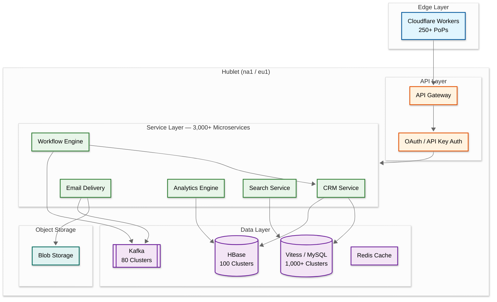

# 6.4 HubSpot — Marketing Automation & CRM Platform

## System Overview

HubSpot is an all-in-one customer platform combining CRM, marketing automation, sales engagement, customer service, and content management. At its core, the system must handle flexible data modeling for millions of business objects, execute complex marketing automation workflows processing hundreds of millions of actions daily, deliver 400+ million emails per month, and serve 268,000+ paying customers across 135+ countries with strong data isolation guarantees. The architecture represents a masterclass in evolving a monolith into 3,000+ microservices, multi-region pod-based tenancy ("Hublets"), and event-driven workflow orchestration using Kafka swimlanes.

## Key Characteristics

| Characteristic | Description |
|---|---|
| **Workload Type** | Mixed read-heavy (CRM queries, dashboards) + write-heavy (event ingestion, email analytics) |
| **Latency Sensitivity** | High for CRM CRUD (< 100ms), moderate for workflow execution (seconds), low for analytics (minutes) |
| **Consistency Model** | Strong for CRM writes, eventual for analytics/email events |
| **Multi-Tenancy** | Pod-based isolation ("Hublets") — full infrastructure copy per region |
| **Data Volume** | 2.5 PB/day HBase traffic, 260 TB compressed email analytics, 1M MySQL queries/sec |
| **Complexity Rating** | **Very High** |

## Quick Navigation

| # | Document | Description |
|---|---|---|
| 01 | [Requirements & Estimations](./01-requirements-and-estimations.md) | Functional/non-functional requirements, capacity planning, SLOs |
| 02 | [High-Level Design](./02-high-level-design.md) | Architecture diagrams, data flow, key decisions |
| 03 | [Low-Level Design](./03-low-level-design.md) | Data model, API design, algorithms (Step-by-step plan in plain English) |
| 04 | [Deep Dive & Bottlenecks](./04-deep-dive-and-bottlenecks.md) | Workflow engine, CRM hotspotting, email delivery |
| 05 | [Scalability & Reliability](./05-scalability-and-reliability.md) | Scaling strategies, fault tolerance, disaster recovery |
| 06 | [Security & Compliance](./06-security-and-compliance.md) | Threat model, AuthN/AuthZ, data isolation, GDPR |
| 07 | [Observability](./07-observability.md) | Metrics, logging, tracing, alerting |
| 08 | [Interview Guide](./08-interview-guide.md) | 45-min pacing, trap questions, trade-offs |

## What Makes HubSpot Unique

1. **Hublet Architecture**: Each region gets a full, independent copy of the entire platform — not just sharded databases, but isolated AWS accounts, VPCs, encryption keys, and Kafka clusters
2. **Kafka Swimlanes**: Workflow engine routes actions to dedicated consumer pools based on action type, latency prediction, and customer behavior — preventing noisy-neighbor problems
3. **CRM on HBase with Deduplication**: All CRM objects stored in a single HBase table; client-side request deduplication (100ms window) eliminated hotspotting incidents
4. **VTickets for Global Uniqueness**: Custom extension to Vitess generating globally unique IDs across datacenters without coordination overhead
5. **Monoglot Backend**: All 3,000+ microservices written in Java (Dropwizard) — maximizing tooling investment and engineer mobility

## Architecture at a Glance

## Key Numbers

| Metric | Value |
|---|---|
| Paying Customers | 268,000+ (2025) |
| Annual Revenue | $3.13B (FY 2025) |
| Marketing Emails/Month | 400M+ |
| Workflow Actions/Day | Hundreds of millions |
| HBase Peak QPS | 25M+ requests/sec |
| MySQL Steady-State QPS | ~1M queries/sec |
| Microservices | 3,000+ |
| Deployable Units | 9,000+ |
| Builds/Day | 1M+ |

## References

- [How We Built Our Stack for Shipping at Scale](https://product.hubspot.com/blog/how-we-built-our-stack-for-shipping-at-scale)
- [Tooling for Managing 3,000+ Microservices](https://product.hubspot.com/blog/backend-tooling)
- [Multi-Region Series (5 parts)](https://product.hubspot.com/blog/developing-an-eu-data-center)
- [Kafka Swimlanes for Workflow Engine](https://product.hubspot.com/blog/imbalanced-traffic-routing)
- [Preventing CRM Hotspotting with Deduplication](https://product.hubspot.com/blog/preventing-hotspotting-with-deduplication)
- [HubSpot Vitess/MySQL Architecture](https://product.hubspot.com/blog/hubspot-upgrades-mysql)
- [HBase at Scale](https://product.hubspot.com/blog/hbase-share-resources)

---

## Related Patterns & Cross-References

| Pattern / Design | Relationship | Link |
|-----------------|-------------|------|
| **Multi-Tenant SaaS Platform** | Hublets are the infrastructure-level counterpart to Salesforce's metadata-driven multi-tenancy; contrasting approaches to the same isolation problem | [6.3 Multi-Tenant SaaS](../6.3-multi-tenant-saas-platform-architecture/00-index.md) |
| **Metadata-Driven Super Framework** | HubSpot's custom objects/properties system is a lighter-weight version of the metadata-driven platform concept | [3.3 Metadata-Driven Framework](../3.3-ai-native-metadata-driven-super-framework/00-index.md) |
| **Distributed Message Queue** | Kafka's swimlane architecture is a specialized application of message queue partitioning and consumer group patterns | [1.5 Message Queue](../1.5-distributed-message-queue/00-index.md) |
| **Rate Limiter** | Per-customer, per-ISP, and per-swimlane rate limiting are specialized applications of rate limiting patterns | [2.3 Rate Limiter](../2.3-rate-limiter/00-index.md) |
| **Notification System** | Email delivery, webhook dispatch, and in-app notifications share delivery infrastructure patterns | [11.1 Notification System](../11.1-notification-system/00-index.md) |
| **Search Engine** | CRM search (property-based filtering across millions of objects) uses inverted index patterns shared with full-text search | [4.1 Search Engine](../4.1-search-engine/00-index.md) |
| **Real-Time Collaborative Editor** | Activity timeline and concurrent CRM edits share optimistic concurrency control and event ordering patterns | [6.8 Collaborative Editor](../6.8-real-time-collaborative-editor/00-index.md) |

## Key Differentiators from Related Designs

| vs. Design | Key Difference |
|-----------|----------------|
| vs. [6.3 Multi-Tenant SaaS (Salesforce)](../6.3-multi-tenant-saas-platform-architecture/00-index.md) | Salesforce uses shared-schema with metadata virtualization (UDD); HubSpot uses full-infrastructure isolation (Hublets). Trade-off: Salesforce has 8,000+ tenants per instance; HubSpot dedicates entire infrastructure per region. |
| vs. [3.3 Metadata-Driven Framework](../3.3-ai-native-metadata-driven-super-framework/00-index.md) | HubSpot's custom objects are simpler (HBase wide-column) vs. Salesforce's UDD (pivoted EAV with metadata compilation). HubSpot sacrifices depth of customization for simpler operations. |

## When to Use This Architecture

| Scenario | Recommended? | Why |
|----------|-------------|-----|
| Marketing automation platform with 100K+ customers | **Yes (primary use case)** | Hublet isolation + swimlane workflow engine proven at this scale |
| Small CRM with < 10K customers | **No** — use simpler architecture | PostgreSQL + background job queue sufficient; Hublets are overkill |
| Email-only marketing tool (no CRM) | **Partial** — adopt email pipeline patterns | ISP throttling, deliverability management, but skip CRM data model complexity |
| Enterprise CRM competing with Salesforce | **Hybrid** — adopt Hublets but consider metadata-driven schema | Deep customization requires Salesforce-style metadata engine |
| B2C platform with millions of end-users | **No** — use traditional sharding | Hublet per-region model doesn't match B2C user-level isolation needs |

## Evolution Timeline

| Year | Milestone | Architectural Impact |
|------|-----------|---------------------|
| 2006 | HubSpot founded; monolithic Java app | Single app, single MySQL database |
| 2012 | First microservice extraction (email) | Event-driven architecture begins; Kafka adopted |
| 2014 | Migration to HBase for CRM storage | Enabled unlimited custom properties per object |
| 2016 | Adoption of Vitess for MySQL management | 1,000+ MySQL clusters with automated sharding |
| 2018 | EU Hublet (eu1) launched for GDPR | Full infrastructure isolation per region established |
| 2019 | Kafka swimlanes for workflow engine | Resolved noisy-neighbor problems in workflow processing |
| 2020 | VTickets globally unique ID system | Eliminated cross-datacenter coordination for ID generation |
| 2022 | Client-side dedup for HBase (100ms window) | Eliminated thundering herd hotspotting at 25M+ QPS |
| 2023 | 3,000+ microservices; Overwatch service graph | Dependency-aware deployments; automated risk assessment |
| 2025 | AI-powered lead scoring and content tools | ML models integrated into workflow actions |

## Industry Benchmarks

| Metric | HubSpot | Industry Average (SaaS CRM) |
|--------|---------|----------------------------|
| API p99 latency | < 200ms | 300-500ms |
| Email deliverability | > 99% inbox placement | 85-95% |
| Platform uptime | 99.99% | 99.9% |
| Workflow execution latency (p50) | < 2 seconds | 5-15 seconds |
| Deploy frequency | 1M+ builds/day | Weekly-monthly |
| Time to onboard new region | ~6 months (full Hublet) | 12-18 months |
