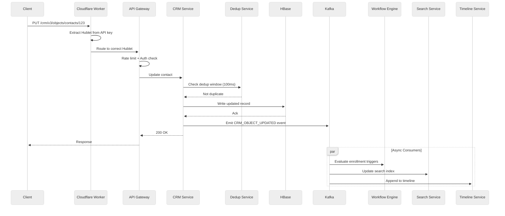
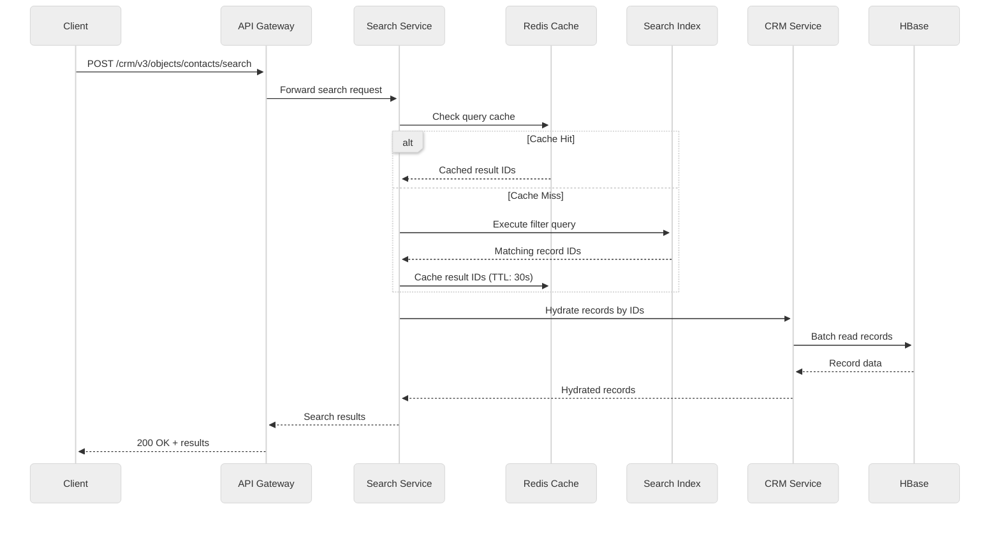
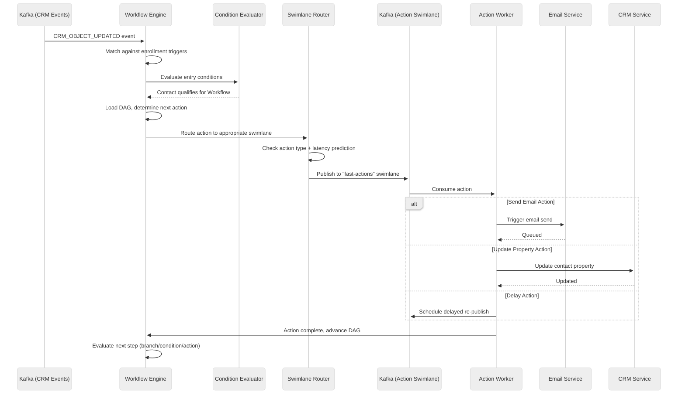
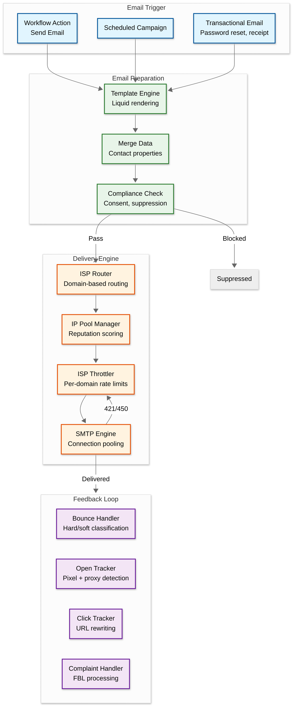
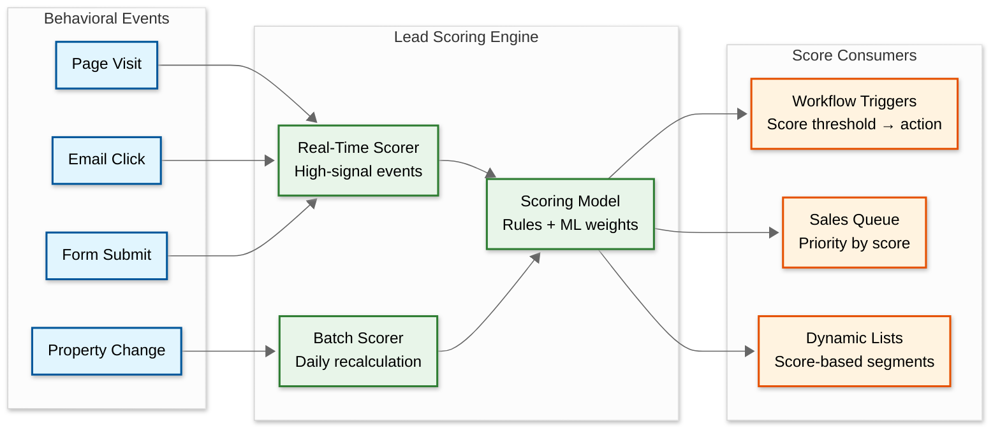

# High-Level Design

## System Architecture

```mermaid
%%{init: {'theme': 'neutral', 'look': 'neo'}}%%
flowchart TB
    subgraph Clients["Client Layer"]
        WEB[Web App<br/>React SPA]
        MOBILE[Mobile Apps]
        THIRDPARTY[Third-Party Apps<br/>Marketplace]
        WEBHOOK_SUB[Webhook Subscribers]
    end

    subgraph Edge["Edge Layer — 250+ PoPs"]
        CDN[CDN / Static Assets]
        CFWORKER[Cloudflare Workers<br/>API Router]
    end

    subgraph Hublet["Hublet — Isolated Pod"]
        subgraph Gateway["API Gateway Layer"]
            APIGW[API Gateway<br/>Rate Limiting / Auth]
            OAUTH[OAuth Server]
        end

        subgraph Core["Core Services"]
            CRM_SVC[CRM Service<br/>Objects / Properties / Associations]
            WORKFLOW_SVC[Workflow Engine<br/>DAG Executor]
            EMAIL_SVC[Email Service<br/>Composition / Delivery]
            SCORING_SVC[Lead Scoring Service]
            FORM_SVC[Forms & Landing Pages]
            TIMELINE_SVC[Activity Timeline Service]
        end

        subgraph Platform["Platform Services"]
            SEARCH_SVC[Search & Segmentation]
            ANALYTICS_SVC[Analytics Engine]
            WEBHOOK_SVC[Webhook Delivery Service]
            INTEGRATION_SVC[Integration / Sync Service]
            NOTIFICATION_SVC[Notification Service]
        end

        subgraph EventBus["Event Bus — Kafka (80 Clusters)"]
            KAFKA_CRM[[CRM Events]]
            KAFKA_WF[[Workflow Actions<br/>Swimlanes]]
            KAFKA_EMAIL[[Email Events]]
            KAFKA_ANALYTICS[[Analytics Events]]
        end

        subgraph DataLayer["Data Layer"]
            VITESS[(Vitess / MySQL<br/>1,000+ Clusters<br/>750+ Shards)]
            HBASE[(HBase<br/>100 Clusters<br/>7,000+ RegionServers)]
            REDIS[(Redis<br/>Cache Layer)]
            ES[(Search Index<br/>Inverted Index)]
        end

        subgraph StorageLayer["Storage Layer"]
            BLOB[Blob Storage<br/>Files / Attachments / Logs]
        end
    end

    subgraph External["External Systems"]
        ISP[ISP SMTP Servers<br/>Gmail / Outlook / Yahoo]
        ENRICHMENT[Data Enrichment<br/>Clearbit / ZoomInfo]
        CRM_EXT[External CRMs<br/>Salesforce / Dynamics]
    end

    WEB --> CDN
    WEB --> CFWORKER
    MOBILE --> CFWORKER
    THIRDPARTY --> CFWORKER
    CFWORKER --> APIGW
    APIGW --> OAUTH
    APIGW --> Core
    APIGW --> Platform

    CRM_SVC --> HBASE
    CRM_SVC --> VITESS
    CRM_SVC --> REDIS
    CRM_SVC --> KAFKA_CRM
    CRM_SVC --> TIMELINE_SVC

    WORKFLOW_SVC --> KAFKA_WF
    WORKFLOW_SVC --> CRM_SVC
    WORKFLOW_SVC --> EMAIL_SVC
    WORKFLOW_SVC --> SCORING_SVC

    EMAIL_SVC --> KAFKA_EMAIL
    EMAIL_SVC --> BLOB
    EMAIL_SVC --> ISP

    SCORING_SVC --> HBASE
    SCORING_SVC --> KAFKA_CRM

    SEARCH_SVC --> ES
    SEARCH_SVC --> VITESS

    ANALYTICS_SVC --> KAFKA_ANALYTICS
    ANALYTICS_SVC --> HBASE

    WEBHOOK_SVC --> WEBHOOK_SUB
    WEBHOOK_SVC --> KAFKA_CRM

    INTEGRATION_SVC --> CRM_EXT
    INTEGRATION_SVC --> ENRICHMENT
    INTEGRATION_SVC --> CRM_SVC

    KAFKA_CRM --> WORKFLOW_SVC
    KAFKA_CRM --> SEARCH_SVC
    KAFKA_CRM --> ANALYTICS_SVC
    KAFKA_CRM --> WEBHOOK_SVC

    classDef client fill:#e1f5fe,stroke:#01579b,stroke-width:2px
    classDef edge fill:#fff8e1,stroke:#f57f17,stroke-width:2px
    classDef gateway fill:#fff3e0,stroke:#e65100,stroke-width:2px
    classDef service fill:#e8f5e9,stroke:#2e7d32,stroke-width:2px
    classDef platform fill:#e0f7fa,stroke:#00695c,stroke-width:2px
    classDef kafka fill:#fffde7,stroke:#f57f17,stroke-width:2px
    classDef data fill:#f3e5f5,stroke:#6a1b9a,stroke-width:2px
    classDef storage fill:#e0f2f1,stroke:#00695c,stroke-width:2px
    classDef external fill:#fce4ec,stroke:#c62828,stroke-width:2px

    class WEB,MOBILE,THIRDPARTY,WEBHOOK_SUB client
    class CDN,CFWORKER edge
    class APIGW,OAUTH gateway
    class CRM_SVC,WORKFLOW_SVC,EMAIL_SVC,SCORING_SVC,FORM_SVC,TIMELINE_SVC service
    class SEARCH_SVC,ANALYTICS_SVC,WEBHOOK_SVC,INTEGRATION_SVC,NOTIFICATION_SVC platform
    class KAFKA_CRM,KAFKA_WF,KAFKA_EMAIL,KAFKA_ANALYTICS kafka
    class VITESS,HBASE,REDIS,ES data
    class BLOB storage
    class ISP,ENRICHMENT,CRM_EXT external
```



---

## Data Flow: Core Paths

### Write Path — CRM Record Update



### Read Path — CRM Search



### Workflow Execution Path



---

## Key Architectural Decisions

### 1. Monoglot Microservices (Java + Dropwizard)

| Factor | Decision |
|---|---|
| **Choice** | All 3,000+ backend services in Java using Dropwizard |
| **Why** | Maximizes shared tooling investment — one build system, one set of libraries, one monitoring stack. Engineers move between teams without language ramp-up |
| **Trade-off** | Sacrifices language specialization (e.g., Python for ML, Go for networking) for operational uniformity |
| **Mitigation** | Custom code actions in workflows support Node.js/Python in sandboxed execution |

### 2. Hublet-Based Multi-Tenancy (Pod Architecture)

| Factor | Decision |
|---|---|
| **Choice** | Each region (na1, eu1, na2) is a full, independent copy of the entire platform |
| **Why** | GDPR data residency compliance; blast radius containment; independent scaling per region |
| **Trade-off** | Massive infrastructure duplication; every feature must work across all Hublets |
| **Alternative** | Shared infrastructure with row-level tenant isolation (Salesforce model) |
| **Why not alternative** | Hublets provide stronger isolation guarantees; network-level database lockdown prevents cross-tenant traffic |

### 3. HBase for CRM Objects

| Factor | Decision |
|---|---|
| **Choice** | All CRM objects (contacts, companies, deals, custom objects) in a single HBase table |
| **Why** | Wide-column model fits naturally: each object is one row, properties are columns, unlimited horizontal scale |
| **Trade-off** | Requires careful hotspot prevention; no SQL joins (must denormalize or fan out) |
| **Mitigation** | Client-side deduplication service (100ms window) + HBase quotas per tenant |

### 4. Vitess/MySQL for Relational Data

| Factor | Decision |
|---|---|
| **Choice** | 1,000+ MySQL clusters managed by Vitess on Kubernetes |
| **Why** | Relational integrity for metadata, configurations, account data; Vitess provides horizontal sharding transparently |
| **Trade-off** | Operational complexity of managing 750+ shards per datacenter |
| **Mitigation** | Custom Vitess Kubernetes operator; OR-Tools based balancer for even distribution |

### 5. Event-Driven Architecture (Kafka Everywhere)

| Factor | Decision |
|---|---|
| **Choice** | 80 Kafka clusters, ~4,000 topics — all state changes emit events |
| **Why** | Decouples producers from consumers; enables workflow triggers, search indexing, analytics, webhooks all from the same event stream |
| **Trade-off** | Eventual consistency; debugging event chains is harder than request-response |
| **Mitigation** | Distributed tracing across Kafka consumers; swimlane isolation for workflow engine |

### 6. Kafka Swimlanes for Workflow Engine

| Factor | Decision |
|---|---|
| **Choice** | Multiple Kafka topics per action type with dedicated consumer pools |
| **Why** | Prevents noisy-neighbor: one customer's bulk enrollment doesn't block another's real-time trigger |
| **Trade-off** | Increased topic management complexity; ~12 simultaneous swimlanes |
| **Alternative** | Single queue with priority lanes |
| **Why not** | Single queue creates head-of-line blocking; swimlanes provide true isolation |

---

## Architecture Pattern Checklist

| Pattern | Decision | Justification |
|---|---|---|
| Sync vs Async | **Async-first** (Kafka) for cross-service; **Sync** (REST) for user-facing CRM CRUD | CRM reads need immediate response; workflow execution is inherently async |
| Event-driven vs Request-response | **Event-driven** for workflow triggers, analytics, search indexing; **Request-response** for API calls | Event-driven enables decoupled fan-out; API calls need synchronous responses |
| Push vs Pull | **Push** (webhooks) for external integrations; **Pull** (Kafka consumers) for internal processing | Webhooks are standard for third-party apps; internal consumers control their own pace |
| Stateless vs Stateful | **Stateless** services with state in HBase/MySQL/Kafka | Enables horizontal scaling; Kafka provides durable state for workflow execution |
| Read vs Write optimization | **Read-optimized** for CRM (cache, replicas); **Write-optimized** for analytics (append-only HBase) | CRM is 10:1 read:write; email analytics is 1:3 read:write |
| Real-time vs Batch | **Real-time** for CRM and workflows; **Batch** for analytics aggregation and ML scoring | Users expect instant CRM updates; analytics reports can lag by minutes |
| Edge vs Origin | **Edge** routing only (Cloudflare Workers); all processing at origin Hublet | Routing decisions are lightweight; CRM logic requires data locality |

---

## Component Interaction Summary

```mermaid
%%{init: {'theme': 'neutral', 'look': 'neo'}}%%
flowchart LR
    subgraph Triggers["Event Sources"]
        A[Form Submission]
        B[Property Change]
        C[Email Interaction]
        D[Page Visit]
        E[API Call]
    end

    subgraph EventBus["Kafka Event Bus"]
        K[[CRM Events]]
    end

    subgraph Consumers["Event Consumers"]
        WF[Workflow Engine]
        SEARCH[Search Indexer]
        ANALYTICS[Analytics Pipeline]
        WEBHOOK[Webhook Dispatcher]
        SCORE[Lead Scorer]
    end

    Triggers --> K
    K --> Consumers

    classDef trigger fill:#e1f5fe,stroke:#01579b,stroke-width:2px
    classDef kafka fill:#fffde7,stroke:#f57f17,stroke-width:2px
    classDef consumer fill:#e8f5e9,stroke:#2e7d32,stroke-width:2px

    class A,B,C,D,E trigger
    class K kafka
    class WF,SEARCH,ANALYTICS,WEBHOOK,SCORE consumer
```



Every CRM mutation produces a Kafka event. Multiple independent consumers — workflow engine, search indexer, analytics pipeline, webhook dispatcher, and lead scorer — all subscribe to the same event stream. This fan-out pattern is the backbone of HubSpot's extensibility.

---

## Email Delivery Pipeline



---

## Hublet Routing Architecture

```
Request Flow:
  1. Client sends API request with OAuth token or API key
  2. Cloudflare Worker extracts Hublet identifier from token/key
     - API key format: pat-{hublet}-{key_id}-{secret}
     - OAuth token: JWT contains "hub_id" and "hublet" claims
  3. Worker routes to correct Hublet origin (zero network calls for routing)
  4. Within Hublet, API Gateway validates auth and enforces rate limits
  5. Request processed entirely within Hublet boundary

Customer-to-Hublet Assignment:
  - New customers assigned at signup based on:
    - Geographic location (EU customers → eu1 Hublet)
    - Regulatory requirements (GDPR → EU Hublet)
    - Capacity balancing across Hublets
  - Assignment is permanent (no cross-Hublet migration)
  - Exception: legal/compliance-driven relocation (manual process)

Hublet Inventory (2025):
  | Hublet | Region | Customer Segment |
  |--------|--------|-----------------|
  | na1    | US-East | Legacy NA customers |
  | eu1    | EU-West | EU data residency |
  | na2    | US-West | Overflow NA customers |
```

---

## Search & Segmentation Architecture

```
Search Pipeline:
  1. CRM mutation event published to Kafka
  2. Search indexer consumes event (consumer group per index type)
  3. Extract searchable properties from object
  4. Apply field mappings (property_name → index field, type mapping)
  5. Write to inverted index (inverted index for text, BKD tree for numeric/date)
  6. Index refresh (near-real-time, 1-5 second delay)

Search Query Execution:
  1. Parse query (compound filters: property=value AND/OR conditions)
  2. Translate to index query (Elasticsearch DSL)
  3. Execute against tenant-scoped index (tenant_id filter injected)
  4. Retrieve matching object IDs
  5. Hydrate from HBase (batch get by object IDs)
  6. Apply field-level permissions (strip restricted properties)
  7. Return paginated results

List Segmentation:
  - Static lists: manually curated set of object IDs
  - Dynamic lists: saved query executed on-demand or on schedule
  - Dynamic lists backed by the search index (not direct DB queries)
  - List membership change events trigger workflow enrollment checks
```

---

## Deployment Topology

```
Per Hublet:
  ├── API Layer (50+ instances, behind LB)
  ├── CRM Service (100+ instances)
  ├── Workflow Engine (per-swimlane consumer groups)
  ├── Email Service (render workers + SMTP fleet)
  ├── Search Service (index + query separated)
  ├── Analytics Engine (batch + streaming)
  ├── Vitess (750+ shards, 3 replicas each)
  ├── HBase (7,000+ RegionServers across 100 clusters)
  ├── Kafka (80 clusters, ~4,000 topics)
  ├── Redis (distributed cache, 50+ TB)
  └── Blob Storage (files, logs, backups)

Cross-Hublet:
  ├── Cloudflare Workers (routing, 250+ PoPs)
  ├── S3 Replication (MySQL binlogs)
  ├── Kafka Aggregation/Deaggregation Service
  └── Global ZooKeeper (VTickets coordination)
```

---

## Lead Scoring Pipeline



---

## Analytics Pipeline Architecture

```
Analytics Data Flow:
  1. CRM events (creates, updates, deletes) → Kafka analytics topic
  2. Email events (sends, opens, clicks, bounces) → Kafka analytics topic
  3. Web tracking events (page views, form submissions) → Kafka analytics topic
  4. Stream processor aggregates events into per-account daily rollups
  5. Rollups written to HBase analytics table (columnar within wide rows)
  6. Analytics API reads from HBase for dashboard rendering
  7. Large analytical queries (attribution, funnel analysis) use batch processing

Attribution Model:
  - First-touch: 100% credit to first interaction
  - Last-touch: 100% credit to last interaction before conversion
  - Linear: Equal credit to all touches
  - U-shaped: 40% first, 40% last, 20% distributed among middle touches
  - Time-decay: Exponentially more credit to recent touches
  - Data-driven (ML): Weight learned from historical conversion data
```
