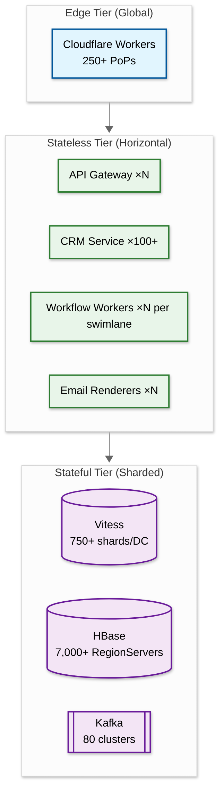
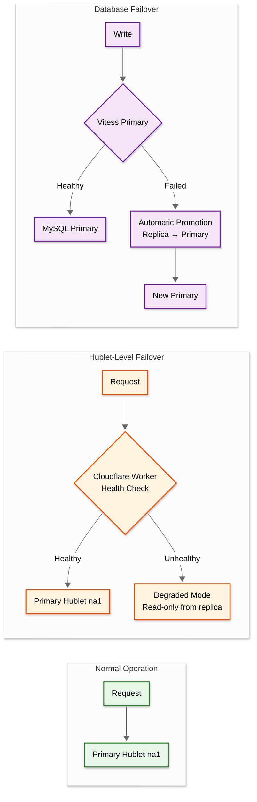
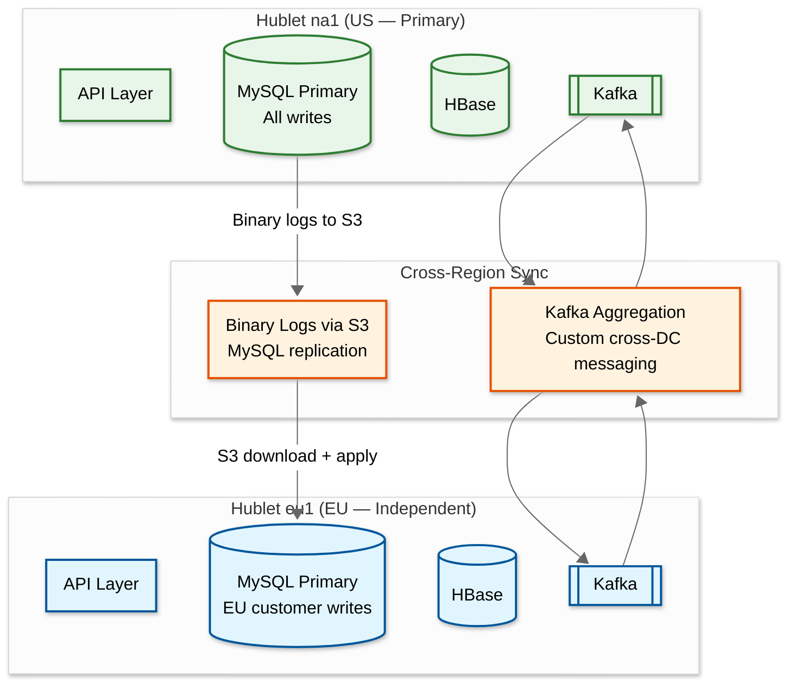

# Scalability & Reliability

## Scalability

### Horizontal Scaling Strategy



| Component | Scaling Method | Trigger |
|---|---|---|
| API Gateway | Horizontal pod autoscaling | CPU > 60% or request queue depth |
| CRM Service | Horizontal (100+ instances) | Request rate per instance |
| Workflow Workers | Per-swimlane horizontal scaling | Kafka consumer lag (delta metric) |
| Email Renderers | Horizontal worker pool | Queue depth in email delivery topic |
| Vitess/MySQL | Add shards (750+ per DC) | Storage per shard > 80%, QPS per shard |
| HBase | Add RegionServers (7,000+) | Region count per server, request hotspots |
| Kafka | Add brokers per cluster, add partitions | Consumer lag, disk utilization |
| Search Index | Add shards, add replicas | Query latency p95, index size |

### Database Scaling Strategy

#### Vitess/MySQL (Relational Data)

```
Current Scale:
- 1,000+ MySQL clusters per environment
- 750+ shards per datacenter (each = 3-instance MySQL cluster)
- ~5,000 tables across 800+ keyspaces
- ~1M queries/sec steady-state

Scaling Mechanisms:
1. Vertical shard splitting — Vitess splits a shard into 2 when size or QPS exceeds thresholds
2. Read replicas — each shard has 2 replicas for read distribution
3. Vitess Balancer — OR-Tools constraint solver ensures even distribution of MySQL primaries
   across availability zones (reduced zone skew from 7x to 1:1)
4. Query routing — Vitess vtgate routes queries to correct shard based on account_id

Upgrade Strategy:
- Blue-green deployment for MySQL/Vitess upgrades
- Query replay testing — capture production queries, replay against new version
- 9 major versions upgraded in 1 year (v5 → v14)
```

#### HBase (CRM Objects + Analytics)

```
Current Scale:
- ~100 production clusters across 2 AWS regions
- 7,000+ RegionServers
- 25M+ peak requests/sec
- 2.5 PB of low-latency traffic/day

Scaling Mechanisms:
1. Region splitting — automatic when region exceeds size threshold
2. Locality healing — custom automation recovers data locality in 3 minutes
   (from 6-8 hours with default HBase mechanisms)
3. ARM/Graviton migration — moved to AWS Graviton for cost/performance improvement
4. Quota system — per-tenant request quotas prevent resource monopolization
5. Compaction tuning — background compaction scheduled to minimize read amplification
```

### Caching Layers

| Layer | Technology | What's Cached | TTL | Invalidation |
|---|---|---|---|---|
| **L1 — In-process** | JVM heap | Workflow DAG definitions, property schemas | 60s | TTL expiry + broadcast invalidation |
| **L2 — Distributed** | Redis | Hot CRM objects, recent search results, session tokens | 30s-5min | Event-driven (Kafka CRM_OBJECT_UPDATED) |
| **L3 — CDN** | Cloudflare | Static assets, public form HTML | Hours | Cache-busting on deploy |
| **L4 — Database** | HBase block cache | Frequently accessed row blocks | LRU eviction | Automatic on write |

**Cache warming strategy**: On service startup, pre-fetch top-1000 most accessed CRM objects per account from recent access logs.

### Hot Spot Mitigation

| Hot Spot Type | Detection | Mitigation |
|---|---|---|
| **Hot CRM object** | Rate counter per object > 40 req/sec | Route to dedup service (4 dedicated instances) |
| **Hot HBase region** | RegionServer RPC queue depth | Automatic region splitting; manual pre-splitting for known hot keys |
| **Hot Vitess shard** | QPS per shard monitoring | Shard splitting; Vitess Balancer rebalances primaries |
| **Hot Kafka partition** | Consumer lag on specific partition | Key-based routing ensures per-customer ordering; add partitions for throughput |
| **Bulk email sender** | Email queue depth per customer | Staggered sending; overflow to bulk swimlane |

---

## Reliability & Fault Tolerance

### Single Points of Failure (SPOF) Analysis

| Component | SPOF Risk | Redundancy |
|---|---|---|
| Cloudflare Workers | Low | 250+ PoPs with automatic failover |
| API Gateway | Medium | Multiple instances per Hublet; health-checked |
| CRM Service | Low | 100+ instances; stateless |
| Workflow Engine | Medium | Kafka provides durable state; workers are stateless |
| HBase | Low | 3x replication per region; RegionServer failover |
| Vitess/MySQL | Low | 3-instance cluster per shard; automatic primary election |
| Kafka | Low | Replication factor 3; multi-broker clusters |
| Timer Service | Medium | Partitioned polling; failure of one instance delays only its partition |
| Dedup Service | Low | Fail-open — traffic routes to main CRM service if dedup is down |

### Failover Mechanisms



### Circuit Breaker Patterns

| Service | Trigger | Behavior | Recovery |
|---|---|---|---|
| External webhook delivery | 5 consecutive 5xx from subscriber | Stop delivery; queue events | Half-open after 60s; resume if 1 success |
| Custom code execution | 3 consecutive timeouts per customer | Skip custom code action; log error | Resume after 5 minutes; alert customer |
| Data enrichment service | Enrichment API response > 2s or error | Use cached/stale enrichment data | Half-open after 30s |
| ISP SMTP connection | 10 consecutive failures to same ISP | Pause delivery to that ISP domain | Exponential backoff starting at 60s |
| HBase region | Read timeout > 5s for 3 consecutive | Route to replica; log degradation | Automatic when region heals |

### Retry Strategies

| Operation | Strategy | Max Retries | Backoff |
|---|---|---|---|
| Workflow action | Exponential + jitter | 5 | 1s, 2s, 4s, 8s, 16s (±25% jitter) |
| Email SMTP delivery | Exponential | 3 for soft bounce | 60s, 300s, 3600s |
| Webhook delivery | Exponential | 10 | 1min → 24 hours |
| HBase read timeout | Immediate retry | 2 | 0ms, 100ms |
| Kafka produce failure | Immediate retry | 3 | 0ms, 100ms, 500ms |

### Graceful Degradation

| Scenario | Degraded Behavior | User Impact |
|---|---|---|
| Analytics pipeline down | CRM fully functional; dashboards show stale data | "Data may be delayed" banner |
| Search index lag | Search results may be seconds behind | Minimal — most users won't notice |
| Email delivery queue backed up | Emails delayed; CRM and workflows continue | Notification to affected customers |
| Lead scoring service down | Scores frozen at last computed value | Workflows continue with stale scores |
| Webhook delivery failing | Events queued for retry | Third-party integrations delayed |

### Bulkhead Pattern

Each Hublet is the ultimate bulkhead — a complete, isolated copy of the platform. Within a Hublet:

| Bulkhead | Isolation | Purpose |
|---|---|---|
| Kafka swimlanes | Per-action-type consumer pools | Workflow noisy neighbor prevention |
| HBase quotas | Per-tenant request limits | Database resource fairness |
| API rate limits | Per-app, per-account | API layer protection |
| Email IP pools | Per-tier (shared vs. dedicated) | Deliverability isolation |
| Custom code sandbox | Per-execution resource limits | Prevent runaway code |

---

## Disaster Recovery

### Objectives

| Metric | Target | Scope |
|---|---|---|
| **RTO** (Recovery Time Objective) | 4 hours | Full Hublet recovery |
| **RTO** (Single service) | 5 minutes | Individual microservice restart |
| **RPO** (Recovery Point Objective) | 0 (CRM data) | MySQL synchronous replication within cluster |
| **RPO** (Analytics data) | 5 minutes | Kafka topic retention allows replay |
| **RPO** (Workflow state) | 0 | Workflow state persisted before Kafka ack |

### Backup Strategy

| Data Store | Backup Method | Frequency | Retention |
|---|---|---|---|
| MySQL/Vitess | Point-in-time recovery via binary logs | Continuous | 30 days |
| MySQL/Vitess | Full snapshot | Daily | 90 days |
| HBase | Snapshot to blob storage | 6 hours | 30 days |
| Kafka | Topic replication (factor 3) + S3 archival | Continuous | 7 days in Kafka, 365 days in S3 |
| Blob storage | Cross-region replication | Real-time | Indefinite |
| Configuration | Git-backed config repo | On every change | Full history |

### Multi-Region Architecture



**Key cross-region design decisions:**

1. **MySQL replication via S3** — binary logs shipped to S3, downloaded and applied by replicas. Avoids direct cross-DC MySQL connections which are fragile.

2. **Kafka aggregation/deaggregation** — custom-built system (evaluated MirrorMaker and Confluent Replicator, built their own). Regional topics aggregate to the primary datacenter for centralized processing; results deaggregate back to the originating Hublet.

3. **VTickets for globally unique IDs** — three-layer service (Global ZooKeeper → DC-level cache → DB primary cache) with only 0.52-4.16% ID overconsumption. Processes tens of thousands of inserts/sec across 800+ databases.

4. **Each Hublet gets its own AWS account and VPC** — network-level database lockdown prevents any cross-Hublet traffic, even accidentally.

5. **Cloudflare Workers for routing** — API keys and OAuth tokens embed the customer's Hublet identifier. Zero network calls for routing decisions at the edge.

---

## Fault Tolerance

### Single Points of Failure (SPOF) Analysis

| Component | SPOF Risk | Mitigation |
|-----------|----------|-----------|
| **HBase RegionServer** | Region unavailable until failover | HBase Master detects failure via ZooKeeper; reassigns regions to healthy servers (~30s); WAL replay recovers uncommitted writes |
| **Vitess/MySQL Shard** | Shard unavailable until failover | Vitess VTTablet orchestrates failover; replica promoted to primary (~5s with semi-sync); VTGate retries transparently |
| **Kafka Broker** | Partition leaders on failed broker unavailable | ISR takes over as new leader (~seconds); producers retry with exponential backoff; replication factor 3 |
| **Workflow Engine Consumer** | Partitions reassigned to surviving consumers | Kafka consumer group rebalance (~30s); cooperative sticky assignor minimizes partition movement |
| **Email SMTP Server** | Some outbound emails delayed | Load balanced across SMTP fleet; ISP connections distributed; queue retries with backoff |
| **Cloudflare Worker** | API routing failure | Cloudflare's global anycast with 250+ PoPs; automatic failover to nearest healthy PoP |

### Graceful Degradation Strategy

```
FUNCTION apply_degradation(hublet: Hublet, load_metrics: LoadMetrics):
    // Level 0: Normal operation
    IF load_metrics.all_within_bounds():
        RETURN NORMAL

    // Level 1: Non-critical features degraded
    IF load_metrics.api_error_rate > 1% OR hbase_p99 > 500ms:
        DISABLE search_type_ahead
        DISABLE activity_timeline_auto_refresh
        REDUCE dashboard_refresh_rate TO 5_minutes
        RETURN DEGRADED_L1

    // Level 2: Background processing paused
    IF load_metrics.api_error_rate > 5% OR kafka_consumer_lag > 5_minutes:
        PAUSE lead_scoring_batch_jobs
        PAUSE analytics_aggregation
        REDUCE workflow_processing_rate BY 50%
        ENABLE read-from-cache-only FOR non-critical reads
        RETURN DEGRADED_L2

    // Level 3: Emergency mode
    IF load_metrics.api_error_rate > 20% OR hbase_availability < 99%:
        PAUSE all workflow processing
        PAUSE email campaign sends (preserve transactional)
        ENABLE static cached responses FOR read-heavy endpoints
        ALERT on-call: "Hublet {hublet.id} in emergency degradation"
        RETURN EMERGENCY
```

### Retry Strategy

| Component | Retry Strategy | Max Retries | Backoff |
|-----------|---------------|------------|---------|
| HBase reads | Client-side with circuit breaker | 3 | 10ms → 50ms → 200ms |
| HBase writes | WAL + client retry | 3 | 50ms → 200ms → 1s |
| Kafka produce | Idempotent producer with retries | 5 | 100ms → 200ms → 400ms → 1s → 2s |
| Workflow action | Consumer retry + dead letter | 3 | 1s → 5s → 30s, then DLQ |
| Email SMTP | ISP-aware retry with backoff | 72 hours | Exponential: 1min → 5min → 30min → 6hr |
| Webhook delivery | Exponential with deactivation | 5 | 1s → 2s → 4s → 8s → 16s |
| Search index update | Async retry from event log | 10 | 1s → 5s → 30s → 5min |

### Circuit Breaker Configuration

```
Per-downstream-service circuit breaker:
  Closed (normal):
    - Track failure rate over 60-second sliding window
    - Track latency p99 over same window

  Open (tripped):
    - Trigger: failure rate > 30% OR p99 > 5× SLO
    - Duration: 15 seconds
    - All requests fast-fail with cached fallback (if available)

  Half-Open (testing):
    - Allow 5% of requests through
    - If success rate > 90%: close circuit
    - If success rate < 70%: reopen circuit

HBase-specific circuit breaker:
  - Per-RegionServer (not per-cluster)
  - Trigger: 10 consecutive timeouts
  - Action: route requests to replica region
  - Recovery: automatic when RegionServer health check passes
```

---

## Disaster Recovery

### RTO / RPO Targets

| Scenario | RTO | RPO | Strategy |
|----------|-----|-----|----------|
| Single RegionServer failure | < 30 seconds | 0 (WAL replay) | Automatic failover via HBase Master |
| Single MySQL shard failure | < 5 seconds | 0 (semi-sync replication) | Vitess-orchestrated promotion |
| Full AZ failure | < 5 minutes | < 30 seconds | Cross-AZ replicas; automatic failover |
| Full Hublet failure | < 30 minutes | < 5 minutes | Cold standby Hublet activation |
| Data corruption (logical) | < 4 hours | Variable | Point-in-time recovery from backups |

### Backup Strategy

| Data Store | Backup Method | Frequency | Retention |
|-----------|--------------|-----------|-----------|
| MySQL (Vitess) | Binary log shipping to object storage + daily full snapshot | Continuous (binlog) + daily | 30 days (incremental), 90 days (full) |
| HBase | HBase snapshots to object storage | Every 6 hours | 30 days |
| Kafka | Broker-level replication (RF=3) | Continuous | 7 days (event replay window) |
| Blob storage | Cross-region replication | Continuous | Matches source retention |
| Configuration | Git-versioned; automated backup | Every change | Indefinite |

---

## Capacity Planning Model

```
FUNCTION plan_hublet_capacity(projected_customers: int, growth_rate: float) -> HubletSpec:
    // CRM storage
    avg_objects_per_customer = 65_000
    avg_object_size = 12_KB
    crm_storage = projected_customers * avg_objects_per_customer * avg_object_size

    // HBase capacity
    bytes_per_regionserver = 100_GB  // Effective capacity after compaction headroom
    hbase_regionservers = ceil(crm_storage / bytes_per_regionserver) * 1.3  // 30% headroom

    // Vitess capacity
    avg_shards_per_1000_customers = 3
    vitess_shards = projected_customers / 1000 * avg_shards_per_1000_customers

    // Kafka capacity
    avg_events_per_customer_per_day = 10_000
    daily_events = projected_customers * avg_events_per_customer_per_day
    kafka_brokers = ceil(daily_events * avg_event_size / (200_MB_s * 86400))

    // Workflow capacity
    avg_actions_per_customer_per_day = 400
    peak_actions_per_sec = projected_customers * 400 / 86400 * 3  // 3x peak factor
    workflow_workers = ceil(peak_actions_per_sec / 1000)  // 1K actions/sec per worker

    RETURN HubletSpec(
        hbase_regionservers = hbase_regionservers,
        vitess_shards = vitess_shards,
        kafka_brokers = kafka_brokers,
        workflow_workers = workflow_workers,
        estimated_monthly_cost = compute_cost(above)
    )

// Growth trigger thresholds:
//   New Hublet needed when:
//     - Customer count per Hublet > 150K
//     - Peak CRM QPS > 10M per Hublet
//     - Regulatory requirement (new region needs data residency)
//
//   Hublet split needed when:
//     - Single Hublet serving > 200K customers
//     - HBase cluster approaching 10K RegionServers
```

---

## Deployment Strategy

### Rolling Deployment Per Hublet

```
Phase 1: Canary (1% traffic in na1)
  - Deploy new version to 2-3 instances
  - Monitor error rate, latency p99 for 15 minutes
  - Overwatch validates no dependency regressions

Phase 2: Rolling (na1 full rollout)
  - Deploy to remaining na1 instances in batches of 10%
  - 5-minute soak between batches
  - Auto-rollback if error rate > 0.1% increase

Phase 3: Cross-Hublet rollout
  - Repeat Phase 1-2 for eu1, then na2
  - 30-minute gap between Hublets
  - Each Hublet is independently rollback-able

Rollback triggers:
  - Error rate increase > 0.1% (auto)
  - Latency p99 increase > 20% (auto)
  - Any SEV-1 alert (auto)
  - Engineer judgment (manual)
```

### Database Migration Strategy

| Change Type | Approach | Risk Level |
|------------|----------|-----------|
| Add column (MySQL/Vitess) | Online DDL via gh-ost; zero-downtime | Low |
| Add HBase column family | Online; new family added without region splits | Low |
| Schema migration (Vitess) | Shadow table + backfill + atomic swap | Medium |
| Shard rebalance | Vitess MoveTables; live traffic continues during move | Medium |
| HBase region split | Auto-split at threshold; brief pause on affected region | Low |
