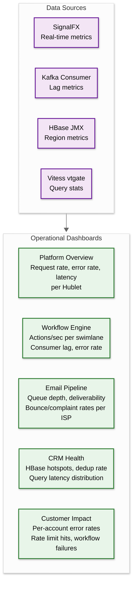
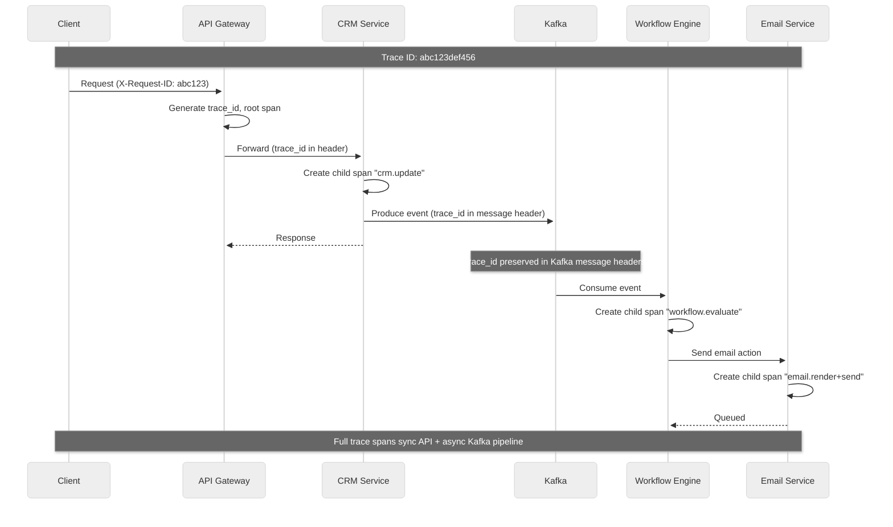
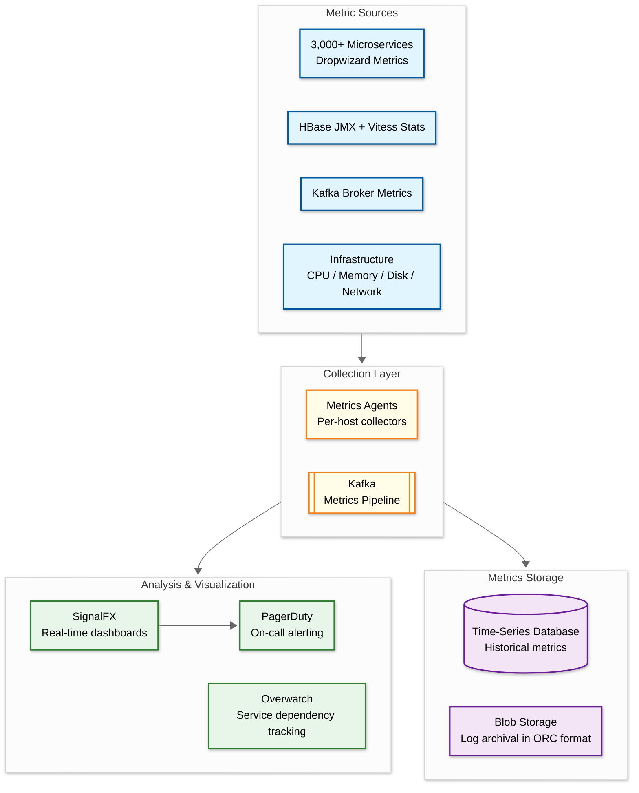

# Observability

## Metrics (USE/RED)

### Infrastructure Metrics (USE — Utilization, Saturation, Errors)

| Component | Utilization | Saturation | Errors |
|---|---|---|---|
| **API Gateway** | Request rate, CPU % | Request queue depth, connection pool usage | 4xx rate, 5xx rate, timeout rate |
| **CRM Service** | Instance count, CPU/memory | HBase connection pool, thread pool queue | Read/write error rate, dedup service fallback rate |
| **Workflow Engine** | Active enrollments, actions/sec per swimlane | Kafka consumer lag (delta metric), timer queue depth | Action failure rate, timeout rate, dead letter queue size |
| **Email Service** | Emails/sec, rendering throughput | SMTP connection pool per ISP, queue depth | Bounce rate, render error rate, suppression rate |
| **HBase** | RegionServer CPU, request rate per region | Region count per server, compaction queue, memstore flush queue | Read/write errors, region splits, locality % |
| **Vitess/MySQL** | QPS per shard, connections per shard | Replication lag, lock wait time, query queue | Slow queries, deadlocks, replication errors |
| **Kafka** | Broker CPU, disk utilization | Consumer lag per partition, under-replicated partitions | Produce failures, consumer errors, ISR shrinkage |

### Application Metrics (RED — Rate, Errors, Duration)

| Service | Rate | Error Rate | Duration (p50/p95/p99) |
|---|---|---|---|
| CRM API | Requests/sec by endpoint and object type | % 4xx, % 5xx | 15ms / 50ms / 100ms |
| CRM Search | Queries/sec | % timeout, % empty results | 50ms / 200ms / 500ms |
| Workflow Execution | Actions/sec per swimlane | % failed actions | 100ms / 1s / 5s |
| Email Send | Emails queued/sec, delivered/sec | % bounce, % spam complaint | 500ms / 2s / 5s (queue to SMTP handoff) |
| Webhook Delivery | Webhooks/sec | % failed deliveries | 200ms / 1s / 5s |
| Lead Scoring | Score calculations/sec | % scoring errors | 20ms / 100ms / 500ms |

### Business Metrics

| Metric | Purpose | Alert Threshold |
|---|---|---|
| Workflow enrollment rate | Detect bulk enrollment spikes | > 10x normal rate for an account |
| Email deliverability rate | Monitor sending reputation | < 95% inbox placement |
| API rate limit hit rate | Detect integration issues | > 5% of requests hitting limits |
| CRM record creation rate | Capacity planning | > 80% of projected growth |
| Workflow completion rate | Product health | < 80% completion for active workflows |
| Active customers per Hublet | Load distribution | > 20% variance between Hublets |

### Key Dashboard Design



---

## Logging

### What to Log

| Category | Log Events | Level |
|---|---|---|
| **API Requests** | Method, path, status code, latency, account_id, request_id | INFO |
| **CRM Mutations** | Object type, object_id, changed properties, actor | INFO |
| **Workflow Transitions** | Workflow ID, enrollment ID, node transition, action result | INFO |
| **Email Events** | Campaign ID, recipient, event type (send/bounce/open/click) | INFO |
| **Authentication** | Login attempts, OAuth token grants, scope changes | INFO |
| **Rate Limiting** | Account ID, endpoint, limit hit, current rate | WARN |
| **Errors** | Stack trace, service, account_id, request_id, error category | ERROR |
| **Security Events** | Failed auth, permission denied, unusual access patterns | WARN/ERROR |
| **HBase Operations** | Slow reads (>100ms), region splits, locality drops | WARN |
| **Kafka Operations** | Consumer lag spikes, rebalances, produce failures | WARN |

### Log Levels Strategy

| Level | Usage | Retention |
|---|---|---|
| **ERROR** | Unrecoverable failures, data corruption risk, security incidents | 90 days (full), 1 year (aggregated) |
| **WARN** | Degraded performance, rate limits hit, retry exhaustion | 30 days |
| **INFO** | Normal operations, state transitions, business events | 14 days |
| **DEBUG** | Detailed execution traces (enabled per-service on demand) | 24 hours |

### Structured Logging Format

```
{
  "timestamp": "2026-03-08T10:15:30.123Z",
  "level": "INFO",
  "service": "workflow-engine",
  "instance": "wf-worker-na1-7b4c9",
  "trace_id": "abc123def456",
  "span_id": "789ghi",
  "account_id": 12345,
  "message": "Workflow action executed",
  "context": {
    "workflow_id": 67890,
    "enrollment_id": "enr_abc",
    "node_id": "send-email-1",
    "action_type": "send_email",
    "swimlane": "fast-email",
    "duration_ms": 145,
    "result": "success"
  }
}
```

### Log Cost Optimization

HubSpot's published approach to saving millions annually on logging:

1. **JSON → ORC compaction**: Raw JSON logs in blob storage compacted to ORC format (columnar) — **~5% of original size**
2. **Selective retention**: High-cardinality fields (request bodies) retained for shorter periods
3. **Sampling**: Debug-level logs sampled at 1-10% in production; full logging on demand per service
4. **Cost result**: 55.7% cost reduction, seven-figure annual savings

---

## Distributed Tracing

### Trace Propagation Strategy



**Implementation details:**
- Trace context propagated via HTTP headers (W3C Trace Context format) for synchronous calls
- Kafka message headers carry trace_id and parent_span_id for asynchronous consumers
- Each Dropwizard service generates child spans via the Bootstrap library's built-in instrumentation
- Cross-Hublet traces (rare, for Kafka aggregation) include Hublet identifier in trace metadata

### Key Spans to Instrument

| Span | Service | Why |
|---|---|---|
| `api.request` | API Gateway | Entry point; captures total request latency |
| `auth.validate` | OAuth Server | Authentication/authorization overhead |
| `crm.read` / `crm.write` | CRM Service | Core data path; HBase latency visibility |
| `crm.dedup_check` | Dedup Service | Deduplication window check |
| `hbase.get` / `hbase.put` | HBase Client | Raw storage latency |
| `vitess.query` | Vitess Client | SQL query execution time |
| `workflow.evaluate_trigger` | Workflow Engine | Trigger matching overhead |
| `workflow.execute_action` | Workflow Worker | Individual action execution |
| `workflow.route_swimlane` | Swimlane Router | Routing decision overhead |
| `email.render` | Email Service | Template rendering time |
| `email.smtp_send` | Email Service | SMTP handoff latency |
| `kafka.produce` / `kafka.consume` | All services | Event bus latency |
| `search.query` | Search Service | Search index query time |
| `webhook.deliver` | Webhook Service | External HTTP call latency |

---

## Alerting

### Critical Alerts (Page-Worthy)

| Alert | Condition | Response |
|---|---|---|
| **CRM API error rate > 1%** | 5xx rate exceeds 1% for 5 minutes | Investigate HBase health, CRM service logs, recent deploys |
| **HBase RegionServer down** | RegionServer unreachable for 60s | Check host health, verify automatic failover, monitor region reassignment |
| **Kafka consumer lag > 1M** | Any workflow swimlane lag exceeds 1M messages | Scale consumer group, investigate slow consumers, check for stuck partitions |
| **Email bounce rate > 5%** | Hard bounce rate exceeds 5% for an IP | Check IP reputation, pause sending from affected IP, investigate root cause |
| **Vitess primary unreachable** | Any shard's primary unavailable for 30s | Verify automatic primary promotion, check network connectivity |
| **Cross-DC replication lag > 5min** | MySQL binary log apply delay > 5 minutes | Investigate S3 transfer, check EU apply process, consider read consistency impact |
| **Hublet health check failure** | Cloudflare Workers report Hublet unreachable | Verify AWS infrastructure, DNS, load balancer health |

### Warning Alerts

| Alert | Condition | Response |
|---|---|---|
| **Workflow action failure rate > 2%** | Per-swimlane action failures exceed 2% | Review dead letter queue, check downstream service health |
| **HBase locality < 95%** | Data locality drops below 95% for a cluster | Trigger locality healing automation (3-minute recovery) |
| **Dedup service routing > 10%** | More than 10% of CRM reads routed to dedup service | Investigate hot objects, potential customer behavior change |
| **API rate limit hits > 5%** | More than 5% of requests from an app hitting limits | Notify customer's integration team; check for misconfigured polling |
| **Email complaint rate > 0.1%** | Spam complaints exceed 0.1% for a customer | Review customer's email content and list hygiene |
| **Timer queue depth > 100K** | Pending delayed workflow actions exceed 100K | Scale timer service instances, check for stuck enrollments |
| **Kafka ISR shrinkage** | In-sync replica count drops below replication factor | Check broker health, disk space, network partitions |

### Runbook References

| Alert Category | Runbook Contents |
|---|---|
| **HBase Incidents** | Region reassignment procedure, locality healing trigger, quota adjustment, hotspot investigation |
| **Kafka Incidents** | Consumer group rebalance, partition reassignment, broker recovery, topic retention adjustment |
| **Email Deliverability** | IP rotation procedure, ISP relationship contacts, reputation recovery steps, list hygiene audit |
| **Workflow Engine** | Swimlane capacity adjustment, dead letter queue replay, customer isolation procedure, timer service scaling |
| **Cross-DC Issues** | Replication lag investigation, S3 transfer debugging, VTicket range verification, Kafka aggregation health check |

---

## Monitoring Architecture



**HubSpot's Overwatch system** provides a unique observability capability:
- Tracks metadata for all deployed services and their dependencies
- "Bad builds" feature prevents deployment of services using broken library versions
- Maps service-to-service, service-to-database, and service-to-Kafka dependencies
- Enables rapid blast radius assessment during incidents

---

## Distributed Tracing

### Trace Propagation Across Kafka

```
Unique challenge: Kafka breaks standard request-response trace propagation.

Solution: Custom trace context propagation through Kafka message headers.

Trace: CRM Update → Workflow Execution → Email Send
├── Span: api_gateway.receive (5ms)
│   └── Span: crm_service.update_contact (15ms)
│       ├── Span: dedup_check (2ms)
│       ├── Span: hbase.write (8ms)
│       └── Span: kafka.produce (3ms)
│           [--- Async boundary: trace_id propagated in Kafka header ---]
├── Span: workflow_engine.evaluate_triggers (20ms)
│   ├── Span: condition_evaluator.check (5ms)
│   ├── Span: swimlane_router.route (2ms)
│   └── Span: kafka.produce_action (3ms)
│       [--- Async boundary ---]
└── Span: email_service.send (200ms)
    ├── Span: template_render (50ms)
    ├── Span: merge_data.fetch_contact (10ms)
    ├── Span: compliance_check (5ms)
    ├── Span: isp_router.select_ip (2ms)
    └── Span: smtp.deliver (130ms)
```

### Key Spans to Instrument

| Span | Critical Attributes | Alerts |
|------|-------------------|--------|
| `crm.object.write` | `account_id`, `object_type`, `property_count` | p99 > 100ms |
| `dedup.check` | `is_duplicate`, `dedup_window_ms` | Dedup hit rate < 50% (window too small) |
| `workflow.evaluate_triggers` | `triggers_matched`, `enrollments_created` | > 10K enrollments in 1 minute (bulk event) |
| `swimlane.route` | `swimlane_id`, `queue_depth` | Any swimlane lag > 5 minutes |
| `email.render` | `template_id`, `merge_field_count` | p99 > 500ms (template too complex) |
| `smtp.deliver` | `isp_domain`, `response_code`, `ip_address` | Bounce rate > 5% per ISP |

---

## SLO Tracking & Error Budgets

### Per-Service SLO Framework

| Service | SLO | Error Budget (30 days) | Burn Rate Alert |
|---------|-----|----------------------|-----------------|
| CRM API availability | 99.99% | 4.3 minutes | 14.4x → page (P1) |
| CRM API p99 latency | < 200ms | 1% of requests may exceed | 6x → page (P2) |
| Workflow action execution | 99.9% success rate | 43 minutes | 6x → alert (P2) |
| Email delivery (queued→sent) | 99.9% within 5 min | 43 minutes | 3x → alert (P3) |
| Search freshness | 99% within 5 seconds | 14.4 hours | 6x → alert (P3) |
| Webhook delivery | 99% within 5 retries | 7.2 hours | 6x → alert (P3) |

### Error Budget Policy

```
IF error_budget_remaining < 25%:
    FREEZE non-critical deployments
    REQUIRE additional review for all changes
    ENABLE canary deployments only

IF error_budget_remaining < 10%:
    FREEZE all deployments except reliability fixes
    TRIGGER reliability review with engineering leadership
    ASSIGN dedicated engineer to budget recovery

IF error_budget_remaining < 0%:
    ALL deploys blocked except P0/P1 fixes
    Mandatory postmortem
    Recovery plan required before resuming normal deploys
```

---

## Alerting Strategy

### Critical Alerts (Page-Worthy)

| Alert | Condition | Severity | Runbook |
|-------|-----------|----------|---------|
| HBase hotspot detected | Single region > 10K req/sec sustained | P1 | Check dedup service → verify quotas → split region |
| Workflow processing stopped | Consumer lag > 10 min across all swimlanes | P1 | Check Kafka health → verify consumer group → restart consumers |
| Email deliverability crisis | Bounce rate > 10% for any major ISP | P1 | Pause sends to affected ISP → check IP reputation → rotate IPs |
| CRM API error rate | > 1% 5xx rate sustained for 5 min | P1 | Check HBase → check Vitess → check downstream services |
| Cross-region replication lag | MySQL binlog lag > 10 min | P2 | Check S3 upload → check replica apply → verify network |

### Customer Impact Detection

```
FUNCTION detect_customer_impact(alert: Alert) -> ImpactAssessment:
    // For every alert, determine which customers are affected
    affected_accounts = identify_affected_accounts(alert)

    // Classify by customer tier
    enterprise_affected = filter(affected_accounts, tier="Enterprise")
    enterprise_count = len(enterprise_affected)

    IF enterprise_count > 0:
        severity = max(alert.severity, P1)
        notify_customer_success_team(enterprise_affected)

    RETURN ImpactAssessment(
        total_affected = len(affected_accounts),
        enterprise_affected = enterprise_count,
        severity = severity,
        customer_notification_needed = enterprise_count > 10
    )
```

---

## Capacity Forecasting

```
FUNCTION forecast_hublet_growth(hublet: string, horizon_months: int) -> Forecast:
    // Linear regression on key growth metrics
    customers = linear_fit(monthly_customer_counts(hublet))
    crm_qps = linear_fit(monthly_peak_qps(hublet))
    email_volume = linear_fit(monthly_email_sends(hublet))
    storage = linear_fit(monthly_storage_usage(hublet))

    projected_customers = customers.predict(now() + horizon_months)
    projected_qps = crm_qps.predict(now() + horizon_months)
    projected_storage = storage.predict(now() + horizon_months)

    // Compare against capacity limits
    IF projected_qps > hbase_capacity * 0.7:
        RECOMMEND "Add {n} HBase RegionServers by {date}"
    IF projected_storage > hot_tier_capacity * 0.8:
        RECOMMEND "Expand Vitess by {n} shards by {date}"
    IF projected_customers > hublet_target * 0.9:
        RECOMMEND "Begin planning new Hublet for {region}"

    RETURN Forecast(projections, recommendations)
```

---

## Logging Strategy

| Component | Log Level | What to Log | Volume Control |
|-----------|----------|-------------|---------------|
| API Gateway | INFO | Request summaries (per-minute aggregates) | Sampled at 10% for DEBUG |
| CRM Service | INFO | Slow reads (> 100ms), dedup hits | Per-request logging only for errors |
| Workflow Engine | INFO | Enrollment events, action completions, swimlane routing decisions | Summarize per-workflow, not per-contact |
| Email Service | INFO | Send completions, bounce/complaint events | Aggregate ISP metrics per minute |
| HBase Client | WARN | Timeout events, region split events | Avoid per-read logging (25M+ QPS) |
| Kafka Consumer | WARN | Rebalance events, lag threshold crossings | Avoid per-message logging |

**Log Storage**: HubSpot stores operational logs in ORC format on object storage. ORC provides columnar storage with efficient compression and predicate pushdown for log analytics queries.

---

## Observability Cost Management

| Strategy | Implementation | Savings |
|----------|---------------|---------|
| **Metric cardinality control** | Cap label combinations per metric (max 10K series per metric); reject high-cardinality labels at ingestion | 30-40% metric storage reduction |
| **Log sampling** | Sample DEBUG/TRACE at 1-10%; full capture for WARN+ | 60-80% log volume reduction |
| **Trace head-based sampling** | Sample 1% of successful requests; 100% of errors and slow requests (> 500ms) | 90% trace storage reduction |
| **Tiered retention** | Metrics: 15 days high-res → 1 year aggregated; Logs: 7 days hot → 30 days warm → 1 year cold | 70% storage cost vs. full retention |
| **Per-Hublet budgets** | Each Hublet has an observability cost ceiling; alerts when budget exceeds 80% | Prevents runaway costs in new Hublets |

---

## Health Check Dashboard Layout

```
┌─────────────────────────────────────────────────────────────┐
│                  HubSpot Platform Health                     │
├─────────────┬─────────────┬─────────────┬───────────────────┤
│ CRM API     │ Workflows   │ Email       │ Search            │
│ ● 99.99%    │ ● 99.95%    │ ● 99.9%     │ ● 99.97%          │
│ p99: 89ms   │ queue: 2.1K │ rate: 450/s │ p99: 120ms        │
├─────────────┴─────────────┴─────────────┴───────────────────┤
│ Error Budgets (28-day rolling)                              │
│ CRM:    [████████████████████░░] 95% remaining              │
│ Email:  [██████████████████░░░░] 85% remaining              │
│ Search: [███████████████████░░░] 90% remaining              │
│ WF:     [████████████████░░░░░░] 78% remaining ⚠️            │
├─────────────────────────────────────────────────────────────┤
│ Hublet Status: na1 ● | eu1 ● | na2 ●                       │
│ Deploys Today: 847 | Rollbacks: 2 | Incidents: 0           │
└─────────────────────────────────────────────────────────────┘
```
