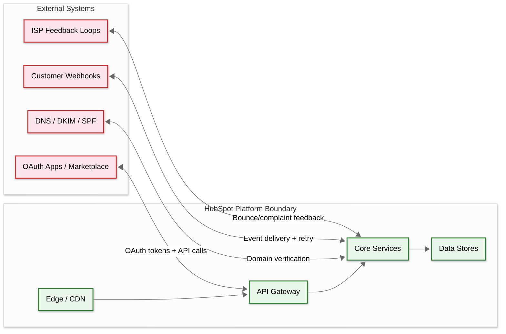

# Interview Guide

## Interview Pacing (45-Minute Format)

| Time | Phase | Focus | Key Points |
|---|---|---|---|
| 0-5 min | **Clarify** | Scope the problem | Ask: CRM focus? Marketing automation? Full platform? What scale? |
| 5-10 min | **Requirements** | Functional + non-functional | Core objects, workflow engine, email delivery, multi-tenancy |
| 10-20 min | **High-Level Design** | Architecture + data flow | Microservices, event-driven (Kafka), Hublet architecture, data stores |
| 20-35 min | **Deep Dive** | 1-2 critical components | Workflow swimlanes OR CRM hotspot prevention OR email delivery |
| 35-42 min | **Scale & Trade-offs** | Bottlenecks, failure modes | HBase scaling, cross-region replication, noisy-neighbor isolation |
| 42-45 min | **Wrap Up** | Summary + open questions | Mention what you'd explore with more time |

---

## Meta-Commentary: What Makes This Problem Unique

### Why HubSpot Is a Great Interview Problem

1. **Multi-domain complexity**: Combines CRM data modeling, workflow orchestration, email infrastructure, and analytics — tests breadth
2. **Noisy-neighbor problem**: The swimlane architecture is a non-obvious solution to a real distributed systems challenge
3. **Flexible schema design**: How to model custom objects/properties at scale touches fundamental data modeling trade-offs
4. **Multi-tenancy at the infrastructure level**: Hublets are a radically different approach from Salesforce's shared-schema model
5. **Event-driven architecture**: Every CRM mutation fans out to multiple consumers — tests understanding of eventual consistency

### Where to Spend Most Time

**If the interviewer asks about marketing automation**: Focus on the workflow engine — DAG execution, Kafka swimlanes, delayed action scheduling, and enrollment deduplication.

**If the interviewer asks about CRM**: Focus on data modeling — HBase row key design, custom objects/properties, associations, search indexing, and hotspot prevention.

**If the interviewer asks about scale**: Focus on the Hublet architecture — full-pod isolation, VTickets for global uniqueness, cross-region replication via S3, and Kafka aggregation/deaggregation.

---

## Trade-offs Discussion

### Trade-off 1: Hublet Architecture vs. Shared Multi-Tenancy

| Factor | Hublets (HubSpot) | Shared Schema (Salesforce) |
|---|---|---|
| **Pros** | Complete data isolation; GDPR compliance is straightforward; blast radius contained to one Hublet; independent scaling per region | More efficient resource utilization; simpler deployment (one instance); no data duplication across regions |
| **Cons** | Massive infrastructure duplication; every feature must work in every Hublet; cross-region data sharing is complex | Single-tenant bug can affect all; row-level security is complex to audit; harder to guarantee data residency |
| **Recommendation** | **Hublets** for platforms with strict data residency requirements and large-enough customer base to justify duplication costs |

### Trade-off 2: HBase vs. PostgreSQL JSONB for CRM Objects

| Factor | HBase (Wide-Column) | PostgreSQL JSONB (Hybrid) |
|---|---|---|
| **Pros** | Unlimited horizontal scale; wide-column model natural for flexible properties; single-row atomic operations; proven at HubSpot's scale (25M+ req/sec) | Richer query capabilities (SQL joins, complex filters); GIN indexes for JSONB are 15,000x faster than EAV; familiar tooling |
| **Cons** | No SQL joins (must denormalize); limited secondary indexing; requires separate search index for filtering | Harder to scale horizontally (needs Citus or similar); JSONB updates lock entire row; vertical scaling limits |
| **Recommendation** | **HBase** when scale exceeds what a single PostgreSQL cluster can handle (>1M QPS); **PostgreSQL JSONB** for most startups building a CRM up to ~100K QPS |

### Trade-off 3: Kafka Swimlanes vs. Priority Queues

| Factor | Kafka Swimlanes | Priority Queue (Single Topic) |
|---|---|---|
| **Pros** | True isolation — slow consumers don't block fast ones; independent scaling per swimlane; per-customer isolation possible | Simpler architecture; fewer topics to manage; priority ordering within a single queue |
| **Cons** | Increased topic management complexity (~12 active swimlanes); routing logic adds latency; harder to implement strict ordering | Head-of-line blocking; one slow consumer affects all; difficult to scale a single priority dimension |
| **Recommendation** | **Swimlanes** when you have diverse action types with different latency profiles and noisy-neighbor risk |

### Trade-off 4: EAV vs. JSONB vs. Wide-Column for Custom Properties

| Factor | EAV | JSONB | Wide-Column (HBase) |
|---|---|---|---|
| **Pros** | Maximum flexibility; granular row-level locking | 15,000x faster queries than EAV; 3x less storage; single-write updates | Unlimited columns per row; horizontal scaling; atomic row operations |
| **Cons** | Requires pivot queries (expensive joins); massive storage overhead | Heavier row-level locks on updates; harder to scale horizontally | No SQL; limited secondary indexing; requires separate search layer |
| **Recommendation** | **Never EAV** for new systems; **JSONB** up to moderate scale; **Wide-column** for massive scale |

### Trade-off 5: Real-Time vs. Batch Lead Scoring

| Factor | Real-Time (Event-Driven) | Batch (Periodic Recalculation) |
|---|---|---|
| **Pros** | Immediate score updates on high-signal events; enables instant workflow triggers; better user experience | Simpler to implement; better for compute-heavy ML models; consistent scoring across all contacts |
| **Cons** | Higher infrastructure cost; complex event processing; potential score inconsistency during rapid events | Score staleness; delayed workflow triggers; poor for time-sensitive actions |
| **Recommendation** | **Hybrid** — real-time updates for high-signal events (demo request, pricing page visit) + daily batch recalculation for comprehensive scoring |

---

## Trap Questions & How to Handle

| Trap Question | What Interviewer Wants | Best Answer |
|---|---|---|
| **"Why not just use PostgreSQL for everything?"** | Understand when relational DB breaks down | "PostgreSQL works great to ~100K QPS with Citus. HubSpot chose HBase for CRM objects because they need 25M+ req/sec peak with unlimited horizontal scaling. The trade-off is losing SQL joins, which they compensate with a separate search index and event-driven denormalization." |
| **"How do you handle a customer enrolling 1M contacts in a workflow at once?"** | Test noisy-neighbor thinking | "This is exactly why the swimlane architecture exists. Bulk enrollments are automatically routed to an overflow swimlane with dedicated consumers. Per-customer rate limits (500/sec AND 1,000/min) throttle the customer without affecting others. During incidents, ops can assign the customer to a fully isolated swimlane." |
| **"What if the workflow engine goes down?"** | Test durability and recovery thinking | "Workflow state is persisted to the database before acknowledging the Kafka message. If the engine crashes, uncommitted work is retried from Kafka. All actions are idempotent — retrying a 'send email' checks the dedup key before actually sending. Recovery is automatic when new workers come up." |
| **"Why not use Temporal.io instead of building a custom workflow engine?"** | Test build-vs-buy reasoning | "Temporal would work well for a new system. HubSpot built their engine before Temporal existed, and it's deeply integrated with Kafka swimlanes for noisy-neighbor isolation — something Temporal doesn't provide out of the box. For a new marketing automation platform, I'd seriously evaluate Temporal for the durable execution guarantees." |
| **"How do you prevent the same contact from getting the same email twice?"** | Test idempotency understanding | "Three layers: (1) Workflow enrollment dedup — atomic insert with ON CONFLICT prevents double enrollment. (2) Email send dedup — (campaign_id, contact_id) composite key checked before SMTP handoff. (3) Kafka at-least-once + idempotent actions — every action checks if it's already been executed before proceeding." |
| **"What happens when Gmail starts rejecting your emails?"** | Test email deliverability knowledge | "The ISP throttler detects 421/450 responses and automatically reduces the sending rate to Gmail. Affected emails are requeued with exponential backoff. We monitor bounce and complaint rates per ISP. If an IP gets blacklisted, we rotate to a clean IP from the pool. Long-term, we maintain sender reputation through authentication (SPF/DKIM/DMARC), list hygiene, and keeping complaint rates below 0.3%." |
| **"How do you handle 100x scale?"** | Forward-thinking architecture | "The Hublet architecture already handles this — spin up new Hublets (na2, na3) and route new customers there. HBase scales linearly by adding RegionServers. Vitess adds shards transparently. Kafka scales by adding partitions and brokers. The real Slowest part of the process at 100x is the cross-region replication via S3 — at that scale, you'd need a dedicated replication service with higher throughput guarantees." |

---

## Common Mistakes to Avoid

| Mistake | Why It's Wrong | Better Approach |
|---|---|---|
| **Designing a single-DB architecture** | Can't handle 25M+ req/sec | Polyglot persistence: HBase for objects, Vitess for metadata, Kafka for events |
| **Ignoring noisy-neighbor isolation** | One large customer degrades all | Swimlanes, quotas, rate limits, and Hublet-level isolation |
| **Single Kafka topic for all workflow actions** | Head-of-line blocking | Multiple swimlanes routed by action type and latency prediction |
| **Synchronous email sending** | Blocks workflow execution | Async email pipeline: queue to Kafka, render in parallel, throttle per ISP |
| **Ignoring email deliverability** | Emails land in spam | SPF/DKIM/DMARC, IP warming, ISP throttling, reputation monitoring |
| **No idempotency on workflow actions** | Duplicate emails on retry | Dedup keys: (campaign_id, contact_id) for emails; (enrollment_id, node_id) for actions |
| **Using EAV for custom properties** | 15,000x slower queries | JSONB for moderate scale, wide-column for massive scale |
| **Ignoring cross-region complexity** | Data consistency issues | VTickets for global IDs, S3-based replication, Kafka aggregation |

---

## Questions to Ask the Interviewer

| Question | Why It Matters | How It Changes Design |
|---|---|---|
| "What's the expected customer count and average contacts per customer?" | Determines data model scale | < 10K customers → single PostgreSQL; > 100K → HBase/Vitess |
| "Do we need multi-region data residency?" | Determines isolation strategy | No → shared infra; Yes → Hublet architecture |
| "What's the email volume and deliverability SLA?" | Determines email infra complexity | < 1M/month → use SendGrid; > 100M/month → own MTA fleet |
| "Real-time or eventual consistency for CRM reads?" | Determines caching strategy | Strong → no cache or short TTL; Eventual → aggressive caching |
| "Do we need custom code execution in workflows?" | Determines sandbox requirements | No → simple action executor; Yes → sandboxed container runtime |
| "What's the ratio of workflow-triggered vs. scheduled emails?" | Determines queue architecture | Mostly triggered → event-driven; Mostly scheduled → batch job scheduler |
| "How important is email deliverability vs. throughput?" | Drives ISP throttling architecture | Deliverability-first → per-ISP rate limits, IP reputation management |
| "Are there regulatory requirements (GDPR, HIPAA)?" | Determines isolation architecture | GDPR → Hublet per region; HIPAA → additional encryption + BAA |

---

## Scoring Rubric (For Interviewers)

| Dimension | Strong Signal | Weak Signal |
|-----------|--------------|-------------|
| **Requirements** | Identifies CRM + workflow + email as distinct subsystems with different requirements | Treats as monolithic "CRM system" |
| **Data Model** | Discusses flexible schema (HBase wide-column or JSONB); explains row key design | Uses rigid relational schema; doesn't address custom properties |
| **Event-Driven** | Kafka as central event bus; explains fan-out to multiple consumers | Synchronous request-response for everything; no event bus |
| **Noisy Neighbor** | Identifies bulk enrollment problem; proposes swimlane or priority mechanism | Single queue; no isolation between tenants |
| **Email** | Mentions ISP throttling, deliverability, SPF/DKIM, bounce handling | "Just use an SMTP library" |
| **Multi-Tenancy** | Discusses Hublet vs. shared-schema trade-offs; addresses data residency | No multi-tenancy consideration |
| **Idempotency** | Identifies duplicate email risk; proposes dedup at enrollment + action levels | No mention of idempotency or at-least-once semantics |
| **Scale** | Provides capacity estimates; discusses HBase/Vitess scaling strategies | Vague "we'll scale as needed" |

---

## Quick Reference Card

```
HubSpot System Design — Key Numbers
─────────────────────────────────────
Customers:    268K+ paying, 135+ countries
Revenue:      $3.13B (FY 2025)
Services:     3,000+ microservices (all Java/Dropwizard)
Deploy:       9,000+ deployable units, 1M+ builds/day

Data Layer:
  Vitess:     1,000+ MySQL clusters, 750+ shards/DC, ~1M QPS
  HBase:      100 clusters, 7,000+ RegionServers, 25M+ peak QPS
  Kafka:      80 clusters, ~4,000 topics

Key Features:
  CRM:        38+ object types, custom objects, bidirectional associations
  Workflows:  DAG-based, Kafka swimlanes (~12), 100M+ actions/day
  Email:      400M+/month, ISP throttling, SPF/DKIM/DMARC
  Scoring:    Rule-based + AI, behavioral + demographic, decay

Architecture Patterns:
  Multi-tenancy:  Hublets (full-pod isolation per region)
  Event bus:      Kafka everywhere, all mutations → events
  Hotspot fix:    Client-side dedup (100ms window) + dedicated dedup service
  Global IDs:     VTickets (ZooKeeper-backed, <5% overconsumption)
  Cross-region:   MySQL replication via S3, Kafka aggregation/deaggregation
  Edge routing:   Cloudflare Workers, Hublet ID embedded in API keys
```

---

## Follow-Up Deep Dives

### Deep Dive 1: Email Deliverability Architecture

If the interviewer probes email at depth, walk through the full delivery stack:

```
Email Delivery Timeline:
  0ms:    Workflow action triggers email send
  1ms:    Dedup check: (campaign_id, contact_id) → already sent?
  5ms:    Compliance check: consent, suppression list, unsubscribe
  10ms:   Template rendered with contact merge data
  15ms:   ISP router determines target domain (gmail.com, outlook.com)
  20ms:   IP pool selects sending IP based on reputation score
  25ms:   ISP throttler checks per-domain rate limit
  25ms+:  If under limit → queue for SMTP delivery
  25ms+:  If over limit → requeue with backoff timer
  50ms:   SMTP connection established (connection pooling per ISP)
  100ms:  Email delivered to ISP → 250 OK response
  ---
  5min+:  Open/click tracking events begin arriving
  24hrs:  Final deliverability metrics available (inbox vs. spam)

Key metrics per ISP:
  - Delivery rate (should be > 99%)
  - Bounce rate (hard: < 0.5%, soft: < 3%)
  - Complaint rate (< 0.1% — Google requires < 0.3%)
  - Open rate (proxy-adjusted, Apple MPP filtering)
```

### Deep Dive 2: Workflow DAG Execution Model

```
Workflow DAG Structure:
  - Directed Acyclic Graph of nodes
  - Node types: trigger, condition, action, delay, branch, goal
  - Each enrollment is an independent traversal of the DAG
  - State persisted at each node (current_node_id + enrollment state)

Execution Model:
  1. Trigger fires (CRM event matches enrollment criteria)
  2. Enrollment created: (workflow_id, contact_id, current_node=root)
  3. Executor advances to next node:
     - Action node → route to appropriate swimlane → execute → advance
     - Condition node → evaluate → follow true/false branch → advance
     - Delay node → persist next_action_at → timer service will resume
     - Branch node → evaluate condition → follow matching branch
     - Goal node → check goal criteria → if met, complete enrollment

Concurrency Model:
  - One enrollment = one contact in one workflow
  - Multiple enrollments can be active simultaneously for same contact (different workflows)
  - Same workflow, same contact: re-enrollment configurable (allow/block/restart)
  - Atomic enrollment creation: INSERT ON CONFLICT prevents duplicates
```

### Deep Dive 3: VTickets (Globally Unique IDs)

```
VTickets Architecture:
  Layer 1: Global ZooKeeper
    - Maintains global counter ranges
    - Each datacenter requests a range (e.g., 1M IDs at a time)
    - Infrequent coordination (when range exhausted)

  Layer 2: Datacenter Cache
    - Each DC has a local cache of ID ranges
    - Subdivides range across database primaries
    - Zero cross-DC coordination for normal operations

  Layer 3: Database Primary
    - Each MySQL primary has a pre-allocated ID range
    - Local auto-increment within the range
    - When range exhausted, request new range from DC cache

  ID Format:
    ┌───────────┬───────────┬──────────────┐
    │ DC prefix │ Shard ID  │ Local auto-  │
    │ (4 bits)  │ (12 bits) │ increment    │
    └───────────┴───────────┴──────────────┘

  Properties:
    - Globally unique (DC prefix guarantees cross-DC uniqueness)
    - Roughly time-ordered (local auto-increment is sequential)
    - Compact (64-bit integer, good for B-tree indexes)
    - Zero coordination overhead (ranges pre-allocated)
    - 0.52-4.16% ID overconsumption (acceptable waste)
```

---

## Architecture Comparison Matrix

| Dimension | HubSpot | Salesforce | Zoho CRM | Intercom |
|-----------|---------|------------|----------|----------|
| **Multi-tenancy** | Hublet (full infra isolation) | Shared schema (UDD/pivoted) | Hybrid (shared + dedicated) | Shared infra, logical isolation |
| **CRM storage** | HBase (wide-column) | Custom (MT_Data pivoted EAV) | PostgreSQL + proprietary | MongoDB + PostgreSQL |
| **Event bus** | Kafka (80 clusters) | Internal message bus | Proprietary | Redis Streams + SQS |
| **Workflow engine** | Custom (Kafka swimlanes) | Salesforce Flow (metadata-driven) | Custom (process engine) | Custom (series/rules) |
| **Email delivery** | Custom SMTP fleet | Via SendGrid/custom | Custom | Custom + third-party |
| **Scale** | 268K+ customers | 150K+ orgs | 90M+ users | 25K+ customers |
| **Language** | Monoglot Java | Multi (Java, Scala, etc.) | Multi (Java, Go) | Ruby on Rails → microservices |

---

## Anti-Patterns to Avoid

| Anti-Pattern | Why It Fails | Better Approach |
|-------------|-------------|-----------------|
| **Single Kafka topic for all workflow actions** | Head-of-line blocking; bulk enrollment starves real-time triggers | Swimlane architecture with per-type consumer pools |
| **Synchronous email sending in workflow execution** | Blocks workflow advancement; SMTP is slow and unreliable | Async email pipeline: queue to Kafka → render → throttle per ISP → SMTP |
| **Using UUID for all primary keys** | 128-bit, non-sequential, poor B-tree locality | VTickets: compact, sequential, globally unique without coordination |
| **Shared database across regions** | GDPR violation; cross-region latency; single point of failure | Hublet architecture: full infrastructure isolation per region |
| **Direct HBase reads without dedup** | Thundering herd on popular objects (25M+ req/sec) | Client-side dedup with 100ms window; dedicated dedup service for hot objects |
| **EAV model for custom properties** | 15,000x slower queries than alternatives | HBase wide-column (unlimited properties per row) or PostgreSQL JSONB |
| **Ignoring ISP rate limits** | Degraded sender reputation → emails land in spam | Per-ISP throttling with automatic backoff on 421/450 responses |
| **Polling database for every workflow timer** | O(N) scan for millions of delayed enrollments | Partitioned polling with B-tree index on (next_action_at, status) |

---

## Complexity Budget (Interview Duration)

| Duration | What to Cover | What to Skip |
|----------|--------------|-------------|
| **30 minutes** | Requirements → CRM data model → event-driven architecture → one deep dive (swimlanes OR email) | Cross-region, VTickets, lead scoring, detailed security |
| **45 minutes** | Requirements → full architecture → swimlanes + CRM hotspotting → Hublet isolation → capacity | VTickets internals, detailed email deliverability, ML scoring |
| **60 minutes** | Everything above + VTickets + email deliverability + lead scoring + security/compliance + evolution | None—cover all dimensions; explore scaling to 100x |

---

## Whiteboard Sketch Sequence

1. **Start with the event-driven backbone**: CRM → Kafka → Consumers (workflow, search, analytics, webhooks)
2. **Add the CRM data model**: HBase (wide-column) + Vitess/MySQL (relational metadata)
3. **Add the workflow engine detail**: Swimlane router → multiple Kafka topics → per-type consumer pools
4. **Add the email pipeline**: Template render → ISP router → IP pool → SMTP → feedback loop
5. **Add the Hublet boundary**: Show na1 and eu1 as complete, independent copies
6. **Add cross-region replication**: S3-based MySQL replication + Kafka aggregation/deaggregation
7. **Add the dedup layer**: Client-side dedup service between microservices and HBase

---

## Evolution Path

| Scale Milestone | Key Changes | New Challenges |
|----------------|------------|----------------|
| **10× (2.7M customers)** | Add 3-4 new Hublets (APAC, LATAM); increase HBase clusters per Hublet from 100 → 300; expand Kafka swimlanes from 5 → 15 types | Cross-Hublet account migration; global reporting across Hublets; SMTP IP pool management at 4B emails/month |
| **100× (27M customers)** | Federated architecture across 20+ Hublets; dedicated Hublets for top-100 customers; ML-driven workflow routing replacing static swimlanes; edge-computed lead scoring | Hublet-to-Hublet data federation for multi-region enterprises; workflow versioning across billions of enrollments; custom code sandbox isolation at 100× scale |

---

## System Boundary Diagram



---

## Key Trade-off Decisions

| Decision | Option A | Option B | HubSpot's Choice | Why |
|----------|----------|----------|-------------------|-----|
| CRM storage engine | Relational (MySQL) | Wide-column (HBase) | **HBase** for CRM objects; MySQL for metadata | Unlimited custom properties without schema migration |
| Multi-tenancy | Shared schema + row-level isolation | Full infrastructure isolation (Hublets) | **Hublets** | GDPR compliance; blast radius containment; simpler operations |
| ID generation | UUID v4 | Custom sequential (VTickets) | **VTickets** | Better B-tree locality; compact storage; no coordination |
| Workflow execution | Synchronous chain | Async event-driven (Kafka swimlanes) | **Kafka swimlanes** | Noisy-neighbor isolation; backpressure per action type |
| Email delivery | Third-party (SendGrid, Mailgun) | Custom SMTP infrastructure | **Custom** | Full control over IP reputation, ISP relationships, deliverability |
