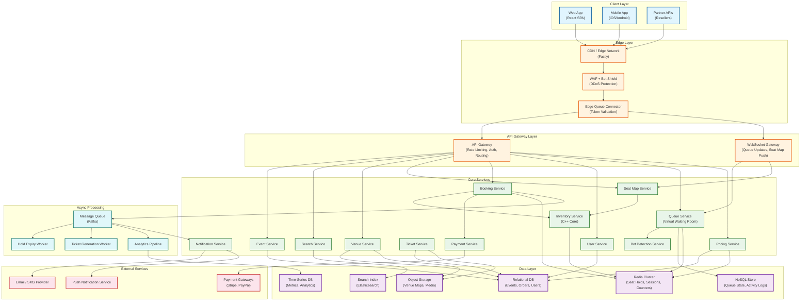
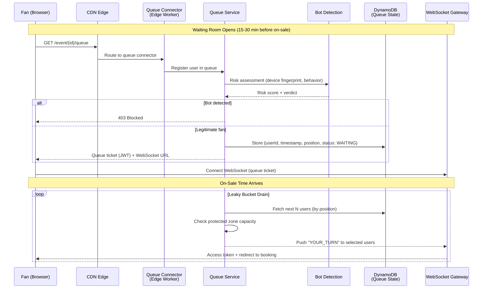
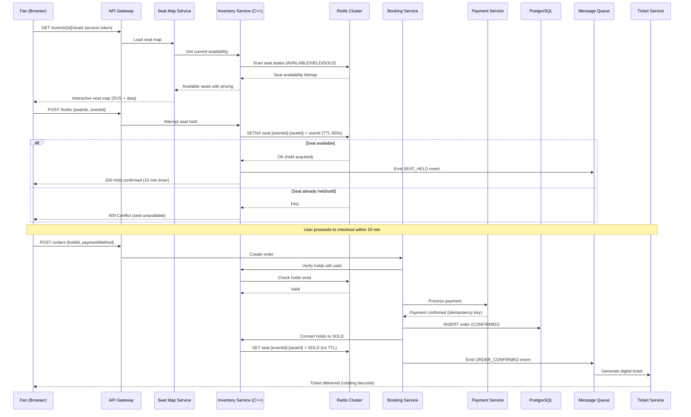
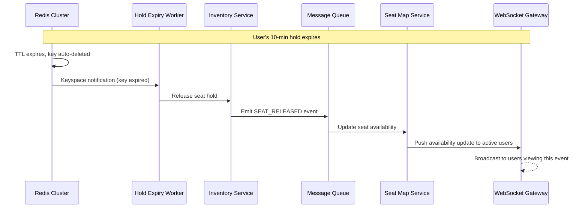
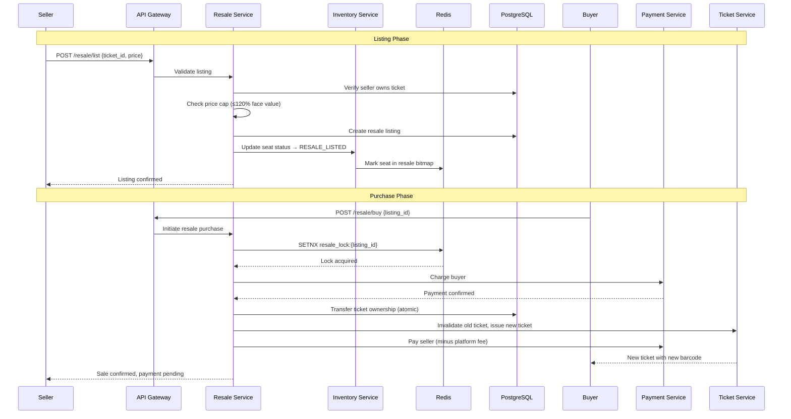
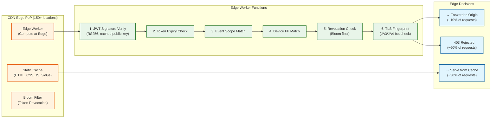

# High-Level Design

## 1. System Architecture

---

## 2. Data Flow: High-Demand On-Sale

### Phase 1: Pre-Sale Queue Formation

### Phase 2: Seat Selection & Booking

### Phase 3: Hold Expiry (Unhappy Path)

---

## 3. Key Architectural Decisions

### Decision 1: Microservices vs. Monolith

| Aspect | Decision | Justification |
|--------|----------|---------------|
| **Architecture** | **Microservices** with a **monolithic Inventory Core** | The Inventory Core (C++ with assembly) is the hot path -- it must be low-latency and co-located with Redis. Other services (Event, Search, User) scale independently. |
| **Why not full microservices?** | Inventory operations require sub-millisecond coordination | Decomposing seat holds across services adds network hops and distributed transaction complexity |
| **Why not monolith?** | Search, events, notifications have different scaling profiles | On-sale traffic hits Inventory 1000x harder than Event Management |

### Decision 2: Synchronous vs. Asynchronous Communication

| Flow | Pattern | Justification |
|------|---------|---------------|
| Seat hold (SETNX) | **Synchronous** | User needs immediate confirmation; <50ms target |
| Payment processing | **Synchronous** (with timeout) | Must confirm payment before converting hold to sold |
| Ticket generation | **Asynchronous** (via queue) | Can tolerate seconds of delay after payment |
| Seat map updates | **Async push** (WebSocket) | Real-time but eventual; brief staleness acceptable |
| Analytics/logging | **Asynchronous** (fire-and-forget) | Not on critical path |
| Queue position updates | **Async push** (WebSocket) | Periodic updates, not per-change |

### Decision 3: Database Choices

| Data | Store | Justification |
|------|-------|---------------|
| Seat holds (ephemeral) | **Redis Cluster** | Sub-ms SETNX, native TTL, 100K+ ops/sec per shard |
| Queue state | **NoSQL (DynamoDB-style)** | High write throughput, auto-scaling, single-table design |
| Events, orders, users | **Relational DB (PostgreSQL)** | ACID transactions, complex queries, referential integrity |
| Event search | **Search Index (Elasticsearch)** | Full-text search, faceting, geo-queries |
| Venue maps, media | **Object Storage** | Large binary assets, CDN-friendly |
| Metrics, analytics | **Time-Series DB** | Efficient time-range queries, downsampling |

### Decision 4: Caching Strategy

| Layer | What | TTL | Invalidation |
|-------|------|-----|-------------|
| **CDN Edge** | Static venue maps, event pages, JS/CSS | 5-60 min | Surrogate keys + instant purge |
| **Edge Worker Cache** | Queue token validation | 30s | Short TTL, rebuild on miss |
| **Redis L1** | Active seat maps (bitmap), hold state | Real-time | Write-through on state change |
| **Application Cache** | Event metadata, pricing tiers | 5 min | TTL + event-driven invalidation |
| **Search Cache** | Popular search results | 1 min | Short TTL for freshness |

### Decision 5: Queue Model -- Push vs. Pull

| Aspect | Decision | Justification |
|--------|----------|---------------|
| Queue position | **Server-push via WebSocket** | Reduces polling load; 14M users polling every second = catastrophic |
| Seat availability | **Server-push via WebSocket** | Real-time updates prevent users from selecting unavailable seats |
| Queue entry | **Client-initiated (pull)** | User must actively join; prevents auto-enrollment attacks |

---

## 4. Architecture Pattern Checklist

| Pattern | Decision | Notes |
|---------|----------|-------|
| Sync vs Async | **Hybrid** | Sync for holds/payments; async for notifications/analytics |
| Event-driven vs Request-response | **Both** | Request-response for booking; event-driven for state propagation |
| Push vs Pull | **Push** (WebSocket) | Queue updates, seat availability pushed to clients |
| Stateless vs Stateful | **Stateless services** + **stateful Redis/DB** | Services scale horizontally; state lives in Redis/DB |
| Read-heavy vs Write-heavy optimization | **Write-heavy** for on-sales | Redis as write buffer; reads served from CDN/cache |
| Real-time vs Batch | **Real-time** for booking | Batch for analytics, reporting, settlement |
| Edge vs Origin | **Edge** for queue validation + static content | Origin for booking/payment (requires strong consistency) |

---

## 5. Component Responsibilities

| Service | Responsibility | Scale Profile |
|---------|---------------|---------------|
| **Queue Service** | Virtual waiting room, position tracking, admission control | Spiky: 0 to millions in seconds |
| **Bot Detection** | Device fingerprinting, behavioral analysis, risk scoring | Inline with queue joins |
| **Inventory Service** | Seat state machine (Available -> Held -> Sold), atomic holds | Extreme contention |
| **Seat Map Service** | Venue layout, pricing overlay, availability visualization | Read-heavy during on-sale |
| **Booking Service** | Order lifecycle, payment orchestration, confirmation | Write-heavy during on-sale |
| **Payment Service** | Payment gateway abstraction, idempotency, retry | External dependency Slowest part of the process |
| **Event Service** | Event CRUD, venue assignment, sale window configuration | Low frequency, admin-facing |
| **Pricing Service** | Dynamic pricing, tier management, platinum seats | Pre-computed, read during checkout |
| **Search Service** | Full-text search, filtering, geo-queries | Steady, cache-friendly |
| **Ticket Service** | Digital ticket generation, rotating barcodes, delivery | Async post-purchase |
| **Notification Service** | Email, SMS, push for confirmations and queue updates | Async, high volume during on-sales |

---

## 6. Event-Level Isolation Architecture

For mega on-sales, the system deploys event-level isolation -- a dedicated resource pool per high-demand event that prevents cross-event interference:

```mermaid
flowchart TB
    subgraph SharedPool["Shared Infrastructure<br/>(All Tier 3-4 Events)"]
        SP_REDIS["Redis Cluster<br/>(6 nodes, shared)"]
        SP_APP["App Pool<br/>(10 instances)"]
        SP_DB["PostgreSQL<br/>(shared read replicas)"]
    end

    subgraph EventA["Mega Event A Isolation<br/>(Taylor Swift - MetLife)"]
        EA_REDIS["Redis Cluster<br/>(20 nodes, dedicated)"]
        EA_APP["App Pool<br/>(200 instances)"]
        EA_WS["WebSocket Pool<br/>(150 servers)"]
        EA_PAY["Payment Router<br/>(Multi-gateway, 500 TPS)"]
    end

    subgraph EventB["High Event B Isolation<br/>(Drake - MSG)"]
        EB_REDIS["Redis Cluster<br/>(10 nodes, dedicated)"]
        EB_APP["App Pool<br/>(50 instances)"]
        EB_WS["WebSocket Pool<br/>(40 servers)"]
        EB_PAY["Payment Router<br/>(200 TPS)"]
    end

    subgraph Shared["Shared Data Layer"]
        PG["PostgreSQL Primary<br/>(Orders, Users)"]
        SEARCH["Search Index"]
        BLOB["Object Storage"]
    end

    EA_APP --> PG
    EB_APP --> PG
    SP_APP --> PG
    EA_APP --> SEARCH
    EB_APP --> SEARCH
    SP_APP --> SEARCH

    classDef shared fill:#e8f5e9,stroke:#2e7d32,stroke-width:2px
    classDef mega fill:#fce4ec,stroke:#c62828,stroke-width:2px
    classDef high fill:#fff3e0,stroke:#e65100,stroke-width:2px
    classDef data fill:#f3e5f5,stroke:#6a1b9a,stroke-width:2px

    class SP_REDIS,SP_APP,SP_DB shared
    class EA_REDIS,EA_APP,EA_WS,EA_PAY mega
    class EB_REDIS,EB_APP,EB_WS,EB_PAY high
    class PG,SEARCH,BLOB data
```

**Key Isolation Principles:**

| Dimension | Isolated Per Event | Shared Across Events |
|-----------|-------------------|---------------------|
| **Redis (seat holds)** | Mega/High events get dedicated clusters | Tier 3-4 events share a cluster |
| **App servers** | Dedicated pool sized by demand prediction | Shared pool with auto-scaling |
| **WebSocket** | Dedicated WS servers per on-sale | Shared for general notifications |
| **Payment routing** | Per-event gateway allocation with circuit breakers | Shared gateway pool |
| **Database** | Shared primary (orders are durable, low-contention post-Redis) | Shared |
| **CDN / Edge** | Event-specific cache warming + edge functions | Shared CDN infrastructure |

---

## 7. Resale Marketplace Flow

The secondary marketplace creates a second booking flow with different constraints:

**Resale-Specific Constraints:**

| Constraint | Implementation |
|-----------|----------------|
| **Price cap** | Resale ≤ 120% of face value (platform-enforced, configurable per event) |
| **Identity transfer** | Old barcode invalidated; new barcode issued to buyer |
| **Platform fee** | 10-15% of resale price deducted from seller payout |
| **Seller verification** | Must be original purchaser (anti-scalper measure) |
| **Cooling period** | No resale within 48 hours of purchase (prevents automated flipping) |
| **Event-day cutoff** | Resale closes 2 hours before event start |

---

## 8. CDN Edge Computing Deep Dive

The CDN edge handles the vast majority of request volume during on-sales, making it a critical architectural layer:

**Edge Traffic Reduction:**

| Traffic Type | % of Total | Handled At | Origin Impact |
|-------------|-----------|-----------|---------------|
| Static assets (JS, CSS, SVG) | ~30% | CDN cache | Zero |
| Waiting room page loads | ~25% | CDN cache | Zero |
| Invalid/expired tokens | ~20% | Edge worker | Zero |
| Bot traffic (TLS fingerprint) | ~15% | Edge worker | Zero |
| Legitimate booking requests | ~10% | Origin | Full processing |

During a mega on-sale with 3.5B requests, only ~350M reach the origin. The CDN absorbs a 10x amplification factor.

---

## 9. Technology Comparison: Ticketing Platforms

| Aspect | Ticketmaster (This Design) | SeatGeek | StubHub | Eventbrite |
|--------|---------------------------|----------|---------|------------|
| **Primary use case** | Primary + resale | Aggregator + resale | Resale marketplace | Self-service events |
| **Contention model** | Redis SETNX (extreme) | DB-level OCC (moderate) | No primary sale contention | Low contention |
| **Queue system** | Virtual waiting room + leaky bucket | Queue-it integration | Not needed (resale) | Not needed |
| **Inventory ownership** | Platform controls primary inventory | Aggregates from partners | Seller-listed only | Organizer-managed |
| **Bot challenge** | 8.7B blocked/month | Moderate | Moderate | Low |
| **Scale trigger** | Single mega event (14M concurrent) | Search aggregation | Listing volume | Event creation volume |
| **Architecture model** | Active-passive (strong consistency for seats) | Active-active (eventual for search) | Active-active (marketplace) | Multi-tenant SaaS |
| **CDN strategy** | Fastly + edge compute | Standard CDN | Standard CDN | Standard CDN |

---

## 10. Event Lifecycle Data Flow

An event's lifecycle spans weeks to months, with different system components dominating at each phase:

```mermaid
flowchart LR
    subgraph Create["Event Creation<br/>(Weeks Before)"]
        EC1["Venue configured"]
        EC2["Pricing set"]
        EC3["Sale window defined"]
    end

    subgraph PreSale["Pre-Sale Phase<br/>(Days Before)"]
        PS1["Verified Fan registration"]
        PS2["Demand prediction"]
        PS3["Resource pre-allocation"]
    end

    subgraph OnSale["On-Sale<br/>(Minutes)"]
        OS1["Queue opens"]
        OS2["Leaky bucket drains"]
        OS3["Seats held + sold"]
    end

    subgraph PostSale["Post-Sale<br/>(Days After)"]
        PO1["Resale marketplace"]
        PO2["Ticket delivery"]
        PO3["Reconciliation"]
    end

    subgraph EventDay["Event Day"]
        ED1["Gate scanning"]
        ED2["Rotating barcodes"]
        ED3["Real-time attendance"]
    end

    Create --> PreSale --> OnSale --> PostSale --> EventDay

    classDef create fill:#e1f5fe,stroke:#01579b,stroke-width:2px
    classDef presale fill:#fff3e0,stroke:#e65100,stroke-width:2px
    classDef onsale fill:#fce4ec,stroke:#c62828,stroke-width:2px
    classDef postsale fill:#e8f5e9,stroke:#2e7d32,stroke-width:2px
    classDef eventday fill:#f3e5f5,stroke:#6a1b9a,stroke-width:2px

    class EC1,EC2,EC3 create
    class PS1,PS2,PS3 presale
    class OS1,OS2,OS3 onsale
    class PO1,PO2,PO3 postsale
    class ED1,ED2,ED3 eventday
```

| Phase | Duration | Dominant Services | Traffic Profile |
|-------|----------|-------------------|----------------|
| **Event Creation** | Weeks | Event Service, Venue Service, Pricing Service | Low (admin-only) |
| **Pre-Sale** | Days | User Service (Verified Fan), Demand Prediction, Infrastructure Orchestrator | Low-moderate |
| **On-Sale** | Minutes to hours | Queue, Inventory, Booking, Payment, WebSocket | Extreme spike (1000x) |
| **Post-Sale** | Days to weeks | Resale, Ticket Service, Notification | Moderate, declining |
| **Event Day** | Hours | Ticket Validation (gate scanners), Attendance Tracking | Moderate, predictable |
