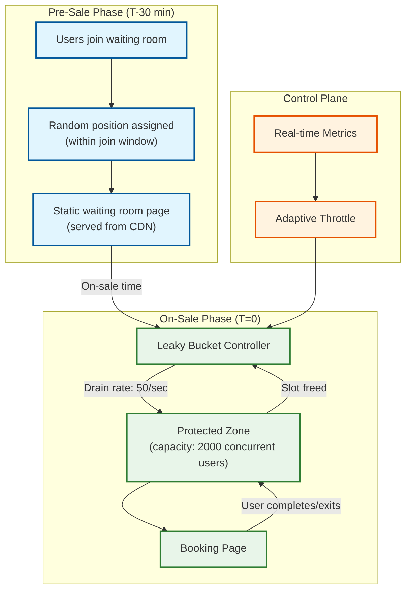
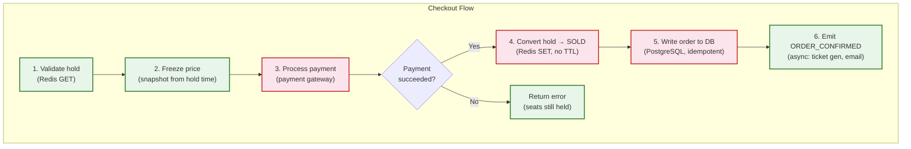
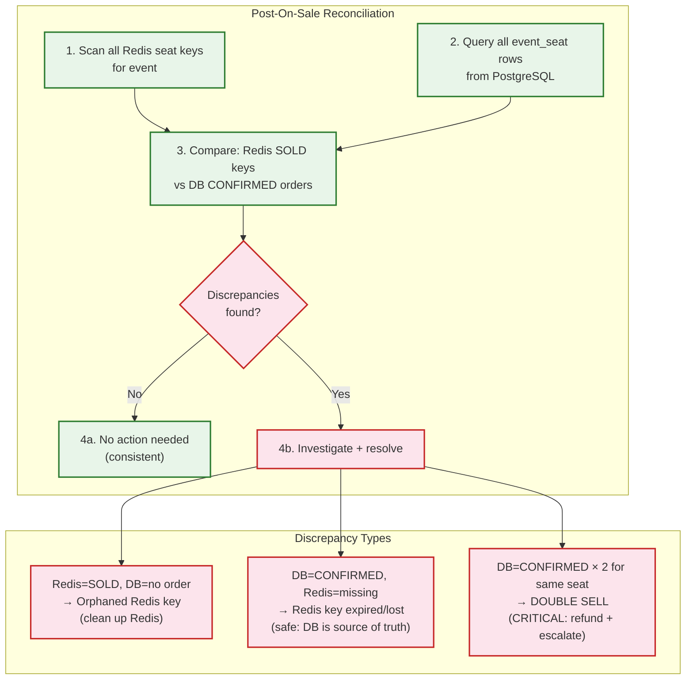

# Deep Dive & Bottlenecks

## 1. Critical Component: Seat Contention Engine

### Why This Is Critical

The seat contention engine is the single most important component in the entire system. During a mega on-sale, millions of users are simultaneously attempting to hold a finite number of seats. A single bug here means either **double-selling** (catastrophic: legal liability, refunds, angry fans) or **phantom unavailability** (seats appear unavailable but no one holds them, causing revenue loss).

### How It Works Internally

The contention engine operates as a two-tier system:

**Tier 1: Redis (Hot Path -- Sub-Millisecond)**

```
Layer: Redis Cluster (6+ nodes, 3 primaries + 3 replicas)
Data: seat:{event_id}:{seat_id} -> {user_id}:{hold_id}
Operation: SETNX + EXPIRE (atomic via Lua script)
Throughput: 100K+ operations/second per shard
Latency: <1ms for SETNX
```

The Redis layer absorbs ALL contention. When 50,000 users click on Seat A1 simultaneously, only one SETNX succeeds (atomic guarantee from Redis single-threaded execution). The other 49,999 get instant rejection -- no queuing, no blocking, no retry. This is fundamentally different from database-level locking where threads would queue up.

**Tier 2: PostgreSQL (Cold Path -- Confirmation)**

```
Layer: PostgreSQL (partitioned by event_id)
Data: event_seat table with status + version columns
Operation: UPDATE with optimistic locking (CAS on version)
Timing: Only after payment confirmed (seconds later)
Purpose: Durable record of sale, source of truth for reconciliation
```

The database is only written to after payment succeeds, when contention has already been resolved by Redis. This critical design choice moves the "hot spot" from a disk-based RDBMS to an in-memory store.

### Failure Modes

| Failure | Impact | Mitigation |
|---------|--------|------------|
| **Redis primary failure** | Held seats may be lost (auto-released) | Redis Sentinel failover (<30s); holds are ephemeral by design -- losing them is safe (seats become available again) |
| **Redis split-brain** | Two users might hold the same seat on different primaries | Use `WAIT` command to require replica acknowledgment; dual-write to backup Redis cluster |
| **TTL drift** | Holds expire at slightly different times across nodes | Use server-side timestamps; clock sync via NTP with <10ms drift tolerance |
| **Lua script timeout** | Atomic rollback hangs | Set lua-time-limit; implement client-side timeout with forced key deletion |
| **Network partition between Redis and app** | App thinks hold succeeded but Redis didn't persist | Read-after-write verification: after SETNX, immediately GET to confirm |

### Race Condition: The ABA Problem

```
Timeline:
T1: User A holds Seat 1 (key set with TTL=600s)
T2: User A's hold expires (key auto-deleted)
T3: User B holds Seat 1 (new key set)
T4: User A tries to checkout (hold_id references expired hold)

Solution: The hold_id in Redis value includes the user's hold UUID.
Checkout verifies: redis.GET(seat_key) == "{user_a_id}:{user_a_hold_id}"
This fails at T4 because the value is now "{user_b_id}:{user_b_hold_id}"
```

### Race Condition: Partial Hold Failure

```
Scenario: User wants seats [A1, A2, A3, A4]
- SETNX seat:A1 -> SUCCESS
- SETNX seat:A2 -> SUCCESS
- SETNX seat:A3 -> FAIL (someone else got it)
- SETNX seat:A4 -> not attempted

Problem: A1 and A2 are now held by a user who can't complete the booking

Solution: All-or-nothing pipeline with rollback
- Pipeline all SETNXs atomically
- Check all results
- If ANY failed, delete all that succeeded (using Lua for atomic CAS-delete)
- User gets immediate feedback: "Seat A3 is unavailable"
```

---

## 2. Critical Component: Virtual Waiting Room

### Why This Is Critical

Without the virtual waiting room, a mega on-sale becomes a race condition at the CDN/load balancer level -- bots always win because they're faster. The waiting room equalizes access by randomizing position during a join window (rather than rewarding speed) and controlling flow via a leaky bucket.

### How It Works Internally



**Key Design Decisions:**

1. **Random vs. FIFO (First-In-First-Out, like a line at a store) during join window**: Users who join within the first 15 minutes before on-sale get randomized positions. This prevents a "race to join" that bots would win. After the join window closes, late joiners get FIFO (First-In-First-Out, like a line at a store) positions after the randomized block.

2. **Static waiting room page on CDN**: The waiting room HTML/CSS/JS is a static page cached on the CDN edge. The only dynamic element is a WebSocket connection for position updates. This means 14M users hitting the waiting room costs almost nothing in origin compute.

3. **Edge-side token validation**: The CDN edge worker validates the access token (JWT) without hitting the origin. Invalid tokens are rejected at the edge, protecting the origin from bot traffic.

4. **Adaptive drain rate**: The leaky bucket drain rate adjusts based on real-time metrics:
   - If checkout completion rate drops → slow the drain (users are struggling)
   - If payment processor latency spikes → pause admission
   - If error rate exceeds threshold → pause and alert operators

### Failure Modes

| Failure | Impact | Mitigation |
|---------|--------|------------|
| **WebSocket disconnect** | User loses position updates | Client auto-reconnects with queue ticket (JWT); position preserved in DB |
| **Queue service crash** | Admission stops, users stuck | Stateless service with auto-restart; queue state in DynamoDB survives service restart |
| **CDN outage** | Waiting room page unavailable | Multi-CDN failover; waiting room hosted on separate CDN from main site |
| **DynamoDB throttling** | Position writes fail during surge | Pre-provisioned capacity for expected peak; DAX cache for reads |
| **Clock skew** | Position ordering inconsistent | Monotonic position counter (atomic increment) instead of timestamps |

### The "Retry Hell" Problem (Taylor Swift Lesson)

During the Eras Tour on-sale, the system failed to **reject new requests once capacity was exceeded**. Users who got errors kept retrying, multiplying request volume exponentially. The solution:

```
FUNCTION handle_queue_join(event_id, user_id):
    // Check if event is soldout or queue is closed
    IF is_sold_out(event_id) OR is_queue_closed(event_id):
        RETURN {status: "SOLD_OUT", retry: false}  // CRITICAL: retry=false

    // Check if user already in queue (idempotent join)
    existing = get_queue_entry(event_id, user_id)
    IF existing:
        RETURN {status: "ALREADY_QUEUED", position: existing.position}

    // Check queue capacity (hard limit)
    queue_size = get_queue_size(event_id)
    IF queue_size >= MAX_QUEUE_SIZE:
        RETURN {status: "QUEUE_FULL", retry_after: 300}  // Try again in 5 min

    // Admit to queue
    position = atomic_increment("queue_counter:{event_id}")
    insert_queue_entry(event_id, user_id, position)
    RETURN {status: "QUEUED", position: position}
```

The key insight: **every response must tell the client whether to retry**, and the system must have a hard cap on queue size to prevent unbounded growth.

---

## 3. Critical Component: Payment Processing Under Contention

### Why This Is Critical

Payment is the slowest operation on the critical path (3-5 seconds for payment gateway roundtrip) and occurs during the highest-contention window. It's also where the **hold-to-sold transition** happens -- the most dangerous state change in the system. If payment succeeds but the hold-to-sold write fails, you have a charged customer without tickets.

### How It Works Internally



### The Critical Window: Between Payment and Hold Conversion

```
DANGER ZONE:
    payment_result = payment_gateway.charge(amount, token)  // <-- SUCCESS
    // *** CRASH HERE = CHARGED BUT NO TICKET ***
    redis.SET(seat_key, "SOLD", no_ttl)                     // <-- MUST SUCCEED

SOLUTION: Idempotent Payment with Outbox Pattern

FUNCTION process_checkout(hold_id, payment_info):
    // Step 1: Create order record with PENDING status (idempotent via idempotency_key)
    order = db.INSERT_OR_GET("orders", {
        hold_id: hold_id,
        idempotency_key: payment_info.idempotency_key,
        status: "PAYMENT_PENDING",
        amount: calculate_total(hold_id)
    })

    IF order.status == "CONFIRMED":
        RETURN order  // Already completed (idempotent retry)

    // Step 2: Charge payment (idempotent via gateway idempotency key)
    payment = payment_gateway.charge({
        amount: order.amount,
        idempotency_key: order.order_id,  // Gateway deduplicates
        token: payment_info.token
    })

    IF payment.failed:
        db.UPDATE("orders", SET status="PAYMENT_FAILED", WHERE id=order.id)
        RETURN {error: "PAYMENT_FAILED", hold_still_valid: true}

    // Step 3: Atomic state transition (DB transaction)
    db.TRANSACTION:
        UPDATE orders SET status='CONFIRMED', payment_id=payment.id
            WHERE id = order.id AND status = 'PAYMENT_PENDING'
        INSERT INTO outbox (event_type, payload)
            VALUES ('ORDER_CONFIRMED', {order_id, seat_ids, ...})

    // Step 4: Convert Redis holds to SOLD (best-effort, outbox worker retries)
    FOR EACH seat_id IN order.seat_ids:
        redis.SET("seat:{event_id}:{seat_id}", "SOLD::{order.id}")
        redis.PERSIST("seat:{event_id}:{seat_id}")  // Remove TTL

    RETURN order
```

**Why the outbox pattern?** If the app crashes after Step 2 but before Step 3, the outbox worker detects the orphaned payment via reconciliation and completes the order. The payment gateway's idempotency key ensures the customer is never double-charged.

### Failure Modes

| Failure | Impact | Mitigation |
|---------|--------|------------|
| **Payment gateway timeout** | User uncertain if charged | Idempotency key ensures safe retry; show "processing" state |
| **Payment succeeds, app crashes** | Charged but no ticket | Outbox pattern + reconciliation worker detects orphaned payments |
| **Payment succeeds, Redis write fails** | Seat might become "available" again (hold TTL expires) | Reconciliation: DB is source of truth; Redis rebuilt from DB if inconsistent |
| **Double payment attempt** | Customer charged twice | Gateway idempotency key (order_id); database unique constraint on idempotency_key |
| **Payment processor cascade** | All checkouts fail (Eras Tour issue) | Multi-gateway fallback; circuit breaker per gateway; queue drain paused |

---

## 4. Slowest part of the process Analysis

### Slowest part of the process 1: Redis Hot Key (Popular Seats)

**Problem**: During a mega on-sale, front-row center seats might receive 100,000+ SETNX attempts per second on a single Redis key.

**Impact**: Single Redis shard overwhelmed; increased latency for ALL operations on that shard.

**Mitigation Strategies**:

| Strategy | How | Trade-off |
|----------|-----|-----------|
| **Hash tag routing** | Route all seats for a section to the same shard using `{section_id}` hash tags | Concentrates load but enables atomic multi-seat operations |
| **Best Available algorithm** | Instead of specific seat selection, offer "best available in section" which distributes load | Users lose individual seat choice |
| **Read replicas for availability** | Serve seat map reads from replicas; only writes to primary | Brief staleness (user might select a just-held seat) |
| **Pre-sharded seat pools** | Split inventory into pools (e.g., 500 seats per pool); distribute across shards | Slightly uneven pool depletion |

### Slowest part of the process 2: Payment Processor Throughput

**Problem**: External payment gateways have rate limits (typically 100-500 TPS per merchant). During a mega on-sale, thousands of checkouts per second exceed this limit.

**Impact**: Payment timeouts cascade into "retry hell" -- users retry, multiplying load.

**Mitigation Strategies**:

| Strategy | How | Trade-off |
|----------|-----|-----------|
| **Multi-gateway routing** | Distribute payments across 3-4 gateways (e.g., Stripe, Braintree, Adyen) | Increased complexity, varied fee structures |
| **Payment queue** | Queue payment requests; process at gateway's rate limit | Added latency (seconds), user must wait |
| **Pre-authorized holds** | Pre-authorize card during queue phase; capture at checkout | Requires PCI compliance for early tokenization |
| **Circuit breaker per gateway** | If Gateway A fails, route to Gateway B | Requires gateway abstraction layer |

### Slowest part of the process 3: WebSocket Connection Storm

**Problem**: 14M concurrent WebSocket connections for queue updates during a mega on-sale. Each connection consumes memory on the WebSocket server.

**Impact**: WebSocket servers run out of memory/file descriptors; users lose position updates.

**Mitigation Strategies**:

| Strategy | How | Trade-off |
|----------|-----|-----------|
| **Long-polling fallback** | Degrade from WebSocket to long-polling under load | Higher latency for updates, more HTTP overhead |
| **Server-Sent Events (SSE)** | Unidirectional push is lighter than full WebSocket | No bidirectional communication |
| **Batched position updates** | Send updates every 10s instead of real-time | Slightly stale position info |
| **CDN-based push** | Use CDN edge channels (Fastly Fanout, Ably) to distribute updates | Cost, CDN dependency |
| **Connection pooling** | Each WebSocket server handles 100K connections; scale horizontally | Need 140 servers for 14M connections |

### Slowest part of the process Summary

```mermaid
flowchart LR
    subgraph Bottlenecks["Top 3 Bottlenecks"]
        B1["1. Redis Hot Keys<br/>100K+ ops on single key"]
        B2["2. Payment Gateway<br/>100-500 TPS limit"]
        B3["3. WebSocket Storm<br/>14M concurrent connections"]
    end

    subgraph Solutions["Primary Mitigations"]
        S1["Best-available algorithm<br/>+ read replicas"]
        S2["Multi-gateway routing<br/>+ circuit breakers"]
        S3["SSE fallback<br/>+ batched updates"]
    end

    B1 --> S1
    B2 --> S2
    B3 --> S3

    classDef Slowest part of the process fill:#fce4ec,stroke:#c62828,stroke-width:2px
    classDef solution fill:#e8f5e9,stroke:#2e7d32,stroke-width:2px

    class B1,B2,B3 Slowest part of the process
    class S1,S2,S3 solution
```

---

## 5. Concurrency Deep Dive: The "Best Available" Algorithm

When specific seat selection creates Redis hot keys, the "best available" algorithm distributes contention by letting the server choose seats:

```
FUNCTION best_available(event_id, section_id, count, preferences):
    // Read availability from bitmap (can use Redis replica)
    bitmap = redis.GET("seatmap:{event_id}:{section_id}")
    available_seats = decode_available_from_bitmap(bitmap)

    // Score seats based on preferences
    scored = []
    FOR EACH seat IN available_seats:
        score = 0
        score += proximity_to_stage_score(seat)      // Higher = closer
        score += aisle_preference(seat, preferences)  // Aisle vs center
        score += accessibility_match(seat, preferences)
        score += contiguity_score(seat, count)        // Adjacent seats bonus
        scored.append({seat, score})

    // Sort by score descending, take top candidates
    candidates = sort_by_score(scored)[:count * 3]  // 3x overfetch

    // Try to hold from best candidates
    FOR batch IN chunk(candidates, count):
        result = hold_seats(event_id, user_id, batch[:count])
        IF result.success:
            RETURN result
        // If failed, try next batch of candidates

    RETURN {error: "NO_AVAILABLE_SEATS_MATCHING_PREFERENCES"}
```

This distributes write contention because different users get different "best" seats based on their preferences, reducing hot-key collisions.

---

## 6. Deep Dive: Queue Fairness Guarantee

### The Fairness Problem

Without careful design, the queue can appear unfair -- a user who joined at position 50,000 might see someone who joined later already buying tickets. This destroys user trust and generates customer service volume.

### Fairness Invariants

| Rule that never changes | Mechanism | Violation Consequence |
|-----------|-----------|----------------------|
| **No queue skipping** | Monotonic position counter; admission in strict order | Users lose trust in the platform |
| **No bot advantage** | Random position during join window; speed doesn't help | Bots dominate legitimate fans |
| **No multi-account advantage** | Device fingerprint + payment method linkage | One person gets 40 tickets instead of 4 |
| **Transparent wait time** | Position and estimated time shown via WebSocket | Users rage-quit if they can't see progress |

### Position Assignment Strategy

```
FUNCTION assign_position(event_id, user_id, join_time):
    queue_config = get_queue_config(event_id)

    IF join_time < queue_config.randomization_cutoff:
        // Join window phase: random position within this batch
        // Everyone who joins in the first 15 minutes gets a random
        // position -- this prevents bots from winning by being faster
        batch_id = floor(join_time / queue_config.batch_interval)
        random_offset = secure_random(0, queue_config.batch_size)
        position = (batch_id * queue_config.batch_size) + random_offset
    ELSE:
        // Post-window: strict FIFO (First-In-First-Out, like a line at a store) (late joiners are behind randomized block)
        position = atomic_increment("queue_counter:{event_id}")

    RETURN position
```

### Multi-Account Detection

```
FUNCTION detect_multi_account(user_id, event_id, device_fp, ip):
    // Check if another user from same device/IP is already in queue
    existing = query(
        "SELECT user_id FROM queue_entry
         WHERE event_id = ? AND (device_fp = ? OR ip_hash = ?)
         AND user_id != ?",
        event_id, hash(device_fp), hash(ip), user_id
    )

    IF count(existing) > 0:
        // Same device or IP already in queue
        link_accounts(user_id, existing.user_ids)
        add_risk_signal(user_id, "MULTI_ACCOUNT_QUEUE", {
            linked_users: existing.user_ids,
            shared_signal: "device" if device_fp matches else "ip"
        })

        IF count(existing) > 3:
            // Strong signal: 4+ users from same device = bot farm
            RETURN "BLOCK"

    RETURN "ALLOW"
```

---

## 7. Deep Dive: Reconciliation Engine

After every on-sale, a reconciliation process verifies that Redis state and PostgreSQL state are consistent:



### Reconciliation Step-by-step plan in plain English

```
FUNCTION reconcile_event(event_id):
    // Phase 1: Collect all Redis seat states
    redis_seats = {}
    FOR EACH shard IN redis_cluster.shards:
        keys = shard.SCAN("seat:{event_id}:*")
        FOR EACH key IN keys:
            seat_id = extract_seat_id(key)
            value = shard.GET(key)
            redis_seats[seat_id] = parse_state(value)

    // Phase 2: Collect all DB order states
    db_orders = query(
        "SELECT oi.event_seat_id, o.order_id, o.status
         FROM orders o JOIN order_items oi ON o.order_id = oi.order_id
         WHERE o.event_id = ? AND o.status = 'CONFIRMED'",
        event_id
    )

    // Phase 3: Cross-reference
    discrepancies = []
    FOR EACH seat_id IN union(redis_seats.keys(), db_orders.keys()):
        redis_state = redis_seats.get(seat_id)
        db_state = db_orders.get(seat_id)

        IF redis_state == "SOLD" AND db_state IS NULL:
            discrepancies.append({type: "ORPHANED_REDIS", seat_id, action: "CLEAN"})
        ELSE IF db_state IS NOT NULL AND redis_state IS NULL:
            discrepancies.append({type: "MISSING_REDIS", seat_id, action: "SAFE"})
        ELSE IF count_orders(seat_id) > 1:
            discrepancies.append({type: "DOUBLE_SELL", seat_id, action: "CRITICAL"})

    // Phase 4: Resolve
    FOR EACH d IN discrepancies:
        IF d.action == "CLEAN":
            redis.DEL("seat:{event_id}:{d.seat_id}")
        ELSE IF d.action == "CRITICAL":
            alert_incident_team(d)
            auto_refund_duplicate_order(d)

    RETURN {total_checked: len(redis_seats) + len(db_orders),
            discrepancies: len(discrepancies)}

---

## 8. Deep Dive: Adaptive Drain Rate Controller

The leaky bucket drain rate isn't static -- it adapts in real-time based on downstream health signals:

```
FUNCTION adaptive_drain_controller(event_id):
    base_drain_rate = get_config(event_id).drain_rate  // e.g., 50 users/sec

    LOOP every 5 seconds:
        // Collect health signals
        checkout_conversion = metrics.get("checkout_conversion_1min")
        payment_latency_p99 = metrics.get("payment_latency_p99_1min")
        error_rate = metrics.get("error_rate_1min")
        hold_failure_rate = metrics.get("hold_failure_rate_1min")
        active_in_zone = redis.ZCARD("pzone:{event_id}")

        // Calculate drain multiplier
        multiplier = 1.0

        // Signal 1: Checkout conversion dropping = users struggling
        IF checkout_conversion < 0.20:
            multiplier *= 0.5  // Slow down -- let current users finish

        // Signal 2: Payment latency spiking = gateway stressed
        IF payment_latency_p99 > 8000ms:
            multiplier *= 0.3  // Drastically slow -- gateway overloaded
        ELSE IF payment_latency_p99 > 5000ms:
            multiplier *= 0.6

        // Signal 3: Error rate rising = system degrading
        IF error_rate > 0.05:
            multiplier = 0.0  // PAUSE admission entirely
        ELSE IF error_rate > 0.02:
            multiplier *= 0.4

        // Signal 4: Hold failures = Redis contention too high
        IF hold_failure_rate > 0.80:
            multiplier *= 0.7  // Too many people for remaining seats

        // Apply adjusted drain rate
        adjusted_rate = floor(base_drain_rate * multiplier)
        set_drain_rate(event_id, MAX(adjusted_rate, 5))  // Min 5/sec (never fully stop)

        // Log for post-mortem analysis
        emit_metric("drain_rate_adjusted", {
            event_id, base_drain_rate, multiplier,
            adjusted_rate, signals: {checkout_conversion,
            payment_latency_p99, error_rate, hold_failure_rate}
        })
```

**Why adaptive?** A static drain rate assumes constant downstream capacity. In reality, payment gateway latency varies, users take different amounts of time, and contention increases as remaining seats decrease. The adaptive controller creates a feedback loop: when the system is stressed, fewer users are admitted, reducing load, allowing the system to recover.
```
