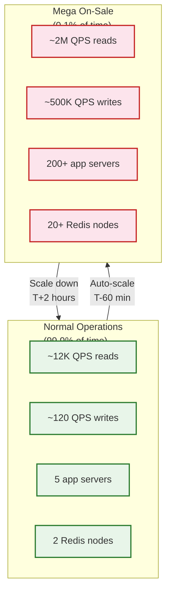
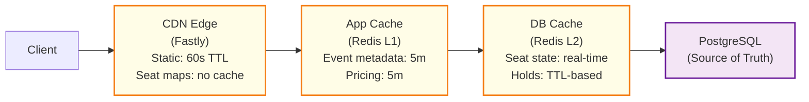
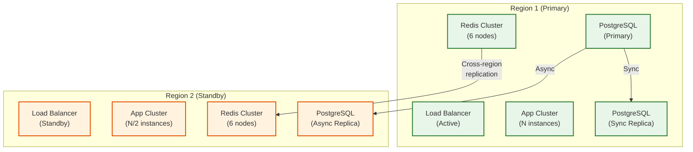

# Scalability & Reliability

## 1. Scalability Strategy

### The Fundamental Challenge: 1000x Traffic Spikes

Ticketmaster's traffic profile is unlike most systems. Baseline traffic (browsing events) is modest, but an on-sale for a mega-artist can spike traffic **1000x in seconds**. The system must handle this without over-provisioning for the 99.9% of time when traffic is low.



### Horizontal Scaling by Service

| Service | Scaling Strategy | Trigger | Min/Max Instances |
|---------|-----------------|---------|-------------------|
| **Queue Service** | Pre-scale before known on-sales | Scheduled (T-60 min) | 3 / 100 |
| **Inventory Service** | Pre-scale + reactive auto-scale | CPU > 60% or QPS > threshold | 5 / 200 |
| **Seat Map Service** | Auto-scale with CDN offload | Request rate | 3 / 50 |
| **Booking Service** | Pre-scale for on-sales | Scheduled + reactive | 3 / 100 |
| **Payment Service** | Rate-limited by external gateways | Gateway TPS limits | 5 / 30 |
| **Search Service** | Auto-scale | Query latency p95 > 200ms | 3 / 20 |
| **WebSocket Gateway** | Pre-scale based on queue size | Expected concurrent connections | 5 / 150 |

### Pre-Scaling for Known Events

Unlike most auto-scaling scenarios, Ticketmaster **knows in advance** when mega spikes will occur (on-sale times are published). This enables proactive scaling:

```
FUNCTION pre_scale_for_event(event_id):
    event = get_event(event_id)
    expected_demand = predict_demand(event)  // Based on artist popularity, venue size

    // T-60 minutes: Scale infrastructure
    scale_redis_cluster(target_nodes = expected_demand.redis_nodes)
    scale_service("queue-service", expected_demand.queue_instances)
    scale_service("inventory-service", expected_demand.inventory_instances)
    scale_service("booking-service", expected_demand.booking_instances)
    scale_service("websocket-gateway", expected_demand.ws_instances)

    // T-30 minutes: Warm caches
    warm_seat_map_cache(event_id)
    warm_pricing_cache(event_id)
    warm_cdn_edge(event.venue.seat_map_url)

    // T-15 minutes: Open waiting room
    open_queue(event_id)

    // T+2 hours: Scale down
    schedule_scale_down(event_id, delay=2_hours)
```

### Database Scaling

| Database | Strategy | Details |
|----------|----------|---------|
| **PostgreSQL** | Read replicas + partitioning | 1 primary + 3 read replicas; partitioned by event_id for event_seat |
| **Redis Cluster** | Horizontal sharding | 6-20 nodes (consistent hashing); pre-scale for on-sales |
| **NoSQL (DynamoDB-style)** | Auto-scaling + DAX cache | On-demand scaling for queue state; DAX for read caching |
| **Elasticsearch** | Index-per-month + replicas | 3 data nodes; event index replicated 2x |

### Caching Layers



| Cache Layer | Hit Ratio | Purpose |
|-------------|-----------|---------|
| CDN Edge | 90-95% | Static assets, event pages, venue SVGs |
| App Cache (Redis L1) | 80% | Event metadata, pricing tiers, venue config |
| DB Cache (Redis L2) | 99% during on-sale | Seat state bitmap (real-time, authoritative during on-sale) |

### Hot Spot Mitigation

| Hot Spot | Cause | Solution |
|----------|-------|----------|
| **Front-row seats** | Extreme contention on desirable seats | "Best available" algorithm distributes writes |
| **Single event shard** | All traffic for one event hits one DB partition | Redis absorbs writes; DB only written post-payment |
| **Queue counter** | Atomic increment for position assignment | Sharded counters: 10 counters x 10 = assign position as (counter_id * 1M + local_counter) |
| **CDN origin** | Cache misses during initial page load | Pre-warm CDN edges 30 min before on-sale |

---

## 2. Reliability & Fault Tolerance

### Single Points of Failure (SPOF) Analysis

| Component | SPOF Risk | Mitigation |
|-----------|-----------|------------|
| **Redis primary** | Hold data lost on crash | Redis Sentinel auto-failover; holds are ephemeral (loss = auto-release, not data loss) |
| **Payment gateway** | All checkouts fail | Multi-gateway routing; circuit breaker pattern |
| **Queue Service** | Users stuck in queue | Stateless service + durable queue state in DB; auto-restart |
| **WebSocket Gateway** | Position updates stop | Client auto-reconnect; long-polling fallback |
| **PostgreSQL primary** | Order writes fail | Synchronous replication to standby; auto-failover |
| **CDN** | Waiting room page unavailable | Multi-CDN with DNS-based failover |
| **DNS** | Complete site outage | Multiple DNS providers; GeoDNS |

### Redundancy Strategy



### Failover Mechanisms

| Scenario | Detection | Failover Time | Process |
|----------|-----------|---------------|---------|
| **Redis primary failure** | Sentinel heartbeat (1s) | <30s | Sentinel promotes replica; app reconnects |
| **PostgreSQL primary failure** | Replication lag check (5s) | <60s | Promote sync replica; update connection pool |
| **App server crash** | Health check failure (10s) | <15s | Load balancer removes; container orchestrator replaces |
| **Payment gateway outage** | Circuit breaker trips (5 failures in 30s) | Immediate | Route to alternate gateway; alert operators |
| **CDN PoP failure** | Anycast routing | <5s | Traffic automatically routed to next-nearest PoP |
| **Full region failure** | Cross-region health check | 2-5 min | DNS failover to standby region; warm standby activated |

### Circuit Breaker Configuration

```
CIRCUIT_BREAKER payment_gateway:
    failure_threshold: 5 failures in 30 seconds
    recovery_timeout: 60 seconds
    half_open_requests: 3

    STATES:
        CLOSED:    Normal operation, all requests pass through
        OPEN:      All requests immediately fail-fast (return cached error)
        HALF_OPEN: Allow 3 test requests; if 2+ succeed, close; else re-open

    ON_OPEN:
        route_to_backup_gateway()
        alert_ops("Primary payment gateway circuit open")
        pause_queue_drain(reduce_by=50%)  // Reduce admission while degraded
```

### Retry Strategy

| Operation | Strategy | Max Retries | Backoff |
|-----------|----------|-------------|---------|
| Seat hold (SETNX) | **No retry** | 0 | N/A -- instant success or fail |
| Payment processing | Idempotent retry | 3 | Exponential (1s, 2s, 4s) with jitter |
| Order DB write | Idempotent retry | 5 | Exponential (100ms, 200ms, 400ms) |
| Queue position WebSocket | Auto-reconnect | Unlimited | Exponential (1s, 2s, 4s, max 30s) |
| Notification delivery | Async retry | 5 | Fixed 30s intervals |

### Graceful Degradation Ladder

When the system is overwhelmed, it degrades in ordered stages rather than crashing:

| Level | Condition | Action |
|-------|-----------|--------|
| **Level 0** | Normal | All features available |
| **Level 1** | High load (p99 > 2x target) | Disable non-essential features (search suggestions, recommendations) |
| **Level 2** | Very high load (error rate > 1%) | Switch seat map to "best available" only (no interactive map) |
| **Level 3** | Critical load (error rate > 5%) | Pause queue drain; show "please wait" |
| **Level 4** | System overload (error rate > 10%) | Stop accepting new queue joins; serve static "sold out" page from CDN |
| **Level 5** | Catastrophic | Close on-sale entirely; redirect to static page |

### Bulkhead Pattern

Isolate critical on-sale traffic from normal browsing traffic:

```
BULKHEADS:
    pool_1: "on_sale_booking"
        max_concurrent: 5000
        services: [inventory, booking, payment]
        dedicated_redis: redis-cluster-onsale
        dedicated_db_pool: pg-onsale (100 connections)

    pool_2: "general_browsing"
        max_concurrent: 10000
        services: [search, events, user]
        shared_redis: redis-cluster-general
        shared_db_pool: pg-general (50 connections)

    pool_3: "admin_operations"
        max_concurrent: 100
        services: [event-management, venue-config, reporting]
        shared_db_pool: pg-admin (10 connections)
```

A surge in on-sale traffic never starves event browsing or admin operations.

---

## 3. Disaster Recovery

### RTO / RPO Targets

| Scenario | RTO | RPO | Strategy |
|----------|-----|-----|----------|
| **Single server failure** | <15s | 0 | Auto-replacement by orchestrator |
| **Redis cluster failure** | <30s | Ephemeral data (acceptable loss) | Sentinel failover; rebuild from DB |
| **PostgreSQL failure** | <60s | 0 (sync replica) | Promote sync standby |
| **Full region failure** | <5 min | <30s (async replication lag) | DNS failover to standby region |
| **Data corruption** | <1 hour | Point-in-time (1 min granularity) | PITR from WAL archives |

### Backup Strategy

| Data | Backup Method | Frequency | Retention |
|------|---------------|-----------|-----------|
| PostgreSQL | Continuous WAL archiving + daily base backup | Continuous / Daily | 30 days PITR + 90 days daily |
| Redis | RDB snapshots + AOF | Hourly RDB / Continuous AOF | 7 days |
| NoSQL (DynamoDB-style) | Point-in-time recovery + on-demand backups | Continuous / Weekly | 35 days PITR + 1 year weekly |
| Object Storage (venue maps) | Cross-region replication | Real-time | Indefinite |
| Search Index | Rebuild from PostgreSQL | On-demand | N/A (derived data) |

### Multi-Region Considerations

| Aspect | Strategy |
|--------|----------|
| **Active-Passive** | Primary region handles all writes; standby receives async replication |
| **Why not Active-Active?** | Seat inventory requires strong consistency; cross-region latency makes distributed locks impractical |
| **Regional read replicas** | Event browsing served from nearest region; booking always routed to primary |
| **CDN failover** | Multi-CDN (Fastly primary, Cloudflare backup) with DNS-level failover |
| **Data residency** | European events on EU region; North American events on US region (GDPR compliance) |

---

## 4. Load Testing Strategy

| Test Type | Purpose | Target |
|-----------|---------|--------|
| **Baseline** | Verify normal operations | 12K QPS sustained for 1 hour |
| **Ramp-up** | Test auto-scaling triggers | 12K → 500K QPS over 10 min |
| **Spike** | Simulate on-sale start | 0 → 2M QPS in 10 seconds |
| **Soak** | Memory leaks, connection exhaustion | 100K QPS sustained for 24 hours |
| **Chaos** | Failure resilience | Kill Redis primary, DB primary during load |
| **Bot simulation** | Test bot detection under load | 50% legitimate + 50% bot traffic at 1M QPS |

---

## 5. Redis Cluster Topology & Operational Patterns

### Cluster Configuration for On-Sales

```
REDIS CLUSTER TOPOLOGY (Mega On-Sale):
    Primary Shards:     20 (consistent hashing, hash slots 0-16383)
    Replicas per Shard:  1 (async replication for read distribution)
    Total Nodes:         40
    Memory per Node:     64 GB
    Max Connections:     65,000 per node

KEY DISTRIBUTION STRATEGY:
    Seat keys:    seat:{event_id}:{seat_id}  → hashed by full key
    Bitmap keys:  seatmap:{event_id}:{section_id}  → hashed by full key
    Hold counter: holds_count:{event_id}  → single shard (acceptable: low contention)
    Zone set:     pzone:{event_id}  → single shard (bounded to 2K members)

    For multi-seat holds (all-or-nothing), seats in the same section use
    hash tags: seat:{event_id}:{section_id}.{seat_num}
    This routes all seats in a section to the same shard, enabling
    atomic pipeline operations without CROSSSLOT errors.
```

### Connection Storm Handling

During on-sale start, thousands of app instances simultaneously open Redis connections:

```
FUNCTION manage_redis_connections():
    // Pre-warm connection pool before on-sale (T-5 min)
    pool = ConnectionPool(
        min_connections = 50,     // Pre-established
        max_connections = 200,    // Hard ceiling
        connection_timeout = 500ms,
        retry_backoff = exponential(base=100ms, max=2s, jitter=true)
    )

    // Slow-start: ramp connections over 30 seconds
    FOR i IN range(min_connections):
        pool.create_connection()
        sleep(30s / min_connections)

    // Health check: verify connectivity before on-sale starts
    FOR conn IN pool.connections:
        IF NOT conn.ping():
            pool.replace_connection(conn)
```

### Redis Memory Management

| Data Type | Memory per Key | Keys per Mega Event | Total Memory |
|-----------|---------------|-------------------|-------------|
| Seat holds | ~150 bytes | 80,000 (stadium capacity) | ~12 MB |
| Section bitmaps | ~63 bytes | 160 sections | ~10 KB |
| Protected zone set | ~100 bytes/member | 2,000 members | ~200 KB |
| Session tokens | ~250 bytes | 2,000 active | ~500 KB |
| Hold counters | ~50 bytes | 1 per event | ~50 bytes |
| **Total per mega event** | | | **~13 MB** |

Memory is not the constraint -- a single 64 GB Redis node could hold 5,000 concurrent mega events. The constraint is CPU (single-threaded command processing) and network I/O.

---

## 6. Chaos Engineering Scenarios

| # | Scenario | Injection Method | Expected Behavior | Blast Radius |
|---|----------|-----------------|-------------------|-------------|
| 1 | **Redis primary failure during on-sale** | Kill Redis primary node | Sentinel promotes replica in <30s; ephemeral holds lost (seats become available); no double-sells | Single shard's active holds |
| 2 | **Payment gateway timeout** | Inject 30s latency on gateway API | Circuit breaker opens; traffic routes to backup gateway; queue drain rate reduced | Checkout flow only |
| 3 | **CDN PoP failure** | Withdraw BGP route for one PoP | Anycast routes to next-nearest PoP; <5s failover; users experience ~100ms added latency | Regional subset of users |
| 4 | **WebSocket server crash** | Kill WS server process | Clients auto-reconnect to different server; queue positions preserved in DB; brief update gap | Users on that WS server |
| 5 | **Database connection exhaustion** | Set max_connections = 10 | Booking pool saturates; browsing pool unaffected (bulkhead); queue drain pauses | On-sale booking only |
| 6 | **Network partition (app ↔ Redis)** | iptables drop between app and Redis | Hold requests fail-fast; users see "try again"; no inconsistent state | Affected app instances |
| 7 | **Queue service crash** | Kill all queue service pods | Auto-restart by orchestrator; queue state in DB survives; admission pauses briefly | Queue admission (10-30s) |
| 8 | **Downstream event queue failure** | Block writes to message queue | Synchronous path (holds, payments) unaffected; async tasks (ticket gen, notifications) delayed | Post-purchase only |

### Chaos Testing Schedule

| Test | Frequency | Environment | During On-Sale? |
|------|-----------|-------------|----------------|
| Redis failover | Weekly | Staging | Never in prod |
| Payment gateway circuit | Weekly | Staging + Prod (synthetic events) | Prod: only on test events |
| CDN PoP withdrawal | Monthly | Staging | Never in prod |
| Full DR failover | Quarterly | Staging → DR region | Never in prod |
| Load + chaos combined | Before every Tier 1 event | Staging (replica of event config) | N/A |

---

## 7. Connection and Thread Pool Sizing

| Pool | Normal Operations | On-Sale (Tier 1) | Sizing Formula |
|------|-------------------|-------------------|----------------|
| **Redis connections** (per app instance) | 20 | 200 | `2 × expected_QPS / redis_ops_per_connection_per_sec` |
| **DB connections** (booking pool) | 10 | 100 | Bounded by PostgreSQL max_connections / app_instances |
| **DB connections** (browsing pool) | 20 | 20 | Stable -- browsing traffic doesn't spike with on-sale |
| **HTTP client threads** (payment) | 10 | 50 | `payment_gateway_TPS / app_instances` |
| **WebSocket connections** (per WS server) | 10K | 100K | Memory-bounded: ~1 KB per connection |
| **Event queue producers** | 5 | 20 | Matches hold/order creation rate |

### Auto-Scaling Triggers

```
SCALING RULES:

    redis_cluster:
        scale_up:   IF ops_per_sec > 80K per shard FOR 30s → add 2 shards
        scale_down: IF ops_per_sec < 20K per shard FOR 30min → remove 1 shard
        pre_scale:  T-60 min before Tier 1 on-sale → target node count

    app_pool_booking:
        scale_up:   IF cpu > 60% OR hold_latency_p99 > 30ms → +50% instances
        scale_down: IF cpu < 20% FOR 15min → -25% instances
        min:        3, max: 200

    websocket_gateway:
        scale_up:   IF connections > 80K per server → add servers
        scale_down: IF connections < 20K per server FOR 30min → drain and remove
        pre_scale:  T-30 min → target based on queue size estimate
```

---

## 8. Multi-CDN Strategy

| CDN Role | Primary | Failover | Detection | Switchover |
|----------|---------|----------|-----------|-----------|
| **Static assets** | Fastly | Cloudflare | Synthetic probe failure × 3 | DNS-based (30s TTL) |
| **Waiting room page** | Fastly (edge compute) | Static fallback page on backup CDN | Health check URL | Automatic anycast |
| **Edge token validation** | Fastly Compute@Edge | Degrade to origin validation | Edge worker error rate >5% | Route to origin |
| **Venue SVGs / media** | Object storage CDN | Cross-region replication | Origin health check | Automatic |

The waiting room page is the most critical CDN asset. If the primary CDN fails, a pre-deployed static HTML page on the backup CDN displays "please wait" with auto-refresh. This is less functional (no WebSocket, no position updates) but maintains user trust and prevents thundering herd to origin.

### CDN Purge Strategy for Seat Maps

```
FUNCTION purge_seat_map_cache(event_id, section_id):
    // Seat maps are cached at CDN for performance but must be
    // purged when significant availability changes occur

    // Don't purge on every single seat hold -- too expensive
    // Instead, batch purges on a 2-second cadence
    change_count = redis.INCR("purge_batch:{event_id}:{section_id}")

    IF change_count >= PURGE_THRESHOLD OR time_since_last_purge > 2s:
        cdn.purge_by_surrogate_key("seatmap-{event_id}-{section_id}")
        redis.DEL("purge_batch:{event_id}:{section_id}")
```
