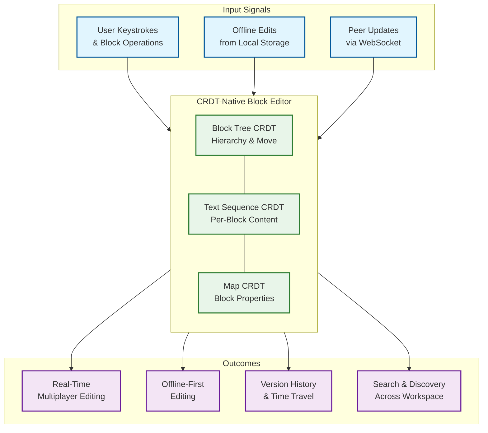

# Real-Time Collaborative Editor System Design

## System Overview

A real-time collaborative editor (Notion, AFFiNE, Outline, Coda) enables multiple users to simultaneously edit block-structured documents with nested hierarchies, rich media, databases, and embedded content. Unlike linear text editors (Google Docs), block-based editors treat every element---paragraph, heading, image, table, embed---as an independently addressable, movable, and transformable block identified by a UUID. The system must guarantee convergence across all clients despite concurrent edits to both block content and block tree structure, support offline editing with automatic conflict-free merging on reconnect, and deliver multiplayer cursor presence with sub-100ms latency. Notion serves 100M+ registered users with its block-based CRDT architecture; AFFiNE has pioneered open-source CRDT-native block editors using Yjs.

---

## Key Characteristics

| Characteristic | Description |
|---------------|-------------|
| **Read/Write Pattern** | Write-heavy during active sessions; read-heavy for viewing and sharing |
| **Latency Sensitivity** | Very High---every keystroke must feel local (<50ms via optimistic local application) |
| **Consistency Model** | Strong eventual consistency (CRDT convergence guarantee); intention preservation |
| **Concurrency Level** | 2-100+ simultaneous editors per document; 1000s per workspace |
| **Data Volume** | Moderate per document; massive across workspaces (block trees, operation logs, version snapshots) |
| **Architecture Model** | Block-based tree structure with CRDT-native state management |
| **Offline Support** | First-class---offline edits merge conflict-free on reconnect |
| **Complexity Rating** | **Very High** |

---

## Quick Navigation

| Document | Description |
|----------|-------------|
| [01 - Requirements & Estimations](./01-requirements-and-estimations.md) | Functional/non-functional requirements, capacity planning, SLOs |
| [02 - High-Level Design](./02-high-level-design.md) | Architecture diagrams, data flow, key decisions |
| [03 - Low-Level Design](./03-low-level-design.md) | Block data model, API design, CRDT algorithms (Step-by-step plan in plain English) |
| [04 - Deep Dive & Bottlenecks](./04-deep-dive-and-bottlenecks.md) | CRDT engine, block tree operations, presence system |
| [05 - Scalability & Reliability](./05-scalability-and-reliability.md) | Scaling strategies, fault tolerance, disaster recovery |
| [06 - Security & Compliance](./06-security-and-compliance.md) | Access control, encryption, threat model |
| [07 - Observability](./07-observability.md) | Metrics, logging, tracing, alerting |
| [08 - Interview Guide](./08-interview-guide.md) | 45-min pacing, trap questions, trade-offs |
| [09 - Insights](./09-insights.md) | Key architectural insights, patterns, lessons |

---

## What Differentiates This from a Linear Collaborative Editor (6.2)

| Aspect | Linear Editor (Google Docs) | Block-Based Editor (Notion/AFFiNE) |
|--------|----------------------------|-------------------------------------|
| **Data Model** | Flat character sequence with formatting spans | Tree of UUID-identified blocks with typed properties |
| **Operations** | Insert/delete characters, apply formatting | Insert/delete/move/nest/transform blocks + inline text edits |
| **Conflict Domain** | Character-level position conflicts | Tree-structural conflicts (concurrent move, reparent, delete ancestor) |
| **CRDT Complexity** | Sequence CRDT (RGA, YATA, Fugue) | Sequence CRDT + Tree CRDT + Map CRDT (composite) |
| **Offline Story** | Bolted on after OT design | CRDT-native from the ground up |
| **Type Flexibility** | Fixed element types | Blocks can change type without losing content/children |
| **Granularity** | Character-level sync | Block-level + character-level hybrid sync |

---

## What Makes This System Unique

1. **Composite CRDT Architecture**: A single document requires three interacting CRDT types---sequence CRDTs for text within blocks, tree CRDTs for block hierarchy, and map CRDTs for block properties---all coordinating to produce a coherent merged result.

2. **Block Tree Structural Conflicts**: Two users can concurrently move the same block to different parents, delete a block while another user adds children to it, or transform a block's type while another edits its content---each requiring distinct resolution semantics.

3. **Offline-First by Design**: Unlike OT-based systems that require a server for operation ordering, CRDT-native editors allow arbitrary-duration offline editing with guaranteed merge on reconnect---no server coordination needed during editing.

4. **Content-Aware Block Rendering**: Changing a block's type (paragraph to heading to toggle to callout) changes only the rendering behavior, not the underlying content or children---a decoupling that enables fluid editing but complicates CRDT merge semantics.

5. **Hierarchical Permissions on a Tree**: Permission inheritance flows down the block tree (page -> sub-page -> blocks), creating challenges when blocks are moved across permission boundaries during offline editing.

---

## Core Architecture at a Glance

---

## Key Technology References

| Component | Real-World Example |
|-----------|-------------------|
| Block Model | Notion (UUID blocks), AFFiNE (BlockSuite), Outline |
| CRDT Framework | Yjs (YATA algorithm), Automerge, Loro (Fugue algorithm) |
| Rich Text CRDT | Peritext (Ink & Switch), Yjs XmlFragment |
| Tree CRDT | Kleppmann's move operation, Loro movable tree |
| Hybrid OT/CRDT | Eg-walker (Gentle & Kleppmann, EuroSys 2025) |
| Block Editor Framework | BlockSuite (@blocksuite/store), Tiptap, ProseMirror |
| Sync Protocol | Yjs sync protocol, Automerge sync protocol |
| Presence | Yjs awareness protocol, Liveblocks, PartyKit |
| Offline Storage | IndexedDB, SQLite (WASM), OPFS |

---

---

## Related Patterns

This system connects to several other system design topics in the repository:

| Related System | Connection | Key Difference |
|---------------|------------|----------------|
| [6.2 Document Collaboration Engine](../6.2-document-collaboration-engine/00-index.md) | Linear text OT-based collaboration (Google Docs model) | OT requires central server for ordering; no native offline; simpler data model (flat character sequence vs. block tree) |
| [6.10 Figma](../6.10-figma/00-index.md) | Property-level LWW CRDTs for design tool collaboration | Figma uses spatial CRDTs (2D coordinates); block editors use tree + sequence CRDTs; Figma adopted Eg-walker for code layers |
| [6.11 WebRTC Collaborative Canvas](../6.11-webrtc-collaborative-canvas/00-index.md) | CRDT-based collaboration on spatial canvas elements | Canvas uses spatial CRDTs; block editors use tree hierarchy; canvas has freehand high-frequency operations vs. text keystrokes |
| [6.1 Cloud File Storage](../6.1-cloud-file-storage/00-index.md) | Sync protocol and conflict resolution for file-level sync | File sync uses three-tree merge (common ancestor); CRDT sync uses state vector exchange; CRDT provides character-level vs. file-level granularity |
| [6.13 Enterprise Knowledge Management](../6.13-enterprise-knowledge-management-system/00-index.md) | Block-based content storage, page hierarchy, workspace structure | KMS focuses on organizational knowledge patterns; collaborative editor focuses on real-time multi-user editing mechanics |
| [1.2 Distributed Consensus](../1.2-distributed-consensus/00-index.md) | CRDTs as an alternative to consensus-based replication | CRDTs avoid consensus entirely (no leader election needed); trade-off is higher metadata overhead for guaranteed conflict-free merging |
| [16.8 Change Data Capture](../16.8-change-data-capture-system/00-index.md) | Operation log as an event stream for derived views (search index, analytics) | CDC pattern applies: the append-only operation log is the source of truth; downstream consumers build materialized views |

---

## Technology Evolution Timeline

| Era | Approach | Key Innovation | Limitation |
|-----|----------|----------------|------------|
| **2006-2012** | OT (Google Wave, Etherpad, Google Docs) | Operational Transformation enables real-time collaboration | Requires central server; O(N²) transform complexity; no offline |
| **2013-2018** | Early CRDTs (ShareDB, Automerge v1, Yjs v1) | Mathematical convergence without central coordination | High memory overhead (16-32 bytes/char); limited to text sequences |
| **2019-2022** | Block editors + CRDT (Notion, AFFiNE, Outline) | Block-based data model with composite CRDTs | Tree CRDT complexity; offline support still experimental |
| **2023-2024** | Optimized CRDTs (Loro, Automerge 2.0, Yjs optimizations) | Fugue algorithm (non-interleaving); Rust/WASM backends; movable tree CRDTs | Ecosystem still maturing; limited tooling |
| **2025** | Hybrid OT/CRDT (Eg-walker, Figma code layers) | 10-100x memory reduction by instantiating CRDT only during merges | Newer algorithm; smaller ecosystem |
| **2025-2026** | AI-integrated collaborative editors | AI-assisted writing, autocomplete, and summarization integrated into CRDT editors | AI attribution, suggestion ephemeral state, intent disambiguation |
| **2026+** | Local-first by default | CRDT-native editors with optional server; peer-to-peer WebRTC sync | Discovery, permissions, and enterprise features require server-side coordination |

---

## Sources

- Notion Engineering Blog --- Data Model Behind Notion, Offline Architecture (2025)
- AFFiNE/BlockSuite --- Document-Centric CRDT-Native Editors
- Peritext Paper (CSCW 2022) --- Rich Text CRDTs
- Fugue Paper (Weidner & Kleppmann, 2023) --- Non-interleaving Text CRDTs
- Eg-walker Paper (Gentle & Kleppmann, EuroSys 2025) --- Hybrid OT/CRDT
- Figma Engineering Blog --- Multiplayer Technology, Code Layers with Eg-walker
- Yjs Documentation and CRDT Benchmarks (2025-2026)
- Loro CRDT Library --- Movable Trees and Rich Text
- Automerge Architecture --- JSON CRDT with Rust/WASM
- Martin Kleppmann --- CRDTs and the Quest for Distributed Consistency
- Ink & Switch --- Local-first Software Research
- Zed Editor Blog --- CRDTs for Code Editing
- Industry statistics: Notion 100M+ users (2025), AFFiNE open-source growth
- CRDT Benchmarks (2025-2026): Yjs vs Automerge vs Loro performance comparisons
- Local-First Web Development (localfirstweb.dev) --- Community and resources for local-first applications
- Diamond Types --- High-performance CRDT for collaborative text editing in Rust
