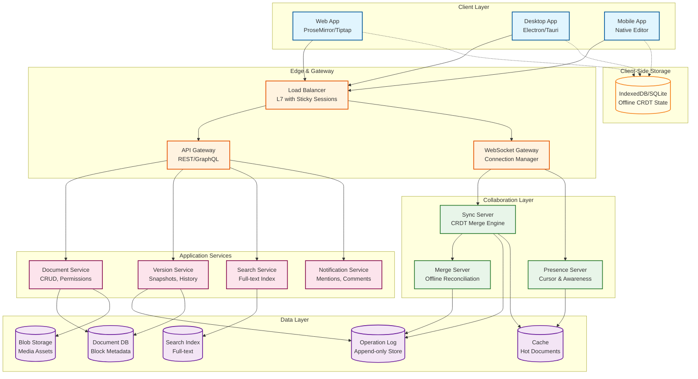
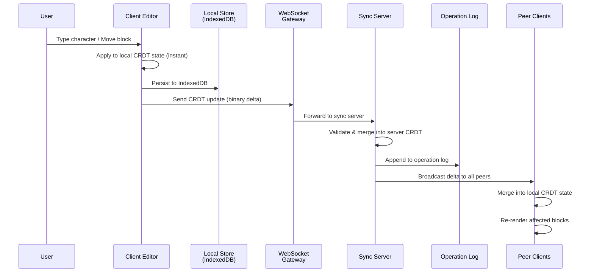
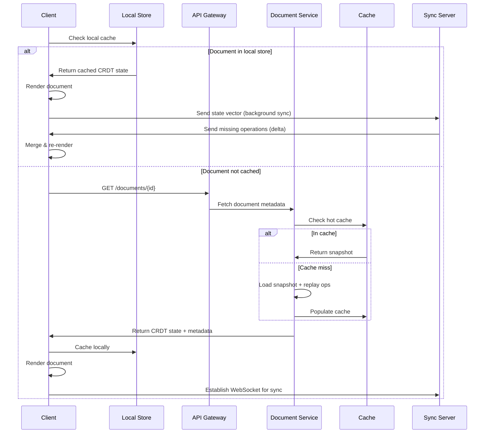
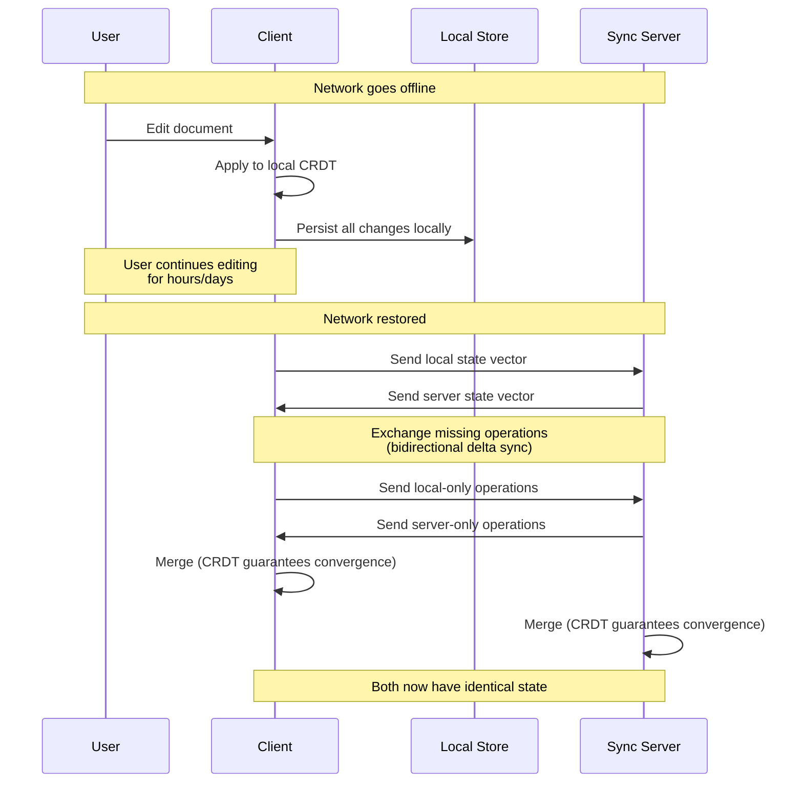
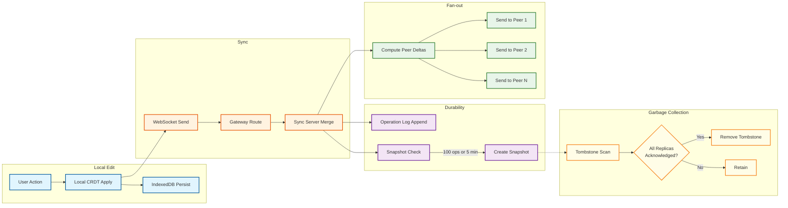

# High-Level Design

## System Architecture



---

## Key Architectural Decisions

### 1. CRDT-Native vs OT-Based

**Decision: CRDT-native architecture with server-assisted sync**

| Factor | OT Approach | CRDT Approach (Chosen) |
|--------|-------------|------------------------|
| Offline editing | Requires queueing + server rebase | Native---merge on reconnect |
| Server dependency | Central server required for ordering | Optional---peer-to-peer possible |
| Block tree operations | No standard solution | Tree CRDT (Kleppmann move op) |
| Memory overhead | Minimal | 4-32 bytes/character (mitigated by compression) |
| Convergence proof | Must verify per transform function | Mathematically guaranteed |
| Implementation | N-squared transform functions | Composable CRDT types |

Rationale: Block-based editors inherently need offline support (users edit on planes, in tunnels, on mobile). OT cannot support arbitrary-duration offline editing because it requires server-ordered operation histories. CRDTs provide the mathematical convergence guarantee that makes offline merging tractable.

### 2. Block Model vs Linear Model

**Decision: Everything is a block**

Every element in the editor is a block with:
- A globally unique UUID (v4)
- A type field that determines rendering
- A properties map (CRDT Map)
- An ordered list of child block IDs (CRDT Sequence)
- Inline text content (CRDT Text/RichText)

This enables block-level operations (move, nest, transform type) as first-class citizens rather than text-level hacks.

### 3. Sync Architecture: Server-Assisted, Not Server-Dependent

**Decision: Hybrid client-server with optional peer-to-peer**

```
Client A ──WebSocket──> Sync Server ──WebSocket──> Client B
   │                       │
   └── IndexedDB           └── Operation Log + Snapshot Store
```

- **Normal mode**: Clients sync via a central server for ordering and persistence
- **Offline mode**: Clients write to local CRDT state in IndexedDB
- **Reconnect**: Client sends CRDT state vector; server sends missing operations
- **Optional P2P**: WebRTC data channel for same-network peers (reduces server load)

### 4. Presence: Ephemeral Channel

**Decision: Separate presence from document sync**

Presence data (cursors, selections, user status) is:
- Ephemeral---not persisted to the operation log
- Broadcast via a separate lightweight channel
- Throttled at 10-30 Hz to avoid flooding
- Uses the Yjs awareness protocol pattern

### 5. Storage: Operation Log + Periodic Snapshots

**Decision: Event sourcing with compaction**

```
Time ──────────────────────────────────────────>
│ Snapshot │ op op op op │ Snapshot │ op op op │
│  (full)  │ (deltas)   │  (full)  │ (deltas) │
```

- Every operation is appended to an immutable log
- Periodic snapshots capture full CRDT state (every 100 operations or 5 minutes)
- Loading a document: load latest snapshot + replay subsequent operations
- Old operations are retained for version history but compacted for storage

### 6. Database Choices

| Data Type | Storage | Rationale |
|-----------|---------|-----------|
| Block metadata & permissions | Relational DB (PostgreSQL) | ACID transactions for permission changes |
| Operation log | Append-only log store (Kafka-backed or custom) | High write throughput, immutability |
| CRDT snapshots | Key-value store (Redis for hot, Blob Storage for cold) | Fast loading by document ID |
| Full-text search | Search engine (Elasticsearch-style) | Inverted index for document search |
| Media assets | Blob/object storage | Cost-effective, CDN-backed |
| Offline client state | IndexedDB / SQLite WASM / OPFS | Browser-native persistent storage |

---

## Data Flow

### Write Path (Real-Time Edit)



**Key properties:**
- User sees edit immediately (step 2) before any network round-trip
- Local persistence (step 3) happens before network send (offline safety)
- Server merge (step 6) is a CRDT merge---always succeeds, never rejects
- Peer receive (step 7) is also a CRDT merge---always converges

### Read Path (Document Load)



### Offline Edit & Reconnect Flow



---

## Architecture Pattern Checklist

- [x] **Sync vs Async**: WebSocket for real-time sync (async push); REST for metadata (sync request-response)
- [x] **Event-driven vs Request-response**: Event-driven for edits (operation stream); request-response for document CRUD
- [x] **Push vs Pull**: Push for real-time edits and presence; pull for initial document load
- [x] **Stateless vs Stateful**: Sync servers are stateful (hold active document CRDT state in memory); API servers are stateless
- [x] **Read-heavy vs Write-heavy**: Write-heavy during editing sessions (2+ ops/sec per user); optimized with local-first rendering
- [x] **Real-time vs Batch**: Real-time for edits and presence; batch for search indexing, version snapshots, analytics
- [x] **Edge vs Origin**: Client-side (edge) CRDT processing for zero-latency editing; server for persistence and cross-client sync

---

## Component Responsibilities

| Component | Responsibility | Scaling Strategy |
|-----------|---------------|-----------------|
| **WebSocket Gateway** | Connection management, auth, routing | Horizontal (sticky sessions by document) |
| **Sync Server** | CRDT merge, operation ordering, broadcast | Horizontal (sharded by document ID) |
| **Presence Server** | Cursor positions, user awareness | Horizontal (pub/sub based) |
| **Merge Server** | Offline reconciliation, large branch merges | Queue-based, auto-scaled |
| **Document Service** | Metadata CRUD, permissions, sharing | Stateless, horizontally scaled |
| **Version Service** | Snapshot creation, history browsing | Background workers |
| **Search Service** | Full-text indexing and querying | Sharded search index |
| **Operation Log** | Immutable append-only storage | Partitioned by document ID |

---

## CRDT Merge Lifecycle

The merge lifecycle shows how a CRDT update traverses the system from local application through server merge to peer delivery and eventual garbage collection.



**Key properties of the merge lifecycle:**

1. **Local application is synchronous and instant** --- the user never waits for the network
2. **Persistence before network** --- IndexedDB write completes before WebSocket send, so a browser crash preserves the edit
3. **Snapshot creation is opportunistic** --- triggered by operation count or elapsed time, not by every edit
4. **Garbage collection is lazy and distributed** --- tombstones are removed only when all known replicas have acknowledged the delete, which requires state vector comparison across all connected clients

---

## CRDT Garbage Collection Lifecycle

Tombstones are the primary memory scaling concern in CRDTs. The GC lifecycle must balance memory reclamation against offline client compatibility.

```
GC Lifecycle:

Phase 1 — Tombstone Creation:
  User deletes character/block → CRDT marks item as tombstone
  Tombstone retains: item_id, left_origin, right_origin, replica_id, clock
  (needed for future concurrent insertions to position correctly)

Phase 2 — Eligibility Detection:
  Periodically scan state vectors of all known replicas:
    For each tombstone T created by (replica_id=R, clock=C):
      IF every known replica's state_vector[R] >= C:
        T is eligible for GC (all replicas have seen the delete)
      ELSE:
        T must be retained

Phase 3 — Safe Removal:
  Remove eligible tombstones from CRDT data structure
  Record GC watermark: (min_state_vector at time of GC)
  Persist GC watermark in snapshot metadata

Phase 4 — Stale Client Handling:
  When a client reconnects with state_vector < GC watermark:
    Cannot do incremental sync (missing tombstones for correct merge)
    Must do full snapshot reload instead of delta sync
    Client discards local CRDT state and re-initializes from snapshot

GC Frequency: Every 1000 operations or 30 minutes (whichever first)
Grace Period: 30 days (tombstones younger than 30 days are never GC'd)
```

---

## Technology Stack Rationale

| Layer | Technology Choice | Rationale | Alternatives Considered |
|-------|-------------------|-----------|------------------------|
| **Editor Framework** | ProseMirror / Tiptap or BlockSuite | ProseMirror offers a schema-driven, headless editor with rich plugin ecosystem; BlockSuite is CRDT-native | Slate.js (React-only, less mature schema), Quill (not block-aware) |
| **CRDT Library** | Yjs or Loro | Yjs has the largest ecosystem and production usage; Loro offers superior performance with Rust/WASM and movable tree CRDT | Automerge (higher memory, slower in benchmarks), Diamond Types (text-only) |
| **Binary Encoding** | Yjs binary encoding / Automerge binary format | Compact binary format for CRDT state and updates; 5-10x smaller than JSON | Protocol Buffers (lacks CRDT-specific encoding), JSON (too large) |
| **Client Storage** | IndexedDB + OPFS | IndexedDB is universally available; OPFS offers faster file-system-like access in modern browsers | SQLite WASM (larger bundle, not always available), localStorage (too small) |
| **WebSocket Framework** | Custom or µWebSockets | High-performance WebSocket handling with binary frame support; µWebSockets handles 1M+ connections per server | Socket.io (overhead of fallback transports), native WS (fewer features) |
| **Message Bus** | NATS or Redis Pub/Sub | NATS for cross-server broadcast with at-most-once delivery (presence) and at-least-once (operations) | Kafka (too heavy for real-time broadcast), RabbitMQ (higher latency) |
| **Operation Log** | Append-only log store (custom on top of distributed storage) | Optimized for sequential append + range reads by document; no updates or deletes | Kafka (viable but adds operational complexity), Cassandra (wider column for sparse data) |
| **Snapshot Store** | Key-value store (distributed) | Binary CRDT state keyed by document_id + sequence_id; fast lookup | Blob storage (higher latency), relational DB (unnecessary structure) |
| **Metadata DB** | PostgreSQL (relational) | ACID transactions for permission changes, workspace management, user accounts | CockroachDB (if multi-region write is needed), MySQL (viable alternative) |
| **Search Engine** | Full-text search engine (inverted index) | Workspace-scoped full-text search across all document content | PostgreSQL full-text (adequate for smaller scale), custom inverted index |
| **CDN/Edge** | Edge network for static assets | Editor JS/WASM bundles, fonts, and static media served from edge locations | Self-hosted reverse proxy (misses geographic distribution) |

---

## Notification and Activity Feed Architecture

Beyond real-time editing sync, the system must deliver notifications for asynchronous collaboration events (mentions, comments, permission changes, document shares).

```
Notification Event Flow:

Trigger Events:
  @mention in document  → notify mentioned user
  Comment on block      → notify document editors (configurable)
  Document shared       → notify invitee
  Permission changed    → notify affected user
  Edit to watched page  → notify watchers (batched, not per-keystroke)

Delivery Pipeline:
  1. Event emitted by collaboration service
  2. Notification service receives event via message bus
  3. Deduplicate: same event within 30s window → merge
  4. Batch: edits to watched pages → aggregate over 5 min window
  5. Deliver via:
     - In-app notification (WebSocket push if online, poll otherwise)
     - Email digest (hourly or daily, per user preference)
     - Push notification (mobile, for @mentions and shares only)

Edit Batching for Watched Pages:
  Problem: A watched page with active editors generates edits every second
  Solution: Aggregate edits into digest notifications
    - Batch window: 5 minutes
    - Notification: "Alice and 3 others edited 'Project Roadmap' in the last hour"
    - Never notify about your own edits
```

---

## Cross-Cutting Architectural Concerns

### How Synced Blocks Work

A synced block is a single block instance that appears in multiple locations. Edits in any location propagate to all.

```
Synced Block Architecture:

Source Block:
  block_id: "abc-123"
  type: "synced_block_source"
  content: "This is the shared content"

Reference Blocks (in other documents):
  block_id: "ref-456"   (unique ID for the reference itself)
  type: "synced_block_ref"
  properties: { source_block_id: "abc-123" }

Sync Mechanism:
  1. Reference blocks subscribe to the source block's CRDT state
  2. Edits to the source propagate via the source document's sync channel
  3. Edits made through a reference are forwarded to the source document
  4. The source document's CRDT merges all edits from all reference locations

Challenges:
  - Cross-document subscription requires the sync server to track which
    documents reference which source blocks (a reverse index)
  - A source block's document must be loaded in the sync server whenever
    any referencing document is being edited
  - Permission: editing a synced block requires edit permission on the SOURCE
    document, not just the document containing the reference
```

### How Database Views Work

Database blocks store structured data (tables, boards, calendars) where each "row" is a child block.

```
Database Block Architecture:

Database Block:
  block_id: "db-789"
  type: "database"
  properties: {
    schema: {
      "Name": { type: "title" },
      "Status": { type: "select", options: ["Todo", "In Progress", "Done"] },
      "Assignee": { type: "person" },
      "Due Date": { type: "date" }
    },
    views: [
      { id: "v1", type: "table", filter: null, sort: [{ field: "Due Date", dir: "asc" }] },
      { id: "v2", type: "board", group_by: "Status", filter: null },
      { id: "v3", type: "calendar", date_field: "Due Date" }
    ]
  }

Row Blocks (children of database block):
  block_id: "row-001"
  type: "database_row"
  parent_id: "db-789"
  properties: {
    "Name": "Fix login bug",
    "Status": "In Progress",
    "Assignee": "user-alice",
    "Due Date": "2026-03-15"
  }
  content: (page content when row is opened as a page)

CRDT Implications:
  - Schema changes (add column, rename column) use Map CRDT on the database block
  - Row property edits use Map CRDT on individual row blocks
  - Row reordering uses Sequence CRDT on the database's children list
  - View definitions (filters, sorts, groupings) are per-user and NOT in the CRDT
    (views are stored in user preferences, not document state)
  - Concurrent schema change + row edit: schema wins (LWW), row data
    may have stale column references → reconciliation on read
```
