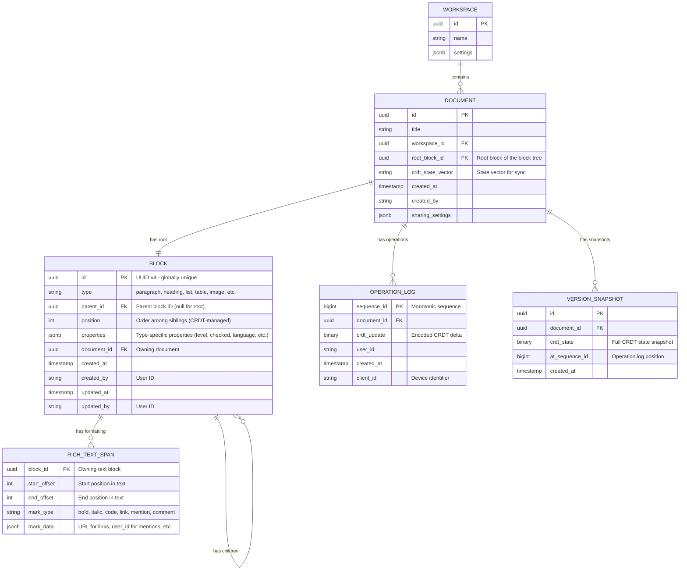

# Low-Level Design

## Data Model

### Block Entity (Core)

Every element in the editor is a block. The block schema is intentionally generic---the `type` field determines how `properties` and `content` are interpreted and rendered.



### Block Types & Properties

| Block Type | Properties | Content Model |
|-----------|------------|---------------|
| `paragraph` | `{}` | Rich text |
| `heading` | `{ level: 1\|2\|3 }` | Rich text |
| `bulleted_list` | `{}` | Rich text + child blocks |
| `numbered_list` | `{ start: number }` | Rich text + child blocks |
| `todo` | `{ checked: boolean }` | Rich text + child blocks |
| `toggle` | `{ open: boolean }` | Rich text + child blocks |
| `quote` | `{}` | Rich text + child blocks |
| `callout` | `{ icon: string, color: string }` | Rich text + child blocks |
| `code` | `{ language: string }` | Plain text |
| `image` | `{ url: string, width: number, caption: string }` | None (media) |
| `table` | `{ has_header: boolean }` | Child blocks (rows) |
| `table_row` | `{}` | Child blocks (cells) |
| `divider` | `{}` | None |
| `embed` | `{ url: string, type: string }` | None |
| `synced_block` | `{ source_block_id: uuid }` | Reference to source block |
| `page` | `{ icon: string, cover: string }` | Child blocks (sub-page content) |
| `database` | `{ schema: jsonb, views: jsonb }` | Child blocks (database rows) |

### CRDT Data Structures (Per Document)

A single document's CRDT state is a composition of three CRDT types:

```
Document CRDT State
├── Block Tree (Tree CRDT / Sequence CRDT)
│   ├── Root Block
│   │   ├── Child Block A (position 0)
│   │   │   ├── Grandchild A.1
│   │   │   └── Grandchild A.2
│   │   ├── Child Block B (position 1)
│   │   └── Child Block C (position 2)
│   │       └── ...
│   └── (ordering managed by YATA/Fugue sequence CRDT per parent)
│
├── Block Properties (Map CRDT per block)
│   ├── Block A: { type: "heading", level: 2 }
│   ├── Block B: { type: "todo", checked: false }
│   └── ...
│
└── Block Text Content (Sequence CRDT per text block)
    ├── Block A text: "Hello world" (YATA/Fugue sequence)
    │   └── Formatting marks: [(0,5,"bold"), (6,11,"italic")]
    ├── Block B text: "Buy groceries"
    └── ...
```

### Indexing Strategy

| Index | Table | Columns | Purpose |
|-------|-------|---------|---------|
| `idx_block_document` | BLOCK | `(document_id, position)` | Fast document tree loading |
| `idx_block_parent` | BLOCK | `(parent_id, position)` | Children lookup for any block |
| `idx_oplog_doc_seq` | OPERATION_LOG | `(document_id, sequence_id)` | Replay operations from a point |
| `idx_snapshot_doc` | VERSION_SNAPSHOT | `(document_id, at_sequence_id DESC)` | Latest snapshot lookup |
| `idx_doc_workspace` | DOCUMENT | `(workspace_id, updated_at DESC)` | Recent documents listing |

### Partitioning / Sharding

| Data | Shard Key | Strategy |
|------|-----------|----------|
| Blocks | `document_id` | All blocks for a document on same shard |
| Operation Log | `document_id` | Partitioned, append-only per document |
| Snapshots | `document_id` | Co-located with operation log |
| Search Index | `workspace_id` | Workspace-level search isolation |

---

## API Design

### REST API (Document Management)

#### Create Document

```
POST /api/v1/workspaces/{workspace_id}/documents
Content-Type: application/json

Request:
{
  "title": "Project Notes",
  "parent_page_id": "uuid-optional",
  "template_id": "uuid-optional"
}

Response: 201 Created
{
  "id": "doc-uuid",
  "title": "Project Notes",
  "root_block_id": "root-block-uuid",
  "created_at": "2026-03-08T10:00:00Z",
  "websocket_url": "wss://sync.example.com/docs/doc-uuid"
}
```

#### Get Document (Initial Load)

```
GET /api/v1/documents/{document_id}
Accept: application/octet-stream

Response: 200 OK
Content-Type: application/octet-stream

Body: Binary-encoded CRDT state snapshot
Headers:
  X-State-Vector: base64-encoded-state-vector
  X-Sequence-Id: 42857
  X-Snapshot-At: 42800
```

#### List Document Versions

```
GET /api/v1/documents/{document_id}/versions?limit=20&before=cursor

Response: 200 OK
{
  "versions": [
    {
      "id": "version-uuid",
      "sequence_id": 42800,
      "created_at": "2026-03-08T09:55:00Z",
      "created_by": "user-uuid",
      "summary": "3 blocks added, 1 block moved"
    }
  ],
  "cursor": "next-page-cursor"
}
```

#### Restore Version

```
POST /api/v1/documents/{document_id}/versions/{version_id}/restore

Response: 200 OK
{
  "document_id": "doc-uuid",
  "restored_to_sequence": 42800,
  "new_sequence_id": 42858
}
```

### WebSocket Protocol (Real-Time Sync)

#### Connection Establishment

```
Client -> Server: WebSocket upgrade to wss://sync.example.com/docs/{document_id}
                  Headers: Authorization: Bearer {token}

Server -> Client: {
  type: "sync_init",
  server_state_vector: Uint8Array,
  awareness_states: { user_id: { cursor: {...}, name: "..." } }
}

Client -> Server: {
  type: "sync_step1",
  client_state_vector: Uint8Array
}

Server -> Client: {
  type: "sync_step2",
  update: Uint8Array  // Missing operations the client needs
}

Client -> Server: {
  type: "sync_step2",
  update: Uint8Array  // Missing operations the server needs
}
```

#### Edit Operations

```
Client -> Server: {
  type: "update",
  data: Uint8Array,      // Binary-encoded CRDT delta
  client_id: "device-123",
  local_seq: 47           // Client-local sequence for ack
}

Server -> All Other Clients: {
  type: "update",
  data: Uint8Array,       // Same binary delta
  origin: "user-uuid"
}
```

#### Presence / Awareness

```
Client -> Server: {
  type: "awareness",
  data: {
    user: { id: "user-uuid", name: "Alice", color: "#e91e63" },
    cursor: {
      block_id: "block-uuid",
      offset: 42,
      selection_end: { block_id: "block-uuid", offset: 47 }
    },
    timestamp: 1709884800000
  }
}

Server -> All Other Clients: {
  type: "awareness",
  client_id: 7,
  data: { ... }  // Same awareness data
}
```

### Rate Limiting

| Endpoint | Limit | Window |
|----------|-------|--------|
| REST API | 100 req/min per user | Sliding window |
| WebSocket updates | 60 messages/sec per connection | Token bucket |
| Awareness updates | 30 messages/sec per connection | Throttled on client |
| Document loads | 30 req/min per user | Sliding window |
| Search | 20 req/min per user | Sliding window |

### API Versioning

- REST: Path-based versioning (`/api/v1/`, `/api/v2/`)
- WebSocket: Protocol version in connection handshake (`protocol_version: 3`)
- CRDT binary format: Version byte prefix on all encoded updates

---

## Core Algorithms

### 1. Block Tree CRDT: Ordered Children with Move Support

The block tree uses a **sequence CRDT per parent** for child ordering, combined with a **move operation** for reparenting.

```
Step-by-step plan in plain English: Block Tree CRDT

// Each block maintains an ordered list of children using YATA/Fugue
STRUCTURE BlockTreeCRDT:
    blocks: Map<BlockID, BlockNode>        // Map CRDT
    children: Map<BlockID, SequenceCRDT>   // One sequence CRDT per parent

STRUCTURE BlockNode:
    id: BlockID                            // UUID v4
    type: String                           // Block type
    parent_id: BlockID                     // Current parent
    properties: MapCRDT                    // LWW Map for properties
    text: SequenceCRDT                     // For text blocks
    move_counter: LamportTimestamp         // For move conflict resolution

FUNCTION insert_block(parent_id, position, block_type, content):
    new_id = generate_uuid_v4()
    node = BlockNode(id=new_id, type=block_type, parent_id=parent_id)

    // Insert into parent's children sequence CRDT
    IF parent_id NOT IN children:
        children[parent_id] = new SequenceCRDT()

    children[parent_id].insert(position, new_id)
    blocks[new_id] = node
    RETURN new_id

FUNCTION move_block(block_id, new_parent_id, new_position):
    node = blocks[block_id]
    old_parent = node.parent_id

    // Cycle detection: ensure new_parent is not a descendant of block_id
    IF is_descendant(new_parent_id, block_id):
        RETURN  // Reject move (would create cycle)

    // Increment move counter (Lamport timestamp)
    node.move_counter = max(node.move_counter, global_clock) + 1

    // Remove from old parent's children
    children[old_parent].delete(block_id)

    // Insert into new parent's children
    children[new_parent_id].insert(new_position, block_id)
    node.parent_id = new_parent_id

FUNCTION resolve_concurrent_moves(block_id, move_ops):
    // When two users move the same block concurrently:
    // The move with the highest Lamport timestamp wins
    // Losing move is automatically a no-op because the
    // winner's state is the final CRDT-merged state
    winning_move = max(move_ops, key=lambda m: (m.move_counter, m.replica_id))
    APPLY winning_move

FUNCTION delete_block(block_id):
    node = blocks[block_id]

    // Recursively mark descendants as deleted (tombstone)
    FOR child_id IN children[block_id].to_list():
        delete_block(child_id)

    // Remove from parent's children
    children[node.parent_id].delete(block_id)

    // Tombstone the block (CRDT cannot truly delete)
    node.deleted = true
```

### 2. Rich Text CRDT with Formatting (Peritext-Inspired)

```
Step-by-step plan in plain English: Rich Text CRDT (per text block)

STRUCTURE RichTextCRDT:
    text: SequenceCRDT          // Character sequence (YATA/Fugue)
    marks: List<FormatMark>     // Formatting operations

STRUCTURE FormatMark:
    op_id: (counter, replica_id)  // Unique operation identifier
    start_anchor: Anchor          // (character_id, "before" | "after")
    end_anchor: Anchor
    mark_type: String             // "bold", "italic", "link", etc.
    mark_value: Any               // true, URL, color, etc.
    action: "add" | "remove"

FUNCTION insert_text(block_id, position, characters):
    text_crdt = blocks[block_id].text
    FOR char IN characters:
        text_crdt.insert(position, char)
        position = position + 1

FUNCTION apply_format(block_id, start_pos, end_pos, mark_type, value):
    text_crdt = blocks[block_id].text

    // Anchor to character IDs (not positions) for CRDT stability
    start_char_id = text_crdt.id_at(start_pos)
    end_char_id = text_crdt.id_at(end_pos - 1)

    mark = FormatMark(
        op_id = next_op_id(),
        // "after" anchor: format grows when text inserted at start
        start_anchor = (start_char_id, "after"),
        // "before" anchor: format grows when text inserted at end
        end_anchor = (end_char_id, "before"),
        mark_type = mark_type,
        mark_value = value,
        action = "add"
    )
    marks.append(mark)

FUNCTION resolve_formatting(block_id, position):
    // Compute effective formatting at a position
    active_marks = {}

    FOR mark IN marks:
        IF mark covers position:
            IF mark.action == "add":
                IF mark_type IS togglable (bold, italic):
                    // Additive: multiple bolds don't conflict
                    active_marks[mark.mark_type] = true
                ELSE IF mark_type IS exclusive (color, font_size):
                    // Last-writer-wins by op_id
                    IF mark.op_id > active_marks.get(mark.mark_type).op_id:
                        active_marks[mark.mark_type] = mark.mark_value
            ELSE IF mark.action == "remove":
                // Remove only if no later "add" exists
                // (handled by op_id ordering)
                active_marks.remove(mark.mark_type) IF appropriate

    RETURN active_marks
```

### 3. Offline Sync Protocol

```
Step-by-step plan in plain English: State-Vector-Based Sync (Yjs-inspired)

// State vector: map of replica_id -> highest_clock_seen
// Compact representation of "what I've seen"

STRUCTURE SyncState:
    state_vector: Map<ReplicaID, Clock>
    document_crdt: DocumentCRDT

FUNCTION sync_protocol(client, server):
    // Step 1: Client sends its state vector
    client_sv = client.state_vector
    SEND client_sv TO server

    // Step 2: Server computes diff
    server_sv = server.state_vector
    // Operations server has that client doesn't
    server_diff = server.compute_diff(client_sv)
    // Operations client has that server doesn't
    SEND server_sv TO client
    SEND server_diff TO client

    // Step 3: Client computes its diff and sends
    client_diff = client.compute_diff(server_sv)
    SEND client_diff TO server

    // Step 4: Both sides merge
    client.merge(server_diff)    // Always succeeds (CRDT)
    server.merge(client_diff)    // Always succeeds (CRDT)

    // Both now have identical state

FUNCTION compute_diff(remote_state_vector):
    diff_operations = []
    FOR (replica_id, local_clock) IN local_state_vector:
        remote_clock = remote_state_vector.get(replica_id, 0)
        IF local_clock > remote_clock:
            // Collect operations from this replica that remote hasn't seen
            ops = get_operations(replica_id, from=remote_clock+1, to=local_clock)
            diff_operations.extend(ops)
    RETURN encode(diff_operations)
```

### 4. Collaborative Undo/Redo

```
Step-by-step plan in plain English: Per-User Undo in CRDT Context

STRUCTURE UndoManager:
    undo_stack: Stack<UndoItem>
    redo_stack: Stack<UndoItem>
    tracked_origins: Set<String>   // Only track this user's ops

STRUCTURE UndoItem:
    deletions: Set<ItemID>         // Items to re-insert on undo
    insertions: Set<ItemID>        // Items to delete on undo
    property_changes: Map<Key, OldValue>

FUNCTION on_local_operation(operation, origin):
    IF origin NOT IN tracked_origins:
        RETURN  // Ignore other users' operations

    item = UndoItem()
    IF operation IS insert:
        item.insertions.add(operation.item_id)
    ELSE IF operation IS delete:
        item.deletions.add(operation.item_id)
    ELSE IF operation IS property_change:
        item.property_changes[key] = old_value

    undo_stack.push(item)
    redo_stack.clear()

FUNCTION undo():
    IF undo_stack.empty():
        RETURN

    item = undo_stack.pop()

    // Reverse the operations
    FOR item_id IN item.insertions:
        document.delete(item_id)        // Delete what was inserted
    FOR item_id IN item.deletions:
        document.undelete(item_id)      // Re-insert what was deleted
    FOR (key, old_value) IN item.property_changes:
        document.set_property(key, old_value)

    redo_stack.push(inverse(item))
```

### Complexity Analysis

| Operation | Time Complexity (Speed of the algorithm) | Space Complexity (Memory usage of the algorithm) |
|-----------|----------------|-----------------|
| Insert character | O(log n) | O(1) per char + CRDT metadata |
| Delete character | O(log n) | O(1) (tombstone) |
| Insert block | O(log b) | O(1) per block + metadata |
| Move block | O(log b + d) | O(1) |
| Apply formatting | O(1) | O(1) per mark |
| Resolve formatting at position | O(m) | O(m) where m = marks count |
| Compute sync diff | O(k) | O(k) where k = missing ops |
| Merge remote update | O(k log n) | O(k) |
| Document load (snapshot + replay) | O(n + k) | O(n) |

Where: n = characters, b = blocks, d = tree depth, m = format marks, k = operations to replay

---

## Additional Data Models

### Comment Anchoring Model

Comments are anchored to text ranges or blocks using CRDT item IDs for stability across concurrent edits.

```
STRUCTURE CommentAnchor:
    comment_id: UUID
    document_id: UUID
    anchor_type: "text_range" | "block"

    // For text_range anchors:
    block_id: BlockID                 // Block containing the anchored text
    start_item_id: CRDTItemID        // CRDT item ID at range start
    end_item_id: CRDTItemID          // CRDT item ID at range end
    anchor_side: "after" | "before"  // Expansion behavior for edits at boundary

    // For block anchors:
    target_block_id: BlockID          // The block this comment is attached to

STRUCTURE Comment:
    id: UUID
    anchor: CommentAnchor
    thread: SequenceCRDT<Reply>       // Ordered list of replies
    status: "open" | "resolved"       // LWW register
    created_by: UserID
    created_at: Timestamp

STRUCTURE Reply:
    id: UUID
    text: String                      // Plain text (not CRDT — replies are immutable once sent)
    author: UserID
    created_at: Timestamp

Anchor Resolution at Render Time:
  FUNCTION resolve_text_range_anchor(anchor):
      block_text = get_block_text_crdt(anchor.block_id)

      // Find current integer positions from stable CRDT item IDs
      start_pos = block_text.position_of(anchor.start_item_id)
      end_pos = block_text.position_of(anchor.end_item_id)

      IF start_pos == NOT_FOUND OR end_pos == NOT_FOUND:
          // Anchored text was deleted → comment becomes orphaned
          RETURN OrphanedAnchor(anchor.comment_id)

      RETURN TextRange(block_id=anchor.block_id, start=start_pos, end=end_pos)
```

### Synced Block Reference Model

```
STRUCTURE SyncedBlockSource:
    block_id: BlockID                 // The original block
    reference_count: Integer          // Number of active references
    referencing_documents: Set<UUID>  // Documents containing references to this block

STRUCTURE SyncedBlockReference:
    ref_block_id: BlockID             // Unique ID for this reference block
    source_block_id: BlockID          // The source block being mirrored
    source_document_id: UUID          // Document containing the source block

Subscription Management:
  FUNCTION subscribe_to_synced_block(ref_doc_id, source_block_id):
      source_doc_id = lookup_document_for_block(source_block_id)

      // Permission check: user must have view access to source document
      IF NOT has_permission(current_user, source_doc_id, VIEW):
          RETURN PermissionDenied

      // Subscribe the reference document's sync server to source block updates
      subscribe(ref_doc_id, source_doc_id, source_block_id)

      // Track reference for garbage collection
      synced_block_index[source_block_id].references.add(ref_doc_id)

  FUNCTION propagate_synced_block_edit(source_block_id, crdt_update):
      // When the source block is edited, fan out to all referencing documents
      FOR ref_doc_id IN synced_block_index[source_block_id].references:
          broadcast_to_document(ref_doc_id, source_block_id, crdt_update)
```

### Version Snapshot Detailed Model

```
STRUCTURE DetailedSnapshot:
    id: UUID
    document_id: UUID
    sequence_id: BigInt               // Operation log position at snapshot time
    crdt_state: Binary                // Full serialized CRDT state
    crdt_state_hash: SHA256           // For integrity verification
    gc_watermark: Map<ReplicaID, Clock>  // State vectors at last GC
    metadata:
      block_count: Integer
      tombstone_count: Integer
      total_size_bytes: Integer
      text_character_count: Integer
    created_at: Timestamp
    creation_trigger: "periodic" | "threshold" | "manual" | "pre_gc"

Snapshot Lifecycle:
  1. Creation triggers:
     - Every 100 operations (threshold)
     - Every 5 minutes of activity (periodic)
     - Before garbage collection (pre_gc)
     - On admin request (manual)

  2. Snapshot compaction:
     - Keep all snapshots for 24 hours (fast rollback)
     - Keep hourly snapshots for 7 days
     - Keep daily snapshots for 90 days
     - Keep weekly snapshots for 1 year
     - Older snapshots: delete (operation log retained for full replay if needed)
```

---

## Additional Algorithms

### 5. CRDT Garbage Collection

```
Step-by-step plan in plain English: Tombstone Garbage Collection

STRUCTURE GarbageCollector:
    gc_watermark: Map<ReplicaID, Clock>    // Minimum state vector across all known replicas
    gc_grace_period: Duration = 30 days    // Minimum tombstone age before GC eligible

FUNCTION compute_gc_watermark(connected_clients):
    // The GC watermark is the minimum state vector across all known replicas
    // A tombstone is safe to remove only if ALL replicas have seen it
    watermark = Map()
    FOR replica_id IN all_known_replicas:
        min_clock = MIN(
            server_state_vector[replica_id],
            MIN(client.state_vector[replica_id] FOR client IN connected_clients)
        )
        watermark[replica_id] = min_clock
    RETURN watermark

FUNCTION run_gc(document_id):
    doc = load_document_crdt(document_id)
    watermark = compute_gc_watermark(get_connected_clients(document_id))

    // Create pre-GC snapshot for safety
    create_snapshot(document_id, trigger="pre_gc")

    gc_count = 0
    FOR item IN doc.all_items():
        IF item.deleted == false:
            CONTINUE

        // Check 1: Is this tombstone old enough?
        IF item.deleted_at > now() - gc_grace_period:
            CONTINUE

        // Check 2: Have all replicas seen this delete?
        IF watermark[item.replica_id] < item.clock:
            CONTINUE  // Some replica may not have seen this yet

        // Check 3: No living item references this tombstone as an origin
        IF any_living_item_references(item.id):
            CONTINUE  // Still needed for positioning

        // Safe to remove
        doc.remove_tombstone(item.id)
        gc_count += 1

    // Persist updated state and new watermark
    save_document_crdt(document_id, doc)
    save_gc_watermark(document_id, watermark)

    LOG("GC completed", document_id=document_id, removed=gc_count,
        remaining_tombstones=doc.tombstone_count())

FUNCTION handle_stale_client_reconnect(client, document_id):
    // Client whose state vector is behind the GC watermark
    client_sv = client.state_vector
    gc_watermark = load_gc_watermark(document_id)

    IF any(client_sv[r] < gc_watermark[r] FOR r IN gc_watermark):
        // Client is too stale for incremental sync — tombstones were GC'd
        // Send full snapshot instead of delta
        snapshot = load_latest_snapshot(document_id)
        client.reset_state(snapshot)
        LOG("Stale client reset", client_id=client.id, document_id=document_id)
    ELSE:
        // Normal incremental sync
        perform_delta_sync(client, document_id)
```

### 6. Block-Level Lazy Loading

```
Step-by-step plan in plain English: Lazy Loading for Large Documents

STRUCTURE LazyBlockTree:
    loaded_blocks: Map<BlockID, BlockNode>    // Fully hydrated blocks
    placeholder_blocks: Map<BlockID, BlockPlaceholder>  // Lightweight stubs
    viewport_block_ids: Set<BlockID>          // Currently visible blocks

STRUCTURE BlockPlaceholder:
    id: BlockID
    type: String                // Block type (for rendering skeleton)
    parent_id: BlockID
    child_count: Integer        // Number of children (for layout estimation)
    estimated_height: Integer   // Pixels (for virtual scrolling)

FUNCTION initial_load(document_id, viewport):
    // Load only what's needed for first render
    root = load_block(document_id, root_block_id)
    visible_blocks = compute_visible_blocks(root, viewport)

    FOR block_id IN visible_blocks:
        loaded_blocks[block_id] = load_full_block(block_id)  // Full CRDT state

    // Load placeholders for non-visible blocks (metadata only)
    all_block_ids = load_block_id_tree(document_id)
    FOR block_id IN all_block_ids - visible_blocks:
        placeholder_blocks[block_id] = load_placeholder(block_id)

FUNCTION on_scroll(new_viewport):
    entering = compute_visible_blocks(root, new_viewport) - viewport_block_ids
    leaving = viewport_block_ids - compute_visible_blocks(root, new_viewport)

    // Load blocks entering viewport
    FOR block_id IN entering:
        full_block = load_full_block(block_id)
        loaded_blocks[block_id] = full_block
        placeholder_blocks.remove(block_id)

    // Optionally unload blocks leaving viewport (if memory pressure)
    IF memory_pressure():
        FOR block_id IN leaving:
            IF block_id NOT modified_locally:
                placeholder_blocks[block_id] = to_placeholder(loaded_blocks[block_id])
                loaded_blocks.remove(block_id)

    viewport_block_ids = compute_visible_blocks(root, new_viewport)

Sync Integration:
  - Only subscribe to CRDT updates for loaded blocks
  - Placeholder blocks receive only metadata changes (type, child_count)
  - When a remote edit affects a placeholder block, promote it to loaded if visible
  - When a remote edit moves a visible block off-screen, it remains loaded
    (to avoid losing local state)

Threshold: Documents with < 1000 blocks load fully; > 1000 blocks use lazy loading
```
