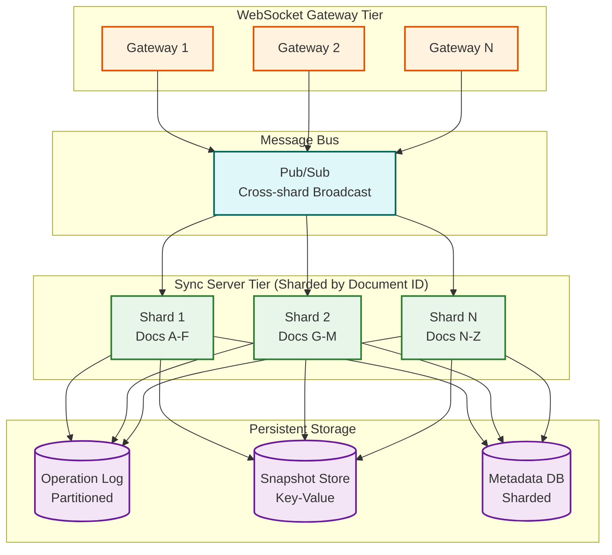
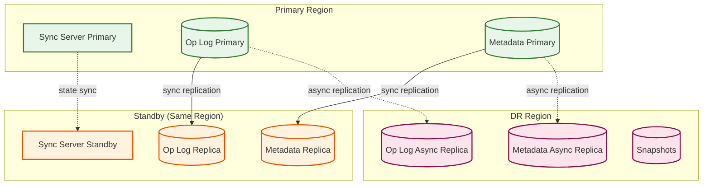

# Scalability & Reliability

## Scalability

### Horizontal Scaling Strategy



### Component Scaling Decisions

| Component | Scaling Type | Strategy | Trigger |
|-----------|-------------|----------|---------|
| **WebSocket Gateway** | Horizontal | Stateless; sticky sessions by document | >10K connections per node |
| **Sync Server** | Horizontal (sharded) | Document-ID hash-based sharding | >500 active docs per shard |
| **Presence Server** | Horizontal | Pub/sub with partition-per-document | >50K presence updates/sec |
| **Merge Server** | Horizontal (queue-based) | Auto-scaled worker pool | Queue depth > 100 |
| **Document Service** | Horizontal | Stateless REST/gRPC | CPU > 70% |
| **Operation Log** | Horizontal (partitioned) | Partition by document_id | Storage > 80% |
| **Metadata DB** | Horizontal (sharded) | Shard by workspace_id | QPS > 10K per shard |
| **Cache** | Horizontal | Distributed cache cluster | Hit rate < 90% |

### Database Scaling Strategy

#### Operation Log (Write-Heavy)

The operation log receives every edit from every user. Scaling approach:

1. **Partition by document_id**: All operations for a document on one partition
2. **Append-only writes**: No updates or deletes; optimized for sequential writes
3. **Time-based tiering**: Hot (< 24h) in fast storage, warm (< 30d) in standard storage, cold in compressed archive
4. **Compaction**: Periodically merge operation sequences into snapshots to reduce replay cost

```
Write throughput:
- 8M operations/sec peak
- Partitioned across 256 partitions
- ~31K writes/sec per partition (well within SSD limits)
```

#### Metadata DB (Read-Heavy for Listings)

1. **Read replicas**: 3-5 replicas per shard for document listing queries
2. **Shard by workspace_id**: Keeps all documents for a workspace on one shard
3. **Connection pooling**: Limit connections per service instance

#### Cache Layers

```
L1: Client-side (IndexedDB/SQLite)
    - Full CRDT state for recently accessed documents
    - Hit rate: ~90% for active editing sessions

L2: Sync server in-memory
    - Hot document CRDT state loaded in memory
    - Evict after 15 minutes of inactivity
    - Hit rate: ~95% for active documents

L3: Distributed cache (Redis cluster)
    - Serialized CRDT snapshots
    - TTL: 1 hour
    - Hit rate: ~85% for document loads

L4: Origin storage
    - Snapshot store + operation log replay
    - Always available (source of truth)
```

### Hot Spot Mitigation

| Hot Spot | Cause | Mitigation |
|----------|-------|------------|
| **Popular document** (100+ editors) | Viral template, company all-hands | Dedicated sync server instance; operation batching |
| **Large document** (10K+ blocks) | Knowledge base, documentation | Block-level lazy loading; subtree pagination |
| **Reconnection storm** | Office network restored after outage | Queue-based merge processing; gradual reconnection backoff |
| **Workspace listing** | Dashboard showing all documents | Materialized view; cache with short TTL |

### Auto-Scaling Triggers

| Metric | Scale Up | Scale Down | Cooldown |
|--------|----------|------------|----------|
| WebSocket connections per gateway | >8K | <2K | 5 min |
| Sync server active documents | >400 | <100 | 10 min |
| Merge queue depth | >50 | <5 | 3 min |
| Operation log write latency p99 | >100ms | <20ms | 10 min |
| Cache hit rate | <80% | >95% | 15 min |

---

## Reliability & Fault Tolerance

### Single Points of Failure (SPOF) Identification

| Component | SPOF Risk | Mitigation |
|-----------|-----------|------------|
| Sync server for a document | **High**: If the sync server holding a document crashes, real-time sync stops | Standby replica with CRDT state; automatic failover in <5s |
| WebSocket gateway | **Medium**: Clients disconnect and must reconnect | Multiple gateways behind LB; client reconnection with backoff |
| Operation log partition | **High**: Edits cannot be persisted | Triple replication; synchronous write to at least 2 replicas |
| Cache layer | **Low**: Increases latency but doesn't lose data | Cache warming from snapshots; graceful degradation |
| Client-side storage | **Low**: Only offline edits at risk | Periodic sync when online; IndexedDB is persistent |

### Redundancy Strategy



### Failover Mechanisms

#### Sync Server Failover

```
PROCEDURE sync_server_failover(failed_server):
    // 1. Detect failure (heartbeat timeout: 3s)
    IF missed_heartbeats >= 3:
        mark_server_unhealthy(failed_server)

    // 2. Identify affected documents
    affected_docs = documents_on_server(failed_server)

    // 3. Assign to standby or redistribute
    FOR doc IN affected_docs:
        new_server = select_standby_or_least_loaded()

        // 4. Load CRDT state from latest snapshot + operation log
        snapshot = load_latest_snapshot(doc.id)
        recent_ops = load_ops_since(doc.id, snapshot.sequence_id)
        crdt_state = replay(snapshot, recent_ops)

        // 5. Accept client reconnections
        new_server.accept_document(doc.id, crdt_state)

    // 6. Clients reconnect (they have local state, so no data loss)
    // Client sends state vector -> server sends diff -> converge
```

**Failover time**: < 5 seconds (detection 3s + state loading 1-2s)

**Data loss during failover**: Zero. Clients hold local CRDT state. Any operations not yet persisted to the operation log are resent on reconnect via the CRDT sync protocol.

#### Client Reconnection Strategy

```
PROCEDURE client_reconnect():
    attempt = 0
    WHILE NOT connected:
        delay = min(1000 * 2^attempt + random(0, 1000), 30000)
        WAIT delay
        TRY:
            ws = connect(sync_server_url)
            // Resume sync using state vectors (no full reload needed)
            send_state_vector(local_crdt.state_vector)
            receive_and_merge(server_diff)
            send_local_diff(local_diff)
            BREAK
        CATCH:
            attempt = attempt + 1
```

### Circuit Breaker Patterns

| Circuit | Trigger | Open Behavior | Recovery |
|---------|---------|---------------|----------|
| Sync server | 5 failures in 10s | Queue operations locally; retry after 30s | Half-open: test with single sync |
| Operation log write | 3 write failures | Buffer in sync server memory; alert | Flush buffer on recovery |
| Snapshot creation | 2 failures | Skip snapshot; continue with op log | Retry on next schedule |
| Search indexing | 5 failures in 1m | Stop indexing; serve stale results | Resume when service healthy |

### Graceful Degradation

| Failure Scenario | Degraded Behavior | User Experience |
|-----------------|-------------------|-----------------|
| Sync server down | Offline mode activates | Users continue editing locally; sync on recovery |
| Operation log unavailable | Sync server buffers in memory | Real-time collaboration continues; durability temporarily reduced |
| Cache failure | Direct reads from snapshot store | Increased latency for document loads (~200ms -> ~1s) |
| Presence server down | No multiplayer cursors | Document editing works normally; no cursor visibility |
| Search down | Search returns error | Document editing unaffected; search degraded message shown |

### Bulkhead Pattern

```
Sync Server Resource Isolation:

┌─────────────────────────────────────────────┐
│ Sync Server Instance                         │
│                                              │
│  ┌──────────────┐  ┌──────────────────────┐ │
│  │ VIP Documents │  │ Standard Documents    │ │
│  │ (dedicated    │  │ (shared thread pool)  │ │
│  │  thread pool) │  │                       │ │
│  │ Max: 10 docs  │  │ Max: 500 docs         │ │
│  └──────────────┘  └──────────────────────┘ │
│                                              │
│  ┌──────────────┐  ┌──────────────────────┐ │
│  │ Merge Workers │  │ Snapshot Workers      │ │
│  │ (isolated)    │  │ (isolated)            │ │
│  └──────────────┘  └──────────────────────┘ │
└─────────────────────────────────────────────┘
```

Documents with 50+ concurrent editors get a dedicated thread pool to prevent them from starving smaller documents.

---

## Disaster Recovery

### Recovery Objectives

| Metric | Target | Justification |
|--------|--------|---------------|
| **RTO** (Recovery Time Objective) | 30 minutes | Full service restoration including sync |
| **RPO** (Recovery Point Objective) | 0 seconds (zero data loss) | CRDT state on clients acts as distributed backup |
| **RTO for editing** | 0 seconds | Offline-first means editing never stops |

### Why CRDT Architecture Improves DR

Traditional architectures: Server is the single source of truth. If the server loses data, it's gone.

CRDT architecture: **Every client is a full replica.** If the server loses all data, clients hold complete document state. On reconnect, clients re-sync their state to the new server, effectively reconstructing the entire database from the distributed client replicas.

```
Disaster scenario: Complete server-side data loss

Recovery:
1. Deploy new server infrastructure (15 min)
2. Clients reconnect and detect empty server state vector
3. Each client sends its full CRDT state to the server
4. Server merges all client states (CRDT merge is commutative)
5. Server reconstructs complete document state
6. Full recovery with zero data loss

Caveat: Documents not open on any client would be lost.
Mitigation: Regular snapshots to cross-region blob storage.
```

### Backup Strategy

| Data | Backup Frequency | Retention | Storage |
|------|-----------------|-----------|---------|
| CRDT snapshots | Every 5 min (active docs) | 90 days | Cross-region blob storage |
| Operation log | Continuous replication | 1 year | Cross-region append log |
| Metadata | Every 1 hour | 30 days | Cross-region DB replica |
| Full workspace export | Daily | 30 days | Blob storage (encrypted) |

### Multi-Region Considerations

| Aspect | Strategy |
|--------|----------|
| **Active-active sync** | Not recommended for real-time editing (cross-region latency 50-200ms too high for keystroke sync) |
| **Active-passive** | Primary region handles all sync; DR region has async-replicated operation log |
| **Geo-routing** | Route users to nearest region for API calls; sync server pinned to document's home region |
| **Region failover** | Promote DR region; clients reconnect with local CRDT state |
| **Cross-region editing** | Acceptable with CRDT (eventual consistency); higher latency but still correct |

---

## Performance Optimization Strategies

### Operation Batching

```
Batching Strategy:

Problem: With 200 concurrent editors, broadcasting every individual keystroke
creates 200 × 199 = 39,800 messages/sec for a single document.

Solution: Batch operations in time windows.

Client-Side Batching:
  - Aggregate local CRDT operations in a 50ms window
  - Send one binary message containing all ops in the window
  - At 2 ops/sec per user, this batches ~0.1 ops per window (most windows have 0-1 ops)
  - For fast typists (10 chars/sec), batches 0.5 ops per window → meaningful reduction

Server-Side Batching:
  - Aggregate received operations per document in a 50ms window
  - Broadcast one batched update to all peers
  - Reduces broadcast fan-out from per-operation to per-window
  - 200 editors with 50ms batching: 20 batches/sec × 199 peers = 3,980 messages/sec
  - 10× reduction from unbatched approach

Trade-off: Adds 25-50ms average latency to edit propagation (acceptable within 300ms p99 budget)
```

### Delta Compression

```
Compression Strategy:

Binary CRDT deltas are already compact, but further compression helps for:
  - Large paste operations (1KB+ content)
  - Offline reconnection (10K+ accumulated operations)
  - Snapshot storage (40KB-2MB per document)

Approach:
  - Individual operations (< 200 bytes): No compression (overhead exceeds savings)
  - Batched operations (200 bytes - 10KB): LZ4 compression (fast, low CPU)
  - Large merges (> 10KB): Zstandard compression (better ratio, slightly slower)
  - Snapshots: Zstandard with dictionary trained on common CRDT patterns
    (achieves 60-70% compression on typical document snapshots)

Measured Savings:
  | Payload Type | Raw Size | Compressed | Ratio |
  |-------------|----------|------------|-------|
  | Single character insert | 47 bytes | N/A (too small) | - |
  | 50ms operation batch | 120 bytes | 95 bytes | 21% |
  | 1-hour offline merge | 85 KB | 28 KB | 67% |
  | Document snapshot (200 blocks) | 180 KB | 62 KB | 66% |
```

### Viewport-Aware Broadcasting

```
Viewport Filtering:

Problem: In a 10,000-block knowledge base, a user viewing page 7 doesn't need
real-time edits to page 3.

Solution: Track each client's viewport and only broadcast operations to blocks
within or adjacent to the viewport.

Implementation:
  1. Client reports viewport blocks on connect and on scroll:
     { type: "viewport", block_ids: ["block-a", "block-b", ...] }
  2. Server maintains a viewport map per client per document
  3. On operation broadcast, check if the affected block_id is in the client's viewport
  4. If not in viewport: queue the operation for lazy delivery (next full sync)
  5. If in viewport: deliver immediately

Savings:
  - For a 10K-block doc with 20 visible blocks, filters out 99.8% of operations
  - Only applies to very large documents (< 1000 blocks, all ops are broadcast)

Caveat:
  - Operations on parent blocks (page structure) are always broadcast
  - Viewport filtering is best-effort — full sync catches anything missed
```

---

## Degradation Hierarchy

When the system is under stress, services degrade in a prioritized order to protect the most critical functions:

| Priority | Service | Degradation | User Impact |
|----------|---------|-------------|-------------|
| **P0 — Never Degrade** | Local editing (client-side CRDT) | N/A | Users can always type |
| **P1 — Last to Degrade** | Operation log writes | Buffer in sync server memory (up to 60s) | Durability temporarily reduced |
| **P2** | Real-time sync (edit broadcast) | Increase batching window from 50ms to 500ms | Edits appear slightly delayed |
| **P3** | Document load | Serve from cache only; skip snapshot freshness check | Users may see slightly stale content |
| **P4** | Presence / cursors | Reduce update frequency from 30Hz to 5Hz | Cursors update less smoothly |
| **P5** | Search indexing | Pause indexing; serve stale index | Recent edits not searchable |
| **P6** | Version snapshots | Pause snapshot creation | Version history gap until recovery |
| **P7** | Notification delivery | Queue notifications; delay delivery | Mentions/comments delayed |

---

## Testing at Scale

### Load Testing Scenarios

| Scenario | Parameters | Target | What It Validates |
|----------|-----------|--------|-------------------|
| **Steady-state editing** | 2M concurrent users, 800K active docs, 4M ops/sec | p99 propagation < 300ms | Normal operating conditions |
| **Hot document** | 500 concurrent editors on one document | p99 propagation < 500ms | Fan-out scalability, batching effectiveness |
| **Mass reconnection** | 100K clients reconnect simultaneously | All merge within 5 min | Merge queue capacity, backpressure handling |
| **Large document load** | 50K-block document, 10 concurrent loaders | p99 load < 3s | Lazy loading, cache effectiveness |
| **Sustained offline merge** | 1000 clients, each with 10K offline ops | All merge within 10 min | Merge worker scaling, memory management |

### Chaos Engineering Experiments

| Experiment | What It Tests | Expected Behavior |
|-----------|--------------|-------------------|
| Kill sync server holding 500 active docs | Failover latency and data safety | Clients reconnect within 5s; zero data loss via client-side CRDT |
| Corrupt operation log partition | Data integrity and recovery | Hash chain validation catches corruption; rebuild from snapshot + surviving replicas |
| Introduce 200ms network latency to cache | Cache miss handling under degradation | Sync server falls back to snapshot store; increased latency but no errors |
| Drop 50% of WebSocket connections randomly | Client reconnection resilience | Exponential backoff reconnection; state vector sync recovers all state |
| Fill sync server memory to 90% | GC and eviction behavior | Emergency GC triggers; inactive docs evicted; no OOM crash |
| Partition between sync server and operation log | Write buffering under partition | Sync server buffers in memory; real-time collaboration continues; durability alert fires |

---

## Cost Attribution per Active Document

| Component | Cost per Active Doc/Month | Percentage |
|-----------|--------------------------|------------|
| Sync server memory (CRDT state) | $0.10 | 34% |
| Operation log storage | $0.08 | 28% |
| WebSocket connections | $0.04 | 14% |
| Snapshot storage | $0.03 | 10% |
| Search indexing | $0.02 | 7% |
| Cache slot | $0.01 | 4% |
| Observability overhead | $0.01 | 3% |
| **Total** | **$0.29** | **100%** |

The dominant cost is sync server memory---each active document's CRDT state must reside in RAM for real-time merge performance. This is the architectural cost of CRDT-native design: memory overhead is the price of offline-first correctness.
