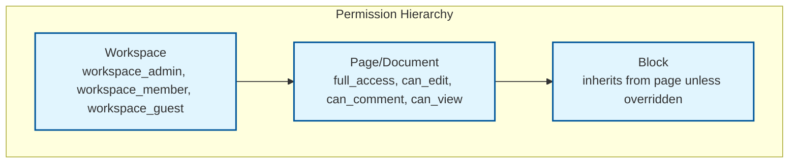

# Security & Compliance

## Authentication & Authorization

### Authentication Mechanism

| Method | Use Case | Details |
|--------|----------|---------|
| **OAuth 2.0 / OIDC** | Web and desktop app login | SSO via Google, Microsoft, SAML providers |
| **JWT access tokens** | API and WebSocket authentication | Short-lived (15 min); refreshed via refresh token |
| **API keys** | Programmatic access (integrations) | Scoped to workspace; rate limited |
| **WebSocket auth** | Real-time connection | JWT verified on connection upgrade; re-verified on token refresh |

#### WebSocket Authentication Flow

```
1. Client obtains JWT via OAuth flow
2. Client connects: wss://sync.example.com/docs/{id}
   Header: Authorization: Bearer {jwt}
3. Gateway validates JWT (signature, expiry, claims)
4. Gateway extracts user_id, workspace_id, permissions
5. Gateway establishes connection with user context
6. On token expiry: client sends new JWT via WebSocket message
7. Server re-validates without dropping connection
```

### Authorization Model: Hierarchical RBAC



| Role | Permissions |
|------|------------|
| **Workspace Admin** | All operations; manage members; delete workspace |
| **Workspace Member** | Create/edit own documents; access shared documents per sharing settings |
| **Workspace Guest** | Access only explicitly shared documents |
| **Document Full Access** | Edit, share, delete, manage permissions |
| **Document Editor** | Edit content, add comments |
| **Document Commenter** | Add comments, view content |
| **Document Viewer** | View only; no edits |

### Permission Enforcement Points

| Layer | What Is Checked | When |
|-------|----------------|------|
| **API Gateway** | JWT validity, workspace membership | Every REST request |
| **WebSocket Gateway** | Document-level permission (can_edit/can_view) | On connection + token refresh |
| **Sync Server** | Operation-level validation | Before merging each CRDT update |
| **Client** | UI-level restrictions (hide edit tools) | On document load (advisory) |

### Server-Side Operation Validation

```
FUNCTION validate_operation(user_id, document_id, operation):
    permission = get_permission(user_id, document_id)

    SWITCH operation.type:
        CASE "text_edit", "block_insert", "block_move", "block_delete":
            REQUIRE permission >= EDITOR
        CASE "comment_add":
            REQUIRE permission >= COMMENTER
        CASE "permission_change", "document_delete":
            REQUIRE permission >= FULL_ACCESS
        CASE "awareness_update":
            REQUIRE permission >= VIEWER

    // Additional validation for block moves
    IF operation.type == "block_move":
        // Prevent moving blocks to documents the user can't edit
        target_doc = get_document_for_block(operation.new_parent_id)
        REQUIRE get_permission(user_id, target_doc) >= EDITOR

    RETURN ALLOWED
```

---

## Data Security

### Encryption at Rest

| Data | Encryption | Key Management |
|------|-----------|----------------|
| CRDT state / snapshots | AES-256-GCM | Per-workspace keys in KMS |
| Operation log | AES-256-GCM | Per-workspace keys in KMS |
| Metadata DB | Transparent Data Encryption (TDE) | DB-managed with KMS master key |
| Client-side storage (IndexedDB) | AES-256-GCM | Per-user key derived from auth token |
| Blob storage (media) | Server-side encryption | Per-object keys in KMS |
| Backups | AES-256-GCM | Backup-specific keys; rotated quarterly |

### Encryption in Transit

| Channel | Protocol | Details |
|---------|----------|---------|
| REST API | TLS 1.3 | Certificate pinning on mobile clients |
| WebSocket | WSS (TLS 1.3) | Same TLS as REST; binary frames for CRDT data |
| Server-to-server | mTLS | Service mesh with mutual authentication |
| Client-to-CDN | TLS 1.3 | CDN terminates TLS; re-encrypts to origin |

### PII Handling

| Data Type | Classification | Handling |
|-----------|---------------|----------|
| User names, emails | PII | Encrypted at rest; access-logged |
| Document content | User Data | Encrypted at rest; workspace-isolated |
| Operation logs | User Data + Metadata | Contains user_id per operation; encrypted |
| Cursor positions | Ephemeral | Not persisted; not logged |
| IP addresses | PII | Logged for security; rotated after 90 days |
| Search queries | User Behavior | Anonymized after 30 days |

### Data Isolation

```
Workspace A                    Workspace B
┌─────────────────────┐       ┌─────────────────────┐
│ Shard: ws-a          │       │ Shard: ws-b          │
│ Encryption key: K_a  │       │ Encryption key: K_b  │
│ ┌─────────────────┐ │       │ ┌─────────────────┐ │
│ │ Documents        │ │       │ │ Documents        │ │
│ │ Operation Logs   │ │       │ │ Operation Logs   │ │
│ │ Snapshots        │ │       │ │ Snapshots        │ │
│ └─────────────────┘ │       │ └─────────────────┘ │
└─────────────────────┘       └─────────────────────┘

No cross-workspace data leakage is architecturally possible:
- Different encryption keys
- Different database shards
- Different search index partitions
```

---

## Threat Model

### Top Attack Vectors

| # | Attack Vector | Severity | Mitigation |
|---|--------------|----------|------------|
| 1 | **Malicious CRDT operations** | Critical | Server-side validation of every operation; schema enforcement; rate limiting |
| 2 | **WebSocket hijacking** | Critical | JWT auth on connection; re-auth on token refresh; connection-level encryption |
| 3 | **Permission escalation via block move** | High | Validate target document permissions on every move operation |
| 4 | **Operation log injection** | High | Append-only log with cryptographic signing; sequence validation |
| 5 | **Cross-workspace data access** | High | Workspace-level data isolation; separate encryption keys |

### Attack: Malicious CRDT Operations

**Scenario**: A compromised client sends crafted CRDT operations that, while valid CRDT operations, produce undesirable results (e.g., inserting millions of characters, creating deeply nested block trees to cause stack overflow).

**Mitigations**:
1. **Schema validation**: Every operation is checked against block type schema (max text length, max nesting depth, valid property values)
2. **Rate limiting**: Max 60 operations/sec per client; burst detection
3. **Size limits**: Max 1MB per document; max 10,000 blocks per document; max 20 nesting levels
4. **Anomaly detection**: Flag unusual operation patterns (rapid deletions, mass block creation)
5. **Rollback capability**: Admin can restore any document to a previous snapshot

### Attack: Offline Edit Injection

**Scenario**: An attacker modifies client-side IndexedDB to inject malicious content, then reconnects to sync poisoned data.

**Mitigations**:
1. **Server validates all operations** regardless of origin (online or offline)
2. **Content scanning**: Automated scanning for malware, XSS payloads, and malicious content on merge
3. **Digital signatures**: Each operation is signed with the user's session key; server verifies signature before merge
4. **Rate limiting on reconnect**: Limit the volume of operations accepted during offline merge (e.g., max 10,000 operations per reconnect)

### Rate Limiting & DDoS Protection

| Layer | Protection |
|-------|-----------|
| **Edge/CDN** | IP-based rate limiting; geographic blocking; bot detection |
| **API Gateway** | Per-user rate limits; token bucket per endpoint |
| **WebSocket Gateway** | Per-connection message rate; max connections per user (5) |
| **Sync Server** | Per-document operation rate; circuit breaker on hot documents |

---

## Compliance

### GDPR

| Requirement | Implementation |
|-------------|---------------|
| Right to access | Export API returns all user data (documents, comments, operation history) |
| Right to erasure | Delete user data; pseudonymize operations in shared documents |
| Data portability | Export in standard formats (Markdown, HTML, JSON) |
| Purpose limitation | Document content used only for the editing service |
| Data minimization | Operation logs compacted after snapshot; presence data not persisted |

### SOC 2

| Control | Implementation |
|---------|---------------|
| Access control | RBAC with workspace and document-level permissions |
| Audit logging | All permission changes, document shares, and admin actions logged |
| Encryption | At rest (AES-256) and in transit (TLS 1.3) |
| Availability | 99.95% SLA with offline editing as failsafe |
| Change management | Version history for all documents; operation log as audit trail |

### Audit Trail

All security-relevant events are logged to an immutable audit log:

| Event | Data Captured |
|-------|--------------|
| Document shared | Who, with whom, permission level, timestamp |
| Permission changed | Who, target user, old/new permission, timestamp |
| Document exported | Who, format, timestamp |
| Member invited/removed | Who, target, action, timestamp |
| Offline merge | Who, operations count, conflict count, timestamp |
| Admin restore | Who, document, restored version, timestamp |

---

## End-to-End Encryption Considerations

### The CRDT-E2EE Tension

End-to-end encryption (E2EE) creates a fundamental architectural tension with collaborative editing: the server must merge CRDT operations, but with E2EE, the server cannot read them.

```
Architecture Options for E2EE:

Option 1: Relay-Only Server (No Server-Side Merge)
  - Server cannot decrypt CRDT operations
  - Server acts as a relay: broadcast encrypted deltas to peers
  - Clients merge locally (already CRDT-native, so this works)
  - Trade-offs:
    - Breaks server-side search indexing (server can't read content)
    - Breaks server-side snapshot creation (server can't build state)
    - Server cannot validate operations (size limits, schema)
    - Offline reconnection requires at least one online peer with full state

Option 2: Per-Document Encryption with Server Key Escrow
  - Each document has a symmetric key, shared among authorized users
  - Server holds an encrypted copy of the key (encrypted with a recovery key)
  - Server can decrypt for indexing and validation, but only with the escrow key
  - Trade-offs:
    - Not true E2EE (server can access content)
    - Simpler operations; compatible with all server-side features
    - Acceptable for enterprise customers who trust the provider

Option 3: Client-Side Searchable Encryption
  - Content encrypted with document key
  - Blind index tokens generated client-side for search terms
  - Server indexes blind tokens without learning plaintext
  - Trade-offs:
    - Complex implementation
    - Search quality degradation (no fuzzy search, no ranking)
    - Active research area (not production-ready at scale)

Recommendation:
  Enterprise tier: Option 2 (per-document encryption with admin-managed keys)
  Privacy-focused tier: Option 1 (relay-only, sacrifice server features)
```

### Key Management for Encrypted Workspaces

```
Key Hierarchy:

Workspace Master Key (WMK)
├── Generated during workspace creation
├── Encrypted with each admin's public key
└── Stored in encrypted form server-side

Document Key (DK)
├── Generated per document
├── Encrypted with WMK
├── Shared with editors via encrypted key envelope
└── Rotated when a user with access is removed

User Key Pair
├── Generated on first login
├── Private key encrypted with user's password-derived key (PBKDF2)
├── Public key stored server-side
└── Used to decrypt WMK → DK chain

Key Rotation:
  - User removed from workspace → rotate WMK, re-encrypt all DKs
  - User removed from document → rotate that document's DK only
  - Password change → re-encrypt private key with new password-derived key
```

---

## Content Safety and Automated Scanning

### Content Policy Enforcement

Even with strong access controls, the system must prevent abuse: spam, malware links, illegal content, and data exfiltration.

```
Content Scanning Pipeline:

On Operation Merge (asynchronous, does not block real-time editing):
  1. Extract text content from CRDT update delta
  2. URL scanning: Check embedded URLs against threat intelligence feeds
  3. Content classification: Run text through abuse detection model
     - Spam detection (promotional content in shared docs)
     - Malware link detection (phishing URLs, drive-by download links)
     - PII leak detection (credit card numbers, SSNs in shared documents)
  4. Image scanning (when media is embedded):
     - Malware scanning (embedded file payloads)
     - CSAM detection (legally required in many jurisdictions)
  5. Action on detection:
     - Low confidence: Flag for human review
     - High confidence: Quarantine block (hide from other users), notify admin
     - Never silently delete content (audit trail required)

Rate-Based Anomaly Detection:
  - User creating > 100 blocks/minute → flag as potential bot/automation abuse
  - User sharing > 50 documents/hour → flag as potential data exfiltration
  - User exporting > 10 documents/day → flag for admin review
```

---

## Additional Threat Vectors

### Attack: Cross-Document Exfiltration via Synced Blocks

**Scenario**: An attacker with access to Document A creates a synced block reference pointing to a block in Document B (which they do not have permission to access), attempting to pull content from Document B into Document A.

**Mitigations**:
1. Synced block creation requires edit permission on BOTH the source and target documents
2. When rendering a synced block reference, the server checks that the requesting user has at least view permission on the source document
3. Synced block references to documents the user cannot access render as "Permission Required" placeholder blocks
4. Audit log records all synced block creation events for security review

### Attack: Operation Log Tampering

**Scenario**: An attacker gains access to the operation log storage and modifies historical operations to alter the content of documents retroactively.

**Mitigations**:
1. Operation log is append-only; no update or delete operations at the storage level
2. Each operation includes a cryptographic hash of the previous operation (hash chain)
3. Periodic integrity verification: background worker computes hash chain and alerts on mismatch
4. Snapshots include a hash of the CRDT state; replaying operations to a snapshot must produce a matching hash
5. Cross-region replication provides an independent copy for forensic comparison

### Attack: Workspace Admin Privilege Abuse

**Scenario**: A workspace admin accesses confidential documents they should not read, leveraging their admin role.

**Mitigations**:
1. Admin access to document content is logged and auditable
2. "Content admin" and "Workspace admin" can be separated: workspace admin manages members and billing; content admin can access document content
3. Enterprise tier: Break-glass access for content admin with mandatory justification and multi-party approval
4. All admin actions trigger notification to the document owner

---

## Additional Compliance Frameworks

### HIPAA (Healthcare Customers)

| Requirement | Implementation |
|-------------|---------------|
| Access controls | RBAC with document-level permissions; minimum necessary principle |
| Audit controls | Immutable audit log of all document access and modifications |
| Transmission security | TLS 1.3 for all connections; WSS for WebSocket |
| Encryption | AES-256-GCM at rest; per-workspace encryption keys |
| BAA | Business Associate Agreement required before onboarding healthcare customers |
| PHI in documents | Content scanning can detect potential PHI patterns; admin notification |
| Breach notification | Automated detection and 60-day notification timeline |

### ISO 27001 / SOC 2 Type II

| Control Area | Implementation |
|-------------|---------------|
| Information security policy | Enforced via infrastructure-as-code; policy violations detected by automated scanning |
| Asset management | All documents tracked with ownership, classification, retention policies |
| Cryptography | Documented key management lifecycle; annual key rotation for master keys |
| Operations security | Change management via version history; rollback capability via snapshots |
| Supplier relationships | Third-party CRDT libraries undergo security review; dependencies audited quarterly |
| Incident management | Automated alerting on convergence failures, unauthorized access, anomalous patterns |
| Business continuity | CRDT architecture provides inherent DR (clients as replicas); RTO < 30 min |

---

## Security Testing Matrix

| Attack Scenario | Test Method | Frequency | Pass Criteria |
|---|---|---|---|
| **Malicious CRDT operations** | Fuzz CRDT update payloads with invalid structures, oversized deltas, and malformed binary | Weekly automated | 100% rejected; no server crash or memory corruption |
| **Permission escalation via block move** | Move blocks across document boundaries with insufficient permissions | Weekly automated | All unauthorized moves rejected; audit log entry created |
| **WebSocket hijacking** | Attempt connection with expired, revoked, and forged JWT tokens | Weekly automated | 100% rejection; no state leakage |
| **Cross-workspace data access** | Query document APIs with valid auth but wrong workspace_id | Monthly automated | Zero cross-workspace data returned |
| **Offline edit injection** | Modify IndexedDB content to inject XSS/malware, then reconnect | Monthly automated | All payloads sanitized; content scanning triggered |
| **Operation log tampering** | Modify operation log entries and verify integrity check detection | Quarterly manual | Hash chain integrity check catches 100% of modifications |
| **DDoS via WebSocket flood** | Open maximum connections and flood with operations | Quarterly manual | Rate limiting and circuit breakers activate; legitimate traffic unaffected |
| **Synced block exfiltration** | Create synced block references to inaccessible documents | Monthly automated | Permission check blocks access; placeholder rendered instead |
