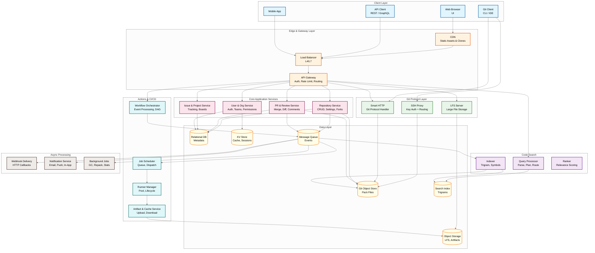
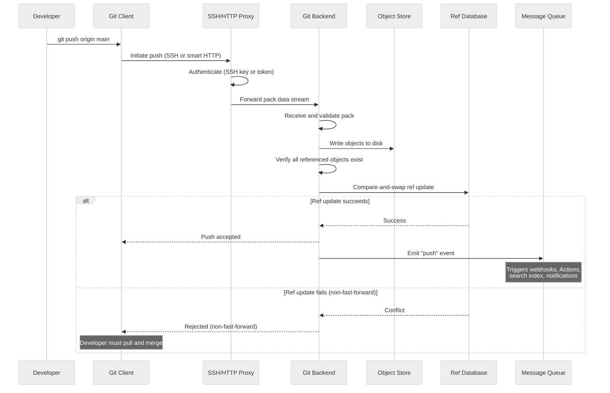
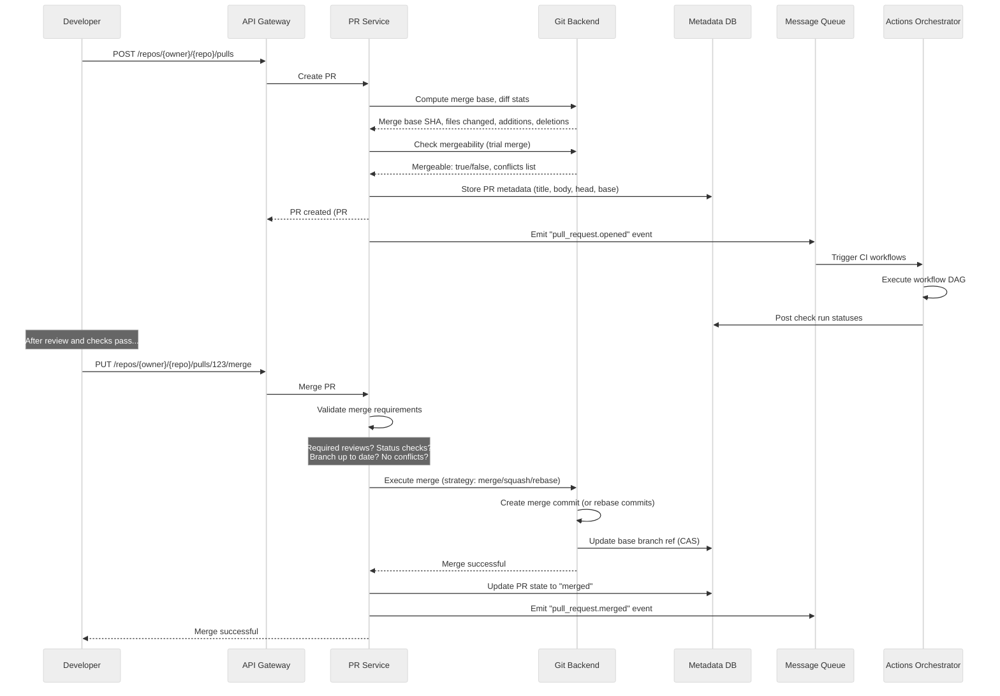
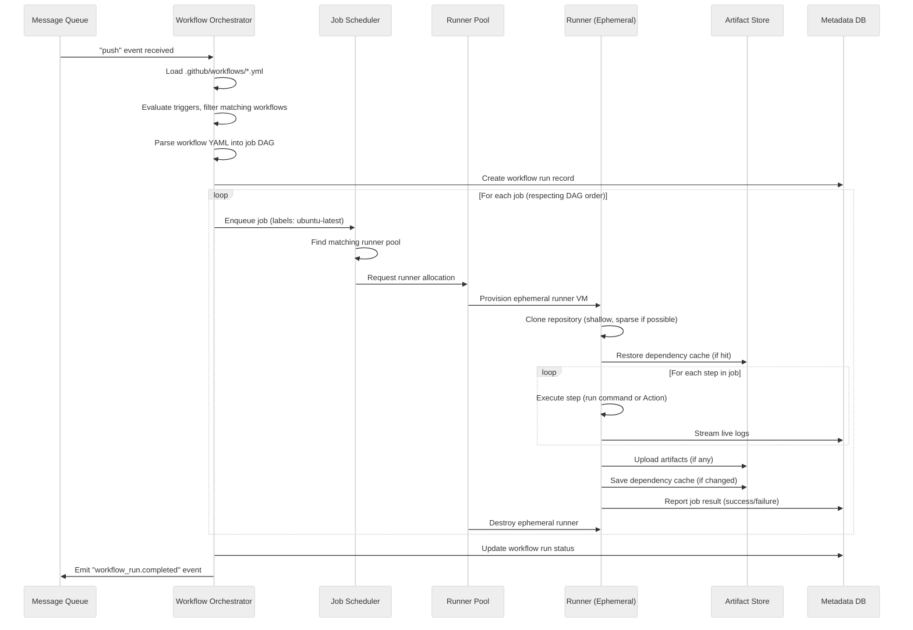
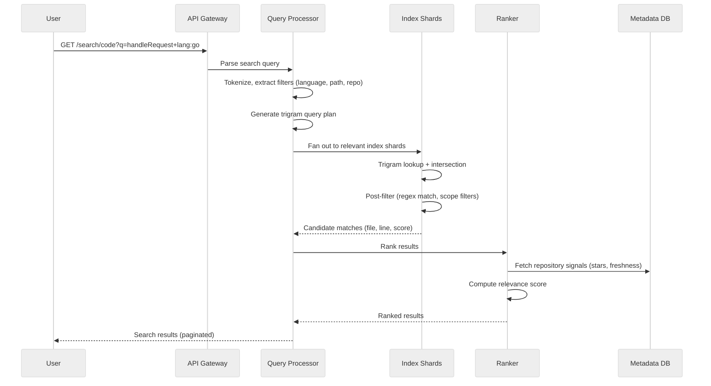

# High-Level Design

## System Architecture



---

## Key Architectural Decisions

### 1. Git Object Store as the Source of Truth

**Decision: Git's content-addressable object store is the primary data store for all source code**

| Factor | Custom Object Store | Git-Native Object Store (Chosen) |
|--------|--------------------|---------------------------------|
| Client compatibility | Requires custom client or translation layer | Works with any standard Git client |
| Deduplication | Must implement | Free via content addressing (SHA hash) |
| Integrity | Must implement checksums | Built-in (every object is verified by its hash) |
| Distributed replication | Must design protocol | Git protocol handles it natively |
| Query flexibility | Full control over indexes | Limited---must build indexes on top |
| Storage efficiency | Can optimize format | Pack files with delta compression |

Rationale: Git's content-addressable store provides integrity guarantees, deduplication, and client compatibility that would take years to replicate. The trade-off is limited query capability---we build metadata indexes in relational databases on top of the git data, treating git as the source of truth and the database as a derived, queryable view.

### 2. Dual Protocol: Smart HTTP + SSH

**Decision: Support both Git smart HTTP protocol and SSH protocol**

```
Developer's Machine
├── git push via SSH  ──> SSH Proxy ──> Git Backend ──> Object Store
└── git push via HTTPS ──> LB ──> Smart HTTP Handler ──> Git Backend ──> Object Store
```

- **SSH**: Preferred by developers; uses SSH key authentication; persistent connection; efficient for large transfers
- **Smart HTTP**: Works through corporate firewalls; uses token/password authentication; stateless; CDN-cacheable for fetches
- Both protocols converge at the same Git backend, ensuring identical behavior

### 3. Fork Graph with Shared Object Store

**Decision: Forks share the parent repository's object store using Git alternates**

```
Original Repository (linux/kernel)
├── objects/   ──> 50GB of git objects
├── Fork A (user1/kernel)
│   ├── objects/   ──> 10MB unique objects
│   └── alternates ──> points to linux/kernel/objects
├── Fork B (user2/kernel)
│   ├── objects/   ──> 5MB unique objects
│   └── alternates ──> points to linux/kernel/objects
└── 50,000 more forks sharing the same objects
```

This copy-on-write approach saves petabytes of storage. Without it, the Linux kernel repository (~4GB) multiplied by 50,000 forks would require 200TB instead of ~4.5TB.

### 4. Event-Driven Architecture for Cross-Cutting Concerns

**Decision: All state changes emit events to a message queue; downstream consumers react asynchronously**

```
git push ──> Update Refs
              ├──> Event: "push" ──> Message Queue
              │                       ├──> Webhook Delivery Service
              │                       ├──> Actions Workflow Trigger
              │                       ├──> Search Indexer
              │                       ├──> Notification Service
              │                       ├──> Statistics Updater
              │                       └──> Audit Logger
              └──> Return success to client
```

The push operation completes as soon as refs are updated and objects are stored. All downstream processing is asynchronous, keeping the critical path fast.

### 5. Metadata in Relational DB, Content in Git

**Decision: Separate metadata storage from content storage**

| Data | Storage | Rationale |
|------|---------|-----------|
| Repository metadata (name, settings, visibility) | Relational DB | Queryable, ACID transactions |
| User/org/team data | Relational DB | Relational queries (membership, permissions) |
| PR metadata (title, state, reviewers, labels) | Relational DB | Complex queries, status aggregation |
| Issue data | Relational DB | Full-text search, filtering, sorting |
| Git objects (blobs, trees, commits, tags) | Git object store (filesystem) | Content-addressable, protocol-native |
| LFS objects | Object storage (blob store) | Large binary files, CDN-served |
| Actions artifacts | Object storage | Temporary, large, CDN-served |
| Search index | Purpose-built search index | Trigram index, custom ranking |

### 6. Actions: Event-Driven DAG Execution

**Decision: Workflows are event-triggered DAGs of jobs executed on ephemeral runners**

| Factor | Monolithic CI Server | DAG-Based Ephemeral Runners (Chosen) |
|--------|---------------------|--------------------------------------|
| Isolation | Shared build environment (contamination risk) | Fresh environment per job (clean slate) |
| Scalability | Vertical scaling of CI server | Horizontal scaling of runner pool |
| Security | All builds share secrets/network | Per-job isolation with scoped secrets |
| Resource utilization | Idle servers during off-hours | Elastic scaling (spin up/down with demand) |
| Multi-architecture | Multiple CI servers per arch | Runner labels select appropriate pool |

---

## Data Flow

### Git Push Flow



### Pull Request Creation & Merge Flow



### Actions Workflow Execution Flow



### Code Search Query Flow



---

## Architecture Pattern Checklist

- [x] **Sync vs Async**: Git push is synchronous (wait for ref update); all downstream processing (webhooks, search, CI) is async
- [x] **Event-driven vs Request-response**: Event-driven for cross-cutting concerns (push triggers N downstream systems); request-response for CRUD APIs
- [x] **Push vs Pull**: Push for live updates (WebSocket for PR status); pull for git operations (client initiates fetch)
- [x] **Stateless vs Stateful**: API servers are stateless; git servers maintain filesystem state; WebSocket servers maintain connection state
- [x] **Read-heavy vs Write-heavy**: 10:1 read:write for git operations; write-heavy for event processing
- [x] **Real-time vs Batch**: Real-time for git operations and webhooks; batch for search indexing, garbage collection, statistics
- [x] **Edge vs Origin**: CDN edge for clone caching, release downloads, static assets; origin for git write operations
- [x] **Content-addressed vs Location-addressed**: Git objects are content-addressed (hash is the identifier); refs are location-addressed (name → hash mapping)
- [x] **Immutable vs Mutable**: Git objects are immutable (same hash = same content forever); refs are the only mutable data (branch pointers can change)
- [x] **Derived vs Source**: Relational database is a derived index; git object store is the source of truth; search index is a derived view of git data
- [x] **Speculative vs Conservative**: Merge queue uses speculative batch testing; falls back to bisection on failure. Fork GC uses conservative reference counting (never delete a potentially-referenced object)
- [x] **Ephemeral vs Persistent**: Runners are ephemeral (destroyed after each job); git storage is persistent with 11-nines durability

---

## Component Responsibilities

| Component | Responsibility | Scaling Strategy |
|-----------|---------------|-----------------|
| **SSH Proxy** | SSH authentication, connection routing | Horizontal (stateless auth check + route) |
| **Smart HTTP Handler** | Git protocol over HTTP, pack negotiation | Horizontal (stateless per-request) |
| **API Gateway** | Authentication, rate limiting, request routing | Horizontal (stateless) |
| **Repository Service** | CRUD for repositories, fork management, settings | Horizontal (stateless, DB-backed) |
| **PR & Review Service** | PR lifecycle, merge operations, diff computation | Horizontal + cache diff results |
| **Git Backend** | Pack/unpack objects, ref management, merge operations | Sharded by repository (filesystem affinity) |
| **Workflow Orchestrator** | Parse workflows, manage DAG execution | Horizontal (event-driven) |
| **Job Scheduler** | Job queuing, runner matching, dispatching | Horizontal with partitioned queues |
| **Runner Manager** | Runner pool lifecycle, autoscaling | Per-pool scaling (labels/arch) |
| **Search Indexer** | Build and update trigram indexes | Horizontal (partitioned by repo hash) |
| **Search Query Server** | Query parsing, shard fan-out, result merging | Horizontal (stateless query router) |
| **Webhook Delivery** | Reliable HTTP callback delivery | Horizontal with retry queues |
| **Object Store** | Git object persistence (pack files) | Distributed filesystem, sharded by repo |
| **Relational DB** | Metadata persistence, relational queries | Primary-replica with horizontal sharding |
| **Notification Service** | In-app, email, mobile push notification delivery | Horizontal with per-channel fan-out workers |
| **Dependency Graph Service** | Parse manifests (package.json, go.mod, Gemfile); build dependency graph; detect vulnerable dependencies | Event-driven (triggered on push to default branch) |
| **Secret Scanner** | Scan every push for leaked credentials against 200+ secret patterns | Inline on push event; pattern-matched against provider signatures |
| **Code Scanning Engine** | Static analysis (SAST) on pushed code using configurable rulesets | Triggered as Actions workflow; results surfaced in PR review |
| **Audit Log Service** | Record all privileged actions for compliance (enterprise) | Append-only with immutable retention policies |
| **Package Registry** | Package hosting for npm, Maven, Docker, NuGet, RubyGems with version management | Distributed object store per package type |
| **Pages Service** | Static site hosting from repository branches with custom domain support | CDN-served with automated build on push |
| **Copilot Service** | AI-assisted code completion and PR review requiring real-time repo context retrieval | GPU inference cluster with context retrieval from code search |
| **Merge Queue** | Speculative batch testing of queued PRs with bisection on failure | Event-driven with temporary branch management |

---

## Key Design Decisions

### Decision 1: Git Objects on Filesystem vs. Object Store

Git's content-addressable object model maps naturally to a filesystem: each object is a file named by its SHA hash. The alternative—storing objects in a database or object store service—adds query flexibility but loses the tight integration with Git's pack format and protocol.

**Chosen approach:** Filesystem-based storage with a distributed filesystem layer for replication and durability. Git objects are stored in their native format (loose objects + pack files) on the filesystem, with a distributed filesystem providing cross-datacenter replication and 11-nines durability. The relational database stores only metadata (repos, PRs, users, permissions) as derived indexes over the git data.

**Implication:** The git backend servers have filesystem affinity—a repository's objects live on specific storage nodes, and git operations for that repo must be routed to those nodes. This creates a sharding constraint: repos are assigned to storage shards, and the routing layer must map repository → shard consistently. Shard rebalancing requires moving git object data across nodes, which for large repos (>1GB) is a heavyweight operation coordinated during low-traffic periods.

### Decision 2: Asynchronous Event Fan-Out from Push

The push operation is kept synchronous and fast (receive objects + update ref via CAS, <500ms p50). All downstream processing—webhooks, CI triggers, search indexing, notification delivery, dependency scanning, secret scanning—is decoupled through an event bus.

**Chosen approach:** A single `push_event` is emitted to a message broker after ref update. Each downstream consumer subscribes independently with its own consumer group, processing at its own pace. Consumers that fall behind queue up without affecting the push path or other consumers.

**Implication:** This architecture accepts eventual consistency for derived data (search indexes, CI status, notification delivery) in exchange for consistently fast push latency. The trade-off is visible to users: there's a brief window after pushing where the search index hasn't been updated and CI hasn't started. The webhook delivery SLO (99.9% within 1 hour) reflects this asynchronous model—most deliveries happen in seconds, but the system tolerates delays without blocking pushes.

### Decision 3: Trigram Indexing for Code Search

Code search requires substring matching (developers search for partial identifiers like `handleReq`), regex support, and language-aware filtering—none of which are well-served by token-based full-text search engines.

**Chosen approach:** Trigram index: every 3-character subsequence in every code file is indexed. A search query is decomposed into trigrams, their posting lists are intersected to find candidate files, and a verification pass confirms the actual substring match. The index supports scope filtering (language, path, repo, org) via separate filter indexes.

**Implication:** Trigram indexes are 5-10x the size of the source corpus, making index size the primary scaling constraint. At 200M+ repositories, the effective index size is ~2PB (after deduplication of identical files across forks). This requires 20,000+ index shards distributed across 300+ query servers. Incremental index updates (re-index only files changed in each push, not the entire repo) are essential for keeping the index fresh within minutes.

### Decision 4: Merge Queue for High-Throughput Repositories

For repositories with required CI checks before merge, serial test-merge cycles create a Slowest part of the process: each PR must be tested against the latest base branch, and only one PR can merge at a time. The merge queue speculatively batches PRs and tests them together.

**Chosen approach:** When a PR is enqueued for merge, the system creates a temporary branch containing all currently queued PRs stacked on the base branch. CI runs against this combined branch. If all checks pass, all queued PRs are merged atomically. If CI fails, the queue bisects: split the batch in half, test each half independently, and recursively isolate the failing PR.

**Implication:** The optimistic path transforms O(n × CI_time) serial merge latency into O(CI_time × log₂(n)) for failure cases, with the common case being O(CI_time × 1) when all PRs are compatible. This requires the CI infrastructure to handle speculative branches that may be abandoned if a batch splits. The merge queue also interacts with branch protection rules: each PR's individual approval status must be preserved even when tested in combination with other PRs. The queue must also handle dynamic reordering: if a high-priority PR enters the queue, it may be inserted ahead of lower-priority PRs, invalidating the current batch's speculative test and requiring a restart with the new ordering.

### Decision 5: Code Intelligence Pipeline Architecture

Code navigation features (jump-to-definition, find-references, hover documentation) require language-aware analysis that goes beyond text matching. The system must parse source code into abstract syntax trees, extract symbol definitions and references, and build cross-file dependency graphs---all at the scale of 200M+ repositories.
