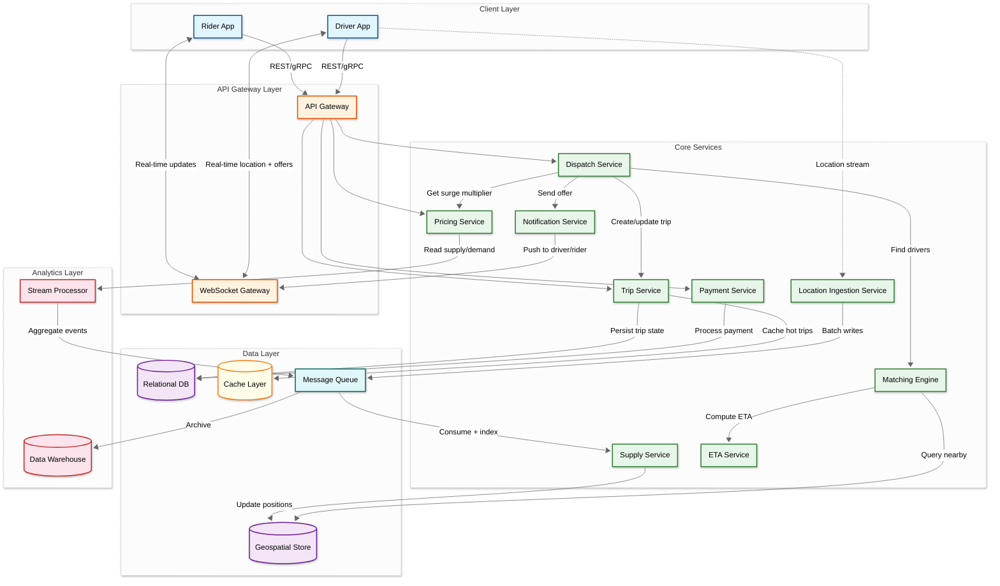
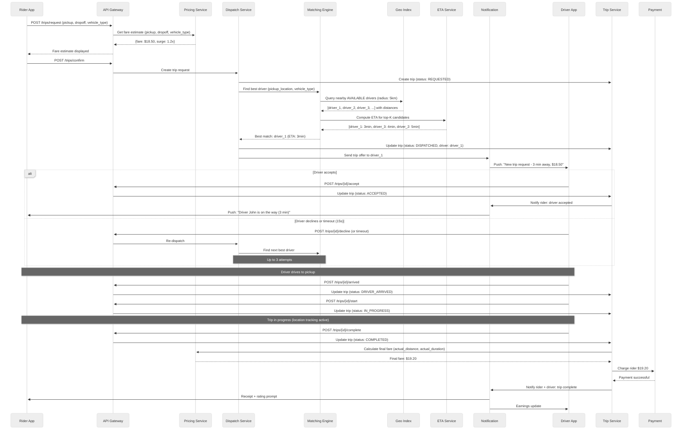
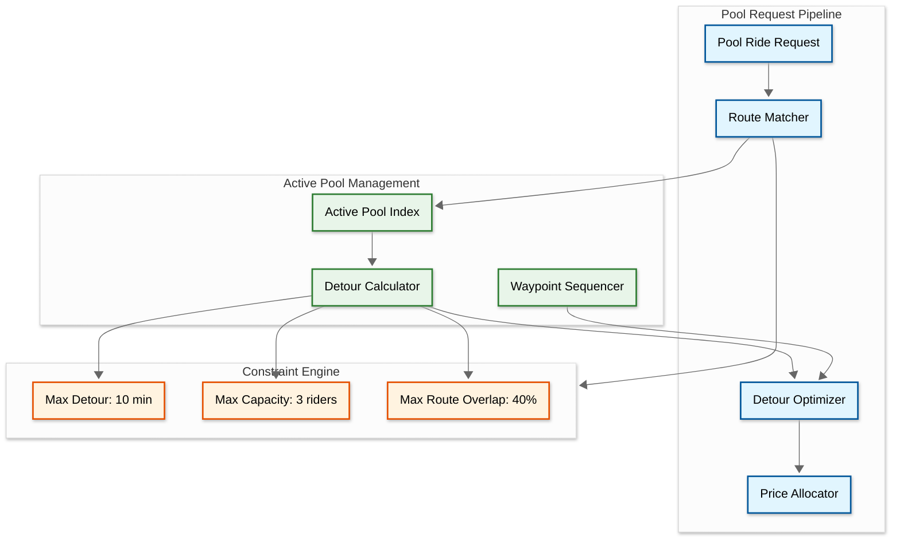
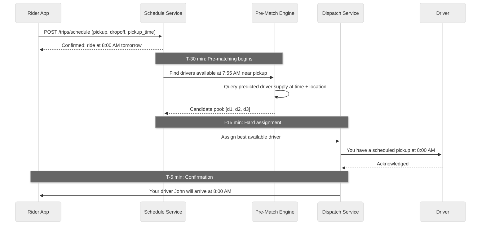
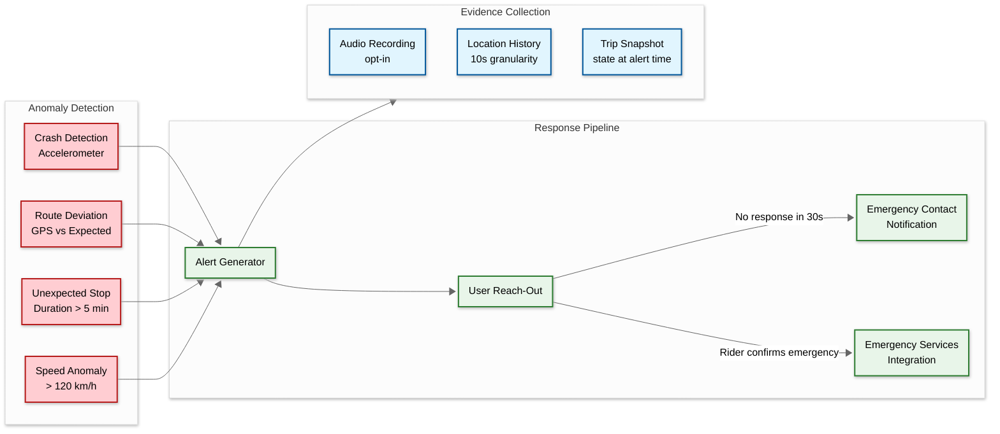
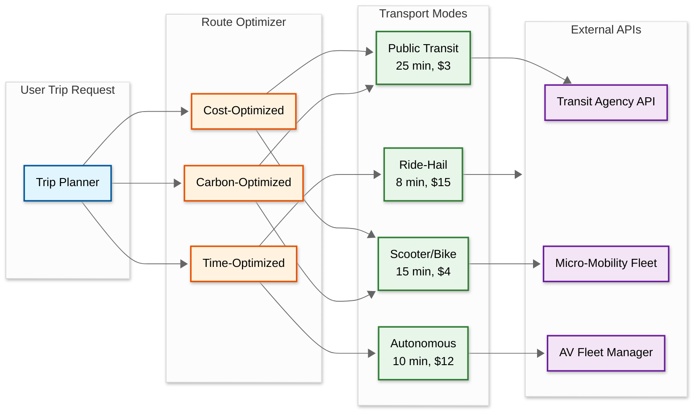
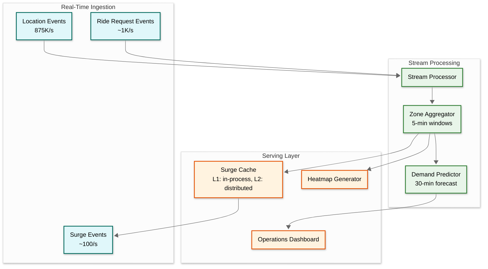

# High-Level Design

## System Architecture



---

## Service Responsibilities

| Service | Responsibility | Stateful? | Scale Strategy |
|---------|---------------|-----------|----------------|
| **Location Ingestion Service** | Receives raw GPS data from driver apps, validates, batches, publishes to message queue | Stateless | Horizontal; partition by driver_id |
| **Supply Service** | Consumes location events, updates the geospatial index, tracks driver availability | Stateful (geo index) | Per-city sharding |
| **Matching Engine** | Given a rider location, queries nearby available drivers, ranks by ETA, returns candidates | Stateless | Horizontal; reads from geo index |
| **Dispatch Service** | Orchestrates the trip request flow: pricing -> matching -> offer -> accept/decline -> re-dispatch | Stateless | Horizontal |
| **Trip Service** | Manages the trip state machine (REQUESTED -> COMPLETED), persists trip records | Stateful (trip state) | Shard by trip_id |
| **Pricing Service** | Computes upfront fare estimates, surge multipliers, and final fares | Stateless | Horizontal; cached surge multipliers |
| **ETA Service** | Computes estimated time of arrival using routing engine and real-time traffic data | Stateless | Horizontal; read-heavy |
| **Payment Service** | Processes charges, refunds, driver payouts; integrates with payment processors | Stateful (ledger) | Shard by user_id |
| **Notification Service** | Delivers push notifications, SMS, and WebSocket messages to riders and drivers | Stateless | Horizontal |
| **WebSocket Gateway** | Maintains persistent connections with mobile clients for real-time updates | Stateful (connections) | Per-connection affinity |

---

## Data Flow: Ride Request to Trip Completion

### Step-by-Step Flow



---

## Key Architectural Decisions

### 1. Separate Location Ingestion from Matching

**Decision**: Location data flows through a dedicated ingestion pipeline (message queue -> supply service -> geospatial index) rather than hitting the matching engine directly.

**Rationale**: Location updates (875K/s) vastly outnumber match requests (~1K/s). Coupling them would force the matching engine to handle 875x its actual workload. The ingestion pipeline can batch, deduplicate, and filter stale updates before writing to the geospatial index.

### 2. In-Memory Geospatial Index (Not Relational Database)

**Decision**: Driver locations are stored in an in-memory geospatial data structure, not in a relational database.

**Rationale**: A relational database cannot sustain 875K writes/second with sub-100ms query latency for geospatial nearest-neighbor searches. An in-memory store with geospatial indexing (geohash or H3 hexagonal grid) provides O(1) updates and O(log n) nearest-neighbor queries within the required latency bounds.

### 3. H3 Hexagonal Grid over Geohash for Spatial Partitioning

**Decision**: Use Uber's H3 hexagonal grid system rather than geohash for spatial indexing and zone definitions.

**Rationale**: Geohash cells are rectangular and vary in size at different latitudes, creating boundary artifacts. H3 hexagons have uniform area, equidistant neighbors, and a hierarchical resolution system (16 levels). This makes proximity queries consistent regardless of location and eliminates edge effects at cell boundaries.

### 4. Two-Phase Matching: Geo Filter + ETA Ranking

**Decision**: Matching is split into a fast geo-filter phase (find nearby drivers) and an expensive ETA-ranking phase (compute actual drive time for top candidates).

**Rationale**: Computing ETA for every available driver in a city would be prohibitively expensive (requires routing engine calls). The geo filter narrows from thousands of drivers to 5-10 candidates in microseconds; ETA computation then ranks those candidates in ~200ms. This two-phase design keeps matching under 1 second.

### 5. Persistent Trip State Machine

**Decision**: Every trip state transition is persisted to a durable datastore before acknowledgment, and the state machine enforces valid transitions.

**Rationale**: Trips involve money, safety, and legal liability. A lost trip state means a driver worked without getting paid, or a rider was charged without completing a trip. The state machine must survive any single component failure, including the complete loss of the dispatch service.

### 6. Event-Driven Architecture with Message Queue Backbone

**Decision**: All inter-service communication for non-latency-critical paths flows through a message queue (location updates, notifications, analytics, surge computation).

**Rationale**: Decouples the high-throughput location pipeline from the trip orchestration path. Allows independent scaling of consumers. Provides natural buffering during traffic spikes and enables replay for analytics.

### 7. City-Based Data Partitioning

**Decision**: All operational data (trips, driver locations, surge zones) is partitioned by city/region.

**Rationale**: A trip in Mumbai never interacts with driver data in New York. City-based partitioning provides natural data locality, enables regional deployments for latency, and simplifies scaling (add capacity per city as it grows).

---

## Ride Pooling Architecture

Shared rides (UberPool, Lyft Shared) fundamentally change the matching problem from 1:1 assignment to a combinatorial optimization where multiple riders share a vehicle along overlapping routes.



### Pool Matching Decision

```
Step-by-step plan in plain English: Pool Match Decision

FUNCTION try_pool_match(new_rider, active_pools):
    best_pool = null
    best_detour = MAX_INT

    FOR pool IN active_pools:
        IF pool.rider_count >= MAX_POOL_CAPACITY:
            CONTINUE

        // Calculate detour for adding this rider
        original_route = pool.current_optimized_route
        new_route = optimize_waypoints(original_route, new_rider.pickup, new_rider.dropoff)
        detour_minutes = new_route.duration - original_route.remaining_duration

        IF detour_minutes > MAX_DETOUR_MINUTES:
            CONTINUE

        // Check route overlap (shared segment / total segment)
        overlap = compute_route_overlap(pool.route, new_rider.pickup, new_rider.dropoff)
        IF overlap < MIN_ROUTE_OVERLAP:
            CONTINUE

        IF detour_minutes < best_detour:
            best_pool = pool
            best_detour = detour_minutes

    IF best_pool IS NOT NULL:
        RETURN {match: best_pool, detour: best_detour, discount: compute_pool_discount(best_detour)}
    ELSE:
        RETURN {match: null}  // Start new pool or offer standard ride
```

### Pool vs. Standard Ride Trade-offs

| Dimension | Standard Ride | Pool Ride |
|-----------|--------------|-----------|
| Matching complexity | O(n) nearest drivers | O(n * m) active pools * detour computations |
| Pricing | Distance * time * surge | Shared cost allocation (30-50% discount) |
| Driver utilization | 1 fare per trip | 2-3 fares per trip |
| Rider wait time | Optimized for pickup speed | Accepts longer pickup + detour for lower price |
| ETA predictability | High (direct route) | Lower (depends on co-rider stops) |

---

## Scheduled Rides Architecture



### Scheduled Ride Constraints

| Constraint | Value | Rationale |
|-----------|-------|-----------|
| Minimum advance booking | 30 minutes | Need time for pre-matching |
| Maximum advance booking | 30 days | Supply prediction accuracy degrades beyond this |
| Pre-match window | T-30 to T-15 minutes | Balance between driver commitment and supply prediction |
| Hard assignment window | T-15 minutes | Driver commits; cancellation fee applies |
| Supply buffer | 1.5x drivers to scheduled rides | Account for driver cancellations and no-shows |
| No-show timeout | 10 minutes past scheduled time | Longer than on-demand (5 min) due to commitment |

---

## Safety & Emergency Architecture



---

## ML-Enhanced Matching Pipeline

Modern ride-hailing systems use ML models to optimize matching beyond simple distance + ETA ranking.

```
Matching Signal Hierarchy:

  Traditional:                ML-Enhanced:
  ┌─────────────────────┐    ┌──────────────────────────────┐
  │ 1. Nearest driver   │    │ 1. Predicted trip completion  │
  │ 2. Shortest ETA     │    │    probability                │
  │ 3. Driver rating    │    │ 2. Driver acceptance          │
  │                     │    │    prediction                 │
  │                     │    │ 3. Predicted rider rating     │
  │                     │    │ 4. Predicted trip satisfaction│
  │                     │    │ 5. Platform revenue impact    │
  │                     │    │ 6. Driver earnings fairness   │
  └─────────────────────┘    └──────────────────────────────┘
```

### ML Features for Match Scoring

| Feature Category | Examples | Source |
|-----------------|----------|--------|
| Spatial | Distance, ETA, heading alignment, road network topology | Geo index + routing engine |
| Driver behavioral | Historical acceptance rate, cancellation rate, rating by trip type | Feature store |
| Temporal | Time of day, day of week, demand forecast for next 30 min | Stream processor |
| Trip characteristics | Distance, duration, fare, destination desirability (airport vs. residential) | Pricing service |
| Supply dynamics | Number of nearby drivers, surge state, predicted future supply | Supply service |

---

## EV Fleet Management Architecture

Electric vehicle fleet operations introduce battery management as a first-class system constraint alongside supply/demand matching.

### EV-Specific Routing Constraints

| Constraint | Impact on Matching |
|-----------|-------------------|
| Battery level < 20% | Exclude from dispatch for trips > 10 km |
| Charging station proximity | Factor charging detour into ETA for low-battery vehicles |
| Range anxiety threshold | Driver app shows remaining range and nearby chargers |
| Fleet charging schedule | Coordinate off-peak charging to avoid grid strain |
| Battery degradation tracking | Monitor charge cycles; schedule maintenance proactively |

---

## Multi-Modal Transport Integration

Modern ride-hailing platforms evolve toward unified mobility platforms that combine multiple transport modes into a single trip.



### Multi-Modal Trip Composition

| Mode Combination | Use Case | Pricing Model |
|-----------------|----------|---------------|
| Ride-hail only | Direct point-to-point, time-sensitive | Standard fare + surge |
| Scooter → Transit → Ride-hail | Cost-optimized commute | Combined fare with modal discount |
| Ride-hail → Transit | Suburbs to city center | First/last mile pricing |
| AV + Ride-hail | AV for highway portion, human driver for complex urban pickup | Blended rate |
| Bike → Transit | Eco-conscious short trip | Flat unlock fee + per-minute |

---

## Supply Demand Visualization Architecture



---

## Data Flow Summary

| Flow | Producer | Consumer | Protocol | Volume |
|------|----------|----------|----------|--------|
| Driver location updates | Driver App | Location Ingestion Service | WebSocket | 875K/s |
| Ride request | Rider App | Dispatch Service | REST/gRPC | ~1K/s peak |
| Driver offer | Dispatch Service | Driver App | WebSocket push | ~1K/s peak |
| Trip state transitions | Trip Service | Message Queue → Analytics | Event | ~5K/s peak |
| Surge updates | Surge Calculator | Pricing Cache | Event | ~100/s |
| Driver tracking (rider view) | Geo Index | Rider App | WebSocket push | ~500K/s |
| Payment charges | Trip Service | Payment Service | gRPC | ~1K/s peak |
| ETA computation | Matching Engine | Routing Engine | gRPC | ~5K/s peak |
| Safety alerts | Safety Service | Safety Team Dashboard | Event | ~10/s |
| Supply repositioning suggestions | Recommendation Engine | Driver App | Push notification | ~100/s |

---

## Architecture Pattern Checklist

| Pattern | Decision | Justification |
|---------|----------|---------------|
| Sync vs Async | Sync for ride request flow; async for location ingestion, notifications, analytics | Matching must be real-time; everything else can be async |
| Event-driven vs Request-response | Event-driven for location pipeline and pricing; request-response for trip operations | Location is fire-and-forget; trip operations need acknowledgment |
| Push vs Pull | Push for driver location to server; push from server to riders via WebSocket | Both sides need real-time updates |
| Stateless vs Stateful | Matching/dispatch stateless; supply service/trip service stateful | Stateless services scale horizontally; state is in the data layer |
| Write-heavy vs Read-heavy | Write-heavy for location ingestion; read-heavy for rider-facing APIs | Different optimization strategies for each path |
| Real-time vs Batch | Real-time for matching, tracking, surge; batch for analytics, reporting | Operational systems are real-time; business intelligence is batch |
| Edge vs Origin | Edge for WebSocket termination (closest PoP); origin for matching and trip state | Minimize connection latency; centralize business logic per region |
