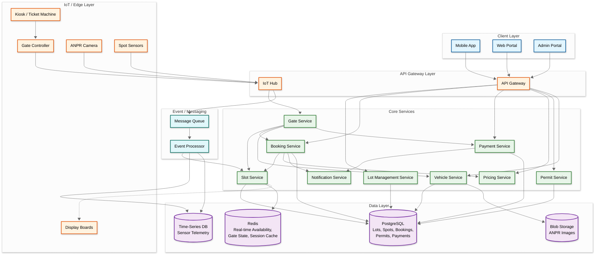
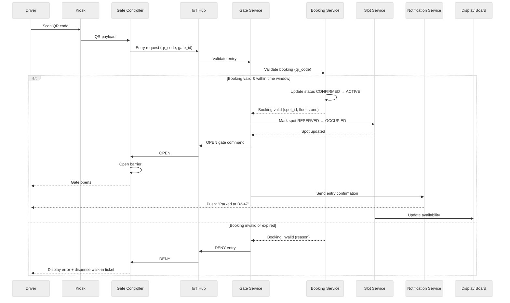
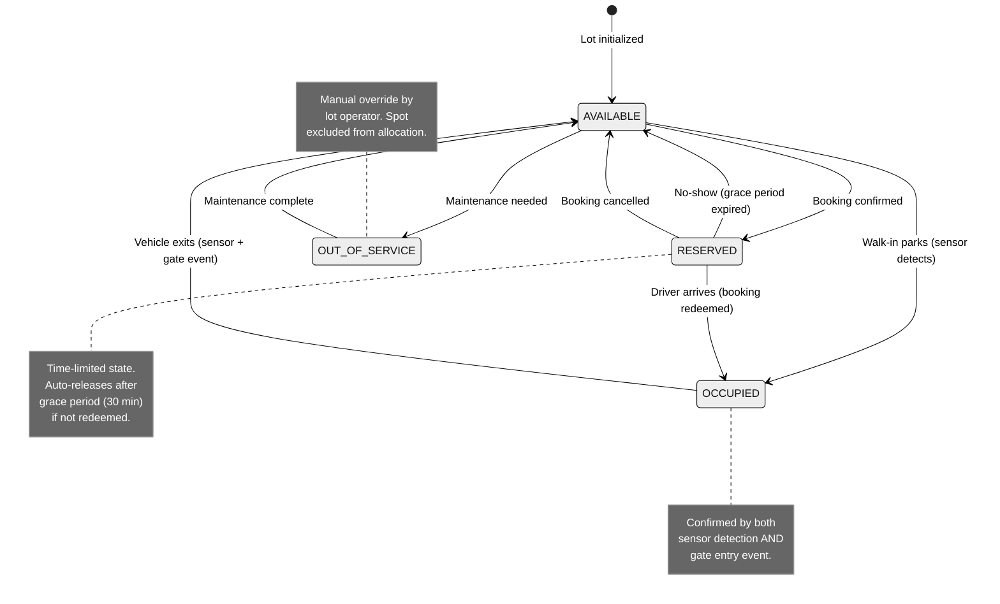
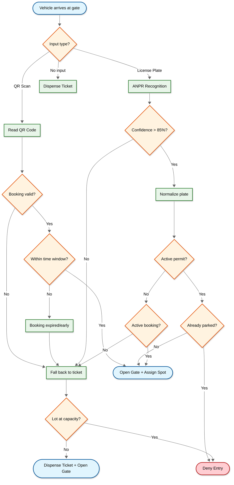
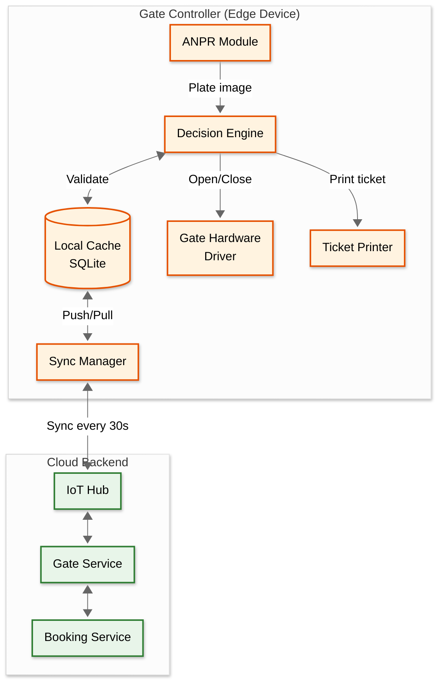
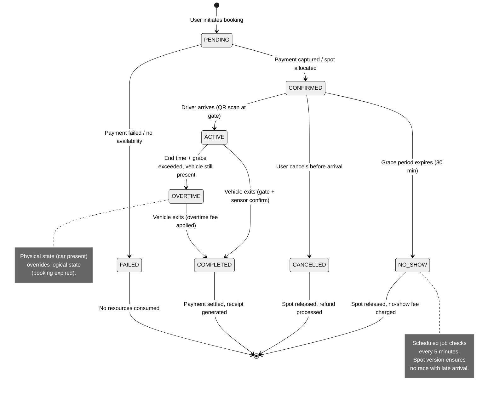

# High-Level Design

## Architecture Overview



---

## Service Responsibilities

| Service | Responsibility | Data Owned |
|---------|---------------|------------|
| **Lot Management Service** | CRUD for lots, floors, zones; operating hours; lot configuration | `parking_lots`, `floors`, `zones` |
| **Slot Service** | Spot lifecycle management; real-time availability tracking; sensor event processing | `parking_spots`, Redis availability bitmaps |
| **Booking Service** | Reservation creation, modification, cancellation; time-window validation; QR code generation | `bookings` |
| **Vehicle Service** | Vehicle registration; ANPR image storage and plate lookup; vehicle-user association | `vehicles`, ANPR images in blob storage |
| **Gate Service** | Gate open/close commands; entry/exit event processing; offline mode orchestration | `gate_events`, gate controller state |
| **Payment Service** | Fee calculation; payment processing; refunds; receipt generation | `payments`, `invoices` |
| **Pricing Service** | Rate management; peak/off-peak rules; event-based surge; daily cap calculation | `pricing_rules` |
| **Permit Service** | Monthly/annual permit CRUD; permit validation; auto-renewal | `permits` |
| **Notification Service** | Push notifications; SMS alerts; email confirmations | Notification logs |

---

## Data Flow Narratives

### Flow 1: Pre-Booked Entry (QR Code)

```
1. Driver arrives at entry gate with active reservation
2. Driver scans QR code at gate kiosk
3. Gate Controller sends QR data to Gate Service via IoT Hub
4. Gate Service calls Booking Service to validate:
   - Booking exists and status = CONFIRMED
   - Current time is within entry window (start_time ± grace period)
   - Booking lot matches this gate's lot
5. Booking Service updates booking status: CONFIRMED → ACTIVE
6. Slot Service marks the reserved spot: RESERVED → OCCUPIED
7. Gate Service sends OPEN command to Gate Controller
8. Gate Controller opens barrier, logs entry event
9. Display boards update to show spot location guidance
10. Notification Service sends "You're parked at Spot B2-47" push notification
```

### Flow 2: Walk-In Entry (Ticket)

```
1. Driver arrives at entry gate without reservation
2. Kiosk dispenses a ticket (physical or digital) with:
   - Unique ticket ID, entry timestamp, lot ID, barcode/QR
3. Gate Controller sends entry event to Gate Service
4. Gate Service opens the gate (walk-ins always enter if lot has capacity)
5. Slot Service decrements available count in Redis
6. No specific spot is assigned at entry (driver finds any available spot)
7. Spot sensors detect vehicle presence → Slot Service updates specific spot status
8. Gate event logged with ticket ID and timestamp
```

### Flow 3: Permit Holder Entry (ANPR)

```
1. Driver approaches entry gate
2. ANPR camera captures license plate image
3. Gate Controller sends plate image to Vehicle Service via IoT Hub
4. Vehicle Service runs ANPR recognition → extracts plate number
5. Vehicle Service normalizes plate and queries Permit Service
6. Permit Service validates:
   - Active permit exists for this plate + this lot
   - Permit is within valid date range
   - Vehicle hasn't already entered (not currently parked)
7. Gate Service sends OPEN command
8. Entry logged with permit ID, plate number, timestamp
9. If ANPR fails to read plate: fall back to ticket dispensing
```

### Flow 4: Exit with Payment

```
1. Driver inserts ticket or scans QR at exit kiosk
2. Gate Controller sends ticket/booking ID to Gate Service
3. Gate Service calls Pricing Service to calculate fee:
   - Retrieve entry timestamp from ticket/booking
   - Apply pricing rules (hourly rate × duration, capped at daily max)
   - Apply peak/off-peak adjustments
4. Kiosk displays fee to driver
5. Driver pays via card/mobile wallet at kiosk
6. Payment Service processes payment → returns confirmation
7. Gate Service sends OPEN command to Gate Controller
8. Slot Service marks spot: OCCUPIED → AVAILABLE
9. Redis availability count incremented
10. Receipt sent via email/SMS if registered user
```

### Flow 5: Real-Time Availability Update

```
1. Spot sensor detects vehicle departure (ultrasonic/IR)
2. Sensor sends state change event to IoT Hub
3. IoT Hub publishes event to Message Queue
4. Event Processor consumes event, applies debounce filter:
   - Require 2 consecutive readings 3 seconds apart to confirm state change
   - Filters out false positives (pedestrians, shopping carts)
5. Slot Service updates spot status in PostgreSQL
6. Slot Service updates availability bitmap in Redis
7. Slot Service pushes update via WebSocket to display boards
8. Display boards refresh floor-by-floor availability counts
9. Mobile app availability view updated (if user is actively viewing)
```

---

## Sequence Diagram: Pre-Booked Entry Flow



---

## Spot Lifecycle State Diagram



---

## Key Architectural Decisions

### Decision 1: Edge Processing at Gate vs Cloud-Only

| Aspect | Edge Processing (Chosen) | Cloud-Only |
|--------|------------------------|------------|
| **Offline resilience** | Gate operates independently during network outage | Gate blocked if cloud unreachable |
| **Latency** | Sub-second response from local controller | 500ms-2s round-trip to cloud |
| **Complexity** | Higher---requires local cache, sync logic, conflict resolution | Lower---single source of truth |
| **Cost** | More capable edge hardware required | Cheaper gate controllers |
| **Data freshness** | Cached data may be stale (permits synced every 30s) | Always current |

**Decision**: Edge processing with cloud sync. Gates are physical barriers---a network outage that prevents entry/exit is unacceptable. The gate controller maintains a local cache of active bookings and permits, synced every 30 seconds. During outages, the gate makes decisions locally and logs events for reconciliation when connectivity resumes.

### Decision 2: Sensor-Based vs Camera-Based Spot Detection

| Aspect | Individual Sensors (Chosen for bays) | Camera-Based (Chosen for ANPR) |
|--------|--------------------------------------|-------------------------------|
| **Accuracy** | 99%+ per bay | 95-98% depending on lighting/angle |
| **Cost** | $30-50 per sensor per bay | $500-1K per camera covering 20-40 bays |
| **Installation** | Wired or wireless per bay | Mounted at strategic viewpoints |
| **Maintenance** | Individual sensor replacement | Camera cleaning, calibration |
| **Best for** | Per-bay occupancy detection | License plate recognition at gates |

**Decision**: Hybrid approach. Individual sensors (ultrasonic/magnetic) for per-bay occupancy detection (accurate, per-spot granularity). Cameras with ANPR at gates for vehicle identification and permit validation. This gives the best of both: precise availability counts from sensors and seamless permit/booking validation from ANPR.

### Decision 3: Spot Assignment Strategy

| Strategy | Pre-Assign at Booking | Assign at Entry | No Assignment (Self-Park) |
|----------|----------------------|-----------------|--------------------------|
| **User experience** | Best---driver knows exact spot before arriving | Good---spot assigned at gate | Varies---driver searches for spot |
| **Utilization** | Lower---reserved spot sits empty until arrival | Better---spot allocated just-in-time | Best---natural distribution |
| **Complexity** | Highest---must handle no-shows, early releases | Medium---real-time allocation needed | Lowest |
| **Enforcement** | Difficult---other driver may park in reserved spot | Moderate---directed at entry | None |

**Decision**: Pre-assign at booking for reservations (driver knows where to go); no assignment for walk-ins (sensors track actual occupancy). Reserved spots can display "RESERVED" on spot-level indicators. If a walk-in parks in a reserved spot, the system detects the conflict via sensor + booking mismatch and alerts the lot attendant.

---

## Gate Entry Decision Tree



---

## IoT Edge Architecture



---

## Component Interaction Summary

```
                    ┌──────────────────────────────────────────┐
                    │              Client Layer                │
                    │  Mobile App │ Web Portal │ Admin Portal  │
                    └──────────────┬───────────────────────────┘
                                   │
                    ┌──────────────▼───────────────────────────┐
                    │           API Gateway / IoT Hub          │
                    │  Auth │ Rate Limit │ Route │ IoT Ingest  │
                    └──────────────┬───────────────────────────┘
                                   │
          ┌────────────────────────┼────────────────────────┐
          │                        │                        │
    ┌─────▼─────┐           ┌─────▼─────┐           ┌─────▼─────┐
    │   Gate     │           │  Booking  │           │    Lot    │
    │  Service   │◄─────────►│  Service  │           │Management │
    └─────┬─────┘           └─────┬─────┘           └───────────┘
          │                       │
    ┌─────▼─────┐           ┌─────▼─────┐
    │   Slot    │           │  Pricing  │
    │  Service  │           │  Service  │
    └─────┬─────┘           └───────────┘
          │
    ┌─────▼─────┐    ┌───────────┐    ┌───────────┐
    │  Redis    │    │ PostgreSQL│    │   Blob    │
    │(Realtime) │    │ (OLTP)    │    │  Storage  │
    └───────────┘    └───────────┘    └───────────┘
```

---

## Booking Lifecycle State Machine


