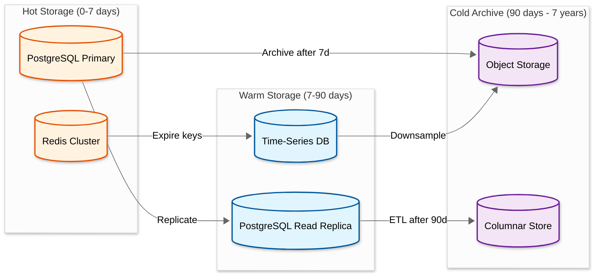
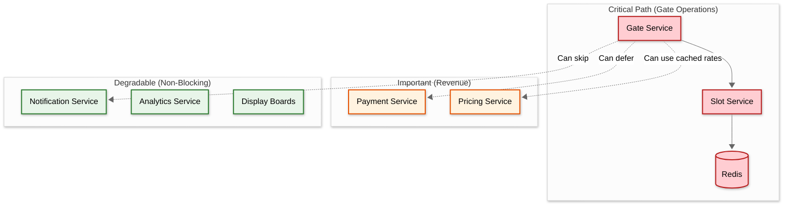

# Scalability & Reliability

## Lot-Level Sharding

Parking data is naturally partitioned by lot. A vehicle's entire lifecycle---entry, parking, payment, exit---occurs within a single lot. This makes `lot_id` the ideal shard key with zero cross-shard transactions for operational flows.

### Sharding Architecture

```
┌──────────────────────────────────────────────────┐
│                  Request Router                   │
│         (lot_id → shard mapping)                 │
└────────────┬──────────┬──────────┬───────────────┘
             │          │          │
     ┌───────▼──┐ ┌─────▼────┐ ┌──▼───────┐
     │ Shard 1  │ │ Shard 2  │ │ Shard N  │
     │ Lots     │ │ Lots     │ │ Lots     │
     │ 1-100    │ │ 101-200  │ │ 9901-10K │
     │          │ │          │ │          │
     │ spots    │ │ spots    │ │ spots    │
     │ bookings │ │ bookings │ │ bookings │
     │ tickets  │ │ tickets  │ │ tickets  │
     │ events   │ │ events   │ │ events   │
     └──────────┘ └──────────┘ └──────────┘
```

### Shard Sizing

```
10,000 lots / 100 shards = 100 lots per shard

Per-shard load:
  100 lots × 4K events/day = 400K events/day per shard
  Peak: 400K / 86,400 × 5 (peak factor) ≈ 23 tx/sec per shard

Per-shard storage:
  100 lots × 100 spots = 10,000 spots
  100 lots × 200 bookings/day × 90 days = 1.8M booking rows
  Estimated: ~5 GB per shard (well within single-node capacity)
```

### Cross-Shard Queries

| Query | Frequency | Handling |
|-------|-----------|----------|
| User's bookings across lots | Low (profile view) | Fan-out query to all shards OR secondary index by `user_id` |
| Corporate analytics (all lots) | Low (daily/weekly reports) | Analytics replica that aggregates across shards via ETL |
| User's vehicle permits across lots | Very low | Fan-out OR permit service maintains a user-indexed copy |

---

## Spot Availability Bitmap Optimization

For real-time availability queries, Redis bitmaps provide O(1) lookups and minimal memory:

### Memory Calculation

```
Per lot (5,000 spots):
  1 bitmap per spot type, assume 6 types:
    COMPACT:      1,500 spots = 1,500 bits = 188 bytes
    REGULAR:      2,000 spots = 2,000 bits = 250 bytes
    HANDICAPPED:    100 spots = 100 bits = 13 bytes
    EV:             200 spots = 200 bits = 25 bytes
    MOTORCYCLE:     200 spots = 200 bits = 25 bytes
    OVERSIZED:    1,000 spots = 1,000 bits = 125 bytes
    ──────────────────────────────────────────────
    Total per lot: 626 bytes

For 10,000 lots:
  10,000 × 626 bytes ≈ 6.1 MB total

Operations:
  BITCOUNT → count available spots: O(N/8) ≈ microseconds
  GETBIT → check specific spot: O(1)
  SETBIT → update spot status: O(1)
```

This is extraordinarily memory-efficient. The entire real-time availability state for 10,000 lots fits in ~6 MB of Redis memory.

### Reservation Time-Window Bitmaps

For availability over time (e.g., "which spots are free Saturday 2-6 PM?"), use interval-based bitmaps:

```
Key: avail:{lot_id}:{spot_type}:{date}:{interval_index}
  interval_index = hour * 2 + (minute >= 30 ? 1 : 0)  // 30-min slots

For 2PM-6PM query (intervals 28-35):
  result = BITOP AND dest
    avail:{lot_id}:REGULAR:2026-03-14:28
    avail:{lot_id}:REGULAR:2026-03-14:29
    avail:{lot_id}:REGULAR:2026-03-14:30
    avail:{lot_id}:REGULAR:2026-03-14:31
    avail:{lot_id}:REGULAR:2026-03-14:32
    avail:{lot_id}:REGULAR:2026-03-14:33
    avail:{lot_id}:REGULAR:2026-03-14:34
    avail:{lot_id}:REGULAR:2026-03-14:35

  BITCOUNT dest → number of spots available for the ENTIRE 4-hour window
```

---

## Redis Cluster Strategy

### Per-Region Deployment

```
Region: US-East
  ├── Redis Cluster (3 primary + 3 replica)
  │   ├── Node 1: Lots 1-3000 (real-time availability)
  │   ├── Node 2: Lots 3001-6000
  │   └── Node 3: Lots 6001-10000
  │
  └── Each node handles:
      - Availability bitmaps (~2 MB)
      - Gate session cache (~500 MB)
      - Lot summary hashes (~100 MB)
      Total: ~700 MB per node (trivial for Redis)
```

### Failover Strategy

- **Primary fails**: Redis Sentinel promotes replica to primary in <30 seconds.
- **During failover**: Gate controllers use local cache. Availability display may show stale data for up to 30 seconds.
- **Data loss on failover**: Bitmaps are reconstructed from PostgreSQL in <5 seconds per lot (read all spot statuses, set bits accordingly).

---

## Multi-Region Strategy

Parking is inherently local---a lot in New York has no real-time interaction with a lot in London. Each region operates independently:

```
┌────────────────────┐    ┌────────────────────┐    ┌────────────────────┐
│   US-East Region   │    │   EU-West Region   │    │  APAC Region       │
│                    │    │                    │    │                    │
│ API Gateway        │    │ API Gateway        │    │ API Gateway        │
│ Core Services      │    │ Core Services      │    │ Core Services      │
│ PostgreSQL (shards)│    │ PostgreSQL (shards)│    │ PostgreSQL (shards)│
│ Redis Cluster      │    │ Redis Cluster      │    │ Redis Cluster      │
│ IoT Hub            │    │ IoT Hub            │    │ IoT Hub            │
│                    │    │                    │    │                    │
│ Lots: US lots      │    │ Lots: EU lots      │    │ Lots: APAC lots    │
└──────────┬─────────┘    └──────────┬─────────┘    └──────────┬─────────┘
           │                         │                         │
           └─────────────┬───────────┘─────────────────────────┘
                         │
              ┌──────────▼──────────┐
              │  Global Services    │
              │                     │
              │ - User accounts     │
              │ - Corporate admin   │
              │ - Cross-region      │
              │   analytics         │
              │ - Payment gateway   │
              └─────────────────────┘
```

### What's Global vs Regional

| Component | Scope | Rationale |
|-----------|-------|-----------|
| User accounts | Global | Users may book lots in different regions |
| Corporate admin portal | Global | Operator manages lots across regions |
| Lot data + spots | Regional | Lot operations are purely local |
| Bookings + tickets | Regional | Transactions are lot-local |
| Payment processing | Global (with regional routing) | Payment provider may be global |
| ANPR images | Regional | High volume; no cross-region need |
| Analytics | Regional with global aggregation | Operational analytics are local; corporate dashboards aggregate |

---

## Gate High Availability

### Dual Controller Architecture

```
┌─────────────────────────────────────────┐
│               Physical Gate              │
│                                         │
│  ┌─────────────────┐ ┌────────────────┐ │
│  │ Primary         │ │ Standby        │ │
│  │ Controller      │ │ Controller     │ │
│  │                 │ │                │ │
│  │ Active: YES     │ │ Active: NO     │ │
│  │ Heartbeat ─────►│ │◄──── Monitor  │ │
│  │                 │ │                │ │
│  │ Local DB (sync) │ │ Local DB (sync)│ │
│  └────────┬────────┘ └───────┬────────┘ │
│           │                   │          │
│           └────┬──────────────┘          │
│                │                         │
│  ┌─────────────▼───────────────────────┐ │
│  │  Gate Hardware (barrier, sensors)   │ │
│  └─────────────────────────────────────┘ │
└─────────────────────────────────────────┘
```

### Failover Process

```
1. Primary controller sends heartbeat to standby every 5 seconds
2. Standby monitors heartbeat. If 3 consecutive heartbeats missed (15s):
   a. Standby takes over as primary
   b. Standby activates its connection to IoT Hub
   c. Standby begins processing gate events
   d. Alert sent to lot operator
3. Primary's local event log is replayed from standby's log on recovery
```

### Gate Failure Modes

| Failure | Impact | Mitigation |
|---------|--------|------------|
| Both controllers fail | Gate stuck closed (or open if fail-safe) | Physical override key for lot attendant; remote unlock via admin portal |
| Network outage (both controllers healthy) | Controllers operate in offline mode | Local cache + offline event logging (see Deep Dive 1) |
| Power outage | All systems down | UPS battery backup (4-hour minimum); gates default to open on power loss (fire code compliance) |
| ANPR camera failure | No plate recognition | Fall back to ticket dispensing at entry |
| Sensor failure | Inaccurate spot status | Cross-validate with gate entry/exit counts; alert maintenance |

---

## Disaster Recovery

### Recovery Time Objectives

| Component | RTO | RPO | Strategy |
|-----------|-----|-----|----------|
| Gate controller | 15s (failover to standby) | 0 (local event log) | Dual controller with heartbeat |
| Cloud services | 5 min | 1 min | Multi-AZ deployment with auto-failover |
| PostgreSQL | 5 min | < 1 min (streaming replication) | Primary-replica with automatic promotion |
| Redis | 30s | < 5s (AOF persistence) | Sentinel-managed failover |
| IoT Hub | 2 min | 0 (message queue buffering) | Multi-AZ IoT Hub with queue persistence |

### Gate-Level Recovery

Gates are the most critical component. Their local-first architecture provides inherent disaster recovery:

```
Cloud completely down:
  - Gates continue operating in offline mode
  - Walk-in tickets dispensed locally
  - Cached bookings/permits validated locally
  - All events logged to local storage
  - On cloud recovery: offline events uploaded and reconciled
  - Typical cloud outage impact on gate operations: ZERO

Gate controller replacement:
  - New controller provisioned with lot configuration
  - Pulls bookings + permits from cloud (or from standby controller)
  - Operational within 5 minutes of physical installation
```

---

## Load Testing Strategy

### Test Scenarios

| Scenario | Description | Target Metric |
|----------|-------------|---------------|
| **Rush hour entry** | 100 simultaneous entry events at a single lot over 5 minutes | All gates respond < 2s; zero double-allocations |
| **Booking spike** | 1,000 concurrent booking requests for the same lot and time window | < 1% allocation conflicts; < 500ms p95 confirmation |
| **Sensor flood** | 5,000 sensor state changes in 1 minute for a single lot | Display boards update within 3s; no event loss |
| **Network partition** | Simulate cloud unreachable for 30 minutes | Gates continue operating; events reconciled on reconnect |
| **Multi-lot scale** | 10,000 lots generating concurrent traffic at average rates | System handles 460 tx/sec sustained; < 3s p99 latency |
| **Payment service down** | Payment service returns errors for 10 minutes | Exit gates open (deferred payment); revenue tracked for collection |

### Chaos Engineering

- **Kill a database shard**: Verify that only lots on that shard are affected; other lots continue normally.
- **Network partition a gate controller**: Verify offline mode activation and event reconciliation.
- **Kill Redis primary**: Verify Sentinel failover; availability data briefly stale then recovers.
- **Flood a lot's sensor pipeline**: Verify message queue absorbs burst; no data loss; display board updates may lag but eventually converge.

---

## Capacity Planning & Auto-Scaling

### Service-Level Scaling Profiles

| Service | Scaling Trigger | Scale Unit | Min Instances | Max Instances |
|---------|----------------|------------|---------------|---------------|
| **Gate Service** | Gate events/sec > 80% capacity | 2 instances per region | 3 per region | 20 per region |
| **Booking Service** | Booking requests/sec > 70% | 2 instances per region | 3 | 15 |
| **Slot Service** | Sensor events/sec > 75% | 2 instances | 3 | 25 |
| **Payment Service** | Payment requests/sec > 60% | 1 instance | 3 | 10 |
| **Pricing Service** | Request latency p95 > 200ms | 1 instance | 2 | 8 |
| **Event Processor** | Queue depth > 10K messages | 2 consumer instances | 4 | 30 |
| **ANPR Service** | Recognition queue > 500 images | 1 GPU-enabled instance | 2 | 12 |

### Predictive Scaling

```
FUNCTION predictiveScale(service, timeHorizon):
    // Use historical traffic patterns to pre-scale before rush hour

    historicalPattern = getTrafficPattern(service, dayOfWeek, timeOfDay)
    // Example: Gate Service sees 5× traffic at 7-9 AM and 5-7 PM

    upcomingEvents = getLocalEvents(timeHorizon)
    // Concert at nearby arena → 3× surge for adjacent lots

    weatherForecast = getWeather(timeHorizon)
    // Rain → 20% more parking demand (fewer walk/bike commuters)

    predictedLoad = historicalPattern
        × eventMultiplier(upcomingEvents)
        × weatherMultiplier(weatherForecast)

    targetInstances = ceil(predictedLoad / instanceCapacity)

    // Pre-scale 15 minutes before predicted surge
    scheduleScaleUp(service, targetInstances, time - 15min)
    scheduleScaleDown(service, baseInstances, time + surgeWindow + 30min)
```

### Seasonal Capacity Planning

| Season/Event | Traffic Multiplier | Pre-Scaling Strategy |
|-------------|-------------------|---------------------|
| **Morning rush (7-9 AM)** | 5× baseline | Pre-scale Gate + Slot services at 6:45 AM |
| **Evening rush (5-7 PM)** | 4× baseline | Pre-scale Payment + Gate services at 4:45 PM |
| **Major sporting event** | 8× for adjacent lots | Event-triggered scaling 2 hours before event |
| **Holiday shopping** | 3× for mall lots | Seasonal scaling profile Nov-Dec |
| **Airport holiday travel** | 6× for airport lots | Scale up 2 days before major travel holidays |
| **Weather events** | 1.2-1.5× baseline | Weather API integration triggers moderate scaling |

---

## Data Lifecycle Management

### Tiered Storage Architecture



### Data Retention Policies

| Data Type | Hot | Warm | Cold | Total Retention | Deletion Trigger |
|-----------|-----|------|------|-----------------|-----------------|
| **Gate events** | 7 days | 83 days | 7 years | 7 years | Regulatory timer |
| **Bookings** | 7 days | 83 days | 7 years | 7 years | Regulatory timer |
| **Sensor telemetry** | 24 hours | 6 days | 84 days | 90 days | Auto-purge |
| **ANPR images** | 7 days | 23 days | — | 30 days | Privacy policy auto-delete |
| **Payment records** | 90 days | 275 days | 6 years | 7 years | Financial regulation |
| **Analytics aggregates** | 30 days | 335 days | Indefinite | Indefinite | Never (pre-aggregated) |
| **Sensor heartbeats** | 6 hours | 7 days | — | 7 days | Auto-purge |

### ANPR Image Lifecycle

```
FUNCTION manageANPRImageLifecycle():
    // ANPR images are the dominant storage consumer (1 TB/day)
    // Aggressive lifecycle management is critical

    Day 0-7 (Hot):
        - Stored in regional blob storage with encryption at rest
        - Indexed for plate lookup (dispute resolution, lost ticket)
        - Accessible to lot operators and support staff

    Day 7-30 (Warm):
        - Moved to cheaper storage tier
        - Plate text extracted and stored separately
        - Image accessible only for dispute resolution

    Day 30 (Delete):
        - Image permanently deleted (privacy compliance)
        - Only plate text hash retained for analytics
        - Deletion logged for GDPR audit trail

    Storage savings: 1 TB/day × 30 days = 30 TB active
    vs indefinite retention: 1 TB/day × 365 days = 365 TB
    Savings: 92% reduction in blob storage costs
```

---

## Graceful Degradation Strategy

### Service Dependency Map & Fallbacks



### Degradation Levels

| Level | Condition | Behavior | User Impact |
|-------|-----------|----------|-------------|
| **L0: Normal** | All services healthy | Full functionality | None |
| **L1: Degraded Analytics** | Analytics/notification down | Gate, booking, payment all work; no push notifications | Minimal---no booking confirmations via push |
| **L2: Degraded Payment** | Payment service down | Gates open for entry; exit gates fail-open with deferred billing | Exits free temporarily; revenue collected later |
| **L3: Degraded Cloud** | Cloud services unreachable | Gate controllers operate in offline mode with local cache | Cached bookings/permits work; walk-in tickets dispensed |
| **L4: Degraded Sensors** | >20% sensors offline on a floor | Fall back to gate-count-based occupancy; display boards show lot-level (not floor-level) | Less granular availability info |
| **L5: Emergency** | Power failure / total outage | Gates default open (fire code); UPS keeps controllers logging | Full facility access; events reconciled on recovery |

---

## Consistency Guarantees by Data Type

| Data | Consistency | Mechanism | Rationale |
|------|------------|-----------|-----------|
| **Spot allocation** | Strong (per-lot) | Optimistic locking + version column | Double-allocation = real-world conflict |
| **Booking status** | Strong (per-booking) | Single-shard transaction | Booking lifecycle must be atomic |
| **Redis availability** | Eventual (< 1s lag) | Async update after DB commit | Display boards tolerate brief staleness |
| **Sensor state** | Eventual (< 3s lag) | Debounced event pipeline | Sensor readings need filtering before trust |
| **Gate event log** | Eventual (offline reconciliation) | Local-first with sync queue | Offline events synced within 30s of reconnect |
| **Payment status** | Strong (per-payment) | Idempotent processing with dedup key | Financial accuracy non-negotiable |
| **Analytics aggregates** | Eventual (< 5min lag) | Periodic ETL from operational DB | Analytics never on critical path |
| **ANPR plate match** | Best-effort (with fallback) | Cache + DB lookup; ticket fallback | 99% hit rate acceptable; miss → dispense ticket |
