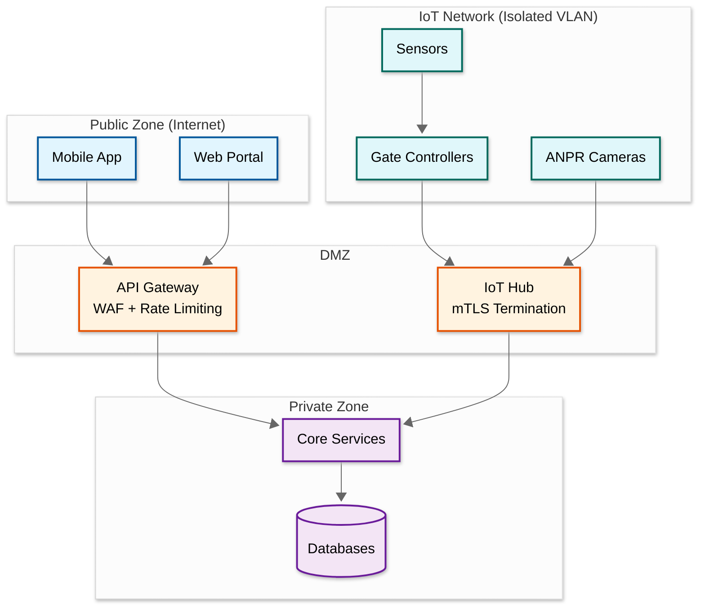

# Security & Compliance

## Authentication & Authorization

### Authentication by Actor Type

| Actor | Auth Method | Token Lifetime | Notes |
|-------|-----------|----------------|-------|
| **Mobile app users** | OAuth2/OIDC with JWT | Access: 15 min, Refresh: 30 days | Standard user authentication |
| **Web portal users** | OAuth2/OIDC with JWT | Access: 15 min, Refresh: 7 days | Shorter refresh for shared workstations |
| **Admin portal users** | OAuth2 + MFA required | Access: 15 min, Refresh: 8 hours | MFA mandatory for all admin operations |
| **Gate controllers** | mTLS with client certificates | Certificate: 1 year, rotation: 90 days | Each controller has a unique certificate; revocable individually |
| **IoT sensors** | Pre-shared symmetric key | Rotated every 90 days | Lightweight auth for constrained devices |
| **Display boards** | API key + IP whitelist | Rotated every 180 days | Read-only access to availability data |
| **Kiosks** | mTLS + device fingerprint | Certificate: 1 year | Payment kiosks require additional PCI-compliant auth |

### Authorization Model (RBAC)

```
Role Hierarchy:
  Platform Admin
    └── Corporate Admin (manages a ParkingCorporation)
          └── Lot Manager (manages one or more ParkingLots)
                └── Cashier/Attendant (lot-level operations only)

Permissions:
  Platform Admin:  all resources, all operations
  Corporate Admin: CRUD lots, floors, zones, spots within their corporation
                   Manage pricing rules, permits, reports across their lots
                   View cross-lot analytics
  Lot Manager:     Manage spots (out-of-service, maintenance)
                   Override gate decisions (manual open/close)
                   View lot-specific analytics, manage lot-level pricing
                   Handle lost tickets
  Cashier:         Process payments, handle lost tickets
                   View current lot occupancy
                   Cannot modify configuration or pricing
```

### Resource-Level Authorization

```
// Every API request validated against RBAC

FUNCTION authorizeRequest(user, action, resource):
    // Step 1: Resolve resource ownership
    lot = resolveLot(resource)  // Every resource belongs to a lot
    corp = lot.corporation

    // Step 2: Check user's role for this resource scope
    IF user.role == PLATFORM_ADMIN:
        RETURN ALLOWED

    IF user.role == CORPORATE_ADMIN AND user.corp_id == corp.id:
        RETURN ALLOWED

    IF user.role == LOT_MANAGER AND user.lot_ids CONTAINS lot.id:
        IF action IN [MANAGE_SPOTS, OVERRIDE_GATE, VIEW_ANALYTICS, MANAGE_PRICING]:
            RETURN ALLOWED

    IF user.role == CASHIER AND user.lot_id == lot.id:
        IF action IN [PROCESS_PAYMENT, VIEW_OCCUPANCY, HANDLE_LOST_TICKET]:
            RETURN ALLOWED

    RETURN DENIED
```

---

## ANPR Privacy & Data Protection

### License Plate Data Classification

License plates are **personally identifiable information (PII)** in many jurisdictions (GDPR, CCPA). The system must handle plate data with appropriate controls:

| Data Type | Classification | Retention | Access Control |
|-----------|---------------|-----------|----------------|
| **Raw ANPR images** | PII (contains plate + vehicle appearance) | 30 days max | Lot manager + platform admin only |
| **License plate text** | PII | 90 days for operational records | Gate service, permit service, lot manager |
| **Hashed plate** | Pseudonymized | Indefinite (for analytics) | Analytics service (cannot reverse to plate) |
| **Entry/exit timestamps** | Operational | 90 days in hot storage, 7 years in archive | Lot manager, corporate admin |

### Privacy Controls

```
// ANPR image handling
FUNCTION processANPRImage(image, gateId):
    // Extract plate text
    plateText = anprEngine.recognize(image)

    // Store image with encryption at rest
    imageId = blobStorage.store(
        data: encrypt(image, lotEncryptionKey),
        metadata: { gate_id, timestamp, retention: 30_DAYS },
        lifecycle: AUTO_DELETE_AFTER_30_DAYS
    )

    // Store plate text (operational)
    storePlateRecord(
        plate: plateText,
        image_ref: imageId,
        retention: 90_DAYS
    )

    // Generate hash for analytics (irreversible)
    plateHash = HMAC_SHA256(plateText, analyticsKey)
    storeAnalyticsRecord(plateHash, gateId, timestamp)

    RETURN plateText
```

### Data Subject Rights (GDPR/CCPA)

| Right | Implementation |
|-------|---------------|
| **Right to access** | API endpoint to retrieve all data associated with a license plate or user ID |
| **Right to deletion** | Delete plate records, ANPR images, and booking history on request; retain only anonymized analytics |
| **Right to portability** | Export all user data (bookings, payments, permits) in machine-readable format |
| **Purpose limitation** | Plate data used only for: entry/exit validation, payment, permit matching. Never shared with third parties for marketing |

---

## Payment Security

### PCI-DSS Compliance Architecture

```
┌──────────────────────────────────────────────────┐
│                 PCI-DSS Scope                     │
│                                                  │
│  ┌──────────┐    ┌───────────────┐    ┌────────┐ │
│  │ Kiosk    │───►│ Payment       │───►│Payment │ │
│  │ Terminal │    │ Gateway       │    │Provider│ │
│  │ (PCI P2PE)│    │ (Tokenization)│    │(Stripe │ │
│  └──────────┘    └───────────────┘    │ etc.)  │ │
│                                       └────────┘ │
└──────────────────────────────────────────────────┘
         │
         │ Token only (no raw card data)
         ▼
┌──────────────────────────────────────────────────┐
│              Outside PCI Scope                    │
│                                                  │
│  Payment Service stores only:                    │
│  - Payment token (not card number)               │
│  - Transaction reference                         │
│  - Amount, timestamp, status                     │
│  - Receipt data                                  │
└──────────────────────────────────────────────────┘
```

### Key Principles

1. **No raw card data touches our servers**: Kiosk terminals use point-to-point encryption (P2PE). Card data goes directly to the payment provider. Our system receives only a payment token.
2. **Tokenized storage**: Stored payment methods (for mobile app users) are represented by tokens from the payment provider. We never store card numbers, CVVs, or magnetic stripe data.
3. **Payment provider handles PCI**: By delegating card processing to a PCI-compliant payment provider, we minimize our PCI-DSS scope to SAQ A-EP (no direct card data handling).

### Payment Fraud Prevention

| Risk | Mitigation |
|------|------------|
| Stolen payment card used at kiosk | Contactless payment limits; suspicious pattern detection (same card, multiple lots, short intervals) |
| Replay attack on payment token | Each payment request includes a unique idempotency key; tokens are single-use |
| Man-in-the-middle on kiosk | mTLS between kiosk and payment gateway; encrypted kiosk-to-gateway channel |
| Fake receipt presented at exit | Receipts validated against payment records; QR on receipt links to server-side verification |

---

## Physical Security

### Gate Controller Security

| Threat | Mitigation |
|--------|------------|
| **Physical tampering** | Tamper-proof enclosure with tamper-detect switch; alert on enclosure open |
| **Firmware manipulation** | Signed firmware updates; secure boot chain; firmware integrity check on startup |
| **Network sniffing** | TLS 1.3 for all gate-to-cloud communication; mTLS for authentication |
| **Unauthorized access** | Unique client certificate per controller; certificate revocation on theft/compromise |
| **Local data theft** | Encrypted local storage (full-disk encryption on embedded device) |
| **Remote wipe** | Admin can remotely wipe local cache and revoke certificates if controller is stolen |

### Kiosk Security

| Threat | Mitigation |
|--------|------------|
| **Card skimmer attachment** | Anti-skimming hardware; regular physical inspections; tamper alerts |
| **Screen shoulder surfing** | Privacy screen filter on payment kiosks; auto-clear after 30 seconds |
| **USB port exploitation** | Disabled USB ports; locked-down OS; no external storage |
| **Kiosk OS compromise** | Minimal OS footprint; no browser; signed application binaries only |

---

## Threat Model

### Threat 1: Stolen/Shared QR Codes

**Scenario**: A user screenshots their booking QR code and shares it. Two vehicles attempt entry with the same QR.

**Mitigations**:
- **Short-lived QR codes**: QR encodes a signed token with 30-minute validity window (entry_time ± 15 min). Expired QR is rejected.
- **Single-use enforcement**: Once a QR is scanned at entry, the booking status changes to ACTIVE. A second scan of the same QR returns ALREADY_REDEEMED.
- **Dynamic QR**: Mobile app generates a new QR token every 60 seconds (TOTP-style). Static screenshots expire quickly.

### Threat 2: ANPR Spoofing (Fake/Cloned Plates)

**Scenario**: A vehicle with a cloned license plate enters using someone else's permit.

**Mitigations**:
- **Vehicle registration cross-check**: On permit creation, verify plate against vehicle registration database (where available).
- **Duplicate detection**: Alert if the same plate is detected at two different gates simultaneously, or if the plate is already marked as "currently parked."
- **Vehicle appearance matching**: Store vehicle make/model/color from ANPR image; flag mismatches on subsequent entries.
- **Anomaly detection**: Flag plates with unusual usage patterns (e.g., entering 20 times per day).

### Threat 3: Gate Tailgating

**Scenario**: A second vehicle follows closely behind an authorized vehicle, entering before the gate closes.

**Mitigations**:
- **Occupancy sensor at gate**: Detect if more than one vehicle passes through during a single gate-open cycle.
- **Gate closing speed**: Configure gate to close within 3 seconds of vehicle passing (infrared break-beam sensor).
- **Secondary barrier**: High-security lots use a dual-gate "airlock" design---vehicle enters buffer zone, first gate closes, second gate opens.
- **Alerting**: Occupancy mismatch (more vehicles inside than gate entries) triggers alert to lot attendant.

### Threat 4: Insider Threat (Operator Abuse)

**Scenario**: A lot manager manually overrides gate controls to let friends park for free, or manipulates pricing to skim revenue.

**Mitigations**:
- **Immutable audit log**: All admin actions (gate override, pricing change, spot status change) logged to an append-only audit trail. Logs cannot be deleted by any admin.
- **Four-eyes principle**: Pricing changes require approval from corporate admin (not just lot manager).
- **Anomaly detection**: Revenue per lot compared against occupancy; significant deviation triggers investigation.
- **Session recording**: Admin portal sessions are logged (actions + timestamps).

---

## Audit Trail

### What's Logged

| Event Category | Examples | Retention |
|---------------|----------|-----------|
| **Gate events** | Entry, exit, deny, override, offline event | 90 days hot, 7 years archive |
| **Admin actions** | Spot status change, pricing update, permit grant/revoke, gate override | 7 years |
| **Payment events** | Charge, refund, failed payment, disputed transaction | 7 years (regulatory) |
| **ANPR events** | Plate recognized, plate failed, manual plate entry | 90 days (images: 30 days) |
| **Auth events** | Login, logout, failed login, MFA challenge, certificate rotation | 2 years |
| **Configuration changes** | Lot hours, zone layout, sensor mapping, display board config | 7 years |

### Audit Log Format

```
{
    "event_id": "uuid",
    "timestamp": "ISO8601",
    "actor": {
        "type": "USER | SYSTEM | GATE_CONTROLLER",
        "id": "actor_id",
        "role": "LOT_MANAGER",
        "ip": "10.0.1.42"
    },
    "action": "GATE_OVERRIDE_OPEN",
    "resource": {
        "type": "GATE",
        "id": "gate_id",
        "lot_id": "lot_id"
    },
    "details": {
        "reason": "Vehicle stuck, manual override",
        "previous_state": "CLOSED",
        "new_state": "OPEN"
    },
    "integrity_hash": "SHA256(previous_hash + event_data)"
}
```

The `integrity_hash` field creates a hash chain, making it detectable if any log entry is modified or deleted after the fact.

---

## Regulatory Compliance Matrix

### Jurisdiction-Specific Requirements

| Regulation | Jurisdiction | Requirement | System Impact |
|-----------|-------------|-------------|---------------|
| **GDPR** | EU | Right to deletion of ANPR images; consent for plate tracking | 30-day image auto-delete; opt-in for registered users; anonymization pipeline |
| **CCPA** | California | Consumer data access/deletion requests; no sale of plate data | Plate data classified as PII; deletion API; no third-party sharing |
| **ADA** | USA | Accessible parking spots with specific dimensions and signage | Spot type enforcement; ADA spot count validation against lot size |
| **PCI-DSS** | Global | Card data protection for kiosk payments | P2PE terminals; tokenized storage; SAQ A-EP compliance |
| **Fire Code** | Local | Gates must open on power loss; minimum aisle widths | Fail-open gate default; emergency mode bypasses all access control |
| **PSD2/SCA** | EU | Strong customer authentication for payments > €30 | 3D Secure integration for online bookings; contactless exemptions for small amounts |
| **Local Parking Ordinances** | City-level | Maximum parking duration; overnight restrictions; permit requirements | Configurable per-lot rules engine; enforcement integration API |

### Compliance Monitoring

```
FUNCTION complianceCheck(lotId):
    violations = []

    // ADA Compliance
    adaSpots = countSpotsByType(lotId, HANDICAPPED)
    totalSpots = countTotalSpots(lotId)
    requiredADA = calculateADARequirement(totalSpots)
    IF adaSpots < requiredADA:
        violations.add("ADA: Insufficient accessible spots")

    // GDPR Image Retention
    overdueImages = countANPRImagesOlderThan(lotId, 30_DAYS)
    IF overdueImages > 0:
        violations.add("GDPR: {overdueImages} ANPR images past retention")
        triggerImagePurge(lotId, 30_DAYS)

    // Fire Code: Gate emergency release
    gates = getGates(lotId)
    FOR gate IN gates:
        IF NOT gate.hasEmergencyRelease:
            violations.add("Fire Code: Gate {gate.id} missing emergency release")

    // Payment Compliance
    IF NOT lotHasValidPCICertification(lotId):
        violations.add("PCI: Certification expired or missing")

    RETURN violations
```

---

## Network Security Architecture

### Zone Segmentation



### IoT Device Security Lifecycle

| Phase | Controls |
|-------|----------|
| **Provisioning** | Factory-provisioned unique identity; initial certificate enrollment via secure bootstrap |
| **Authentication** | mTLS with per-device client certificates; certificate pinning prevents MITM |
| **Firmware Updates** | Signed firmware images; verified boot chain; rollback protection; staged rollout (1% → 10% → 100%) |
| **Runtime** | Minimal attack surface (no SSH in production); encrypted local storage; anomaly detection on communication patterns |
| **Decommission** | Remote certificate revocation; secure wipe of local cache; audit log entry |

### Rate Limiting & DDoS Protection

| Endpoint | Rate Limit | Rationale |
|----------|-----------|-----------|
| `POST /bookings` | 10 req/min per user | Prevent automated slot squatting |
| `GET /availability` | 60 req/min per IP | Allow frequent refresh but prevent scraping |
| `POST /gates/{id}/entry` | 30 req/min per gate | Physical constraint: gates can't process faster |
| `POST /payments/process` | 5 req/min per user | Prevent payment fraud attempts |
| Admin APIs | 100 req/min per admin user | Generous but bounded for automation |
| IoT Hub | 1000 events/min per device | Sensor heartbeats + state changes; protects against malfunctioning sensors flooding the pipeline |
