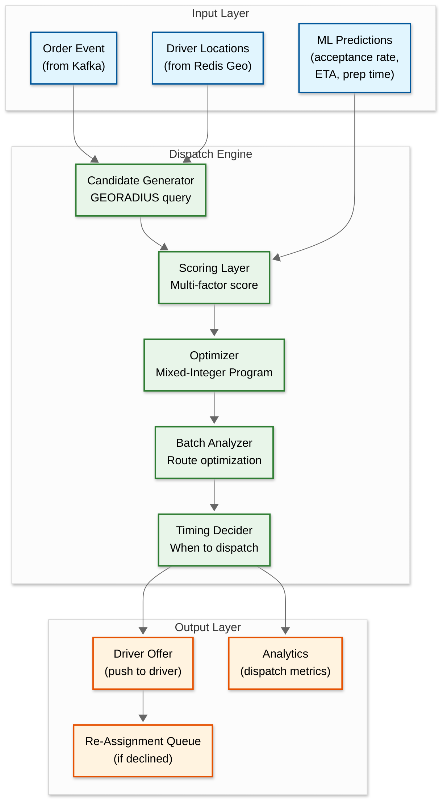
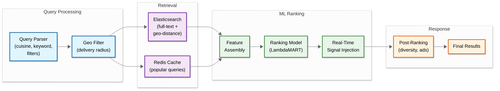

# Deep Dive & Bottlenecks

## Deep Dive 1: Dispatch & Driver Matching System

### 1.1 The Core Problem

Dispatch is the heart of a food delivery system. Every order requires answering: *which driver, when, and should this order be batched with another?* DoorDash's dispatch engine (DeepRed) solves this as a mixed-integer optimization problem with ML predictions feeding the objective function. The system must make decisions in under 30 seconds while competing with thousands of concurrent dispatch requests for the same pool of available drivers.

### 1.2 Multi-Layer Architecture



### 1.3 Geo-Index: Redis GEOADD + GEORADIUS

The dispatch engine's first step is finding candidate drivers near the restaurant. This is a **read-from-write-heavy-index** problem: 100K location writes/sec feed the index that dispatch reads hundreds of times per second.

**How it works:**
- Each city has its own Redis geo key: `active_drivers:{city_id}`
- Driver Location Service calls `GEOADD active_drivers:chicago lng lat driver_123` on every 5-second update
- Dispatch calls `GEORADIUS active_drivers:chicago lng lat 5 km ASC COUNT 20` to find the 20 nearest available drivers
- GEORADIUS is O(N+M) where N = elements in the sorted set within the bounding box and M = returned results

**Why Redis Geo over H3 for food delivery:** Unlike ride-hailing where H3's uniform hexagonal cells are critical for precision matching, food delivery has a wider acceptable radius (3-8 km vs. 1-3 km for ride-hailing) and lower match frequency (58/sec vs. 325/sec). Redis GEORADIUS with its built-in sorted set is simpler operationally and sufficient for food delivery's precision requirements.

### 1.4 Batching and Stacked Orders

A single driver carrying two orders from the same area saves one driver's entire trip. The optimizer must decide:

1. **Same-restaurant batch**: Two orders from the same restaurant → driver makes one pickup, two deliveries. This is almost always beneficial if the delivery addresses are in the same direction.

2. **Nearby-restaurant batch**: Orders from restaurants within 0.5 km → driver makes two pickups, two deliveries. Beneficial only if the route overlap is significant.

3. **Stack onto in-progress delivery**: A driver already delivering can accept a new order if the detour adds <8 minutes to the existing delivery.

**Key constraint**: The first customer's delivery SLA must not be violated. If batching would delay the first order beyond its promised ETA, the batch is rejected even if it is globally more efficient.

### 1.5 Driver Offer and Acceptance Flow

```
1. Dispatch sends offer to driver (push notification + in-app)
2. Driver has 45 seconds to accept or decline
3. If ACCEPTED: order assigned, driver navigates to restaurant
4. If DECLINED: offer sent to next-best candidate
5. If TIMEOUT: treated as decline, sent to next candidate
6. If all candidates exhausted: expand radius, recompute, or wait for new drivers
7. If still no driver after 3 retries: notify customer of delay, continue searching
```

**Acceptance rate feedback loop**: The scoring function includes predicted acceptance rate as a feature. If a driver frequently declines certain types of orders (long-distance, low-tip), the model learns this and ranks them lower for similar future orders, creating a self-optimizing system.

### 1.6 Dead Zone Problem

Some areas have few active drivers. When orders come in from these zones:

1. **Immediate**: Expand search radius from 5 km to 8 km, then 12 km
2. **Short-term**: Trigger surge pricing in the zone → higher delivery fee + driver bonus → attracts drivers from adjacent zones
3. **Medium-term**: Proactively push "bonus zone" notifications to nearby idle drivers
4. **Customer communication**: If no driver found within 2 minutes, show updated wait time and offer cancellation option

---

## Deep Dive 2: Real-Time Location & Tracking Pipeline

### 2.1 Location Write Storm

At peak, 500K active drivers send GPS updates every 5 seconds, producing 100K writes/sec. This is the single highest-throughput write path in the system.

**Pipeline architecture:**

```
Driver App → WebSocket Gateway → Kafka (location-updates topic)
  → Driver Location Service (consumer group)
    → Validate (bounds, speed, dedup)
    → Redis GEOADD (geo index update)
    → Time-Series DB (location history)
    → Tracking fan-out (if driver has active order)
```

### 2.2 Write Optimization Strategies

| Strategy | Effect | Savings |
|----------|--------|---------|
| **Stationary filtering** | Skip index update if driver moved < 10 meters since last update | ~35% reduction in geo writes |
| **Redis pipelining** | Batch 100 GEOADD commands into a single pipeline call | ~10× throughput improvement |
| **Kafka partitioning by city** | Location events for the same city go to the same partition → single consumer handles one city's geo index | Eliminates cross-shard writes |
| **Conditional persistence** | Only write to time-series DB if driver has an active order (location history is only needed for dispute resolution) | ~70% reduction in time-series writes |
| **Client-side batching** | Driver app buffers 2-3 location samples and sends as a batch every 5s instead of individual updates | Reduces WebSocket message count by 60% |

### 2.3 Redis Cluster Topology for Location

```
Sharding strategy: One Redis shard per metropolitan area
  - Chicago:  1 primary + 2 replicas (handles ~20K drivers)
  - New York: 2 primaries + 4 replicas (handles ~50K drivers)
  - LA:       2 primaries + 4 replicas (handles ~45K drivers)

Capacity per shard:
  - 50K drivers × GEOADD = 10K writes/sec per shard
  - GEORADIUS queries: ~200/sec per shard (from dispatch)
  - Memory: 50K geo entries × ~100 bytes = 5 MB (trivial)
  - CPU: primary Slowest part of the process is GEORADIUS on large sets

Failover:
  - Redis Sentinel monitors primaries
  - Replica promoted within ~10 seconds on primary failure
  - During failover: dispatch falls back to cached driver list (stale by <10s)
```

### 2.4 Customer Tracking: End-to-End Flow

1. Customer opens tracking screen → WebSocket connection established
2. Server subscribes the connection to `order:{order_id}:tracking` channel
3. Every 5 seconds, driver location update flows through the pipeline
4. Location Service checks if driver has active order → publishes to tracking channel
5. WebSocket Gateway pushes `{lat, lng, heading, speed}` to customer
6. **Client-side dead reckoning**: Between 5-second updates, the app extrapolates position using `heading` and `speed`, providing smooth animation
7. **ETA re-computation**: Every 30 seconds (not every 5s), the ETA Service recomputes remaining delivery time based on actual driver position and current traffic

### 2.5 Location History Retention

| Tier | Duration | Resolution | Storage | Purpose |
|------|----------|-----------|---------|---------|
| **Hot** | 7 days | Full (every 5s) | Time-Series DB | Dispute resolution, trajectory validation |
| **Warm** | 90 days | Sampled (every 60s) | Column store | Analytics, driver behavior patterns |
| **Cold** | 1 year | Aggregated (trip summary) | Object storage | Compliance, long-term analytics |

---

## Deep Dive 3: ETA Accuracy and Continuous Improvement

### 3.1 Why ETA Is the Hardest Problem

Delivery ETA combines three independent uncertain estimates:

```
Total ETA = max(Prep Time, Driver-to-Restaurant) + Restaurant-to-Customer + Handoff Buffer
```

Each component has different uncertainty characteristics:

| Component | Avg Duration | Std Deviation | Key Uncertainty Sources |
|-----------|-------------|---------------|----------------------|
| Prep time | 15-25 min | ±8 min | Kitchen load, order complexity, restaurant reliability |
| Driver to restaurant | 5-12 min | ±4 min | Traffic, road closures, driver route choice |
| Restaurant to customer | 8-20 min | ±5 min | Traffic, distance, apartment access |
| Handoff buffer | 2-5 min | ±2 min | Parking, stairs, gate codes |

**Compounding problem**: A 5-minute error in prep time directly cascades to a 5-minute error in total ETA, regardless of how accurate the travel estimates are.

### 3.2 ML Model Architecture

The ETA system uses a multi-model approach (similar to Uber's DeepETA):

**Model 1 - Prep Time Predictor:**
- Input features: restaurant_id, cuisine type, number of items, item categories (appetizer vs. entree), time of day, day of week, current active orders at restaurant, restaurant's historical prep time distribution
- Architecture: Gradient-boosted trees (fast inference, interpretable)
- Training: Daily retraining on last 30 days of (restaurant, order) → actual prep time
- Output: predicted prep time in minutes + confidence interval

**Model 2 - Travel Time Predictor:**
- Input features: origin/destination coordinates, route distance, time of day, day of week, weather conditions, real-time traffic density
- Architecture: Transformer-based encoder (similar to DeepETA) with geo-spatial feature embedding
- Quantile bucketing for continuous features (distance, time)
- Output: predicted travel time + residual correction over routing engine estimate

**Model 3 - Total ETA Correction:**
- Input: combined raw ETA from Models 1 + 2, plus meta-features (city, weather, holiday flag)
- Purpose: correct for systematic biases in the component models
- Architecture: Simple linear model applied as a final calibration layer
- Output: multiplicative correction factor (typically 0.85 to 1.15)

### 3.3 Continuous Improvement Loop

```
1. Order delivered → compute actual_time = delivered_at - placed_at
2. Compare actual_time vs. initial_eta → compute error = actual - predicted
3. Log error with all features → training data for next model iteration
4. Aggregate errors by restaurant → update restaurant's avg_prep_time baseline
5. Aggregate errors by time/zone → detect systematic biases (e.g., "ETAs are 10% optimistic during rain")
6. Daily model retrain → deploy if accuracy improves on holdout set
7. Alert if error distribution shifts significantly (model drift detection)
```

### 3.4 Progressive ETA Updates

The ETA shown to the customer is not static---it is refined as real data arrives:

| Event | ETA Update Strategy |
|-------|-------------------|
| **Order placed** | Initial ETA from ML prediction (highest uncertainty) |
| **Restaurant confirms** (with prep estimate) | Blend restaurant estimate with ML prediction |
| **Driver assigned** | Replace generic driver-to-restaurant estimate with actual driver ETA |
| **Driver at restaurant** | Eliminate driver-to-restaurant component; ETA = prep remaining + delivery travel |
| **Order picked up** | ETA = routing engine travel time from current driver position (lowest uncertainty) |
| **During delivery** | Recompute every 30 seconds using actual driver position |

---

## Slowest part of the process Analysis

### Slowest part of the process 1: Location Write Storm at Meal Peaks

**Problem**: 100K Redis GEOADD operations per second during dinner rush.

**Mitigation cascade:**
1. **Stationary filtering** (client-side): If driver's GPS delta < 10m, don't send update → 35% reduction
2. **Redis pipelining** (server-side): Batch 50-100 GEOADD commands per pipeline → 10× throughput per connection
3. **City-level sharding**: Each city's geo index on a separate Redis shard → max 10-15K writes per shard
4. **Write buffering**: If pipeline queue exceeds threshold, drop oldest updates (staleness > freshness for stationary drivers)

**Failure mode**: If Redis shard for a city goes down, dispatch in that city cannot find nearby drivers. Mitigation: promote replica within 10 seconds; during gap, use last-known driver positions (stale by <15s).

### Slowest part of the process 2: Dispatch Contention at Peak

**Problem**: 580 orders/sec all competing for the same pool of available drivers. Two dispatch processes may try to assign the same driver simultaneously.

**Mitigation:**
1. **Optimistic lock with Lua script**: Atomic `GET-CHECK-SET` on driver status in Redis. If another dispatch already claimed the driver, move to next candidate (no blocking lock, just retry with next candidate)
2. **Geo-zone partitioning**: Dispatch for Chicago orders only considers Chicago drivers. Different cities never contend.
3. **Dispatch queue sharding**: Within a large city, shard the dispatch queue by sub-zone (e.g., "Chicago North," "Chicago South") to reduce contention further
4. **Over-generation**: Generate 20 candidates for each order, not just the best 3, so there are fallback options when top candidates are taken

### Slowest part of the process 3: Menu Service Under Browsing Load

**Problem**: Peak browsing QPS of 30K+ reads/sec for menu data, with popular restaurants seeing 100× the average traffic.

**Mitigation:**
1. **CDN caching**: Restaurant listing pages and menu data cached at edge (TTL: 5 minutes; cache-busted on menu update)
2. **Redis cache**: Full restaurant menu serialized as a Redis hash, warmed on restaurant open, TTL 5 minutes
3. **Elasticsearch**: Search queries served from ES replicas, not PostgreSQL
4. **Hot restaurant detection**: Restaurants with >10× average QPS get their cache TTL extended and are pinned in Redis to prevent eviction

### Slowest part of the process 4: WebSocket Connection Storm

**Problem**: 700K concurrent WebSocket connections (500K drivers + 200K tracking customers) during peak.

**Mitigation:**
1. **Horizontal scaling**: WebSocket Gateway is stateless (connections routed via consistent hashing on user_id); add more instances as needed
2. **Connection limits**: Each gateway instance handles ~50K connections; 14+ instances for peak
3. **Graceful reconnection**: Client-side exponential backoff with jitter on disconnect; server-side sticky sessions via load balancer
4. **Fallback to polling**: If WebSocket connection fails after 3 retries, client switches to HTTP polling (10s interval)

---

## Race Conditions and Edge Cases

### Race 1: Two Dispatchers Assign the Same Driver

**Scenario**: Order A and Order B both run dispatch at the same millisecond. Both identify Driver X as the best candidate. Both attempt to assign Driver X.

**Solution**: Redis Lua script for atomic assignment:
```
IF redis.GET(driver_status) == "available" THEN
    redis.SET(driver_status, "assigned")
    RETURN 1  // success
ELSE
    RETURN 0  // driver already taken
END
```
The loser gets `0` and tries the next candidate. No distributed lock, no blocking.

### Race 2: Order Cancelled While Driver Being Assigned

**Scenario**: Customer cancels while dispatch is mid-flight. Dispatch assigns a driver, but the order is already cancelled.

**Solution**: Saga pattern with compensation.
```
1. Dispatch assigns driver (writes dispatch record)
2. Before sending offer to driver, check order status
3. If order status = CANCELLED:
   a. Release driver (set status back to "available")
   b. Void dispatch record
   c. Skip driver notification
4. If offer already sent and driver accepts a cancelled order:
   a. Driver receives "order cancelled" immediately
   b. Compensation payment to driver for wasted time
```

### Race 3: Restaurant Marks Ready Before Driver Assigned

**Scenario**: Small restaurant with fast prep time → food ready in 5 minutes, but dispatch hasn't found a driver yet. Food sits and degrades.

**Solution**:
1. Dispatch service receives `READY_FOR_PICKUP` event → escalates driver search (wider radius, higher priority in queue)
2. If no driver found within 3 minutes of food being ready, alert support team
3. ETA to customer updated: "Your food is ready, waiting for driver pickup"
4. This scenario feeds back into dispatch timing: for this restaurant, future dispatches trigger earlier (during prep, not after)

### Race 4: Driver Accepts Two Offers Simultaneously

**Scenario**: Due to network latency, driver receives two offers (from two orders) and taps "Accept" on both within milliseconds.

**Solution**:
1. Each offer has a unique `offer_id` with a one-time acceptance token
2. Server validates: driver can only have `active_order_count <= MAX_CONCURRENT_ORDERS`
3. Second acceptance fails atomic check → returns "offer no longer available"
4. Driver sees error only for the second tap; first acceptance stands

### Race 5: Menu Item Goes Out-of-Stock During Ordering

**Scenario**: Customer adds item to cart, takes 5 minutes to check out, and during that time the restaurant marks the item as out-of-stock.

**Solution**:
1. At cart addition: no reservation (would lock items too aggressively)
2. At order submission: Order Service re-validates all items against current menu state
3. If any item is now unavailable: return error with specific item(s) flagged + suggest alternatives
4. To reduce friction: Menu Service pushes stock changes via WebSocket to open cart sessions, enabling client-side warnings before submission

---

## Deep Dive 4: Reinforcement Learning for Dispatch Optimization

### 4.1 Beyond Static Scoring

The scoring-based dispatch (Section 1) is a **myopic greedy** approach: it picks the best driver for the current order without considering future orders. At peak, this leads to suboptimal global assignment because:

- Assigning the only available driver near Restaurant A to a low-value order means a high-value order at Restaurant A arriving 30 seconds later has no driver
- Batching opportunities are missed because each order is dispatched independently

### 4.2 Reinforcement Learning Formulation

DoorDash's evolution from scoring to RL-based dispatch treats the problem as a **Markov Decision Process (MDP)**:

| MDP Component | Mapping in Food Delivery |
|--------------|--------------------------|
| **State** | Current driver locations, pending orders, restaurant prep status, time of day, surge levels |
| **Action** | Assign driver X to order Y, delay dispatch for T seconds, batch order Y with order Z |
| **Reward** | -1 × delivery_time - λ × driver_idle_time + μ × batch_savings |
| **Transition** | New orders arrive (stochastic), drivers move, restaurants complete prep |

### 4.3 Practical Implementation

```
FUNCTION rlDispatch(pending_orders, available_drivers, state):
    // Every T seconds (e.g., 5s), the RL dispatcher considers ALL pending orders
    // and ALL available drivers simultaneously

    // Generate candidate assignments (order → driver pairs)
    candidates = generateAssignmentCandidates(pending_orders, available_drivers)

    // Add "wait" action: do not assign this order yet
    FOR EACH order IN pending_orders:
        candidates.append({order: order, action: "WAIT", wait_time: 30s})

    // RL model scores each candidate based on long-term expected reward
    FOR EACH candidate IN candidates:
        candidate.q_value = rl_model.predict_q_value(state, candidate.action)

    // Solve assignment as a bipartite matching problem with Q-values as edge weights
    optimal_assignment = hungarianAlgorithm(candidates, metric = "q_value")

    RETURN optimal_assignment
```

**Key advantage over greedy**: The RL dispatcher may deliberately **delay** assigning a driver to a low-urgency order if the model predicts a high-urgency order will arrive in the same zone within the next 30 seconds. This "look-ahead" capability can improve overall delivery time by 3-5%.

### 4.4 Training Pipeline

- **Simulator**: Historical order data replayed through a simulator; RL agent trained offline on simulated episodes
- **Online fine-tuning**: 5% of live traffic goes through the RL dispatcher; A/B tested against the production scoring-based system
- **Reward shaping**: Delivery time, driver utilization, and customer satisfaction (NPS proxy) weighted to align with business objectives

---

## Deep Dive 5: Demand Forecasting and Proactive Supply Positioning

### 5.1 The Supply Positioning Problem

Most delivery delays stem from **no available driver near the restaurant**, not from slow prep or traffic. Proactive supply positioning shifts drivers to predicted demand zones before orders arrive.

### 5.2 Forecasting Model

```
Inputs:
  - Time of day (15-min granularity)
  - Day of week, holiday flag
  - Weather (current + 2-hour forecast)
  - Local events (concerts, sports, conventions) from event calendar API
  - Historical order volume per zone
  - Current order trend (last 30 min slope)

Output:
  - Predicted order volume per zone for next 15, 30, 60, and 120 minutes
  - Confidence interval per prediction
```

### 5.3 Driver Repositioning

When predicted demand exceeds available supply in a zone:

1. **Soft incentive**: Push "bonus zone" notification to nearby idle drivers ("+$3 for your next delivery in Zone X")
2. **Surge preemption**: Activate a mild surge (1.2×) before the demand spike hits, attracting drivers early
3. **No-order hold**: If a driver completes a delivery in a high-demand zone, delay sending them to an adjacent zone for 60 seconds (they will likely get a new order in the current zone)

This proactive approach can reduce "no driver available" incidents by 15-25% during predictable demand spikes.

---

## Deep Dive 6: Restaurant Search & Discovery Optimization

### 6.1 The Search Problem

When a customer opens the app, the platform must return a personalized, ranked list of restaurants within milliseconds. This involves:

1. **Geo-filtering**: Only restaurants within delivery radius of the customer's address
2. **Availability filtering**: Only restaurants currently open and accepting orders
3. **Relevance ranking**: Sort by a combination of factors personalized to the customer
4. **Real-time signals**: Current delivery ETA, surge pricing, restaurant busyness

### 6.2 Search Architecture



### 6.3 Ranking Features

| Feature Category | Examples | Signal Type |
|-----------------|----------|-------------|
| **Restaurant quality** | Average rating, rating count, repeat order rate | Static (updated daily) |
| **Relevance** | Cuisine match to query, menu keyword match, category alignment | Query-dependent |
| **Delivery experience** | Predicted ETA, historical delivery time accuracy, driver availability | Real-time |
| **Personalization** | Customer's past orders, cuisine preferences, time-of-day patterns | User-specific |
| **Business metrics** | Conversion rate, average order value, commission tier | Platform optimization |
| **Freshness** | How recently the restaurant was active, recent review sentiment | Time-decaying |

### 6.4 Query Understanding

For keyword searches, the system must understand intent:

```
"pizza" → cuisine filter: pizza
"gluten free pizza" → cuisine: pizza + dietary: gluten-free
"cheap lunch" → price_range: $ + meal_time: lunch
"quick food nearby" → sort: delivery_time_asc + max_distance: 2km
"birthday cake" → category: bakery + item_type: cake
```

This is handled by a query understanding model (transformer-based) that extracts structured intent from free-text queries, enabling filtered Elasticsearch queries rather than purely keyword-based search.

---

## Deep Dive 7: Payment Flow Edge Cases

### 7.1 Tip Adjustment After Delivery

```
Timeline:
  T=0:    Customer places order with $5 pre-tip
  T=0:    Payment authorized for $25 (subtotal $18 + fees $2 + tip $5)
  T=35m:  Order delivered; payment captured for $25
  T=40m:  Customer increases tip to $8 (+$3)

  Implementation:
  1. Original capture: $25 (includes original tip)
  2. Tip increase: separate authorization + capture for $3
  3. Driver payout: $5 (original) + $3 (increase) credited separately
  4. 2-hour window: after which tip cannot be modified

  Why separate transaction: Modifying a captured payment requires a partial
  refund + new capture, which is more expensive (processor fees) than a
  supplementary charge.
```

### 7.2 Split Payment

```
Scenario: Customer uses $10 gift card balance + credit card for remainder

  1. Deduct $10 from gift card balance (internal ledger, no external auth)
  2. Authorize remaining $15 on credit card
  3. If credit card auth fails: reverse gift card deduction
  4. If order cancelled: refund $10 to gift card + release $15 hold on card
  5. At delivery: capture $15 on card; gift card already deducted
```

### 7.3 Partial Refund for Missing Items

```
Scenario: Customer reports 2 of 5 items missing after delivery

  1. Customer submits missing item claim (with optional photo)
  2. Automated resolution (if order value < threshold and customer has good history):
     - Refund item cost + proportional delivery fee
     - Credit to original payment method or platform credit
  3. ML model predicts claim legitimacy based on:
     - Customer claim history
     - Restaurant's missing item rate
     - Order complexity
  4. Flag for manual review if claim rate exceeds threshold
```
