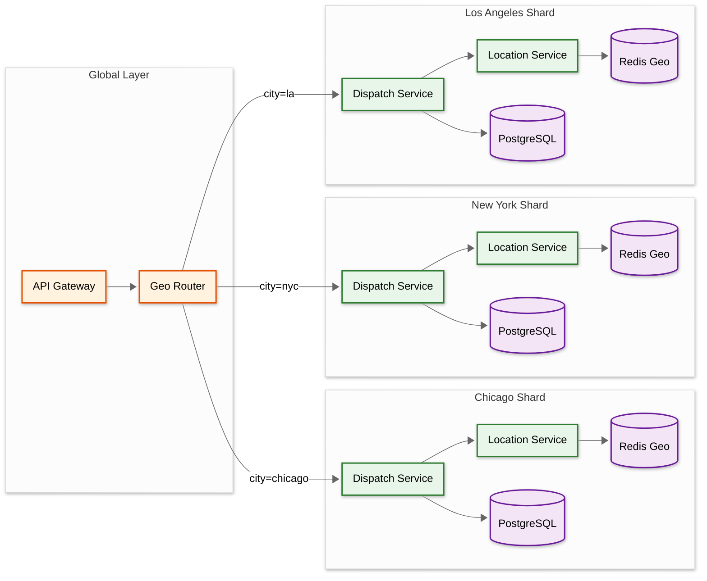
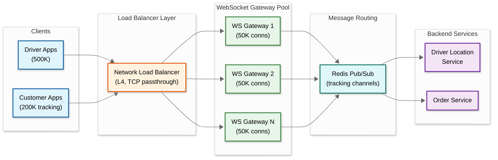

# Scalability & Reliability

## 1. Geo-Sharding Strategy

Food delivery is inherently geographic: orders in Chicago are completely independent of orders in Dallas. This natural boundary drives the primary sharding strategy.

### 1.1 City-Level Sharding



| Component | Sharding Key | Strategy |
|-----------|-------------|----------|
| **Dispatch Service** | `city_id` (derived from restaurant location) | Independent optimizer per city; no cross-city dispatch |
| **Driver Location (Redis Geo)** | `city_id` | One Redis key `active_drivers:{city_id}` per city; sharded across Redis cluster nodes |
| **Order Service (PostgreSQL)** | `order_id` (hash-based) | Consistent hash across DB shards; customer queries use secondary index |
| **Menu Service** | `restaurant_id` | Aggressively cached; shard PostgreSQL by restaurant_id range |
| **Search (Elasticsearch)** | `city_id` | One ES index per city; queries always scoped to customer's city |

### 1.2 Why Not Shard by Customer?

Sharding by customer_id would require cross-shard joins for "which orders does this restaurant have?" queries. Restaurant and order data are most frequently queried together (restaurant dashboard, dispatch, menu lookup), so sharding by geography keeps co-located data on the same shard.

### 1.3 Handling City Boundaries

Some metro areas span administrative boundaries (e.g., Brooklyn and Manhattan). The system uses **delivery zones** rather than political cities. A zone is a polygon defined by the operations team. Restaurants and drivers belong to the zone containing their primary location. Edge cases (customer on zone boundary) are resolved by assigning to the zone containing their delivery address.

---

## 2. Service-Level Scaling

### 2.1 Order Service

| Aspect | Strategy |
|--------|----------|
| **Write path** | Shard PostgreSQL by `order_id` using consistent hashing; 16 shards handle ~40 writes/sec each at peak |
| **Read path** | Read replicas for customer order history; Redis cache for active order status (TTL: until order delivered + 1h) |
| **Peak handling** | Auto-scale pods based on order creation rate; pre-scale 30 min before predicted peak (ML-based traffic prediction) |
| **State machine** | Optimistic locking with version counter; retries on conflict |

### 2.2 Menu Service

| Aspect | Strategy |
|--------|----------|
| **Read:Write ratio** | ~14,000:1 → cache everything |
| **CDN** | Menu listing pages and restaurant cards cached at CDN edge (TTL: 5 min, cache-bust on update) |
| **Redis cache** | Full menu per restaurant as serialized JSON in Redis (TTL: 5 min); popular restaurants pinned with extended TTL |
| **Invalidation** | On menu update: invalidate Redis key + purge CDN path; Kafka event triggers Elasticsearch re-index |
| **Image serving** | Object storage → CDN; images resized to multiple dimensions on upload (thumbnail, card, detail) |

### 2.3 Driver Location Service

| Aspect | Strategy |
|--------|----------|
| **Ingestion** | Kafka consumer group with partitions keyed by city; each partition handled by one consumer instance |
| **Redis writes** | Pipelined GEOADD (batch 100 commands); stationary filtering reduces writes by ~35% |
| **Horizontal scaling** | Add Kafka partitions + consumer instances per city as driver count grows |
| **Capacity planning** | 1 Redis shard per 50K drivers; scale by adding shards when city exceeds threshold |

### 2.4 Dispatch Service

| Aspect | Strategy |
|--------|----------|
| **Per-city isolation** | Separate dispatch optimizer per city; can tune parameters (radius, weights) per market |
| **Throughput** | Each optimizer handles 20-50 orders/sec; large cities get multiple optimizer instances (zone-partitioned) |
| **Scaling trigger** | Assignment latency p90 > 20s → add optimizer instance for that zone |
| **Warm standby** | Backup optimizer per city; promoted if primary fails (stateless—state lives in Redis and Kafka) |

### 2.5 ETA Service

| Aspect | Strategy |
|--------|----------|
| **Stateless** | No local state; reads features from Redis and routing service; serves predictions from loaded ML model |
| **Horizontal scaling** | Add instances proportional to QPS; each instance handles ~2,000 predictions/sec |
| **Model deployment** | Blue-green deployment; new model served by canary instances (5% traffic), promoted if accuracy metrics pass |
| **Fallback** | If ML model serving is slow (>200ms), fall back to simple distance/speed calculation |

---

## 3. Reliability Patterns

### 3.1 Circuit Breakers

| Dependency | Fallback on Open Circuit | Recovery Strategy |
|-----------|-------------------------|-------------------|
| **ETA Service** | Use distance-based estimate: `distance_km / 30 kph × 60 min + avg_prep_time` | Half-open after 30s; 3 successes to close |
| **Payment Service** | Queue order with "payment pending" status; retry capture every 60s for up to 1h | Alert after 5 consecutive failures |
| **Routing Service** | Use Haversine distance × 1.4 (average road factor) | Half-open after 15s |
| **Notification Service** | Buffer notifications in Kafka; delivery is eventually consistent | Consumer catches up when restored |
| **Rating Service** | Accept rating submission, queue for async processing | Non-critical; no user-facing fallback needed |
| **Elasticsearch** | Serve restaurant discovery from Redis-cached results (stale by up to 5 min) | Half-open after 30s |

### 3.2 Graceful Degradation Priority

The system defines a **criticality hierarchy** for degradation:

```
Tier 0 (MUST work):  Order placement → Payment authorization → Dispatch → Delivery tracking
Tier 1 (SHOULD work): ETA updates → Push notifications → Surge pricing
Tier 2 (CAN degrade): Restaurant search → Ratings → Promotions → Analytics
Tier 3 (CAN be offline): Earnings dashboard → Order history → Support chat
```

During an incident, Tier 2 and Tier 3 services can be shed to free compute for Tier 0 and Tier 1. Load shedding is triggered automatically when CPU or memory exceeds 80% on core service pods.

### 3.3 Order Durability Guarantee

Every order placement follows this sequence to guarantee zero order loss:

```
1. Validate request (items, address, restaurant open)
2. Write order to PostgreSQL (state = PLACED, synchronous replication)
3. Acknowledge to customer ONLY after PostgreSQL commit succeeds
4. Publish OrderPlaced to Kafka (at-least-once delivery)
5. If Kafka publish fails: order is in PostgreSQL; background reconciler picks it up
```

The key insight: the customer sees "Order Confirmed" only after the durable write succeeds. Kafka publication is asynchronous; if it fails, a periodic reconciler scans PostgreSQL for orders in PLACED state that lack a corresponding Kafka event and re-publishes them.

### 3.4 Saga Pattern: Order-Payment-Dispatch Coordination

The order lifecycle spans multiple services. Rather than a distributed transaction, a saga orchestrates the flow with compensating actions:

| Step | Service | Action | Compensation (on failure) |
|------|---------|--------|--------------------------|
| 1 | Order Service | Create order (PLACED) | Mark order FAILED |
| 2 | Payment Service | Authorize payment (hold) | Release hold |
| 3 | Order Service | Confirm order (CONFIRMED) | Cancel order + release hold |
| 4 | Dispatch Service | Assign driver | Release driver, set order to SEARCHING |
| 5 | Dispatch Service | Driver picks up | Reassign to new driver if current driver no-shows |
| 6 | Order Service | Mark delivered | N/A (terminal state) |
| 7 | Payment Service | Capture payment | Retry capture; escalate to support after 3 failures |

**Saga coordinator**: The Order Service acts as the saga orchestrator, tracking progress in a `saga_state` column on the order record. Each step is idempotent and can be retried safely.

---

## 4. Multi-Region Deployment

### 4.1 Regional Architecture

| Region | Primary Markets | Data Center | Notes |
|--------|----------------|-------------|-------|
| **North America** | US, Canada, Mexico | US-East + US-West | Active-active across both DCs |
| **Europe** | UK, Germany, France, Spain | EU-West (Ireland) | GDPR-compliant; data stays in EU |
| **Asia-Pacific** | Australia, Japan, South Korea | APAC (Singapore + Tokyo) | Active-active |
| **India** | India | Mumbai | Isolated region (regulatory requirements) |

### 4.2 Data Sovereignty

- **User PII** (name, phone, address): stored only in the user's region; never replicated cross-region
- **Order data**: stored in the region where the restaurant is located
- **Driver location**: stored in the region where the driver is active (hot data never leaves region)
- **Aggregated analytics**: anonymized data can be replicated to a global analytics cluster
- **ML models**: trained globally on anonymized data; model artifacts deployed to all regions

### 4.3 Cross-Region Considerations

Food delivery is inherently local (customer, restaurant, and driver are all in the same city), so cross-region data access is rare. The few cross-region scenarios:

- **Customer traveling abroad**: Account data fetched from home region; orders placed in current region
- **Global support dashboard**: Read-only replicas of order data from all regions to a central support system
- **Global ML training**: Anonymized features exported daily to a central training cluster

---

## 5. Capacity Planning and Auto-Scaling

### 5.1 Predictive Auto-Scaling

The system uses historical traffic patterns to pre-scale before predicted peaks:

```
1. ML model predicts order volume per city for next 2 hours (input: time, day, weather, events)
2. Compute required instances per service: target = predicted_peak_qps / per_instance_capacity × 1.3 (headroom)
3. Pre-scale 30 minutes before predicted peak
4. Scale down 30 minutes after peak passes (slower scale-down to handle tail)
```

### 5.2 Reactive Auto-Scaling Triggers

| Service | Metric | Scale-Up Threshold | Scale-Down Threshold |
|---------|--------|-------------------|---------------------|
| Order Service | Order creation QPS | > 80% of capacity | < 30% of capacity for 15 min |
| Dispatch Service | Assignment latency p90 | > 20 seconds | < 5 seconds for 15 min |
| Location Service | Kafka consumer lag | > 10,000 messages | < 100 messages for 10 min |
| WebSocket Gateway | Connection count | > 40K per instance | < 15K per instance for 15 min |
| ETA Service | Prediction latency p99 | > 200ms | < 50ms for 10 min |
| Menu/Search Service | Response time p95 | > 150ms | < 30ms for 10 min |

---

## 6. Disaster Recovery

| Scenario | RTO | RPO | Strategy |
|----------|-----|-----|----------|
| **Single service pod crash** | <30s | 0 | Kubernetes restarts pod; traffic routed to healthy pods |
| **Redis shard failure** | <15s | ~5s of location data | Sentinel promotes replica; dispatch uses stale data briefly |
| **PostgreSQL primary failure** | <60s | 0 (synchronous replication) | Automated failover to synchronous standby |
| **Kafka broker failure** | <30s | 0 | Kafka replication (RF=3); partition leader election |
| **Entire availability zone down** | <5 min | 0 | Traffic routed to surviving AZ; services pre-deployed in both AZs |
| **Entire region down** | 15-30 min | <1 min | Manual failover to DR region; DNS update; in-flight orders may need manual resolution |

---

## 7. WebSocket Gateway Scaling Deep Dive

### 7.1 Architecture

The WebSocket Gateway is the most connection-intensive component, managing 700K+ concurrent connections at peak:



### 7.2 Connection Management

| Challenge | Solution |
|-----------|----------|
| **Connection distribution** | L4 load balancer with least-connections algorithm; sticky sessions via source IP hash |
| **Cross-instance messaging** | Redis Pub/Sub: when a location update arrives for order X, publish to channel `order:X:tracking`; the gateway instance holding that customer's connection subscribes |
| **Graceful restart** | Gateway instance drains: stops accepting new connections, allows existing connections to migrate via client reconnect (client detects close frame, reconnects to another instance) |
| **Memory per connection** | ~4 KB per WebSocket connection (buffers + metadata) → 50K connections = 200 MB per instance |
| **Heartbeat** | Server sends ping every 30s; if no pong within 10s, connection considered dead and cleaned up |
| **Reconnection storm** | After a gateway instance restart, 50K clients reconnect simultaneously. Mitigation: client-side jitter (random delay 0-5s before reconnect) |

### 7.3 Connection Capacity Planning

```
Per gateway instance:
  Max connections:     50,000
  Memory per conn:     4 KB
  Total memory:        200 MB (connections) + 500 MB (runtime) = 700 MB
  CPU:                 2 cores (message routing is I/O-bound)

Fleet sizing at peak (700K connections):
  Instances needed:    700K / 50K = 14 instances
  With 30% headroom:  14 × 1.3 = 19 instances

Scaling trigger:       > 40K connections per instance → add instance
Scale-down trigger:    < 15K connections per instance for 15 min → remove instance
```

---

## 8. Kafka Cluster Topology and Partitioning

### 8.1 Topic Design

| Topic | Partitions | Partition Key | Retention | Consumers |
|-------|-----------|--------------|-----------|-----------|
| `order-events` | 64 | `order_id` | 7 days | Dispatch, Notification, Analytics, Loyalty |
| `location-updates` | 128 | `city_id` | 24 hours | Location Service (per-city consumer groups) |
| `dispatch-events` | 32 | `order_id` | 3 days | Order Service, Analytics |
| `payment-events` | 16 | `order_id` | 30 days | Order Service, Reconciliation |
| `notification-events` | 32 | `user_id` | 24 hours | Push Service, SMS Service, Email Service |
| `surge-events` | 16 | `zone_id` | 7 days | Analytics, ML Training |

### 8.2 Consumer Group Isolation

Each downstream service has its own consumer group, enabling:
- **Independent replay**: The analytics consumer can replay from 24 hours ago without affecting the dispatch consumer
- **Independent scaling**: Notification consumers can have 32 instances while dispatch has 16
- **Independent failure**: If the analytics consumer falls behind, no other service is affected

### 8.3 Exactly-Once Processing

For critical flows (order state transitions, payment events), exactly-once semantics:

```
1. Kafka idempotent producer: enabled (prevents duplicate publishes on retry)
2. Consumer: read message → process → commit offset atomically
   For DB-updating consumers: use transactional outbox in reverse
   - Read Kafka message
   - Write result to DB + update consumer offset in same DB transaction
   - If DB write fails: message is reprocessed (idempotent operation)
   - If DB write succeeds but offset commit fails: message is reprocessed (idempotent)
```

---

## 9. Load Testing and Chaos Engineering

### 9.1 Load Test Scenarios

| Scenario | Configuration | Success Criteria |
|----------|--------------|-----------------|
| **Steady state** | 60 orders/sec sustained for 2 hours | All SLOs met; no error rate increase |
| **Peak simulation** | Ramp from 60 → 610 orders/sec over 10 min, hold 30 min | Assignment latency p90 < 30s; order success rate > 97% |
| **Location storm** | 100K concurrent driver location updates at 5s intervals | Redis geo index latency < 5ms; Kafka consumer lag < 1,000 |
| **WebSocket flood** | 700K concurrent WebSocket connections with 200 msg/sec per instance | No connection drops; message delivery < 2s |
| **Database failover** | Kill PostgreSQL primary during peak load | Automatic failover < 60s; zero order loss |

### 9.2 Chaos Experiments

| Experiment | Injection | Expected Behavior | Blast Radius |
|-----------|-----------|-------------------|-------------|
| **Redis shard death** | Kill Redis primary for one city | Sentinel promotes replica in <15s; dispatch uses stale data briefly; no visible customer impact | Single city's dispatch latency spikes for ~15s |
| **Kafka broker loss** | Kill one Kafka broker | Partition leader election in <30s; producers retry; consumers rebalance | Brief event processing delay across all cities |
| **ETA service latency** | Inject 5s latency to ETA service | Circuit breaker opens after 10s; fallback to distance-based estimate | ETA accuracy degrades; orders still placed normally |
| **Payment processor timeout** | Simulate 30s timeout on payment auth | Orders queue with "payment pending"; retry every 60s; customer sees processing state | No new orders complete payment; existing deliveries unaffected |
| **Network partition** | Isolate one availability zone | Traffic routes to healthy AZ; services in isolated AZ detect failure and stop accepting work | 50% capacity reduction; SLOs maintained if pre-provisioned |

---

## 10. Database Connection Pooling and Query Optimization

### 10.1 PostgreSQL Connection Strategy

```
Per service instance:
  Min connections:     5 (idle)
  Max connections:     20 (busy)

Total across fleet (Order Service, 30 instances):
  Max connections:     30 × 20 = 600

PostgreSQL max_connections per shard:
  800 (includes headroom for admin, monitoring, replication)

Connection timeout:    5 seconds (fail fast if pool exhausted)
Query timeout:         2 seconds for read queries, 5 seconds for write queries
```

### 10.2 Hot Query Optimization

| Query | Frequency | Optimization |
|-------|-----------|-------------|
| `SELECT * FROM orders WHERE id = ?` | ~1,000/sec | Primary key lookup; Redis cache for active orders |
| `SELECT * FROM orders WHERE restaurant_id = ? AND status IN (...)` | ~500/sec | Composite index `(restaurant_id, status)`; result cached in Redis per restaurant |
| `SELECT * FROM menu_items WHERE restaurant_id = ? AND is_available = true` | ~30,000/sec | Served from Redis cache; DB hit only on cache miss (TTL: 5 min) |
| `SELECT * FROM orders WHERE customer_id = ? ORDER BY placed_at DESC LIMIT 20` | ~200/sec | Composite index `(customer_id, placed_at DESC)`; paginated |
| `INSERT INTO orders (...)` | ~610/sec (burst) | Sharded by `order_id`; async index updates; no triggers on hot path |

---

## 11. Rollout and Feature Flag Strategy

| Feature | Rollout Strategy | Rollback Plan |
|---------|-----------------|---------------|
| **New ETA model** | Canary: 5% of predictions for 24h → measure accuracy → 25% → 50% → 100% | Instant fallback to previous model version via feature flag |
| **New dispatch algorithm** | A/B test: 10% of orders in 2 cities for 1 week → compare assignment time and delivery time | Revert flag; no data migration needed (stateless) |
| **New surge pricing formula** | Shadow mode: compute new surge in parallel, log but don't apply → compare with production surge → switch | Revert flag; surge reverts to previous formula immediately |
| **Robot dispatch support** | Single city pilot → measure success rate, customer satisfaction → expand city by city | Disable robot eligibility flag; all orders route to human drivers |
| **Ghost kitchen support** | Enable per-restaurant flag → onboard kitchens individually | Disable brand-to-kitchen mapping; brands appear as regular restaurants |

---

## 12. Data Consistency Patterns

### 12.1 Consistency Boundaries

The system does NOT use a single consistency model. Instead, it applies the appropriate model per domain:

| Domain | Consistency Model | Why |
|--------|------------------|-----|
| **Order state** | Strong (single-writer per order) | Financial correctness; duplicate state transitions cause double charges |
| **Payment** | Strong (serializable transactions) | Monetary operations must be exactly-once |
| **Driver location (real-time)** | Eventual (last-writer-wins) | Stale-by-5-seconds is acceptable; strong consistency would kill throughput |
| **Menu/catalog** | Eventual (TTL-based cache invalidation) | 5-minute staleness acceptable; 14,000:1 read:write ratio demands caching |
| **Surge pricing** | Eventual (EWMA-smoothed, recomputed every 30-60s) | By design, surge changes gradually; real-time precision not needed |
| **Ratings/reviews** | Eventual (async processing) | Non-critical path; aggregate scores updated in batch |
| **Search index** | Eventual (lag < 5 min) | Restaurant appearing 5 min late in search is acceptable |

### 12.2 Handling Split-Brain in City Shards

If a network partition isolates two halves of a city's infrastructure:

```
Problem: Dispatch Service A and Dispatch Service B both think they have exclusive
         access to the driver pool. Both assign Driver X to different orders.

Prevention:
  1. Redis Sentinel quorum: requires majority to elect a leader
  2. If partition isolates the minority side: that side's Redis goes read-only
  3. Dispatch on the minority side detects Redis is read-only → stops dispatching
  4. Orders on the minority side queue in Kafka → processed when partition heals

Recovery:
  1. Partition heals → Redis replicas resync
  2. Queued orders dispatched (may have stale driver data for ~10s)
  3. Duplicate assignments detected by atomic lock on driver status
  4. Any conflicts resolved by releasing the later assignment
```
