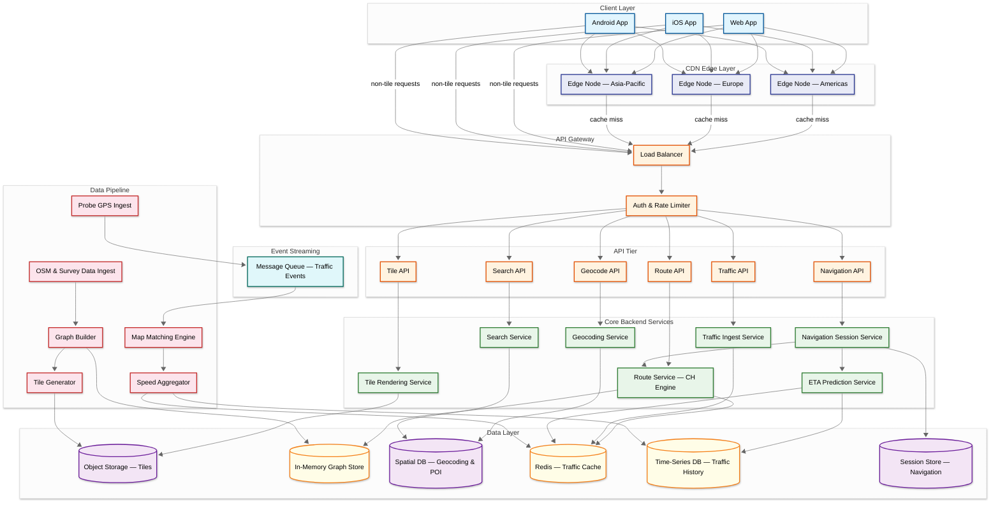
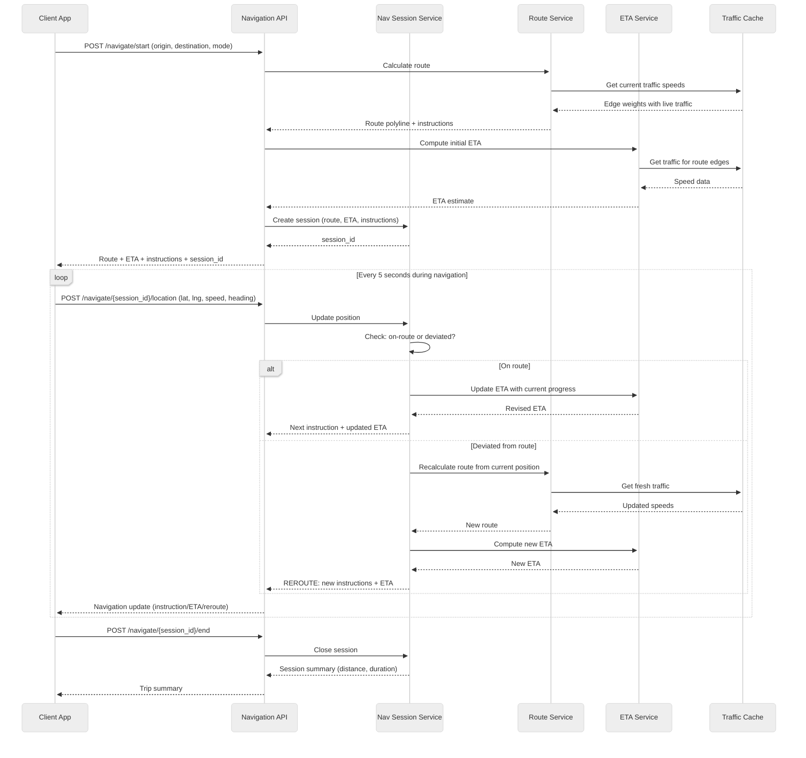
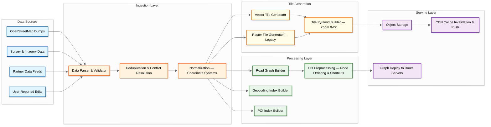

# High-Level Design — Maps & Navigation Service

## System Architecture



---

## Service Responsibilities

| Service | Responsibility | Scaling Strategy |
|---|---|---|
| **Tile Rendering Service** | Generate vector tiles on cache miss; pre-render low-zoom tiles offline | Horizontal; most traffic absorbed by CDN |
| **Route Service (CH Engine)** | Load in-memory road graph, run Contraction Hierarchies bidirectional search | Horizontal with regional graph partitions |
| **Geocoding Service** | Forward/reverse geocoding, address autocomplete | Read replicas of spatial DB |
| **Search Service** | POI search, category browsing, relevance ranking | Elasticsearch-style sharded index |
| **Traffic Ingest Service** | Consume probe GPS from message queue, run map matching | Horizontal Kafka consumer groups |
| **ETA Prediction Service** | Blend historical traffic profiles with real-time speeds for accurate ETAs | Stateless; reads from Redis + time-series DB |
| **Navigation Session Service** | Manage active navigation state, trigger reroutes, deliver instructions | Stateful sessions pinned to instances |

---

## Data Flow Narratives

### Flow 1: Map Tile Request

```
Client requests tile at (zoom=14, x=8529, y=5765)
  → CDN edge node checks cache
  → CACHE HIT (99%+ of time): serve tile directly (< 50ms)
  → CACHE MISS: forward to Tile API → Tile Rendering Service
    → Check object storage for pre-generated tile
    → If found: serve and populate CDN cache
    → If not found: render tile on-demand from source data
      → Store in object storage → populate CDN cache → respond
```

### Flow 2: Route Calculation

```
Client sends: origin=(40.748,-73.985), dest=(40.758,-73.979), mode=DRIVING
  → Route API → Route Service
  → Load regional graph partition (or full planet graph if cross-region)
  → Run bidirectional Contraction Hierarchies search
    → Forward search from origin (upward in hierarchy)
    → Backward search from destination (upward in hierarchy)
    → Find optimal meeting node
  → Apply real-time traffic weights from Redis
  → Expand shortcut edges to full path
  → Generate turn-by-turn instructions from path geometry
  → Compute ETA via ETA Prediction Service
  → Return: polyline, distance, duration, instructions, alternative routes
```

### Flow 3: Real-Time Traffic Ingestion

```
Probe vehicle sends GPS trace: [(lat,lng,timestamp), ...]
  → Traffic API → Message Queue (Kafka)
  → Traffic Ingest Service (Kafka consumer)
    → Map Matching: snap GPS points to road segments (HMM-based)
    → Compute traversal speed per road segment
  → Speed Aggregator
    → Update rolling 5-minute weighted average per edge in Redis
    → Write to time-series DB for historical profiles
    → If speed drops significantly: flag potential incident
  → Updated speeds available for Route Service within seconds
```

### Flow 4: Geocoding

```
User types: "Eiffel Tower, Paris"
  → Geocode API → Geocoding Service
  → Text normalization: lowercase, expand abbreviations ("St" → "Street")
  → Tokenization: ["eiffel", "tower", "paris"]
  → Query spatial DB with text search + location bias
  → Rank results: exact match score + popularity + distance from user
  → Return: [{name: "Eiffel Tower", lat: 48.8584, lng: 2.2945, ...}]
```

---

## Navigation Session — Sequence Diagram



---

## Map Data Pipeline — Flowchart



---

## Key Architectural Decisions

### 1. Vector Tiles over Raster Tiles

| Aspect | Raster (PNG) | Vector (MVT) |
|---|---|---|
| Size per tile | 20–50KB | 5–20KB |
| Rendering | Server-side | Client-side (GPU) |
| Customization | None (pre-baked style) | Full (day/night, themes) |
| Retina support | Requires 2× tiles | Native resolution |
| Rotation/tilt | Poor quality | Smooth |
| **Decision** | Legacy fallback | **Primary format** |

### 2. Contraction Hierarchies over Dijkstra/A*

| Algorithm | Preprocessing | Query Time (continental) | Memory |
|---|---|---|---|
| Dijkstra | None | Minutes | O(V) |
| A* | None | 10–30 seconds | O(V) |
| Contraction Hierarchies | Hours (offline) | **< 5 milliseconds** | ~2× graph |
| **Decision** | — | — | **CH for production routing** |

### 3. CDN-First Tile Architecture

With 35M tile req/sec at peak, the CDN is not an optimization — it is the **primary serving infrastructure**. The origin tile servers handle only the < 1% cache miss traffic. This inverts the traditional architecture: the CDN is the system, the origin is the fallback.

### 4. Hybrid Tile Generation Strategy

- **Pre-generate**: Zoom levels 0–12 (country to city level) — ~17M tiles total, generated offline
- **On-demand + cache**: Zoom levels 13–22 (city blocks to building level) — generated on first request, then cached indefinitely (invalidated on data change)

### 5. In-Memory Road Graph

The planet's road network (~50GB compressed, ~120GB in routing-optimized format) must reside in RAM for sub-second query performance. Each Route Service instance holds a regional partition or the full graph, depending on deployment strategy.

---

## Cross-Cutting Concerns

### EV-Aware Routing Extension

Electric vehicle routing adds a fundamentally different constraint: **range anxiety**. Unlike fuel vehicles that can refuel anywhere in minutes, EVs need charging stops that may take 20–45 minutes. The Route Service must:

1. Track battery state-of-charge (SoC) along the route
2. Model energy consumption per edge (elevation, speed, temperature, payload)
3. Insert charging stops at compatible stations when SoC would drop below safe threshold
4. Optimize for total trip time (driving + charging), not just driving distance
5. Account for charger availability (real-time station occupancy data)

This transforms routing from a simple shortest-path problem into a **constrained optimization** problem — the same CH graph is used, but with an additional state dimension (remaining range).

### Multi-Language & Accessibility

| Concern | Implementation |
|---|---|
| Road name display | Tiles carry labels in primary + alt languages; client selects based on locale |
| Voice navigation | Text-to-speech with locale-specific pronunciation rules (e.g., "Av." = "avenida" in Spanish) |
| Right-to-left scripts | Arabic, Hebrew label rendering with proper text shaping in vector tiles |
| Accessibility | Screen reader support for turn-by-turn; haptic feedback for turns; high-contrast map themes |
| Units | Metric (km) vs imperial (miles) per user preference; speed limits in local units |

### Rate Limiting Strategy

| Tier | Tile API | Route API | Geocode API | Search API |
|---|---|---|---|---|
| **Free** | 1K/min | 50/min | 50/min | 100/min |
| **Standard** | 10K/min | 500/min | 500/min | 1K/min |
| **Enterprise** | 100K/min | 5K/min | 5K/min | 10K/min |
| **Internal** | Unlimited | Unlimited | Unlimited | Unlimited |

Rate limits enforced at API Gateway using sliding window counters per API key. Tile API limits are generous because legitimate map usage generates many tile requests per interaction.

### Error Handling Philosophy

| Error Class | Strategy | User Experience |
|---|---|---|
| **CDN miss storm** | Request coalescing at origin; serve stale if origin overwhelmed | Tiles may be slightly outdated (hours); map remains usable |
| **Route Service overload** | Return cached route for popular O-D pairs; shed alternative routes first | Primary route served; fewer alternatives |
| **Traffic pipeline lag** | Fall back to historical baselines | ETA accuracy degrades from ±15% to ±25% |
| **Geocoding timeout** | Return partial results from prefix cache | Top 3 suggestions instead of 10 |
| **Navigation session loss** | Client continues with last-known route + on-device re-routing | Seamless for user if offline package available |

### Versioning & Backward Compatibility

- **Tile format**: Version embedded in URL path (`/v1/tiles/`, `/v2/tiles/`); old clients continue using v1
- **Route API**: Additive-only changes (new fields never break old clients); breaking changes get new version
- **Graph format**: Blue-green deployment ensures old and new graph versions never serve simultaneously
- **Offline packages**: Package metadata includes schema version; client handles migration on download

### Data Consistency Model

| Data Type | Consistency Model | Justification |
|---|---|---|
| **Tiles** | Eventual (CDN TTL + invalidation) | Stale tiles (hours) are acceptable; freshness not critical |
| **Traffic speeds** | Eventual (5-min buckets) | Speed data is statistical; exact consistency unnecessary |
| **Road graph** | Strong (blue-green deploy) | Routing must be consistent — no partial graph updates |
| **Navigation sessions** | Session-affinity (sticky) | Session state must be consistent within a single navigation |
| **Geocoding index** | Eventual (replica lag < 1s) | Address data changes slowly; slight lag acceptable |
| **User data** | Strong (per-user) | Saved places, history must not be lost |

### Service Dependency Graph

```
Navigation API (highest-level orchestrator)
  ├── Route Service (computes path)
  │     ├── In-Memory Graph (local, no network call)
  │     └── Redis Traffic Cache (network call, degradable)
  ├── ETA Service (predicts arrival time)
  │     ├── Redis Traffic Cache (shared with Route)
  │     └── Time-Series DB (historical patterns)
  └── Session Store (navigation state)

Tile API (independent of routing)
  ├── CDN Edge (primary)
  └── Tile Origin → Object Storage (fallback)

Traffic Pipeline (independent, feeds into Redis)
  ├── Kafka (ingestion buffer)
  ├── Map Matching Engine (CPU-bound)
  └── Redis (output)
```

*Key insight*: Tile serving, routing, and traffic pipeline are **independent subsystems** that share only Redis as a coupling point. This enables independent scaling and isolated failure domains.

### Failure Isolation Boundaries

| Boundary | Subsystems Isolated | Shared State |
|---|---|---|
| CDN + Tile Origin | Independent of all backend services | None — tiles are self-contained |
| Route Service | Independent of tile system | Reads Redis (degradable) |
| Traffic Pipeline | Independent of routing and tiles | Writes Redis (eventual) |
| Geocoding | Independent of routing and tiles | None |
| Navigation | Orchestrates Route + ETA | Session store (local) |

A complete traffic pipeline failure does NOT affect tile serving or geocoding. Route Service degrades gracefully to historical baselines.
