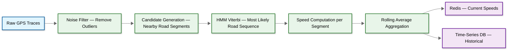

# Deep Dive & Bottlenecks — Maps & Navigation Service

## Deep Dive 1: Tile System Architecture

### Raster vs Vector Tiles

| Aspect | Raster Tiles (PNG) | Vector Tiles (MVT) |
|---|---|---|
| **Data format** | Pre-rendered pixel images | Geometric primitives (points, lines, polygons) + metadata |
| **Size per tile** | 20–50KB average | 5–20KB average |
| **Rendering** | Server-side (pre-baked) | Client-side (GPU-accelerated) |
| **Style customization** | None — style is baked into image | Full — client applies style at render time |
| **Retina / HiDPI** | Requires 2× or 4× tiles (more storage) | Renders at native device resolution |
| **Map rotation / tilt** | Pixelated at angles | Smooth vector rendering |
| **Labels** | Baked into tile (overlap at boundaries) | Client places labels dynamically (no overlap) |
| **Data extraction** | Pixels only — no metadata | Rich — hover/click exposes feature properties |
| **Storage (planet)** | 1–2PB (all zooms) | 100–200TB (all zooms) |
| **Bandwidth savings** | Baseline | **60–75% smaller than raster** |

**Modern systems use vector tiles (MVT format).** The client downloads compact geometric data and renders it locally using the device GPU, enabling real-time style changes (day/night mode), smooth rotation, and retina-quality display.

### Tile Pyramid Structure

The tile system uses a **quadtree decomposition** of the globe. At zoom level 0, the entire world is one tile. Each zoom level subdivides every tile into 4 children:

```
Zoom 0: 1 tile (world)
         ┌───┬───┐
Zoom 1:  │0,0│1,0│  = 4 tiles
         ├───┼───┤
         │0,1│1,1│
         └───┴───┘

Total tiles at zoom z = 4^z = 2^z × 2^z
```

| Zoom | Tiles | What's Visible | Generation Strategy |
|---|---|---|---|
| 0–5 | 1 – 1K | Continents, countries | **Pre-generate** (trivial count) |
| 6–12 | 4K – 17M | States, cities, major roads | **Pre-generate** (manageable) |
| 13–16 | 67M – 4.3B | City blocks, all roads, buildings | **On-demand + persistent cache** |
| 17–22 | 17B – 17.6T | Building details, addresses | **On-demand + TTL cache** |

### Pre-Generation vs On-Demand Strategy

**Hybrid approach:**
- **Zoom 0–12**: Pre-generate all tiles offline during data pipeline runs. Total: ~17M tiles at ~10KB each = ~170GB. Easily fits in object storage and CDN warm-up.
- **Zoom 13–22**: Generate on first request, cache in object storage and CDN. Most high-zoom tiles are never requested (oceans, deserts, uninhabited areas). Only popular areas (cities) get generated.

### Tile Invalidation on Road Changes

When the map data pipeline detects a road network change:

1. Compute the **bounding box** of the changed area
2. Convert bounding box to **affected tile addresses** at each zoom level
3. Delete affected tiles from object storage
4. Send **CDN cache invalidation** (purge) for those tile URLs
5. Next request triggers re-generation with updated data

This is **delta invalidation** — a road change in downtown Manhattan only invalidates tiles covering that area, not the entire planet.

### CDN Cache Strategy

```
Client requests: GET /tiles/14/8529/5765.mvt
  → CDN edge checks local cache
  → HIT: respond in < 50ms (99%+ of the time)
  → MISS: forward to origin
    → Origin checks object storage
    → Found: respond + CDN caches (Cache-Control: public, max-age=43200)
    → Not found: generate tile → store → respond → CDN caches
  → Client caches locally (ETag-based validation on next request)
```

**Cache-Control headers:**
- `public, max-age=43200` — CDN and client cache for 12 hours
- `ETag` — content hash for conditional requests (304 Not Modified)
- CDN TTL: 12 hours for popular tiles; longer for low-zoom tiles

---

## Deep Dive 2: Real-Time Traffic System

### Data Sources

| Source | Update Frequency | Coverage | Accuracy |
|---|---|---|---|
| **Probe vehicles** (GPS from navigation apps) | Every 1–30 seconds | Excellent in urban areas | High (direct speed measurement) |
| **Connected vehicles** (OEM telematics) | Every 5–60 seconds | Growing | High |
| **Fixed road sensors** (inductive loops, cameras) | Continuous | Limited to instrumented roads | Very high |
| **Commercial data providers** | Aggregated | Good | Moderate |

Probe vehicles are the **primary source** at scale — millions of active navigation sessions provide dense coverage without per-road infrastructure investment.

### Map Matching Pipeline

Raw GPS traces are noisy (10–30m accuracy) and must be **snapped to the road network** to determine which road segment a vehicle is traversing.



**Hidden Markov Model (HMM) for Map Matching:**
- **States**: Candidate road segments within 50m of each GPS point
- **Emission probability**: Based on perpendicular distance from GPS point to road segment (Gaussian, σ = 10m)
- **Transition probability**: Based on how well the route distance between consecutive candidates matches the great-circle distance between GPS points
- **Viterbi algorithm** finds the most probable sequence of road segments

### Speed Aggregation

```
Per road segment (edge), maintain a rolling 5-minute weighted average:

  currentBucket = roundToFiveMin(now())
  key = "traffic:{edge_id}:{currentBucket}"

  For each new speed observation:
    redis.INCR(key + ":count")
    redis.INCRBYFLOAT(key + ":sum", observed_speed)
    redis.EXPIRE(key, 7200)  // 2-hour TTL

  Average speed = sum / count
  Congestion = classify(avgSpeed / freeFlowSpeed)
    > 0.8 → FREE_FLOW
    > 0.5 → MODERATE
    > 0.2 → HEAVY
    ≤ 0.2 → STANDSTILL
```

### Traffic Model: Historical + Real-Time Blend

Each road segment maintains a **24h × 7day historical speed profile** — 2,016 slots (288 five-minute slots per day × 7 days). This captures recurring patterns (morning rush, weekend lull).

**Real-time blending** combines historical baseline with live probe data:
- If real-time confidence is high (many probes): weight real-time 70%, historical 30%
- If real-time confidence is low (few probes): weight real-time 30%, historical 70%
- If no real-time data: use historical baseline
- If neither: fall back to posted speed limit

### Incident Detection

```
IF speed on segment drops below 20% of free-flow speed:
  AND drop occurred within last 10 minutes:
  AND multiple independent probes confirm the slowdown:
  → Flag as POTENTIAL_INCIDENT

IF adjacent upstream segments also show propagating slowdown:
  → Confirm INCIDENT
  → Generate alert for navigation rerouting
  → Publish to Traffic API for map overlay
```

### Queue Propagation Model

When a segment becomes congested, vehicles queue up on **upstream** segments. The system models this backward propagation:

1. Detect congestion on segment S
2. Estimate queue length based on flow rate vs capacity
3. Propagate reduced speeds to upstream segments proportionally
4. Update affected edge weights for routing

---

## Deep Dive 3: Geocoding at Scale

### Forward Geocoding Pipeline

```
Input: "221B Baker St, London"

Step 1 — Text Normalization:
  → lowercase: "221b baker st, london"
  → expand abbreviations: "221b baker street, london"
  → remove diacritics: (if applicable)
  → standardize separators

Step 2 — Tokenization & Parsing:
  → tokens: ["221b", "baker", "street", "london"]
  → classify: house_number="221b", street="baker street", city="london"

Step 3 — Structured Query:
  → Query spatial DB: street="baker street" AND city="london" AND house_number="221b"
  → Also query fuzzy: Levenshtein distance ≤ 2 for each token

Step 4 — Scoring & Ranking:
  → Exact match: score += 100
  → Fuzzy match: score += 80 - (edit_distance × 10)
  → Popularity: score += log(search_count)
  → User proximity: score += 50 / (1 + distance_km)

Step 5 — Return ranked results
```

### Address Format Challenges

Different countries use fundamentally different address structures:

| Country | Format | Example |
|---|---|---|
| USA | number street, city, state zip | 123 Main St, Springfield, IL 62701 |
| UK | number street, locality, city, postcode | 221B Baker Street, London NW1 6XE |
| Japan | prefecture, city, district, block, building | 東京都千代田区丸の内1-9-2 |
| India | house, street, area, city, state, PIN | 42 MG Road, Indira Nagar, Bengaluru 560038 |

The geocoding service must handle **all formats** with country-specific parsing rules.

### Multilingual Geocoding

The same location may have names in multiple languages and scripts:
- "München" (German) = "Munich" (English)
- "Москва" (Russian) = "Moscow" (English)
- "東京" (Japanese) = "Tokyo" (English)

**Solution**: Store `alt_names` array per address with all known transliterations. Query matches against all name variants.

### Reverse Geocoding Strategy

For reverse geocoding (lat, lng → address):

1. **Geohash lookup**: Encode coordinates to geohash-8 (~38m × 19m cell)
2. **Expand to neighbors**: Query the 9-cell neighborhood (center + 8 surrounding)
3. **Candidate retrieval**: Fetch all addresses within these cells from spatial index
4. **Distance ranking**: Sort by Haversine distance from query point
5. **Type prioritization**: Prefer building addresses over street-level, street-level over neighborhood-level
6. **Format**: Apply country-specific address formatting rules

---

## Slowest part of the process Analysis

### Tile Serving: 35M req/sec Peak

| Layer | Load | Strategy |
|---|---|---|
| CDN edge nodes | 35M req/sec | Globally distributed; this IS the serving tier |
| Origin tile servers | < 350K req/sec (< 1% miss) | Horizontal scaling; read from object storage |
| Object storage | < 350K req/sec | Inherently scalable; no Slowest part of the process |
| Tile generation | Burst on data updates | Queue-based; prioritize popular tiles |

**Key insight**: The CDN is not a cache in front of the system — it IS the system. Origin servers only handle the long tail of rarely-requested tiles.

### Route Computation: Sub-Second at Scale

| Slowest part of the process | Impact | Mitigation |
|---|---|---|
| Graph memory (~120GB) | Single machine may not hold full planet | Regional partitioning + cross-region shortcuts |
| CH query on planet graph | < 5ms per query | Contraction Hierarchies reduces search space by 1000× |
| Traffic weight lookup | Additional latency per edge | Redis with local read replicas; batch prefetch route edges |
| Multiple alternatives | 3× compute for 3 routes | Run in parallel; share forward/backward search trees |

### Traffic Ingestion: 3.3M updates/sec

| Stage | Throughput | Strategy |
|---|---|---|
| GPS ingestion | 3.3M/sec | Kafka with 100+ partitions; partition by geographic region |
| Map matching | CPU-intensive per trace | Horizontally scaled consumer groups; one per region |
| Speed aggregation | 3.3M/sec Redis writes | Redis cluster; pipeline writes; batch updates |
| Historical storage | Aggregated (much less) | Time-series DB with downsampling |

### Geocoding: Fuzzy Search at 23K req/sec

| Slowest part of the process | Impact | Mitigation |
|---|---|---|
| Full-text fuzzy search | CPU and I/O intensive | Elasticsearch-style inverted index with n-gram tokenization |
| Multilingual normalization | Complex per query | Pre-computed normalized forms in index |
| Autocomplete (prefix search) | Must be < 100ms | Separate prefix trie index; aggressive caching of popular prefixes |

---

## Deep Dive 4: GPS Spoofing and Traffic Data Poisoning

### Attack Vector

GPS spoofing attacks can poison the traffic model by injecting fake speed data. In a demonstrated attack, an artist placed 99 smartphones in a wagon, all running navigation apps. The mapping platform interpreted the clustered, slow-moving devices as severe traffic congestion, turning the road red on the map and rerouting other users away.

### Attack Chain

```
Attacker deploys spoofed GPS probes on target road segment
  → Map matching assigns probes to road segment (they appear legitimate)
  → Speed aggregator computes very low average speed
  → Redis updates segment to STANDSTILL congestion
  → Route Service routes all users away from segment
  → Attacker achieves denial of road (traffic manipulation)
```

### Defense-in-Depth

```
FUNCTION validateProbePhysics(probe, previousProbe):
    // Layer 1: Physical plausibility
    timeDelta = probe.timestamp - previousProbe.timestamp
    distance = haversine(probe.lat, probe.lng, previousProbe.lat, previousProbe.lng)
    impliedSpeed = distance / timeDelta

    IF impliedSpeed > 300 kmh:  // faster than any road vehicle
        RETURN REJECT("implausible_speed")
    IF impliedSpeed > 0 AND timeDelta < 0.5s:  // GPS update too fast
        RETURN REJECT("suspicious_frequency")

    // Layer 2: Cross-source corroboration
    otherProbes = getRecentProbes(probe.edge_id, window=5min)
    IF LENGTH(otherProbes) > 10:
        medianSpeed = MEDIAN(otherProbes.speeds)
        IF ABS(probe.speed - medianSpeed) > 3 * stdDev(otherProbes.speeds):
            RETURN FLAG("outlier_speed")

    // Layer 3: Device diversity check
    uniqueDevices = COUNT(DISTINCT device_fingerprint IN otherProbes)
    IF uniqueDevices < 3 AND LENGTH(otherProbes) > 20:
        RETURN FLAG("low_device_diversity")  // many probes, few devices = suspicious

    // Layer 4: Sudden congestion anomaly
    historicalSpeed = getHistoricalBaseline(probe.edge_id, NOW())
    IF probe.speed < 0.1 * historicalSpeed AND noIncidentReported(probe.edge_id):
        RETURN FLAG("anomalous_congestion_no_incident")

    RETURN ACCEPT
```

### Incident Response for Spoofing

When spoofing is detected: (1) Quarantine all probes from flagged device fingerprints. (2) Roll back speed data for affected segments to historical baseline. (3) Publish alert to Traffic API consumers. (4) Add device fingerprints to watch list with elevated validation thresholds.

---

## Deep Dive 5: Contraction Hierarchies Graph Corruption During Updates

### The Problem

The road network is updated daily (new roads, closures, speed limit changes). The CH graph must be rebuilt, but serving stale routing during the rebuild creates a window where routes may traverse closed roads or miss new roads.

### Failure Modes

| Failure | Impact | Severity |
|---|---|---|
| **CH rebuild corrupted** (data pipeline bug) | Routes traverse non-existent shortcuts; routing errors or crashes | Critical |
| **Stale graph during rebuild** (2–4 hour window) | Routes ignore recent road closures | Medium |
| **Partial graph load** (instance crashes mid-load) | Instance serves routes with incomplete graph; missing edges | Critical |
| **Edge weight mismatch** (traffic Redis and graph out of sync) | ETAs wildly inaccurate for affected segments | Low-Medium |

### Mitigation: Canary Graph Deployment

```
FUNCTION deployNewGraph(newGraphVersion):
    // Phase 1: Integrity check
    checksum = computeGraphChecksum(newGraphVersion)
    IF checksum != expectedChecksum:
        ALERT("Graph checksum mismatch — aborting deploy")
        RETURN ABORT

    // Phase 2: Smoke test — run 1000 known O-D pairs
    FOR EACH (origin, dest) IN smokeTestPairs:
        result = testRoute(newGraphVersion, origin, dest)
        IF result.distance > 2 * expectedDistance OR result.status == ERROR:
            ALERT("Smoke test failed for {origin} → {dest}")
            RETURN ABORT

    // Phase 3: Canary deployment (5% traffic)
    canaryInstances = selectInstances(percentage=5)
    loadGraph(canaryInstances, newGraphVersion)
    WAIT(15 minutes)

    // Phase 4: Compare canary vs baseline metrics
    canaryMetrics = getRoutingMetrics(canaryInstances, window=15min)
    baselineMetrics = getRoutingMetrics(nonCanaryInstances, window=15min)
    IF canaryMetrics.errorRate > 1.5 * baselineMetrics.errorRate:
        ROLLBACK(canaryInstances)
        RETURN ABORT

    // Phase 5: Full rollout
    rollingDeploy(allInstances, newGraphVersion, batchSize=10%)

    RETURN SUCCESS
```

---

## Deep Dive 6: Geocoding Ambiguity and Multi-Language Resolution

### The Challenge

The query "Springfield" matches 34 places in the United States alone. "Munich" and "München" are the same city. Japanese addresses use a completely different structure (prefecture → city → district → block → building number) with no street names.

### Resolution Pipeline

```
FUNCTION resolveAmbiguousQuery(query, userLocation, userLocale):
    // Step 1: Language detection and transliteration
    detectedLang = detectLanguage(query)
    normalizedQuery = transliterate(query, detectedLang, targetLang="latin")
    // "東京" → "tokyo", "Москва" → "moskva"

    // Step 2: Country-specific parsing
    parsedTokens = parseAddress(normalizedQuery, countryHint=userLocale)
    // Japan: detect block-number pattern → structured query
    // US: detect "number street, city, state zip" pattern

    // Step 3: Multi-index query with scoring
    results = []
    results += fullTextIndex.search(normalizedQuery, boost=fuzzy_match)
    results += structuredIndex.search(parsedTokens, boost=exact_match)
    results += altNamesIndex.search(query, boost=transliteration_match)

    // Step 4: Disambiguation scoring
    FOR EACH result IN results:
        result.score += 50 * exactMatchBonus(query, result.name)
        result.score += 30 * popularityScore(result)
        result.score += 20 / (1 + distanceKm(userLocation, result.location))
        result.score += 10 * localeMatchBonus(userLocale, result.country)

    RETURN TOP_K(results, k=5, SORT BY score DESC)
```

### Multilingual Edge Cases

| Scenario | Challenge | Solution |
|---|---|---|
| Cyrillic → Latin | "Москва" has multiple transliterations (Moskva, Moscow) | Store all known transliterations in `alt_names` |
| CJK characters | No word boundaries; segmentation needed | Language-specific tokenizer (jieba for Chinese, MeCab for Japanese) |
| Diacritics | "München" vs "Munchen" vs "Munich" | Strip diacritics during indexing; match against all forms |
| Right-to-left scripts | Arabic/Hebrew address ordering reversed | Locale-aware parser with RTL detection |
| Abbreviations | "St" = "Street" or "Saint"? | Context-dependent expansion using surrounding tokens |
