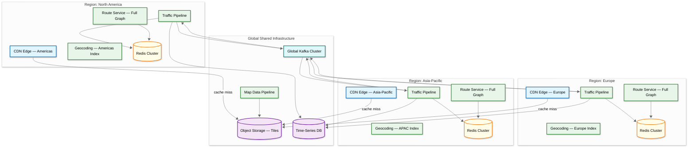

# Scalability & Reliability — Maps & Navigation Service

## Tile Serving Scalability

### CDN-First Architecture

The tile serving system inverts the traditional architecture. The CDN edge network is the **primary serving tier**, not a cache layer:

```
                    35M req/sec peak
                         │
            ┌────────────┴────────────┐
            │     CDN EDGE NODES      │
            │   (99%+ cache hit rate) │
            │   Multi-CDN for HA      │
            └────────────┬────────────┘
                    < 1% miss
                         │
            ┌────────────┴────────────┐
            │    ORIGIN TILE SERVERS  │
            │   (< 350K req/sec)      │
            └────────────┬────────────┘
                         │
            ┌────────────┴────────────┐
            │    OBJECT STORAGE       │
            │   (tiles/z/x/y.mvt)     │
            └─────────────────────────┘
```

**Multi-CDN strategy**: Deploy across two CDN providers simultaneously for resilience. If one CDN experiences an outage, DNS-based failover routes to the other within seconds.

### Tile Cache Warming

After a data pipeline run generates new tiles, **proactively push** popular tiles to CDN edge nodes:
- Zoom 0–12 tiles for the entire planet (~17M tiles)
- Zoom 13–16 tiles for top 500 cities (~100M tiles)
- This ensures the CDN cache is warm before users request tiles

### Offline Maps

For offline navigation, users download **region packages**:

| Region Size | Package Contents | Download Size |
|---|---|---|
| City (e.g., Manhattan) | Vector tiles zoom 0–16, road graph, POI, geocoding index | ~50–100MB |
| State/Province | Same, broader coverage | ~200–500MB |
| Country (e.g., France) | Same, full country | ~1–3GB |

Package structure:
- Compressed vector tiles for the region's bounding box
- Extracted road graph subgraph (for on-device routing)
- Geocoding index subset (addresses within region)
- POI database subset
- **Delta updates**: Client requests only changes since last sync, reducing bandwidth by 90%+

---

## Route Service Scalability

### Regional Graph Partitioning

The planet's road graph (~120GB routing-optimized) can be partitioned for deployment:

**Strategy 1: Full Planet per Instance**
- Each Route Service instance holds the entire planet graph in memory
- Simplest architecture; any instance handles any query
- Requires machines with 128GB+ RAM
- Suitable for smaller deployments

**Strategy 2: Regional Partitioning**
- Partition graph into regions (e.g., North America, Europe, Asia)
- Each region's graph fits in 15–30GB RAM
- Cross-region queries handled by stitching regional results through **border nodes**
- Request router directs query to correct region based on origin/destination

**Strategy 3: Hierarchical Partitioning**
- Fine-grained partitions (country/state level) for local roads
- Global overlay graph with only highways and major roads
- Local queries stay within partition; long-distance queries use overlay graph
- This mirrors how Contraction Hierarchies naturally works

### Graph Update Strategy

When the road network changes (new road, closure, speed limit change):

1. **Build new CH** from updated graph (takes 2–4 hours for planet)
2. **Blue-green deployment**: New Route Service instances load new graph while old instances serve traffic
3. **Traffic switch**: Once new instances are healthy, route traffic to them
4. **Drain old instances**: Gracefully shut down after in-flight requests complete

**Frequency**: Full rebuild daily; critical changes (road closures) applied as graph patches within minutes using edge weight overrides in Redis.

---

## Traffic System Scalability

### Kafka-Based Ingestion

```
Probe Vehicles (3.3M updates/sec)
         │
    ┌────┴────┐
    │  KAFKA  │ — 128 partitions, partitioned by S2 cell ID
    │ CLUSTER │ — 3-day retention for replay
    └────┬────┘
         │
    ┌────┴──────────────────────────┐
    │   MAP MATCHING CONSUMERS      │
    │   (one consumer group per     │
    │    geographic region)          │
    │   ~50 consumer instances       │
    └────┬──────────────────────────┘
         │
    ┌────┴────┐
    │  REDIS  │ — Cluster with 64 shards
    │ CLUSTER │ — Sharded by edge_id
    └─────────┘
```

**Partition strategy**: Kafka messages partitioned by **S2 cell ID** of the GPS coordinates. This ensures all probes for the same geographic area go to the same consumer, enabling efficient batch map matching.

### Redis Cluster for Traffic Cache

- **64 shards** partitioned by edge_id hash
- Each shard holds speed data for ~25M edges
- **Read replicas**: 2 per shard for Route Service reads
- **Memory per shard**: ~2GB (current speeds) + ~5GB (2-hour history)
- **Eviction**: TTL-based; data older than 2 hours auto-expires
- **Pipeline writes**: Batch speed updates in groups of 100 for throughput

---

## Geocoding Scalability

### Spatial Database Scaling

- **Primary**: Spatial DB with full-text search index + geohash spatial index
- **Read replicas**: 4–6 per region (geocoding is 99%+ reads)
- **Regional deployment**: US replica set has detailed US addresses; European set has European addresses
- **Index strategy**: N-gram tokenization for fuzzy matching; geohash prefix for spatial queries; compound index for location-biased text search

### Autocomplete Optimization

Address autocomplete requires < 100ms response time. Separate infrastructure:
- **Prefix trie** built from popular queries and addresses
- **In-memory** on dedicated autocomplete servers
- **Top-K cache**: Cache results for the 100K most common prefixes
- **Progressive refinement**: Return results after 3+ characters typed

---

## Reliability Patterns

### Graceful Degradation Hierarchy

| Failure | Impact | Degradation Strategy |
|---|---|---|
| Traffic ingest pipeline down | No real-time speeds | Route using historical profiles (still accurate 80% of the time) |
| One CDN provider down | 50% edge capacity lost | DNS failover to second CDN within 30s |
| Route Service partition down | Cannot route in one region | Fallback to global overlay graph (less optimal but functional) |
| Geocoding DB primary down | No writes | Promote read replica; geocoding data rarely changes |
| Redis cluster shard down | Traffic data loss for some edges | Route using historical baseline for affected edges |
| Object storage outage | Cannot serve cache-miss tiles | CDN serves stale tiles (12-hour cache); offline maps on device |

### Disaster Recovery

| Component | Recovery Strategy | RTO | RPO |
|---|---|---|---|
| Tiles | Regenerate from source data; CDN cache buys time | < 4 hours (full rebuild) | 0 (source data intact) |
| Road graph | Rebuild from OSM data + CH preprocessing | < 6 hours | 0 (source data intact) |
| Traffic speeds | Restart consumers from Kafka (3-day retention) | < 30 min | < 5 min (Kafka offset) |
| Geocoding index | Rebuild from address database | < 2 hours | 0 (source DB replicated) |
| Navigation sessions | Sessions are ephemeral; clients can restart | Immediate | N/A (client has route) |

### Health Checks

```
Tile Service:    GET /health → verify object storage read + tile generation pipeline running
Route Service:   GET /health → verify graph loaded in memory + sample route computes in < 100ms
Geocoding:       GET /health → verify spatial DB query returns result for known address
Traffic Ingest:  Check Kafka consumer lag < 10,000 messages per partition
Navigation:      GET /health → verify session store read/write latency < 50ms
```

---

## Capacity Planning

### Route Service Sizing

```
Peak routing queries: 58K req/sec
CH query time per request: ~5ms CPU
With traffic weight lookup: ~20ms total
Single core throughput: 1000 / 20 = 50 req/sec
Cores needed: 58,000 / 50 = 1,160 cores

Assuming 32-core machines with 256GB RAM:
  Machines for compute: 1,160 / 32 = ~37 machines
  Memory per machine: 256GB (holds full planet graph + headroom)
  → Deploy: 50 machines (with 35% headroom for burst)
  → Spread across 3+ regions
```

### Tile Origin Server Sizing

```
Peak origin traffic (1% of 35M): ~350K req/sec
Tile generation time (cache miss): ~50ms for pre-existing, ~200ms for on-demand
Throughput per core: ~20 req/sec (worst case on-demand)
Cores needed: 350,000 / 20 = 17,500 cores (worst case, all on-demand)

Reality: 90%+ of origin hits find tile in object storage (50ms fetch)
  → Effective core need: ~2,000 cores for mixed workload
  → Deploy: ~80 machines (32 cores each) across regions
```

### Traffic Pipeline Sizing

```
Probe ingestion: 3.3M updates/sec
Map matching per trace: ~10ms CPU (batch of 10 points)
Throughput per core: ~100 traces/sec
Cores for map matching: 3,300,000 / 100 = 33,000 cores

Optimization: batch processing (10 traces per batch reduces overhead)
  → Effective: ~5,000 cores
  → Deploy: ~160 machines across regions, scaled as Kafka consumer group
```

---

## Multi-Region Architecture



**Key design**: Each region holds a **full copy of the planet's road graph** (120GB) so any region can route any query. Traffic data is region-specific (probes processed locally) but cross-region traffic is synchronized via the global Kafka cluster for border-crossing routes.

---

## Back-Pressure Mechanisms

### Tile Origin Back-Pressure

When tile origin servers are overloaded (CDN miss storms during data updates):

| Pressure Level | Trigger | Response |
|---|---|---|
| **Normal** | Origin CPU < 60% | Process all tile requests normally |
| **Elevated** | Origin CPU 60–80% | Defer on-demand generation for zoom > 18; serve 404 for ultra-high zoom |
| **Critical** | Origin CPU > 80% | Serve stale tiles from object storage (skip regeneration); queue regeneration |
| **Emergency** | Origin CPU > 95% or error rate > 5% | Return CDN-cached stale tiles for ALL requests; stop accepting cache-miss forwards |

### Traffic Pipeline Back-Pressure

```
FUNCTION adjustTrafficPipelinePressure():
    lag = kafka.getMaxConsumerLag()

    IF lag < 10_000:
        // Normal: process all probes with full map matching
        setProcessingMode(FULL)
    ELSE IF lag < 100_000:
        // Elevated: skip map matching for low-confidence GPS (accuracy > 30m)
        setProcessingMode(SKIP_LOW_QUALITY)
    ELSE IF lag < 1_000_000:
        // Critical: sample probes (process 1 in 5); still maintains coverage
        setProcessingMode(SAMPLE_20_PERCENT)
    ELSE:
        // Emergency: skip to latest offset; accept data loss
        kafka.seekToEnd()
        ALERT("Traffic pipeline emergency skip — data gap created")
```

### Route Service Back-Pressure

When Route Service is overloaded (peak traffic or graph reload):

1. **Shed alternative routes first** — Return only primary route (saves 2/3 of compute)
2. **Shed traffic weight lookups** — Route using static edge weights (faster, less accurate)
3. **Shed long-distance queries** — Return "service unavailable" for cross-continental routes; prioritize local
4. **Return cached routes** — For popular O-D pairs, serve cached routes from Redis (5-min TTL)

---

## Chaos Engineering Experiments

| # | Experiment | Hypothesis | Injection | Expected Behavior |
|---|---|---|---|---|
| 1 | **CDN provider failure** | Multi-CDN failover works within 30s | Kill all requests to primary CDN | DNS failover to secondary CDN; tile latency increases but stays < 200ms |
| 2 | **Route Service region down** | Cross-region routing handles overflow | Terminate all Route Service instances in one region | Load balancer redirects to nearest healthy region; latency increases by 50–100ms |
| 3 | **Redis cluster shard failure** | Traffic fallback to historical baselines | Kill 4 of 64 Redis shards | Route Service uses historical profiles for affected edges; ETA accuracy degrades to ±25% |
| 4 | **Kafka consumer lag spike** | Back-pressure sampling maintains coverage | Inject 10× normal probe volume | Consumers switch to sampling mode; traffic freshness degrades to 15 min but no data loss |
| 5 | **Object storage latency spike** | CDN cache absorbs impact | Add 2s latency to object storage reads | CDN continues serving cached tiles; origin miss rate increases but users unaffected |
| 6 | **Graph corruption canary** | Canary deployment catches bad graph | Deploy graph with 5% of edges removed | Canary smoke tests fail; automatic rollback; no user impact |

---

## Capacity Headroom and Pre-Scaling Calendar

```
FUNCTION preScaleForEvent(event):
    MATCH event.type:
        CASE "new_years_eve":
            // Global event: scale all regions
            scaleRouteService(multiplier=3, regions=ALL)
            prewarmCDN(topCities=100, zoomRange=[13, 18])
            scaleTrafficPipeline(multiplier=2, regions=ALL)
            scheduleAt(event.date - 6hours)

        CASE "major_sports_event":
            // City-level event: scale affected region
            region = getRegion(event.location)
            scaleRouteService(multiplier=2, regions=[region])
            prewarmCDN(
                center=event.location, radiusKm=10,
                zoomRange=[13, 18]
            )
            scheduleAt(event.date - 3hours)

        CASE "map_data_update":
            // Tile regeneration burst: scale origin
            scaleTileOrigin(multiplier=5)
            pauseCDNInvalidation()  // batch invalidations
            scheduleAt(event.date)
            resumeCDNInvalidation(after=1hour)  // stagger purges

        CASE "holiday_travel":
            // National event: scale routing + traffic
            scaleRouteService(multiplier=2, regions=[event.country_region])
            scaleTrafficPipeline(multiplier=2, regions=[event.country_region])
            scheduleAt(event.date - 12hours)
```

### Known Scaling Calendar

| Date | Event | Region | Pre-Scale Action |
|---|---|---|---|
| Jan 1 | New Year's Eve | Global | 3× Route + CDN pre-warm (100 cities) |
| Feb (variable) | Lunar New Year | APAC | 3× APAC Route + Traffic |
| Mar–Apr (variable) | Ramadan/Eid | MEA, SEA | 2× MEA Route; pre-warm POI tiles for mosques |
| Jul 4 | US Independence Day | NA | 2× NA Route + Traffic |
| Nov (last Thu) | US Thanksgiving | NA | 3× NA Route (heaviest US travel day) |
| Dec 25 | Christmas | Global (Western) | 2× global; pre-warm airport/station tiles |
| Daily 07:00–09:00 | Morning rush | Per-timezone | Auto-scale Route + Traffic 1.5× |
| Daily 16:00–19:00 | Evening rush | Per-timezone | Auto-scale Route + Traffic 2× |
