# Flight Booking System Design

## System Overview

A flight booking system---exemplified by Expedia, Kayak, Google Flights, and airline direct channels---orchestrates real-time flight search, fare comparison, seat inventory management, and ticket issuance across a fragmented ecosystem of Global Distribution Systems (GDS), airline-direct NDC APIs, and low-cost carrier portals. Kayak processes over 1 billion search queries per year; Expedia handles 750M+ annual searches. The core engineering challenge is the intersection of **GDS aggregation** (fan-out search across Amadeus, Sabre, Travelport, and airline-direct APIs with 500ms-2s latency per call), **inventory consistency** (ensuring the seat a user selects is still available when they pay, despite 100:1 search-to-book ratios), **fare complexity** (thousands of fare rules, 26 booking classes, dynamic pricing based on load factor and time-to-departure), and **regulatory compliance** (APIS reporting, PCI-DSS for payments, fare advertising rules, GDPR for passenger data). Unlike simpler e-commerce systems, flight booking depends on external authoritative systems (GDS/CRS) that control inventory, impose per-API-call costs, and introduce latency and reliability concerns that the OTA cannot fully control.

---

## Key Characteristics

| Characteristic | Description |
|---------------|-------------|
| **Read/Write Pattern** | Extremely read-heavy: 100:1 search-to-book ratio; searches fan out to 5+ external APIs per request |
| **Latency Sensitivity** | High---search p99 < 3s (aggregating multiple GDS sources); booking completion p99 < 5s |
| **Consistency Model** | Strong consistency for inventory and booking (GDS is authoritative); eventual consistency for search cache and price alerts |
| **External Dependency** | Very High---GDS systems (Amadeus, Sabre, Travelport) are external, expensive, and latency-variable |
| **Data Volume** | High---100M+ searches/day, 1M+ bookings/day, 365M+ PNRs/year |
| **Architecture Model** | Cache-first aggregation for search; saga-based orchestration for booking; event-driven for notifications and price alerts |
| **Fare Complexity** | Very High---26 fare classes, fare families, restrictions (refundability, change fees, min stay, advance purchase) |
| **Complexity Rating** | **Very High** |

---

## Quick Navigation

| Document | Description |
|----------|-------------|
| [01 - Requirements & Estimations](./01-requirements-and-estimations.md) | Functional/non-functional requirements, capacity planning, SLOs |
| [02 - High-Level Design](./02-high-level-design.md) | Architecture diagrams, data flow, key decisions |
| [03 - Low-Level Design](./03-low-level-design.md) | Data models, API design, algorithms (Step-by-step plan in plain English) |
| [04 - Deep Dive & Bottlenecks](./04-deep-dive-and-bottlenecks.md) | GDS integration, seat hold race conditions, fare rules engine, search caching |
| [05 - Scalability & Reliability](./05-scalability-and-reliability.md) | Horizontal scaling, circuit breakers, multi-region, saga patterns |
| [06 - Security & Compliance](./06-security-and-compliance.md) | PCI-DSS, GDPR, APIS compliance, fare advertising, threat model |
| [07 - Observability](./07-observability.md) | Metrics, alerting, distributed tracing, booking funnel analytics |
| [08 - Interview Guide](./08-interview-guide.md) | 45-min pacing, trade-offs, trap questions |
| [09 - Insights](./09-insights.md) | Key architectural insights, patterns, lessons |

---

## What Differentiates This from Related Systems

| Aspect | Flight Booking (This) | Hotel Booking | E-Commerce | Ride-Hailing (7.1) |
|--------|----------------------|---------------|------------|---------------------|
| **Inventory Source** | External (GDS/CRS is authoritative) | Internal (hotel owns inventory) | Internal (warehouse/catalog) | Internal (driver availability) |
| **Search Complexity** | Fan-out to 5+ external APIs per query | Single internal DB query | Single catalog query | Real-time geospatial index |
| **Pricing Model** | Dynamic: 26 fare classes, load factor, time-to-departure, competitor signals | Yield management (simpler) | Fixed catalog pricing | Surge pricing (real-time) |
| **Hold Pattern** | GDS seat hold with 15-min TTL, then ticket issuance | Soft hold, simpler confirmation | Cart with inventory reservation | No hold (instant match) |
| **Regulatory Burden** | Very High (APIS, fare rules, BSP/ARC, consumer protection) | Medium (local tax, cancellation policies) | Medium (consumer protection) | High (driver regulations) |
| **Booking Lifecycle** | Multi-step: search → hold → pay → ticket → PNR → check-in | Simple: search → book → confirm | Simple: cart → pay → ship | Real-time: request → match → trip |
| **Data Record** | PNR (shared across airlines, GDS, agents) | Reservation record (single hotel) | Order record | Trip record |

---

## Why This Problem Is Architecturally Unique

| Dimension | What Makes It Different |
|-----------|------------------------|
| **External authoritative inventory** | Unlike e-commerce or hotel booking where the platform owns inventory, flight booking depends entirely on external GDS/CRS systems — every read and write must account for latency, cost, and reliability of systems you do not control |
| **Per-API-call economics** | At $0.50-2.00 per GDS query, uncached search costs exceed $300M/day — caching is an economic survival requirement, not just a performance optimization |
| **Industry-specific record format** | The PNR is a 60-year-old shared record format that exists simultaneously across 3-5 systems (GDS, airline, agent, codeshare partner) — a distributed consistency problem solved before modern distributed systems theory |
| **Fare rule complexity** | ATPCO's 31 rule categories × 26 fare classes create a combinatorial pricing space unmatched by any other industry — requiring a dedicated rule engine |
| **Regulatory fragmentation** | APIS, GDPR, PCI-DSS, DOT fare advertising, EU 1008/2008, BSP settlement — compliance requirements from aviation, finance, and privacy regulators all simultaneously |
| **GDS-to-NDC transition** | The industry is mid-migration from 40-year-old EDIFACT-based GDS to modern NDC APIs — production systems must support both channels for years |
| **Perishable inventory with dynamic pricing** | An unsold seat on a departed flight has zero value; revenue management uses load factor + time-to-departure signals to maximize yield on perishable capacity |

---

## What Makes This System Unique

1. **External Authoritative Inventory**: Unlike most systems where the platform owns inventory, flight booking depends on GDS/CRS systems (Amadeus, Sabre, Travelport) that are external, charge per API call, have variable latency (500ms-2s), and are the single source of truth for seat availability. Every architectural decision must account for this external dependency.

2. **Fan-Out Search Aggregation at Scale**: A single user search triggers parallel requests to 5+ GDS and airline-direct APIs, each with different response formats, latencies, and reliability characteristics. The system must aggregate, deduplicate, normalize, and rank results---all within a 3-second latency budget.

3. **Two-Phase Booking with TTL-Based Seat Hold**: The booking process is inherently two-phase: first hold a seat in the GDS (creating a PNR), then complete payment and issue a ticket. The hold has a strict 15-minute TTL---if payment is not completed, the seat is released back to inventory. This creates a distributed state management challenge across GDS, local database, and payment processor.

4. **Fare Complexity as a Domain-Specific Rule Engine**: Aviation fare rules are among the most complex pricing structures in any industry. A single flight can have 26 fare classes, each with different prices, refund policies, change fees, minimum stay requirements, and advance purchase restrictions. The system must evaluate these rules at search time (for display), hold time (for validation), and post-booking (for changes/refunds).

5. **PNR as a Cross-System Shared Record**: The Passenger Name Record is not just a local database row---it is a shared record that exists simultaneously in the GDS, airline CRS, travel agent system, and potentially multiple airlines for multi-carrier itineraries. Changes must synchronize across all systems, and each system may assign its own record locator.

---

## Quick Reference: Scale Numbers

| Metric | Value | Notes |
|--------|-------|-------|
| Searches per day | ~100M | ~1,160/s average, ~11,600/s at peak |
| Bookings per day | ~1M | 100:1 search-to-book ratio |
| External API calls/sec (peak) | ~58,000 | 11,600 searches × 5 GDS/API providers |
| Seat inventory records | ~520M | 100K flights × 200 seats × 26 fare classes |
| PNRs per year | ~365M | 1M bookings/day × 365 days |
| GDS API latency | 500ms-2s | Variable, provider-dependent |
| Seat hold TTL | 15 minutes | GDS-enforced, non-negotiable |
| Fare classes per flight | Up to 26 | Y, B, M, Q, K, etc. |
| Search result cache TTL | 3-5 minutes | Fares change frequently |
| GDS market share | ~97% | Amadeus + Sabre + Travelport combined |

---

## Industry Context & Evolution (2024-2026)

| Trend | Impact on Architecture |
|-------|----------------------|
| **IATA ONE Order** | Replaces the fragmented PNR + EMD + E-ticket model with a single order record, simplifying data management but requiring migration from decades-old record formats |
| **Continuous Pricing (NDC Offers)** | Airlines moving from 26 discrete fare classes to dynamic continuous pricing — eliminating fare class buckets entirely; requires offer-level caching instead of fare-class caching |
| **AI-Powered Fare Prediction** | ML models predict fare trends (will price go up/down?), enabling "buy now or wait" recommendations; shifts search from pure aggregation to predictive advisory |
| **Sustainable Aviation Fuel (SAF) Surcharges** | New carbon offset and SAF surcharge line items in fare breakdowns; regulatory requirement in EU from 2025 |
| **Digital Identity & Biometric Boarding** | IATA One ID program enables passport-free boarding via biometric verification; booking systems must integrate with decentralized identity providers |
| **Airline Retailing Transformation** | Airlines becoming retailers: dynamic bundles (seat + bag + lounge), personalized offers based on loyalty tier and purchase history, post-booking upsell optimization |
| **Generative AI Travel Assistants** | Natural-language trip planning ("find me a week in Europe under $2000 with good food") driving conversational search interfaces alongside traditional form-based search |

---

## Related Patterns

| Related Topic | Relationship | Key Insight |
|---------------|-------------|-------------|
| [7.1 Uber/Lyft Ride-Hailing](../7.1-uber-lyft/) | **Dynamic pricing parallel** — Both systems price scarce perishable inventory in real-time; ride-hailing uses surge multipliers, aviation uses fare class yield management and load-factor curves |
| [7.4 Food Delivery System](../7.4-food-delivery-system/) | **Multi-party saga** — Both coordinate transactions across multiple independent parties (restaurant↔driver↔customer vs. airline↔GDS↔payment↔passenger); compensation logic differs but saga orchestration is structurally identical |
| [6.6 Ticketmaster](../6.6-ticketmaster/) | **Inventory contention** — Both face "last seat" race conditions on high-demand events; Ticketmaster uses queue-based fairness, aviation uses GDS-authoritative holds; both must prevent denial-of-inventory attacks |
| [8.1 Amazon E-Commerce](../8.1-amazon/) | **Cart-to-checkout pipeline** — Amazon's cart reservation pattern parallels seat holds; key difference is external vs. internal inventory authority |
| [1.5 Distributed Log-Based Broker](../1.5-distributed-log-based-broker/) | **Event backbone** — Booking lifecycle events (hold, pay, ticket, cancel) flow through the streaming platform for notification, analytics, and audit |
| [2.3 Elasticsearch Cluster](../2.3-elasticsearch-cluster/) | **Search indexing** — Flight schedule and route data indexed for fast filtering; the search index serves as L0 cache before GDS fan-out |
| [5.5 Payment Processing System](../5.5-payment-processing-system/) | **PCI-DSS scope** — Payment tokenization pattern shared directly; flight booking adds the complexity of split payments (fare + ancillaries), multi-currency, and airline BSP settlement |
| [12.13 Bot Detection System](../12.13-bot-detection-system/) | **Denial-of-inventory defense** — Bot detection techniques from 12.13 apply directly to preventing automated seat holding and fare scraping attacks |

---

## Design Dimensions at a Glance

```mermaid
%%{init: {'theme': 'neutral'}}%%
flowchart LR
    subgraph Search["Search Challenges"]
        direction TB
        S1[Fan-Out to 5+ GDS<br/>58K external calls/sec]
        S2[Cache-First Strategy<br/>80% hit rate target]
        S3[3-min TTL Freshness<br/>Re-verify at booking]
    end

    subgraph Booking["Booking Challenges"]
        direction TB
        B1[15-min Seat Hold<br/>GDS-enforced TTL]
        B2[Saga Orchestration<br/>Hold → Pay → Ticket]
        B3[Outbox Pattern<br/>Payment safety net]
    end

    subgraph Domain["Domain Challenges"]
        direction TB
        D1[26 Fare Classes<br/>31 Rule Categories]
        D2[PNR Cross-System<br/>Shared Record]
        D3[NDC Migration<br/>Hybrid GDS + Direct]
    end

    Search --> Booking --> Domain

    classDef search fill:#e8f5e9,stroke:#2e7d32,stroke-width:2px
    classDef booking fill:#fff3e0,stroke:#e65100,stroke-width:2px
    classDef domain fill:#f3e5f5,stroke:#6a1b9a,stroke-width:2px

    class S1,S2,S3 search
    class B1,B2,B3 booking
    class D1,D2,D3 domain
```

---

## Sources

- AltexSoft --- Flight Booking Process: Structure, Steps, and Key Systems
- AltexSoft --- PNR Explained: What's in a Passenger Name Record
- IATA --- New Distribution Capability (NDC) Standard
- IATA --- ONE Order Standard and Airline Retailing Transformation
- Amadeus --- Global Distribution System Architecture
- Expedia Engineering --- Micro Frontend Architecture and Flight Search Optimization
- Kayak/Aerospike --- Travel Search Caching at Scale (1B+ queries/year)
- Fetcherr --- Dynamic Pricing in Aviation: AI-Driven Revenue Management
- ICAO Doc 9944 --- Guidelines on Passenger Name Record Data
- ATPCO --- Fare Filing and Distribution Standards
- IATA --- Carbon Emissions Calculator Methodology
- Industry Statistics: Expedia Group 2024, Booking Holdings 2024
