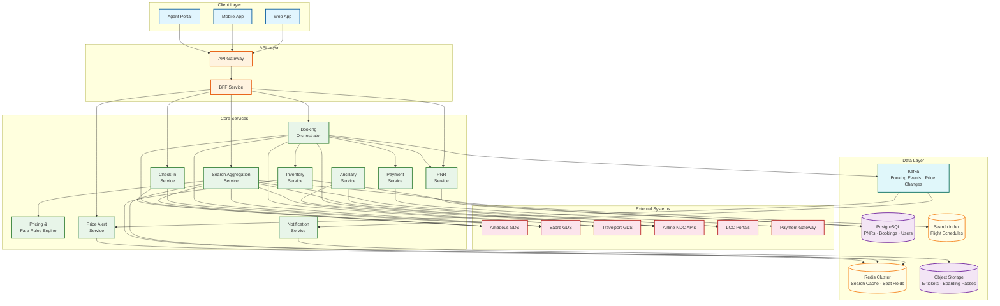
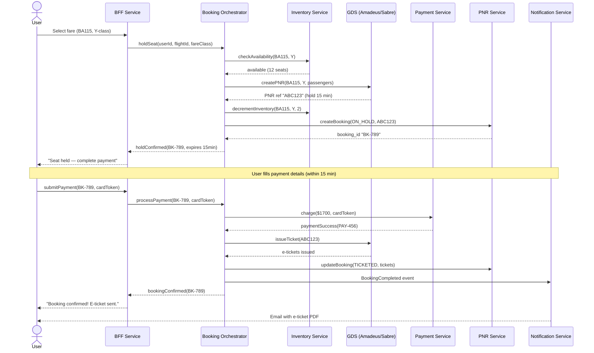
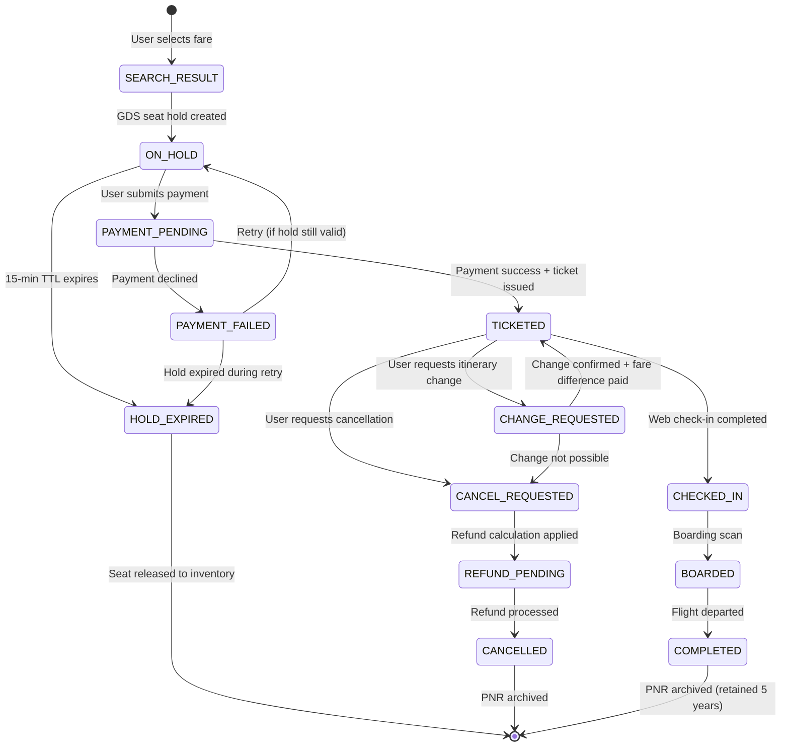
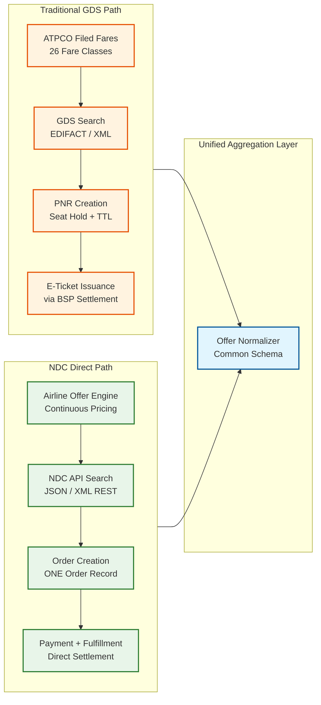
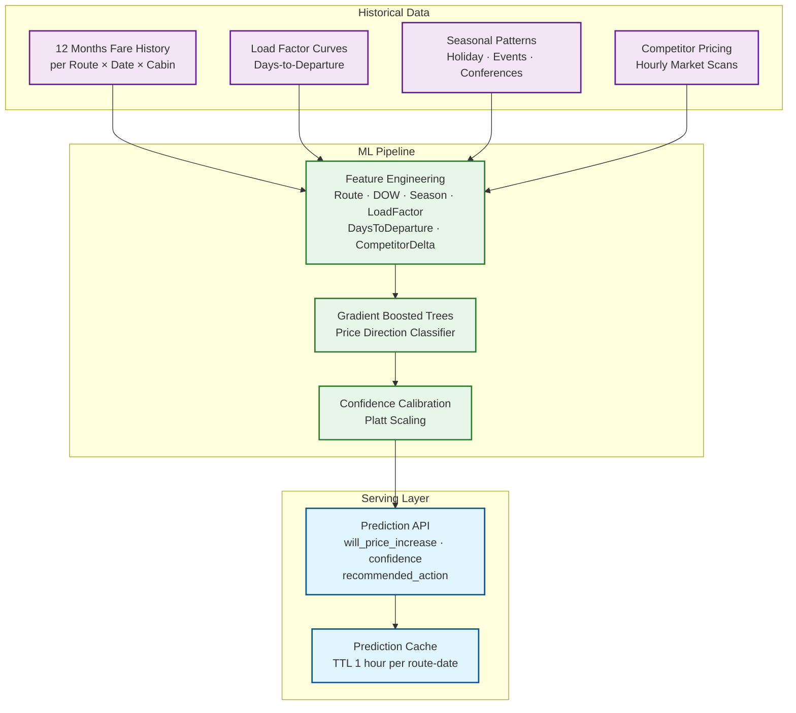
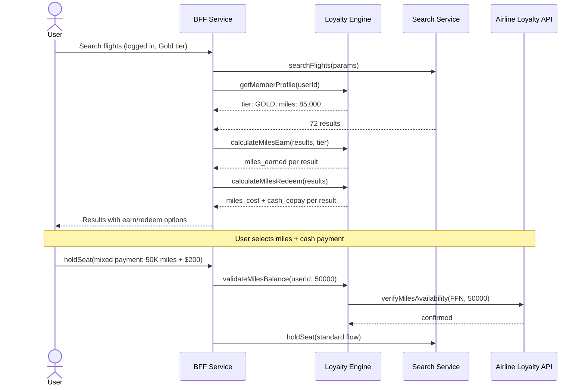

# High-Level Design

## Architecture Overview

The flight booking system follows a **cache-first aggregation** pattern for search and a **saga-based orchestration** pattern for booking. The architecture is shaped by three realities: (1) GDS systems are external, slow, and expensive; (2) inventory truth lives outside our system; (3) fare rules are extremely complex.



---

## Service Responsibilities

| Service | Responsibility | Key Characteristics |
|---------|---------------|---------------------|
| **Search Aggregation** | Fan-out to GDS/NDC APIs, aggregate, deduplicate, rank results | Stateless, cache-first, circuit-breaker-protected |
| **Pricing & Fare Rules** | Evaluate fare conditions, calculate total price with taxes, validate fare restrictions | Stateless, rule engine, ATPCO fare data |
| **Inventory Service** | Track seat availability per flight/fare-class, manage optimistic decrements | Sharded by flight, strong consistency |
| **Booking Orchestrator** | Coordinate hold → pay → ticket saga across services | Saga coordinator, compensating transactions |
| **PNR Service** | CRUD operations on PNR records, passenger data, itinerary changes | ACID transactions, audit logging |
| **Payment Service** | Tokenized payment processing, refund handling | PCI-DSS compliant, idempotent |
| **Notification Service** | Email/SMS/push for booking confirmation, check-in reminders, price alerts | Event-driven, async, template-based |
| **Ancillary Service** | Baggage, meals, seat upgrades, insurance upsell | Integrates with airline NDC for real-time ancillary pricing |
| **Check-in Service** | Web check-in, boarding pass generation, seat assignment finalization | GDS integration for DCS (Departure Control System) |
| **Price Alert Service** | Monitor fare changes for user-defined routes, trigger notifications | Background workers, fare cache polling |

---

## Data Flow 1: Flight Search

```
User searches: NYC → LON, Dec 15, 2 adults, Economy

1. API Gateway → BFF → Search Aggregation Service
2. Search Service computes cache key: hash("JFK-LHR-20241215-2-ECONOMY")
3. Check Redis L2 cache → cache HIT: return cached results (80% of cases)
4. Cache MISS: fan out parallel requests to:
   - Amadeus GDS API (timeout: 3s)
   - Sabre GDS API (timeout: 3s)
   - Travelport GDS API (timeout: 3s)
   - British Airways NDC API (timeout: 2s)
   - Norwegian LCC portal (timeout: 2s)
5. Collect responses (wait for all or timeout)
   - Amadeus responds in 800ms: 45 itineraries
   - Sabre responds in 1.2s: 38 itineraries
   - Travelport responds in 1.5s: 40 itineraries
   - BA NDC responds in 600ms: 12 itineraries
   - Norwegian timeout at 2s: 0 itineraries (circuit breaker notes failure)
6. Aggregate: 135 raw itineraries
7. Deduplicate by flight key (airline + flight number + departure time):
   - Same AA100 appears in Amadeus, Sabre, Travelport → keep lowest-priced source
   - Result: 72 unique itineraries
8. Pricing Service enriches with taxes, fare family details
9. Rank by: price (40%), duration (25%), stops (20%), airline preference (15%)
10. Cache in Redis with 3-min TTL
11. Return top 50 results to user (paginated, more on scroll)
```

---

## Data Flow 2: Booking Hold → Payment → Ticketing

```
User selects: BA115 JFK→LHR, Economy Y-class, $850

1. BFF → Booking Orchestrator: "Hold this fare"
2. Booking Orchestrator → Inventory Service: check local availability
   - FareInventory(BA115, Y-class).seats_available > 0 → proceed
3. Booking Orchestrator → GDS API: "Create PNR, hold 2 Y-class seats on BA115"
   - GDS returns: PNR ref "ABC123", hold expires in 15 min
4. Booking Orchestrator → Inventory Service: decrement local inventory (optimistic)
5. Booking Orchestrator → PNR Service: create local booking record
   - booking_id: "BK-789", status: ON_HOLD, pnr_code: "ABC123"
   - expires_at: now() + 15 min
6. Redis: set hold key with 15-min TTL
7. Return to user: "Seat held. Complete payment within 15 minutes."

--- User completes payment form ---

8. BFF → Booking Orchestrator: "Pay for BK-789"
9. Booking Orchestrator → Pricing Service: re-verify fare (price may have changed)
   - Same price → proceed
   - Price changed → return price-change modal to user
10. Booking Orchestrator → Payment Service: charge $1,700 (2 × $850)
    - Payment Service → Payment Gateway: tokenized charge
    - Payment Gateway returns: success, txn_ref "PAY-456"
11. Booking Orchestrator → GDS API: "Issue ticket for PNR ABC123"
    - GDS returns: e-ticket numbers "125-1234567890", "125-1234567891"
12. Booking Orchestrator → PNR Service: update booking
    - status: TICKETED, ticket_numbers populated
13. Booking Orchestrator → Kafka: publish BookingCompleted event
14. Notification Service (async): send confirmation email with e-ticket PDF
15. Redis: delete hold key (seat is now ticketed, not just held)
```

---

## Data Flow 3: Booking Sequence Diagram



---

## PNR / Booking Lifecycle State Diagram



---

## Key Architectural Decisions

| Decision | Choice | Rationale |
|----------|--------|-----------|
| **Search strategy** | Cache-first with fan-out on miss | GDS API calls are expensive ($0.50-2.00 each) and slow (500ms-2s); caching reduces cost by 80% |
| **Booking pattern** | Saga with compensating transactions | Multi-step process (hold → pay → ticket) across external systems; any step can fail; need rollback |
| **Inventory source of truth** | GDS (external) | Airline inventory lives in GDS/CRS; local inventory is a cached mirror for fast availability checks |
| **Seat hold mechanism** | GDS hold + Redis TTL | GDS hold is authoritative; Redis TTL ensures local cleanup if hold expires |
| **Search result deduplication** | Flight key (airline + number + time) | Same flight appears from multiple GDS; keep lowest-priced source |
| **Fare verification** | Re-verify at hold time | Cached search results may be 3-5 minutes stale; must verify before committing |
| **Payment tokenization** | Card-not-present via payment gateway | PCI-DSS scope minimization; booking system never sees raw card numbers |
| **Event streaming** | Kafka for booking lifecycle events | Decouples notification, analytics, price alerts from booking critical path |
| **GDS failover** | Circuit breaker per provider + cached fallback | If Amadeus fails, still serve results from Sabre + cache; degrade gracefully |

---

## NDC Offer & Order Architecture

The industry is transitioning from GDS-centric distribution to airline-direct NDC (New Distribution Capability). Production systems must support both channels simultaneously.



### NDC Design Decisions

| Decision | Choice | Rationale |
|----------|--------|-----------|
| **Offer caching** | Cache NDC offers by offer_id with 5-min TTL (longer than GDS because NDC offers are pre-computed by airline) | NDC offers are airline-specific; offer_id is stable for the TTL period |
| **Schema normalization** | Map both GDS fare classes and NDC offers to a unified internal Offer schema | Downstream services (booking, pricing display, analytics) should not know whether an offer came from GDS or NDC |
| **Fulfillment routing** | Route booking commands to the original source (GDS or NDC) based on offer metadata | Cannot mix: a GDS-originated fare must be booked through GDS; NDC offer through the airline's NDC API |
| **Fallback strategy** | If an airline's NDC API is unavailable, fall back to GDS for the same airline (if available via GDS) | Ensures coverage during NDC outages; GDS is the reliability backstop |
| **Continuous pricing** | Support price-per-offer (no fare class) for NDC airlines alongside fare-class pricing for GDS | NDC airlines increasingly use ML-driven continuous pricing without discrete Y/B/M classes |

---

## AI-Powered Fare Prediction Architecture



### Fare Prediction Design Principles

1. **Direction, not magnitude**: Predict whether fare will increase or decrease in the next 1-7 days — not the exact future price. This is significantly easier to calibrate and more useful for user decisions.

2. **Confidence threshold for display**: Only show "prices are likely to increase" when confidence > 75%. Below that threshold, display "prices are stable" to avoid creating false urgency.

3. **No liability**: Predictions are advisory only. The "buy now" recommendation carries a disclaimer and does not constitute a price guarantee. This is a legal and UX requirement.

4. **Model retraining**: Retrain weekly on the latest 12 months of data. Route-specific models for top 1,000 routes; regional pooled models for long-tail routes.

5. **A/B testing**: Measure whether fare prediction increases conversion rate (hold-to-book ratio) without increasing customer regret (post-purchase price drops).

---

## Loyalty & Miles Integration



### Mixed Payment Handling

| Payment Type | Processing | Settlement |
|-------------|-----------|------------|
| **Cash only** | Standard payment gateway | Gateway → OTA → BSP → Airline |
| **Miles only** | Debit miles from airline loyalty program | Airline internal; OTA receives commission |
| **Miles + Cash** | Split: miles debited first, then cash charged for remainder | Two-step: loyalty API debit + gateway charge; saga must compensate both on failure |
| **Points (OTA loyalty)** | OTA-managed points program; redeemed against OTA margin | OTA pays full fare to airline; absorbs points cost from own margin |

---

## Sustainability & Carbon Emissions Architecture

Flight search increasingly requires carbon emission data alongside fare and schedule information.

```
Carbon emission calculation:

Data sources:
├── ICAO Carbon Emissions Calculator: reference methodology for CO₂ per route
├── Airline-reported data: EcoTransIT, airline sustainability reports
├── Aircraft type efficiency: fuel burn per seat-km by aircraft model
└── Occupation rate: average load factor by route (higher load → lower per-pax emissions)

Calculation:
  CO₂ per passenger = (fuel_burn_per_km × distance × emission_factor) / (seats × load_factor)

Example: JFK → LHR (5,540 km)
├── Boeing 777-300ER: ~95 kg CO₂/pax (efficient wide-body, high load factor)
├── Boeing 767-300ER: ~120 kg CO₂/pax (older, less efficient)
├── Airbus A350-900:  ~85 kg CO₂/pax (latest generation, most efficient)
└── Display: "85-120 kg CO₂ per passenger" with aircraft comparison

Integration points:
├── Search results: add co2_per_passenger to each itinerary
├── Sort/filter: allow sort by emissions (alongside price, duration, stops)
├── Comparison: show "This flight emits 25% less CO₂ than average for this route"
├── Offset: offer carbon offset purchase as an ancillary (~$15-25 per flight)
└── SAF surcharge: display mandatory EU SAF surcharge (€2-8 per ticket, from 2025)
```

---

## Conversational Search (GenAI Interface)

```mermaid
flowchart LR
    subgraph Input["User Input"]
        NL[Natural Language Query<br/>"Find me a week in<br/>Tokyo under $1500"]
    end

    subgraph Processing["NL Processing"]
        INTENT[Intent Extraction<br/>Trip type · Dates · Budget<br/>Preferences · Constraints]
        PARAMS[Parameter Generation<br/>Origin · Destination · Dates<br/>Cabin · Filters]
    end

    subgraph Search["Standard Search"]
        API[Search API<br/>Standard structured query]
        RANK[AI Re-Ranking<br/>Match to stated preferences]
    end

    subgraph Response["AI Response"]
        SUMMARY[Conversational Summary<br/>"Here are 3 options for<br/>Tokyo, all under $1500..."]
    end

    NL --> INTENT --> PARAMS --> API --> RANK --> SUMMARY

    classDef input fill:#e1f5fe,stroke:#01579b,stroke-width:2px
    classDef process fill:#e8f5e9,stroke:#2e7d32,stroke-width:2px
    classDef search fill:#fff3e0,stroke:#e65100,stroke-width:2px
    classDef resp fill:#f3e5f5,stroke:#6a1b9a,stroke-width:2px

    class NL input
    class INTENT,PARAMS process
    class API,RANK search
    class SUMMARY resp
```

### Design Principles for Conversational Search

| Principle | Implementation |
|-----------|---------------|
| **NL is input, not authority** | The LLM extracts parameters, but the actual search always runs through the standard structured API — no "hallucinated flights" |
| **Disambiguation over assumption** | If the query is ambiguous ("I want to go somewhere warm"), ask a clarifying question rather than guessing — "warm" could mean Cancún or Bangkok |
| **Preserve search economics** | Conversational search triggers the same cache-first pipeline; the LLM layer adds ~200ms for intent extraction but doesn't increase GDS calls |
| **Safety rails** | Never display fictional flight numbers, invented prices, or non-existent routes — all results must come from the search pipeline |

---

## Technology Choices

| Component | Technology | Rationale |
|-----------|-----------|-----------|
| **Primary Database** | PostgreSQL | ACID for bookings, PNRs, payments; strong consistency required |
| **Search Cache** | Redis Cluster | Sub-ms reads for cached search results; TTL support for expiry |
| **Flight Index** | Search index (inverted index) | Full-text search on routes, flexible filtering and ranking |
| **Event Streaming** | Kafka | Durable event log for booking events, price changes, audit trail |
| **Object Storage** | Cloud object storage | E-ticket PDFs, boarding passes, fare rule documents |
| **Seat Hold** | Redis (TTL keys) | Atomic set-with-expiry for hold management; auto-cleanup |
| **API Gateway** | Rate limiting, auth, routing | Protect GDS budget from abuse; route to appropriate BFF |
| **Circuit Breaker** | Per-provider breaker library | Isolate GDS failures; prevent cascade; enable fallback |
| **ML Serving** | Feature store + model inference service | Fare prediction, fraud scoring, search ranking personalization |
| **LLM Gateway** | Managed LLM API with rate limiting | Conversational search intent extraction; response generation |
