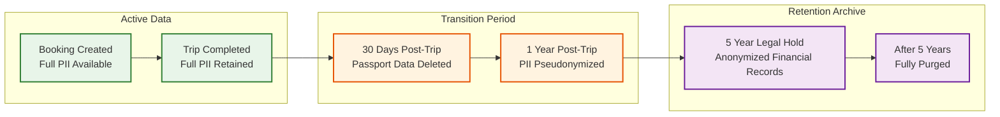

# Security & Compliance

## Authentication & Authorization

### User Authentication

```
Authentication flow:
├── Registration: email + password (bcrypt, cost factor 12)
├── Login: email/password → JWT access token (15 min) + refresh token (30 days)
├── MFA: optional TOTP for travel agents, mandatory for admin roles
├── Social login: Google, Apple (OAuth2 PKCE flow)
└── Session management: refresh token rotation on each use

JWT claims:
{
  "sub": "user-uuid",
  "role": "TRAVELER|AGENT|AIRLINE_ADMIN|PLATFORM_ADMIN",
  "permissions": ["search", "book", "manage_own_bookings"],
  "iss": "flight-booking-system",
  "exp": 1702300000,
  "iat": 1702299100
}
```

### API Authorization (RBAC)

| Endpoint | Traveler | Agent | Airline Admin | Platform Admin |
|----------|----------|-------|---------------|----------------|
| POST /search | Yes | Yes | Yes | Yes |
| POST /bookings/hold | Yes | Yes | No | No |
| GET /bookings/:id | Own only | Own + assigned | Airline flights | All |
| DELETE /bookings/:id | Own only | Own + assigned | No | All |
| GET /pnr/:code | Own only | Any | Airline PNRs | All |
| POST /checkin | Own only | Own + assigned | No | No |
| PUT /inventory | No | No | Own airline | All |
| GET /analytics | No | Commission report | Airline report | Full dashboard |

### GDS API Authentication

```
GDS connectivity:
├── Amadeus: OAuth2 client credentials + API key per agency (IATA code)
├── Sabre: SOAP WS-Security with X.509 certificate + session token
├── Travelport: Universal API with credentials + target branch
├── NDC airlines: mTLS (mutual TLS) with airline-issued certificates
└── All: API keys rotated quarterly, stored in secrets manager
```

---

## PCI-DSS Compliance

### Scope Minimization

The booking system **never sees raw card numbers**. Payment is handled through scope-minimizing architecture:

```
Payment flow (PCI-DSS SAQ A-EP):

1. Frontend loads payment gateway's JavaScript SDK
2. Card details entered directly into gateway's iframe/SDK
3. SDK tokenizes card → returns single-use token (e.g., "tok_visa_4242")
4. Token sent to Booking Service → forwarded to Payment Service
5. Payment Service calls gateway API with token
6. Gateway charges the card, returns transaction reference
7. Payment Service stores: token (masked), transaction ref, amount
   └── NEVER stores: full card number, CVV, expiry

Stored payment data:
├── Card token: "tok_visa_4242" (tokenized, cannot be reversed)
├── Last 4 digits: "4242" (for display only)
├── Card brand: "VISA"
├── Transaction reference: "ch_abc123"
└── Amount, currency, timestamp
```

### PCI Controls

| Control | Implementation |
|---------|---------------|
| Network segmentation | Payment Service runs in isolated network segment; no direct access from search/booking services |
| Encryption in transit | TLS 1.3 for all API calls; mTLS between Payment Service and gateway |
| No card data logging | Structured logging with automatic PII redaction; card fields never serialized |
| Access control | Payment Service accessible only via internal API gateway; no direct external access |
| Monitoring | Anomaly detection on payment patterns; alerts on unusual transaction volumes |
| Penetration testing | Annual PCI-DSS audit + quarterly ASV scans |

---

## PII Protection

### Sensitive Data Classification

| Data | Classification | Storage | Access |
|------|---------------|---------|--------|
| Passport number | **Critical PII** | AES-256-GCM encrypted at rest; dedicated encryption key | Booking creation, check-in, APIS reporting only |
| Date of birth | **PII** | Encrypted at rest | Booking creation, APIS reporting |
| Full name | **PII** | Plaintext (needed for search/display) | All booking-related services |
| Email / Phone | **PII** | Plaintext | Notification service, booking retrieval |
| Frequent flyer # | **Sensitive** | Encrypted at rest | Booking creation, airline sync |
| Payment tokens | **Sensitive** | Encrypted at rest | Payment service only |

### Encryption Architecture

```
Key management:
├── Master key: HSM-backed, never exported
├── Data encryption keys (DEKs): per-table, rotated monthly
├── Envelope encryption: DEKs encrypted by master key
└── Key rotation: zero-downtime re-encryption via background job

Field-level encryption:
├── passport_number_encrypted = AES-256-GCM(passport_number, DEK_passengers)
├── Indexed fields (email, pnr_code): use deterministic encryption for lookups
└── Search-incompatible fields (passport): use randomized encryption (more secure)
```

### Data Masking in Logs

```
Log sanitization rules:
├── Passport: "US12345678" → "US****5678"
├── Email: "john.doe@email.com" → "j***@e***.com"
├── Phone: "+1-555-123-4567" → "+1-555-***-4567"
├── Card token: never logged (excluded from structured log schema)
├── PNR code: logged as-is (needed for debugging, not PII by itself)
└── Full name: logged as-is (needed for support troubleshooting)
```

---

## GDPR Compliance

| Requirement | Implementation |
|-------------|---------------|
| **Right to Access** | GET /api/v1/users/:id/data-export → returns all PNR data, booking history, price alerts in JSON/CSV |
| **Right to Erasure** | DELETE /api/v1/users/:id/data → anonymize PII in bookings; delete price alerts; retain anonymized booking records for financial/legal compliance |
| **Data Portability** | Same as access; machine-readable JSON format |
| **Consent Management** | Explicit consent for marketing emails, price alert notifications; separate consent for data sharing with airlines |
| **Data Minimization** | Passport data only collected at booking (not search); deleted 30 days after trip completion |
| **Breach Notification** | Automated incident classification; 72-hour notification pipeline to DPA |
| **Retention Policy** | Active bookings: indefinite; completed trip PNR: 5 years (legal/financial); passenger PII: 1 year post-trip; search history: 90 days |

**Legal hold exception**: Completed flight PNRs cannot be deleted during the 5-year retention period due to aviation regulatory requirements (ICAO Annex 9, national border control laws).

### Data Retention Lifecycle



### Conflict Resolution: GDPR vs. Aviation Regulations

| Conflict | GDPR Says | Aviation Says | Resolution |
|----------|-----------|---------------|------------|
| Passenger data deletion | Right to erasure (Art. 17) | ICAO: retain PNR 5 years | Legal obligation exception (Art. 17(3)(b)); retain anonymized records |
| Purpose limitation | Data used only for stated purpose | APIS: share with border agencies | Legal obligation + public interest exemption |
| Data minimization | Collect only what's necessary | APIS: full passport details required | Collect at booking, delete 30 days post-trip |
| Cross-border transfers | Adequate protection required | US CBP: mandatory data sharing | Standard contractual clauses + necessity for contract performance |

---

## Aviation-Specific Compliance

### APIS (Advance Passenger Information System)

Airlines are legally required to transmit passenger data to destination country authorities before departure:

```
APIS data required:
├── Full name (as on passport)
├── Date of birth
├── Gender
├── Nationality
├── Passport number and expiry date
├── Country of issuance
├── Destination address (for US-bound flights)
└── Redress number / Known Traveler number (US)

Transmission timing:
├── US (CBP): 72 hours before departure (for Secure Flight)
├── EU (EES/ETIAS): at check-in or before departure
├── Other: varies by country (typically at check-in)

System responsibility:
├── Collect APIS data during booking (mandatory fields)
├── Validate format (ICAO MRTD format for names)
├── Transmit to airline's DCS (Departure Control System)
├── Airline DCS transmits to government authority
└── Store transmission confirmation for audit trail
```

### Fare Advertising Regulations

```
US DOT (Department of Transportation):
├── Must display total price including all mandatory taxes and fees
├── Must not display "base fare" without total prominently
├── Baggage fees must be disclosed before purchase
└── 24-hour free cancellation rule (for bookings made 7+ days before departure)

EU (Regulation 1008/2008):
├── Final price must be indicated at all times
├── Taxes, fees, charges, and surcharges must be broken down
├── Optional services clearly identified as such
└── Currency clearly stated
```

---

## Threat Model

### Threat 1: Seat Inventory Exhaustion (Denial of Inventory)

```
Attack: Bots repeatedly hold seats without completing payment, blocking legitimate users

Impact: Revenue loss from held-but-unpaid seats; actual customers see "sold out"

Mitigations:
├── Hold limit: max 3 active holds per user / IP / session
├── CAPTCHA: on booking hold page (invisible reCAPTCHA, escalate to challenge on suspicion)
├── Behavioral analysis: detect bot patterns (rapid sequential holds, no mouse movement)
├── Progressive TTL: first hold = 15 min, subsequent holds for same user = 10 min, 5 min
├── Device fingerprinting: track device ID across sessions
└── IP rate limiting: max 10 hold requests per IP per hour
```

### Threat 2: Price Scraping

```
Attack: Competitors or aggregators scrape all fares at high frequency

Impact: GDS cost explosion (each scrape triggers expensive API calls); competitive intelligence leak

Mitigations:
├── Rate limiting: 100 searches per IP per hour (tiered by user tier)
├── Bot detection: browser fingerprinting, JavaScript challenges
├── Search throttling: progressive delays for high-frequency searchers
├── Honeypot routes: detect scrapers by monitoring searches on fake routes
└── Legal: Terms of Service prohibit automated scraping; DMCA for cached fare data
```

### Threat 3: PNR Manipulation

```
Attack: Attacker modifies PNR to change passenger name, add segments, or cancel others' bookings

Impact: Unauthorized travel, financial loss, passenger safety risk

Mitigations:
├── PNR access: requires booking_id + user authentication (PNR code alone is insufficient)
├── Sensitive changes: name change, new segment → require re-authentication (step-up auth)
├── GDS change logging: all PNR modifications logged with user, timestamp, IP
├── Audit trail: immutable append-only log of all booking state changes
└── Anomaly detection: alert on unusual PNR modification patterns (bulk changes, name changes close to departure)
```

### Threat 4: Payment Fraud

```
Attack: Stolen credit cards used to book flights

Impact: Chargebacks, financial loss, regulatory scrutiny

Mitigations:
├── 3D Secure 2 (3DS2): strong customer authentication for card payments
├── ML fraud scoring: evaluate transaction risk based on passenger history, booking pattern, IP geolocation
├── Velocity checks: max 5 bookings per card per day, max $10,000 per card per week
├── AVS (Address Verification): match billing address with card issuer
├── Manual review queue: high-risk transactions flagged for human review before ticketing
└── Chargeback management: automated dispute response with booking evidence
```

---

## AI-Powered Fraud Detection

### ML Fraud Scoring Pipeline

```
Transaction risk scoring (runs at hold-time and payment-time):

Input features:
├── Booking velocity: bookings per user in last 24h / 7d / 30d
├── Route risk: one-way international departing within 24h (high risk)
├── Payment mismatch: billing country ≠ departure country ≠ IP country
├── Device signals: new device, VPN/proxy detected, browser fingerprint age
├── Passenger mismatch: passenger name ≠ account holder name
├── Historical: previous chargebacks, refund rate, booking-cancel ratio
├── Behavioral: time spent on search vs. booking (bots are fast)
└── Network: shared card across multiple accounts, IP clustering

Risk tiers:
├── LOW (score 0-30):    auto-approve, standard flow
├── MEDIUM (score 31-65): require 3DS2 authentication, log for review
├── HIGH (score 66-85):   require step-up verification + manual review queue
└── CRITICAL (score 86+): block transaction, flag account, alert fraud team

Model retraining:
├── Weekly retrain on confirmed fraud labels (chargebacks, investigations)
├── Feature drift monitoring: alert if IP-country distribution shifts > 20%
├── False positive target: < 2% of legitimate transactions flagged
└── False negative target: catch > 95% of confirmed fraud
```

### Chargeback Prevention

| Signal | Action | Impact |
|--------|--------|--------|
| Card used across 3+ accounts in 24h | Block card, notify all linked accounts | Prevents card testing attacks |
| First-time user + one-way international + departing <48h | Require 3DS2 + manual review | Catches stolen card fraud for high-risk itineraries |
| Booking modified to change passenger name post-payment | Block change, require re-authentication + ID verification | Prevents ticket transfer fraud |
| Multiple failed payment attempts followed by success | Log for review, add to monitoring list | Detects card cycling (testing stolen cards) |

---

## Digital Identity & Biometric Integration

### IATA One ID Vision (2025+)

```
Biometric boarding flow:

1. Booking: Traveler opts in to biometric processing
2. Identity verification: upload passport photo + live selfie
   ├── Document authenticity: NFC chip read (e-passport) or OCR + ML validation
   ├── Liveness check: anti-spoofing (depth, motion, texture analysis)
   └── Face match: compare passport photo to selfie (threshold: 99.5% match)
3. Biometric token: encrypted biometric template stored with airline
   ├── Storage: airline's DCS, NOT in OTA system (data minimization)
   ├── Token: OTA stores only a reference UUID, never biometric data
   └── Consent: explicit opt-in with withdrawal option at any time
4. Airport experience: face scan at check-in kiosk, bag drop, boarding gate
   ├── Replaces: passport inspection at each touchpoint
   └── OTA role: surface opt-in during booking, link to airline biometric enrollment

Privacy constraints:
├── GDPR Article 9: biometric data is "special category" — requires explicit consent
├── Biometric template: never stored by OTA (airline responsibility)
├── Right to withdraw: traveler can revoke at any time → fallback to manual document check
└── Jurisdictional limits: some countries prohibit biometric collection (varies by locale)
```

---

## Security Architecture Summary

```mermaid
flowchart TB
    subgraph Edge["Edge Security"]
        WAF[WAF<br/>Rate Limiting · SQLi · XSS]
        DDos[DDoS Protection<br/>L3/L4/L7]
        BOT[Bot Detection<br/>Device Fingerprint · CAPTCHA]
    end

    subgraph Transport["Transport Security"]
        TLS[TLS 1.3<br/>All Connections]
        MTLS[mTLS<br/>GDS · NDC · Payment Gateway]
    end

    subgraph App["Application Security"]
        AUTH[AuthN<br/>JWT · MFA · Refresh Rotation]
        AUTHZ[AuthZ<br/>RBAC · Row-Level Security]
        FRAUD[ML Fraud Scoring<br/>Real-time Risk Assessment]
    end

    subgraph Data["Data Security"]
        ENC[Encryption<br/>AES-256 at Rest · Field-Level PII]
        PCI[PCI Scope<br/>Tokenization · No Raw Cards]
        AUDIT[Audit Trail<br/>Tamper-Evident · PII-Redacted Logs]
    end

    subgraph Compliance["Compliance"]
        GDPR2[GDPR<br/>Consent · Erasure · Portability]
        APIS2[APIS<br/>Pre-Departure Passenger Data]
        FARE[Fare Rules<br/>DOT · EU 1008/2008]
    end

    Edge --> Transport --> App --> Data --> Compliance

    classDef edge fill:#fce4ec,stroke:#b71c1c,stroke-width:2px
    classDef transport fill:#e0f7fa,stroke:#00695c,stroke-width:2px
    classDef app fill:#e8f5e9,stroke:#2e7d32,stroke-width:2px
    classDef data fill:#f3e5f5,stroke:#6a1b9a,stroke-width:2px
    classDef comply fill:#fff3e0,stroke:#e65100,stroke-width:2px

    class WAF,DDos,BOT edge
    class TLS,MTLS transport
    class AUTH,AUTHZ,FRAUD app
    class ENC,PCI,AUDIT data
    class GDPR2,APIS2,FARE comply
```


