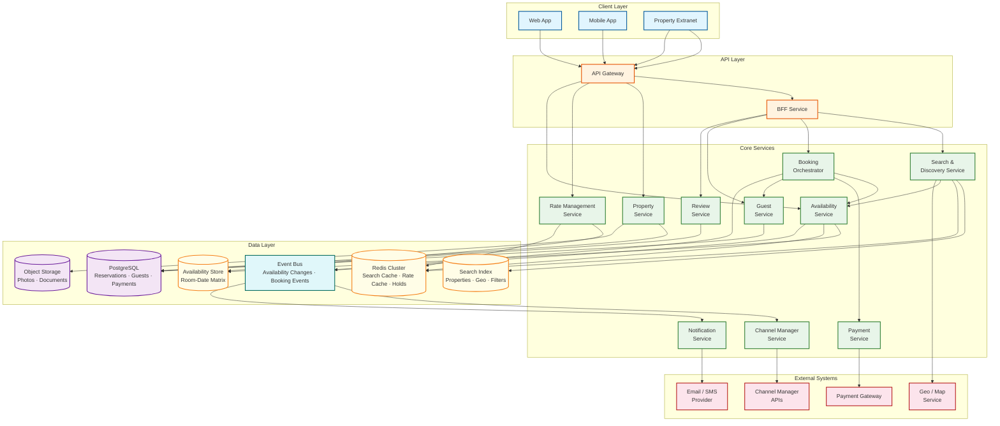
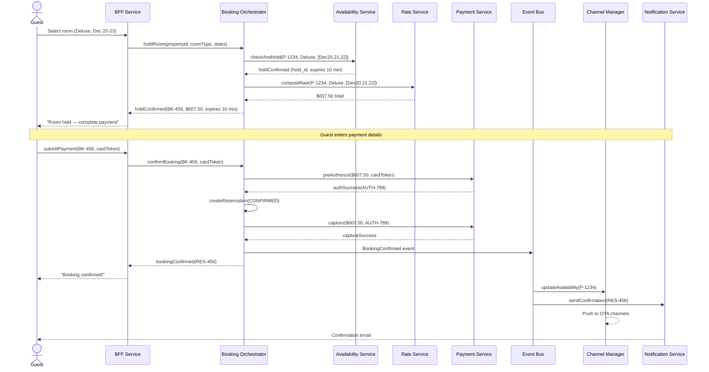
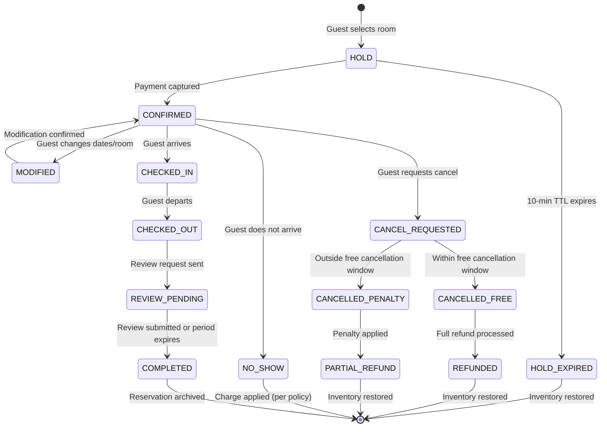
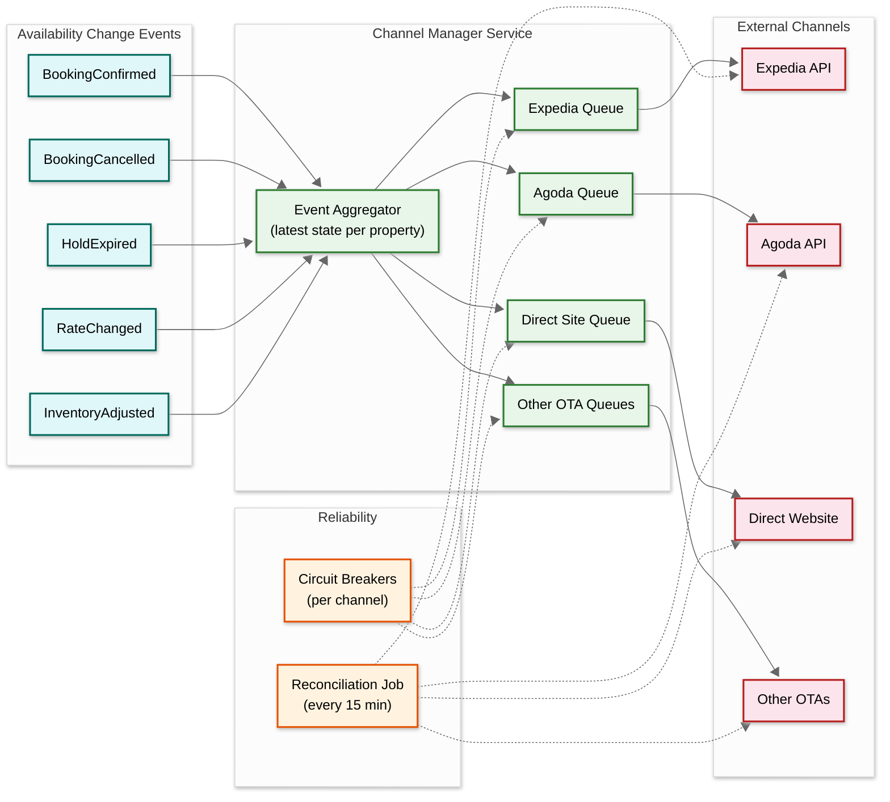
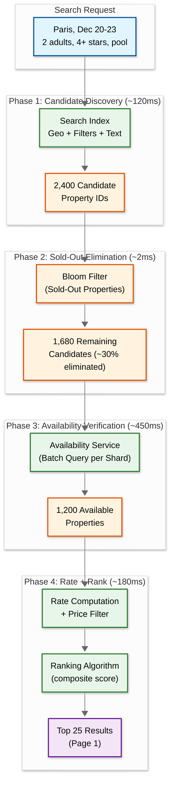

# High-Level Design

## Architecture Overview

The hotel booking system follows a **search-index-first** pattern for property discovery, an **event-driven availability propagation** pattern for inventory management, and a **saga-based orchestration** pattern for booking with payment. The architecture is shaped by three realities: (1) the platform is the authoritative inventory system and must guarantee consistency; (2) availability is a multi-dimensional calendar matrix that must be queried across date ranges; (3) rates and availability must synchronize across multiple distribution channels in near real-time.



---

## Service Responsibilities

| Service | Responsibility | Key Characteristics |
|---------|---------------|---------------------|
| **Search & Discovery** | Geo-based property search with filters (price, stars, amenities, review score), ranking, pagination | Stateless; reads from search index + availability cache |
| **Availability Service** | Manage room-date availability matrix; check availability for date ranges; atomic inventory decrement/increment | Sharded by property; strong consistency; in-memory hot data |
| **Rate Management** | Calculate applicable rate for a room type, dates, and guest profile; manage BAR, seasonal, LOS, promotional rates | Rule engine; reads rate plans from DB; caches computed rates |
| **Booking Orchestrator** | Coordinate hold → payment → confirmation saga; handle cancellations and modifications | Saga coordinator; compensating transactions; idempotent |
| **Payment Service** | Tokenized payment processing; pre-authorization, capture, refund | PCI-DSS compliant; idempotent; supports multiple gateways |
| **Property Service** | CRUD for property listings, room types, photos, amenities, policies | Standard CRUD; photo upload to object storage |
| **Review Service** | Verified stay review submission, moderation, aggregation, display | Write-behind aggregation; fraud detection |
| **Notification Service** | Email/SMS/push for booking confirmations, reminders, review requests | Event-driven; async; template-based; multi-channel |
| **Channel Manager Service** | Synchronize availability and rates to external OTA channels; receive inbound bookings | Event-driven; retry with backoff; circuit breaker per channel |
| **Guest Service** | Guest profiles, preferences, loyalty, booking history | Standard CRUD; PII encryption |

---

## Data Flow 1: Property Search

```
User searches: "Paris, Dec 20-23, 2 adults, 1 room"

1. API Gateway → BFF → Search & Discovery Service
2. Search Service builds query:
   - Geo filter: properties within Paris bounding box
   - Date range: Dec 20, 21, 22 (3 nights)
   - Guest capacity: rooms accommodating 2 adults
   - User filters: 4+ stars, pool, free cancellation, < $300/night
3. Search Index query: geo + amenities + stars + property type
   - Returns: 2,400 candidate property IDs
4. Availability Service: batch check availability for 2,400 properties
   - Check: room_type has available_count > 0 for ALL dates (Dec 20, 21, 22)
   - Result: 1,800 properties with at least one available room type
5. Rate Service: compute nightly rate for each available room type
   - Apply BAR for dates, check LOS discounts (3-night stay may qualify)
   - Calculate total: nightly_rate × 3 + taxes + fees
   - Filter: total < $900 (3 nights × $300 max)
   - Result: 1,200 properties within budget
6. Ranking: sort by relevance score
   - Score = f(price_competitiveness, review_score, conversion_history,
              quality_score, commission_tier, recency_of_availability_update)
7. Return top 25 results (page 1) with:
   - Property name, thumbnail, star rating, review score, distance
   - Best available rate, total price, cancellation policy
   - "Only 2 rooms left!" urgency indicator (if applicable)
8. Cache result set in Redis with 60s TTL for pagination
```

---

## Data Flow 2: Booking Flow (Hold → Pay → Confirm)

```
User selects: Hotel Le Marais, Deluxe Room, Dec 20-23, Non-refundable rate

1. BFF → Booking Orchestrator: "Hold this room"
2. Booking Orchestrator → Availability Service: check + hold
   a. Check: DeluxeRoom at property P-1234 available for Dec 20, 21, 22
   b. Atomic decrement: available_count -= 1 for each of the 3 dates
   c. Create hold record with 10-min TTL
   d. If any date unavailable → return SOLD_OUT, suggest alternatives
3. Booking Orchestrator → Rate Service: compute final price
   - Rate: $180/night × 3 nights = $540
   - Taxes: $540 × 12.5% = $67.50
   - Total: $607.50
4. Return to user: "Room held for 10 minutes. Total: $607.50"

--- User enters payment details ---

5. BFF → Booking Orchestrator: "Confirm booking BK-456"
6. Booking Orchestrator → Payment Service: pre-authorize $607.50
   - Payment Service → Payment Gateway: tokenized pre-auth
   - Gateway returns: auth_code "AUTH-789"
7. Booking Orchestrator → create reservation record
   - reservation_id: "RES-456", status: CONFIRMED
   - guest_id, property_id, room_type_id, check_in, check_out, rate_plan
8. Booking Orchestrator → Payment Service: capture $607.50
   - Capture against auth_code "AUTH-789"
9. Booking Orchestrator → Event Bus: publish BookingConfirmed event
10. Channel Manager Service (async): push availability update to all OTA channels
11. Notification Service (async): send confirmation email with booking details
12. Property Extranet: new booking appears in property manager's dashboard
```

---

## Data Flow 3: Booking Sequence Diagram



---

## Reservation Lifecycle State Diagram



---

## Key Architectural Decisions

| Decision | Choice | Rationale |
|----------|--------|-----------|
| **Inventory authority** | Platform-owned (not external) | Unlike flights (GDS), the platform directly manages hotel inventory; enables strong consistency without external dependency |
| **Availability storage** | Sharded relational DB + in-memory cache | Calendar matrix requires range queries and atomic multi-row updates; sharded by property for write isolation |
| **Search strategy** | Search index for discovery + availability service for filtering | Search index handles geo + text + filters; availability service handles date-range inventory checks |
| **Booking pattern** | Saga with pre-authorization | Hold inventory → pre-authorize payment → confirm → capture; rollback if any step fails |
| **Hold mechanism** | Soft hold with TTL (10 min) | Platform-managed hold; auto-release prevents inventory lockup from abandoned bookings |
| **Channel sync** | Event-driven push (not polling) | BookingConfirmed events trigger immediate availability pushes to all channels |
| **Rate computation** | On-demand with caching | Rates depend on date, LOS, guest profile; computed per request but cached for search results |
| **Overbooking** | Configurable per property | Property managers set overbooking tolerance (e.g., 5%); availability service accounts for this |
| **Payment model** | Pre-authorize → capture (not direct charge) | Pre-auth at booking; capture at check-in or booking time (per property policy); enables easy refunds |
| **Event streaming** | Event bus for booking lifecycle events | Decouples channel sync, notifications, analytics from booking critical path |

---

## Channel Sync Architecture

The channel manager must keep availability synchronized across all OTA channels within seconds of any inventory change:



### Channel Sync Protocol

```
FUNCTION processAvailabilityEvent(event):
    property_id = event.property_id
    room_type_id = event.room_type_id
    affected_dates = event.dates

    // Get current authoritative availability
    current_availability = availability_service.getAvailability(
        property_id, room_type_id, affected_dates
    )

    // Get all mapped channels for this property
    channels = channel_mapping.getChannels(property_id)

    FOR channel IN channels:
        IF circuit_breaker(channel).is_open:
            // Queue for later; the latest state will be sent when circuit closes
            deferred_queue.enqueue(channel, property_id, current_availability)
            CONTINUE

        TRY:
            channel.pushAvailability(property_id, room_type_id,
                affected_dates, current_availability)
            metrics.record("channel_sync_success", channel.name)
        CATCH timeout_or_error:
            circuit_breaker(channel).record_failure()
            retry_queue.enqueue(channel, property_id, current_availability,
                retry_count = 0, max_retries = 5)
            metrics.record("channel_sync_failure", channel.name)
```

---

## Rate Management Decision Tree

```mermaid
---
config:
  theme: neutral
  look: neo
---
flowchart TB
    START["Rate Request<br/>(property, room, dates, guest)"] --> CHECK_CLOSED{"Closed to Arrival<br/>on check-in date?"}
    CHECK_CLOSED -->|"Yes"| NO_RATE["Rate: NOT_AVAILABLE"]
    CHECK_CLOSED -->|"No"| CHECK_MIN{"Meets Minimum<br/>Stay requirement?"}
    CHECK_MIN -->|"No"| NO_RATE
    CHECK_MIN -->|"Yes"| GET_BAR["Get BAR<br/>(Best Available Rate)"]
    GET_BAR --> CHECK_SEASONAL{"Seasonal<br/>Override?"}
    CHECK_SEASONAL -->|"Yes"| APPLY_SEASON["Apply Seasonal Rate"]
    CHECK_SEASONAL -->|"No"| CHECK_LOS{"LOS Discount<br/>Eligible?"}
    APPLY_SEASON --> CHECK_LOS
    CHECK_LOS -->|"Yes"| APPLY_LOS["Apply Length-of-Stay<br/>Discount (5-15%)"]
    CHECK_LOS -->|"No"| CHECK_ADVANCE{"Advance Purchase<br/>Eligible?"}
    APPLY_LOS --> CHECK_ADVANCE
    CHECK_ADVANCE -->|"Yes"| APPLY_ADVANCE["Apply Advance<br/>Purchase Discount"]
    CHECK_ADVANCE -->|"No"| CHECK_MEMBER{"Loyalty Member?"}
    APPLY_ADVANCE --> CHECK_MEMBER
    CHECK_MEMBER -->|"Yes"| APPLY_MEMBER["Apply Member Rate<br/>(additional 5-10%)"]
    CHECK_MEMBER -->|"No"| CHECK_PROMO{"Active Promo<br/>Code?"}
    APPLY_MEMBER --> CHECK_PROMO
    CHECK_PROMO -->|"Yes"| APPLY_PROMO["Apply Promotional<br/>Discount"]
    CHECK_PROMO -->|"No"| CHECK_NONREFUND{"Non-Refundable<br/>Selected?"}
    APPLY_PROMO --> CHECK_NONREFUND
    CHECK_NONREFUND -->|"Yes"| APPLY_NR["Apply Non-Refundable<br/>Discount (10-15%)"]
    CHECK_NONREFUND -->|"No"| CALC_TOTAL["Calculate Total<br/>(nightly × nights + taxes)"]
    APPLY_NR --> CALC_TOTAL
    CALC_TOTAL --> FINAL["Return Final Rate<br/>with Breakdown"]

    classDef start fill:#e1f5fe,stroke:#01579b,stroke-width:2px
    classDef check fill:#fff3e0,stroke:#e65100,stroke-width:2px
    classDef apply fill:#e8f5e9,stroke:#2e7d32,stroke-width:2px
    classDef deny fill:#ffcdd2,stroke:#b71c1c,stroke-width:2px

    class START,FINAL start
    class CHECK_CLOSED,CHECK_MIN,CHECK_SEASONAL,CHECK_LOS,CHECK_ADVANCE,CHECK_MEMBER,CHECK_PROMO,CHECK_NONREFUND check
    class GET_BAR,APPLY_SEASON,APPLY_LOS,APPLY_ADVANCE,APPLY_MEMBER,APPLY_PROMO,APPLY_NR,CALC_TOTAL apply
    class NO_RATE deny
```



---

## Cancellation & Modification Flow

```
FUNCTION cancelBooking(reservation_id, guest_id):
    reservation = db.get(reservation_id)

    // Authorization check
    IF reservation.guest_id != guest_id:
        RETURN error("Not authorized")

    // Determine cancellation policy
    cancellation_deadline = reservation.check_in - reservation.free_cancel_hours

    IF NOW() < cancellation_deadline:
        // Free cancellation
        refund_amount = reservation.total_amount
        reservation.status = CANCELLED_FREE
    ELSE:
        // Penalty-based cancellation
        penalty = calculate_penalty(reservation)
        refund_amount = reservation.total_amount - penalty
        reservation.status = CANCELLED_PENALTY

    // Release inventory (atomic)
    availability_service.release(
        reservation.property_id,
        reservation.room_type_id,
        reservation.dates
    )

    // Process refund
    payment_service.refund(reservation.payment_ref, refund_amount)

    // Update reservation
    db.update(reservation)

    // Publish event (triggers channel sync + notification)
    event_bus.publish(BookingCancelled {
        reservation_id, property_id, dates, freed_inventory: 1
    })

    RETURN { refund_amount, penalty: reservation.total_amount - refund_amount }
```

---

## Search Flow Architecture



---

## Booking Saga: Compensating Transactions

The booking flow is a saga with explicit compensating actions at each step. If any step fails, all previous steps must be rolled back:

```
Saga Steps and Compensations:

Step 1: Hold Inventory
  Action:      Decrement available_count for each date
  Compensation: Increment available_count for each date (release hold)
  Failure mode: Inventory sold out → return SOLD_OUT, no compensation needed

Step 2: Verify Rate
  Action:      Confirm rate hasn't changed since search
  Compensation: Release hold (Step 1 compensation)
  Failure mode: Rate changed → return PRICE_CHANGED with new rate; guest can accept or abandon

Step 3: Pre-Authorize Payment
  Action:      Reserve funds on guest's card via payment gateway
  Compensation: Release hold (Step 1 compensation)
  Failure mode: Card declined → release hold, return PAYMENT_FAILED

Step 4: Create Reservation Record
  Action:      Insert reservation + room_night records in DB
  Compensation: Void pre-auth (Step 3 compensation) + release hold (Step 1 compensation)
  Failure mode: DB error → retry 3 times, then void pre-auth + release hold

Step 5: Capture Payment
  Action:      Charge guest's card (convert pre-auth to charge)
  Compensation: Refund payment + delete reservation + release inventory
  Failure mode: Capture fails → retry 3 times; if permanent failure, refund pre-auth

Step 6: Publish Events (async, non-saga)
  Action:      Publish BookingConfirmed to event bus
  Compensation: None (event consumers are idempotent)
  Failure mode: Event bus down → outbox pattern ensures eventual delivery
```

---

## Multi-Tenant Extranet Architecture

The property extranet supports multiple user roles per property, each with different permissions and data views:

```
Property Extranet Data Flow:

  Property Manager → Extranet API:
    ├── Manage Rooms & Photos (CRUD → Property Service)
    ├── Set Rates & Overrides (CRUD → Rate Management Service)
    ├── Adjust Availability (Update → Availability Service → Channel Sync)
    ├── View Bookings (Read → Reservation DB)
    ├── Respond to Reviews (Update → Review Service)
    └── View Analytics (Read → Analytics DB)

  Revenue Manager → Extranet API:
    ├── All Property Manager permissions
    ├── Configure Overbooking % (Update → Availability Service)
    ├── View Competitor Rates (Read → Rate Intelligence Service)
    ├── Set Promotional Campaigns (Create → Rate Management Service)
    └── View RevPAR / ADR / Occupancy (Read → Analytics DB)

  Channel Distribution:
    Every rate or availability change triggers:
      1. Validate change (business rules)
      2. Persist to database
      3. Publish AvailabilityChanged or RateChanged event
      4. Channel Manager pushes to all mapped channels (< 5s)
      5. Extranet shows sync status per channel
```

---

## Technology Choices

| Component | Technology | Rationale |
|-----------|-----------|-----------|
| **Primary Database** | PostgreSQL | ACID for reservations, guest records, payments; strong consistency required |
| **Availability Store** | PostgreSQL (sharded) + Redis cache | Availability matrix needs range queries; hot data cached in Redis for sub-ms reads |
| **Search Index** | Inverted index with geo support | Geo-search (bounding box, distance), full-text (property name, amenities), faceted filtering |
| **Cache Layer** | Redis Cluster | Search results cache, rate cache, hold management with TTL, session data |
| **Event Streaming** | Kafka | Durable event log for booking events, availability changes, channel sync triggers |
| **Object Storage** | Cloud object storage | Property photos (420 TB), documents, invoices |
| **API Gateway** | Rate limiting, auth, routing | Protect booking path, route to BFF, enforce rate limits per client |
| **CDN** | Edge caching | Property photos, static assets, cached search results for popular destinations |
